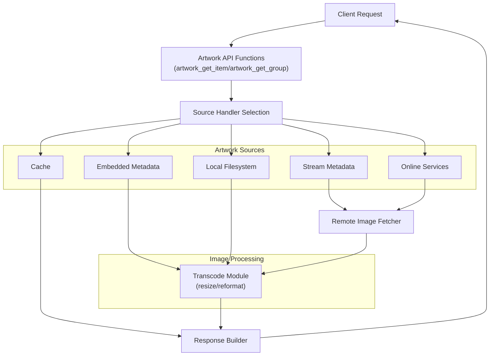
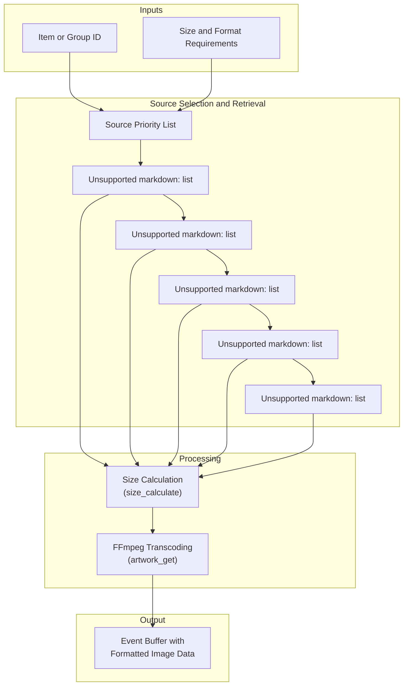
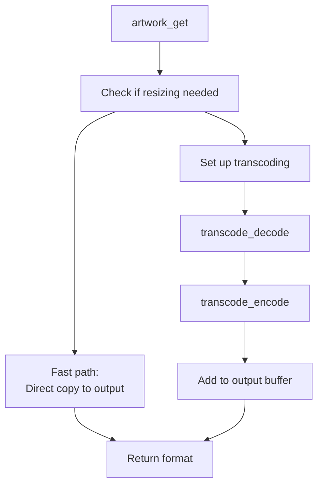
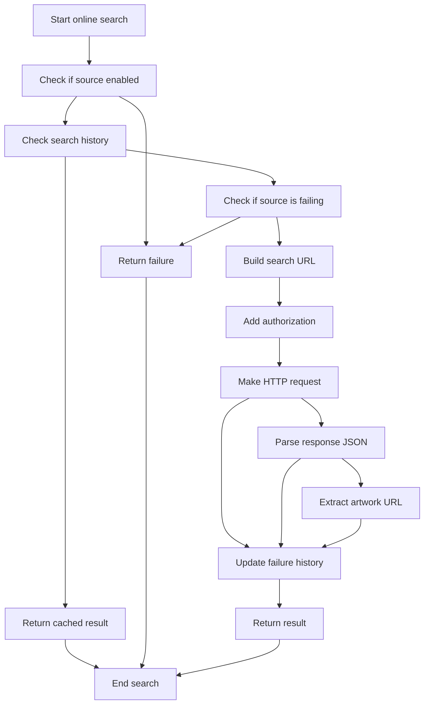
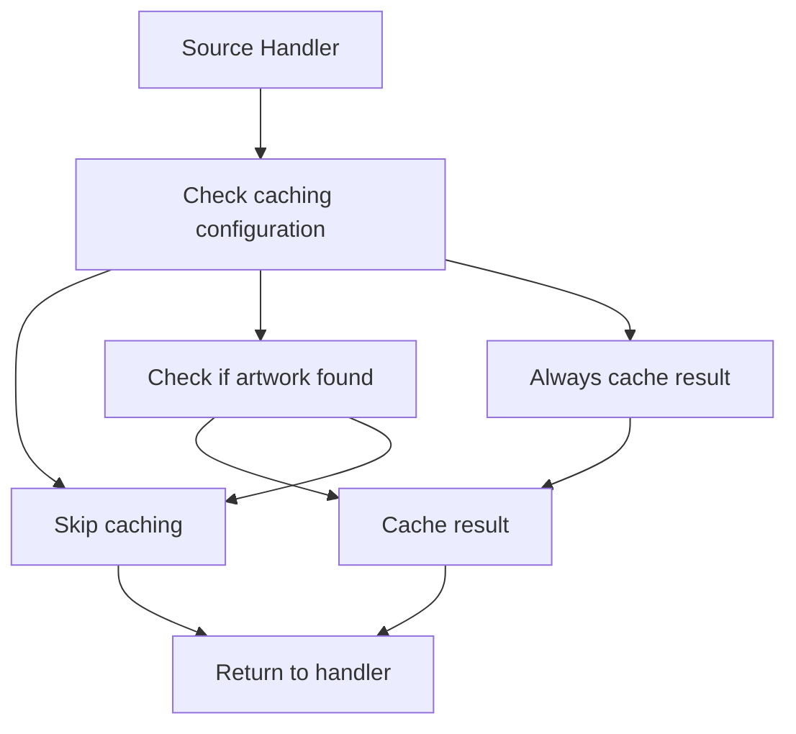

# Artwork Retrieval

> **Relevant source files**
> * [src/artwork.c](https://github.com/owntone/owntone-server/blob/23c67a3e/src/artwork.c)
> * [src/artwork.h](https://github.com/owntone/owntone-server/blob/23c67a3e/src/artwork.h)
> * [src/transcode.c](https://github.com/owntone/owntone-server/blob/23c67a3e/src/transcode.c)
> * [src/transcode.h](https://github.com/owntone/owntone-server/blob/23c67a3e/src/transcode.h)

## Purpose and Scope

This document describes the artwork retrieval system in OwnTone, which is responsible for finding, fetching, processing, and caching album artwork and cover images for media items. The system supports retrieving artwork from various sources, including embedded metadata in media files, local filesystem, and online services like Spotify, Discogs, and Cover Art Archive.

The artwork retrieval system provides capabilities for:

* Finding artwork for both individual items (tracks) and groups (albums/artists)
* Searching multiple sources in a defined priority order
* Rescaling and reformatting images to meet client requirements
* Caching results to improve performance

For information about how artwork is displayed in the web UI, see [Web Frontend](/owntone/owntone-server/6-web-frontend).

## System Overview



Sources: [src/artwork.c L37-L67](https://github.com/owntone/owntone-server/blob/23c67a3e/src/artwork.c#L37-L67)

 [src/artwork.c L217-L354](https://github.com/owntone/owntone-server/blob/23c67a3e/src/artwork.c#L217-L354)

 [src/artwork.h L15-L39](https://github.com/owntone/owntone-server/blob/23c67a3e/src/artwork.h#L15-L39)

## Artwork Data Flow



Sources: [src/artwork.c L217-L354](https://github.com/owntone/owntone-server/blob/23c67a3e/src/artwork.c#L217-L354)

 [src/artwork.c L605-L761](https://github.com/owntone/owntone-server/blob/23c67a3e/src/artwork.c#L605-L761)

 [src/artwork.c L552-L591](https://github.com/owntone/owntone-server/blob/23c67a3e/src/artwork.c#L552-L591)

## Artwork Sources

OwnTone uses a prioritized list of sources when searching for artwork. It tries each source in order until artwork is found. There are two sets of source handlers:

1. **Item Source Handlers** - For retrieving artwork for individual tracks
2. **Group Source Handlers** - For retrieving artwork for albums or artists

### Item Source Handlers

| Priority | Source | Handler | Description | Data Kinds | Media Kinds | Caching |
| --- | --- | --- | --- | --- | --- | --- |
| 1 | Cache | `source_item_cache_get` | Checks if artwork is already in cache | File, Spotify | All | On failure |
| 2 | Embedded | `source_item_embedded_get` | Extracts embedded artwork from media files | File, HTTP | All | On success & failure |
| 3 | Own | `source_item_own_get` | Searches for artwork files in media directory | File | All | On success & failure |
| 4 | Stream | `source_item_artwork_url_get` | Gets artwork URL from stream metadata | HTTP, Pipe | Music | Never |
| 5 | Pipe | `source_item_pipe_get` | Gets artwork from named pipes | Pipe | All | Never |
| 6 | Spotify Track | `source_item_spotifywebapi_track_get` | Gets artwork via Spotify Web API using track ID | Spotify | All | On success & failure |
| 7 | Playlist Own | `source_item_ownpl_get` | Backup for when stream doesn't provide artwork | HTTP | All | On success & failure |
| 8+ | Online Services | Various handlers | Searching online services like Spotify, Discogs, Cover Art Archive | File, HTTP, Pipe | Music | Varies |

### Group Source Handlers

| Priority | Source | Handler | Description | Caching |
| --- | --- | --- | --- | --- |
| 1 | Cache | `source_group_cache_get` | Checks if group artwork is already in cache | On failure |
| 2 | Directory | `source_group_dir_get` | Searches for artwork files in album directories | On success & failure |

Sources: [src/artwork.c L217-L354](https://github.com/owntone/owntone-server/blob/23c67a3e/src/artwork.c#L217-L354)

## Artwork Retrieval Process

```

```

Sources: [src/artwork.c L1735-L1808](https://github.com/owntone/owntone-server/blob/23c67a3e/src/artwork.c#L1735-L1808)

 [src/artwork.c L1836-L1922](https://github.com/owntone/owntone-server/blob/23c67a3e/src/artwork.c#L1836-L1922)

## Image Processing

When artwork is found, it may need to be resized or converted to a different format before being returned to the client. This is handled by the `artwork_get` function, which utilizes the transcoding module to perform the necessary transformations.



The resizing calculation is performed by the `size_calculate` function, which maintains the aspect ratio of the original image while ensuring it fits within the maximum dimensions requested by the client.

### Supported Image Formats

| Format | Constant | Description |
| --- | --- | --- |
| PNG | `ART_FMT_PNG` | Lossless image format |
| JPEG | `ART_FMT_JPEG` | Lossy compressed format |
| VP8 | `ART_FMT_VP8` | Video format (for thumbnails) |

Sources: [src/artwork.c L605-L761](https://github.com/owntone/owntone-server/blob/23c67a3e/src/artwork.c#L605-L761)

 [src/artwork.c L552-L591](https://github.com/owntone/owntone-server/blob/23c67a3e/src/artwork.c#L552-L591)

 [src/artwork.h L5-L7](https://github.com/owntone/owntone-server/blob/23c67a3e/src/artwork.h#L5-L7)

## Online Service Integration

OwnTone can retrieve artwork from multiple online sources, including Spotify, Discogs, and Cover Art Archive. To prevent excessive requests and improve performance, the system uses several strategies:

1. **Throttling** - Cooldown period after failures
2. **Caching** - Results are cached to avoid repeated requests
3. **Request deduplication** - Identical requests are not repeated



### Online Source Configuration

Each online source has a specific configuration that defines:

1. How to authenticate with the service
2. How to construct search requests
3. How to parse responses
4. How to extract artwork URLs

The system maintains search history for each online source to track failures and successes, which helps prevent flooding services with requests.

Sources: [src/artwork.c L1234-L1391](https://github.com/owntone/owntone-server/blob/23c67a3e/src/artwork.c#L1234-L1391)

 [src/artwork.c L369-L420](https://github.com/owntone/owntone-server/blob/23c67a3e/src/artwork.c#L369-L420)

## Caching Strategy

The artwork system uses a caching strategy to improve performance and reduce unnecessary processing or network requests. The caching behavior is configured for each source:



The cache stores both positive results (artwork found) and negative results (no artwork found) depending on the configuration. This helps avoid repeated searches for artwork that doesn't exist.

Sources: [src/artwork.c L76-L81](https://github.com/owntone/owntone-server/blob/23c67a3e/src/artwork.c#L76-L81)

 [src/artwork.c L217-L354](https://github.com/owntone/owntone-server/blob/23c67a3e/src/artwork.c#L217-L354)

## Error Handling

The artwork retrieval system uses the following error codes:

| Error Code | Value | Description |
| --- | --- | --- |
| `ART_E_NONE` | 0 | No artwork found |
| `ART_E_ERROR` | -1 | An error occurred while searching for artwork |
| `ART_E_ABORT` | -2 | Caller should abort artwork search |

Successful retrieval returns a positive value corresponding to the image format (`ART_FMT_*`).

Sources: [src/artwork.c L67-L70](https://github.com/owntone/owntone-server/blob/23c67a3e/src/artwork.c#L67-L70)

 [src/artwork.h L5-L7](https://github.com/owntone/owntone-server/blob/23c67a3e/src/artwork.h#L5-L7)