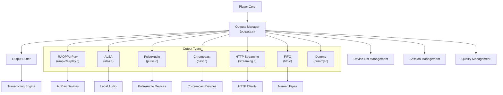
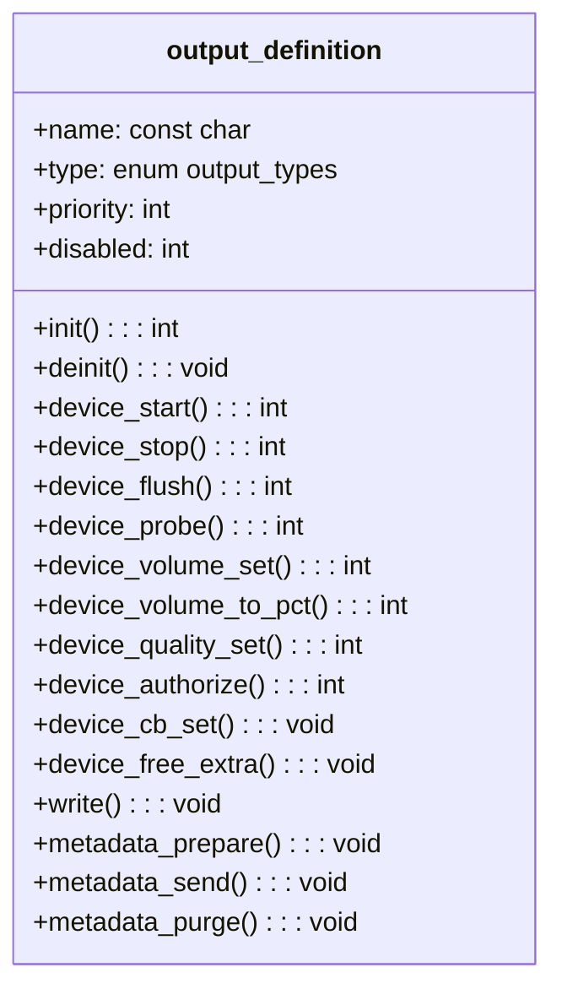
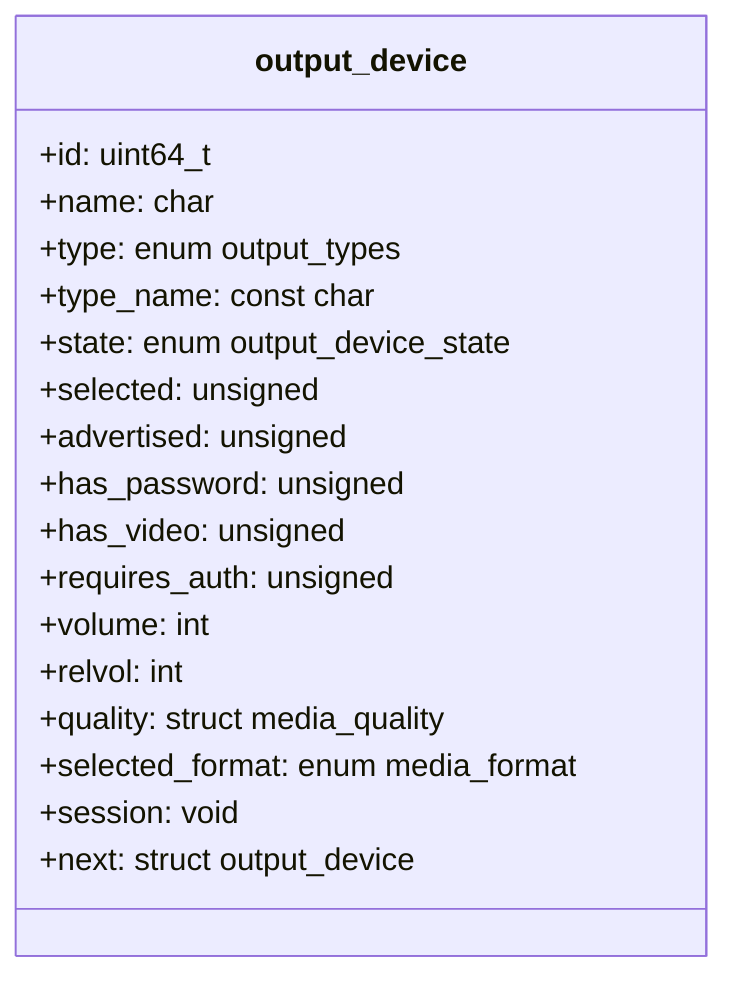
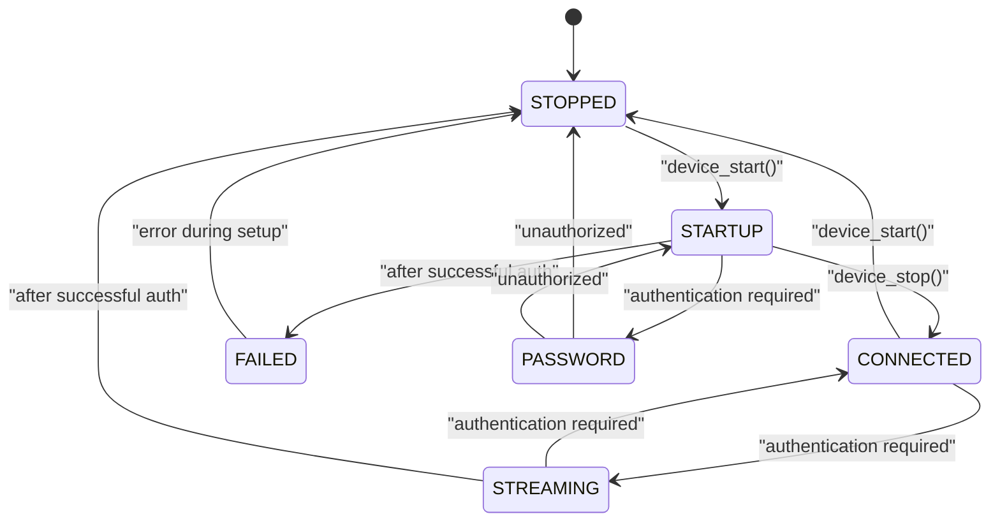
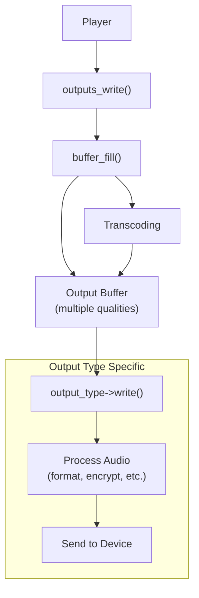
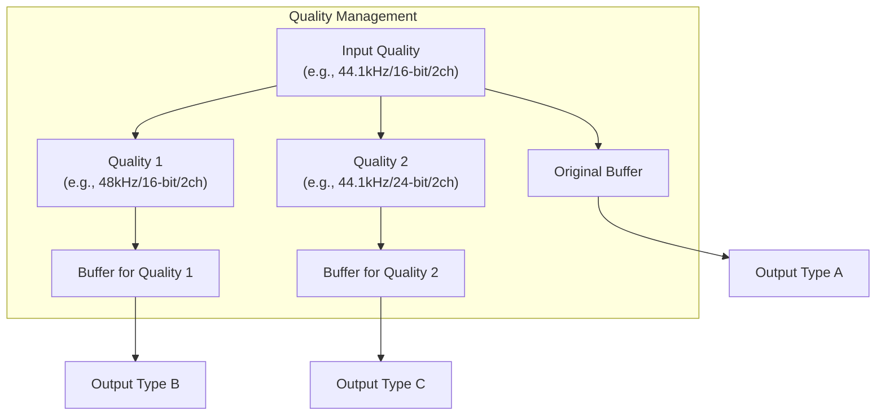
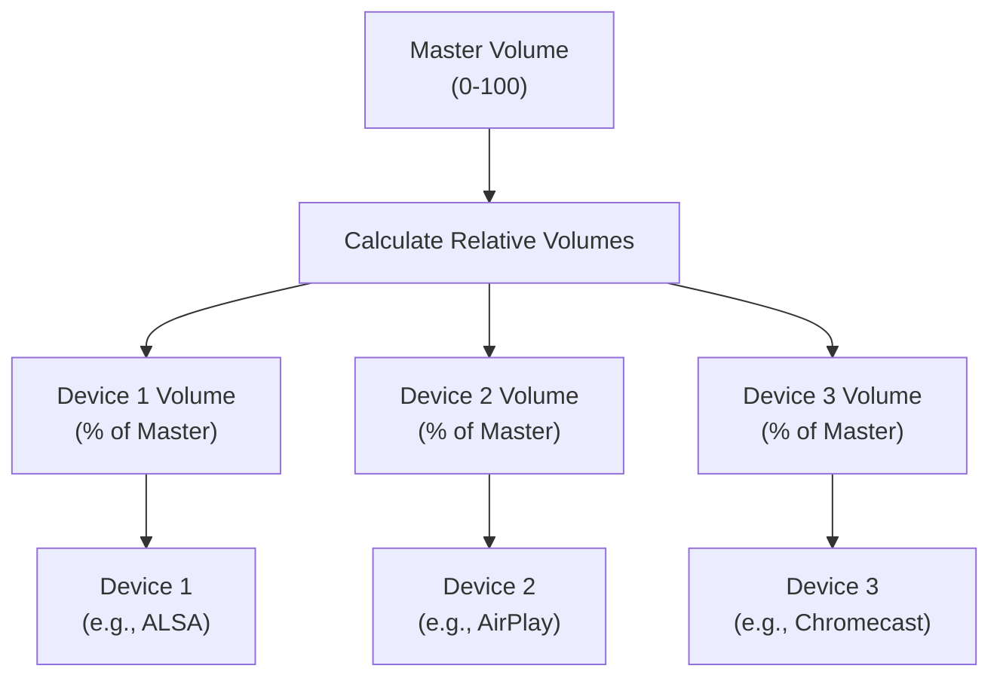

# Audio Output System

> **Relevant source files**
> * [src/outputs.c](https://github.com/owntone/owntone-server/blob/23c67a3e/src/outputs.c)
> * [src/outputs.h](https://github.com/owntone/owntone-server/blob/23c67a3e/src/outputs.h)
> * [src/outputs/airplay.c](https://github.com/owntone/owntone-server/blob/23c67a3e/src/outputs/airplay.c)
> * [src/outputs/alsa.c](https://github.com/owntone/owntone-server/blob/23c67a3e/src/outputs/alsa.c)
> * [src/outputs/cast.c](https://github.com/owntone/owntone-server/blob/23c67a3e/src/outputs/cast.c)
> * [src/outputs/dummy.c](https://github.com/owntone/owntone-server/blob/23c67a3e/src/outputs/dummy.c)
> * [src/outputs/fifo.c](https://github.com/owntone/owntone-server/blob/23c67a3e/src/outputs/fifo.c)
> * [src/outputs/pulse.c](https://github.com/owntone/owntone-server/blob/23c67a3e/src/outputs/pulse.c)
> * [src/outputs/raop.c](https://github.com/owntone/owntone-server/blob/23c67a3e/src/outputs/raop.c)

## Purpose and Scope

The Audio Output System is responsible for routing audio data from the player to various output devices. It provides a modular architecture where different output types (AirPlay, Chromecast, ALSA, etc.) implement a common interface, allowing the player to handle multiple simultaneous outputs with different capabilities. This document explains the architecture, data flow, and key components of the audio output system.

For information about specific output implementations like AirPlay or Chromecast, see their respective sections in the wiki.

## Architecture Overview

The Audio Output System consists of a central coordinator (`outputs.c`) that manages multiple output types. Each output type is implemented as a module that adheres to a common interface defined in `outputs.h`. The system maintains device lists, handles device sessions, manages audio quality and transcoding, and coordinates synchronization between outputs.

Sources: [src/outputs.c L1-L456](https://github.com/owntone/owntone-server/blob/23c67a3e/src/outputs.c#L1-L456)

 [src/outputs.h L1-L71](https://github.com/owntone/owntone-server/blob/23c67a3e/src/outputs.h#L1-L71)

## Output Definition Interface

All output types implement a common interface defined by the `output_definition` structure in `outputs.h`. This structure includes function pointers for initialization, device management, audio streaming, and metadata handling.

The `output_definition` structure defines the capabilities and behavior of each output type. Each implementation must provide functions for the required operations, allowing the outputs manager to interact with different types of outputs in a consistent way.

Sources: [src/outputs.h L200-L272](https://github.com/owntone/owntone-server/blob/23c67a3e/src/outputs.h#L200-L272)

## Supported Output Types

OwnTone supports various output types, each with different capabilities and priorities:

| Output Type | Description | Priority | Implementation File |
| --- | --- | --- | --- |
| RAOP | AirPlay 1 protocol (Remote Audio Output Protocol) | High | raop.c |
| AirPlay | AirPlay 2 protocol | High | airplay.c |
| Cast | Google Chromecast protocol | High | cast.c |
| ALSA | Advanced Linux Sound Architecture (local audio) | High | alsa.c |
| PulseAudio | PulseAudio sound system (local audio) | High | pulse.c |
| Streaming | HTTP streaming for remote clients | Medium | streaming.c |
| FIFO | Named pipes for integration with other applications | Medium | fifo.c |
| RCP | Remote Control Protocol | Medium | rcp.c |
| Dummy | Test/dummy output for debugging | Low | dummy.c |

Sources: [src/outputs.c L42-L78](https://github.com/owntone/owntone-server/blob/23c67a3e/src/outputs.c#L42-L78)

 [src/outputs.h L59-L76](https://github.com/owntone/owntone-server/blob/23c67a3e/src/outputs.h#L59-L76)

## Device and Session Management

### Device Representation

Output devices are represented by the `output_device` structure, which contains device information, state, and capabilities. The outputs manager maintains a linked list of available devices.

Sources: [src/outputs.h L97-L161](https://github.com/owntone/owntone-server/blob/23c67a3e/src/outputs.h#L97-L161)

### Session Lifecycle

When a device is selected for playback, a session is created to manage the connection. The session lifecycle typically follows these states:

Each output type implements its own session management, but generally follows this pattern. Sessions handle device setup, buffering, timing, and error recovery.

Sources: [src/outputs.h L79-L93](https://github.com/owntone/owntone-server/blob/23c67a3e/src/outputs.h#L79-L93)

 [src/outputs/raop.c L119-L142](https://github.com/owntone/owntone-server/blob/23c67a3e/src/outputs/raop.c#L119-L142)

 [src/outputs/cast.c L160-L178](https://github.com/owntone/owntone-server/blob/23c67a3e/src/outputs/cast.c#L160-L178)

 [src/outputs/alsa.c L77-L82](https://github.com/owntone/owntone-server/blob/23c67a3e/src/outputs/alsa.c#L77-L82)

## Audio Data Flow

The audio data flow in the output system involves several key steps:

1. The player calls `outputs_write()` with raw PCM audio data
2. The output system copies this data into an output buffer
3. If necessary, the data is transcoded to formats required by different outputs
4. Each active output receives the appropriate data through its `write()` function
5. The output-specific code processes and delivers the data to its devices

Sources: [src/outputs.c L378-L428](https://github.com/owntone/owntone-server/blob/23c67a3e/src/outputs.c#L378-L428)

 [src/outputs.h L190-L198](https://github.com/owntone/owntone-server/blob/23c67a3e/src/outputs.h#L190-L198)

## Quality Management and Transcoding

Different output types may require different audio qualities (sample rate, bit depth, and channels). The output system handles this through quality subscriptions:

1. Outputs subscribe to specific qualities using `outputs_quality_subscribe()`
2. The output system maintains a list of required qualities
3. When audio data arrives, it's transcoded to all required qualities
4. Each output receives data in its preferred quality

This approach minimizes transcoding operations while ensuring each output receives data in its optimal format.

Sources: [src/outputs.c L280-L324](https://github.com/owntone/owntone-server/blob/23c67a3e/src/outputs.c#L280-L324)

 [src/outputs.h L30-L36](https://github.com/owntone/owntone-server/blob/23c67a3e/src/outputs.h#L30-L36)

## Volume Control

The output system provides both global and per-device volume control:

1. Master volume affects all outputs (0-100 scale)
2. Device-specific relative volume (0-100% of master)
3. Device-specific absolute volume (converted to/from device's native scale)

Volume conversion between the internal 0-100 scale and device-specific scales is handled by device-specific functions like `device_volume_set()` and `device_volume_to_pct()`.

Sources: [src/outputs.c L541-L598](https://github.com/owntone/owntone-server/blob/23c67a3e/src/outputs.c#L541-L598)

 [src/outputs/alsa.c L315-L371](https://github.com/owntone/owntone-server/blob/23c67a3e/src/outputs/alsa.c#L315-L371)

## Callback System

The output system uses callbacks to handle asynchronous operations:

1. The player initiates an action (e.g., start a device)
2. The output manager registers a callback for when the operation completes
3. The output implementation performs the operation asynchronously
4. When complete, the output calls `outputs_cb()` with the result
5. The output manager then calls the registered callback

This allows for non-blocking operation while still providing synchronization points for the player.

Sources: [src/outputs.c L127-L199](https://github.com/owntone/owntone-server/blob/23c67a3e/src/outputs.c#L127-L199)

 [src/outputs.h L55](https://github.com/owntone/owntone-server/blob/23c67a3e/src/outputs.h#L55-L55)

## Implementation Details by Output Type

Each output type handles specific protocols and device types with varying behaviors:

### RAOP/AirPlay

Handles Apple AirPlay devices using RTSP/RTP protocols. Sets up streaming sessions, handles encryption, and manages timing synchronization.

Sources: [src/outputs/raop.c](https://github.com/owntone/owntone-server/blob/23c67a3e/src/outputs/raop.c)

 [src/outputs/airplay.c](https://github.com/owntone/owntone-server/blob/23c67a3e/src/outputs/airplay.c)

### ALSA

Provides direct access to local sound cards through the ALSA API. Manages buffer underruns, hardware parameters, and sample format conversion.

Sources: [src/outputs/alsa.c](https://github.com/owntone/owntone-server/blob/23c67a3e/src/outputs/alsa.c)

### PulseAudio

Connects to the PulseAudio sound server for local audio output. Manages streams, latency, and buffer attributes.

Sources: [src/outputs/pulse.c](https://github.com/owntone/owntone-server/blob/23c67a3e/src/outputs/pulse.c)

### Chromecast

Streams to Google Cast devices using WebRTC and the Cast protocol. Handles device discovery, session setup, and Opus encoding.

Sources: [src/outputs/cast.c](https://github.com/owntone/owntone-server/blob/23c67a3e/src/outputs/cast.c)

### FIFO

Writes audio data to named pipes for integration with other applications. Simple but effective for external processing.

Sources: [src/outputs/fifo.c](https://github.com/owntone/owntone-server/blob/23c67a3e/src/outputs/fifo.c)

## Conclusion

The Audio Output System provides a flexible and extensible framework for handling diverse audio outputs. Its modular design allows for adding new output types while maintaining a consistent interface for the player. The system handles the complexities of different protocols, formats, and timing requirements, providing a seamless audio experience across multiple devices.