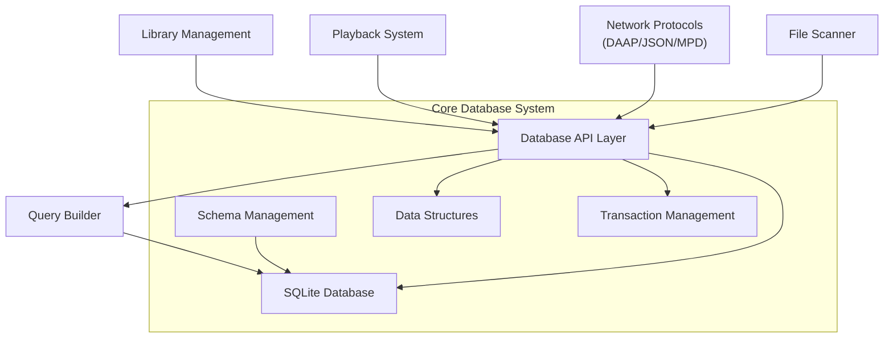
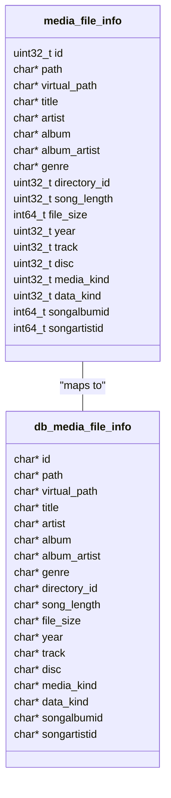
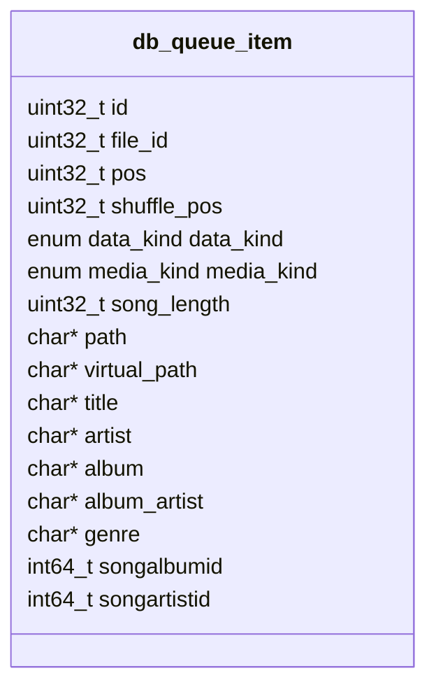
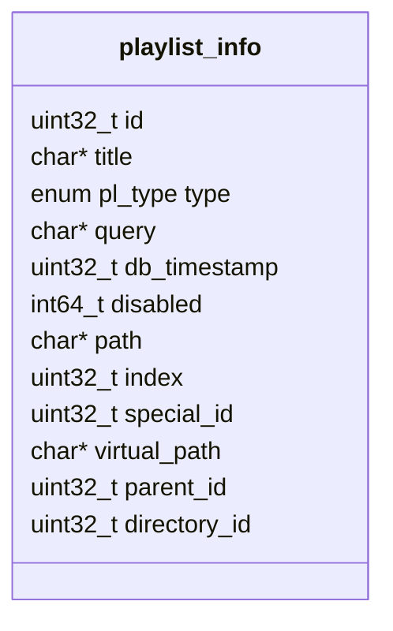
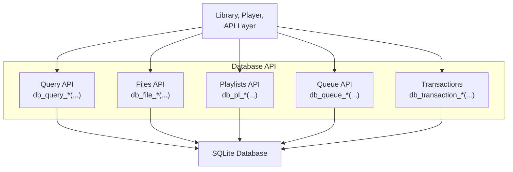
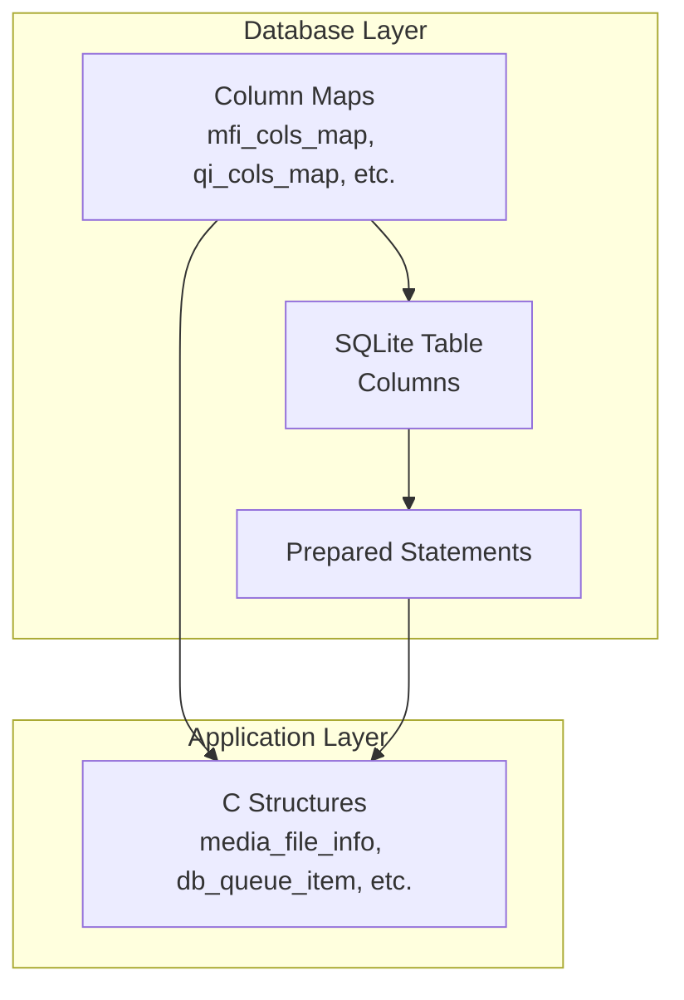
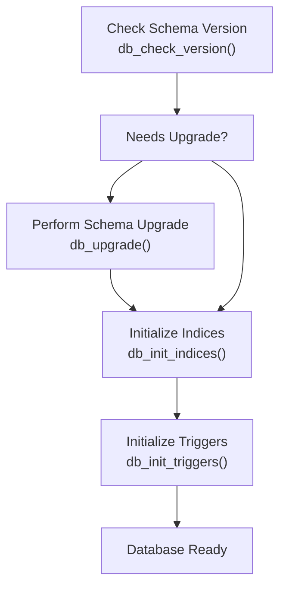
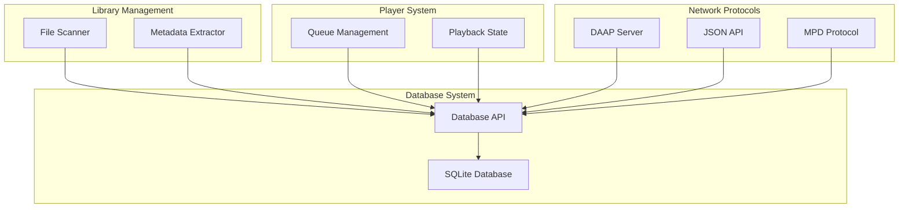

# Core Database System

> **Relevant source files**
> * [src/db.c](https://github.com/owntone/owntone-server/blob/23c67a3e/src/db.c)
> * [src/db.h](https://github.com/owntone/owntone-server/blob/23c67a3e/src/db.h)
> * [src/db_init.c](https://github.com/owntone/owntone-server/blob/23c67a3e/src/db_init.c)
> * [src/db_init.h](https://github.com/owntone/owntone-server/blob/23c67a3e/src/db_init.h)
> * [src/db_upgrade.c](https://github.com/owntone/owntone-server/blob/23c67a3e/src/db_upgrade.c)
> * [src/httpd_dacp.c](https://github.com/owntone/owntone-server/blob/23c67a3e/src/httpd_dacp.c)
> * [src/mpd.c](https://github.com/owntone/owntone-server/blob/23c67a3e/src/mpd.c)
> * [src/player.c](https://github.com/owntone/owntone-server/blob/23c67a3e/src/player.c)
> * [src/player.h](https://github.com/owntone/owntone-server/blob/23c67a3e/src/player.h)

The Core Database System provides the central data storage and retrieval mechanisms for OwnTone Server. This document describes the database architecture, schema, and APIs that power metadata storage for media files, playlists, queues and other persistent data. For specific information about the Library Management system built on top of this database, see [Library Management](/owntone/owntone-server/4-library-management).

## Overview

OwnTone uses SQLite as its database engine to store and manage all persistent data. The database system provides a robust foundation for storing media metadata, playlists, playback queue information, and configuration settings.



Sources: [src/db.c](https://github.com/owntone/owntone-server/blob/23c67a3e/src/db.c)

 [src/db.h](https://github.com/owntone/owntone-server/blob/23c67a3e/src/db.h)

## Database Schema

The database schema consists of multiple tables storing different types of data. Each table is designed with specific indices to optimize the common query patterns.

### Main Database Tables

| Table | Description |
| --- | --- |
| files | Stores media file metadata (artist, album, title, etc.) |
| playlists | Playlist information and smart playlist queries |
| playlistitems | Maps items to playlists |
| queue | Current playback queue state |
| speakers | Output device configuration |
| directories | Virtual directory structure |
| groups | Album and artist grouping information |
| pairings | Remote pairing information |
| admin | System settings and schema version |
| inotify | File system watch information |

Sources: [src/db_init.c](https://github.com/owntone/owntone-server/blob/23c67a3e/src/db_init.c)

 [src/db.h](https://github.com/owntone/owntone-server/blob/23c67a3e/src/db.h)

```css
#mermaid-m6u2zryelx{font-family:ui-sans-serif,-apple-system,system-ui,Segoe UI,Helvetica;font-size:16px;fill:#ccc;}@keyframes edge-animation-frame{from{stroke-dashoffset:0;}}@keyframes dash{to{stroke-dashoffset:0;}}#mermaid-m6u2zryelx .edge-animation-slow{stroke-dasharray:9,5!important;stroke-dashoffset:900;animation:dash 50s linear infinite;stroke-linecap:round;}#mermaid-m6u2zryelx .edge-animation-fast{stroke-dasharray:9,5!important;stroke-dashoffset:900;animation:dash 20s linear infinite;stroke-linecap:round;}#mermaid-m6u2zryelx .error-icon{fill:#333;}#mermaid-m6u2zryelx .error-text{fill:#cccccc;stroke:#cccccc;}#mermaid-m6u2zryelx .edge-thickness-normal{stroke-width:1px;}#mermaid-m6u2zryelx .edge-thickness-thick{stroke-width:3.5px;}#mermaid-m6u2zryelx .edge-pattern-solid{stroke-dasharray:0;}#mermaid-m6u2zryelx .edge-thickness-invisible{stroke-width:0;fill:none;}#mermaid-m6u2zryelx .edge-pattern-dashed{stroke-dasharray:3;}#mermaid-m6u2zryelx .edge-pattern-dotted{stroke-dasharray:2;}#mermaid-m6u2zryelx .marker{fill:#666;stroke:#666;}#mermaid-m6u2zryelx .marker.cross{stroke:#666;}#mermaid-m6u2zryelx svg{font-family:ui-sans-serif,-apple-system,system-ui,Segoe UI,Helvetica;font-size:16px;}#mermaid-m6u2zryelx p{margin:0;}#mermaid-m6u2zryelx .entityBox{fill:#111;stroke:#222;}#mermaid-m6u2zryelx .relationshipLabelBox{fill:#333;opacity:0.7;background-color:#333;}#mermaid-m6u2zryelx .relationshipLabelBox rect{opacity:0.5;}#mermaid-m6u2zryelx .labelBkg{background-color:rgba(51, 51, 51, 0.5);}#mermaid-m6u2zryelx .edgeLabel .label{fill:#222;font-size:14px;}#mermaid-m6u2zryelx .label{font-family:ui-sans-serif,-apple-system,system-ui,Segoe UI,Helvetica;color:#fff;}#mermaid-m6u2zryelx .edge-pattern-dashed{stroke-dasharray:8,8;}#mermaid-m6u2zryelx .node rect,#mermaid-m6u2zryelx .node circle,#mermaid-m6u2zryelx .node ellipse,#mermaid-m6u2zryelx .node polygon{fill:#111;stroke:#222;stroke-width:1px;}#mermaid-m6u2zryelx .relationshipLine{stroke:#666;stroke-width:1;fill:none;}#mermaid-m6u2zryelx .marker{fill:none!important;stroke:#666!important;stroke-width:1;}#mermaid-m6u2zryelx :root{--mermaid-font-family:"trebuchet ms",verdana,arial,sans-serif;}referenced bycontainsreferenced byparent-childbelongs tobelongs tofilesintidPKstringpathstringvirtual_pathstringtitlestringartiststringalbumstringalbum_artiststringgenreintdirectory_idFKintmedia_kindintdata_kindintsongalbumidintsongartistidplaylistitemsintidPKintplaylistidFKstringfilepathplaylistsintidPKstringtitleinttypestringquerystringvirtual_pathintdirectory_idFKintparent_idFKqueueintidPKintfile_idFKintposintshuffle_posstringtitlestringartiststringalbumdirectoriesintidPKstringvirtual_pathintparent_idFK
```

Sources: [src/db_init.c](https://github.com/owntone/owntone-server/blob/23c67a3e/src/db_init.c)

 [src/db.h](https://github.com/owntone/owntone-server/blob/23c67a3e/src/db.h)

 [src/db.h](https://github.com/owntone/owntone-server/blob/23c67a3e/src/db.h)

### Schema Versioning

The database schema uses a versioning system with major and minor versions:

* **Major version**: Incompatible changes where downgrading is not possible
* **Minor version**: Compatible changes that allow downgrading

The current schema version is stored in the `admin` table and is defined in [src/db_init.h L28-L29](https://github.com/owntone/owntone-server/blob/23c67a3e/src/db_init.h#L28-L29)

```
#define SCHEMA_VERSION_MAJOR 22
#define SCHEMA_VERSION_MINOR 2
```

Sources: [src/db_init.h](https://github.com/owntone/owntone-server/blob/23c67a3e/src/db_init.h)

 [src/db_upgrade.c](https://github.com/owntone/owntone-server/blob/23c67a3e/src/db_upgrade.c)

## Data Structures

The database APIs use several core data structures to map between database records and C structures. These structures provide a convenient way for the application to work with database data.

### Media File Information

The `struct media_file_info` holds metadata about media files and maps directly to the `files` table:



Sources: [src/db.h](https://github.com/owntone/owntone-server/blob/23c67a3e/src/db.h)

 [src/db.h](https://github.com/owntone/owntone-server/blob/23c67a3e/src/db.h)

### Queue Item

The `struct db_queue_item` represents an item in the playback queue:



Sources: [src/db.h](https://github.com/owntone/owntone-server/blob/23c67a3e/src/db.h)

### Playlist Information

The `struct playlist_info` holds metadata about playlists:



Sources: [src/db.h](https://github.com/owntone/owntone-server/blob/23c67a3e/src/db.h)

## Database API

The database API is organized around several key operations.

### API Organization



Sources: [src/db.h](https://github.com/owntone/owntone-server/blob/23c67a3e/src/db.h)

### Query API

The query API provides a flexible way to search and retrieve data from different tables:

```
struct query_params {
  enum query_type type;       // Type of query (items, playlists, etc.)
  enum index_type idx_type;   // Index type for optimization
  enum sort_type sort;        // Sort order
  int id;                     // ID for specific queries
  int offset;                 // Pagination offset
  int limit;                  // Pagination limit
  char *filter;               // WHERE clause
  // ...
};
```

The query lifecycle consists of:

1. Initialize query parameters
2. Start query with `db_query_start()`
3. Fetch results with `db_query_fetch_*()`
4. End query with `db_query_end()`

Sources: [src/db.h](https://github.com/owntone/owntone-server/blob/23c67a3e/src/db.h)

 [src/db.h](https://github.com/owntone/owntone-server/blob/23c67a3e/src/db.h)

### Transaction Support

The database provides transaction support to ensure consistency:

```
db_transaction_begin();
// Multiple database operations
db_transaction_end();
// On error
db_transaction_rollback();
```

Sources: [src/db.h](https://github.com/owntone/owntone-server/blob/23c67a3e/src/db.h)

### Object Lifecycle Management

The database API includes functions to free allocated objects:

```
free_mfi(struct media_file_info *mfi, int content_only);
free_pli(struct playlist_info *pli, int content_only);
free_queue_item(struct db_queue_item *qi, int content_only);
```

Sources: [src/db.c](https://github.com/owntone/owntone-server/blob/23c67a3e/src/db.c)

## Column Mapping and Database Access

The database system uses a sophisticated mapping system to convert between C structures and database records. This mapping is defined through arrays of structures that specify the offset of each field in the C structure and its corresponding database column.

### Column Type Mapping



The column mapping is defined by structures like:

```
struct col_type_map {
  char *name;         // Column name
  ssize_t offset;     // Offset in structure
  enum field_type type; // Data type
  enum fixup_type fixup; // Special handling
  short flag;         // Flags for special behavior
};
```

Sources: [src/db.c](https://github.com/owntone/owntone-server/blob/23c67a3e/src/db.c)

 [src/db.c](https://github.com/owntone/owntone-server/blob/23c67a3e/src/db.c)

## Schema Upgrades

The database system includes a robust upgrade mechanism that handles schema migrations between versions.

### Upgrade Process



The upgrade system supports:

* Table structure modifications
* Index creation/modification
* Data migration between schema versions

Upgrades are performed within transactions to ensure consistency. Major version upgrades may require complex transformations that are not backward compatible.

Sources: [src/db_upgrade.c](https://github.com/owntone/owntone-server/blob/23c67a3e/src/db_upgrade.c)

 [src/db_upgrade.c](https://github.com/owntone/owntone-server/blob/23c67a3e/src/db_upgrade.c)

## Database Interactions with Other Components

The database system interacts with multiple components in the OwnTone server.



Sources: [src/db.c](https://github.com/owntone/owntone-server/blob/23c67a3e/src/db.c)

 [src/player.c](https://github.com/owntone/owntone-server/blob/23c67a3e/src/player.c)

 [src/mpd.c](https://github.com/owntone/owntone-server/blob/23c67a3e/src/mpd.c)

## Thread Safety and Concurrency

The database uses SQLite's thread-safety mechanisms along with additional safeguards to ensure data integrity during concurrent access:

* Thread-local connection handles (`__thread sqlite3 *hdl`)
* Prepared statement caching
* Transaction isolation
* Statement finalization to prevent resource leaks

Sources: [src/db.c](https://github.com/owntone/owntone-server/blob/23c67a3e/src/db.c)

 [src/db.c](https://github.com/owntone/owntone-server/blob/23c67a3e/src/db.c)

## Summary

The Core Database System provides a robust foundation for all of OwnTone's persistent data storage needs. It uses SQLite for data storage with a carefully designed schema optimized for media library operations. The API provides structured access to media information, playlists, and the playback queue, while ensuring data consistency through transactions and thread safety mechanisms.