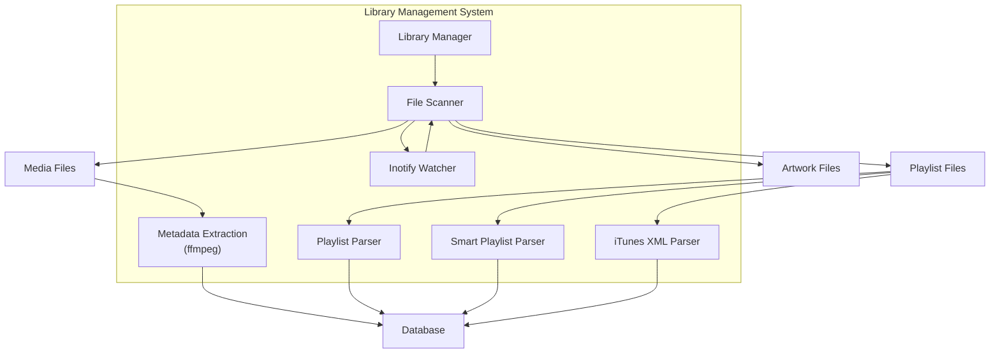
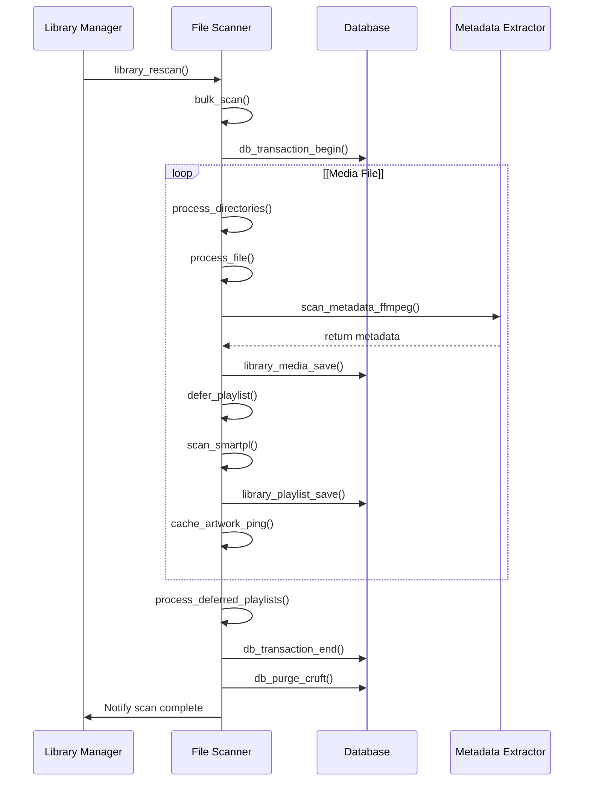
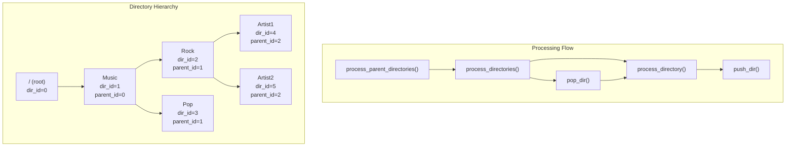
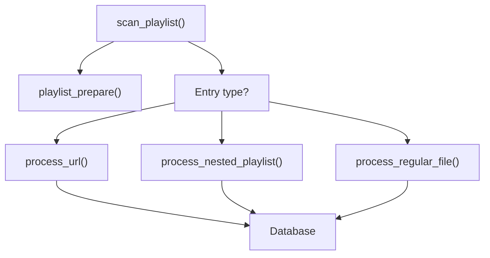
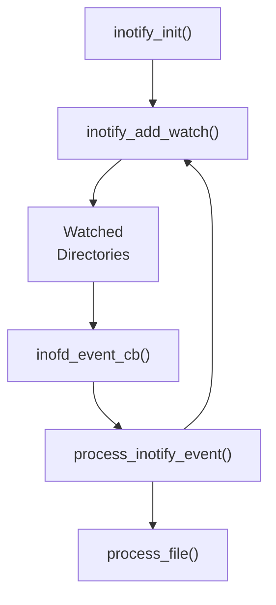
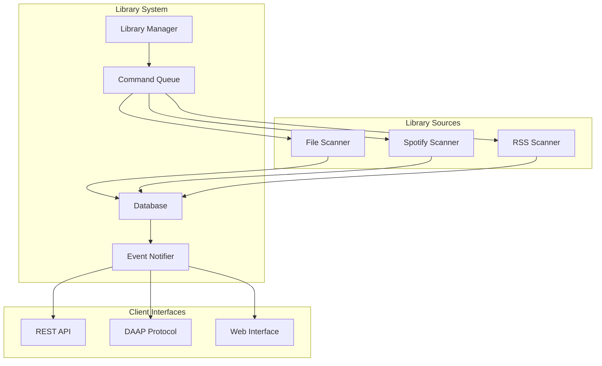

# File Scanner

> **Relevant source files**
> * [docs/json-api.md](https://github.com/owntone/owntone-server/blob/23c67a3e/docs/json-api.md)
> * [owntone.conf.in](https://github.com/owntone/owntone-server/blob/23c67a3e/owntone.conf.in)
> * [src/conffile.c](https://github.com/owntone/owntone-server/blob/23c67a3e/src/conffile.c)
> * [src/httpd_jsonapi.c](https://github.com/owntone/owntone-server/blob/23c67a3e/src/httpd_jsonapi.c)
> * [src/httpd_streaming.c](https://github.com/owntone/owntone-server/blob/23c67a3e/src/httpd_streaming.c)
> * [src/library.c](https://github.com/owntone/owntone-server/blob/23c67a3e/src/library.c)
> * [src/library.h](https://github.com/owntone/owntone-server/blob/23c67a3e/src/library.h)
> * [src/library/filescanner.c](https://github.com/owntone/owntone-server/blob/23c67a3e/src/library/filescanner.c)
> * [src/library/filescanner.h](https://github.com/owntone/owntone-server/blob/23c67a3e/src/library/filescanner.h)
> * [src/library/filescanner_ffmpeg.c](https://github.com/owntone/owntone-server/blob/23c67a3e/src/library/filescanner_ffmpeg.c)
> * [src/library/filescanner_itunes.c](https://github.com/owntone/owntone-server/blob/23c67a3e/src/library/filescanner_itunes.c)
> * [src/library/filescanner_playlist.c](https://github.com/owntone/owntone-server/blob/23c67a3e/src/library/filescanner_playlist.c)
> * [src/library/filescanner_smartpl.c](https://github.com/owntone/owntone-server/blob/23c67a3e/src/library/filescanner_smartpl.c)
> * [src/outputs/streaming.c](https://github.com/owntone/owntone-server/blob/23c67a3e/src/outputs/streaming.c)
> * [src/smartpl_query.h](https://github.com/owntone/owntone-server/blob/23c67a3e/src/smartpl_query.h)

The File Scanner is responsible for discovering and indexing media files, playlists, and artwork from the local filesystem, making them available in the OwnTone library. It provides automatic real-time monitoring of library directories through inotify, allows for different scan types, and handles various file formats and metadata extraction.

For information about other scanning mechanisms like Spotify or RSS sources, see [Library Management](/owntone/owntone-server/4-library-management).

## Overview

The File Scanner is one of several library sources that provide content to OwnTone's unified media library. It systematically traverses configured directories, identifies different file types, extracts metadata, and stores this information in the database.



Sources: [src/library/filescanner.c](https://github.com/owntone/owntone-server/blob/23c67a3e/src/library/filescanner.c)

 [src/library.c](https://github.com/owntone/owntone-server/blob/23c67a3e/src/library.c)

 [src/library.h](https://github.com/owntone/owntone-server/blob/23c67a3e/src/library.h)

## Scan Types

The File Scanner supports several scan types which are triggered from the library management system:

1. **Initial Scan** - Performed when OwnTone starts up
2. **Rescan** - Scans for new and modified files but preserves existing records
3. **Meta Rescan** - Re-extracts metadata from all files, even if they haven't changed
4. **Full Rescan** - Purges the database and performs a complete scan

Users can also trigger these scans through the API or by placing special files in watched directories:

* `.init-rescan` - Triggers a rescan
* `.meta-rescan` - Triggers a metadata rescan
* `.full-rescan` - Triggers a full rescan

Sources: [src/library/filescanner.c L159-L165](https://github.com/owntone/owntone-server/blob/23c67a3e/src/library/filescanner.c#L159-L165)

 [src/library/filescanner.c L695-L735](https://github.com/owntone/owntone-server/blob/23c67a3e/src/library/filescanner.c#L695-L735)

 [src/library.c L319-L422](https://github.com/owntone/owntone-server/blob/23c67a3e/src/library.c#L319-L422)

## Scanner Configuration

The File Scanner is configured in the `library` section of the OwnTone configuration file:

```markdown
library {
  # Directories to scan
  directories = { "/srv/music" }
  
  # Follow symbolic links
  follow_symlinks = true
  
  # Special directory identifiers
  podcasts = { "/Podcasts" }
  audiobooks = { "/Audiobooks" }
  compilations = { "/Compilations" }
  
  # File patterns to ignore
  filetypes_ignore = { ".db", ".ini", ".db-journal", ".pdf", ".metadata" }
  
  # Regular expressions for paths to ignore
  filepath_ignore = { "myregex" }
  
  # Disable initial scan on startup
  filescan_disable = false
}
```

Sources: [owntone.conf.in L83-L164](https://github.com/owntone/owntone-server/blob/23c67a3e/owntone.conf.in#L83-L164)

 [src/conffile.c L83-L134](https://github.com/owntone/owntone-server/blob/23c67a3e/src/conffile.c#L83-L134)

## Scanner Operation



Sources: [src/library/filescanner.c L1006-L1086](https://github.com/owntone/owntone-server/blob/23c67a3e/src/library/filescanner.c#L1006-L1086)

 [src/library/filescanner.c L644-L740](https://github.com/owntone/owntone-server/blob/23c67a3e/src/library/filescanner.c#L644-L740)

## Directory Processing

The scanner maintains a virtual representation of the directory structure in the database. Each physical directory corresponds to a database record with:

* A unique directory ID
* Parent directory ID (for hierarchy)
* Virtual path (for library organization)
* Physical path (for filesystem access)



Sources: [src/library/filescanner.c L809-L850](https://github.com/owntone/owntone-server/blob/23c67a3e/src/library/filescanner.c#L809-L850)

 [src/library/filescanner.c L983-L1003](https://github.com/owntone/owntone-server/blob/23c67a3e/src/library/filescanner.c#L983-L1003)

 [src/library/filescanner.c L219-L260](https://github.com/owntone/owntone-server/blob/23c67a3e/src/library/filescanner.c#L219-L260)

## File Type Detection and Processing

The scanner identifies file types based on file extensions and contents:

| File Type | Extensions | Processing Function |
| --- | --- | --- |
| Media Files | Various | `process_regular_file()` |
| Playlists | .m3u, .pls, .m3u8 | `scan_playlist()` |
| Smart Playlists | .smartpl | `scan_smartpl()` |
| iTunes Playlists | .xml | `scan_itunes_itml()` |
| Artwork | Cover art filenames | `cache_artwork_ping()` |
| Control Files | .remote, .verification, etc. | Various handlers |

The detection happens in `file_type_get()` which analyzes the file and returns its type. Each file type then has a dedicated processing function.

Sources: [src/library/filescanner.c L319-L385](https://github.com/owntone/owntone-server/blob/23c67a3e/src/library/filescanner.c#L319-L385)

 [src/library/filescanner.c L644-L740](https://github.com/owntone/owntone-server/blob/23c67a3e/src/library/filescanner.c#L644-L740)

## Regular File Processing

When processing regular media files, the scanner:

1. Checks if the file already exists in the database
2. If not, or if the file has been modified: * Creates a `media_file_info` struct * Fills basic file information (path, size, etc.) * Extracts metadata using FFmpeg * Saves the file to the database * Updates the artwork cache

Media files can be automatically categorized as:

* Audiobooks (if in a directory matching the `audiobooks` config)
* Podcasts (if in a directory matching the `podcasts` config)
* Compilations (if in a directory matching the `compilations` config)

Sources: [src/library/filescanner.c L567-L642](https://github.com/owntone/owntone-server/blob/23c67a3e/src/library/filescanner.c#L567-L642)

 [src/library/filescanner_ffmpeg.c](https://github.com/owntone/owntone-server/blob/23c67a3e/src/library/filescanner_ffmpeg.c)

## Playlist Processing

The scanner handles several playlist formats:

### Standard Playlists (M3U, PLS)

For M3U and PLS playlists, the scanner:

1. Creates or updates a playlist record in the database
2. Parses the playlist file line by line
3. For each entry: * If it's an HTTP URL, processes it as a stream * If it's a local file, tries to find a matching file in the database * If it's another playlist, processes it as a nested playlist
4. Adds the matched files to the playlist



Sources: [src/library/filescanner_playlist.c L429-L531](https://github.com/owntone/owntone-server/blob/23c67a3e/src/library/filescanner_playlist.c#L429-L531)

### Smart Playlists

Smart playlists (.smartpl files) contain query expressions that dynamically select tracks:

1. The scanner parses the smart playlist file
2. Extracts the title, query conditions, order, and limit
3. Creates a playlist record with type `PL_SMART`
4. Saves the query in the database

When the playlist is accessed, the query is executed to generate a dynamic list of tracks.

Sources: [src/library/filescanner_smartpl.c L42-L92](https://github.com/owntone/owntone-server/blob/23c67a3e/src/library/filescanner_smartpl.c#L42-L92)

 [src/smartpl_query.h](https://github.com/owntone/owntone-server/blob/23c67a3e/src/smartpl_query.h)

### iTunes XML Playlists

For iTunes XML playlists, the scanner:

1. Parses the XML using plist library
2. Creates a mapping between iTunes IDs and database IDs
3. Extracts each playlist and its tracks
4. Creates corresponding playlists in the database

Sources: [src/library/filescanner_itunes.c](https://github.com/owntone/owntone-server/blob/23c67a3e/src/library/filescanner_itunes.c)

## Real-time File Monitoring

The scanner uses inotify to monitor the library directories for changes:



When files are added, modified, or deleted, the scanner is notified and processes the changes immediately, keeping the library up to date without requiring a full rescan.

The scanner watches for these events:

* `IN_CREATE` - File or directory created
* `IN_DELETE` - File or directory deleted
* `IN_CLOSE_WRITE` - File closed after writing
* `IN_MOVE` - File moved
* `IN_ATTRIB` - Metadata changed

Sources: [src/library/filescanner.c L80-L83](https://github.com/owntone/owntone-server/blob/23c67a3e/src/library/filescanner.c#L80-L83)

 [src/library/filescanner.c L920-L930](https://github.com/owntone/owntone-server/blob/23c67a3e/src/library/filescanner.c#L920-L930)

## Integration with Library System

The File Scanner operates as part of the larger library system:



The library manager schedules scanning operations, which are then executed by the File Scanner. After scanning, the library notifies clients about the changes through the event notification system.

Sources: [src/library.c L87-L96](https://github.com/owntone/owntone-server/blob/23c67a3e/src/library.c#L87-L96)

 [src/library.c L319-L422](https://github.com/owntone/owntone-server/blob/23c67a3e/src/library.c#L319-L422)

## Usage from the JSON API

The File Scanner can be triggered via the OwnTone JSON API:

```sql
PUT /api/update?scan_kind=0
```

```
PUT /api/meta-rescan?scan_kind=0
```

The `scan_kind` parameter specifies which library source to scan (0 for all, 1 for File Scanner specifically).

Sources: [src/httpd_jsonapi.c L1246-L1255](https://github.com/owntone/owntone-server/blob/23c67a3e/src/httpd_jsonapi.c#L1246-L1255)

 [src/httpd_jsonapi.c L1257-L1266](https://github.com/owntone/owntone-server/blob/23c67a3e/src/httpd_jsonapi.c#L1257-L1266)

 [docs/json-api.md L1176-L1210](https://github.com/owntone/owntone-server/blob/23c67a3e/docs/json-api.md#L1176-L1210)

## Conclusion

The File Scanner is a core component of OwnTone that bridges the local filesystem with the media library. It efficiently discovers and indexes media files, extracts metadata, and maintains the library in real-time through inotify monitoring. It handles various file types, including regular media files, playlists, and artwork, and supports different scanning modes to accommodate various use cases.