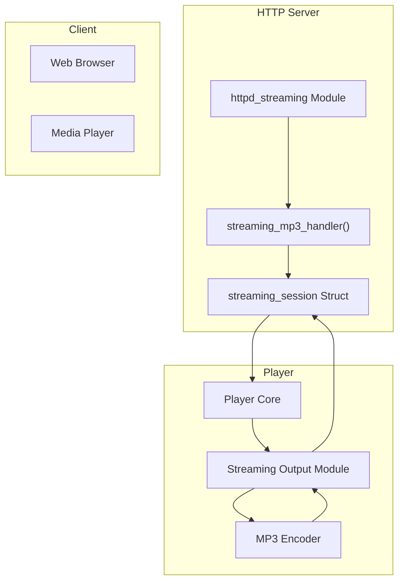
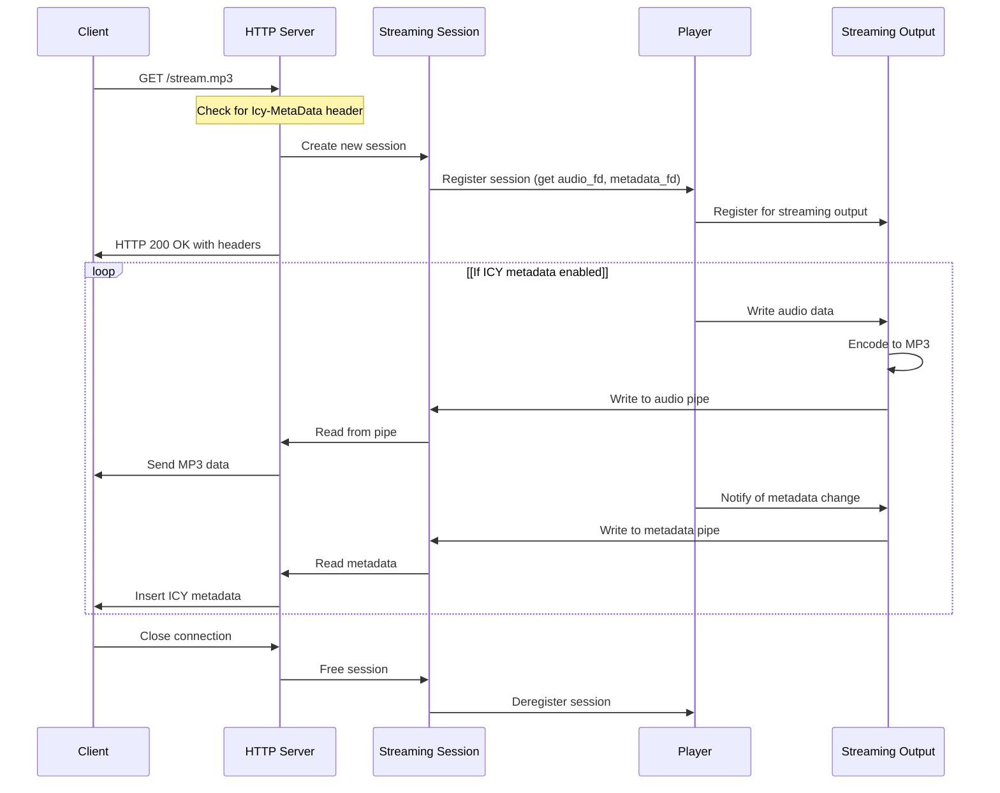
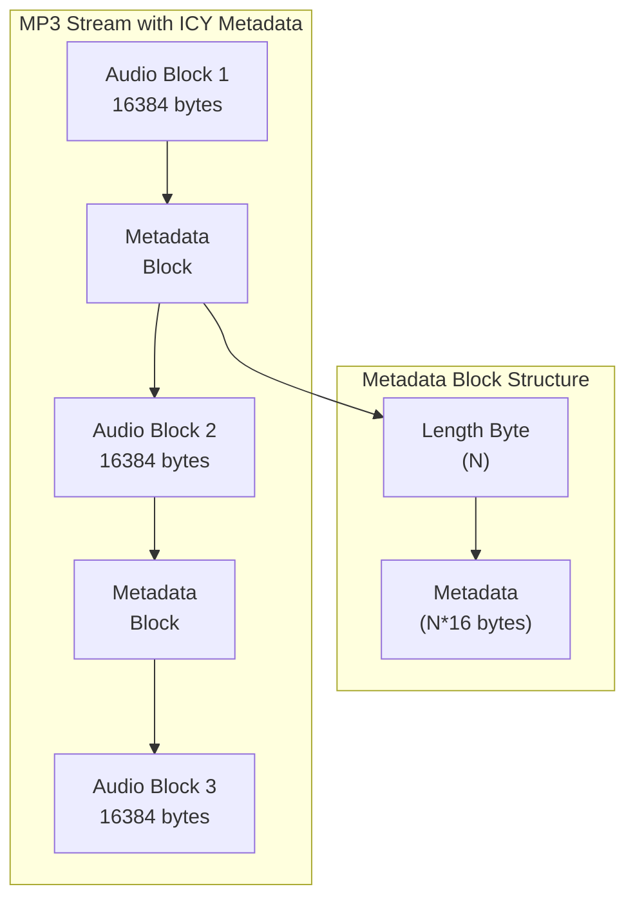

# HTTP Streaming

> **Relevant source files**
> * [owntone.conf.in](https://github.com/owntone/owntone-server/blob/23c67a3e/owntone.conf.in)
> * [src/conffile.c](https://github.com/owntone/owntone-server/blob/23c67a3e/src/conffile.c)
> * [src/http.c](https://github.com/owntone/owntone-server/blob/23c67a3e/src/http.c)
> * [src/http.h](https://github.com/owntone/owntone-server/blob/23c67a3e/src/http.h)
> * [src/httpd_streaming.c](https://github.com/owntone/owntone-server/blob/23c67a3e/src/httpd_streaming.c)
> * [src/inputs/file.c](https://github.com/owntone/owntone-server/blob/23c67a3e/src/inputs/file.c)
> * [src/inputs/http.c](https://github.com/owntone/owntone-server/blob/23c67a3e/src/inputs/http.c)
> * [src/lastfm.c](https://github.com/owntone/owntone-server/blob/23c67a3e/src/lastfm.c)
> * [src/lastfm.h](https://github.com/owntone/owntone-server/blob/23c67a3e/src/lastfm.h)
> * [src/library/filescanner_ffmpeg.c](https://github.com/owntone/owntone-server/blob/23c67a3e/src/library/filescanner_ffmpeg.c)
> * [src/outputs/streaming.c](https://github.com/owntone/owntone-server/blob/23c67a3e/src/outputs/streaming.c)
> * [src/settings.c](https://github.com/owntone/owntone-server/blob/23c67a3e/src/settings.c)
> * [src/settings.h](https://github.com/owntone/owntone-server/blob/23c67a3e/src/settings.h)
> * [web-src/src/components/TabsSettings.vue](https://github.com/owntone/owntone-server/blob/23c67a3e/web-src/src/components/TabsSettings.vue)

OwnTone's HTTP streaming feature allows clients to receive audio streams directly over HTTP without requiring specialized protocols like DAAP or RSP. This page documents how HTTP streaming is implemented in OwnTone, including its configuration, architecture, and support for ICY metadata.

For information about remote library access using DAAP, see [DAAP and RSP Protocols](/owntone/owntone-server/5.1-daap-and-rsp-protocols). For streaming to Chromecast devices, see [Cast Protocol](/owntone/owntone-server/5.6-cast-protocol).

## Configuration

HTTP streaming is configurable through the `streaming` section in the OwnTone configuration file. The following options are available:

| Option | Description | Default | Valid Values |
| --- | --- | --- | --- |
| `sample_rate` | Sample rate in Hz | 44100 | 32000, 44100, 48000 |
| `bit_rate` | MP3 encoding bit rate in kbps | 192 | 64, 96, 128, 192, 320 |
| `icy_metaint` | ICY metadata interval in bytes | 16384 | 4096-131072 |

Example configuration:

```
streaming {
    sample_rate = 44100
    bit_rate = 192
    icy_metaint = 16384
}
```

These settings control the quality and behavior of the HTTP audio stream. The configuration is loaded by the streaming module during initialization.

Sources: [src/conffile.c L254-L260](https://github.com/owntone/owntone-server/blob/23c67a3e/src/conffile.c#L254-L260)

 [src/httpd_streaming.c L335-L365](https://github.com/owntone/owntone-server/blob/23c67a3e/src/httpd_streaming.c#L335-L365)

 [owntone.conf.in L482-L490](https://github.com/owntone/owntone-server/blob/23c67a3e/owntone.conf.in#L482-L490)

## Architecture

The HTTP streaming system in OwnTone involves multiple components that work together to deliver audio streams to clients.



**HTTP Streaming Component Interactions**

Sources: [src/httpd_streaming.c L18-L380](https://github.com/owntone/owntone-server/blob/23c67a3e/src/httpd_streaming.c#L18-L380)

 [src/outputs/streaming.c L18-L563](https://github.com/owntone/owntone-server/blob/23c67a3e/src/outputs/streaming.c#L18-L563)

### Request Handling

When a client makes a request to `/stream.mp3`, the following sequence occurs:

1. The HTTP server's `streaming_mp3_handler()` function processes the request
2. A new `streaming_session` structure is created
3. The session registers with the player to receive audio data
4. Two pipes are established for each session: one for audio data and one for metadata
5. The HTTP response begins with appropriate headers
6. Audio data is continuously streamed to the client until the connection is closed



**HTTP Streaming Request Sequence**

Sources: [src/httpd_streaming.c L230-L297](https://github.com/owntone/owntone-server/blob/23c67a3e/src/httpd_streaming.c#L230-L297)

 [src/outputs/streaming.c L74-L520](https://github.com/owntone/owntone-server/blob/23c67a3e/src/outputs/streaming.c#L74-L520)

### Core Structs

The HTTP streaming implementation uses several key structures:

1. **streaming_session**: Represents a client connection ``` struct streaming_session {   struct httpd_request *hreq;   int id;   struct event *audioev;   struct event *metadataev;   struct evbuffer *audiobuf;   size_t bytes_sent;   bool icy_is_requested;   size_t icy_remaining;   char icy_title[STREAMING_ICY_METATITLELEN_MAX]; }; ```
2. **streaming_wanted**: Represents a specific streaming format and quality ``` struct streaming_wanted {   int num_sessions;   struct pipepair audio[WANTED_PIPES_MAX];   struct pipepair metadata[WANTED_PIPES_MAX];   enum media_format format;   struct media_quality quality;   // Additional encoding fields... }; ```

Sources: [src/httpd_streaming.c L41-L53](https://github.com/owntone/owntone-server/blob/23c67a3e/src/httpd_streaming.c#L41-L53)

 [src/outputs/streaming.c L56-L94](https://github.com/owntone/owntone-server/blob/23c67a3e/src/outputs/streaming.c#L56-L94)

## ICY Metadata

OwnTone supports ICY (SHOUTcast) metadata in HTTP streams, allowing compatible clients to display information about the currently playing track.

### ICY Protocol Overview

1. Clients request metadata by setting the `Icy-MetaData: 1` HTTP header
2. Server responds with `icy-name` and `icy-metaint` headers
3. Audio data is sent with metadata blocks inserted at intervals specified by `icy-metaint`
4. Metadata blocks contain information about the currently playing track



**ICY Metadata Stream Structure**

Sources: [src/httpd_streaming.c L66-L147](https://github.com/owntone/owntone-server/blob/23c67a3e/src/httpd_streaming.c#L66-L147)

 [src/http.c L430-L606](https://github.com/owntone/owntone-server/blob/23c67a3e/src/http.c#L430-L606)

### Metadata Creation and Insertion

When a client requests ICY metadata:

1. The `icy_is_requested` flag is set in the session structure
2. The server responds with `icy-metaint` header indicating the metadata interval
3. As audio data is sent, the `icy_remaining` counter tracks bytes until next metadata
4. When `icy_remaining` reaches 0, metadata is inserted using `icy_meta_create()`
5. Metadata is formatted as `StreamTitle='Artist - Title';`
6. Metadata blocks are prefixed with a length byte indicating size in 16-byte chunks

Sources: [src/httpd_streaming.c L83-L147](https://github.com/owntone/owntone-server/blob/23c67a3e/src/httpd_streaming.c#L83-L147)

 [src/httpd_streaming.c L272-L297](https://github.com/owntone/owntone-server/blob/23c67a3e/src/httpd_streaming.c#L272-L297)

## Usage

### Connecting to Streams

Clients can connect to OwnTone's HTTP stream using the URL:

```yaml
http://[server-address]:3689/stream.mp3
```

To request metadata, clients should include the header `Icy-MetaData: 1` in their request.

### Compatible Clients

Many media players and applications support HTTP streaming with ICY metadata:

* VLC Media Player
* MPV
* iTunes
* Winamp
* Various web browsers (for basic playback)
* Internet radio apps

### Example Usage

Using `mpv` to play the stream with metadata:

```
mpv --display-tags=* http://localhost:3689/stream.mp3
```

Using `curl` to test the stream:

```
curl -H "Icy-MetaData: 1" http://localhost:3689/stream.mp3 -o test.mp3
```

## Implementation Details

### MP3 Encoding

OwnTone encodes audio to MP3 format for HTTP streaming using the LAME MP3 encoder through FFmpeg. The encoding is done in a worker thread to avoid blocking the player thread.

The encoding process:

1. PCM audio data from player is received by the streaming output module
2. Data is placed in a buffer and scheduled for encoding
3. Worker thread encodes the data to MP3 format
4. Encoded data is written to pipes for each active streaming session

Sources: [src/outputs/streaming.c L115-L424](https://github.com/owntone/owntone-server/blob/23c67a3e/src/outputs/streaming.c#L115-L424)

### Thread Safety

The HTTP streaming implementation uses several mechanisms to ensure thread safety:

1. Mutex locks to protect access to shared data structures
2. Condition variables to synchronize encoding tasks
3. Event-based I/O to handle asynchronous communication
4. Worker thread for encoding to avoid blocking the main thread

Sources: [src/outputs/streaming.c L102-L108](https://github.com/owntone/owntone-server/blob/23c67a3e/src/outputs/streaming.c#L102-L108)

 [src/httpd_streaming.c L150-L208](https://github.com/owntone/owntone-server/blob/23c67a3e/src/httpd_streaming.c#L150-L208)

### Silence Handling

To keep connections alive during silence or when no audio is playing, the streaming output module periodically sends:

1. Silent audio frames to maintain the stream
2. Updated metadata when track information changes, even during silence

This prevents clients from disconnecting during pauses in playback.

Sources: [src/outputs/streaming.c L47-L94](https://github.com/owntone/owntone-server/blob/23c67a3e/src/outputs/streaming.c#L47-L94)

 [src/outputs/streaming.c L581-L609](https://github.com/owntone/owntone-server/blob/23c67a3e/src/outputs/streaming.c#L581-L609)

## Integration with Other Components

HTTP streaming integrates with several other OwnTone components:

1. **Player Core**: Provides audio data and metadata for streaming
2. **HTTP Server**: Handles client connections and delivers the stream
3. **Transcoding System**: Used for audio format conversion when needed
4. **DB**: Provides track information for metadata

This integration allows HTTP streaming to serve as an alternative access method to OwnTone's library, complementing the DAAP, RSP, and MPD interfaces.

Sources: [src/outputs/streaming.c L18-L56](https://github.com/owntone/owntone-server/blob/23c67a3e/src/outputs/streaming.c#L18-L56)

 [src/httpd_streaming.c L18-L41](https://github.com/owntone/owntone-server/blob/23c67a3e/src/httpd_streaming.c#L18-L41)