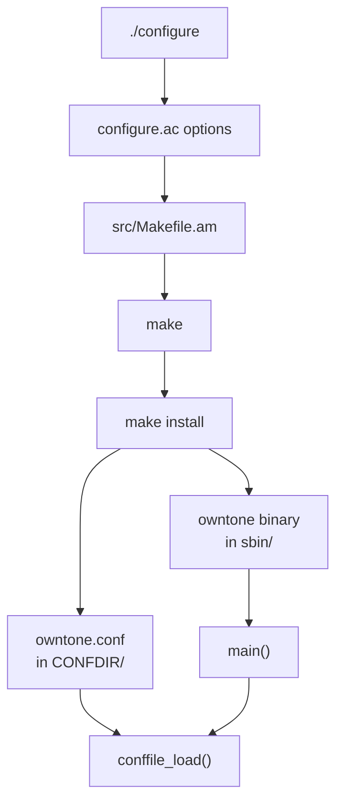
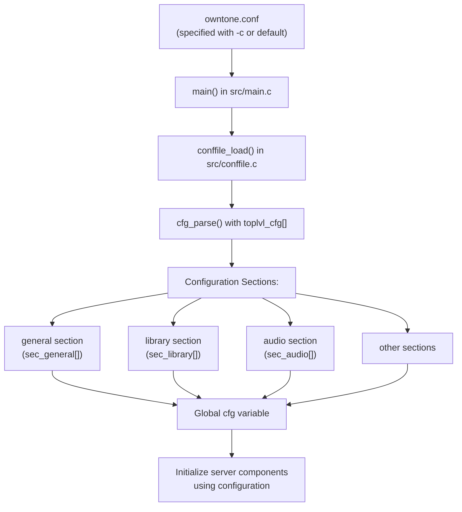

# Installation and Configuration

> **Relevant source files**
> * [AUTHORS](https://github.com/owntone/owntone-server/blob/23c67a3e/AUTHORS)
> * [NEWS](https://github.com/owntone/owntone-server/blob/23c67a3e/NEWS)
> * [UPGRADING](https://github.com/owntone/owntone-server/blob/23c67a3e/UPGRADING)
> * [configure.ac](https://github.com/owntone/owntone-server/blob/23c67a3e/configure.ac)
> * [owntone.conf.in](https://github.com/owntone/owntone-server/blob/23c67a3e/owntone.conf.in)
> * [src/Makefile.am](https://github.com/owntone/owntone-server/blob/23c67a3e/src/Makefile.am)
> * [src/conffile.c](https://github.com/owntone/owntone-server/blob/23c67a3e/src/conffile.c)
> * [src/httpd_streaming.c](https://github.com/owntone/owntone-server/blob/23c67a3e/src/httpd_streaming.c)
> * [src/library/filescanner_ffmpeg.c](https://github.com/owntone/owntone-server/blob/23c67a3e/src/library/filescanner_ffmpeg.c)
> * [src/main.c](https://github.com/owntone/owntone-server/blob/23c67a3e/src/main.c)
> * [src/outputs/streaming.c](https://github.com/owntone/owntone-server/blob/23c67a3e/src/outputs/streaming.c)

This document explains how to install, configure, and run the OwnTone server. It covers building from source, package installation options, configuration file settings, and command-line parameters for controlling the server. For information about the overall system architecture, see [System Architecture](/owntone/owntone-server/1.1-system-architecture).

## Installation

OwnTone can be installed either from pre-built packages or by building from source code.

### Prerequisites

Before installing OwnTone, ensure you have the following dependencies:

* ALSA development files (for local audio)
* libavformat/libavcodec (ffmpeg or libav)
* libconfuse (version 3.0+)
* libevent 2.1.4+
* libgcrypt
* libplist
* libsodium
* libunistring
* libcurl
* sqlite3 (with unlock notify support)
* zlib

Additional optional dependencies:

* Avahi or Bonjour for mDNS support
* libpulse for PulseAudio support
* libwebsockets (2.0.2+) for web interface
* libprotobuf-c for Chromecast support

### Package Installation

OwnTone is available in several distributions' package repositories:

#### Debian/Ubuntu

```
sudo apt install owntone
```

#### Fedora

```
sudo dnf install owntone
```

#### Arch Linux

From the AUR:

```
yay -S owntone-server
```

### Building from Source

1. Clone the repository: ``` git clone https://github.com/owntone/owntone-server.git cd owntone-server ```
2. Configure the build: ``` ./configure ``` Common configuration options: * `--prefix=/usr`: Set installation prefix * `--sysconfdir=/etc`: Set configuration directory * `--localstatedir=/var`: Set state directory * `--with-alsa`: Enable ALSA support * `--with-pulseaudio`: Enable PulseAudio support * `--with-avahi`: Use Avahi for mDNS (default if available) * `--with-libwebsockets`: Enable web interface * `--enable-chromecast`: Enable Chromecast support * `--disable-spotify`: Disable Spotify support
3. Build the code: ``` make ```
4. Install: ``` sudo make install ```

### Installation Process Diagram

The following diagram illustrates the build and installation process for OwnTone:



Sources: [configure.ac L1-L396](https://github.com/owntone/owntone-server/blob/23c67a3e/configure.ac#L1-L396)

 [src/Makefile.am L1-L164](https://github.com/owntone/owntone-server/blob/23c67a3e/src/Makefile.am#L1-L164)

 [src/main.c L483-L611](https://github.com/owntone/owntone-server/blob/23c67a3e/src/main.c#L483-L611)

 [src/conffile.c L463-L535](https://github.com/owntone/owntone-server/blob/23c67a3e/src/conffile.c#L463-L535)

## Configuration

OwnTone uses a configuration file to control its behavior. This section details the configuration file structure and important settings.

### Configuration File Location

By default, OwnTone looks for its configuration file at:

* `/etc/owntone.conf` (when installed with default options)

You can specify a different configuration file with the `-c` command-line option:

```
owntone -c /path/to/owntone.conf
```

### Configuration File Structure

The configuration file is organized into sections, each controlling a different aspect of the server. The file is parsed by libconfuse, which determines how values are defined and used. The configuration sections include:

| Section | Purpose | Key Options |
| --- | --- | --- |
| `general` | Core server settings | uid, db_path, logfile, loglevel |
| `library` | Media library settings | name, directories, port |
| `audio` | Local audio output settings | nickname, type, card, mixer |
| `alsa` | ALSA device-specific settings | nickname, mixer, mixer_device |
| `airplay_shared` | Common AirPlay settings | control_port, timing_port |
| `airplay` | AirPlay device-specific settings | max_volume, password, exclude |
| `chromecast` | Chromecast device-specific settings | max_volume, exclude |
| `spotify` | Spotify settings | bitrate, base_playlist_disable |
| `mpd` | MPD compatibility settings | port, http_port |
| `sqlite` | Database settings | pragma_cache_size_library, pragma_journal_mode |
| `streaming` | Audio streaming settings | sample_rate, bit_rate |

### Configuration Parsing Flow

The following diagram shows how the configuration file is parsed and used in the code:



Sources: [src/conffile.c L45-L278](https://github.com/owntone/owntone-server/blob/23c67a3e/src/conffile.c#L45-L278)

 [src/conffile.c L463-L535](https://github.com/owntone/owntone-server/blob/23c67a3e/src/conffile.c#L463-L535)

 [src/main.c L611-L626](https://github.com/owntone/owntone-server/blob/23c67a3e/src/main.c#L611-L626)

### Key Configuration Sections

#### General Section

The general section controls core server settings:

```css
general {
    # User to run as
    uid = "owntone"
    
    # Database location
    db_path = "/var/cache/owntone/songs3.db"
    
    # Log file and level
    logfile = "/var/log/owntone.log"
    loglevel = "log"  # Options: fatal, log, warning, info, debug, spam
    
    # Web interface password (optional)
    # admin_password = "password"
    
    # Websocket port for web interface
    # websocket_port = 3688
    
    # Who can connect without authorization
    # trusted_networks = { "lan" }
    
    # IPv6 support
    # ipv6 = false
}
```

#### Library Section

The library section configures the media library:

```markdown
library {
    # Library name (%h is replaced with hostname)
    name = "My Music on %h"
    
    # Server port (DAAP)
    port = 3689
    
    # Media directories to scan
    directories = { "/path/to/music" }
    
    # Directories containing podcasts
    podcasts = { "/Podcasts" }
    
    # Directories containing audiobooks
    audiobooks = { "/Audiobooks" }
    
    # Directories containing compilations
    compilations = { "/Compilations" }
    
    # Compilation artist name
    compilation_artist = "Various Artists"
}
```

#### Audio Section

The audio section controls local audio output:

```css
audio {
    # Name in speaker list
    nickname = "Computer"
    
    # Output type: alsa, pulseaudio, dummy, disabled
    type = "alsa"
    
    # ALSA device
    card = "default"
    
    # Mixer for volume control
    mixer = "PCM"
}
```

#### Streaming Section

The streaming section controls HTTP audio streaming behavior:

```markdown
streaming {
    # Sample rate for audio streaming
    sample_rate = 44100
    
    # Bit rate for audio streaming (kbps)
    bit_rate = 192
    
    # ICY metadata interval (bytes)
    icy_metaint = 16384
}
```

Sources: [owntone.conf.in L1-L446](https://github.com/owntone/owntone-server/blob/23c67a3e/owntone.conf.in#L1-L446)

 [src/httpd_streaming.c L333-L366](https://github.com/owntone/owntone-server/blob/23c67a3e/src/httpd_streaming.c#L333-L366)

 [src/outputs/streaming.c L116-L143](https://github.com/owntone/owntone-server/blob/23c67a3e/src/outputs/streaming.c#L116-L143)

## Running OwnTone

OwnTone can be run as a daemon or in the foreground. This section covers command-line options and runtime behavior.

### Command-line Options

OwnTone supports the following command-line options:

| Option | Description |
| --- | --- |
| `-d <level>` | Set log level (0-5) |
| `-D <domains>` | Set log domains for logging |
| `-c <file>` | Use specified configuration file |
| `-P <file>` | Write PID to specified file |
| `-f` | Run in foreground (don't daemonize) |
| `-b <id>` | Broadcast specific ffid |
| `-w <directory>` | Use specified web root directory |
| `-v` | Display version information |
| `--mdns-no-rsp` | Don't announce RSP service via mDNS |
| `--mdns-no-daap` | Don't announce DAAP service via mDNS |
| `--mdns-no-cname` | Don't register owntone.local as CNAME via mDNS |
| `--mdns-no-web` | Don't announce web interface via mDNS |
| `-s <path>` | Specify path to SQLite extension |

Sources: [src/main.c L86-L116](https://github.com/owntone/owntone-server/blob/23c67a3e/src/main.c#L86-L116)

 [src/main.c L534-L609](https://github.com/owntone/owntone-server/blob/23c67a3e/src/main.c#L534-L609)

### Initialization Sequence

When OwnTone starts, it performs the following initialization sequence:

```mermaid
sequenceDiagram
  participant main() (src/main.c)
  participant conffile_load() (src/conffile.c)
  participant mdns_init() (src/mdns.c)
  participant db_init() (src/db.c)
  participant worker_init() (src/worker.c)
  participant cache_init() (src/cache.c)
  participant library_init() (src/library.c)
  participant player_init() (src/player.c)
  participant httpd_init() (src/httpd.c)
  participant mpd_init() (src/mpd.c)
  participant register_services() (src/main.c)

  main() (src/main.c)->>conffile_load() (src/conffile.c): Load configuration from file
  conffile_load() (src/conffile.c)-->>main() (src/main.c): Return loaded config (cfg)
  main() (src/main.c)->>mdns_init() (src/mdns.c): Initialize mDNS
  main() (src/main.c)->>db_init() (src/db.c): Initialize database
  main() (src/main.c)->>worker_init() (src/worker.c): Initialize worker thread
  main() (src/main.c)->>cache_init() (src/cache.c): Initialize cache thread
  main() (src/main.c)->>library_init() (src/library.c): Initialize library thread
  main() (src/main.c)->>player_init() (src/player.c): Initialize player
  main() (src/main.c)->>httpd_init() (src/httpd.c): Initialize HTTP server
  main() (src/main.c)->>mpd_init() (src/mpd.c): Initialize MPD server (if enabled)
  main() (src/main.c)->>register_services() (src/main.c): Register DAAP/RSP/DACP services
  main() (src/main.c)->>main() (src/main.c): Start event loop
```

Sources: [src/main.c L745-L866](https://github.com/owntone/owntone-server/blob/23c67a3e/src/main.c#L745-L866)

### Starting the Server

To start OwnTone:

```markdown
# As a daemon (default)
owntone

# In foreground
owntone -f

# With specific config file
owntone -c /path/to/owntone.conf

# With debug logging
owntone -d 5
```

If installed via packages, OwnTone may be controlled via systemd:

```markdown
# Start the server
systemctl start owntone

# Stop the server
systemctl stop owntone

# Enable at boot
systemctl enable owntone
```

### Database Considerations

OwnTone creates and manages a database to store information about your media library. The database is created automatically on first run. If you upgrade OwnTone and the database schema changes, the database will be upgraded automatically. It's recommended to back up your database before upgrading to avoid data loss.

Sources: [UPGRADING L1-L21](https://github.com/owntone/owntone-server/blob/23c67a3e/UPGRADING#L1-L21)

## Common Configuration Examples

### Basic Home Media Server

```
general {
    uid = "owntone"
}

library {
    name = "Home Music Library"
    directories = { "/media/music" }
}

audio {
    type = "alsa"
    card = "default"
}
```

### Multi-Directory Setup with Remote Streaming

```
general {
    uid = "owntone"
    ipv6 = yes
    trusted_networks = { "lan", "192.168.0.0/16" }
}

library {
    name = "Complete Media Collection"
    directories = { 
        "/media/music", 
        "/media/audiobooks",
        "/media/podcasts"
    }
    podcasts = { "/media/podcasts" }
    audiobooks = { "/media/audiobooks" }
}

audio {
    type = "pulseaudio"
}

streaming {
    sample_rate = 44100
    bit_rate = 320
}
```

### Server with Chromecast and AirPlay

```markdown
general {
    uid = "owntone"
}

library {
    name = "Multi-Room Audio"
    directories = { "/media/music" }
}

audio {
    type = "disabled"  # No local audio
}

airplay "Living Room Apple TV" {
    max_volume = 11
}

chromecast "Kitchen Display" {
    max_volume = 8
}
```

Sources: [owntone.conf.in L1-L446](https://github.com/owntone/owntone-server/blob/23c67a3e/owntone.conf.in#L1-L446)