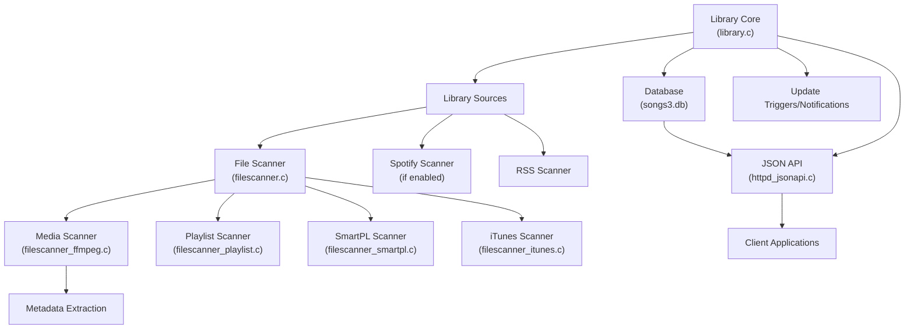
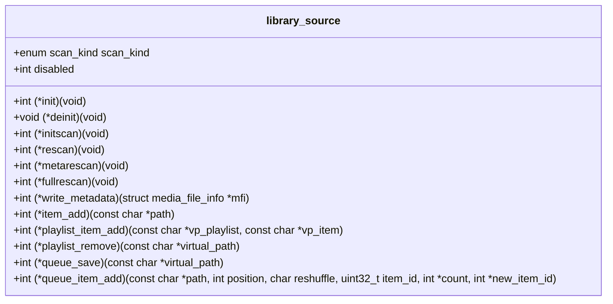
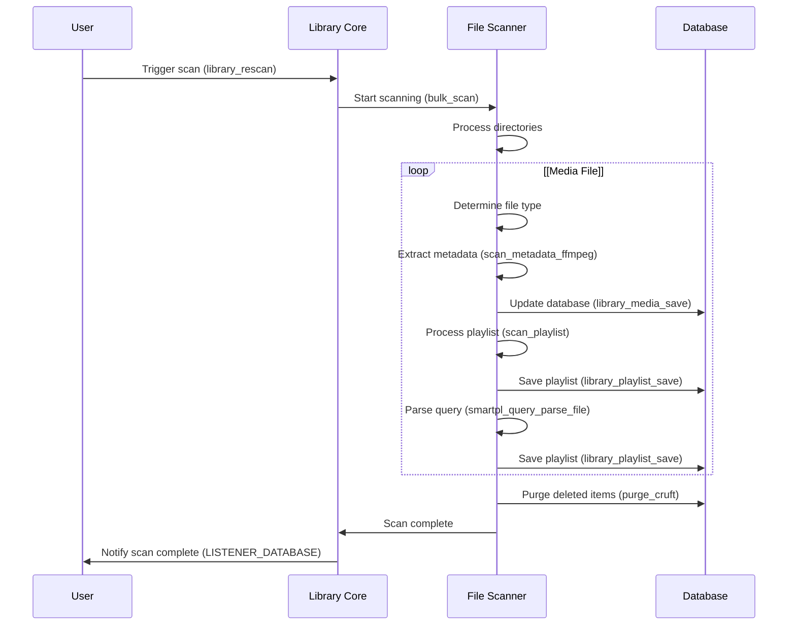
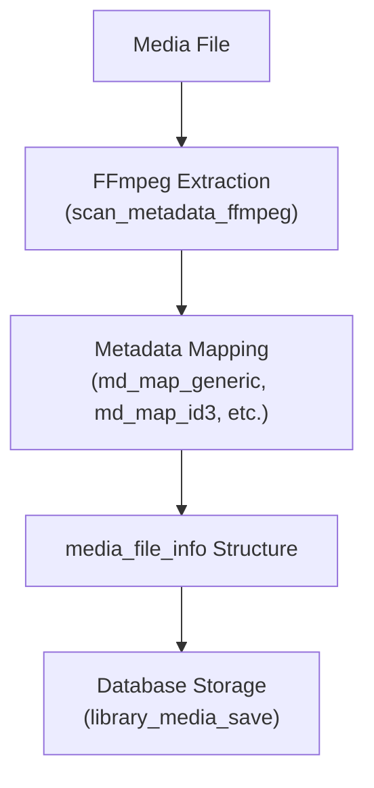
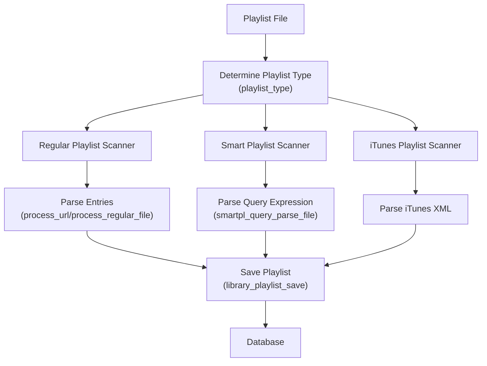
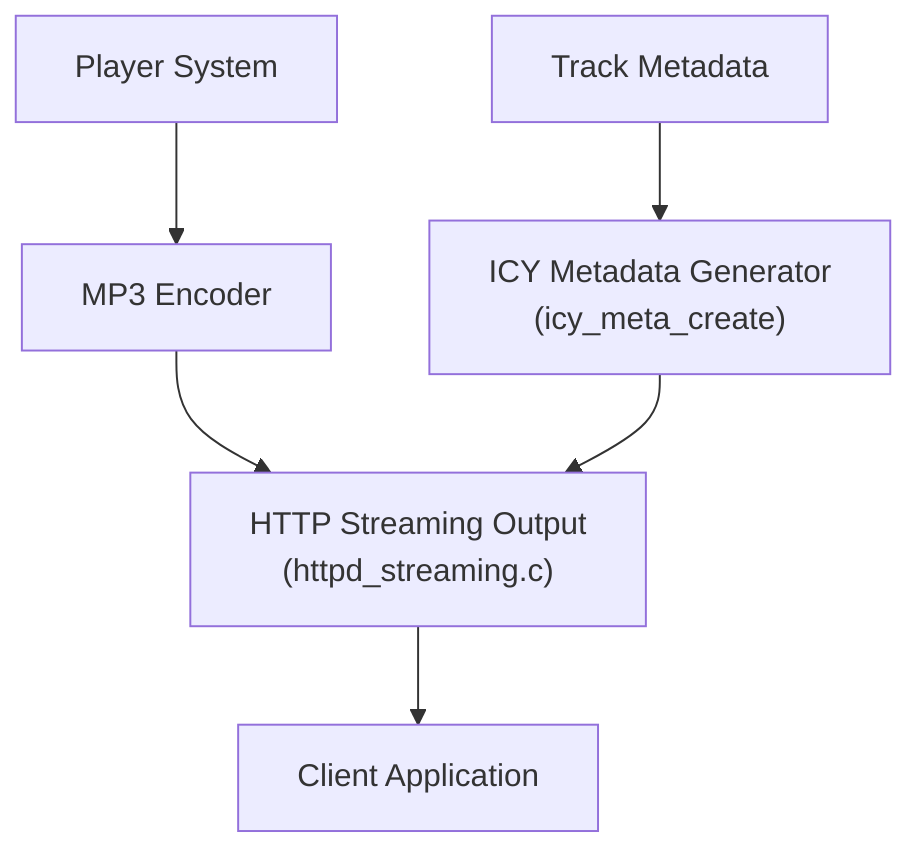

# Library Management

> **Relevant source files**
> * [docs/json-api.md](https://github.com/owntone/owntone-server/blob/23c67a3e/docs/json-api.md)
> * [owntone.conf.in](https://github.com/owntone/owntone-server/blob/23c67a3e/owntone.conf.in)
> * [src/conffile.c](https://github.com/owntone/owntone-server/blob/23c67a3e/src/conffile.c)
> * [src/httpd_jsonapi.c](https://github.com/owntone/owntone-server/blob/23c67a3e/src/httpd_jsonapi.c)
> * [src/httpd_streaming.c](https://github.com/owntone/owntone-server/blob/23c67a3e/src/httpd_streaming.c)
> * [src/library.c](https://github.com/owntone/owntone-server/blob/23c67a3e/src/library.c)
> * [src/library.h](https://github.com/owntone/owntone-server/blob/23c67a3e/src/library.h)
> * [src/library/filescanner.c](https://github.com/owntone/owntone-server/blob/23c67a3e/src/library/filescanner.c)
> * [src/library/filescanner.h](https://github.com/owntone/owntone-server/blob/23c67a3e/src/library/filescanner.h)
> * [src/library/filescanner_ffmpeg.c](https://github.com/owntone/owntone-server/blob/23c67a3e/src/library/filescanner_ffmpeg.c)
> * [src/library/filescanner_itunes.c](https://github.com/owntone/owntone-server/blob/23c67a3e/src/library/filescanner_itunes.c)
> * [src/library/filescanner_playlist.c](https://github.com/owntone/owntone-server/blob/23c67a3e/src/library/filescanner_playlist.c)
> * [src/library/filescanner_smartpl.c](https://github.com/owntone/owntone-server/blob/23c67a3e/src/library/filescanner_smartpl.c)
> * [src/outputs/streaming.c](https://github.com/owntone/owntone-server/blob/23c67a3e/src/outputs/streaming.c)
> * [src/smartpl_query.h](https://github.com/owntone/owntone-server/blob/23c67a3e/src/smartpl_query.h)

The Library Management system in OwnTone is responsible for scanning, organizing, and providing access to media content from various sources. It handles local file scanning, media metadata extraction, playlist management, and serves as the central repository for the application. For information about playing back content from the library, see [Media Playback System](/owntone/owntone-server/3-media-playback-system).

## Architecture Overview

The Library Management system employs a modular architecture that separates concerns between scanning sources, data storage, and access methods.

### Library Management System Diagram

Sources: [src/library.c L64-L98](https://github.com/owntone/owntone-server/blob/23c67a3e/src/library.c#L64-L98)

 [src/library.h L62-L130](https://github.com/owntone/owntone-server/blob/23c67a3e/src/library.h#L62-L130)

 [src/library/filescanner.c L83-L101](https://github.com/owntone/owntone-server/blob/23c67a3e/src/library/filescanner.c#L83-L101)

The Library Management system consists of:

1. **Library Core**: Coordinates scanning operations and centralized management
2. **Library Sources**: Modules that provide media content from different sources
3. **Database Interface**: Stores and retrieves media metadata
4. **JSON API**: Provides HTTP endpoints for accessing library content

## Library Sources

OwnTone supports multiple library sources defined through the `library_source` interface:

| Source | Description | Configuration Entry |
| --- | --- | --- |
| File Scanner | Scans local filesystem | `directories` in `[library]` section |
| Spotify Scanner | Indexes Spotify content (if enabled) | `[spotify]` section |
| RSS Scanner | Handles podcast/RSS feeds | `podcasts` in `[library]` section |

Sources: [src/library.c L83-L96](https://github.com/owntone/owntone-server/blob/23c67a3e/src/library.c#L83-L96)

 [src/conffile.c L84-L134](https://github.com/owntone/owntone-server/blob/23c67a3e/src/conffile.c#L84-L134)

Each source implements functions for initial scanning, rescanning, and metadata management defined in the `library_source` struct.

### Library Source Interface

Sources: [src/library.h L65-L130](https://github.com/owntone/owntone-server/blob/23c67a3e/src/library.h#L65-L130)

## Scanning Process

The scanning process involves discovering media files and extracting their metadata. It can be triggered in several ways:

1. **Initial scan**: Performed when OwnTone starts
2. **Manual rescan**: Triggered through API or by creating a trigger file
3. **Incremental scan**: Triggered by filesystem events (using inotify)
4. **Metadata rescan**: Updates metadata for existing files without changing the database structure

### Scanning Flow

Sources: [src/library.c L318-L467](https://github.com/owntone/owntone-server/blob/23c67a3e/src/library.c#L318-L467)

 [src/library/filescanner.c L1006-L1087](https://github.com/owntone/owntone-server/blob/23c67a3e/src/library/filescanner.c#L1006-L1087)

 [src/library/filescanner.c L645-L740](https://github.com/owntone/owntone-server/blob/23c67a3e/src/library/filescanner.c#L645-L740)

### File Type Detection

The scanner examines file extensions to determine file types:

| Extension | Type | Processing |
| --- | --- | --- |
| .mp3, .m4a, etc. | Media files | Extract metadata with FFmpeg |
| .m3u, .m3u8, .pls | Playlists | Process playlist entries |
| .smartpl | Smart playlists | Parse query expression |
| .xml | iTunes library | Parse iTunes XML format |
| .jpg, .png | Artwork | Process and cache artwork |

Sources: [src/library/filescanner.c L319-L385](https://github.com/owntone/owntone-server/blob/23c67a3e/src/library/filescanner.c#L319-L385)

## Media Files Management

### Metadata Extraction

OwnTone uses FFmpeg to extract metadata from media files. The system maps various metadata formats (ID3, Vorbis comments, etc.) to OwnTone's internal format.

Sources: [src/library/filescanner_ffmpeg.c L210-L317](https://github.com/owntone/owntone-server/blob/23c67a3e/src/library/filescanner_ffmpeg.c#L210-L317)

 [src/library/filescanner.c L577-L642](https://github.com/owntone/owntone-server/blob/23c67a3e/src/library/filescanner.c#L577-L642)

### Media File Structure

The `media_file_info` structure is the central data model for media files, containing fields like:

* Basic information (title, artist, album)
* Technical details (bitrate, sample rate)
* File information (path, modification time)
* User data (rating, play count)

## Playlist Management

OwnTone supports multiple playlist types, each processed differently:

### Playlist Processing Flow

Sources: [src/library/filescanner_playlist.c L42-L531](https://github.com/owntone/owntone-server/blob/23c67a3e/src/library/filescanner_playlist.c#L42-L531)

 [src/library/filescanner_smartpl.c L42-L92](https://github.com/owntone/owntone-server/blob/23c67a3e/src/library/filescanner_smartpl.c#L42-L92)

### Regular Playlists (M3U, PLS)

Regular playlists are text files containing lists of media files or URLs. The system:

1. Determines playlist type from extension
2. Parses playlist content
3. Resolves local file paths or handles URLs
4. Stores playlist items in the database

Sources: [src/library/filescanner_playlist.c L429-L531](https://github.com/owntone/owntone-server/blob/23c67a3e/src/library/filescanner_playlist.c#L429-L531)

### Smart Playlists

Smart playlists are dynamic playlists based on query expressions:

1. Parse the `.smartpl` file to extract query expression
2. Store the query in the database
3. When accessed, the query is executed to generate the playlist content dynamically

Sources: [src/library/filescanner_smartpl.c L42-L92](https://github.com/owntone/owntone-server/blob/23c67a3e/src/library/filescanner_smartpl.c#L42-L92)

 [src/smartpl_query.h L6-L13](https://github.com/owntone/owntone-server/blob/23c67a3e/src/smartpl_query.h#L6-L13)

### iTunes Playlists

OwnTone can import playlists from iTunes XML library files:

1. Parse the iTunes XML structure
2. Extract playlist information and entries
3. Store playlists and items in the database

Sources: [src/library/filescanner_itunes.c L108-L134](https://github.com/owntone/owntone-server/blob/23c67a3e/src/library/filescanner_itunes.c#L108-L134)

## Streaming Support

OwnTone provides HTTP streaming of media files, including support for ICY metadata which allows real-time display of track information in streaming clients.

Sources: [src/httpd_streaming.c L37-L380](https://github.com/owntone/owntone-server/blob/23c67a3e/src/httpd_streaming.c#L37-L380)

 [src/outputs/streaming.c L37-L380](https://github.com/owntone/owntone-server/blob/23c67a3e/src/outputs/streaming.c#L37-L380)

### ICY Metadata

ICY metadata is injected into the MP3 stream at regular intervals, allowing streaming clients to display track information:

* Title
* Artist
* Album

Sources: [src/httpd_streaming.c L66-L147](https://github.com/owntone/owntone-server/blob/23c67a3e/src/httpd_streaming.c#L66-L147)

## Library API

The library provides a comprehensive JSON API for accessing and managing library content. Key endpoints include:

### Library API Endpoints

| Endpoint | Description | Functions |
| --- | --- | --- |
| `/api/library` | Get library statistics | `jsonapi_reply_library` |
| `/api/update` | Trigger library rescan | `jsonapi_reply_update` |
| `/api/library/artists` | List artists | `jsonapi_reply_library_artists` |
| `/api/library/albums` | List albums | `jsonapi_reply_library_albums` |
| `/api/library/tracks` | List tracks | `jsonapi_reply_library_tracks` |
| `/api/library/playlists` | List playlists | `jsonapi_reply_library_playlists` |

Sources: [src/httpd_jsonapi.c L1176-L1240](https://github.com/owntone/owntone-server/blob/23c67a3e/src/httpd_jsonapi.c#L1176-L1240)

 [docs/json-api.md L10-L17](https://github.com/owntone/owntone-server/blob/23c67a3e/docs/json-api.md#L10-L17)

## Configuration Options

Library behavior is configured through the `library` section in the configuration file (`owntone.conf`):

### Key Configuration Options

| Option | Description | Default |
| --- | --- | --- |
| `directories` | Directories to scan for media | `/srv/music` |
| `follow_symlinks` | Whether to follow symbolic links | `true` |
| `podcasts` | Directories containing podcasts | `/Podcasts` |
| `audiobooks` | Directories containing audiobooks | `/Audiobooks` |
| `compilations` | Directories containing compilations | `/Compilations` |
| `compilation_artist` | Artist name for compilations | `Various Artists` |
| `artwork_basenames` | Filenames to look for artwork | `artwork, cover, Folder` |
| `filepath_ignore` | Regex patterns to ignore | None |
| `allow_modifying_stored_playlists` | Allow playlists to be modified | `false` |

Sources: [src/conffile.c L83-L134](https://github.com/owntone/owntone-server/blob/23c67a3e/src/conffile.c#L83-L134)

 [owntone.conf.in L72-L191](https://github.com/owntone/owntone-server/blob/23c67a3e/owntone.conf.in#L72-L191)

## Synchronization and Notifications

The library system notifies other components of changes through a series of events:

* `LISTENER_DATABASE`: Database content has changed
* `LISTENER_UPDATE`: Library scan is in progress or complete
* `LISTENER_STORED_PLAYLIST`: Playlist has been modified

These notifications allow the player, web interface, and other components to stay synchronized with library changes.

Sources: [src/library.c L718-L729](https://github.com/owntone/owntone-server/blob/23c67a3e/src/library.c#L718-L729)

 [src/library.c L352-L367](https://github.com/owntone/owntone-server/blob/23c67a3e/src/library.c#L352-L367)

## Database Structure

The library information is stored in an SQLite database (`songs3.db`) with tables for:

* `files`: Media files
* `playlists`: Playlist information
* `playlistitems`: Items in playlists
* `groups`: Artist and album information
* `directories`: Filesystem directories

Sources: [src/conffile.c L48](https://github.com/owntone/owntone-server/blob/23c67a3e/src/conffile.c#L48-L48)

## Media Resource Management

### Virtual Paths

OwnTone uses virtual paths to provide a consistent addressing scheme for all resources:

* Local files: `/file:/path/to/file.mp3`
* Playlists: `/playlist:1234`
* Internet streams: `http://example.com/stream.mp3`

This abstraction allows different library sources to be accessed through a unified interface.

Sources: [src/library/filescanner.c L184-L196](https://github.com/owntone/owntone-server/blob/23c67a3e/src/library/filescanner.c#L184-L196)

### Directory Management

Directories are tracked in the database to maintain the hierarchical structure of the library:

1. Directories are assigned IDs based on their virtual paths
2. Media files and playlists are associated with directory IDs
3. This structure allows for efficient browsing and organization

Sources: [src/library.c L173-L204](https://github.com/owntone/owntone-server/blob/23c67a3e/src/library.c#L173-L204)

 [src/library/filescanner.c L940-L981](https://github.com/owntone/owntone-server/blob/23c67a3e/src/library/filescanner.c#L940-L981)

## Summary

The Library Management system in OwnTone provides a robust foundation for media organization and access. It handles scanning various sources, extracting and storing metadata, managing playlists, and providing API access to the library content. The modular architecture allows for flexibility and extensibility, making it possible to support different media sources and playlist formats.