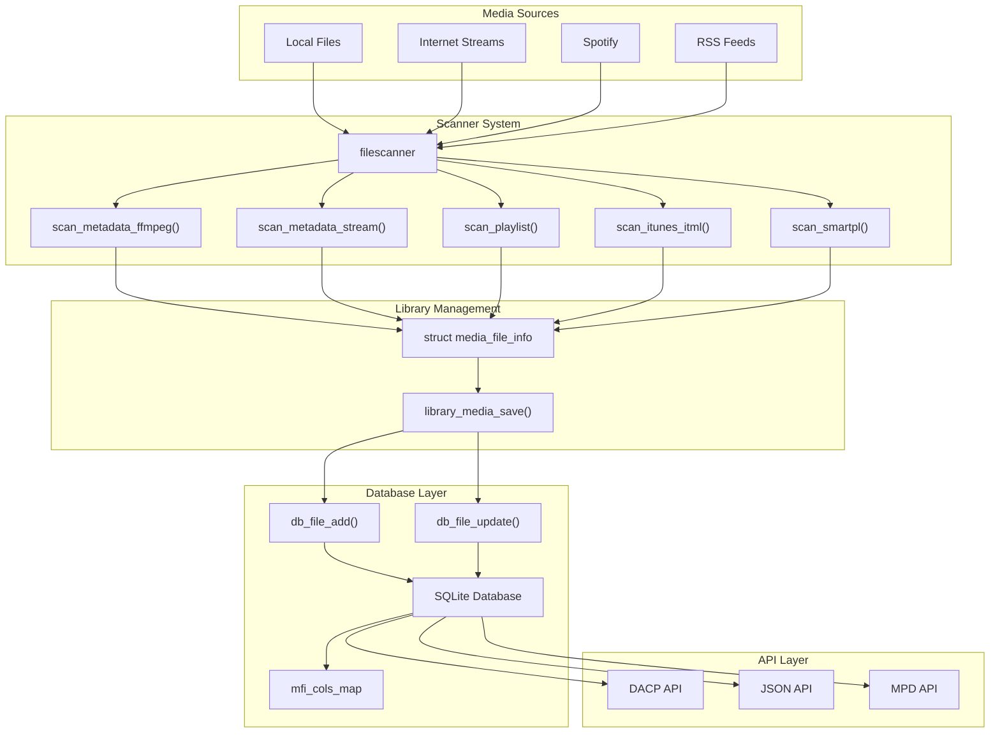

# Media File Information and Metadata

> **Relevant source files**
> * [docs/json-api.md](https://github.com/owntone/owntone-server/blob/23c67a3e/docs/json-api.md)
> * [src/db.c](https://github.com/owntone/owntone-server/blob/23c67a3e/src/db.c)
> * [src/db.h](https://github.com/owntone/owntone-server/blob/23c67a3e/src/db.h)
> * [src/httpd_dacp.c](https://github.com/owntone/owntone-server/blob/23c67a3e/src/httpd_dacp.c)
> * [src/httpd_jsonapi.c](https://github.com/owntone/owntone-server/blob/23c67a3e/src/httpd_jsonapi.c)
> * [src/library.c](https://github.com/owntone/owntone-server/blob/23c67a3e/src/library.c)
> * [src/library.h](https://github.com/owntone/owntone-server/blob/23c67a3e/src/library.h)
> * [src/library/filescanner.c](https://github.com/owntone/owntone-server/blob/23c67a3e/src/library/filescanner.c)
> * [src/library/filescanner.h](https://github.com/owntone/owntone-server/blob/23c67a3e/src/library/filescanner.h)
> * [src/library/filescanner_itunes.c](https://github.com/owntone/owntone-server/blob/23c67a3e/src/library/filescanner_itunes.c)
> * [src/library/filescanner_playlist.c](https://github.com/owntone/owntone-server/blob/23c67a3e/src/library/filescanner_playlist.c)
> * [src/library/filescanner_smartpl.c](https://github.com/owntone/owntone-server/blob/23c67a3e/src/library/filescanner_smartpl.c)
> * [src/mpd.c](https://github.com/owntone/owntone-server/blob/23c67a3e/src/mpd.c)
> * [src/player.c](https://github.com/owntone/owntone-server/blob/23c67a3e/src/player.c)
> * [src/player.h](https://github.com/owntone/owntone-server/blob/23c67a3e/src/player.h)
> * [src/smartpl_query.h](https://github.com/owntone/owntone-server/blob/23c67a3e/src/smartpl_query.h)

This document describes how OwnTone manages media file information and metadata. It covers the structure of media file records, how metadata is stored in the database, how it's extracted from files, and how it's accessed and updated by various components of the system. For information about database schema and upgrades, see [Database Schema and Upgrades](/owntone/owntone-server/2.3-database-schema-and-upgrades).

## Media File Information Structure

OwnTone stores comprehensive metadata about each media file in the library. This information is represented in memory by the `struct media_file_info` structure, which contains over 70 fields covering various aspects of a media file.

### Key Metadata Fields

| Category | Fields |
| --- | --- |
| **Identification** | `id`, `path`, `virtual_path`, `fname`, `directory_id` |
| **Bibliographic** | `title`, `artist`, `album`, `album_artist`, `genre`, `composer`, `year`, etc. |
| **Technical** | `bitrate`, `samplerate`, `channels`, `song_length`, `codectype`, etc. |
| **File Properties** | `file_size`, `time_added`, `time_modified`, etc. |
| **Playback Stats** | `play_count`, `skip_count`, `rating`, `time_played`, etc. |
| **Organization** | `media_kind`, `data_kind`, `scan_kind` |
| **Sorting** | `title_sort`, `artist_sort`, `album_sort`, etc. |

The full structure definition can be found in the header file:

Sources: [src/db.h L167-L253](https://github.com/owntone/owntone-server/blob/23c67a3e/src/db.h#L167-L253)

### Media and Data Kinds

The system categorizes content using several enumeration types:

1. **Media Kind**: Categorizes the type of media content * `MEDIA_KIND_MUSIC` * `MEDIA_KIND_MOVIE` * `MEDIA_KIND_PODCAST` * `MEDIA_KIND_AUDIOBOOK` * `MEDIA_KIND_MUSICVIDEO` * `MEDIA_KIND_TVSHOW`
2. **Data Kind**: Describes the data source * `DATA_KIND_FILE`: Local files * `DATA_KIND_HTTP`: Internet streams/radio * `DATA_KIND_SPOTIFY`: Spotify tracks * `DATA_KIND_PIPE`: Named pipes
3. **Scan Kind**: Indicates which library source created/updates the item * `SCAN_KIND_FILES`: Regular file scanner * `SCAN_KIND_SPOTIFY`: Spotify scanner * `SCAN_KIND_RSS`: RSS feed scanner

Sources: [src/db.h L117-L125](https://github.com/owntone/owntone-server/blob/23c67a3e/src/db.h#L117-L125)

 [src/db.h L134-L140](https://github.com/owntone/owntone-server/blob/23c67a3e/src/db.h#L134-L140)

 [src/db.h L145-L151](https://github.com/owntone/owntone-server/blob/23c67a3e/src/db.h#L145-L151)

## Metadata Flow in the System

The lifecycle of metadata in OwnTone follows a specific flow from file scanning to eventual presentation to users.



Sources: [src/library/filescanner.c L319-L374](https://github.com/owntone/owntone-server/blob/23c67a3e/src/library/filescanner.c#L319-L374)

 [src/library/filescanner.c L167-L196](https://github.com/owntone/owntone-server/blob/23c67a3e/src/library/filescanner.c#L167-L196)

 [src/library.c L127-L152](https://github.com/owntone/owntone-server/blob/23c67a3e/src/library.c#L127-L152)

 [src/db.c L167-L377](https://github.com/owntone/owntone-server/blob/23c67a3e/src/db.c#L167-L377)

## Metadata Extraction

OwnTone extracts metadata from files using several specialized scanners.

### Primary Metadata Sources

1. **File Scanner (FFmpeg)**: Extracts metadata from audio and video files using FFmpeg libraries
2. **Stream Scanner**: Extracts metadata from HTTP streams
3. **Playlist Scanner**: Processes M3U, PLS and other playlist formats
4. **iTunes Scanner**: Parses iTunes XML library files
5. **Smart Playlist Scanner**: Processes OwnTone's smart playlist format

The extraction process differs based on the file type:

* **Audio/Video Files**: Metadata is extracted using FFmpeg libraries via `scan_metadata_ffmpeg()`
* **Streams**: Metadata may come from the stream itself or be extracted from the URL and file extension
* **Playlists**: May contain embedded metadata in comments or extended tags
* **iTunes XML**: Contains extensive metadata that can be mapped to OwnTone's structures

For internet streams, OwnTone creates a special entry with appropriate metadata:

```
mfi->data_kind = DATA_KIND_HTTP;
mfi->time_modified = time(NULL);
mfi->directory_id = DIR_HTTP;
mfi->scan_kind = SCAN_KIND_FILES;
```

Sources: [src/library/filescanner.c L146-L177](https://github.com/owntone/owntone-server/blob/23c67a3e/src/library/filescanner.c#L146-L177)

 [src/library/filescanner_playlist.c L147-L177](https://github.com/owntone/owntone-server/blob/23c67a3e/src/library/filescanner_playlist.c#L147-L177)

## Database Storage

Media file metadata is stored in the SQLite database, with a detailed mapping system that translates between the `struct media_file_info` in memory and the database columns.

### Column Mapping

The mapping between structure fields and database columns is defined in the `mfi_cols_map` array, which specifies for each field:

* Column name
* Offset in the structure
* Field type (int, int64, string)
* Fixup type (special handling for certain fields)
* Flags (special behavior for binding/updating)

```

```

Sources: [src/db.c L167-L235](https://github.com/owntone/owntone-server/blob/23c67a3e/src/db.c#L167-L235)

### Special Field Handling

Some fields require special "fixup" handling when being read from or written to the database:

1. **Sorting fields**: Title, artist, album have corresponding `*_sort` fields that are normalized for proper sorting * Uses Unicode normalization to handle different languages correctly * Strips articles like "a", "an", "the" from the beginning * Handles special characters and numbers
2. **Media Type fields**: Conversion between string and numeric representation * `media_kind` - Enumeration mapping to human-readable labels * `data_kind` - Identifies source type (file, stream, etc.) * `scan_kind` - Identifies which scanner processed the file
3. **Rating and Counter fields**: Special update rules * Never reset to zero (to avoid losing user-specified ratings) * Incremented atomically for playcount, skipcount, etc.

Sources: [src/db.c L986-L1012](https://github.com/owntone/owntone-server/blob/23c67a3e/src/db.c#L986-L1012)

 [src/db.c L545-L600](https://github.com/owntone/owntone-server/blob/23c67a3e/src/db.c#L545-L600)

## Metadata Access

OwnTone provides several ways to access metadata through different interfaces.

### Internal Access

Within the OwnTone server, components access metadata through database query functions:

* `db_file_fetch_byid(int id)`: Retrieves a single file by ID
* `db_file_fetch_byvirtualpath(const char *path)`: Retrieves a file by virtual path
* `db_query_fetch_file(struct db_media_file_info *dbmfi, struct query_params *qp)`: Fetches files using custom queries

The player system maintains active metadata for the currently playing track and upcoming tracks in its queue.

Sources: [src/db.h L588-L720](https://github.com/owntone/owntone-server/blob/23c67a3e/src/db.h#L588-L720)

 [src/player.c L195-L248](https://github.com/owntone/owntone-server/blob/23c67a3e/src/player.c#L195-L248)

### External API Access

External systems can access metadata through several APIs:

1. **DAAP/DACP API**: Digital Audio Access Protocol primarily used by iTunes and compatible clients
2. **JSON API**: Modern REST API that returns file metadata as JSON objects
3. **MPD API**: Music Player Daemon protocol for compatibility with MPD clients

Each API presents metadata slightly differently, but all derive from the core database records.

For example, the JSON API presents track metadata in this format:

```json
{
  "id": 123,
  "title": "Song Title",
  "title_sort": "song title",
  "artist": "Artist Name",
  "artist_sort": "artist name",
  "album": "Album Name",
  "album_sort": "album name",
  "album_artist": "Album Artist",
  "genre": "Genre",
  "year": 2022,
  "track_number": 1,
  "disc_number": 1,
  "length_ms": 240000,
  "bitrate": 320,
  "samplerate": 44100,
  "channels": 2,
  "media_kind": "music",
  "data_kind": "file",
  "path": "/path/to/file.mp3",
  "uri": "library:track:123",
  "artwork_url": "/artwork/item/123"
}
```

Sources: [src/httpd_jsonapi.c L287-L352](https://github.com/owntone/owntone-server/blob/23c67a3e/src/httpd_jsonapi.c#L287-L352)

 [src/mpd.c L631-L672](https://github.com/owntone/owntone-server/blob/23c67a3e/src/mpd.c#L631-L672)

 [src/httpd_dacp.c L632-L752](https://github.com/owntone/owntone-server/blob/23c67a3e/src/httpd_dacp.c#L632-L752)

## Metadata Updates

Metadata can be updated through several mechanisms.

### Filesystem Scanning

When the scanner detects new or modified files, it extracts metadata and updates the database:

1. New files are added using `library_media_save()` which calls `db_file_add()`
2. Modified files are updated using the same function which calls `db_file_update()`

The scanning process is triggered:

* On server startup
* When changes are detected via filesystem monitoring
* When manually requested via the API

Sources: [src/library.c L127-L152](https://github.com/owntone/owntone-server/blob/23c67a3e/src/library.c#L127-L152)

 [src/library/filescanner.c L400-L450](https://github.com/owntone/owntone-server/blob/23c67a3e/src/library/filescanner.c#L400-L450)

### Playback Statistics

Playback statistics (play count, skip count, last played time, etc.) are updated as users interact with media:

* `db_file_inc_playcount()`: Increments play count when a track is played
* `db_file_inc_skipcount()`: Increments skip count when a track is skipped
* `db_file_seek_update()`: Updates seek position for audiobooks, podcasts, etc.

These updates typically happen asynchronously through the worker thread to avoid blocking the player.

Sources: [src/player.c L364-L392](https://github.com/owntone/owntone-server/blob/23c67a3e/src/player.c#L364-L392)

 [src/db.h L658-L673](https://github.com/owntone/owntone-server/blob/23c67a3e/src/db.h#L658-L673)

### User Edits

Some metadata can be edited by users through the various APIs:

* The JSON API allows updating certain fields like rating
* MPD protocol supports rating changes
* Applications can also update metadata through these interfaces

When metadata is changed, appropriate events are fired to notify connected clients of the changes.

Sources: [src/httpd_jsonapi.c L2950-L3050](https://github.com/owntone/owntone-server/blob/23c67a3e/src/httpd_jsonapi.c#L2950-L3050)

 [src/mpd.c L2650-L2700](https://github.com/owntone/owntone-server/blob/23c67a3e/src/mpd.c#L2650-L2700)

## Virtual Paths and Organization

OwnTone uses a "virtual path" system to organize and access media regardless of the actual filesystem structure.

### Virtual Path Structure

* Format: `/file:{actual file path}` for regular files
* Format: `/http:{url}` for HTTP streams
* Format: `/spotify:{id}` for Spotify content

This abstraction allows OwnTone to present a unified view of media from different sources.

Sources: [src/library/filescanner.c L183-L196](https://github.com/owntone/owntone-server/blob/23c67a3e/src/library/filescanner.c#L183-L196)

 [src/db.h L184-L490](https://github.com/owntone/owntone-server/blob/23c67a3e/src/db.h#L184-L490)

### Directory Structure

Media is organized into a virtual directory hierarchy:

* Directory IDs are assigned to each folder in the path
* Each file has a `directory_id` pointing to its parent directory
* Special directory IDs exist for different source types: * `DIR_ROOT`: Root directory (ID: 1) * `DIR_FILE`: Regular files directory (ID: 2) * `DIR_HTTP`: Internet streams directory (ID: 3) * `DIR_SPOTIFY`: Spotify content directory (ID: 4)

Sources: [src/db.h L483-L490](https://github.com/owntone/owntone-server/blob/23c67a3e/src/db.h#L483-L490)

 [src/library/filescanner.c L197-L260](https://github.com/owntone/owntone-server/blob/23c67a3e/src/library/filescanner.c#L197-L260)

## Metadata Caching and Optimization

To improve performance, OwnTone implements several optimizations for metadata handling.

### In-Memory Caching

Frequently accessed metadata is cached in memory to reduce database queries:

* Recently played items
* Current playlist and queue items
* Search results

### Database Optimization

The database schema includes indexes on commonly queried fields:

* Artist, album, title for search operations
* Path and virtual path for direct lookup
* Genre, year, etc. for filtering and browsing

### Metadata Pre-processing

Some metadata is pre-processed for more efficient use:

* Sort fields are normalized for proper alphabetical sorting
* Artwork is processed and cached separately
* Persistent IDs are generated for stable references

Sources: [src/db.c L986-L1093](https://github.com/owntone/owntone-server/blob/23c67a3e/src/db.c#L986-L1093)

 [src/cache.c](https://github.com/owntone/owntone-server/blob/23c67a3e/src/cache.c)

## Conclusion

OwnTone's metadata system is comprehensive and flexible, supporting a wide variety of media types and sources. The system efficiently extracts, stores, and provides access to metadata through well-defined interfaces, making it a robust foundation for music library management.

The careful mapping between in-memory structures and database storage allows for efficient querying and updates, while the virtual path system provides a unified view across different media sources. This architecture enables OwnTone to serve as a versatile media server for a wide range of client applications.