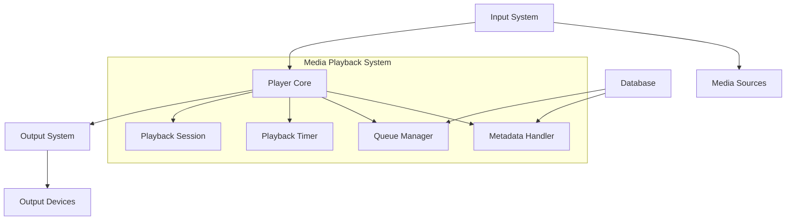
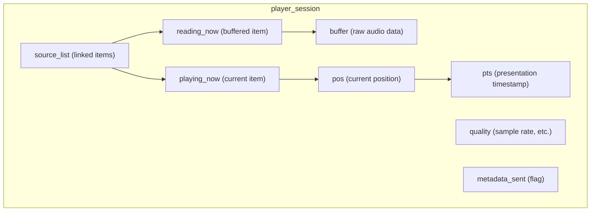
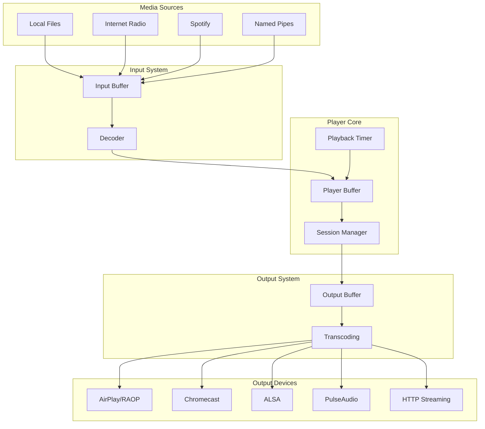
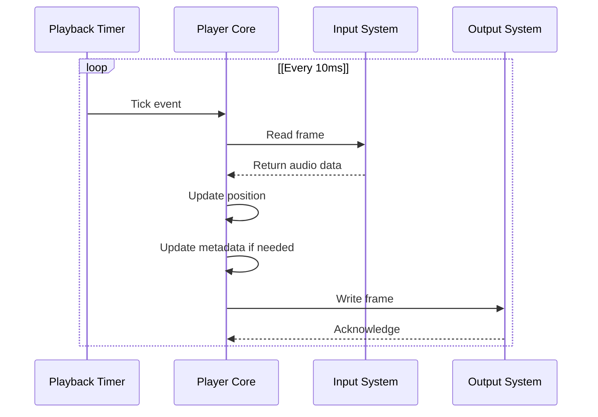
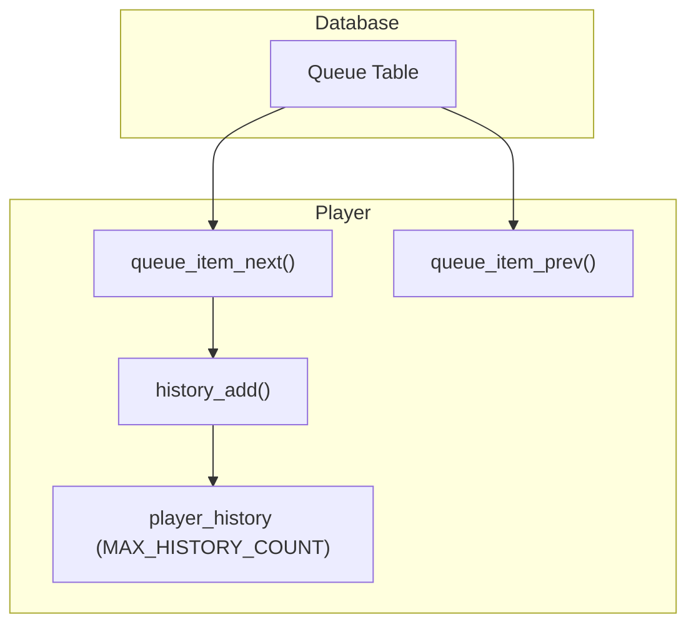
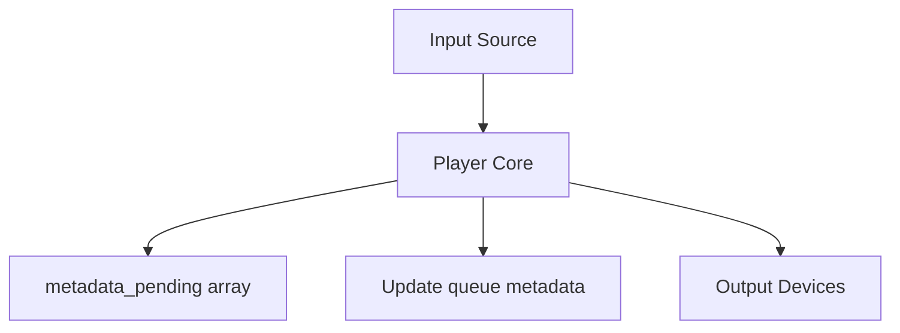

# Media Playback System

> **Relevant source files**
> * [src/db.c](https://github.com/owntone/owntone-server/blob/23c67a3e/src/db.c)
> * [src/db.h](https://github.com/owntone/owntone-server/blob/23c67a3e/src/db.h)
> * [src/httpd_dacp.c](https://github.com/owntone/owntone-server/blob/23c67a3e/src/httpd_dacp.c)
> * [src/mpd.c](https://github.com/owntone/owntone-server/blob/23c67a3e/src/mpd.c)
> * [src/outputs.c](https://github.com/owntone/owntone-server/blob/23c67a3e/src/outputs.c)
> * [src/outputs.h](https://github.com/owntone/owntone-server/blob/23c67a3e/src/outputs.h)
> * [src/outputs/airplay.c](https://github.com/owntone/owntone-server/blob/23c67a3e/src/outputs/airplay.c)
> * [src/outputs/alsa.c](https://github.com/owntone/owntone-server/blob/23c67a3e/src/outputs/alsa.c)
> * [src/outputs/cast.c](https://github.com/owntone/owntone-server/blob/23c67a3e/src/outputs/cast.c)
> * [src/outputs/dummy.c](https://github.com/owntone/owntone-server/blob/23c67a3e/src/outputs/dummy.c)
> * [src/outputs/fifo.c](https://github.com/owntone/owntone-server/blob/23c67a3e/src/outputs/fifo.c)
> * [src/outputs/pulse.c](https://github.com/owntone/owntone-server/blob/23c67a3e/src/outputs/pulse.c)
> * [src/outputs/raop.c](https://github.com/owntone/owntone-server/blob/23c67a3e/src/outputs/raop.c)
> * [src/player.c](https://github.com/owntone/owntone-server/blob/23c67a3e/src/player.c)
> * [src/player.h](https://github.com/owntone/owntone-server/blob/23c67a3e/src/player.h)

## Purpose and Overview

The Media Playback System is the core component of OwnTone responsible for playing media content from various sources through different output devices. It handles audio buffering, playback control, synchronization across multiple speakers, queue management, and metadata distribution. This system bridges the input sources (like files, streams, or Spotify) with output devices (like AirPlay speakers, Chromecast, or local audio).

For information about specific output implementations, see [Audio Output System](/owntone/owntone-server/3.2-audio-output-system). For details about how media files are managed in the database, see [Core Database System](/owntone/owntone-server/2-core-database-system).

## Architecture

The Media Playback System consists of several interconnected components that work together to provide a seamless audio playback experience.

### Component Diagram

Sources: [src/player.c](https://github.com/owntone/owntone-server/blob/23c67a3e/src/player.c)

 [src/outputs.c](https://github.com/owntone/owntone-server/blob/23c67a3e/src/outputs.c)

 [src/db.c](https://github.com/owntone/owntone-server/blob/23c67a3e/src/db.c)

## Playback Session Management

The playback session is the central structure that maintains the state of current playback. It's implemented as `struct player_session` in the player module.

### Playback Session Structure

Sources: [src/player.c L294-L295](https://github.com/owntone/owntone-server/blob/23c67a3e/src/player.c#L294-L295)

 [src/player.c L971](https://github.com/owntone/owntone-server/blob/23c67a3e/src/player.c#L971-L971)

The session tracks:

* Audio buffer containing raw PCM data
* Current playback position
* Active source items (currently playing and reading)
* Audio quality settings (sample rate, bits per sample, channels)
* Presentation timestamps for synchronization
* Metadata state

## Audio Data Flow

The audio flow through the system is carefully managed to ensure smooth playback with proper synchronization across different outputs.

### Media Data Flow Diagram

Sources: [src/player.c L98-L102](https://github.com/owntone/owntone-server/blob/23c67a3e/src/player.c#L98-L102)

 [src/outputs.c L41-L79](https://github.com/owntone/owntone-server/blob/23c67a3e/src/outputs.c#L41-L79)

The playback process works as follows:

1. Input module reads and decodes data from sources into a buffer
2. The player processes this data on timer ticks (every 10ms)
3. Audio frames are sent to the output system
4. Output system transcodes if necessary and distributes to active devices

## Player States and Control

The player operates according to a state machine with the following states:

| State | Description |
| --- | --- |
| PLAY_STOPPED | Playback is completely stopped |
| PLAY_PAUSED | Playback is paused but ready to resume |
| PLAY_PLAYING | Playback is active and audio is being played |

Sources: [src/player.c L14-L18](https://github.com/owntone/owntone-server/blob/23c67a3e/src/player.c#L14-L18)

Additionally, the player supports several playback modes:

| Mode | Options | Description |
| --- | --- | --- |
| Repeat | OFF, SONG, ALL | Controls how playback continues after current item ends |
| Shuffle | ON/OFF | Randomizes the order of playback |
| Consume | ON/OFF | Removes items from queue after playing |

Sources: [src/player.c L20-L24](https://github.com/owntone/owntone-server/blob/23c67a3e/src/player.c#L20-L24)

### Player Control API

The player provides a comprehensive API for controlling playback:

| Function | Description |
| --- | --- |
| `player_playback_start()` | Start playback |
| `player_playback_stop()` | Stop playback |
| `player_playback_pause()` | Pause playback |
| `player_playback_seek()` | Seek to position |
| `player_playback_next()` | Skip to next item |
| `player_playback_prev()` | Go to previous item |
| `player_volume_set()` | Set global player volume |
| `player_repeat_set()` | Set repeat mode |
| `player_shuffle_set()` | Set shuffle mode |
| `player_consume_set()` | Set consume mode |

Sources: [src/player.h L140-L186](https://github.com/owntone/owntone-server/blob/23c67a3e/src/player.h#L140-L186)

## Playback Timing

The playback system uses a high-resolution timer to control the flow of audio data.

### Playback Timer

Sources: [src/player.c L102-L109](https://github.com/owntone/owntone-server/blob/23c67a3e/src/player.c#L102-L109)

 [src/player.c L320-L336](https://github.com/owntone/owntone-server/blob/23c67a3e/src/player.c#L320-L336)

Key timing concepts:

* **Tick Interval**: 10ms (defined by `PLAYER_TICK_INTERVAL`), controlling how often playback advances
* **Session Timing**: Tracks start time, presentation timestamp, and current position
* **Buffer Management**: Monitors buffer levels to prevent underruns/overruns
* **Synchronization**: Ensures multiple outputs play in sync

## Queue Management

The player maintains both a playback queue and a history of played items.

### Queue Structure and Operations

Sources: [src/player.c L451-L494](https://github.com/owntone/owntone-server/blob/23c67a3e/src/player.c#L451-L494)

 [src/player.c L409-L433](https://github.com/owntone/owntone-server/blob/23c67a3e/src/player.c#L409-L433)

Queue functionality includes:

* **Item Fetching**: Get next/previous items based on current state
* **History Tracking**: Maintain a list of previously played items (up to 20)
* **Mode Handling**: Support repeat, shuffle, and consume modes
* **Database Integration**: Store queue state in the database for persistence

## Metadata Handling

The player processes metadata from input sources and delivers it to outputs at the correct time.

### Metadata Flow

Sources: [src/player.c L496-L562](https://github.com/owntone/owntone-server/blob/23c67a3e/src/player.c#L496-L562)

 [src/player.c L1028-L1074](https://github.com/owntone/owntone-server/blob/23c67a3e/src/player.c#L1028-L1074)

The metadata process involves:

1. Input provides metadata updates with position information
2. Player registers this metadata in a pending array
3. When playback reaches the correct position, metadata is processed
4. Queue item metadata may be updated if changed
5. Metadata is sent to all active outputs

## Source Management

The player manages sources through a linked list of `struct player_source` objects. Each source represents an item from the queue.

### Source Structure

| Field | Description |
| --- | --- |
| `id` | File ID in the database |
| `item_id` | Item ID in the queue |
| `path` | Path to the media file |
| `data_kind` | Type of data (file, URL, Spotify) |
| `media_kind` | Media type (music, podcast, etc.) |
| `len_ms` | Length of the item in milliseconds |
| `pos_ms` | Current position in milliseconds |
| `quality` | Audio quality settings |
| `read_start/end` | Read position boundaries |
| `play_start/end` | Play position boundaries |
| `metadata_update` | Position for metadata update |
| `prev/next` | Linked list pointers |

Sources: [src/player.c L194-L248](https://github.com/owntone/owntone-server/blob/23c67a3e/src/player.c#L194-L248)

## Synchronization

The Media Playback System ensures synchronized playback across multiple output devices through several mechanisms:

1. **Centralized Timing**: All timing is controlled by the player core
2. **Buffer Management**: Each output maintains appropriate buffer levels
3. **RTP Protocol**: Network outputs use Real-time Transport Protocol
4. **Timing Feedback**: Outputs provide feedback for drift compensation
5. **Metadata Coordination**: Metadata is delivered at the correct time

### Synchronization Challenges

* **Network Latency**: Different outputs have different network delays
* **Buffer Requirements**: Each output type needs specific buffer levels
* **Drift Compensation**: Prevent timing drift between devices
* **Quality Differences**: Handle different audio quality requirements

Sources: [src/player.c L110-L117](https://github.com/owntone/owntone-server/blob/23c67a3e/src/player.c#L110-L117)

 [src/outputs.c L42-L43](https://github.com/owntone/owntone-server/blob/23c67a3e/src/outputs.c#L42-L43)

## Error Handling

The player includes robust error handling for various scenarios:

| Error Scenario | Handling Approach |
| --- | --- |
| Input errors | Track skipping, queue advancement |
| Output disconnection | Device reconnection attempts |
| Buffer underruns | Wait for more data or suspend playback |
| Buffer overruns | Reset output or drop frames |
| Timing issues | Drift compensation and resynchronization |

Sources: [src/player.c L357-L381](https://github.com/owntone/owntone-server/blob/23c67a3e/src/player.c#L357-L381)

 [src/player.c L1003-L1027](https://github.com/owntone/owntone-server/blob/23c67a3e/src/player.c#L1003-L1027)

## Implementation Details

### Key Constants

| Constant | Value | Description |
| --- | --- | --- |
| `PLAYER_TICK_INTERVAL` | 10 | Milliseconds between playback ticks |
| `PLAYER_READ_BEHIND_MAX` | 1500 | Maximum milliseconds to allow input reading to lag |
| `PLAYER_WRITE_BEHIND_MAX` | 1500 | Maximum milliseconds to allow output writing to lag |
| `OUTPUTS_BUFFER_DURATION` | 2 | Seconds that outputs should buffer before playback |
| `MAX_HISTORY_COUNT` | 20 | Maximum number of items in play history |

Sources: [src/player.c L102-L116](https://github.com/owntone/owntone-server/blob/23c67a3e/src/player.c#L102-L116)

 [src/player.h L12](https://github.com/owntone/owntone-server/blob/23c67a3e/src/player.h#L12-L12)

 [src/outputs.h L42](https://github.com/owntone/owntone-server/blob/23c67a3e/src/outputs.h#L42-L42)

### Session Updates

The session is updated through a series of specialized functions:

* `session_update_play_eof()`: Handle playback reaching end of file
* `session_update_play_start()`: Initialize playback of a new item
* `session_update_read_next()`: Start reading the next item
* `session_update_read_eof()`: Handle input reaching end of file
* `session_update_read_start()`: Initialize reading of a new item
* `session_update_read()`: Update read position
* `session_update_read_quality()`: Handle quality changes
* `session_update_read_metadata()`: Process new metadata
* `session_update_play_metadata()`: Update playback metadata

Sources: [src/player.c L793-L944](https://github.com/owntone/owntone-server/blob/23c67a3e/src/player.c#L793-L944)

## Integration with Other Systems

The Media Playback System integrates with other OwnTone components:

* **Database System**: Store and retrieve metadata and queue information
* **Output System**: Manage audio output to various device types
* **Input System**: Read media data from various sources
* **Metadata Handling**: Process and distribute media metadata
* **Network Protocols**: Handle remote control via DAAP, MPD, etc.

Sources: [src/outputs.c](https://github.com/owntone/owntone-server/blob/23c67a3e/src/outputs.c)

 [src/db.c](https://github.com/owntone/owntone-server/blob/23c67a3e/src/db.c)

 [src/mpd.c](https://github.com/owntone/owntone-server/blob/23c67a3e/src/mpd.c)

 [src/httpd_dacp.c](https://github.com/owntone/owntone-server/blob/23c67a3e/src/httpd_dacp.c)

## Conclusion

The Media Playback System is the central engine of OwnTone that coordinates all aspects of media playback. Its modular design allows for flexible support of various input sources and output devices while maintaining synchronized playback with proper metadata handling. The timing-based approach with a regular tick interval provides precise control over the audio flow through the system.