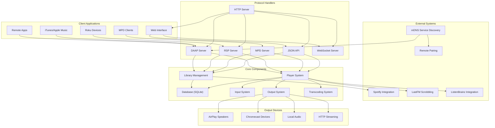
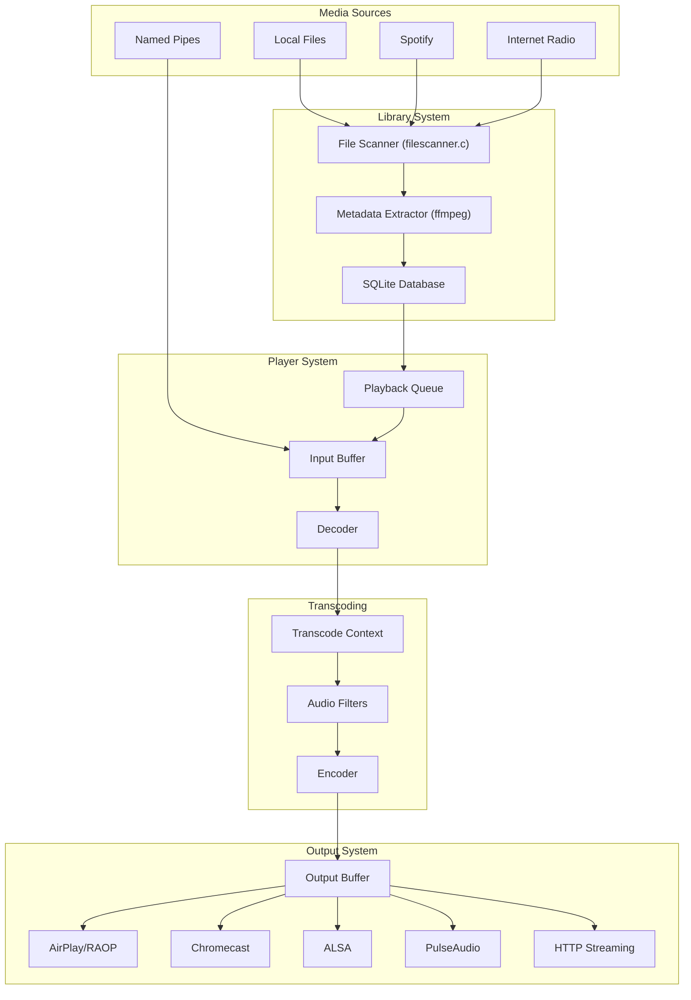

# OwnTone Overview

> **Relevant source files**
> * [ChangeLog](https://github.com/owntone/owntone-server/blob/23c67a3e/ChangeLog)
> * [INSTALL.md](https://github.com/owntone/owntone-server/blob/23c67a3e/INSTALL.md)
> * [README.md](https://github.com/owntone/owntone-server/blob/23c67a3e/README.md)
> * [configure.ac](https://github.com/owntone/owntone-server/blob/23c67a3e/configure.ac)
> * [docs/advanced/multiple-instances.md](https://github.com/owntone/owntone-server/blob/23c67a3e/docs/advanced/multiple-instances.md)
> * [docs/artwork.md](https://github.com/owntone/owntone-server/blob/23c67a3e/docs/artwork.md)
> * [docs/changelog.md](https://github.com/owntone/owntone-server/blob/23c67a3e/docs/changelog.md)
> * [docs/development.md](https://github.com/owntone/owntone-server/blob/23c67a3e/docs/development.md)
> * [docs/index.md](https://github.com/owntone/owntone-server/blob/23c67a3e/docs/index.md)
> * [docs/integrations/lastfm.md](https://github.com/owntone/owntone-server/blob/23c67a3e/docs/integrations/lastfm.md)
> * [docs/library.md](https://github.com/owntone/owntone-server/blob/23c67a3e/docs/library.md)
> * [mkdocs.yml](https://github.com/owntone/owntone-server/blob/23c67a3e/mkdocs.yml)
> * [src/Makefile.am](https://github.com/owntone/owntone-server/blob/23c67a3e/src/Makefile.am)
> * [src/main.c](https://github.com/owntone/owntone-server/blob/23c67a3e/src/main.c)

OwnTone is an open source media server that streams audio from various sources to multiple output devices. It provides a flexible and feature-rich solution for managing and playing your music collection across your network. This document gives a high-level overview of the OwnTone system, its architecture, and how its components interact.

For installation instructions, see [Installation and Configuration](/owntone/owntone-server/1.2-installation-and-configuration). For details about specific subsystems, refer to the corresponding wiki pages linked throughout this document.

## What is OwnTone?

OwnTone (previously known as forked-daapd) is a media server that runs on Linux, BSD, and macOS. It allows sharing and streaming your media library to various devices and clients, including:

* iTunes and Apple Music (via DAAP protocol)
* AirPlay speakers and devices (including multi-room synchronization)
* Chromecast devices
* Roku Soundbridge devices (via RSP protocol)
* Local audio playback via ALSA or PulseAudio
* Web browsers (via HTTP streaming)

OwnTone can be controlled through multiple interfaces:

* Web interface (built with Vue.js)
* Apple Remote and compatible apps
* MPD clients
* JSON API for custom integrations

Beyond local media files, OwnTone supports internet radio streams, Spotify integration (with a premium account), podcasts, and audiobooks.

Sources: [README.md](https://github.com/owntone/owntone-server/blob/23c67a3e/README.md)

 [docs/index.md](https://github.com/owntone/owntone-server/blob/23c67a3e/docs/index.md)

 [src/main.c L1-L21](https://github.com/owntone/owntone-server/blob/23c67a3e/src/main.c#L1-L21)

## History and Evolution

OwnTone began as a fork of mt-daapd (also known as Firefly Media Server). It was initially called forked-daapd before being renamed to OwnTone with version 28.0. The project has evolved significantly over time, adding support for more protocols, device types, and features.

The name "OwnTone" reflects the project's focus on providing users with control over their own music, as opposed to relying solely on streaming services. The current codebase is written in C with a modern web interface built with Vue.js.

Sources: [README.md](https://github.com/owntone/owntone-server/blob/23c67a3e/README.md)

 [ChangeLog L170-L185](https://github.com/owntone/owntone-server/blob/23c67a3e/ChangeLog#L170-L185)

## System Architecture Overview

OwnTone follows a modular design with several interconnected components that handle different aspects of media management and playback.

### High-Level Architecture Diagram



Sources: [src/main.c L60-L76](https://github.com/owntone/owntone-server/blob/23c67a3e/src/main.c#L60-L76)

 [src/Makefile.am L81-L136](https://github.com/owntone/owntone-server/blob/23c67a3e/src/Makefile.am#L81-L136)

## Initialization and Startup Sequence

When OwnTone starts, it initializes its components in a specific order to ensure dependencies are satisfied. The following diagram illustrates this process.

```mermaid
sequenceDiagram
  participant main()
  participant conffile_load()
  participant logger_init()
  participant mdns_init()
  participant db_init()
  participant worker_init()
  participant cache_init()
  participant library_init()
  participant player_init()
  participant httpd_init()
  participant mpd_init()
  participant remote_pairing_init()
  participant register_services()

  main()->>conffile_load(): Load configuration
  main()->>logger_init(): Initialize logging
  main()->>mdns_init(): Initialize mDNS
  main()->>db_init(): Initialize database
  main()->>worker_init(): Initialize worker thread
  main()->>cache_init(): Initialize cache thread
  main()->>library_init(): Initialize library thread
  main()->>player_init(): Initialize player
  main()->>httpd_init(): Initialize HTTP server
  note over httpd_init(): Register DAAP, RSP, JSON API modules
  main()->>mpd_init(): Initialize MPD server (if enabled)
  main()->>remote_pairing_init(): Initialize Remote pairing service
  main()->>register_services(): Register mDNS services
  library_init()->>library_init(): Start file scanner
  player_init()->>player_init(): Register outputs
  note over main(): Start main event loop
```

Sources: [src/main.c L482-L919](https://github.com/owntone/owntone-server/blob/23c67a3e/src/main.c#L482-L919)

## Media Data Flow

The following diagram illustrates how media data flows through OwnTone from various sources to output devices.



Sources: [src/transcode.c](https://github.com/owntone/owntone-server/blob/23c67a3e/src/transcode.c)

 [src/player.c](https://github.com/owntone/owntone-server/blob/23c67a3e/src/player.c)

 [src/outputs.c](https://github.com/owntone/owntone-server/blob/23c67a3e/src/outputs.c)

 [src/library/filescanner.c](https://github.com/owntone/owntone-server/blob/23c67a3e/src/library/filescanner.c)

## Core Components

OwnTone consists of several core components that work together to provide its functionality. These components are organized as subsystems, each handling a specific aspect of the media server's operation.

### Database System

The database is a central component that stores all metadata about media files, playlists, and server state. OwnTone uses SQLite as its database engine.

Key database functions:

* Store and retrieve metadata for media files
* Manage playlists and the playback queue
* Cache artwork and other media-related information
* Track playback history and statistics

For more details, see [Core Database System](/owntone/owntone-server/2-core-database-system) and its subpages.

Sources: [src/db.c](https://github.com/owntone/owntone-server/blob/23c67a3e/src/db.c)

 [src/db_init.c](https://github.com/owntone/owntone-server/blob/23c67a3e/src/db_init.c)

 [src/db_upgrade.c](https://github.com/owntone/owntone-server/blob/23c67a3e/src/db_upgrade.c)

### Library Management

The library system is responsible for scanning, organizing, and providing access to media files.

Key library functions:

* Scan the filesystem for media files
* Extract metadata from files using FFmpeg
* Monitor directories for changes (using inotify)
* Update the database with file information
* Provide search and browsing capabilities

For more details, see [Library Management](/owntone/owntone-server/4-library-management) and its subpages.

Sources: [src/library.c](https://github.com/owntone/owntone-server/blob/23c67a3e/src/library.c)

 [src/library/filescanner.c](https://github.com/owntone/owntone-server/blob/23c67a3e/src/library/filescanner.c)

### Media Playback System

The player system handles the actual playback of media, managing the playback state, queue, and sending audio to output devices.

Key playback functions:

* Manage the playback queue
* Decode audio files
* Handle playback commands (play, pause, skip, etc.)
* Control volume and other playback parameters
* Stream audio to output devices

For more details, see [Media Playback System](/owntone/owntone-server/3-media-playback-system) and its subpages.

Sources: [src/player.c](https://github.com/owntone/owntone-server/blob/23c67a3e/src/player.c)

 [src/input.c](https://github.com/owntone/owntone-server/blob/23c67a3e/src/input.c)

 [src/outputs.c](https://github.com/owntone/owntone-server/blob/23c67a3e/src/outputs.c)

### Input Sources

OwnTone supports several types of input sources:

| Input Type | Description | Implementation |
| --- | --- | --- |
| Local Files | Audio files stored on the local filesystem | [src/inputs/file.c](https://github.com/owntone/owntone-server/blob/23c67a3e/src/inputs/file.c) |
| HTTP Streams | Internet radio and other HTTP-based audio streams | [src/inputs/http.c](https://github.com/owntone/owntone-server/blob/23c67a3e/src/inputs/http.c) |
| Pipes | Named pipes for interprocess audio streaming | [src/inputs/pipe.c](https://github.com/owntone/owntone-server/blob/23c67a3e/src/inputs/pipe.c) |
| Spotify | Streaming from Spotify (requires premium account) | [src/inputs/spotify.c](https://github.com/owntone/owntone-server/blob/23c67a3e/src/inputs/spotify.c) |

Sources: [src/input.c](https://github.com/owntone/owntone-server/blob/23c67a3e/src/input.c)

 [src/inputs/](https://github.com/owntone/owntone-server/blob/23c67a3e/src/inputs/)

### Output System

The output system routes audio to various types of output devices:

| Output Type | Description | Implementation |
| --- | --- | --- |
| AirPlay | Stream to AirPlay 1 and 2 devices | [src/outputs/airplay.c](https://github.com/owntone/owntone-server/blob/23c67a3e/src/outputs/airplay.c) <br>  [src/outputs/raop.c](https://github.com/owntone/owntone-server/blob/23c67a3e/src/outputs/raop.c) |
| Chromecast | Stream to Google Cast devices | [src/outputs/cast.c](https://github.com/owntone/owntone-server/blob/23c67a3e/src/outputs/cast.c) |
| ALSA | Local audio playback using ALSA | [src/outputs/alsa.c](https://github.com/owntone/owntone-server/blob/23c67a3e/src/outputs/alsa.c) |
| PulseAudio | Local audio playback using PulseAudio | [src/outputs/pulse.c](https://github.com/owntone/owntone-server/blob/23c67a3e/src/outputs/pulse.c) |
| HTTP Streaming | Stream audio over HTTP | [src/outputs/streaming.c](https://github.com/owntone/owntone-server/blob/23c67a3e/src/outputs/streaming.c) |

For more details, see [Audio Output System](/owntone/owntone-server/3.2-audio-output-system).

Sources: [src/outputs.c](https://github.com/owntone/owntone-server/blob/23c67a3e/src/outputs.c)

 [src/outputs/](https://github.com/owntone/owntone-server/blob/23c67a3e/src/outputs/)

### Transcoding System

The transcoding system converts audio between different formats as needed, using FFmpeg:

* Convert format-specific audio to raw PCM for internal processing
* Convert PCM to format required by output devices
* Apply audio filters and normalize volume levels
* Handle sample rate and bit depth conversion

For more details, see [Media Transcoding](/owntone/owntone-server/3.4-media-transcoding).

Sources: [src/transcode.c](https://github.com/owntone/owntone-server/blob/23c67a3e/src/transcode.c)

## Network Protocols

OwnTone supports multiple network protocols for client interaction and media streaming:

| Protocol | Purpose | Implementation |
| --- | --- | --- |
| DAAP | Digital Audio Access Protocol used by iTunes/Apple Music | [src/httpd_daap.c](https://github.com/owntone/owntone-server/blob/23c67a3e/src/httpd_daap.c) |
| DACP | Digital Audio Control Protocol for remote control | [src/httpd_dacp.c](https://github.com/owntone/owntone-server/blob/23c67a3e/src/httpd_dacp.c) |
| RSP | Roku Server Protocol for Roku Soundbridge devices | [src/httpd_rsp.c](https://github.com/owntone/owntone-server/blob/23c67a3e/src/httpd_rsp.c) |
| MPD | Music Player Daemon protocol | [src/mpd.c](https://github.com/owntone/owntone-server/blob/23c67a3e/src/mpd.c) |
| JSON API | HTTP-based JSON API for custom clients | [src/httpd_jsonapi.c](https://github.com/owntone/owntone-server/blob/23c67a3e/src/httpd_jsonapi.c) |
| HTTP | Web interface and direct media streaming | [src/httpd.c](https://github.com/owntone/owntone-server/blob/23c67a3e/src/httpd.c) |

For more details, see [Network Protocols](/owntone/owntone-server/5-network-protocols) and its subpages.

Sources: [src/httpd.c](https://github.com/owntone/owntone-server/blob/23c67a3e/src/httpd.c)

 [src/httpd_daap.c](https://github.com/owntone/owntone-server/blob/23c67a3e/src/httpd_daap.c)

 [src/httpd_rsp.c](https://github.com/owntone/owntone-server/blob/23c67a3e/src/httpd_rsp.c)

 [src/mpd.c](https://github.com/owntone/owntone-server/blob/23c67a3e/src/mpd.c)

 [src/httpd_jsonapi.c](https://github.com/owntone/owntone-server/blob/23c67a3e/src/httpd_jsonapi.c)

## Service Discovery and Pairing

OwnTone uses mDNS (Multicast DNS) for service discovery, allowing clients to find it on the network:

* Advertises DAAP, RSP, and HTTP services
* Registers service information including library name
* Handles device pairing for Remote and AirPlay devices
* Manages authentication for secured services

For more details, see [mDNS and Remote Pairing](/owntone/owntone-server/5.3-mdns-and-remote-pairing).

Sources: [src/mdns.h](https://github.com/owntone/owntone-server/blob/23c67a3e/src/mdns.h)

 [src/mdns_avahi.c](https://github.com/owntone/owntone-server/blob/23c67a3e/src/mdns_avahi.c)

 [src/mdns_dnssd.c](https://github.com/owntone/owntone-server/blob/23c67a3e/src/mdns_dnssd.c)

 [src/remote_pairing.c](https://github.com/owntone/owntone-server/blob/23c67a3e/src/remote_pairing.c)

## Web Interface

OwnTone includes a modern web interface built with Vue.js:

* Mobile-friendly responsive design
* Real-time updates via WebSocket
* Library browsing and search
* Playback control and queue management
* Output device selection and volume control
* Settings management

For more details, see [Web Frontend](/owntone/owntone-server/6-web-frontend) and its subpages.

Sources: [htdocs/](https://github.com/owntone/owntone-server/blob/23c67a3e/htdocs/)

## Integration with External Services

OwnTone integrates with several external services:

| Service | Purpose | Implementation |
| --- | --- | --- |
| Spotify | Access and play Spotify content | [src/library/spotify_webapi.c](https://github.com/owntone/owntone-server/blob/23c67a3e/src/library/spotify_webapi.c) |
| LastFM | Scrobble played tracks | [src/lastfm.c](https://github.com/owntone/owntone-server/blob/23c67a3e/src/lastfm.c) |
| ListenBrainz | Scrobble played tracks | [src/listenbrainz.c](https://github.com/owntone/owntone-server/blob/23c67a3e/src/listenbrainz.c) |

For more details, see [Spotify Integration](/owntone/owntone-server/5.1-daap-and-rsp-protocols) and [LastFM Integration](/owntone/owntone-server/5.5-lastfm-integration).

Sources: [src/library/spotify_webapi.c](https://github.com/owntone/owntone-server/blob/23c67a3e/src/library/spotify_webapi.c)

 [src/lastfm.c](https://github.com/owntone/owntone-server/blob/23c67a3e/src/lastfm.c)

 [src/listenbrainz.c](https://github.com/owntone/owntone-server/blob/23c67a3e/src/listenbrainz.c)

## Supported Media Types

OwnTone supports a wide range of audio formats through FFmpeg:

* MP3, AAC, MP4
* FLAC, ALAC
* Ogg Vorbis
* WMA
* AIFF, WAV
* Monkey's Audio (APE)
* And many more through FFmpeg

The system can transcode between formats as needed to ensure compatibility with output devices.

Sources: [docs/library.md L75-L93](https://github.com/owntone/owntone-server/blob/23c67a3e/docs/library.md#L75-L93)

## Configuration and Customization

OwnTone is configured through a configuration file (typically `/etc/owntone.conf`), which allows customization of various aspects:

* Library locations and scanning options
* Network settings including ports and interfaces
* Output device configuration
* Authentication and security options
* Logging and performance tuning

For more details, see [Installation and Configuration](/owntone/owntone-server/1.2-installation-and-configuration).

Sources: [src/conffile.c](https://github.com/owntone/owntone-server/blob/23c67a3e/src/conffile.c)

 [src/main.c L94-L115](https://github.com/owntone/owntone-server/blob/23c67a3e/src/main.c#L94-L115)

## Summary

OwnTone provides a comprehensive solution for managing and streaming media across your network. Its modular architecture, support for multiple protocols and device types, and extensive customization options make it a powerful choice for home media streaming.

The core systems—database, library management, playback, input, output, and transcoding—work together to provide a seamless experience for users accessing their media through various clients and devices.

For more detailed information about specific aspects of OwnTone, refer to the linked wiki pages throughout this document.