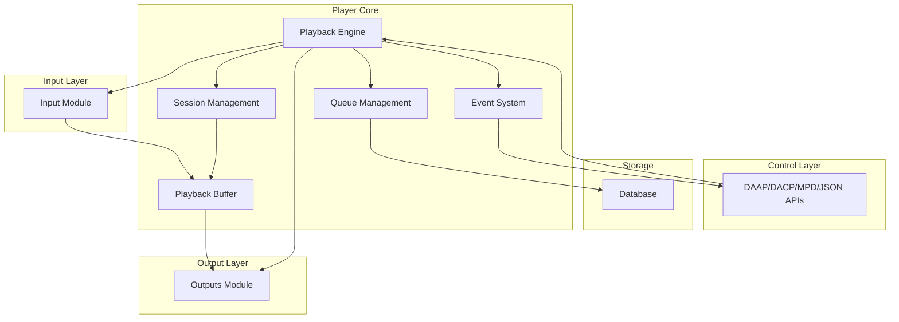
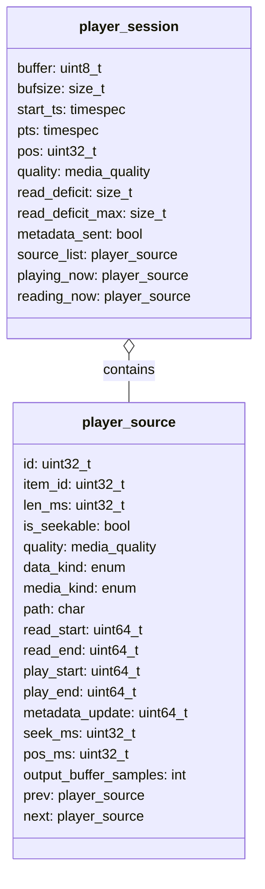
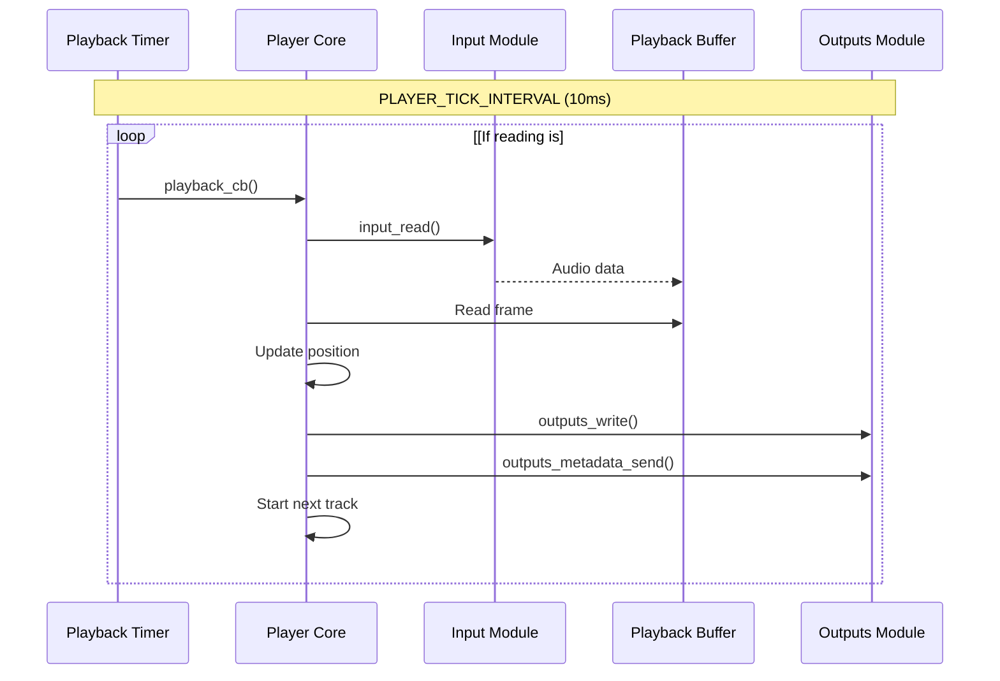
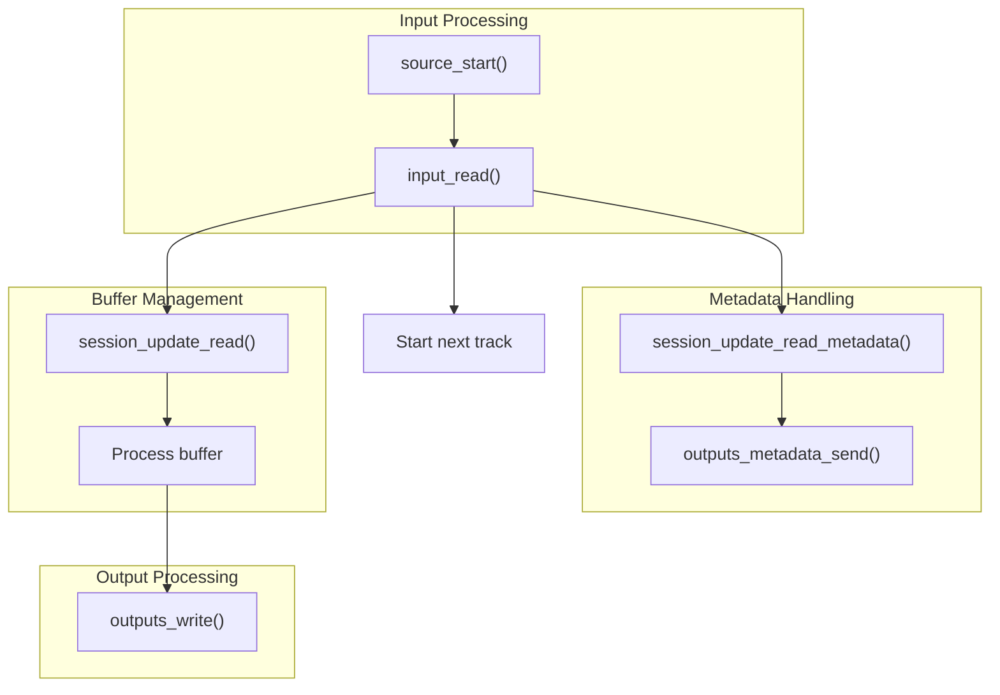
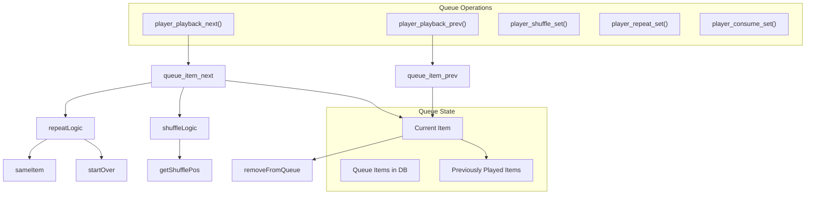
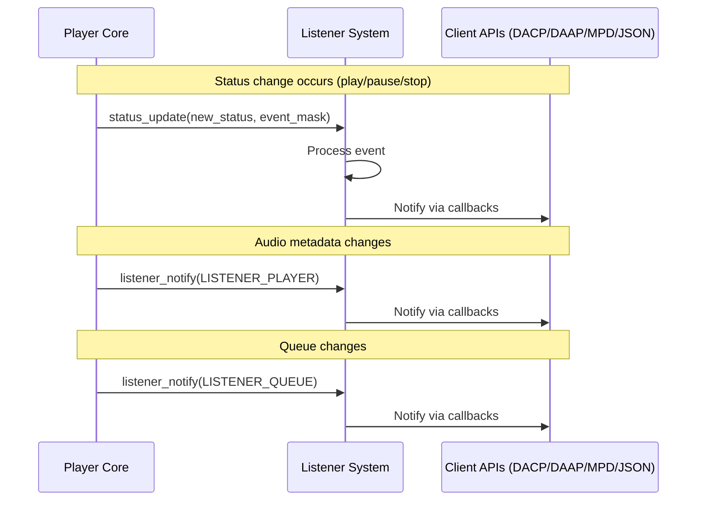
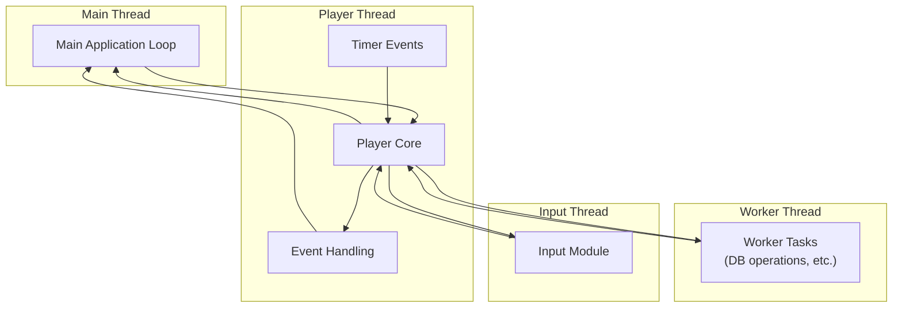
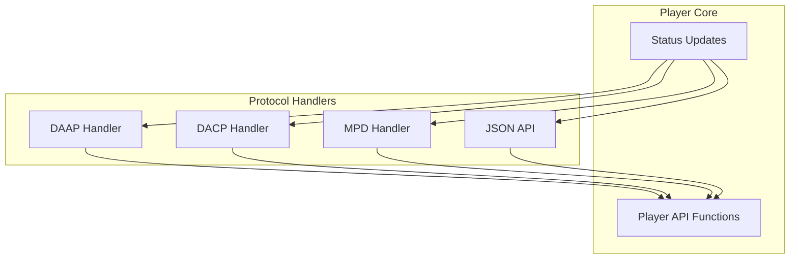

# Player Core

> **Relevant source files**
> * [src/db.c](https://github.com/owntone/owntone-server/blob/23c67a3e/src/db.c)
> * [src/db.h](https://github.com/owntone/owntone-server/blob/23c67a3e/src/db.h)
> * [src/httpd_dacp.c](https://github.com/owntone/owntone-server/blob/23c67a3e/src/httpd_dacp.c)
> * [src/mpd.c](https://github.com/owntone/owntone-server/blob/23c67a3e/src/mpd.c)
> * [src/player.c](https://github.com/owntone/owntone-server/blob/23c67a3e/src/player.c)
> * [src/player.h](https://github.com/owntone/owntone-server/blob/23c67a3e/src/player.h)

The Player Core is the central component responsible for managing audio playback in OwnTone. It handles all aspects of the playback process including maintaining the playback queue, controlling audio sources, managing the playback buffer, and coordinating with output devices. This document provides a detailed overview of the Player Core's architecture, how it processes audio, and its interactions with other components of the system.

For information about audio input handling, see [Input Sources](/owntone/owntone-server/3.3-input-sources). For details on how audio is sent to speakers and other output devices, see [Audio Output System](/owntone/owntone-server/3.2-audio-output-system).

## Architecture Overview

The Player Core sits at the heart of OwnTone's audio handling system, acting as a bridge between audio inputs and outputs while maintaining playback state.

Sources: [src/player.c L21-L35](https://github.com/owntone/owntone-server/blob/23c67a3e/src/player.c#L21-L35)

 [src/player.h L2-L216](https://github.com/owntone/owntone-server/blob/23c67a3e/src/player.h#L2-L216)

## Core Components

### Player Session

The Player Core maintains a playback session which represents the current state of audio playback. A session includes:

* The audio buffer
* Timing information
* The current playback position
* A list of player sources (current and upcoming tracks)
* Audio quality information

Sources: [src/player.c L194-L295](https://github.com/owntone/owntone-server/blob/23c67a3e/src/player.c#L194-L295)

### Playback Timer

The Player Core uses a timer to control the playback process. The timer ticks at regular intervals (10ms by default) and on each tick, the player reads a frame from the input buffer and passes it to the outputs.

Sources: [src/player.c L97-L116](https://github.com/owntone/owntone-server/blob/23c67a3e/src/player.c#L97-L116)

 [src/player.c L325-L338](https://github.com/owntone/owntone-server/blob/23c67a3e/src/player.c#L325-L338)

## Playback Process

### Playback States

The Player Core manages three main playback states:

| State | Description |
| --- | --- |
| `PLAY_STOPPED` | Playback is stopped, no audio is being processed |
| `PLAY_PAUSED` | Playback is paused, position is maintained but no audio is being processed |
| `PLAY_PLAYING` | Audio is actively being played |

Sources: [src/player.h L14-L18](https://github.com/owntone/owntone-server/blob/23c67a3e/src/player.h#L14-L18)

### Playback Flow

The Player Core handles the flow of audio data from source to output:

Sources: [src/player.c L686-L721](https://github.com/owntone/owntone-server/blob/23c67a3e/src/player.c#L686-L721)

 [src/player.c L855-L888](https://github.com/owntone/owntone-server/blob/23c67a3e/src/player.c#L855-L888)

 [src/player.c L925-L935](https://github.com/owntone/owntone-server/blob/23c67a3e/src/player.c#L925-L935)

### Timing and Buffer Management

The Player Core carefully manages timing to ensure smooth playback:

* It uses a tick interval of 10ms (`PLAYER_TICK_INTERVAL`)
* On each tick, it reads a frame from the input and writes it to the outputs
* If the input buffer is empty, it tries to catch up on the next tick
* If it falls too far behind (`PLAYER_READ_BEHIND_MAX`), it suspends playback
* If an output blocks for too long (`PLAYER_WRITE_BEHIND_MAX`), it resets the output

Sources: [src/player.c L97-L116](https://github.com/owntone/owntone-server/blob/23c67a3e/src/player.c#L97-L116)

## Queue Management

The Player Core maintains a queue of tracks to be played. It supports various queue operations:

* Playing the next or previous track
* Shuffling the queue
* Repeat modes (off, single track, all)
* Consume mode (remove tracks after playing)

Sources: [src/player.c L409-L494](https://github.com/owntone/owntone-server/blob/23c67a3e/src/player.c#L409-L494)

## Event System

The Player Core uses an event system to notify other components about changes in playback status:

Sources: [src/player.c L36-L44](https://github.com/owntone/owntone-server/blob/23c67a3e/src/player.c#L36-L44)

 [src/player.c L395-L404](https://github.com/owntone/owntone-server/blob/23c67a3e/src/player.c#L395-L404)

## API Functions

The Player Core provides several categories of API functions:

### Playback Control Functions

| Function | Description |
| --- | --- |
| `player_playback_start()` | Start playback from current position |
| `player_playback_start_byid()` | Start playback of a specific item |
| `player_playback_stop()` | Stop playback |
| `player_playback_pause()` | Pause playback |
| `player_playback_seek()` | Seek to a specific position |
| `player_playback_next()` | Skip to next track |
| `player_playback_prev()` | Go to previous track |

### Speaker Management Functions

| Function | Description |
| --- | --- |
| `player_speaker_enumerate()` | List available speakers |
| `player_speaker_set()` | Select speakers for playback |
| `player_speaker_enable()` | Enable a specific speaker |
| `player_speaker_disable()` | Disable a specific speaker |
| `player_volume_set()` | Set overall volume |
| `player_volume_setabs_speaker()` | Set absolute volume for a speaker |
| `player_volume_setrel_speaker()` | Set relative volume for a speaker |

### Playback Mode Functions

| Function | Description |
| --- | --- |
| `player_repeat_set()` | Set repeat mode (off/song/all) |
| `player_shuffle_set()` | Enable/disable shuffle |
| `player_consume_set()` | Enable/disable consume mode |

Sources: [src/player.h L89-L213](https://github.com/owntone/owntone-server/blob/23c67a3e/src/player.h#L89-L213)

## Threading Model

The Player Core operates in its own thread to avoid blocking the main thread. This is important because:

1. The player needs to process audio data at regular intervals
2. Blocking operations in the player thread could starve outputs
3. Status requests from clients should not be blocked

The player thread avoids making blocking operations whenever possible to ensure responsiveness and smooth playback.

Sources: [src/player.c L30-L35](https://github.com/owntone/owntone-server/blob/23c67a3e/src/player.c#L30-L35)

 [src/player.c L297-L304](https://github.com/owntone/owntone-server/blob/23c67a3e/src/player.c#L297-L304)

## Integration with Other Components

### Database Integration

The Player Core interacts with the database to:

* Fetch queue items
* Update play counts and skip counts
* Save seek positions for podcasts and audiobooks
* Store and retrieve playback state

These operations are typically performed asynchronously via worker threads to avoid blocking the player thread.

Sources: [src/player.c L364-L380](https://github.com/owntone/owntone-server/blob/23c67a3e/src/player.c#L364-L380)

 [src/player.c L436-L442](https://github.com/owntone/owntone-server/blob/23c67a3e/src/player.c#L436-L442)

### Protocol Handler Integration

The Player Core is controlled by various protocol handlers (DAAP, DACP, MPD, JSON API) which translate protocol-specific commands into player operations. These handlers also receive events from the player to update clients about status changes.

Sources: [src/mpd.c L1022-L1074](https://github.com/owntone/owntone-server/blob/23c67a3e/src/mpd.c#L1022-L1074)

 [src/httpd_dacp.c L754-L804](https://github.com/owntone/owntone-server/blob/23c67a3e/src/httpd_dacp.c#L754-L804)

## Initialization and Shutdown

When the Player Core initializes, it:

1. Creates the player thread
2. Sets up the playback timer
3. Initializes the event base
4. Registers with the listener system

When shutting down, it:

1. Stops any active playback
2. Frees buffers and resources
3. Terminates the player thread

Sources: [src/player.c L297-L304](https://github.com/owntone/owntone-server/blob/23c67a3e/src/player.c#L297-L304)

 [src/player.h L209-L213](https://github.com/owntone/owntone-server/blob/23c67a3e/src/player.h#L209-L213)

## Summary

The Player Core is the heart of OwnTone's playback system, managing audio flow from sources to outputs while maintaining playback state and responding to commands. It uses a carefully designed timing system to ensure smooth playback and provides a comprehensive API for controlling all aspects of the playback experience.