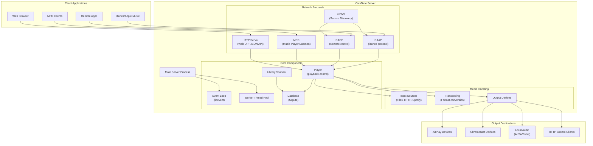
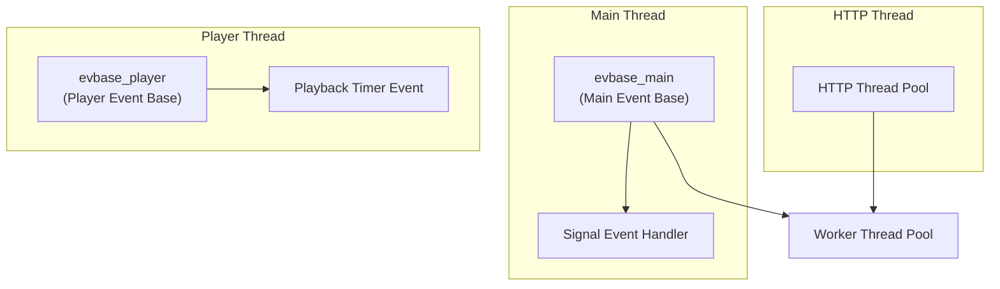
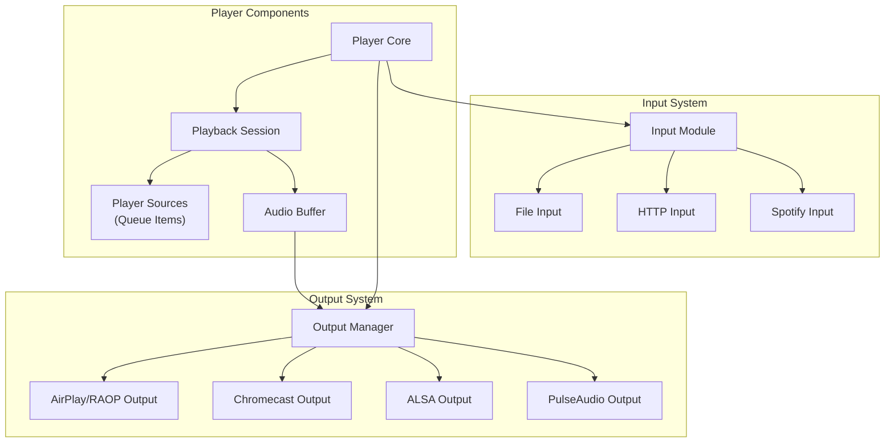
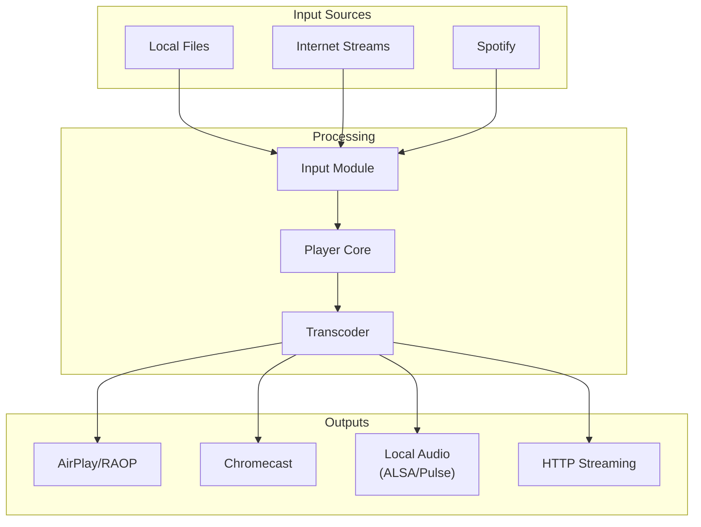
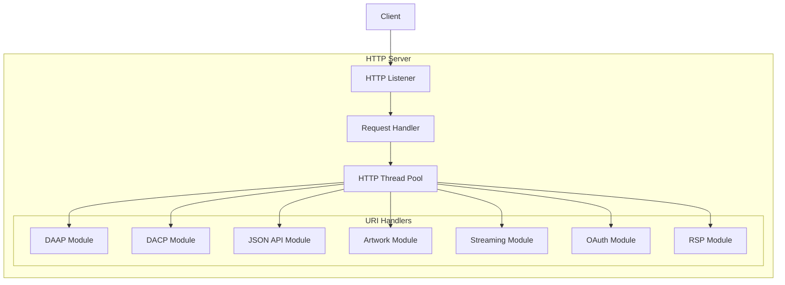
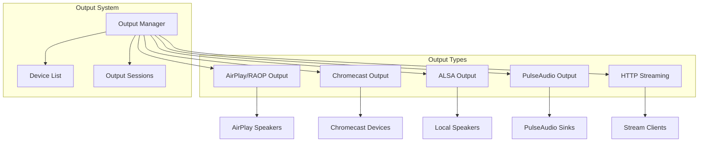
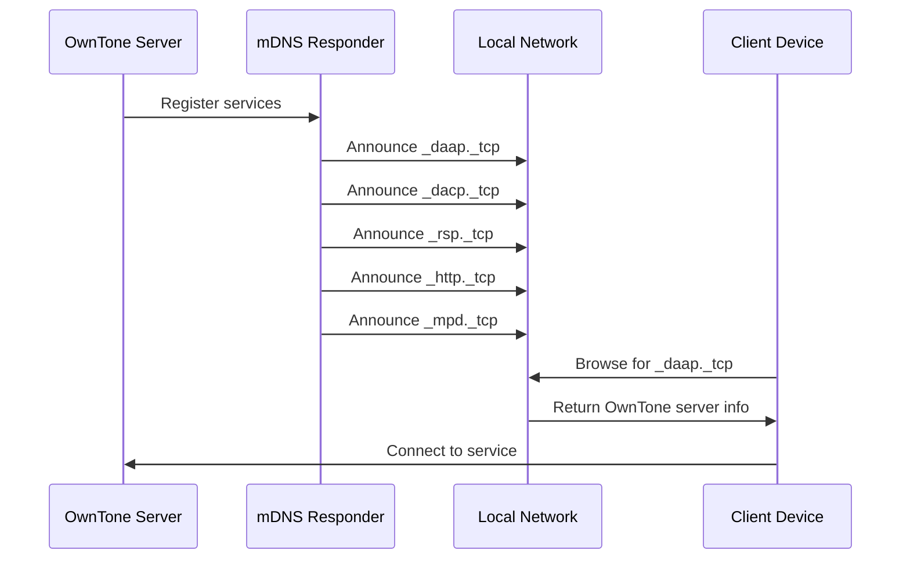
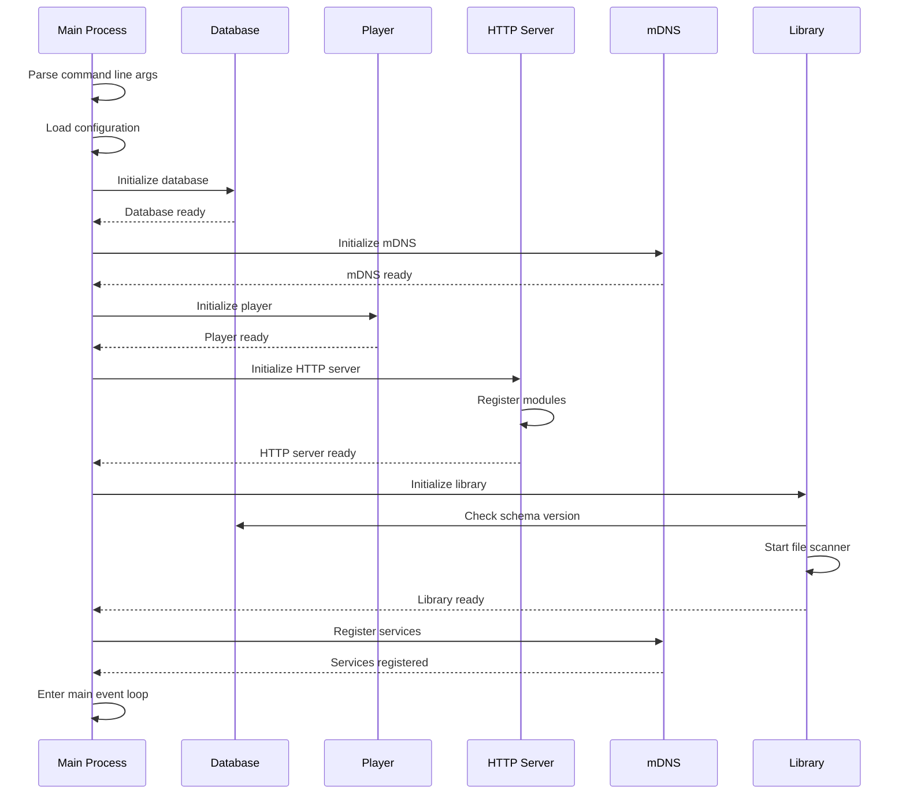
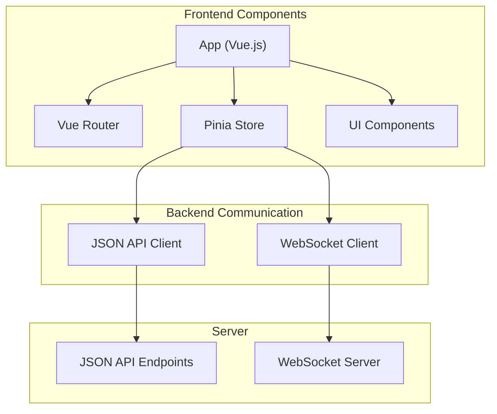

# System Architecture

> **Relevant source files**
> * [configure.ac](https://github.com/owntone/owntone-server/blob/23c67a3e/configure.ac)
> * [htdocs/assets/index.css](https://github.com/owntone/owntone-server/blob/23c67a3e/htdocs/assets/index.css)
> * [htdocs/assets/index.js](https://github.com/owntone/owntone-server/blob/23c67a3e/htdocs/assets/index.js)
> * [htdocs/index.html](https://github.com/owntone/owntone-server/blob/23c67a3e/htdocs/index.html)
> * [src/Makefile.am](https://github.com/owntone/owntone-server/blob/23c67a3e/src/Makefile.am)
> * [src/db.c](https://github.com/owntone/owntone-server/blob/23c67a3e/src/db.c)
> * [src/db.h](https://github.com/owntone/owntone-server/blob/23c67a3e/src/db.h)
> * [src/httpd.c](https://github.com/owntone/owntone-server/blob/23c67a3e/src/httpd.c)
> * [src/httpd.h](https://github.com/owntone/owntone-server/blob/23c67a3e/src/httpd.h)
> * [src/httpd_artworkapi.c](https://github.com/owntone/owntone-server/blob/23c67a3e/src/httpd_artworkapi.c)
> * [src/httpd_daap.c](https://github.com/owntone/owntone-server/blob/23c67a3e/src/httpd_daap.c)
> * [src/httpd_daap.h](https://github.com/owntone/owntone-server/blob/23c67a3e/src/httpd_daap.h)
> * [src/httpd_dacp.c](https://github.com/owntone/owntone-server/blob/23c67a3e/src/httpd_dacp.c)
> * [src/httpd_internal.h](https://github.com/owntone/owntone-server/blob/23c67a3e/src/httpd_internal.h)
> * [src/httpd_oauth.c](https://github.com/owntone/owntone-server/blob/23c67a3e/src/httpd_oauth.c)
> * [src/httpd_rsp.c](https://github.com/owntone/owntone-server/blob/23c67a3e/src/httpd_rsp.c)
> * [src/main.c](https://github.com/owntone/owntone-server/blob/23c67a3e/src/main.c)
> * [src/mpd.c](https://github.com/owntone/owntone-server/blob/23c67a3e/src/mpd.c)
> * [src/outputs.c](https://github.com/owntone/owntone-server/blob/23c67a3e/src/outputs.c)
> * [src/outputs.h](https://github.com/owntone/owntone-server/blob/23c67a3e/src/outputs.h)
> * [src/outputs/airplay.c](https://github.com/owntone/owntone-server/blob/23c67a3e/src/outputs/airplay.c)
> * [src/outputs/alsa.c](https://github.com/owntone/owntone-server/blob/23c67a3e/src/outputs/alsa.c)
> * [src/outputs/cast.c](https://github.com/owntone/owntone-server/blob/23c67a3e/src/outputs/cast.c)
> * [src/outputs/dummy.c](https://github.com/owntone/owntone-server/blob/23c67a3e/src/outputs/dummy.c)
> * [src/outputs/fifo.c](https://github.com/owntone/owntone-server/blob/23c67a3e/src/outputs/fifo.c)
> * [src/outputs/pulse.c](https://github.com/owntone/owntone-server/blob/23c67a3e/src/outputs/pulse.c)
> * [src/outputs/raop.c](https://github.com/owntone/owntone-server/blob/23c67a3e/src/outputs/raop.c)
> * [src/player.c](https://github.com/owntone/owntone-server/blob/23c67a3e/src/player.c)
> * [src/player.h](https://github.com/owntone/owntone-server/blob/23c67a3e/src/player.h)
> * [web-src/package-lock.json](https://github.com/owntone/owntone-server/blob/23c67a3e/web-src/package-lock.json)
> * [web-src/package.json](https://github.com/owntone/owntone-server/blob/23c67a3e/web-src/package.json)
> * [web-src/src/main.js](https://github.com/owntone/owntone-server/blob/23c67a3e/web-src/src/main.js)
> * [web-src/src/mystyles.scss](https://github.com/owntone/owntone-server/blob/23c67a3e/web-src/src/mystyles.scss)
> * [web-src/src/templates/ContentWithHero.vue](https://github.com/owntone/owntone-server/blob/23c67a3e/web-src/src/templates/ContentWithHero.vue)

This document provides a comprehensive overview of the OwnTone server architecture, explaining how the major components interact to form a complete media server system. It covers the core architecture, components, and data flows that make up the system.

For information about installation and configuration, see [Installation and Configuration](/owntone/owntone-server/1.2-installation-and-configuration).

## Overview

OwnTone is a media server designed to stream audio from various sources to multiple output devices. It implements several network protocols like DAAP (Digital Audio Access Protocol) for iTunes compatibility, DACP (Digital Audio Control Protocol) for remote control, and MPD (Music Player Daemon) protocol, while also providing a modern web interface and JSON API.

The server follows an event-driven architecture built around the libevent library, with a multi-threaded design that ensures responsive operation even under heavy load.



Sources: [src/main.c L482-L741](https://github.com/owntone/owntone-server/blob/23c67a3e/src/main.c#L482-L741)

 [src/player.c L17-L45](https://github.com/owntone/owntone-server/blob/23c67a3e/src/player.c#L17-L45)

 [src/httpd.c L18-L76](https://github.com/owntone/owntone-server/blob/23c67a3e/src/httpd.c#L18-L76)

## Core Components

### Event-Driven Architecture

OwnTone uses libevent as its core event handling system, which allows it to efficiently handle multiple concurrent operations without blocking. The main event loop processes events for timer callbacks, network I/O, and inter-thread communication.



Sources: [src/main.c L81](https://github.com/owntone/owntone-server/blob/23c67a3e/src/main.c#L81-L81)

 [src/main.c L299-L301](https://github.com/owntone/owntone-server/blob/23c67a3e/src/main.c#L299-L301)

 [src/player.c L299-L300](https://github.com/owntone/owntone-server/blob/23c67a3e/src/player.c#L299-L300)

### Threading Model

OwnTone uses several threads to handle different aspects of the system:

1. **Main Thread**: Handles the main event loop and coordinates system operations
2. **Player Thread**: Manages audio playback and streaming
3. **HTTP Thread**: Handles incoming HTTP requests
4. **Worker Threads**: Execute potentially blocking operations (like database queries)

The worker thread pool is used extensively to ensure that the main thread and player thread remain responsive, even when performing operations that might block. For example, database operations are typically dispatched to worker threads.

Sources: [src/player.c L302-L304](https://github.com/owntone/owntone-server/blob/23c67a3e/src/player.c#L302-L304)

 [src/httpd.c L146-L147](https://github.com/owntone/owntone-server/blob/23c67a3e/src/httpd.c#L146-L147)

### Command System

The command system allows different components to schedule and execute operations, potentially in different threads. This is used for both the player and HTTP modules to ensure that slow operations don't block the event loop.

```mermaid
sequenceDiagram
  participant Client (e.g., Remote App)
  participant HTTP Server
  participant Worker Thread
  participant Player
  participant Output System

  Client (e.g., Remote App)->>HTTP Server: Send play command
  HTTP Server->>Worker Thread: Schedule play operation
  Worker Thread->>Player: Execute player_playback_start()
  Player->>Player: Update state
  Player->>Output System: Start audio output
  Player-->>HTTP Server: Command completed
  HTTP Server-->>Client (e.g., Remote App): Success response
```

Sources: [src/player.c L107-L116](https://github.com/owntone/owntone-server/blob/23c67a3e/src/player.c#L107-L116)

 [src/commands.c](https://github.com/owntone/owntone-server/blob/23c67a3e/src/commands.c)

## Database System

OwnTone uses SQLite as its core database engine for storing and retrieving metadata about media files, playlists, and the playback queue.

### Database Schema

The database includes tables for:

* Media files (tracks, albums, artists)
* Playlists and playlist items
* Playback queue
* Pairing information (for remote control)
* Speaker (output device) settings

```css
#mermaid-o8hds8z47xb{font-family:ui-sans-serif,-apple-system,system-ui,Segoe UI,Helvetica;font-size:16px;fill:#ccc;}@keyframes edge-animation-frame{from{stroke-dashoffset:0;}}@keyframes dash{to{stroke-dashoffset:0;}}#mermaid-o8hds8z47xb .edge-animation-slow{stroke-dasharray:9,5!important;stroke-dashoffset:900;animation:dash 50s linear infinite;stroke-linecap:round;}#mermaid-o8hds8z47xb .edge-animation-fast{stroke-dasharray:9,5!important;stroke-dashoffset:900;animation:dash 20s linear infinite;stroke-linecap:round;}#mermaid-o8hds8z47xb .error-icon{fill:#333;}#mermaid-o8hds8z47xb .error-text{fill:#cccccc;stroke:#cccccc;}#mermaid-o8hds8z47xb .edge-thickness-normal{stroke-width:1px;}#mermaid-o8hds8z47xb .edge-thickness-thick{stroke-width:3.5px;}#mermaid-o8hds8z47xb .edge-pattern-solid{stroke-dasharray:0;}#mermaid-o8hds8z47xb .edge-thickness-invisible{stroke-width:0;fill:none;}#mermaid-o8hds8z47xb .edge-pattern-dashed{stroke-dasharray:3;}#mermaid-o8hds8z47xb .edge-pattern-dotted{stroke-dasharray:2;}#mermaid-o8hds8z47xb .marker{fill:#666;stroke:#666;}#mermaid-o8hds8z47xb .marker.cross{stroke:#666;}#mermaid-o8hds8z47xb svg{font-family:ui-sans-serif,-apple-system,system-ui,Segoe UI,Helvetica;font-size:16px;}#mermaid-o8hds8z47xb p{margin:0;}#mermaid-o8hds8z47xb .entityBox{fill:#111;stroke:#222;}#mermaid-o8hds8z47xb .relationshipLabelBox{fill:#333;opacity:0.7;background-color:#333;}#mermaid-o8hds8z47xb .relationshipLabelBox rect{opacity:0.5;}#mermaid-o8hds8z47xb .labelBkg{background-color:rgba(51, 51, 51, 0.5);}#mermaid-o8hds8z47xb .edgeLabel .label{fill:#222;font-size:14px;}#mermaid-o8hds8z47xb .label{font-family:ui-sans-serif,-apple-system,system-ui,Segoe UI,Helvetica;color:#fff;}#mermaid-o8hds8z47xb .edge-pattern-dashed{stroke-dasharray:8,8;}#mermaid-o8hds8z47xb .node rect,#mermaid-o8hds8z47xb .node circle,#mermaid-o8hds8z47xb .node ellipse,#mermaid-o8hds8z47xb .node polygon{fill:#111;stroke:#222;stroke-width:1px;}#mermaid-o8hds8z47xb .relationshipLine{stroke:#666;stroke-width:1;fill:none;}#mermaid-o8hds8z47xb .marker{fill:none!important;stroke:#666!important;stroke-width:1;}#mermaid-o8hds8z47xb :root{--mermaid-font-family:"trebuchet ms",verdana,arial,sans-serif;}referenced bycontainsreferenced byfilesintidPKstringpathstringtitlestringartiststringalbumstringgenreintdata_kindintmedia_kindplaylistsintidPKstringtitleinttypestringqueryqueueintidPKintfile_idFKintposintshuffle_posplaylistitemsintidPKintplaylistidFKstringfilepathspeakersintidPKstringnamestringtypeintvolume
```

The database system uses various prepared statements for efficient querying and updates, and provides a query builder interface for constructing complex queries based on parameters.

Sources: [src/db.c L168-L235](https://github.com/owntone/owntone-server/blob/23c67a3e/src/db.c#L168-L235)

 [src/db.h L167-L253](https://github.com/owntone/owntone-server/blob/23c67a3e/src/db.h#L167-L253)

## Media Playback System

### Player Subsystem

The player subsystem is responsible for managing the playback queue, controlling playback, and routing audio data to outputs. It operates on a timer-based model, reading frames of audio data at fixed intervals and sending them to output devices.



The player operates with a concept of "ticks" that occur at regular intervals (typically 10ms). During each tick, it:

1. Reads audio data from the input source
2. Updates the playback position
3. Sends audio data to outputs

Sources: [src/player.c L96-L116](https://github.com/owntone/owntone-server/blob/23c67a3e/src/player.c#L96-L116)

 [src/player.c L194-L245](https://github.com/owntone/owntone-server/blob/23c67a3e/src/player.c#L194-L245)

### Audio Data Flow



Sources: [src/player.c L89-L102](https://github.com/owntone/owntone-server/blob/23c67a3e/src/player.c#L89-L102)

 [src/outputs.c](https://github.com/owntone/owntone-server/blob/23c67a3e/src/outputs.c)

## Network Protocols

OwnTone implements several network protocols to provide compatibility with different client applications:

### DAAP (Digital Audio Access Protocol)

The DAAP protocol allows iTunes and compatible clients to browse and play music from OwnTone. It includes:

* Session management
* Library browsing (artists, albums, genres)
* Playlist management
* Media streaming

Sources: [src/httpd_daap.c L18-L22](https://github.com/owntone/owntone-server/blob/23c67a3e/src/httpd_daap.c#L18-L22)

### DACP (Digital Audio Control Protocol)

The DACP protocol enables remote control of OwnTone's playback, used by apps like Apple Remote:

* Playback control (play, pause, next, previous)
* Volume control
* Queue management
* Now playing information

Sources: [src/httpd_dacp.c L18-L22](https://github.com/owntone/owntone-server/blob/23c67a3e/src/httpd_dacp.c#L18-L22)

### MPD (Music Player Daemon) Protocol

The MPD protocol provides compatibility with MPD clients:

* Command-based text protocol
* Library browsing
* Playlist management
* Playback control

Sources: [src/mpd.c L19-L24](https://github.com/owntone/owntone-server/blob/23c67a3e/src/mpd.c#L19-L24)

 [src/mpd.c L97-L131](https://github.com/owntone/owntone-server/blob/23c67a3e/src/mpd.c#L97-L131)

### JSON API

The JSON API provides a modern interface for web applications:

* RESTful API design
* Library browsing
* Playback control
* Playlist management

Sources: [src/httpd_jsonapi.c](https://github.com/owntone/owntone-server/blob/23c67a3e/src/httpd_jsonapi.c)

## HTTP Server Architecture

The HTTP server is built on libevent's HTTP module and uses a modular design to handle different protocols:



The HTTP server uses a relatively small thread pool (by default, just 1 thread) because most operations should be non-blocking. For long-running operations, the handler should set up events rather than blocking the thread.

Sources: [src/httpd.c L69-L87](https://github.com/owntone/owntone-server/blob/23c67a3e/src/httpd.c#L69-L87)

 [src/httpd.c L144-L147](https://github.com/owntone/owntone-server/blob/23c67a3e/src/httpd.c#L144-L147)

## Output System

The output system is responsible for sending audio data to various output devices:

### Output Types

* **AirPlay/RAOP**: Streams to Apple AirPlay devices
* **Chromecast**: Streams to Google Chromecast devices
* **ALSA**: Local audio output on Linux systems
* **PulseAudio**: Local audio output using PulseAudio
* **HTTP Streaming**: Provides audio streams over HTTP

Each output type is implemented as a module with a consistent interface for device discovery, initialization, and audio data handling.



Sources: [src/outputs.h L11-L156](https://github.com/owntone/owntone-server/blob/23c67a3e/src/outputs.h#L11-L156)

 [src/outputs.c](https://github.com/owntone/owntone-server/blob/23c67a3e/src/outputs.c)

## Service Discovery

OwnTone uses mDNS (multicast DNS) for service discovery, allowing clients to find the server on the local network:

* Announces DAAP service for iTunes compatibility
* Announces DACP service for remote control
* Announces RSP service for Roku devices
* Announces HTTP service for web interface
* Optionally announces MPD service



Sources: [src/main.c L227-L360](https://github.com/owntone/owntone-server/blob/23c67a3e/src/main.c#L227-L360)

 [src/mdns.h](https://github.com/owntone/owntone-server/blob/23c67a3e/src/mdns.h)

## Initialization Sequence

The following diagram shows the initialization sequence of OwnTone:



Sources: [src/main.c L482-L885](https://github.com/owntone/owntone-server/blob/23c67a3e/src/main.c#L482-L885)

## Web Frontend Architecture

The web frontend is built with Vue.js and communicates with the server through the JSON API:



Sources: [web-src/package.json L13-L32](https://github.com/owntone/owntone-server/blob/23c67a3e/web-src/package.json#L13-L32)

 [htdocs/assets/index.js](https://github.com/owntone/owntone-server/blob/23c67a3e/htdocs/assets/index.js)

## Summary

OwnTone's architecture is designed for flexibility and extensibility, allowing it to support multiple input sources, output types, and client protocols. The event-driven design with a multi-threaded approach enables efficient handling of media streaming and playback control operations, while the modular structure makes it easy to add new features and capabilities.

The core components - database, player, outputs, and HTTP server - work together to provide a complete media server solution that can integrate with various audio ecosystems.