# Utility Systems

> **Relevant source files**
> * [owntone.conf.in](https://github.com/owntone/owntone-server/blob/23c67a3e/owntone.conf.in)
> * [src/conffile.c](https://github.com/owntone/owntone-server/blob/23c67a3e/src/conffile.c)
> * [src/httpd_streaming.c](https://github.com/owntone/owntone-server/blob/23c67a3e/src/httpd_streaming.c)
> * [src/library/filescanner_ffmpeg.c](https://github.com/owntone/owntone-server/blob/23c67a3e/src/library/filescanner_ffmpeg.c)
> * [src/logger.c](https://github.com/owntone/owntone-server/blob/23c67a3e/src/logger.c)
> * [src/logger.h](https://github.com/owntone/owntone-server/blob/23c67a3e/src/logger.h)
> * [src/misc.c](https://github.com/owntone/owntone-server/blob/23c67a3e/src/misc.c)
> * [src/misc.h](https://github.com/owntone/owntone-server/blob/23c67a3e/src/misc.h)
> * [src/outputs/streaming.c](https://github.com/owntone/owntone-server/blob/23c67a3e/src/outputs/streaming.c)

The Utility Systems in OwnTone provide essential infrastructure and services used throughout the application. These systems handle fundamental tasks such as logging, configuration management, and common operations like network communication, string manipulation, and data structure management. While not directly involved with media functionality, these utilities form the foundation that enables all other components to function reliably and efficiently.

For information about media library management, see [Library Management](/owntone/owntone-server/4-library-management), and for playback systems, see [Media Playback System](/owntone/owntone-server/3-media-playback-system).

## Overview of Utility Systems

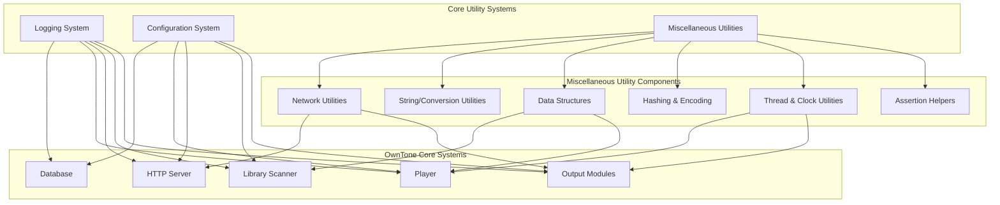

Sources: [src/logger.c](https://github.com/owntone/owntone-server/blob/23c67a3e/src/logger.c)

 [src/misc.c](https://github.com/owntone/owntone-server/blob/23c67a3e/src/misc.c)

 [src/conffile.c](https://github.com/owntone/owntone-server/blob/23c67a3e/src/conffile.c)

## Logging System

The logging system provides a centralized way to record events and debug information across the application. It features configurable severity levels, multiple log domains (subsystems), and supports both console and file output with thread safety.

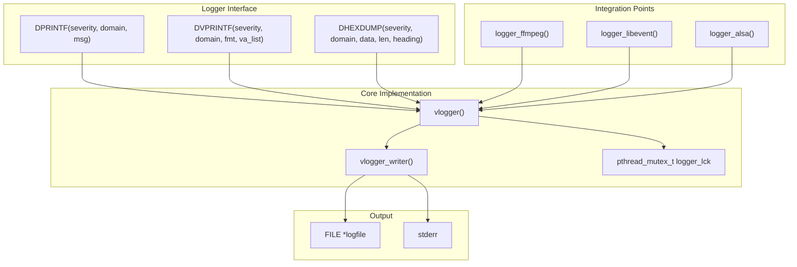

Sources: [src/logger.c L254-L385](https://github.com/owntone/owntone-server/blob/23c67a3e/src/logger.c#L254-L385)

 [src/logger.h L45-L91](https://github.com/owntone/owntone-server/blob/23c67a3e/src/logger.h#L45-L91)

### Log Domains

OwnTone organizes logging by domains, allowing filtering of messages by subsystem. Each domain is identified by a constant defined in [src/logger.h L8-L41](https://github.com/owntone/owntone-server/blob/23c67a3e/src/logger.h#L8-L41)

| Domain Constant | Value | Component |
| --- | --- | --- |
| L_CONF | 0 | Configuration system |
| L_DB | 2 | Database operations |
| L_MAIN | 5 | Main application control |
| L_MISC | 7 | Miscellaneous utilities |
| L_PLAYER | 16 | Player subsystem |
| L_STREAMING | 25 | HTTP streaming |
| L_WEB | 29 | Web interface |

Sources: [src/logger.h L8-L41](https://github.com/owntone/owntone-server/blob/23c67a3e/src/logger.h#L8-L41)

 [src/logger.c L61](https://github.com/owntone/owntone-server/blob/23c67a3e/src/logger.c#L61-L61)

### Severity Levels

Log messages are categorized by severity to control verbosity.

| Level | Constant | Description |
| --- | --- | --- |
| 0 | E_FATAL | Fatal errors requiring termination |
| 1 | E_LOG | Significant errors |
| 2 | E_WARN | Warning messages |
| 3 | E_INFO | Informational messages |
| 4 | E_DBG | Debug messages |
| 5 | E_SPAM | Very detailed debug information |

Sources: [src/logger.h L44-L50](https://github.com/owntone/owntone-server/blob/23c67a3e/src/logger.h#L44-L50)

 [src/logger.c L62](https://github.com/owntone/owntone-server/blob/23c67a3e/src/logger.c#L62-L62)

### Configuration Options

The logging system is configured in the `general` section of the configuration file:

| Option | Description | Default |
| --- | --- | --- |
| logfile | Path to log file | @localstatedir@/log/@[PACKAGE@.log](mailto:PACKAGE@.log) |
| loglevel | Severity threshold | log |
| logformat | Format style (default or logfmt) | default |

Sources: [src/conffile.c L45-L52](https://github.com/owntone/owntone-server/blob/23c67a3e/src/conffile.c#L45-L52)

 [owntone.conf.in L24-L27](https://github.com/owntone/owntone-server/blob/23c67a3e/owntone.conf.in#L24-L27)

## Configuration System

OwnTone uses the libconfuse library to parse and manage configuration options. The configuration system defines the structure of the configuration file, handles default values, and provides an API for accessing settings.

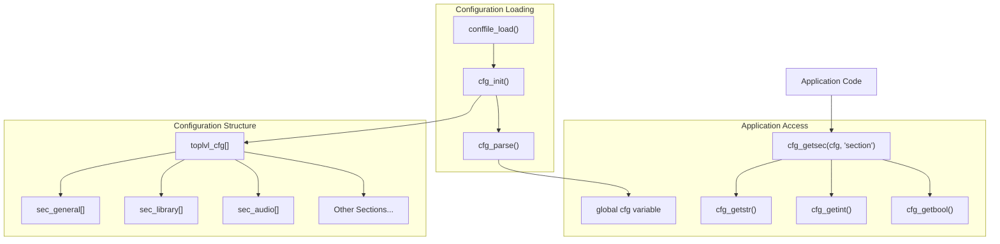

Sources: [src/conffile.c L41-L279](https://github.com/owntone/owntone-server/blob/23c67a3e/src/conffile.c#L41-L279)

 [src/conffile.c L463-L535](https://github.com/owntone/owntone-server/blob/23c67a3e/src/conffile.c#L463-L535)

### Configuration Sections

The configuration file is organized into sections, each with specific options:

| Section | Description |
| --- | --- |
| general | Global settings (logging, database, networking) |
| library | Media library settings (directories, scanners) |
| audio | Local audio output settings |
| airplay | AirPlay/RAOP device settings |
| spotify | Spotify integration settings |
| mpd | MPD protocol settings |
| streaming | HTTP streaming settings |

Sources: [src/conffile.c L263-L278](https://github.com/owntone/owntone-server/blob/23c67a3e/src/conffile.c#L263-L278)

 [owntone.conf.in](https://github.com/owntone/owntone-server/blob/23c67a3e/owntone.conf.in)

### Configuration Usage

Throughout the codebase, configuration values are accessed using the global `cfg` variable and libconfuse API:

```javascript
// Get a string value
const char *logfile = cfg_getstr(cfg_getsec(cfg, "general"), "logfile");

// Get an integer value
int port = cfg_getint(cfg_getsec(cfg, "library"), "port");

// Get a boolean value
bool ipv6 = cfg_getbool(cfg_getsec(cfg, "general"), "ipv6");
```

Sources: [src/conffile.c L463-L535](https://github.com/owntone/owntone-server/blob/23c67a3e/src/conffile.c#L463-L535)

## Network Utilities

OwnTone provides a set of network utilities in `misc.c` to simplify common network operations like connecting to servers, binding to ports, and working with network addresses.

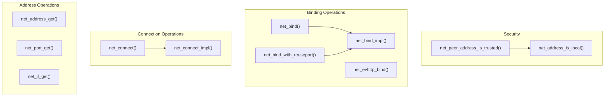

Sources: [src/misc.c L124-L576](https://github.com/owntone/owntone-server/blob/23c67a3e/src/misc.c#L124-L576)

 [src/misc.h L13-L58](https://github.com/owntone/owntone-server/blob/23c67a3e/src/misc.h#L13-L58)

### Network Security

The network utilities include functions for determining if a client is on a trusted network, which is used for authentication and authorization:

```
// Check if a client's address is in a trusted network
bool trusted = net_peer_address_is_trusted(client_addr);
```

This function checks the client address against the `trusted_networks` configuration setting, which can include values like "lan", "localhost", "any", or specific network prefixes.

Sources: [src/misc.c L224-L259](https://github.com/owntone/owntone-server/blob/23c67a3e/src/misc.c#L224-L259)

 [owntone.conf.in L41-L46](https://github.com/owntone/owntone-server/blob/23c67a3e/owntone.conf.in#L41-L46)

## String and Conversion Utilities

OwnTone includes numerous utilities for safely handling strings and converting between different types.

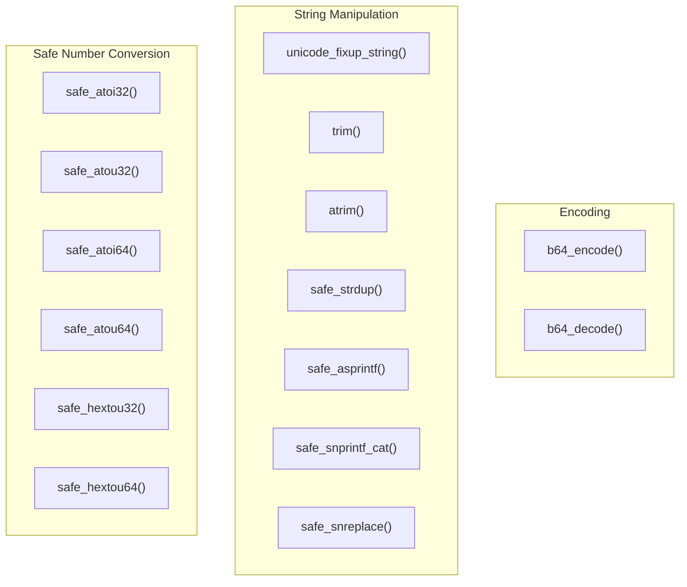

Sources: [src/misc.c L581-L957](https://github.com/owntone/owntone-server/blob/23c67a3e/src/misc.c#L581-L957)

 [src/misc.h L60-L148](https://github.com/owntone/owntone-server/blob/23c67a3e/src/misc.h#L60-L148)

### Safe Conversion Functions

These functions provide safer alternatives to standard C library functions for converting strings to numbers, with proper error handling:

```
int32_t value;
if (safe_atoi32(str, &value) == 0) {
    // Conversion successful
} else {
    // Conversion failed
}
```

Sources: [src/misc.c L581-L814](https://github.com/owntone/owntone-server/blob/23c67a3e/src/misc.c#L581-L814)

### String Manipulation

The string utilities include functions for common operations like trimming whitespace, replacing substrings, and safely duplicating strings:

```python
// Remove whitespace from beginning and end of string
char *trimmed = trim(str);

// Replace all occurrences of a pattern in a string
safe_snreplace(buffer, buffer_size, "old_text", "new_text");

// Safe string duplication with NULL check
char *copy = safe_strdup(original);
```

Sources: [src/misc.c L816-L977](https://github.com/owntone/owntone-server/blob/23c67a3e/src/misc.c#L816-L977)

## Data Structures

OwnTone implements several utility data structures to simplify common operations.

### Key-Value Store

The key-value store provides a simple way to manage name-value pairs:

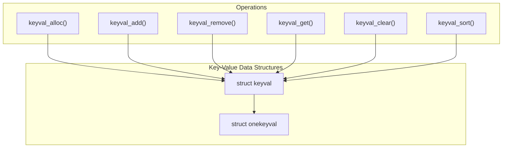

Sources: [src/misc.c L1242-L1439](https://github.com/owntone/owntone-server/blob/23c67a3e/src/misc.c#L1242-L1439)

 [src/misc.h L153-L187](https://github.com/owntone/owntone-server/blob/23c67a3e/src/misc.h#L153-L187)

### Ring Buffer

The ring buffer implements a circular buffer for efficiently handling streaming data:

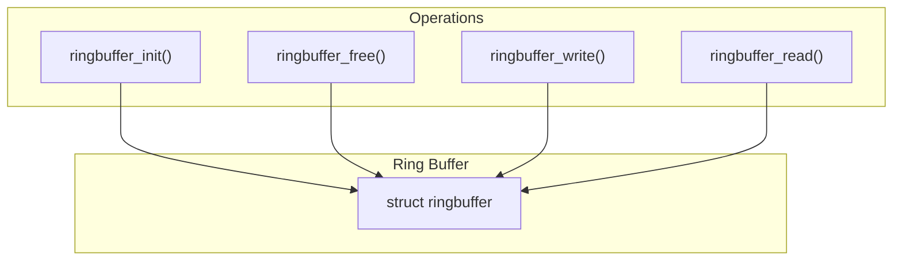

Sources: [src/misc.c L1444-L1483](https://github.com/owntone/owntone-server/blob/23c67a3e/src/misc.c#L1444-L1483)

 [src/misc.h L190-L211](https://github.com/owntone/owntone-server/blob/23c67a3e/src/misc.h#L190-L211)

## Hashing Functions

OwnTone provides several hashing functions for creating unique identifiers and optimizing lookups:

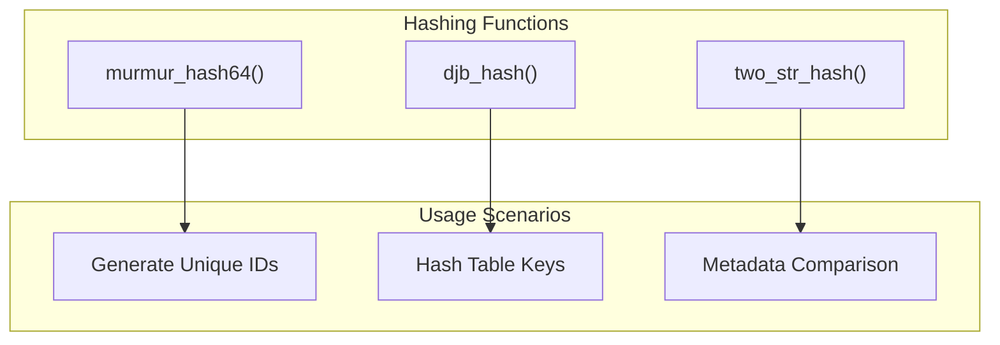

Sources: [src/misc.c L1016-L1237](https://github.com/owntone/owntone-server/blob/23c67a3e/src/misc.c#L1016-L1237)

 [src/misc.h L138-L150](https://github.com/owntone/owntone-server/blob/23c67a3e/src/misc.h#L138-L150)

### MurmurHash Implementation

OwnTone includes an implementation of MurmurHash2, a fast non-cryptographic hash function used for generating identifiers. It has two implementations based on platform architecture (32-bit or 64-bit).

Sources: [src/misc.c L1103-L1237](https://github.com/owntone/owntone-server/blob/23c67a3e/src/misc.c#L1103-L1237)

## Thread and Clock Utilities

Thread and clock utilities provide consistent interfaces for thread management and high-resolution timing:

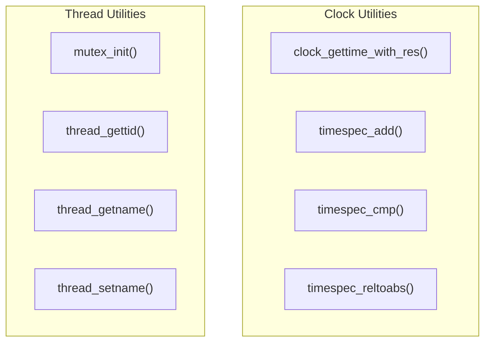

Sources: [src/misc.h L214-L270](https://github.com/owntone/owntone-server/blob/23c67a3e/src/misc.h#L214-L270)

## Assertion Macros

OwnTone provides several assertion macros for error checking and safe programming:

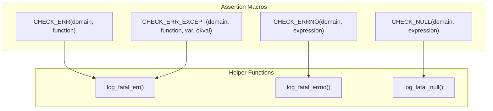

These macros provide a consistent way to check for errors throughout the codebase, with helpful error messages and automatic program termination for fatal errors.

Sources: [src/misc.h L345-L391](https://github.com/owntone/owntone-server/blob/23c67a3e/src/misc.h#L345-L391)

## Integration with Streaming System

The utility systems are essential for the HTTP streaming functionality. For example, in [src/httpd_streaming.c](https://github.com/owntone/owntone-server/blob/23c67a3e/src/httpd_streaming.c)

 the logging system is used to track streaming sessions, and configuration values are accessed to determine streaming parameters.

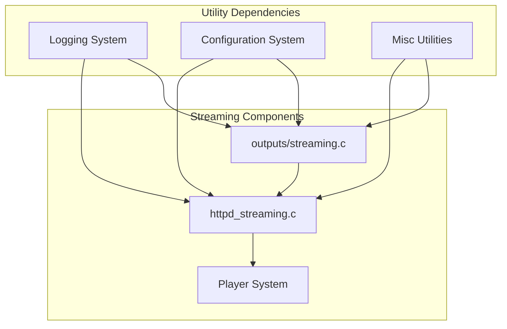

Sources: [src/httpd_streaming.c](https://github.com/owntone/owntone-server/blob/23c67a3e/src/httpd_streaming.c)

 [src/outputs/streaming.c](https://github.com/owntone/owntone-server/blob/23c67a3e/src/outputs/streaming.c)