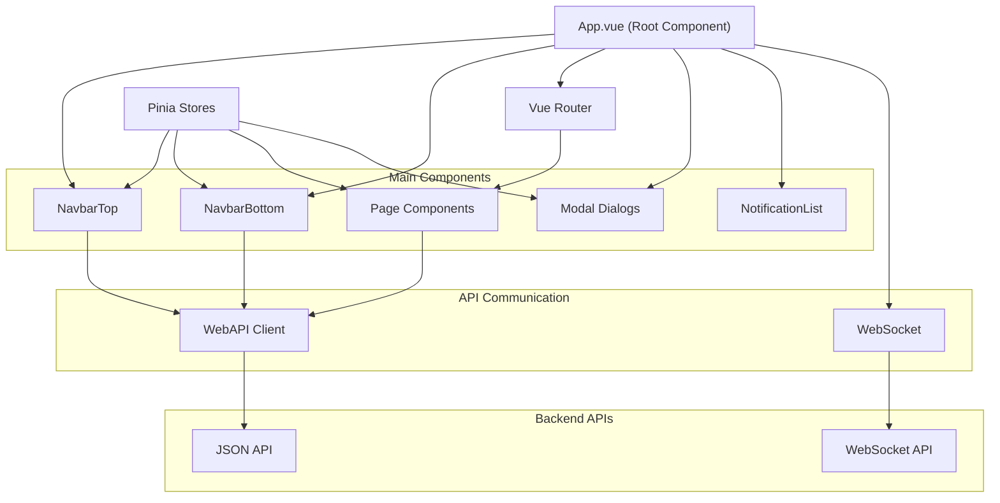
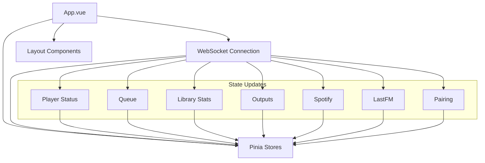
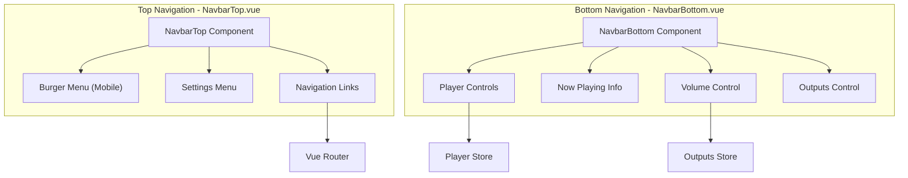
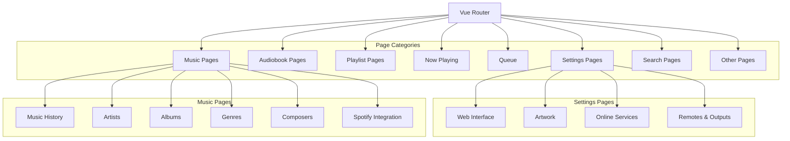
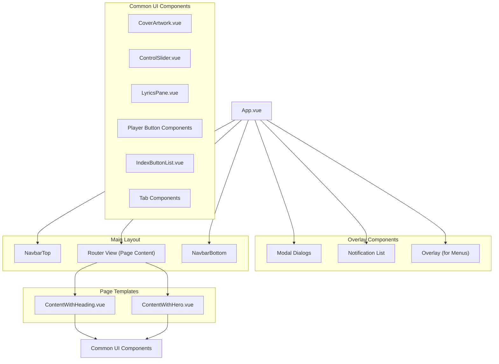

# Web Frontend

> **Relevant source files**
> * [htdocs/assets/index.css](https://github.com/owntone/owntone-server/blob/23c67a3e/htdocs/assets/index.css)
> * [htdocs/assets/index.js](https://github.com/owntone/owntone-server/blob/23c67a3e/htdocs/assets/index.js)
> * [htdocs/index.html](https://github.com/owntone/owntone-server/blob/23c67a3e/htdocs/index.html)
> * [web-src/eslint.config.js](https://github.com/owntone/owntone-server/blob/23c67a3e/web-src/eslint.config.js)
> * [web-src/package-lock.json](https://github.com/owntone/owntone-server/blob/23c67a3e/web-src/package-lock.json)
> * [web-src/package.json](https://github.com/owntone/owntone-server/blob/23c67a3e/web-src/package.json)
> * [web-src/src/App.vue](https://github.com/owntone/owntone-server/blob/23c67a3e/web-src/src/App.vue)
> * [web-src/src/components/CoverArtwork.vue](https://github.com/owntone/owntone-server/blob/23c67a3e/web-src/src/components/CoverArtwork.vue)
> * [web-src/src/components/IndexButtonList.vue](https://github.com/owntone/owntone-server/blob/23c67a3e/web-src/src/components/IndexButtonList.vue)
> * [web-src/src/components/LyricsPane.vue](https://github.com/owntone/owntone-server/blob/23c67a3e/web-src/src/components/LyricsPane.vue)
> * [web-src/src/components/NavbarBottom.vue](https://github.com/owntone/owntone-server/blob/23c67a3e/web-src/src/components/NavbarBottom.vue)
> * [web-src/src/components/NavbarItemLink.vue](https://github.com/owntone/owntone-server/blob/23c67a3e/web-src/src/components/NavbarItemLink.vue)
> * [web-src/src/components/NavbarTop.vue](https://github.com/owntone/owntone-server/blob/23c67a3e/web-src/src/components/NavbarTop.vue)
> * [web-src/src/components/PlayerButtonLyrics.vue](https://github.com/owntone/owntone-server/blob/23c67a3e/web-src/src/components/PlayerButtonLyrics.vue)
> * [web-src/src/components/TabsAudiobooks.vue](https://github.com/owntone/owntone-server/blob/23c67a3e/web-src/src/components/TabsAudiobooks.vue)
> * [web-src/src/components/TabsMusic.vue](https://github.com/owntone/owntone-server/blob/23c67a3e/web-src/src/components/TabsMusic.vue)
> * [web-src/src/components/TabsSearch.vue](https://github.com/owntone/owntone-server/blob/23c67a3e/web-src/src/components/TabsSearch.vue)
> * [web-src/src/lib/GroupedList.js](https://github.com/owntone/owntone-server/blob/23c67a3e/web-src/src/lib/GroupedList.js)
> * [web-src/src/lib/SVGRenderer.js](https://github.com/owntone/owntone-server/blob/23c67a3e/web-src/src/lib/SVGRenderer.js)
> * [web-src/src/main.js](https://github.com/owntone/owntone-server/blob/23c67a3e/web-src/src/main.js)
> * [web-src/src/mystyles.scss](https://github.com/owntone/owntone-server/blob/23c67a3e/web-src/src/mystyles.scss)
> * [web-src/src/pages/PageNowPlaying.vue](https://github.com/owntone/owntone-server/blob/23c67a3e/web-src/src/pages/PageNowPlaying.vue)
> * [web-src/src/router/index.js](https://github.com/owntone/owntone-server/blob/23c67a3e/web-src/src/router/index.js)
> * [web-src/src/templates/ContentWithHeading.vue](https://github.com/owntone/owntone-server/blob/23c67a3e/web-src/src/templates/ContentWithHeading.vue)
> * [web-src/src/templates/ContentWithHero.vue](https://github.com/owntone/owntone-server/blob/23c67a3e/web-src/src/templates/ContentWithHero.vue)

This page documents the web frontend of OwnTone, a modern single-page application (SPA) built with Vue.js that provides a user interface for browsing and controlling media playback. The web frontend communicates with the OwnTone server using HTTP APIs and WebSocket connections for real-time updates.

For information about the JSON API that the frontend uses to communicate with the server, see [JSON API](/owntone/owntone-server/5.2-json-api).

## Architecture Overview

The OwnTone web frontend is built using a component-based architecture with Vue.js 3. It uses Vue Router for navigation, Pinia for state management, and Bulma as the CSS framework.

### Web Frontend Architecture



Sources: [web-src/src/App.vue L1-L349](https://github.com/owntone/owntone-server/blob/23c67a3e/web-src/src/App.vue#L1-L349)

 [web-src/src/components/NavbarTop.vue L1-L215](https://github.com/owntone/owntone-server/blob/23c67a3e/web-src/src/components/NavbarTop.vue#L1-L215)

 [web-src/src/components/NavbarBottom.vue L1-L503](https://github.com/owntone/owntone-server/blob/23c67a3e/web-src/src/components/NavbarBottom.vue#L1-L503)

 [web-src/src/router/index.js L1-L358](https://github.com/owntone/owntone-server/blob/23c67a3e/web-src/src/router/index.js#L1-L358)

## Core Components

### Main Application Component

The `App.vue` component is the entry point of the application. It initializes the connection to the server, sets up WebSocket for real-time updates, and manages the overall layout.



The App component:

1. Connects to the server on creation
2. Establishes a WebSocket connection for real-time updates
3. Subscribes to various types of notifications (player, queue, library, etc.)
4. Updates the corresponding stores when notifications are received
5. Renders the main layout components (top navbar, content area, bottom navbar)

Sources: [web-src/src/App.vue L1-L349](https://github.com/owntone/owntone-server/blob/23c67a3e/web-src/src/App.vue#L1-L349)

 [web-src/src/main.js L1-L25](https://github.com/owntone/owntone-server/blob/23c67a3e/web-src/src/main.js#L1-L25)

### Navigation Components

The web frontend has two main navigation components:

1. **NavbarTop** - Top navigation bar with links to different sections of the application
2. **NavbarBottom** - Bottom navigation bar with player controls and playback information



Sources: [web-src/src/components/NavbarTop.vue L1-L215](https://github.com/owntone/owntone-server/blob/23c67a3e/web-src/src/components/NavbarTop.vue#L1-L215)

 [web-src/src/components/NavbarBottom.vue L1-L503](https://github.com/owntone/owntone-server/blob/23c67a3e/web-src/src/components/NavbarBottom.vue#L1-L503)

 [web-src/src/components/NavbarItemLink.vue L1-L39](https://github.com/owntone/owntone-server/blob/23c67a3e/web-src/src/components/NavbarItemLink.vue#L1-L39)

## State Management

The web frontend uses Pinia stores to manage application state. Each store is responsible for a specific domain of the application.

### Store Structure

```mermaid
flowchart TD

App["App.vue"]
ConfigStore["Configuration Store"]
LibraryStore["Library Store"]
LyricsStore["Lyrics Store"]
NotificationStore["Notifications Store"]
OutputsStore["Outputs Store"]
PlayerStore["Player Store"]
QueueStore["Queue Store"]
RemotesStore["Remotes Store"]
ServicesStore["Services Store"]
SettingsStore["Settings Store"]
UIStore["UI Store"]
SearchStore["Search Store"]
Components["UI Components"]

App --> ConfigStore
App --> LibraryStore
App --> LyricsStore
App --> OutputsStore
App --> PlayerStore
App --> QueueStore
App --> RemotesStore
App --> ServicesStore
App --> SettingsStore
Components --> UIStore
Components --> SearchStore
Components --> ConfigStore
Components --> LibraryStore
Components --> LyricsStore
Components --> NotificationStore
Components --> OutputsStore
Components --> PlayerStore
Components --> QueueStore
Components --> RemotesStore
Components --> ServicesStore
Components --> SettingsStore

subgraph subGraph0 ["Pinia Stores"]
    ConfigStore
    LibraryStore
    LyricsStore
    NotificationStore
    OutputsStore
    PlayerStore
    QueueStore
    RemotesStore
    ServicesStore
    SettingsStore
    UIStore
    SearchStore
end
```



Key stores and their purposes:

* **Player Store**: Manages player state (play/pause, volume, etc.)
* **Queue Store**: Manages the playback queue
* **Library Store**: Stores library statistics
* **Outputs Store**: Manages audio outputs
* **UI Store**: Controls UI state (menus, dialogs)
* **Settings Store**: User preferences
* **Services Store**: External services like Spotify and LastFM
* **Lyrics Store**: Handles lyrics for the current track

Sources: [web-src/src/App.vue L32-L44](https://github.com/owntone/owntone-server/blob/23c67a3e/web-src/src/App.vue#L32-L44)

 [web-src/src/App.vue L57-L70](https://github.com/owntone/owntone-server/blob/23c67a3e/web-src/src/App.vue#L57-L70)

## Routing System

The routing system is implemented with Vue Router. It defines routes for different pages and handles navigation between them.

### Router Structure



The router defines over 50 routes for different parts of the application, including routes for:

* Music browsing (artists, albums, genres, composers)
* Audiobooks
* Playlists
* Now playing
* Queue
* Settings
* Search
* and more

The router includes metadata with each route to specify behavior such as progress bar display and tab navigation.

Sources: [web-src/src/router/index.js L1-L358](https://github.com/owntone/owntone-server/blob/23c67a3e/web-src/src/router/index.js#L1-L358)

## User Interface Components

### UI Layout Structure



The UI is organized with:

* Fixed top navigation bar
* Main content area that changes based on the current route
* Fixed bottom navigation bar with player controls
* Modal dialogs and notifications that appear when needed

The application uses several reusable page templates and common UI components to maintain consistency throughout the interface.

Sources: [web-src/src/App.vue L1-L349](https://github.com/owntone/owntone-server/blob/23c67a3e/web-src/src/App.vue#L1-L349)

 [web-src/src/templates/ContentWithHeading.vue L1-L85](https://github.com/owntone/owntone-server/blob/23c67a3e/web-src/src/templates/ContentWithHeading.vue#L1-L85)

 [web-src/src/templates/ContentWithHero.vue L1-L41](https://github.com/owntone/owntone-server/blob/23c67a3e/web-src/src/templates/ContentWithHero.vue#L1-L41)

 [web-src/src/components/CoverArtwork.vue L1-L53](https://github.com/owntone/owntone-server/blob/23c67a3e/web-src/src/components/CoverArtwork.vue#L1-L53)

### Page Components

Page components represent different views in the application and are rendered based on the current route. Examples include:

* **PageNowPlaying**: Displays current track with cover art, progress, and lyrics
* **PageQueue**: Shows and manages the current playback queue
* **PageAlbum**: Shows album details and tracks
* **PageArtist**: Shows artist details and albums
* **PageSearch**: Provides search functionality

Pages use template components like `ContentWithHeading` and `ContentWithHero` for consistent layout.

### Media Player Components

```mermaid
flowchart TD

NowPlaying["PageNowPlaying.vue"]
CoverArt["CoverArtwork"]
LyricsPane["LyricsPane.vue"]
ProgressSlider["ControlSlider (Progress)"]
TrackInfo["Track Information"]
NavBottom["NavbarBottom.vue"]
PlayPause["PlayerButtonPlayPause"]
Next["PlayerButtonNext"]
Previous["PlayerButtonPrevious"]
SeekForward["PlayerButtonSeekForward"]
SeekBack["PlayerButtonSeekBack"]
Repeat["PlayerButtonRepeat"]
Shuffle["PlayerButtonShuffle"]
Consume["PlayerButtonConsume"]
Lyrics["PlayerButtonLyrics"]
VolumeControl["Volume Control (ControlSlider)"]
LyricsButton["PlayerButtonLyrics.vue"]
PlayerStore["Player Store"]

NowPlaying --> CoverArt
NowPlaying --> LyricsPane
NowPlaying --> ProgressSlider
NowPlaying --> TrackInfo
NavBottom --> PlayPause
NavBottom --> Next
NavBottom --> Previous
NavBottom --> SeekForward
NavBottom --> SeekBack
NavBottom --> Repeat
NavBottom --> Shuffle
NavBottom --> Consume
NavBottom --> Lyrics
NavBottom --> VolumeControl
LyricsButton --> LyricsPane
PlayPause --> PlayerStore
Next --> PlayerStore
Previous --> PlayerStore
SeekForward --> PlayerStore
SeekBack --> PlayerStore
Repeat --> PlayerStore
Shuffle --> PlayerStore
Consume --> PlayerStore
VolumeControl --> PlayerStore
```



The Now Playing page (`PageNowPlaying.vue`) provides a detailed view of the currently playing track, while the bottom navigation bar (`NavbarBottom.vue`) contains the primary player controls that are accessible from anywhere in the application.

Sources: [web-src/src/pages/PageNowPlaying.vue L1-L201](https://github.com/owntone/owntone-server/blob/23c67a3e/web-src/src/pages/PageNowPlaying.vue#L1-L201)

 [web-src/src/components/NavbarBottom.vue L1-L503](https://github.com/owntone/owntone-server/blob/23c67a3e/web-src/src/components/NavbarBottom.vue#L1-L503)

 [web-src/src/components/LyricsPane.vue L1-L227](https://github.com/owntone/owntone-server/blob/23c67a3e/web-src/src/components/LyricsPane.vue#L1-L227)

 [web-src/src/components/PlayerButtonLyrics.vue L1-L45](https://github.com/owntone/owntone-server/blob/23c67a3e/web-src/src/components/PlayerButtonLyrics.vue#L1-L45)

## API Communication

The web frontend communicates with the server using:

1. HTTP API calls for data retrieval and control
2. WebSocket connection for real-time updates

### HTTP API

The web frontend uses a client library (`webapi`) to make HTTP requests to the server's JSON API. Examples of API calls include:

* `webapi.config()` - Get server configuration
* `webapi.player_status()` - Get player status
* `webapi.library_stats()` - Get library statistics
* `webapi.outputs()` - Get audio outputs
* `webapi.queue()` - Get playback queue
* `webapi.player_seek_to_pos()` - Seek to a position in the current track

### WebSocket

The WebSocket connection is used for real-time updates from the server. The frontend subscribes to various notification types:

```sql
socket.send(
  JSON.stringify({
    notify: [
      'update',
      'database',
      'player',
      'options',
      'outputs',
      'volume',
      'queue',
      'spotify',
      'lastfm',
      'pairing'
    ]
  })
)
```

When notifications are received, the appropriate stores are updated to reflect the new state.

Sources: [web-src/src/App.vue L138-L344](https://github.com/owntone/owntone-server/blob/23c67a3e/web-src/src/App.vue#L138-L344)

## Features

### Responsive Design

The web frontend is responsive and adapts to different screen sizes. It uses Bulma's responsive classes and custom styles for this purpose:

* Mobile-friendly navigation with a burger menu
* Appropriate sizing and layout for different screen sizes
* Different navigation patterns for touch vs. desktop devices

### Dark Mode Support

The frontend supports dark mode through CSS media queries that detect the user's preference:

```
@media (prefers-color-scheme: dark) {
  /* Dark mode styles */
}
```

This allows the interface to automatically switch between light and dark themes based on the user's system preference.

Sources: [web-src/src/mystyles.scss L6-L151](https://github.com/owntone/owntone-server/blob/23c67a3e/web-src/src/mystyles.scss#L6-L151)

### Media Playback Features

The web frontend provides a rich set of media playback features:

* Play, pause, next, previous controls
* Volume control for master volume and individual outputs
* Progress bar with seeking functionality
* Repeat, shuffle, and consume modes
* Queue management
* Lyrics display with synchronized highlighting
* Cover art display

### Browsing and Organization

The frontend offers multiple ways to browse and organize the media library:

* Browse by artists, albums, genres, composers
* View playlists
* Search functionality
* Recently played and recently added sections
* Support for audiobooks, podcasts, and radio streams

Sources: [web-src/src/router/index.js L1-L358](https://github.com/owntone/owntone-server/blob/23c67a3e/web-src/src/router/index.js#L1-L358)

 [web-src/src/components/TabsMusic.vue L1-L171](https://github.com/owntone/owntone-server/blob/23c67a3e/web-src/src/components/TabsMusic.vue#L1-L171)

 [web-src/src/components/TabsAudiobooks.vue L1-L72](https://github.com/owntone/owntone-server/blob/23c67a3e/web-src/src/components/TabsAudiobooks.vue#L1-L72)

 [web-src/src/components/TabsSearch.vue L1-L58](https://github.com/owntone/owntone-server/blob/23c67a3e/web-src/src/components/TabsSearch.vue#L1-L58)

## Technology Stack

The OwnTone web frontend is built with:

| Technology | Purpose |
| --- | --- |
| Vue.js 3 | Core framework |
| Vue Router | Navigation and routing |
| Pinia | State management |
| Bulma | CSS framework |
| Sass | CSS preprocessing |
| Axios | HTTP requests |
| ReconnectingWebSocket | WebSocket communication |
| Vite | Build tool |
| Vue I18n | Internationalization |
| MDI (Material Design Icons) | Icon system |

Additional libraries include:

* vue3-lazyload - For lazy loading images
* vue3-click-away - For detecting clicks outside elements
* luxon - For date/time handling
* vuedraggable - For drag-and-drop functionality

Sources: [web-src/package.json L1-L44](https://github.com/owntone/owntone-server/blob/23c67a3e/web-src/package.json#L1-L44)

 [web-src/src/main.js L1-L25](https://github.com/owntone/owntone-server/blob/23c67a3e/web-src/src/main.js#L1-L25)

## Build and Deployment

The frontend is built using Vite, which compiles and bundles the Vue components, styles, and other assets into optimized static files. The build output is placed in the `htdocs` directory, which is served by the OwnTone server.

### Development and Build Tools

* **Development**: `npm run dev` - Starts the development server
* **Build**: `npm run build` - Builds the production version
* **Linting**: `npm run lint` - Lints the code using ESLint
* **Formatting**: `npm run format` - Formats the code using Prettier

The final build includes:

* HTML entry point: `htdocs/index.html`
* JavaScript bundle: `htdocs/assets/index.js`
* CSS bundle: `htdocs/assets/index.css`

Sources: [web-src/package.json L5-L12](https://github.com/owntone/owntone-server/blob/23c67a3e/web-src/package.json#L5-L12)

 [htdocs/index.html L1-L26](https://github.com/owntone/owntone-server/blob/23c67a3e/htdocs/index.html#L1-L26)

 [web-src/eslint.config.js L1-L41](https://github.com/owntone/owntone-server/blob/23c67a3e/web-src/eslint.config.js#L1-L41)

## Summary

The OwnTone web frontend is a modern, responsive web application that provides a user-friendly interface for interacting with the OwnTone media server. It's built with Vue.js and follows best practices for modern web development, including component-based architecture, state management with Pinia, and real-time updates through WebSocket.

The frontend offers a comprehensive set of features for media browsing and playback, with an emphasis on a clean, responsive user interface that works well on both desktop and mobile devices.