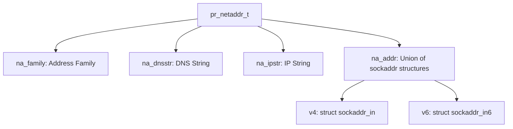
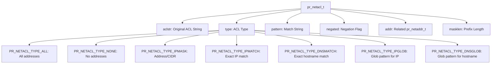
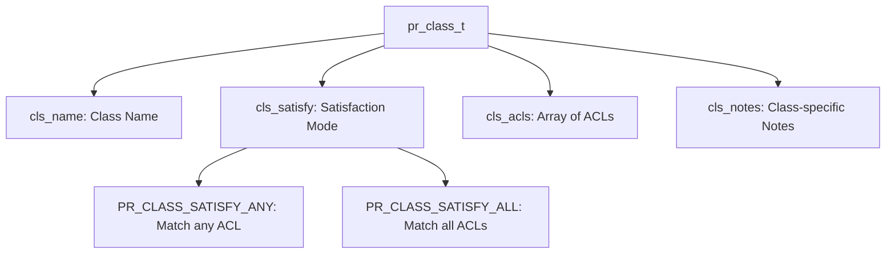
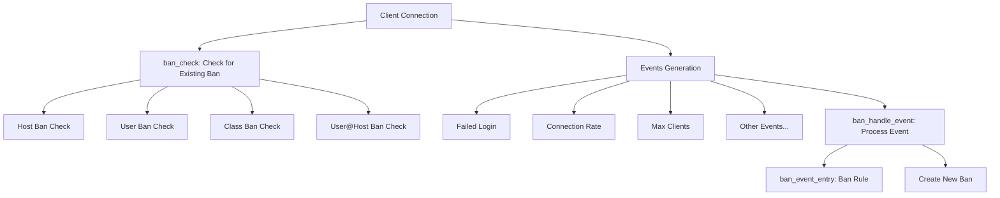
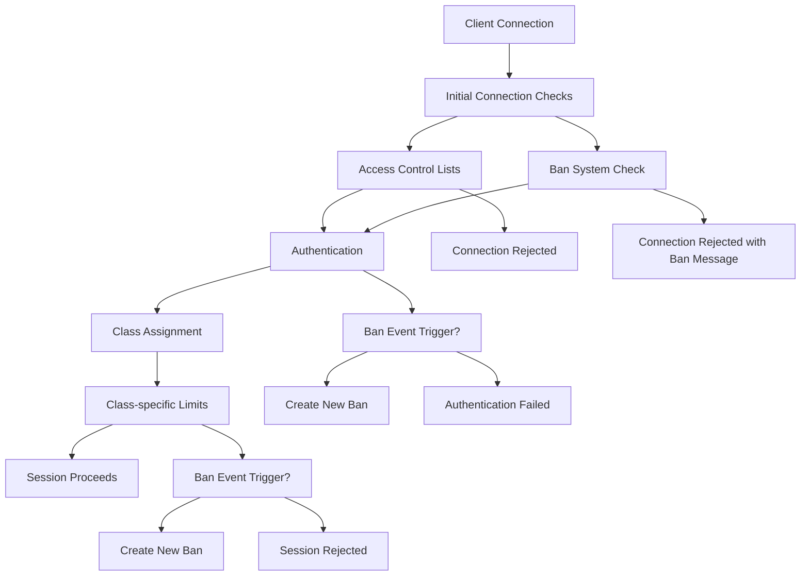

# Access Control

> **Relevant source files**
> * [contrib/mod_ban.c](https://github.com/proftpd/proftpd/blob/362466f3/contrib/mod_ban.c)
> * [contrib/mod_exec.c](https://github.com/proftpd/proftpd/blob/362466f3/contrib/mod_exec.c)
> * [doc/contrib/mod_ban.html](https://github.com/proftpd/proftpd/blob/362466f3/doc/contrib/mod_ban.html)
> * [doc/contrib/mod_exec.html](https://github.com/proftpd/proftpd/blob/362466f3/doc/contrib/mod_exec.html)
> * [doc/contrib/mod_shaper.html](https://github.com/proftpd/proftpd/blob/362466f3/doc/contrib/mod_shaper.html)
> * [doc/howto/IPv6.html](https://github.com/proftpd/proftpd/blob/362466f3/doc/howto/IPv6.html)
> * [include/class.h](https://github.com/proftpd/proftpd/blob/362466f3/include/class.h)
> * [include/netacl.h](https://github.com/proftpd/proftpd/blob/362466f3/include/netacl.h)
> * [include/netaddr.h](https://github.com/proftpd/proftpd/blob/362466f3/include/netaddr.h)
> * [src/class.c](https://github.com/proftpd/proftpd/blob/362466f3/src/class.c)
> * [src/netacl.c](https://github.com/proftpd/proftpd/blob/362466f3/src/netacl.c)
> * [src/netaddr.c](https://github.com/proftpd/proftpd/blob/362466f3/src/netaddr.c)
> * [tests/api/class.c](https://github.com/proftpd/proftpd/blob/362466f3/tests/api/class.c)
> * [tests/api/netacl.c](https://github.com/proftpd/proftpd/blob/362466f3/tests/api/netacl.c)
> * [tests/api/netaddr.c](https://github.com/proftpd/proftpd/blob/362466f3/tests/api/netaddr.c)
> * [tests/t/lib/ProFTPD/Tests/Modules/mod_ban.pm](https://github.com/proftpd/proftpd/blob/362466f3/tests/t/lib/ProFTPD/Tests/Modules/mod_ban.pm)
> * [tests/t/lib/ProFTPD/Tests/Modules/mod_exec.pm](https://github.com/proftpd/proftpd/blob/362466f3/tests/t/lib/ProFTPD/Tests/Modules/mod_exec.pm)
> * [tests/t/modules/mod_ban.t](https://github.com/proftpd/proftpd/blob/362466f3/tests/t/modules/mod_ban.t)
> * [tests/t/modules/mod_exec.t](https://github.com/proftpd/proftpd/blob/362466f3/tests/t/modules/mod_exec.t)

This document describes ProFTPD's access control mechanisms, which determine which clients can connect to the server and what actions they can perform. Access control in ProFTPD operates at multiple levels, from network-level restrictions to dynamic banning systems.

For information about authentication systems that determine how users identify themselves, see [Authentication Systems](/proftpd/proftpd/3-authentication-systems). For information about virtual hosts and contexts that affect configuration scope, see [Configuration System](/proftpd/proftpd/5-configuration-system).

## Network Address Handling Foundation

ProFTPD's access control is built on its network address subsystem, which provides a unified way to handle both IPv4 and IPv6 addresses.



The `pr_netaddr_t` structure abstracts network addresses and provides functions for:

* Creating and manipulating network address objects
* Converting between different address formats
* Comparing addresses
* Matching addresses against patterns
* Resolving hostnames to IP addresses

Sources: [src/netaddr.c L26-L459](https://github.com/proftpd/proftpd/blob/362466f3/src/netaddr.c#L26-L459)

 [include/netaddr.h L25-L45](https://github.com/proftpd/proftpd/blob/362466f3/include/netaddr.h#L25-L45)

 [include/netaddr.h L250-L444](https://github.com/proftpd/proftpd/blob/362466f3/include/netaddr.h#L250-L444)

## Network Access Control Lists (ACLs)

ProFTPD uses the `pr_netacl_t` structure to implement network access control lists that determine which clients can connect to the server.



### ACL Types and Formats

ACLs can be created from string specifications with various formats:

| ACL Format | Type | Description |
| --- | --- | --- |
| `ALL` | ALL | Matches all addresses |
| `NONE` | NONE | Matches no addresses |
| `192.168.1.0/24` | IPMASK | IP with CIDR notation |
| `10.0.0.1` | IPMATCH | Exact IP address match |
| `server.example.com` | DNSMATCH | Exact hostname match |
| `192.168.*` | IPGLOB | Glob pattern for IP matching |
| `*.example.org` | DNSGLOB | Glob pattern for hostname matching |
| `!10.0.0.1` | (Negated) | Inverted match (does NOT match the pattern) |

The `pr_netacl_match()` function tests whether a given address matches an ACL:

* Returns 1 for a positive match
* Returns -1 for a negative match (when ACL is negated)
* Returns 0 for no match
* Returns -2 for an error

Sources: [src/netacl.c L25-L78](https://github.com/proftpd/proftpd/blob/362466f3/src/netacl.c#L25-L78)

 [src/netacl.c L232-L450](https://github.com/proftpd/proftpd/blob/362466f3/src/netacl.c#L232-L450)

 [include/netacl.h L25-L85](https://github.com/proftpd/proftpd/blob/362466f3/include/netacl.h#L25-L85)

## Client Classes

Classes in ProFTPD provide a way to group clients with similar characteristics for easier management of access controls and resource limitations.



### Class Satisfaction Modes

When determining if a client belongs to a class, ProFTPD uses one of two satisfaction modes:

* **ANY**: The client is considered part of the class if it matches any ACL rule in the class
* **ALL**: The client must match all ACL rules in the class to be considered a member

Classes allow administrators to apply specific configurations and limits to groups of clients, such as:

* Setting different resource limits for different client groups
* Applying specific access controls to client groups
* Tracking and limiting client behavior based on class membership

Sources: [src/class.c L25-L192](https://github.com/proftpd/proftpd/blob/362466f3/src/class.c#L25-L192)

 [include/class.h L25-L63](https://github.com/proftpd/proftpd/blob/362466f3/include/class.h#L25-L63)

## Ban System

The `mod_ban` module provides a dynamic ban system that can temporarily or permanently prevent clients from logging in based on their behavior.



### Ban Types

The ban system supports four types of bans:

| Ban Type | Constant | Description |
| --- | --- | --- |
| Class Ban | `BAN_TYPE_CLASS` | Bans all clients in a specified class |
| Host Ban | `BAN_TYPE_HOST` | Bans a specific IP address |
| User Ban | `BAN_TYPE_USER` | Bans a specific username |
| User@Host Ban | `BAN_TYPE_USER_HOST` | Bans a specific username from a specific host |

### Automatic Ban Triggers

The `BanOnEvent` directive configures automatic bans when specific events occur:

| Event | Description | Ban Type |
| --- | --- | --- |
| `AnonRejectPasswords` | Anonymous password rejected | Host |
| `MaxClientsPerClass` | Class connection limit reached | Class |
| `MaxClientsPerHost` | Host connection limit reached | Host |
| `MaxClientsPerUser` | User connection limit reached | User |
| `MaxLoginAttempts` | Too many failed logins from a host | Host |
| `MaxLoginAttemptsFromUser` | Too many failed logins for a user@host | User@Host |
| `ClientConnectRate` | Connections from a host too frequent | Host |
| `TimeoutIdle` | Client idle timeout | Host |
| `TimeoutLogin` | Login timeout | Host |
| `UnhandledCommand` | Unknown/unhandled command | Host |

Sources: [contrib/mod_ban.c L25-L140](https://github.com/proftpd/proftpd/blob/362466f3/contrib/mod_ban.c#L25-L140)

 [contrib/mod_ban.c L90-L142](https://github.com/proftpd/proftpd/blob/362466f3/contrib/mod_ban.c#L90-L142)

 [contrib/mod_ban.c L964-L1020](https://github.com/proftpd/proftpd/blob/362466f3/contrib/mod_ban.c#L964-L1020)

 [doc/contrib/mod_ban.html L15-L385](https://github.com/proftpd/proftpd/blob/362466f3/doc/contrib/mod_ban.html#L15-L385)

## Access Control Flow

The following diagram shows how ProFTPD's access control components work together:



The access control flow follows these general steps:

1. When a client connects, it is checked against ACLs and existing bans
2. If allowed, authentication proceeds
3. After authentication, the client is assigned to a class and class-specific limits are applied
4. Throughout the session, various events may trigger new bans
5. Bans can be temporary (with an expiration time) or permanent

Sources: [src/netacl.c L50-L230](https://github.com/proftpd/proftpd/blob/362466f3/src/netacl.c#L50-L230)

 [contrib/mod_ban.c L1083-L1200](https://github.com/proftpd/proftpd/blob/362466f3/contrib/mod_ban.c#L1083-L1200)

 [contrib/mod_ban.c L251-L270](https://github.com/proftpd/proftpd/blob/362466f3/contrib/mod_ban.c#L251-L270)

## Configuration Examples

### Basic ACL Examples

```python
# Allow connections only from 192.168.1.0/24 network
<Limit LOGIN>
    Order allow,deny
    Allow from 192.168.1.0/24
    Deny from all
</Limit>

# Deny connections from a specific IP
<Limit LOGIN>
    Order allow,deny
    Deny from 10.0.0.5
    Allow from all
</Limit>

# Use DNS-based access control (requires UseReverseDNS)
<Limit LOGIN>
    Order allow,deny
    Allow from *.example.org
    Deny from all
</Limit>
```

### Class Definition Examples

```python
# Define a class for local users
Class local {
    From 10.0.0.0/8
    From 192.168.0.0/16
}

# Define a class for VPN users with all conditions required
Class vpn {
    From 172.16.0.0/12
    Satisfy all
}

# Apply different limits to different classes
<Class local>
    MaxClients 20
</Class>

<Class vpn>
    MaxClients 5
    MaxConnectionsPerHost 2
</Class>
```

### Ban System Examples

```markdown
# Enable the ban engine
BanEngine on
BanLog /var/log/proftpd/ban.log
BanTable /var/data/proftpd/ban.tab

# Ban clients that attempt more than 3 logins within 15 minutes for 1 hour
BanOnEvent MaxLoginAttempts 3/00:15:00 01:00:00

# Ban clients that connect too frequently (more than 5 times in 1 minute)
BanOnEvent ClientConnectRate 5/00:01:00 01:00:00

# Ban users that exceed their connection limit
BanOnEvent MaxClientsPerUser 3/00:10:00 00:30:00
```

Sources: [doc/contrib/mod_ban.html L135-L365](https://github.com/proftpd/proftpd/blob/362466f3/doc/contrib/mod_ban.html#L135-L365)

## Integration with Other Modules

### mod_exec Integration

The `mod_exec` module can execute external scripts at various points in the connection lifecycle, enabling custom access control logic:

```markdown
# Execute a script when a client connects
ExecOnConnect /path/to/check_access.sh %a %h

# Execute a script before a command is processed
ExecBeforeCommand STOR,RETR /path/to/check_permission.sh %u %f
```

This allows for complex, dynamic access control decisions based on external systems or custom logic.

Sources: [contrib/mod_exec.c L25-L176](https://github.com/proftpd/proftpd/blob/362466f3/contrib/mod_exec.c#L25-L176)

 [doc/contrib/mod_exec.html L15-L105](https://github.com/proftpd/proftpd/blob/362466f3/doc/contrib/mod_exec.html#L15-L105)