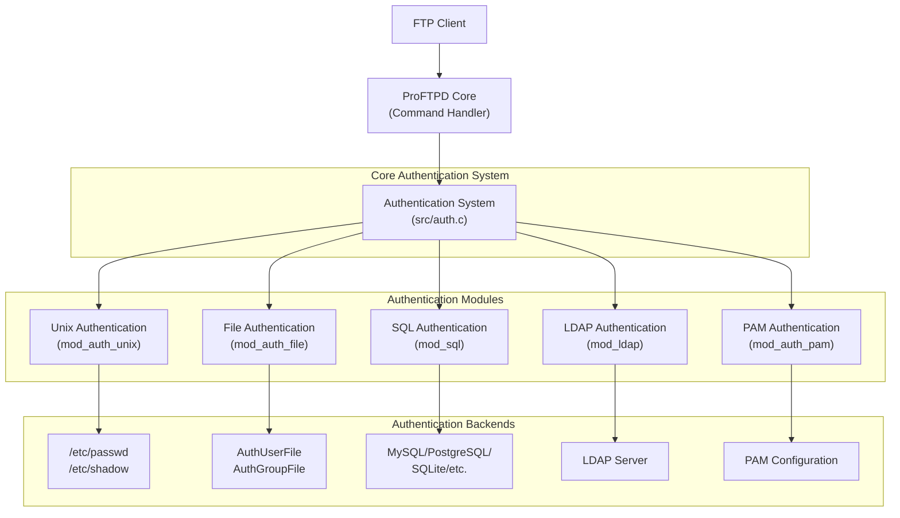
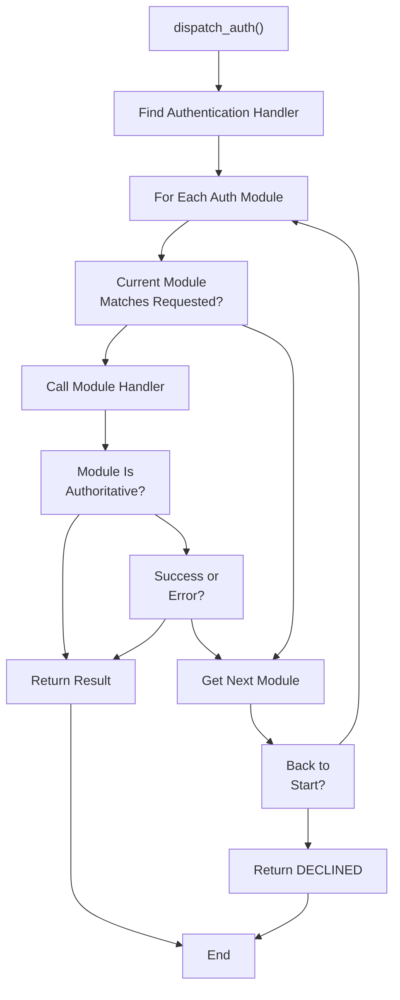
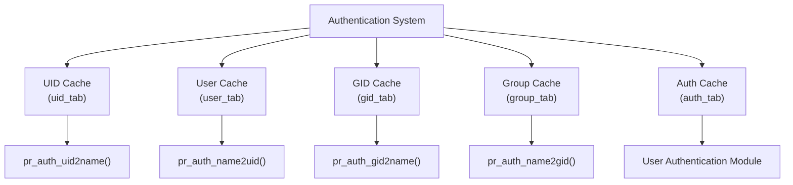

# Authentication Systems

> **Relevant source files**
> * [Make.rules.in](https://github.com/proftpd/proftpd/blob/362466f3/Make.rules.in)
> * [Makefile.in](https://github.com/proftpd/proftpd/blob/362466f3/Makefile.in)
> * [acconfig.h](https://github.com/proftpd/proftpd/blob/362466f3/acconfig.h)
> * [config.h.in](https://github.com/proftpd/proftpd/blob/362466f3/config.h.in)
> * [configure](https://github.com/proftpd/proftpd/blob/362466f3/configure)
> * [configure.in](https://github.com/proftpd/proftpd/blob/362466f3/configure.in)
> * [include/auth.h](https://github.com/proftpd/proftpd/blob/362466f3/include/auth.h)
> * [include/conf.h](https://github.com/proftpd/proftpd/blob/362466f3/include/conf.h)
> * [include/configdb.h](https://github.com/proftpd/proftpd/blob/362466f3/include/configdb.h)
> * [include/regexp.h](https://github.com/proftpd/proftpd/blob/362466f3/include/regexp.h)
> * [lib/Makefile.in](https://github.com/proftpd/proftpd/blob/362466f3/lib/Makefile.in)
> * [modules/Makefile.in](https://github.com/proftpd/proftpd/blob/362466f3/modules/Makefile.in)
> * [modules/mod_auth_file.c](https://github.com/proftpd/proftpd/blob/362466f3/modules/mod_auth_file.c)
> * [modules/mod_auth_unix.c](https://github.com/proftpd/proftpd/blob/362466f3/modules/mod_auth_unix.c)
> * [src/Makefile.in](https://github.com/proftpd/proftpd/blob/362466f3/src/Makefile.in)
> * [src/auth.c](https://github.com/proftpd/proftpd/blob/362466f3/src/auth.c)
> * [src/configdb.c](https://github.com/proftpd/proftpd/blob/362466f3/src/configdb.c)
> * [src/regexp.c](https://github.com/proftpd/proftpd/blob/362466f3/src/regexp.c)
> * [tests/api/auth.c](https://github.com/proftpd/proftpd/blob/362466f3/tests/api/auth.c)
> * [tests/api/configdb.c](https://github.com/proftpd/proftpd/blob/362466f3/tests/api/configdb.c)
> * [tests/api/regexp.c](https://github.com/proftpd/proftpd/blob/362466f3/tests/api/regexp.c)
> * [tests/t/lib/ProFTPD/Tests/Modules/mod_auth_file.pm](https://github.com/proftpd/proftpd/blob/362466f3/tests/t/lib/ProFTPD/Tests/Modules/mod_auth_file.pm)
> * [tests/t/modules/mod_auth_file.t](https://github.com/proftpd/proftpd/blob/362466f3/tests/t/modules/mod_auth_file.t)
> * [utils/Makefile.in](https://github.com/proftpd/proftpd/blob/362466f3/utils/Makefile.in)

The ProFTPD Authentication Systems provide a modular framework for authenticating and authorizing FTP users through various backends. This page describes the core authentication architecture, built-in authentication modules, and how they work together to handle user validation, credential verification, and access control.

## Authentication Architecture Overview

ProFTPD's authentication system is designed with modularity and extensibility in mind. The architecture separates authentication mechanisms from the core server code, enabling support for multiple authentication backends that can be used concurrently or in fallback sequences.



*Authentication System Architecture*

Sources: [src/auth.c], [modules/mod_auth_unix.c], [modules/mod_auth_file.c], [include/auth.h]

## Core Authentication System

The core authentication system is implemented in `src/auth.c` and provides the foundation for all authentication operations. It manages the following key aspects:

1. **Dispatch Mechanism**: Routes authentication requests to appropriate authentication modules
2. **Caching System**: Caches user and group lookups for improved performance
3. **Authentication API**: A consistent interface for all authentication modules
4. **Authentication Flow**: Controls the order and process of authentication attempts

```

```

*Authentication Process Flow*

Sources: [src/auth.c:402-474], [include/auth.h]

### Authentication API

The authentication API, defined in `include/auth.h`, provides a set of functions for user and group management that are used throughout the ProFTPD server:

| Function | Purpose |
| --- | --- |
| `pr_auth_setpwent()` | Open user database for reading |
| `pr_auth_endpwent()` | Close user database |
| `pr_auth_setgrent()` | Open group database for reading |
| `pr_auth_endgrent()` | Close group database |
| `pr_auth_getpwent()` | Get next user entry |
| `pr_auth_getgrent()` | Get next group entry |
| `pr_auth_getpwnam()` | Look up user by name |
| `pr_auth_getpwuid()` | Look up user by ID |
| `pr_auth_getgrnam()` | Look up group by name |
| `pr_auth_getgrgid()` | Look up group by ID |
| `pr_auth_authenticate()` | Authenticate a user with password |
| `pr_auth_authorize()` | Authorize a user for access |
| `pr_auth_check()` | Check if a user/pass combination is valid |
| `pr_auth_getgroups()` | Get supplementary groups for a user |

Sources: [include/auth.h:80-98], [src/auth.c]

### Authentication Return Codes

Authentication functions return standardized codes to indicate success or failure:

| Return Code | Value | Meaning |
| --- | --- | --- |
| `PR_AUTH_OK_NO_PASS` | 3 | Account authenticated by means other than password |
| `PR_AUTH_RFC2228_OK` | 2 | Account authenticated by RFC2228 security data exchange |
| `PR_AUTH_OK` | 0 | Account authenticated normally |
| `PR_AUTH_ERROR` | -1 | Error occurred in auth handler |
| `PR_AUTH_NOPWD` | -2 | Account does not exist |
| `PR_AUTH_BADPWD` | -3 | Password mismatch |
| `PR_AUTH_AGEPWD` | -4 | Password hasn't been changed recently enough |
| `PR_AUTH_DISABLEDPWD` | -5 | Account has been disabled |
| `PR_AUTH_CRED_INSUFFICIENT` | -6 | Insufficient credentials |
| `PR_AUTH_CRED_UNAVAIL` | -7 | Unavailable credentials |
| `PR_AUTH_CRED_ERROR` | -8 | Failure setting/using credentials |
| `PR_AUTH_INFO_UNAVAIL` | -9 | Unavailable credential/authentication service |
| `PR_AUTH_MAX_ATTEMPTS_EXCEEDED` | -10 | Max authentication attempts reached |
| `PR_AUTH_INIT_ERROR` | -11 | Authentication service initialization failure |
| `PR_AUTH_NEW_TOKEN_REQUIRED` | -12 | New authentication token/credentials needed |

Sources: [include/auth.h:36-78]

## Authentication Module Dispatch

The core of the authentication system is the `dispatch_auth()` function, which handles routing authentication requests to the appropriate module based on the configured authentication order:



*Authentication Module Dispatch Logic*

Sources: [src/auth.c:402-474]

## Built-in Authentication Modules

ProFTPD includes several built-in authentication modules, each providing a specific authentication mechanism.

### Unix Authentication (mod_auth_unix)

The Unix authentication module (`mod_auth_unix`) uses the system's user and group databases (/etc/passwd, /etc/shadow, etc.) to authenticate users.

Key features:

* Uses native Unix password verification
* Supports shadow passwords
* Can use supplementary groups
* Provides functions to enumerate users and groups

Sources: [modules/mod_auth_unix.c]

### File-based Authentication (mod_auth_file)

The File-based authentication module (`mod_auth_file`) allows the use of custom files for user and group information, similar to the format of /etc/passwd and /etc/group.

Key features:

* Custom user and group files
* Support for restricting users by UID/GID ranges
* Regular expression filtering for usernames and home directories
* Security checks to prevent use of insecure files

Configuration example:

```
AuthUserFile /path/to/ftpd.passwd
AuthGroupFile /path/to/ftpd.group
```

Sources: [modules/mod_auth_file.c]

## Authentication Caching

The authentication system includes caching mechanisms to improve performance for repeated user and group lookups. There are several caching tables:

1. **UID Cache**: Maps user IDs to user names
2. **User Cache**: Maps user names to user IDs
3. **GID Cache**: Maps group IDs to group names
4. **Group Cache**: Maps group names to group IDs
5. **Auth Cache**: Tracks which module successfully authenticated each user



*Authentication Caching System*

Sources: [src/auth.c:50-356]

## Authentication Order Configuration

ProFTPD provides the `AuthOrder` directive to specify the order in which authentication modules are tried. This allows for fallback authentication mechanisms.

Example configuration:

```markdown
# Try Unix authentication first, then file-based, and finally LDAP
AuthOrder mod_auth_unix.c mod_auth_file.c mod_ldap.c
```

The authentication system follows this order, trying each module in sequence until one succeeds or all fail.

Sources: [src/auth.c:402-474]

## Authentication Methods Table

| Authentication Method | Module | Backend | Description |
| --- | --- | --- | --- |
| Unix | mod_auth_unix | /etc/passwd, /etc/shadow | System user accounts |
| File | mod_auth_file | Custom password/group files | Separate FTP user database |
| SQL | mod_sql | MySQL, PostgreSQL, SQLite, etc. | Database-backed authentication |
| LDAP | mod_ldap | LDAP directory | Directory service authentication |
| PAM | mod_auth_pam | PAM configuration | Pluggable Authentication Modules |
| RADIUS | mod_radius | RADIUS server | Remote authentication via RADIUS |

Sources: [modules/mod_auth_unix.c], [modules/mod_auth_file.c]

## Implementation Notes

### The Authentication Dispatch Mechanism

The core of the authentication system is the `dispatch_auth()` function in `src/auth.c`. This function:

1. Looks up handler symbols registered by authentication modules
2. Iterates through these handlers in the order defined by AuthOrder
3. Calls each handler with the authentication command record
4. Returns immediately if a handler returns HANDLED or ERROR
5. Continues to the next handler if a handler returns DECLINED
6. Returns DECLINED if all handlers decline

This dispatching mechanism allows authentication modules to be tried in order until one succeeds or all fail.

Sources: [src/auth.c:402-474]

### Module Registration

Authentication modules register themselves with the core authentication system by adding entries to the authentication symbol table. For example:

```javascript
static authtable unix_authtab[] = {
  { 0, "setpwent", pw_setpwent },
  { 0, "endpwent", pw_endpwent },
  /* etc. */
  { 0, NULL, NULL }
};

/* Module initialization function */
static int auth_unix_init(void) {
  /* Register the authentication handlers */
  pr_stash_add_symbol(PR_SYM_AUTH, unix_authtab);
  return 0;
}
```

This allows the core to find and invoke the appropriate functions in each module.

Sources: [modules/mod_auth_unix.c]

## Related Pages

For more information about related authentication topics:

* For SQL authentication details, see [SQL Authentication](/proftpd/proftpd/3.2-sql-authentication)
* For LDAP authentication details, see [LDAP Authentication](/proftpd/proftpd/3.3-ldap-authentication)
* For other authentication methods, see [Other Authentication Methods](/proftpd/proftpd/3.4-other-authentication-methods)
* For virtual host configurations, see [Virtual Hosts and Contexts](/proftpd/proftpd/5.2-virtual-hosts-and-contexts)