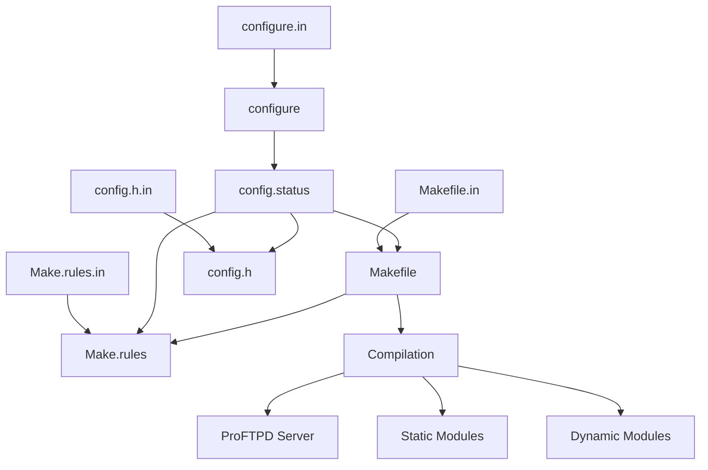
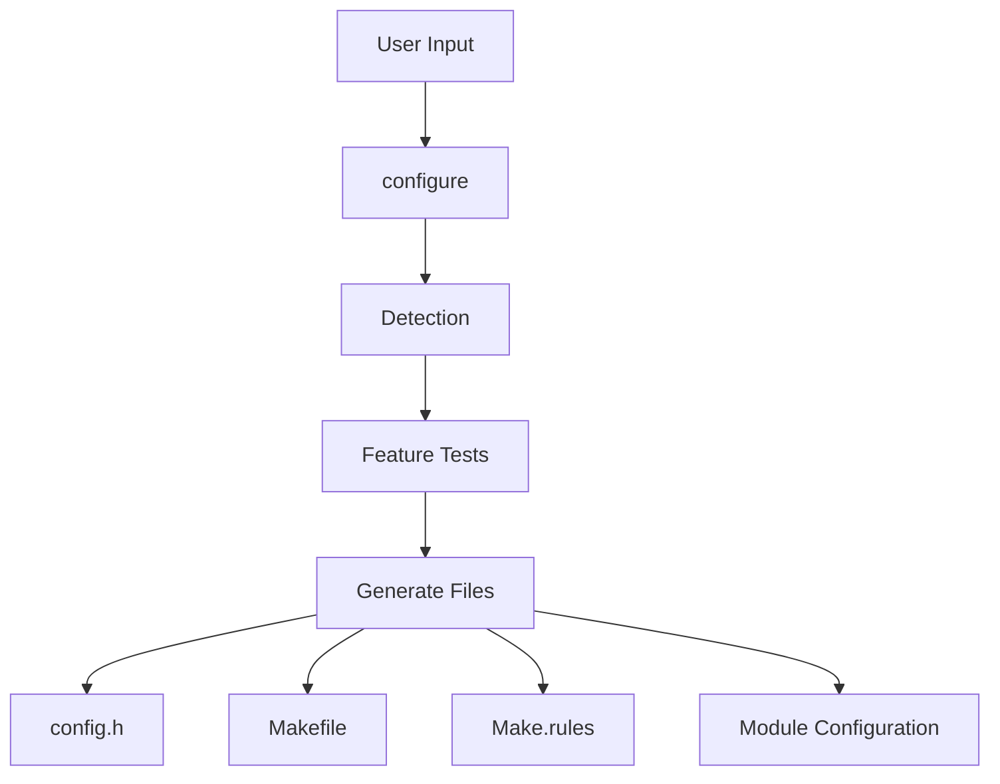
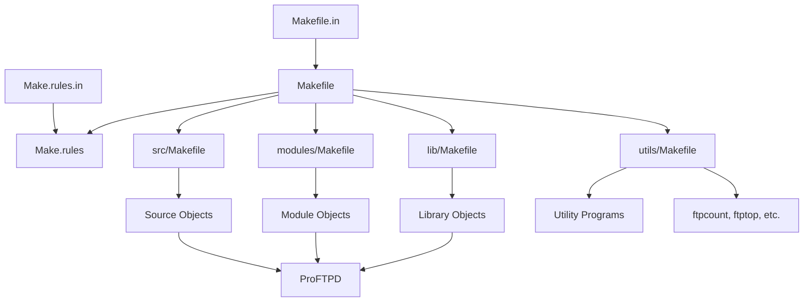
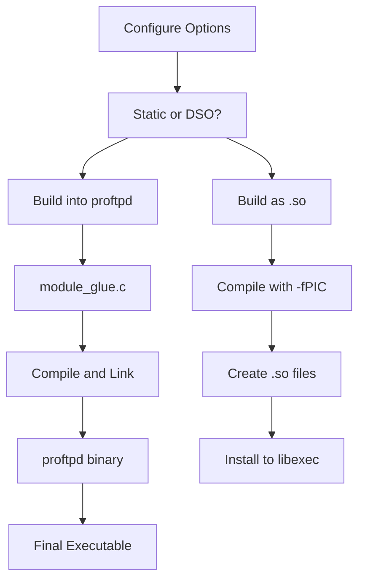
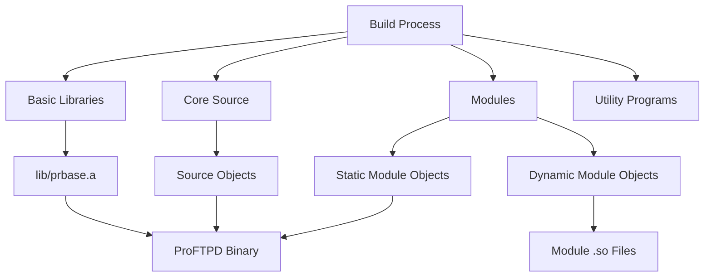
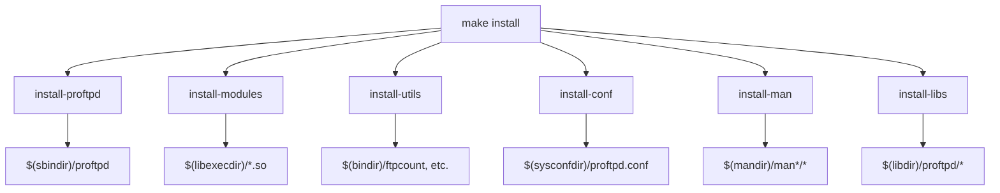
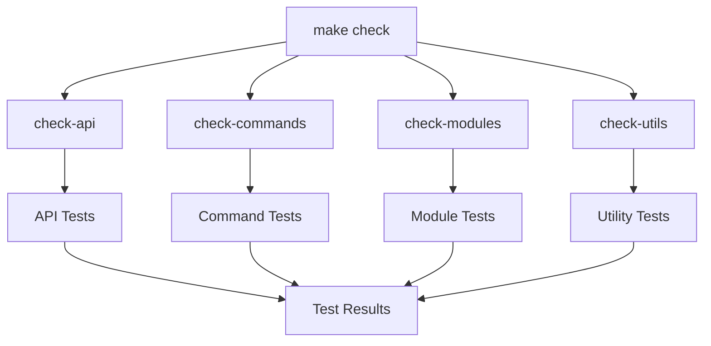

# Build System

> **Relevant source files**
> * [Make.rules.in](https://github.com/proftpd/proftpd/blob/362466f3/Make.rules.in)
> * [Makefile.in](https://github.com/proftpd/proftpd/blob/362466f3/Makefile.in)
> * [acconfig.h](https://github.com/proftpd/proftpd/blob/362466f3/acconfig.h)
> * [config.h.in](https://github.com/proftpd/proftpd/blob/362466f3/config.h.in)
> * [configure](https://github.com/proftpd/proftpd/blob/362466f3/configure)
> * [configure.in](https://github.com/proftpd/proftpd/blob/362466f3/configure.in)
> * [include/conf.h](https://github.com/proftpd/proftpd/blob/362466f3/include/conf.h)
> * [lib/Makefile.in](https://github.com/proftpd/proftpd/blob/362466f3/lib/Makefile.in)
> * [modules/Makefile.in](https://github.com/proftpd/proftpd/blob/362466f3/modules/Makefile.in)
> * [modules/mod_auth_file.c](https://github.com/proftpd/proftpd/blob/362466f3/modules/mod_auth_file.c)
> * [modules/mod_auth_unix.c](https://github.com/proftpd/proftpd/blob/362466f3/modules/mod_auth_unix.c)
> * [src/Makefile.in](https://github.com/proftpd/proftpd/blob/362466f3/src/Makefile.in)
> * [tests/t/lib/ProFTPD/Tests/Modules/mod_auth_file.pm](https://github.com/proftpd/proftpd/blob/362466f3/tests/t/lib/ProFTPD/Tests/Modules/mod_auth_file.pm)
> * [tests/t/modules/mod_auth_file.t](https://github.com/proftpd/proftpd/blob/362466f3/tests/t/modules/mod_auth_file.t)
> * [utils/Makefile.in](https://github.com/proftpd/proftpd/blob/362466f3/utils/Makefile.in)

The ProFTPD build system provides the infrastructure for configuring, compiling, and installing the ProFTPD server and its modules. This document describes the components of the build system, how they interact, and how to use them to build and customize ProFTPD.

## Overview

The ProFTPD build system follows the typical GNU autotools approach, consisting of configuration scripts, Makefiles, and utility scripts. The system is designed to detect platform-specific features automatically and allow for extensive customization through configuration options.



Sources: [configure L1-L943](https://github.com/proftpd/proftpd/blob/362466f3/configure#L1-L943)

 [configure.in L1-L50](https://github.com/proftpd/proftpd/blob/362466f3/configure.in#L1-L50)

 [Makefile.in L1-L32](https://github.com/proftpd/proftpd/blob/362466f3/Makefile.in#L1-L32)

 [Make.rules.in L1-L40](https://github.com/proftpd/proftpd/blob/362466f3/Make.rules.in#L1-L40)

## Configuration Process

The configuration process begins with the `configure` script, which is generated from `configure.in` using autoconf. This script performs platform detection, checks for required libraries and functions, and sets up the build environment based on user-specified options.

### Key Configuration Options

The configuration script supports numerous options for customizing the build. Here are some of the most important ones:

| Option | Description |
| --- | --- |
| `--prefix=PATH` | Set installation directory prefix (default: `/usr/local`) |
| `--with-modules=LIST` | Add additional static modules (colon-separated list) |
| `--with-shared=LIST` | Build specified modules as DSO (Dynamic Shared Objects) |
| `--enable-dso` | Add DSO support to core modules |
| `--enable-nls` | Enable Native Language Support |
| `--enable-ipv6` | Enable IPv6 support |

### Configuration Files Generated

After running the `configure` script, several important files are generated:

1. `config.h` - Contains system-specific definitions and feature flags
2. `Makefile` - Main makefile for building the server
3. `Make.rules` - Common rules and definitions for all makefiles



Sources: [configure.in L83-L123](https://github.com/proftpd/proftpd/blob/362466f3/configure.in#L83-L123)

 [configure.in L367-L422](https://github.com/proftpd/proftpd/blob/362466f3/configure.in#L367-L422)

 [config.h.in L1-L50](https://github.com/proftpd/proftpd/blob/362466f3/config.h.in#L1-L50)

## Makefile Structure

The build system uses a hierarchical structure of Makefiles, with the top-level Makefile including rules from `Make.rules`. Each module or component directory contains its own Makefile that inherits common definitions.

### Key Makefiles

| Makefile | Purpose |
| --- | --- |
| `Makefile` | Top-level makefile for the entire project |
| `Make.rules` | Common definitions and rules |
| `src/Makefile` | Rules for building core source files |
| `modules/Makefile` | Rules for building modules |
| `lib/Makefile` | Rules for building support libraries |

### Important Variables

These variables in `Make.rules` control various aspects of the build:

| Variable | Purpose |
| --- | --- |
| `CC` | C compiler command |
| `CFLAGS` | C compiler flags |
| `LDFLAGS` | Linker flags |
| `LIBS` | Libraries to link |
| `INSTALL_USER` | User for install permissions |
| `INSTALL_GROUP` | Group for install permissions |



Sources: [Makefile.in L1-L100](https://github.com/proftpd/proftpd/blob/362466f3/Makefile.in#L1-L100)

 [Make.rules.in L1-L127](https://github.com/proftpd/proftpd/blob/362466f3/Make.rules.in#L1-L127)

 [src/Makefile.in L1-L37](https://github.com/proftpd/proftpd/blob/362466f3/src/Makefile.in#L1-L37)

 [lib/Makefile.in L1-L50](https://github.com/proftpd/proftpd/blob/362466f3/lib/Makefile.in#L1-L50)

## Module Build System

ProFTPD has a flexible module system that allows modules to be built either statically (linked directly into the server) or as Dynamic Shared Objects (DSOs) loaded at runtime.

### Static Modules

Static modules are compiled directly into the ProFTPD binary. The core modules (`mod_core`, `mod_auth`, etc.) are always built statically, and additional modules can be included with the `--with-modules` configure option.

The build process creates a file called `module_glue.c` that links all static modules together.

### Dynamic Modules

Dynamic modules (DSOs) are built as separate `.so` files that ProFTPD loads at runtime. These modules require the `mod_dso` module to be built into the server.



Sources: [modules/Makefile.in L1-L85](https://github.com/proftpd/proftpd/blob/362466f3/modules/Makefile.in#L1-L85)

 [configure.in L447-L458](https://github.com/proftpd/proftpd/blob/362466f3/configure.in#L447-L458)

 [configure.in L728-L756](https://github.com/proftpd/proftpd/blob/362466f3/configure.in#L728-L756)

## Build Targets

The build system provides several targets for building, testing, and installing ProFTPD.

### Main Build Targets

| Target | Description |
| --- | --- |
| `all` | Build ProFTPD server and utilities |
| `clean` | Remove object files and executables |
| `distclean` | Remove all generated files |
| `install` | Install ProFTPD and utilities |
| `install-all` | Install everything including modules |
| `check` | Run the test suite |

### Building Process

The build process follows these steps:

1. The `configure` script is run, generating `config.h`, `Makefile`, and other configuration files
2. Running `make` builds the core server components, libraries, and modules
3. Static modules are compiled and linked directly into the ProFTPD binary
4. Dynamic modules are compiled as separate `.so` files
5. Utility programs (`ftpcount`, `ftpwho`, etc.) are built



Sources: [Makefile.in L43-L206](https://github.com/proftpd/proftpd/blob/362466f3/Makefile.in#L43-L206)

 [modules/Makefile.in L40-L53](https://github.com/proftpd/proftpd/blob/362466f3/modules/Makefile.in#L40-L53)

## Installation Process

The installation process handles installing the ProFTPD binary, modules, configuration files, and documentation.

### Installation Targets

| Target | Description |
| --- | --- |
| `install-proftpd` | Install the ProFTPD binary |
| `install-modules` | Install modules |
| `install-utils` | Install utility programs |
| `install-conf` | Install configuration files |
| `install-man` | Install man pages |
| `install-all` | Full installation |

### Installation Directories

| Directory | Description |
| --- | --- |
| `$(DESTDIR)$(sbindir)` | Server binary |
| `$(DESTDIR)$(libexecdir)` | Dynamic modules |
| `$(DESTDIR)$(sysconfdir)` | Configuration files |
| `$(DESTDIR)$(mandir)` | Man pages |
| `$(DESTDIR)$(bindir)` | Utility programs |



Sources: [Makefile.in L136-L206](https://github.com/proftpd/proftpd/blob/362466f3/Makefile.in#L136-L206)

## Customizing the Build

The ProFTPD build system allows for significant customization through configure options, environment variables, and build-time settings.

### Common Customizations

1. **Adding Modules**: ``` ./configure --with-modules=mod_tls:mod_sftp ```
2. **Building Modules as DSOs**: ``` ./configure --enable-dso --with-shared=mod_tls:mod_sftp ```
3. **Custom Installation Directories**: ``` ./configure --prefix=/opt/proftpd --sysconfdir=/etc/proftpd ```
4. **Enabling Features**: ``` ./configure --enable-nls --enable-ipv6 ```

### Build Environment Variables

| Variable | Effect |
| --- | --- |
| `CFLAGS` | Additional compiler flags |
| `LDFLAGS` | Additional linker flags |
| `LIBS` | Additional libraries to link |
| `CPPFLAGS` | Additional preprocessor flags |

Sources: [configure.in L83-L145](https://github.com/proftpd/proftpd/blob/362466f3/configure.in#L83-L145)

 [configure.in L338-L423](https://github.com/proftpd/proftpd/blob/362466f3/configure.in#L338-L423)

## Testing

The ProFTPD build system includes a test suite for verifying the functionality of the server and modules.

### Test Targets

| Target | Description |
| --- | --- |
| `check` | Run the entire test suite |
| `check-api` | Run API tests |
| `check-commands` | Run FTP command tests |
| `check-modules` | Run module tests |

The test suite is enabled with the `--enable-tests` configure option.



Sources: [Makefile.in L100-L126](https://github.com/proftpd/proftpd/blob/362466f3/Makefile.in#L100-L126)

 [tests/t/modules/mod_auth_file.t L1-L12](https://github.com/proftpd/proftpd/blob/362466f3/tests/t/modules/mod_auth_file.t#L1-L12)

 [tests/t/lib/ProFTPD/Tests/Modules/mod_auth_file.pm L1-L363](https://github.com/proftpd/proftpd/blob/362466f3/tests/t/lib/ProFTPD/Tests/Modules/mod_auth_file.pm#L1-L363)

## Troubleshooting Build Issues

Common build issues and their solutions:

| Issue | Solution |
| --- | --- |
| Missing libraries | Use `--with-libraries` and `--with-includes` to specify paths |
| Configuration failures | Check `config.log` for detailed error information |
| Module build errors | Verify module dependencies are installed |
| Installation permission issues | Run `make install` as root or use `sudo` |

Sources: [configure.in L312-L362](https://github.com/proftpd/proftpd/blob/362466f3/configure.in#L312-L362)