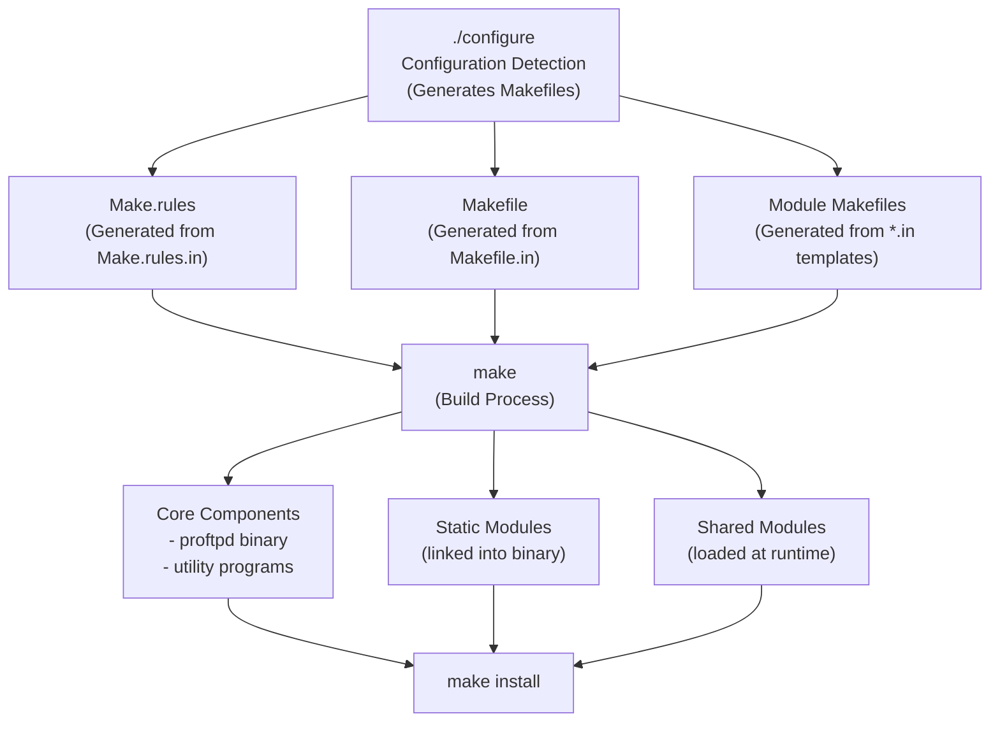
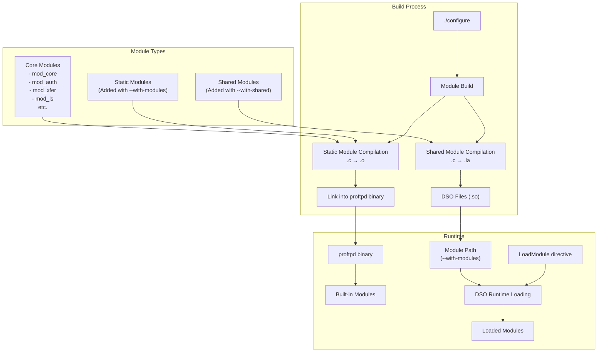
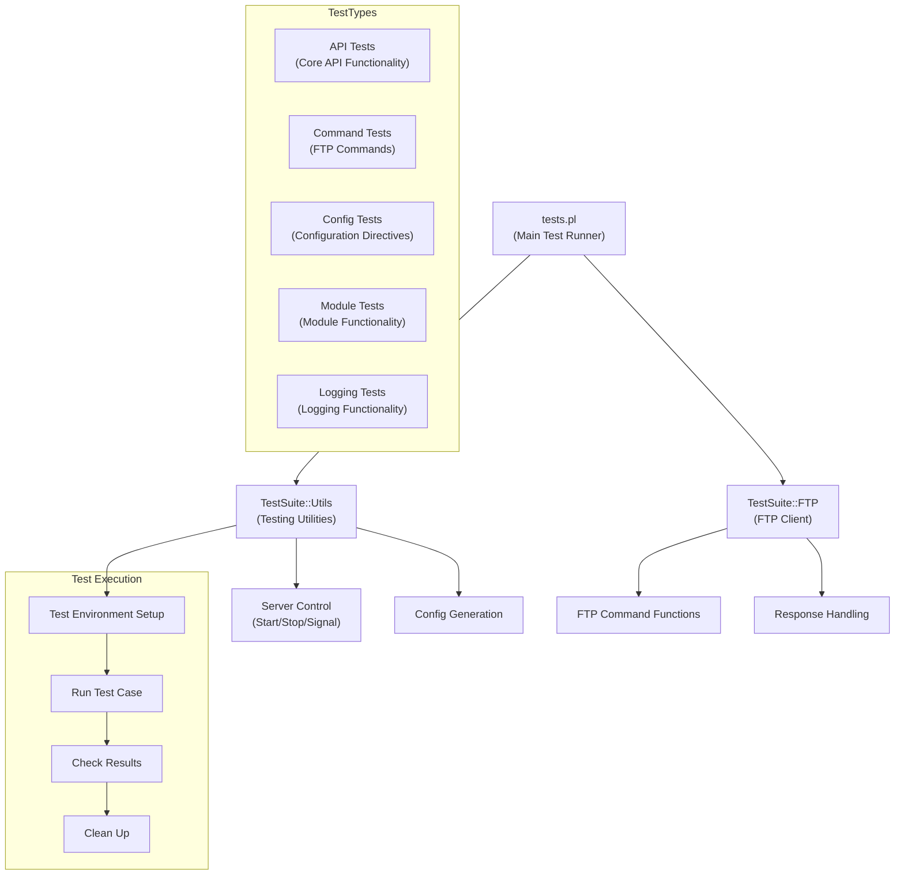
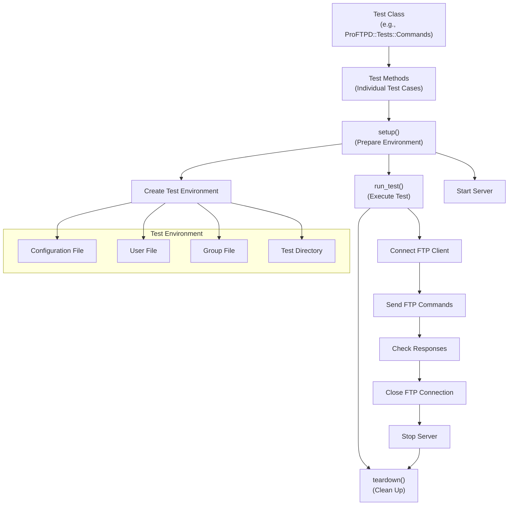

# Building and Testing

> **Relevant source files**
> * [Make.rules.in](https://github.com/proftpd/proftpd/blob/362466f3/Make.rules.in)
> * [Makefile.in](https://github.com/proftpd/proftpd/blob/362466f3/Makefile.in)
> * [acconfig.h](https://github.com/proftpd/proftpd/blob/362466f3/acconfig.h)
> * [config.h.in](https://github.com/proftpd/proftpd/blob/362466f3/config.h.in)
> * [configure](https://github.com/proftpd/proftpd/blob/362466f3/configure)
> * [configure.in](https://github.com/proftpd/proftpd/blob/362466f3/configure.in)
> * [include/cmd.h](https://github.com/proftpd/proftpd/blob/362466f3/include/cmd.h)
> * [include/conf.h](https://github.com/proftpd/proftpd/blob/362466f3/include/conf.h)
> * [include/ftp.h](https://github.com/proftpd/proftpd/blob/362466f3/include/ftp.h)
> * [lib/Makefile.in](https://github.com/proftpd/proftpd/blob/362466f3/lib/Makefile.in)
> * [modules/Makefile.in](https://github.com/proftpd/proftpd/blob/362466f3/modules/Makefile.in)
> * [modules/mod_auth_file.c](https://github.com/proftpd/proftpd/blob/362466f3/modules/mod_auth_file.c)
> * [modules/mod_auth_unix.c](https://github.com/proftpd/proftpd/blob/362466f3/modules/mod_auth_unix.c)
> * [src/Makefile.in](https://github.com/proftpd/proftpd/blob/362466f3/src/Makefile.in)
> * [src/cmd.c](https://github.com/proftpd/proftpd/blob/362466f3/src/cmd.c)
> * [tests/api/cmd.c](https://github.com/proftpd/proftpd/blob/362466f3/tests/api/cmd.c)
> * [tests/t/commands.t](https://github.com/proftpd/proftpd/blob/362466f3/tests/t/commands.t)
> * [tests/t/commands/rang.t](https://github.com/proftpd/proftpd/blob/362466f3/tests/t/commands/rang.t)
> * [tests/t/config/defaultroot.t](https://github.com/proftpd/proftpd/blob/362466f3/tests/t/config/defaultroot.t)
> * [tests/t/lib/ProFTPD/TestSuite/FTP.pm](https://github.com/proftpd/proftpd/blob/362466f3/tests/t/lib/ProFTPD/TestSuite/FTP.pm)
> * [tests/t/lib/ProFTPD/TestSuite/Utils.pm](https://github.com/proftpd/proftpd/blob/362466f3/tests/t/lib/ProFTPD/TestSuite/Utils.pm)
> * [tests/t/lib/ProFTPD/Tests/Commands.pm](https://github.com/proftpd/proftpd/blob/362466f3/tests/t/lib/ProFTPD/Tests/Commands.pm)
> * [tests/t/lib/ProFTPD/Tests/Commands/CLNT.pm](https://github.com/proftpd/proftpd/blob/362466f3/tests/t/lib/ProFTPD/Tests/Commands/CLNT.pm)
> * [tests/t/lib/ProFTPD/Tests/Commands/RANG.pm](https://github.com/proftpd/proftpd/blob/362466f3/tests/t/lib/ProFTPD/Tests/Commands/RANG.pm)
> * [tests/t/lib/ProFTPD/Tests/Config/DefaultRoot.pm](https://github.com/proftpd/proftpd/blob/362466f3/tests/t/lib/ProFTPD/Tests/Config/DefaultRoot.pm)
> * [tests/t/lib/ProFTPD/Tests/Logins.pm](https://github.com/proftpd/proftpd/blob/362466f3/tests/t/lib/ProFTPD/Tests/Logins.pm)
> * [tests/t/lib/ProFTPD/Tests/Modules/mod_auth_file.pm](https://github.com/proftpd/proftpd/blob/362466f3/tests/t/lib/ProFTPD/Tests/Modules/mod_auth_file.pm)
> * [tests/t/modules/mod_auth_file.t](https://github.com/proftpd/proftpd/blob/362466f3/tests/t/modules/mod_auth_file.t)
> * [tests/tests.pl](https://github.com/proftpd/proftpd/blob/362466f3/tests/tests.pl)
> * [utils/Makefile.in](https://github.com/proftpd/proftpd/blob/362466f3/utils/Makefile.in)

This page documents the ProFTPD build and testing systems. It covers how to configure, compile, and install ProFTPD from source, as well as how to run the extensive test suite to validate your installation. For information about specific configuration options for production deployments, see [Configuration System](/proftpd/proftpd/5-configuration-system).

## Build System Overview

The ProFTPD build system uses the GNU autoconf/automake toolchain for platform-independent configuration and building. This provides a flexible build system that can adapt to different operating systems and environments.



Sources: [configure.in L1-L1014](https://github.com/proftpd/proftpd/blob/362466f3/configure.in#L1-L1014)

 [Makefile.in L1-L303](https://github.com/proftpd/proftpd/blob/362466f3/Makefile.in#L1-L303)

 [Make.rules.in L1-L127](https://github.com/proftpd/proftpd/blob/362466f3/Make.rules.in#L1-L127)

## Configuring the Build

The `configure` script is generated from `configure.in` and is used to detect system capabilities and configure the build process. It creates Makefiles and other configuration files based on the detected system and user-specified options.

### Basic Configuration

The simplest configuration uses default options:

```
./configure
```

### Common Configuration Options

ProFTPD offers many configuration options to customize the build:

| Option | Purpose | Default |
| --- | --- | --- |
| `--prefix=PATH` | Installation directory prefix | `/usr/local` |
| `--with-modules=LIST` | Add additional modules (colon-separated) | None |
| `--with-shared=LIST` | Build modules as DSOs (colon-separated) | None |
| `--enable-dso` | Enable Dynamic Shared Object support | Disabled |
| `--enable-nls` | Enable Native Language Support | Disabled |
| `--enable-ipv6` | Enable IPv6 support | Disabled |
| `--enable-tests` | Enable testing support | Disabled |
| `--enable-openssl` | Enable OpenSSL support | Disabled |

Example of a more customized configuration:

```
./configure --prefix=/opt/proftpd --with-modules=mod_tls:mod_sql:mod_sql_mysql \
  --enable-dso --enable-openssl --enable-tests
```

Sources: [configure.in L184-L497](https://github.com/proftpd/proftpd/blob/362466f3/configure.in#L184-L497)

 [configure.in L613-L1014](https://github.com/proftpd/proftpd/blob/362466f3/configure.in#L613-L1014)

## Build Process

After running `configure`, you can build ProFTPD using `make`:

```
make
```

This builds the main ProFTPD server binary, utilities, and configured modules.

### Important Make Targets

| Target | Purpose |
| --- | --- |
| `make` or `make all` | Build all components |
| `make proftpd` | Build only the main server binary |
| `make modules` | Build modules |
| `make install` | Install all components |
| `make install-proftpd` | Install only the server |
| `make install-modules` | Install only the modules |
| `make clean` | Remove build files |
| `make distclean` | Remove build files and generated config files |

Sources: [Makefile.in L43-L235](https://github.com/proftpd/proftpd/blob/362466f3/Makefile.in#L43-L235)

## Module System

ProFTPD has a modular architecture with two types of modules:

1. **Static Modules**: Compiled directly into the ProFTPD binary
2. **Shared Modules**: Loaded at runtime as Dynamic Shared Objects (DSOs)



### Building Static Modules

Static modules are compiled directly into the ProFTPD binary:

```
./configure --with-modules=mod_tls:mod_sql
make
```

### Building Shared Modules (DSOs)

Shared modules require mod_dso support and are built as loadable objects:

```
./configure --enable-dso --with-shared=mod_tls:mod_sql
make
```

The modules are installed in the module directory (usually `$prefix/libexec/proftpd`).

Sources: [configure.in L362-L502](https://github.com/proftpd/proftpd/blob/362466f3/configure.in#L362-L502)

 [modules/Makefile.in L1-L84](https://github.com/proftpd/proftpd/blob/362466f3/modules/Makefile.in#L1-L84)

## Testing Framework

ProFTPD includes a comprehensive test suite written in Perl. The tests are categorized into different types and can be run individually or as groups.



Sources: [tests/tests.pl L1-L589](https://github.com/proftpd/proftpd/blob/362466f3/tests/tests.pl#L1-L589)

 [tests/t/lib/ProFTPD/TestSuite/Utils.pm L1-L100](https://github.com/proftpd/proftpd/blob/362466f3/tests/t/lib/ProFTPD/TestSuite/Utils.pm#L1-L100)

### Enabling Tests

To enable the test suite, configure ProFTPD with:

```
./configure --enable-tests
make
```

### Running Tests

The test suite is managed by the `tests.pl` script in the `tests` directory:

```
cd tests
./tests.pl
```

#### Running Specific Test Classes

You can run specific test classes:

```python
./tests.pl --class mod_tls
```

#### Running Tests by Pattern

You can filter tests by file pattern:

```
./tests.pl --file-pattern commands
```

#### Keep Temporary Files

To keep temporary files for debugging:

```
./tests.pl --keep-tmpfiles
```

Sources: [tests/tests.pl L10-L55](https://github.com/proftpd/proftpd/blob/362466f3/tests/tests.pl#L10-L55)

 [tests/tests.pl L546-L555](https://github.com/proftpd/proftpd/blob/362466f3/tests/tests.pl#L546-L555)

## Test Architecture

The test suite is organized by functionality, with different test classes focusing on specific areas:

1. **API Tests**: Test internal API functions
2. **Command Tests**: Test FTP command processing
3. **Configuration Tests**: Test configuration directives
4. **Module Tests**: Test specific module functionality
5. **Logging Tests**: Test logging features



Sources: [tests/t/lib/ProFTPD/TestSuite/Utils.pm L94-L526](https://github.com/proftpd/proftpd/blob/362466f3/tests/t/lib/ProFTPD/TestSuite/Utils.pm#L94-L526)

 [tests/t/lib/ProFTPD/TestSuite/FTP.pm L1-L196](https://github.com/proftpd/proftpd/blob/362466f3/tests/t/lib/ProFTPD/TestSuite/FTP.pm#L1-L196)

### Test Classes

ProFTPD tests are organized into categories, with each test file containing multiple test cases:

| Test Category | Description | Example Files |
| --- | --- | --- |
| API Tests | Core API functionality | `tests/api/*.c` |
| Command Tests | FTP Command processing | `tests/t/commands/*.t` |
| Config Tests | Configuration directives | `tests/t/config/*.t` |
| Module Tests | Module functionality | `tests/t/modules/*.t` |
| Logging Tests | Logging functionality | `tests/t/logging/*.t` |

Sources: [tests/tests.pl L55-L203](https://github.com/proftpd/proftpd/blob/362466f3/tests/tests.pl#L55-L203)

 [tests/tests.pl L235-L536](https://github.com/proftpd/proftpd/blob/362466f3/tests/tests.pl#L235-L536)

### Test Structure

Each test file defines a set of test cases, which are methods that test specific functionality. The test methods use utilities from `ProFTPD::TestSuite::Utils` to set up and run the tests, and various assertions to check the results.

A typical test case follows this structure:

1. **Setup**: Create test directories, users, and configuration
2. **Server Start**: Start ProFTPD with the test configuration
3. **Test Execution**: Connect an FTP client and execute commands
4. **Verification**: Check responses and server behavior
5. **Cleanup**: Stop the server and remove test files

Sources: [tests/t/lib/ProFTPD/Tests/Logins.pm L1-L90](https://github.com/proftpd/proftpd/blob/362466f3/tests/t/lib/ProFTPD/Tests/Logins.pm#L1-L90)

 [tests/t/lib/ProFTPD/Tests/Commands.pm L1-L100](https://github.com/proftpd/proftpd/blob/362466f3/tests/t/lib/ProFTPD/Tests/Commands.pm#L1-L100)

## Running the Test Suite

The `tests.pl` script in the `tests` directory is the main entry point for running the test suite. It can run all tests or a subset of tests based on options.

### Basic Test Run

```
cd tests
./tests.pl
```

### Testing Specific Modules

To run tests for specific modules:

```python
./tests.pl --class mod_tls --class mod_sql
```

### Running Category Tests

You can run tests by category:

```markdown
cd tests
make check-api        # Run API tests
make check-commands   # Run FTP command tests
make check-configs    # Run configuration tests
make check-modules    # Run module tests
make check            # Run all tests
```

Sources: [Makefile.in L100-L126](https://github.com/proftpd/proftpd/blob/362466f3/Makefile.in#L100-L126)

 [tests/tests.pl L546-L589](https://github.com/proftpd/proftpd/blob/362466f3/tests/tests.pl#L546-L589)

## Integration with the Build System

The test suite is tightly integrated with the build system. If you configure with `--enable-tests`, you can run tests directly after building:

```
make check
```

This runs the entire test suite. You can also run specific test categories:

```
make check-api
make check-commands
make check-configs
make check-modules
```

Sources: [Makefile.in L100-L126](https://github.com/proftpd/proftpd/blob/362466f3/Makefile.in#L100-L126)

## Writing New Tests

To create a new test, you typically:

1. Create a new Perl module in the appropriate test directory
2. Define a set of test cases as methods in the module
3. Register the test cases with the test suite

Each test case should:

1. Set up the test environment (users, directories, configuration)
2. Start the server
3. Run the test (connect, execute commands, etc.)
4. Verify the results
5. Clean up

Sources: [tests/t/lib/ProFTPD/Tests/Modules/mod_auth_file.pm L1-L30](https://github.com/proftpd/proftpd/blob/362466f3/tests/t/lib/ProFTPD/Tests/Modules/mod_auth_file.pm#L1-L30)

## Authentication Testing

ProFTPD's test suite includes utilities for testing authentication mechanisms. The `auth_user_write` and `auth_group_write` functions create test user and group files for authentication testing.

You can test different authentication modules, including:

* mod_auth_unix (system authentication)
* mod_auth_file (file-based authentication)
* mod_auth_pam (PAM authentication)
* mod_sql (SQL-based authentication)

Sources: [tests/t/lib/ProFTPD/TestSuite/Utils.pm L126-L233](https://github.com/proftpd/proftpd/blob/362466f3/tests/t/lib/ProFTPD/TestSuite/Utils.pm#L126-L233)

 [modules/mod_auth_file.c L1-L100](https://github.com/proftpd/proftpd/blob/362466f3/modules/mod_auth_file.c#L1-L100)

 [modules/mod_auth_unix.c L1-L100](https://github.com/proftpd/proftpd/blob/362466f3/modules/mod_auth_unix.c#L1-L100)

## Troubleshooting Build and Test Issues

### Common Build Issues

1. **Missing dependencies**: Check for required libraries
2. **Configuration errors**: Examine `config.log`
3. **Compilation errors**: Check compiler output
4. **Platform-specific issues**: Check for OS-specific options

### Common Test Issues

1. **Test failures**: Check specific error messages
2. **Permission issues**: Tests may need root privileges
3. **Port conflicts**: Make sure test ports are available
4. **Environment issues**: Tests may depend on specific environment

Sources: [config.h.in L1-L50](https://github.com/proftpd/proftpd/blob/362466f3/config.h.in#L1-L50)

## Conclusion

The ProFTPD build and testing systems provide a flexible and powerful framework for building, installing, and validating the server. The autoconf/automake-based build system allows for extensive customization of the build, while the comprehensive test suite ensures that the server works as expected.