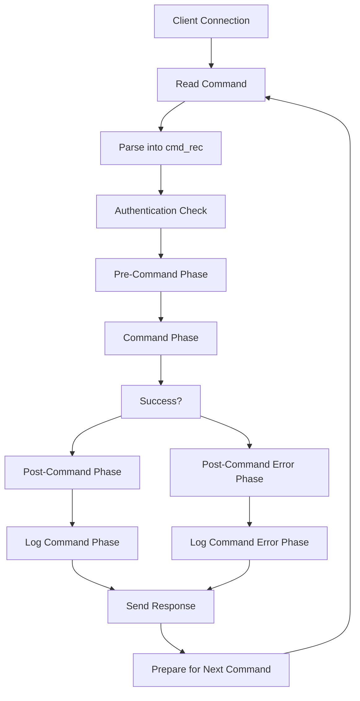
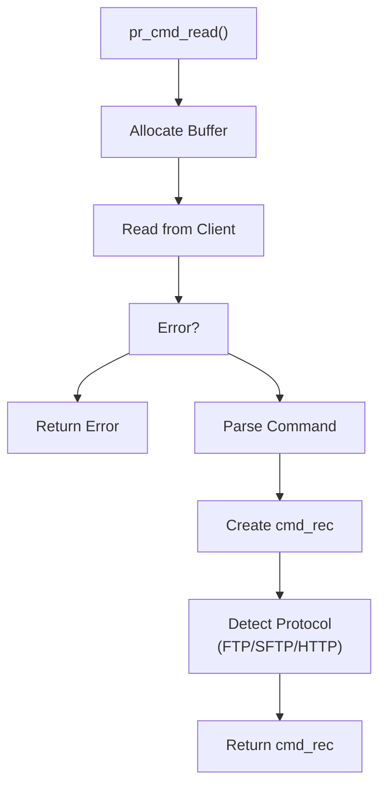
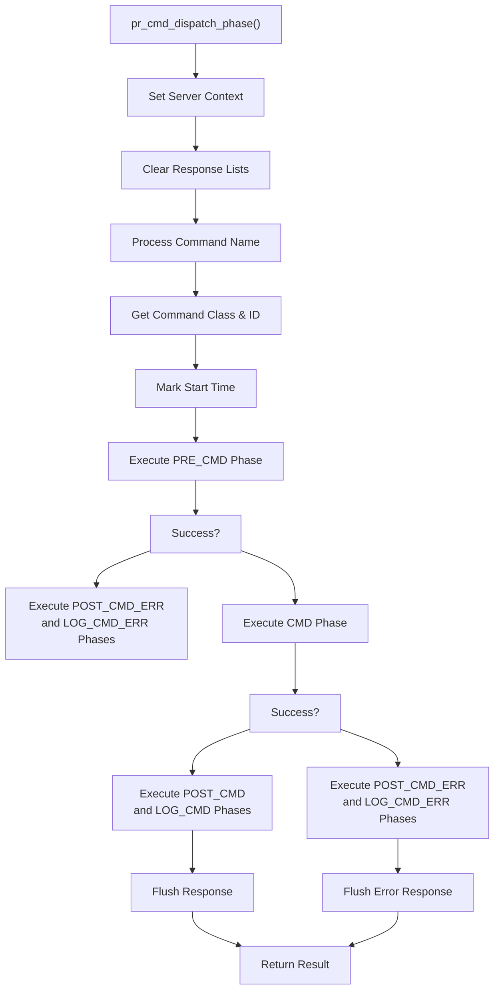
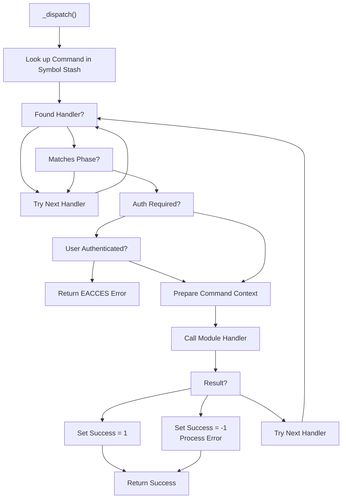
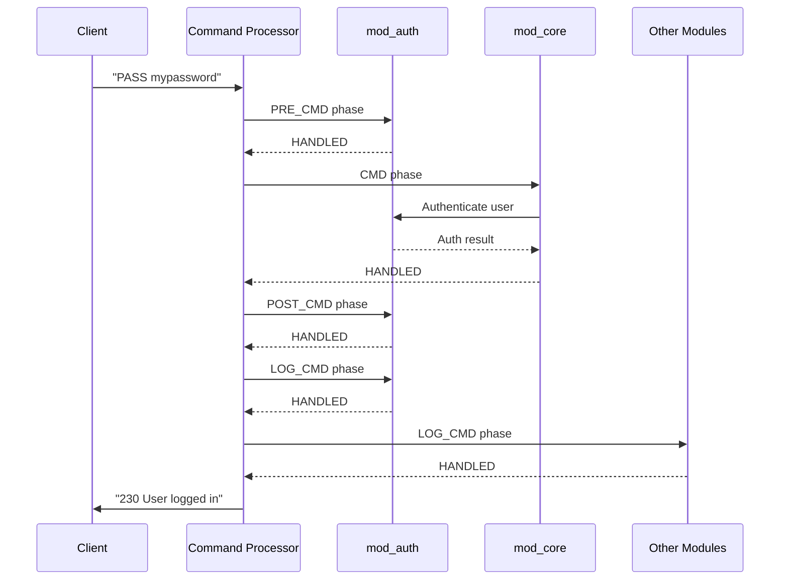
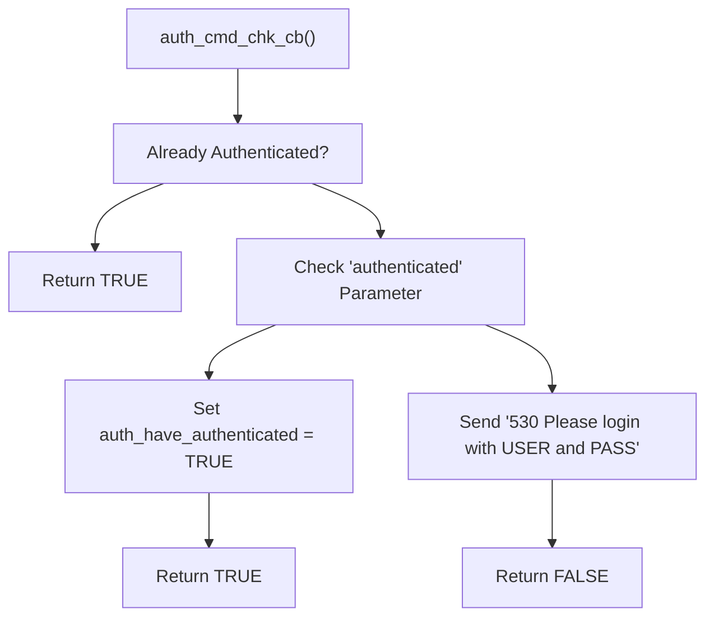

# Command Processing

> **Relevant source files**
> * [NEWS](https://github.com/proftpd/proftpd/blob/362466f3/NEWS)
> * [include/cmd.h](https://github.com/proftpd/proftpd/blob/362466f3/include/cmd.h)
> * [include/dirtree.h](https://github.com/proftpd/proftpd/blob/362466f3/include/dirtree.h)
> * [include/ftp.h](https://github.com/proftpd/proftpd/blob/362466f3/include/ftp.h)
> * [include/inet.h](https://github.com/proftpd/proftpd/blob/362466f3/include/inet.h)
> * [include/proftpd.h](https://github.com/proftpd/proftpd/blob/362466f3/include/proftpd.h)
> * [modules/mod_auth.c](https://github.com/proftpd/proftpd/blob/362466f3/modules/mod_auth.c)
> * [modules/mod_core.c](https://github.com/proftpd/proftpd/blob/362466f3/modules/mod_core.c)
> * [modules/mod_ls.c](https://github.com/proftpd/proftpd/blob/362466f3/modules/mod_ls.c)
> * [modules/mod_site.c](https://github.com/proftpd/proftpd/blob/362466f3/modules/mod_site.c)
> * [modules/mod_xfer.c](https://github.com/proftpd/proftpd/blob/362466f3/modules/mod_xfer.c)
> * [src/cmd.c](https://github.com/proftpd/proftpd/blob/362466f3/src/cmd.c)
> * [src/data.c](https://github.com/proftpd/proftpd/blob/362466f3/src/data.c)
> * [src/dirtree.c](https://github.com/proftpd/proftpd/blob/362466f3/src/dirtree.c)
> * [src/inet.c](https://github.com/proftpd/proftpd/blob/362466f3/src/inet.c)
> * [src/main.c](https://github.com/proftpd/proftpd/blob/362466f3/src/main.c)
> * [tests/api/cmd.c](https://github.com/proftpd/proftpd/blob/362466f3/tests/api/cmd.c)
> * [tests/t/commands.t](https://github.com/proftpd/proftpd/blob/362466f3/tests/t/commands.t)
> * [tests/t/commands/rang.t](https://github.com/proftpd/proftpd/blob/362466f3/tests/t/commands/rang.t)
> * [tests/t/config/defaultroot.t](https://github.com/proftpd/proftpd/blob/362466f3/tests/t/config/defaultroot.t)
> * [tests/t/lib/ProFTPD/TestSuite/FTP.pm](https://github.com/proftpd/proftpd/blob/362466f3/tests/t/lib/ProFTPD/TestSuite/FTP.pm)
> * [tests/t/lib/ProFTPD/TestSuite/Utils.pm](https://github.com/proftpd/proftpd/blob/362466f3/tests/t/lib/ProFTPD/TestSuite/Utils.pm)
> * [tests/t/lib/ProFTPD/Tests/Commands.pm](https://github.com/proftpd/proftpd/blob/362466f3/tests/t/lib/ProFTPD/Tests/Commands.pm)
> * [tests/t/lib/ProFTPD/Tests/Commands/CLNT.pm](https://github.com/proftpd/proftpd/blob/362466f3/tests/t/lib/ProFTPD/Tests/Commands/CLNT.pm)
> * [tests/t/lib/ProFTPD/Tests/Commands/RANG.pm](https://github.com/proftpd/proftpd/blob/362466f3/tests/t/lib/ProFTPD/Tests/Commands/RANG.pm)
> * [tests/t/lib/ProFTPD/Tests/Config/DefaultRoot.pm](https://github.com/proftpd/proftpd/blob/362466f3/tests/t/lib/ProFTPD/Tests/Config/DefaultRoot.pm)
> * [tests/t/lib/ProFTPD/Tests/Logins.pm](https://github.com/proftpd/proftpd/blob/362466f3/tests/t/lib/ProFTPD/Tests/Logins.pm)
> * [tests/tests.pl](https://github.com/proftpd/proftpd/blob/362466f3/tests/tests.pl)

This document explains how ProFTPD processes FTP commands from clients. It covers the journey of a command from when it's first received on the control connection through parsing, authentication checks, execution, and response generation.

## Overview

ProFTPD's command processing system follows a structured approach with multiple phases for executing commands. The system allows modules to register handlers for specific commands and for each phase of processing. When a client connects to the server and issues a command, the command is parsed, authenticated, executed, and a response is sent back to the client.

## Command Processing Flow

The command processing flow in ProFTPD follows these main steps:

1. Command reception and parsing
2. Command authentication checks
3. Command dispatch and execution through multiple phases
4. Response generation
5. Logging and cleanup

Sources: [src/main.c L621-L798](https://github.com/proftpd/proftpd/blob/362466f3/src/main.c#L621-L798)

 [src/main.c L232-L455](https://github.com/proftpd/proftpd/blob/362466f3/src/main.c#L232-L455)

## Command Structure

When a command is received from a client, ProFTPD creates a `cmd_rec` structure to represent it. This structure contains all the necessary information about the command being processed.

| Field | Purpose |
| --- | --- |
| `pool` | Memory pool for this command |
| `tmp_pool` | Temporary pool for processing |
| `argv` | Array of command arguments (argv[0] is the command name) |
| `argc` | Count of arguments in argv |
| `cmd_id` | Numeric ID of the command |
| `cmd_class` | Class of the command (e.g., `CL_AUTH`, `CL_INFO`) |
| `group` | Command group name |
| `server` | Server handling the command |
| `notes` | Table of notes/metadata for the command |
| `arg` | The unparsed command argument string |
| `stash_index` | For optimization of command lookup |
| `stash_hash` | For optimization of command lookup |

Sources: [include/cmd.h](https://github.com/proftpd/proftpd/blob/362466f3/include/cmd.h)

 [src/cmd.c](https://github.com/proftpd/proftpd/blob/362466f3/src/cmd.c)

## Reading Commands

ProFTPD reads commands from the client control connection using the `pr_cmd_read()` function, which:

1. Allocates a buffer for the command
2. Reads from the client using `pr_netio_telnet_gets2()`
3. Handles special cases like overly long commands
4. Parses the command into a `cmd_rec` structure

Sources: [src/main.c L477-L596](https://github.com/proftpd/proftpd/blob/362466f3/src/main.c#L477-L596)

 [src/main.c L805-L883](https://github.com/proftpd/proftpd/blob/362466f3/src/main.c#L805-L883)

## Command Dispatch Process

Once a command is read and parsed, it's dispatched to appropriate handlers through multiple phases. The central function `pr_cmd_dispatch_phase()` manages this process:

Sources: [src/main.c L621-L798](https://github.com/proftpd/proftpd/blob/362466f3/src/main.c#L621-L798)

## Command Phases

ProFTPD uses a multi-phase approach to command processing, allowing modules to interact with commands at different stages:

| Phase | Purpose | Return Value Handling |
| --- | --- | --- |
| `PRE_CMD` | Pre-command validation, filtering | Failure prevents command execution |
| `CMD` | Primary command execution | Success/failure determines next phase |
| `POST_CMD` | Post-successful command actions | Success is determined by CMD phase |
| `POST_CMD_ERR` | Post-failed command actions | Called when CMD phase fails |
| `LOG_CMD` | Logging for successful commands | Return values ignored |
| `LOG_CMD_ERR` | Logging for failed commands | Return values ignored |

The internal `_dispatch()` function finds the appropriate handler for a command and phase by looking up module-registered handlers in a symbol table.

Sources: [src/main.c L232-L455](https://github.com/proftpd/proftpd/blob/362466f3/src/main.c#L232-L455)

## Finding Command Handlers

For a given command and phase, ProFTPD finds the appropriate handler using its symbol stash:

Sources: [src/main.c L232-L455](https://github.com/proftpd/proftpd/blob/362466f3/src/main.c#L232-L455)

## Module Command Handlers

Modules register command handlers to process specific FTP commands. A typical command handler:

1. Validates command parameters
2. Performs authorization checks
3. Executes the command functionality
4. Sends appropriate FTP responses
5. Returns HANDLED, ERROR, or DECLINED

For example, the `PASS` command is handled through multiple phases by different modules:

Sources: [modules/mod_auth.c L499-L775](https://github.com/proftpd/proftpd/blob/362466f3/modules/mod_auth.c#L499-L775)

 [modules/mod_core.c](https://github.com/proftpd/proftpd/blob/362466f3/modules/mod_core.c)

## Authentication and Command Processing

Before executing a command, ProFTPD often checks if the user is authenticated using the `auth_cmd_chk_cb()` function. This function:

1. Checks if the user has already been authenticated
2. If not, it denies the command with a "Please login with USER and PASS" message
3. Sets a flag to avoid redundant checks in future commands

This mechanism ensures that commands requiring authentication are only executed after a successful login.

Sources: [modules/mod_auth.c L77-L93](https://github.com/proftpd/proftpd/blob/362466f3/modules/mod_auth.c#L77-L93)

## Rate Limiting Command Processing

ProFTPD can limit the rate of commands processed through the `MaxCommandRate` directive. The `core_exceeded_cmd_rate()` function implements this by:

1. Tracking the number of commands processed
2. Calculating the time interval since the last check
3. Determining if the command rate exceeds the configured limit
4. Returning a delay time if the rate is exceeded

This helps prevent command flooding and resource exhaustion attacks.

Sources: [modules/mod_core.c L75-L124](https://github.com/proftpd/proftpd/blob/362466f3/modules/mod_core.c#L75-L124)

## Command Response Handling

Responses to FTP commands are managed through the response API, which:

1. Formats responses according to FTP protocol requirements
2. Buffers responses until they are ready to be sent
3. Supports both synchronous and asynchronous responses
4. Ensures proper handling of multi-line responses

The `pr_response_add()` and `pr_response_send()` functions are key to this process.

Sources: [src/main.c L621-L798](https://github.com/proftpd/proftpd/blob/362466f3/src/main.c#L621-L798)

## Special Command Handling

While most commands follow the standard processing flow, some special commands have unique handling:

| Command | Special Handling |
| --- | --- |
| `SITE` | Dispatched to site-specific handlers through `site_dispatch()` |
| `HELP` | Provides help information about available commands |
| `NOOP` | Minimal processing to keep connection alive |
| `QUIT` | Terminates the client session |
| `USER`/`PASS` | Manage the authentication process |

Sources: [modules/mod_site.c L30-L31](https://github.com/proftpd/proftpd/blob/362466f3/modules/mod_site.c#L30-L31)

## Example: Command Processing Flow for LIST Command

Here's a step-by-step breakdown of how the LIST command is processed:

1. Client sends "LIST /some/path"
2. `pr_cmd_read()` reads the command and creates a `cmd_rec`
3. Authentication is checked via `auth_cmd_chk_cb()`
4. `pr_cmd_dispatch_phase()` dispatches the command through phases
5. PRE_CMD handlers validate the command
6. `xfer_check_limit()` checks transfer limits
7. CMD handler in mod_ls processes the directory listing
8. A data connection is established
9. Directory listing is sent over the data connection
10. Data connection is closed
11. POST_CMD handlers perform cleanup
12. LOG_CMD handlers log the transfer
13. "226 Transfer complete" response is sent to the client

Sources: [modules/mod_ls.c](https://github.com/proftpd/proftpd/blob/362466f3/modules/mod_ls.c)

 [modules/mod_xfer.c L462-L490](https://github.com/proftpd/proftpd/blob/362466f3/modules/mod_xfer.c#L462-L490)

 [src/data.c](https://github.com/proftpd/proftpd/blob/362466f3/src/data.c)

## Conclusion

ProFTPD's command processing system provides a flexible and modular approach to handling client commands. Through its multi-phase processing model, module architecture, and robust error handling, it offers both security and extensibility.

For related topics:

* For authentication details, see [Authentication Systems](/proftpd/proftpd/3-authentication-systems)
* For protocol implementation details, see [Protocol Implementations](/proftpd/proftpd/4-protocol-implementations)
* For configuration handling, see [Configuration System](/proftpd/proftpd/5-configuration-system)