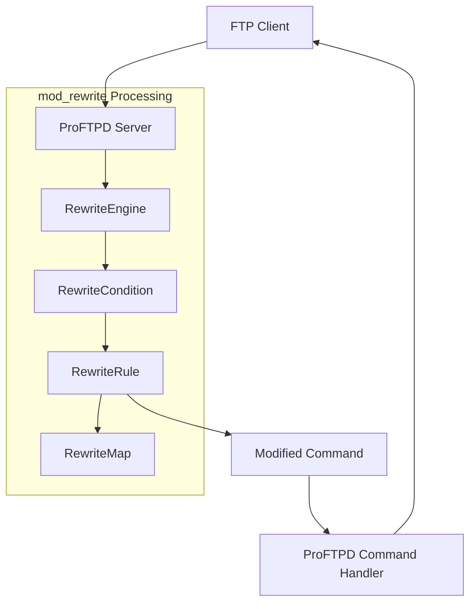
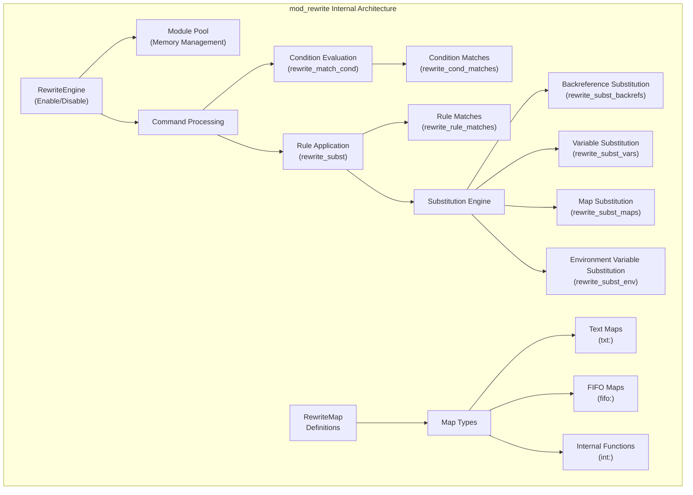
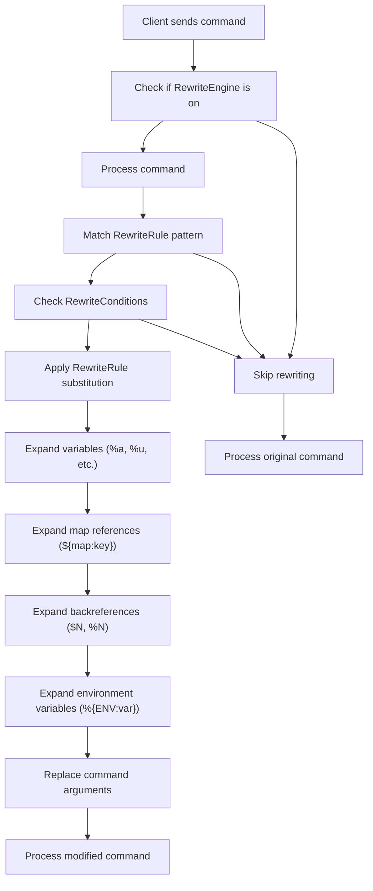

# Command Rewriting

> **Relevant source files**
> * [contrib/mod_radius.c](https://github.com/proftpd/proftpd/blob/362466f3/contrib/mod_radius.c)
> * [contrib/mod_rewrite.c](https://github.com/proftpd/proftpd/blob/362466f3/contrib/mod_rewrite.c)
> * [doc/contrib/mod_rewrite.html](https://github.com/proftpd/proftpd/blob/362466f3/doc/contrib/mod_rewrite.html)
> * [tests/t/etc/modules/mod_rewrite/reverse.pl](https://github.com/proftpd/proftpd/blob/362466f3/tests/t/etc/modules/mod_rewrite/reverse.pl)
> * [tests/t/lib/ProFTPD/Tests/Modules/mod_rewrite.pm](https://github.com/proftpd/proftpd/blob/362466f3/tests/t/lib/ProFTPD/Tests/Modules/mod_rewrite.pm)
> * [tests/t/modules/mod_rewrite.t](https://github.com/proftpd/proftpd/blob/362466f3/tests/t/modules/mod_rewrite.t)

Command rewriting in ProFTPD provides a mechanism to dynamically modify FTP commands before they are processed by the server. This functionality is implemented through the `mod_rewrite` module, which intercepts client commands and can transform them based on configurable conditions and rules.

## Overview

The command rewriting system in ProFTPD is conceptually inspired by Apache's mod_rewrite module. It allows server administrators to modify command parameters dynamically, implement virtual file structures, enforce naming conventions, and apply complex access control based on various factors.



Sources: [contrib/mod_rewrite.c L38-L173](https://github.com/proftpd/proftpd/blob/362466f3/contrib/mod_rewrite.c#L38-L173)

## Rewrite Module Architecture

The rewriting system is implemented as a ProFTPD module (`mod_rewrite`), which hooks into the command processing pipeline. The module operates by intercepting FTP commands before they're processed by their respective handlers, applying conditional tests, and potentially modifying the command arguments.



Sources: [contrib/mod_rewrite.c L95-L112](https://github.com/proftpd/proftpd/blob/362466f3/contrib/mod_rewrite.c#L95-L112)

 [contrib/mod_rewrite.c L910-L969](https://github.com/proftpd/proftpd/blob/362466f3/contrib/mod_rewrite.c#L910-L969)

## Core Directives

The command rewriting system is configured through several directives that control various aspects of the rewriting process.

### RewriteEngine

This directive enables or disables the rewriting engine. When set to "off," no rewriting takes place, regardless of other configured directives.

```
RewriteEngine on|off
```

Sources: [contrib/mod_rewrite.c L98](https://github.com/proftpd/proftpd/blob/362466f3/contrib/mod_rewrite.c#L98-L98)

 [doc/contrib/mod_rewrite.html L309-L321](https://github.com/proftpd/proftpd/blob/362466f3/doc/contrib/mod_rewrite.html#L309-L321)

### RewriteCondition

RewriteCondition directives define tests that must be satisfied before a RewriteRule is applied. Multiple conditions can be specified for a single rule, and by default are combined with logical AND (all must match).

```
RewriteCondition condition pattern [flags]
```

Where:

* `condition`: String to test, can contain variables, backreferences
* `pattern`: Regular expression or special test
* `flags`: Optional modifiers like `nocase` (NC) or `ornext` (OR)

Sources: [contrib/mod_rewrite.c L44-L62](https://github.com/proftpd/proftpd/blob/362466f3/contrib/mod_rewrite.c#L44-L62)

 [contrib/mod_rewrite.c L453-L486](https://github.com/proftpd/proftpd/blob/362466f3/contrib/mod_rewrite.c#L453-L486)

 [doc/contrib/mod_rewrite.html L44-L306](https://github.com/proftpd/proftpd/blob/362466f3/doc/contrib/mod_rewrite.html#L44-L306)

### RewriteRule

RewriteRule directives define patterns to match in command arguments and specify substitutions to apply when matches occur.

```
RewriteRule pattern substitution [flags]
```

Where:

* `pattern`: Regular expression to match command arguments
* `substitution`: Replacement string, can contain backreferences, variables
* `flags`: Optional modifiers like `nocase` (NC) or `last` (L)

Sources: [contrib/mod_rewrite.c L68-L71](https://github.com/proftpd/proftpd/blob/362466f3/contrib/mod_rewrite.c#L68-L71)

 [contrib/mod_rewrite.c L488-L521](https://github.com/proftpd/proftpd/blob/362466f3/contrib/mod_rewrite.c#L488-L521)

 [doc/contrib/mod_rewrite.html L690-L826](https://github.com/proftpd/proftpd/blob/362466f3/doc/contrib/mod_rewrite.html#L690-L826)

### RewriteMap

RewriteMap directives define lookup maps that can be used in substitution strings.

```
RewriteMap map-name map-type:map-source
```

Where:

* `map-name`: Identifier for the map
* `map-type`: Type of map (txt, fifo, int)
* `map-source`: Source of the map (file path, FIFO path, function name)

Sources: [contrib/mod_rewrite.c L72-L93](https://github.com/proftpd/proftpd/blob/362466f3/contrib/mod_rewrite.c#L72-L93)

 [contrib/mod_rewrite.c L671-L735](https://github.com/proftpd/proftpd/blob/362466f3/contrib/mod_rewrite.c#L671-L735)

 [doc/contrib/mod_rewrite.html L366-L656](https://github.com/proftpd/proftpd/blob/362466f3/doc/contrib/mod_rewrite.html#L366-L656)

### RewriteMaxReplace

Controls the maximum number of replacements that can be performed in a single rewrite operation.

```
RewriteMaxReplace count
```

Sources: [contrib/mod_rewrite.c L109](https://github.com/proftpd/proftpd/blob/362466f3/contrib/mod_rewrite.c#L109-L109)

 [doc/contrib/mod_rewrite.html L666-L686](https://github.com/proftpd/proftpd/blob/362466f3/doc/contrib/mod_rewrite.html#L666-L686)

## Command Rewriting Process

The rewriting process follows a specific flow when a command is received:



Sources: [contrib/mod_rewrite.c L910-L969](https://github.com/proftpd/proftpd/blob/362466f3/contrib/mod_rewrite.c#L910-L969)

 [contrib/mod_rewrite.c L534-L669](https://github.com/proftpd/proftpd/blob/362466f3/contrib/mod_rewrite.c#L534-L669)

## Variable Substitution

The command rewriting system supports various types of variable substitution:

| Variable | Description |
| --- | --- |
| `%a` | Client IP address |
| `%c` | Session class name |
| `%f` | Filename |
| `%F` | Full path |
| `%g` | Primary group of authenticated user |
| `%G` | Supplemental groups of authenticated user |
| `%h` | Client DNS name |
| `%m` | FTP command |
| `%P` | Process ID |
| `%p` | Server port |
| `%U` | Original username (from USER command) |
| `%u` | Resolved/authenticated username |
| `%v` | Server name |
| `%w` | Rename from path (for RNTO command) |
| `%t` | Unix timestamp |
| `%{TIME}` | Timestamp in YYYYMMDDHHmmss format |
| `%{TIME_YEAR}` | Current year (YYYY) |
| `%{TIME_MON}` | Current month (MM) |
| `%{TIME_DAY}` | Current day (DD) |
| `%{TIME_WDAY}` | Day of week (0-6, Sunday is 0) |
| `%{TIME_HOUR}` | Current hour (HH) |
| `%{TIME_MIN}` | Current minute (mm) |
| `%{TIME_SEC}` | Current second (ss) |

Sources: [contrib/mod_rewrite.c L113-L139](https://github.com/proftpd/proftpd/blob/362466f3/contrib/mod_rewrite.c#L113-L139)

 [contrib/mod_rewrite.c L180-L396](https://github.com/proftpd/proftpd/blob/362466f3/contrib/mod_rewrite.c#L180-L396)

 [doc/contrib/mod_rewrite.html L108-L208](https://github.com/proftpd/proftpd/blob/362466f3/doc/contrib/mod_rewrite.html#L108-L208)

## RewriteMap Types

The module supports three types of rewrite maps:

### Text Maps (txt)

Plain text files containing key-value pairs:

```markdown
# Comment line
key1  value1
key2  value2
```

The map is accessed using: `${map-name:lookup-key|default-value}`

Sources: [contrib/mod_rewrite.c L739-L863](https://github.com/proftpd/proftpd/blob/362466f3/contrib/mod_rewrite.c#L739-L863)

 [doc/contrib/mod_rewrite.html L402-L429](https://github.com/proftpd/proftpd/blob/362466f3/doc/contrib/mod_rewrite.html#L402-L429)

### FIFO/Named Pipe Maps (fifo)

Named pipes that communicate with external programs for dynamic lookups:

```
RewriteMap dynamic-map fifo:/path/to/pipe
```

The external program reads keys from the pipe and writes back values.

Sources: [contrib/mod_rewrite.c L149-L173](https://github.com/proftpd/proftpd/blob/362466f3/contrib/mod_rewrite.c#L149-L173)

 [doc/contrib/mod_rewrite.html L431-L605](https://github.com/proftpd/proftpd/blob/362466f3/doc/contrib/mod_rewrite.html#L431-L605)

### Internal Function Maps (int)

Built-in functions for common transformations:

| Function | Description |
| --- | --- |
| `toupper` | Converts text to uppercase |
| `tolower` | Converts text to lowercase |
| `replaceall` | Replaces all occurrences of one string with another |
| `unescape` | Decodes URL-encoded strings |
| `idnatrans` | Translates text to IDNA format |
| `utf8trans` | Translates UTF-8 to Latin-1 |

Sources: [contrib/mod_rewrite.c L607-L649](https://github.com/proftpd/proftpd/blob/362466f3/contrib/mod_rewrite.c#L607-L649)

 [doc/contrib/mod_rewrite.html L608-L649](https://github.com/proftpd/proftpd/blob/362466f3/doc/contrib/mod_rewrite.html#L608-L649)

## Backreferences

The rewriting system supports two types of backreferences:

1. **Rule backreferences** (`$N`): Reference captured groups from the current RewriteRule pattern.
2. **Condition backreferences** (`%N`): Reference captured groups from the most recent matched RewriteCondition pattern.

Backreference `$0` or `%0` represents the entire matched string.

Sources: [contrib/mod_rewrite.c L971-L1025](https://github.com/proftpd/proftpd/blob/362466f3/contrib/mod_rewrite.c#L971-L1025)

 [doc/contrib/mod_rewrite.html L62-L93](https://github.com/proftpd/proftpd/blob/362466f3/doc/contrib/mod_rewrite.html#L62-L93)

## Common Use Cases

### Standardizing File Names (Lowercase)

```
RewriteEngine on
RewriteCondition %m STOR
RewriteMap lowercase int:tolower
RewriteRule ^(.*) ${lowercase:$1}
```

This converts all uploaded file names to lowercase.

### Converting Spaces to Underscores

```
RewriteEngine on
RewriteCondition %m STOR
RewriteMap replace int:replaceall
RewriteRule ^(.*) "${replace:!$1! !_}"
```

This replaces spaces with underscores in uploaded file names.

### Adding Timestamps to Files

```
RewriteEngine on
RewriteCondition %m STOR
RewriteRule ^(.*)\.(.*)$ $1-%{TIME}.$2
```

This adds a timestamp to all uploaded files.

### Directory-based Redirection

```
RewriteEngine on
RewriteCondition %m CWD
RewriteCondition %f ^old-dir$
RewriteRule ^old-dir$ new-dir
```

This redirects CWD commands from "old-dir" to "new-dir".

Sources: [tests/t/lib/ProFTPD/Tests/Modules/mod_rewrite.pm L278-L575](https://github.com/proftpd/proftpd/blob/362466f3/tests/t/lib/ProFTPD/Tests/Modules/mod_rewrite.pm#L278-L575)

 [doc/contrib/mod_rewrite.html L855-L884](https://github.com/proftpd/proftpd/blob/362466f3/doc/contrib/mod_rewrite.html#L855-L884)

## Limitations and Considerations

1. The rewrite module uses POSIX regular expressions, not Perl-compatible (PCRE) expressions.
2. The rewritten command may conflict with other filters (like `AllowFilter`, `DenyFilter`).
3. Some variables are unavailable during certain commands.
4. Performance impact may be significant with complex rewriting rules.
5. Debugging rewrite rules can be challenging; use `RewriteLog` for development but avoid in production.

Sources: [doc/contrib/mod_rewrite.html L831-L854](https://github.com/proftpd/proftpd/blob/362466f3/doc/contrib/mod_rewrite.html#L831-L854)

 [contrib/mod_rewrite.c L296-L325](https://github.com/proftpd/proftpd/blob/362466f3/contrib/mod_rewrite.c#L296-L325)