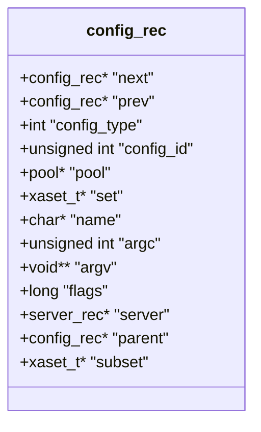
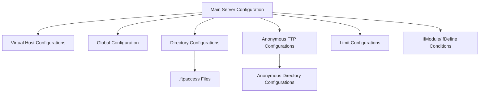
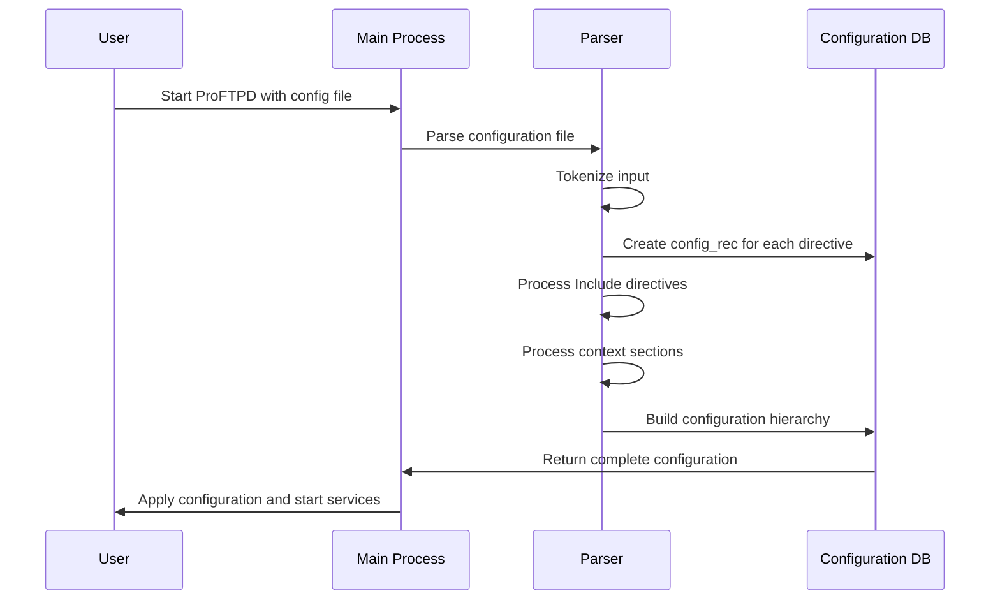

# Configuration System

> **Relevant source files**
> * [doc/modules/mod_auth.html](https://github.com/proftpd/proftpd/blob/362466f3/doc/modules/mod_auth.html)
> * [doc/modules/mod_core.html](https://github.com/proftpd/proftpd/blob/362466f3/doc/modules/mod_core.html)
> * [doc/modules/mod_xfer.html](https://github.com/proftpd/proftpd/blob/362466f3/doc/modules/mod_xfer.html)
> * [include/auth.h](https://github.com/proftpd/proftpd/blob/362466f3/include/auth.h)
> * [include/configdb.h](https://github.com/proftpd/proftpd/blob/362466f3/include/configdb.h)
> * [include/options.h](https://github.com/proftpd/proftpd/blob/362466f3/include/options.h)
> * [include/regexp.h](https://github.com/proftpd/proftpd/blob/362466f3/include/regexp.h)
> * [src/auth.c](https://github.com/proftpd/proftpd/blob/362466f3/src/auth.c)
> * [src/configdb.c](https://github.com/proftpd/proftpd/blob/362466f3/src/configdb.c)
> * [src/regexp.c](https://github.com/proftpd/proftpd/blob/362466f3/src/regexp.c)
> * [tests/api/auth.c](https://github.com/proftpd/proftpd/blob/362466f3/tests/api/auth.c)
> * [tests/api/configdb.c](https://github.com/proftpd/proftpd/blob/362466f3/tests/api/configdb.c)
> * [tests/api/regexp.c](https://github.com/proftpd/proftpd/blob/362466f3/tests/api/regexp.c)
> * [tests/t/config/include.t](https://github.com/proftpd/proftpd/blob/362466f3/tests/t/config/include.t)
> * [tests/t/lib/ProFTPD/Tests/Config/Include.pm](https://github.com/proftpd/proftpd/blob/362466f3/tests/t/lib/ProFTPD/Tests/Config/Include.pm)
> * [tests/t/lib/ProFTPD/Tests/Modules/mod_sftp/rewrite.pm](https://github.com/proftpd/proftpd/blob/362466f3/tests/t/lib/ProFTPD/Tests/Modules/mod_sftp/rewrite.pm)
> * [tests/t/modules/mod_sftp/rewrite.t](https://github.com/proftpd/proftpd/blob/362466f3/tests/t/modules/mod_sftp/rewrite.t)

The Configuration System in ProFTPD provides a flexible framework for defining server behavior through hierarchical configuration directives. This system handles reading, parsing, storing, and retrieving configuration from `proftpd.conf` and related files, supporting both runtime and programmatic access to configuration data.

## Configuration Data Structures

At the heart of ProFTPD's configuration system is the `config_rec` structure, which represents a single configuration directive:



The key fields in this structure are:

* `name`: The name of the configuration directive
* `argc` and `argv`: The number and values of the directive's arguments
* `config_type`: The type of configuration context (server, directory, etc.)
* `parent` and `subset`: Pointers for maintaining the configuration hierarchy
* `server`: The server to which this configuration belongs

Sources: [include/configdb.h L37-L54](https://github.com/proftpd/proftpd/blob/362466f3/include/configdb.h#L37-L54)

 [src/configdb.c L50-L66](https://github.com/proftpd/proftpd/blob/362466f3/src/configdb.c#L50-L66)

### Configuration Types

The configuration system supports various configuration contexts through the `config_type` field:

| Type Constant | Value | Description |
| --- | --- | --- |
| CONF_ROOT | 1<<0 | Root-level configuration |
| CONF_DIR | 1<<1 | Directory-specific configuration |
| CONF_ANON | 1<<2 | Anonymous FTP configuration |
| CONF_LIMIT | 1<<3 | Command limitation configuration |
| CONF_VIRTUAL | 1<<4 | Virtual host configuration |
| CONF_DYNDIR | 1<<5 | Dynamic directory (.ftpaccess) configuration |
| CONF_GLOBAL | 1<<6 | Global configuration (applies to main server and all virtual hosts) |
| CONF_CLASS | 1<<7 | Connection class configuration |
| CONF_NAMED | 1<<8 | Named virtual host |
| CONF_USERDATA | 1<<14 | Runtime user data |
| CONF_PARAM | 1<<15 | Parameter configuration (config/args pair) |

Sources: [include/configdb.h L56-L66](https://github.com/proftpd/proftpd/blob/362466f3/include/configdb.h#L56-L66)

 [src/configdb.c L246-L295](https://github.com/proftpd/proftpd/blob/362466f3/src/configdb.c#L246-L295)

## Configuration Hierarchy

ProFTPD's configuration follows a hierarchical structure with various layers, allowing for flexible and specific configuration:



This hierarchy allows directives to be applied at different levels of specificity. More specific contexts (like a directory) override more general ones (like the server root).

Sources: [src/configdb.c L142-L190](https://github.com/proftpd/proftpd/blob/362466f3/src/configdb.c#L142-L190)

 [doc/modules/mod_core.html L427-L506](https://github.com/proftpd/proftpd/blob/362466f3/doc/modules/mod_core.html#L427-L506)

## Configuration Processing Flow

The configuration system processes configuration files in a specific sequence:



Sources: [src/configdb.c L50-L190](https://github.com/proftpd/proftpd/blob/362466f3/src/configdb.c#L50-L190)

 [tests/api/configdb.c L126-L180](https://github.com/proftpd/proftpd/blob/362466f3/tests/api/configdb.c#L126-L180)

## Configuration Contexts

ProFTPD's configuration system supports several contexts that define where and how directives apply:

### Main Server Context

The default context for directives in the main configuration file.

### Virtual Host Context

```xml
<VirtualHost IP_address[:port]>
    # Virtual host-specific directives
</VirtualHost>
```

The `<VirtualHost>` context allows creating virtual FTP servers with different configurations on the same physical server.

Sources: [doc/modules/mod_core.html L664-L699](https://github.com/proftpd/proftpd/blob/362466f3/doc/modules/mod_core.html#L664-L699)

### Global Context

```xml
<Global>
    # Directives that apply to main server and all virtual hosts
</Global>
```

The `<Global>` context is used for directives that should apply to both the main server and all virtual hosts.

Sources: [doc/modules/mod_core.html L46-L48](https://github.com/proftpd/proftpd/blob/362466f3/doc/modules/mod_core.html#L46-L48)

### Directory Context

```xml
<Directory path>
    # Directory-specific directives
</Directory>
```

The `<Directory>` context allows specifying directives that only apply to a specific directory.

Sources: [doc/modules/mod_core.html L42-L44](https://github.com/proftpd/proftpd/blob/362466f3/doc/modules/mod_core.html#L42-L44)

### Anonymous Context

```xml
<Anonymous path>
    # Anonymous FTP configuration
</Anonymous>
```

The `<Anonymous>` context is used for configuring anonymous FTP access.

Sources: [doc/modules/mod_core.html L427-L506](https://github.com/proftpd/proftpd/blob/362466f3/doc/modules/mod_core.html#L427-L506)

### Limit Context

```xml
<Limit command [command ...]>
    # Limit access to specified commands
</Limit>
```

The `<Limit>` context is used to limit access to specific FTP commands.

Sources: [doc/modules/mod_core.html L60-L62](https://github.com/proftpd/proftpd/blob/362466f3/doc/modules/mod_core.html#L60-L62)

### Conditional Contexts

```xml
<IfModule mod_name.c>
    # Directives only processed if specified module is loaded
</IfModule>

<IfDefine label>
    # Directives only processed if label is defined
</IfDefine>
```

These contexts allow for conditional configuration based on the availability of modules or the definition of labels.

Sources: [doc/modules/mod_core.html L56-L58](https://github.com/proftpd/proftpd/blob/362466f3/doc/modules/mod_core.html#L56-L58)

 [doc/modules/mod_core.html L694-L720](https://github.com/proftpd/proftpd/blob/362466f3/doc/modules/mod_core.html#L694-L720)

## Include Directive

The `Include` directive allows incorporating additional configuration files into the main configuration:

```
Include /path/to/additional/config.conf
Include /path/to/conf.d/*.conf
```

Key features:

* Support for absolute and relative paths
* Wildcard pattern support for including multiple files
* Can be used in any configuration context
* Included files are processed as if their contents were at the point of inclusion

Sources: [doc/modules/mod_core.html L58-L60](https://github.com/proftpd/proftpd/blob/362466f3/doc/modules/mod_core.html#L58-L60)

 [tests/t/lib/ProFTPD/Tests/Config/Include.pm L64-L144](https://github.com/proftpd/proftpd/blob/362466f3/tests/t/lib/ProFTPD/Tests/Config/Include.pm#L64-L144)

## Configuration API

The configuration system provides a comprehensive API for manipulating configuration records programmatically:

### Core Functions

| Function | Description |
| --- | --- |
| `pr_config_alloc()` | Allocates a new configuration record |
| `pr_config_add()` | Adds a configuration record to a server |
| `pr_config_add_set()` | Adds a configuration record to a specific set |
| `find_config()` | Finds a configuration record by name |
| `find_config_next()` | Finds the next configuration record in a sequence |
| `pr_config_get_id()` | Gets a unique ID for a configuration directive |
| `pr_config_dump()` | Dumps the configuration for debugging |

Sources: [src/configdb.c L50-L66](https://github.com/proftpd/proftpd/blob/362466f3/src/configdb.c#L50-L66)

 [src/configdb.c L70-L136](https://github.com/proftpd/proftpd/blob/362466f3/src/configdb.c#L70-L136)

 [src/configdb.c L145-L190](https://github.com/proftpd/proftpd/blob/362466f3/src/configdb.c#L145-L190)

 [src/configdb.c L209-L243](https://github.com/proftpd/proftpd/blob/362466f3/src/configdb.c#L209-L243)

### Adding Configuration

Example of adding a configuration record:

```sql
// Create a new configuration record
config_rec *c = pr_config_add(server, "MyDirective", 0);

// Set arguments on the configuration record
c->argc = 2;
c->argv = pcalloc(c->pool, sizeof(void *) * 3);
c->argv[0] = pstrdup(c->pool, "arg1");
c->argv[1] = pstrdup(c->pool, "arg2");
c->argv[2] = NULL;
```

Sources: [src/configdb.c L70-L102](https://github.com/proftpd/proftpd/blob/362466f3/src/configdb.c#L70-L102)

 [src/configdb.c L145-L190](https://github.com/proftpd/proftpd/blob/362466f3/src/configdb.c#L145-L190)

 [tests/api/configdb.c L126-L148](https://github.com/proftpd/proftpd/blob/362466f3/tests/api/configdb.c#L126-L148)

### Finding Configuration

Configuration lookup functions allow retrieving configuration values:

```
// Find a configuration record
config_rec *found = find_config(server->conf, CONF_PARAM, "MyDirective", FALSE);

// Access the value
if (found != NULL && found->argc > 0) {
    char *value = found->argv[0];
    // Use value...
}
```

Sources: [tests/api/configdb.c L364-L422](https://github.com/proftpd/proftpd/blob/362466f3/tests/api/configdb.c#L364-L422)

## Configuration Flags

Configuration records can have various flags that affect their behavior:

| Flag Constant | Value | Description |
| --- | --- | --- |
| CF_MERGEDOWN | 1<<0 | Merge option down to child configs |
| CF_MERGEDOWN_MULTI | 1<<1 | Merge down, allowing multiple instances |
| CF_DYNAMIC | 1<<2 | Dynamically added entry |
| CF_DEFER | 1<<3 | Defer hashing until authentication |
| CF_SILENT | 1<<4 | Do not print a config dump when merging |
| CF_MULTI | 1<<5 | Allow multiple instances, but do not merge down |

Sources: [include/configdb.h L68-L75](https://github.com/proftpd/proftpd/blob/362466f3/include/configdb.h#L68-L75)

## Authentication Order Configuration

The `AuthOrder` directive configures which authentication modules are used and in what order. This is a key part of the configuration system that controls user authentication:

```
AuthOrder mod_auth_file.c mod_auth_unix.c
```

AuthOrder can specify one or more authentication modules. Making a module "authoritative" (by adding an asterisk after its name) ensures that the authentication process stops if that module fails:

```
AuthOrder mod_auth_pam.c* mod_auth_unix.c
```

Sources: [doc/modules/mod_core.html L510-L555](https://github.com/proftpd/proftpd/blob/362466f3/doc/modules/mod_core.html#L510-L555)

 [src/auth.c L343-L474](https://github.com/proftpd/proftpd/blob/362466f3/src/auth.c#L343-L474)

## Configuration Tuning Parameters

The configuration system includes several tunable parameters that control behavior:

| Parameter | Default Value | Description |
| --- | --- | --- |
| PR_TUNABLE_PARSER_BUFFER_SIZE | 4096 | Buffer size for parsing configuration lines |
| PR_TUNABLE_PATH_MAX | Platform MAXPATHLEN or 1024 | Maximum path length |
| PR_TUNABLE_DEFAULT_RCVBUFSZ | 65536 | Default TCP receive buffer size |
| PR_TUNABLE_DEFAULT_SNDBUFSZ | 65536 | Default TCP send buffer size |

Sources: [include/options.h L93-L95](https://github.com/proftpd/proftpd/blob/362466f3/include/options.h#L93-L95)

 [include/options.h L123-L129](https://github.com/proftpd/proftpd/blob/362466f3/include/options.h#L123-L129)

 [include/options.h L72-L78](https://github.com/proftpd/proftpd/blob/362466f3/include/options.h#L72-L78)

## Regular Expression Support

The configuration system includes support for regular expressions in directives like `AllowFilter`, `DenyFilter`, etc. This is handled by the regexp API that provides an abstraction over POSIX and PCRE regular expressions:

```
AllowFilter "^[a-zA-Z0-9 ,]*$"
DenyFilter "\.\./"
```

Sources: [doc/modules/mod_core.html L233-L277](https://github.com/proftpd/proftpd/blob/362466f3/doc/modules/mod_core.html#L233-L277)

 [src/regexp.c L27-L108](https://github.com/proftpd/proftpd/blob/362466f3/src/regexp.c#L27-L108)

 [src/regexp.c L324-L356](https://github.com/proftpd/proftpd/blob/362466f3/src/regexp.c#L324-L356)

## Conclusion

ProFTPD's Configuration System provides a powerful framework for configuring the server through a hierarchical structure of directives. Its support for various contexts, include files, conditional processing, and programmatic access makes it adaptable to a wide range of hosting scenarios, from simple single-server setups to complex multi-virtual-host environments.

Understanding the configuration system is essential for both server administrators who need to write and maintain configuration files, and for developers who wish to extend ProFTPD with new modules that integrate with the existing configuration framework.