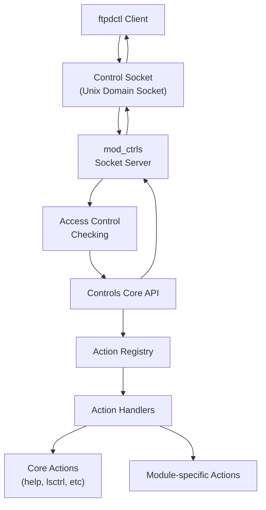
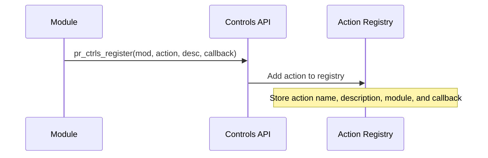
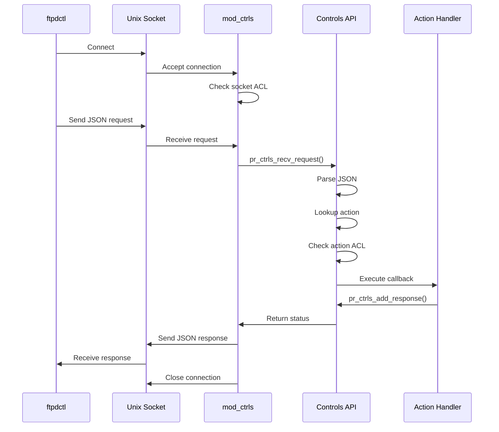
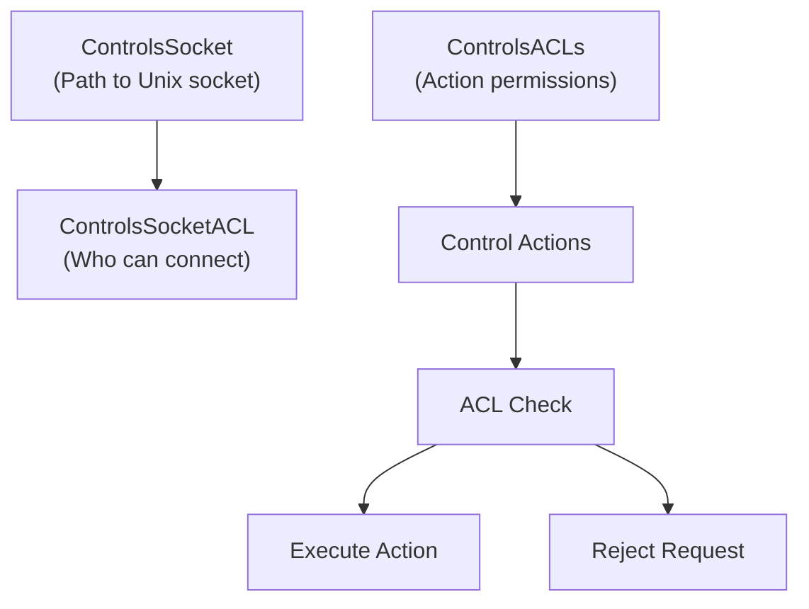
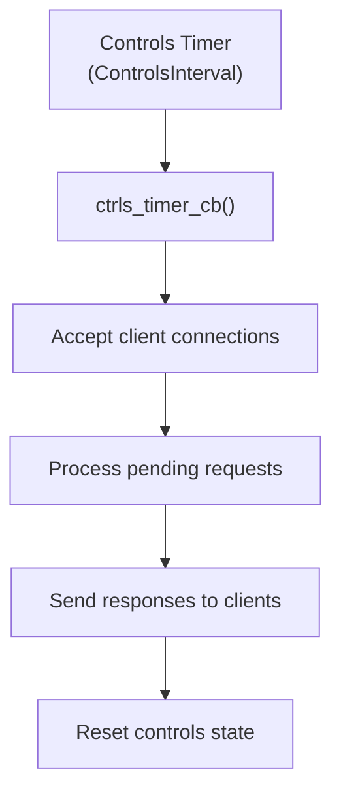

# Controls API

> **Relevant source files**
> * [contrib/mod_ctrls_admin.c](https://github.com/proftpd/proftpd/blob/362466f3/contrib/mod_ctrls_admin.c)
> * [doc/modules/mod_delay.html](https://github.com/proftpd/proftpd/blob/362466f3/doc/modules/mod_delay.html)
> * [include/compat.h](https://github.com/proftpd/proftpd/blob/362466f3/include/compat.h)
> * [include/ctrls.h](https://github.com/proftpd/proftpd/blob/362466f3/include/ctrls.h)
> * [include/mod_ctrls.h](https://github.com/proftpd/proftpd/blob/362466f3/include/mod_ctrls.h)
> * [modules/mod_ctrls.c](https://github.com/proftpd/proftpd/blob/362466f3/modules/mod_ctrls.c)
> * [modules/mod_delay.c](https://github.com/proftpd/proftpd/blob/362466f3/modules/mod_delay.c)
> * [modules/mod_dso.c](https://github.com/proftpd/proftpd/blob/362466f3/modules/mod_dso.c)
> * [src/ctrls.c](https://github.com/proftpd/proftpd/blob/362466f3/src/ctrls.c)
> * [src/ftpdctl.c](https://github.com/proftpd/proftpd/blob/362466f3/src/ftpdctl.c)
> * [tests/api/ctrls.c](https://github.com/proftpd/proftpd/blob/362466f3/tests/api/ctrls.c)
> * [tests/t/lib/ProFTPD/Tests/Modules/mod_ctrls.pm](https://github.com/proftpd/proftpd/blob/362466f3/tests/t/lib/ProFTPD/Tests/Modules/mod_ctrls.pm)
> * [tests/t/lib/ProFTPD/Tests/Modules/mod_delay.pm](https://github.com/proftpd/proftpd/blob/362466f3/tests/t/lib/ProFTPD/Tests/Modules/mod_delay.pm)
> * [tests/t/modules/mod_ctrls.t](https://github.com/proftpd/proftpd/blob/362466f3/tests/t/modules/mod_ctrls.t)
> * [tests/t/modules/mod_delay.t](https://github.com/proftpd/proftpd/blob/362466f3/tests/t/modules/mod_delay.t)

The Controls API provides a mechanism for runtime administration and monitoring of the ProFTPD server through a local Unix domain socket. This allows administrators to query status information, modify configurations, manage modules, and perform other administrative tasks without restarting the server. The Controls API serves as the foundation for remote management tools like `ftpdctl` and enables modules to expose control interfaces.

For information about configuring the Controls system in ProFTPD, see the Configuration System section (#5).

## Architecture Overview

The Controls API consists of several components that work together to provide a flexible management interface:



The Controls system operates on a client-server model:

1. **Client**: Usually the `ftpdctl` utility that sends control requests
2. **Server**: The ProFTPD daemon listening on a Unix domain socket
3. **Action Handlers**: Callback functions registered by various modules

Sources: [src/ctrls.c L85-L109](https://github.com/proftpd/proftpd/blob/362466f3/src/ctrls.c#L85-L109)

 [src/ftpdctl.c L219-L367](https://github.com/proftpd/proftpd/blob/362466f3/src/ftpdctl.c#L219-L367)

 [modules/mod_ctrls.c L457-L597](https://github.com/proftpd/proftpd/blob/362466f3/modules/mod_ctrls.c#L457-L597)

## Core Components

### Control Objects

The Controls API uses two primary data structures:

```

```

1. **`pr_ctrls_t`**: Represents a control action with its callback function, arguments, and responses
2. **`pr_ctrls_cl_t`**: Represents a client connection with associated credentials and requested controls

The API provides functions for allocating, preparing, and freeing these objects:

* `pr_ctrls_alloc()`: Allocates a new control object
* `pr_ctrls_free()`: Releases a control object

Sources: [include/ctrls.h L46-L124](https://github.com/proftpd/proftpd/blob/362466f3/include/ctrls.h#L46-L124)

 [src/ctrls.c L87-L197](https://github.com/proftpd/proftpd/blob/362466f3/src/ctrls.c#L87-L197)

### Action Registry

Modules register their control actions with the Controls API during initialization. The registry maintains a list of available actions and their associated handlers.



The main registration function is `pr_ctrls_register()`, which takes:

* The module registering the action
* The action name
* A description of the action
* A callback function to handle the action

Sources: [src/ctrls.c L199-L258](https://github.com/proftpd/proftpd/blob/362466f3/src/ctrls.c#L199-L258)

## Communication Protocol

The Controls API uses a JSON-based protocol for communication between clients and the server:

### Request Format

```
{
  "action": "action_name",
  "args": ["arg1", "arg2", ...]
}
```

### Response Format

```
{
  "status": status_code,
  "responses": ["response1", "response2", ...]
}
```

The status code indicates the success or failure of the operation:

| Status Code | Meaning |
| --- | --- |
| 0 | Success |
| -1 | Generic error |
| -2 | Access denied |
| -3 | Wrong parameters |
| -4 | Subject not found |
| -5 | Operation denied |
| -6 | Operation ignored |
| -7 | Unsupported operation |
| -8 | Internal error |

Sources: [src/ctrls.c L462-L583](https://github.com/proftpd/proftpd/blob/362466f3/src/ctrls.c#L462-L583)

 [src/ctrls.c L803-L877](https://github.com/proftpd/proftpd/blob/362466f3/src/ctrls.c#L803-L877)

 [include/ctrls.h L141-L153](https://github.com/proftpd/proftpd/blob/362466f3/include/ctrls.h#L141-L153)

## Request-Response Flow

When a control request is received, it goes through several processing steps:



This flow is managed by functions like:

* `pr_ctrls_recv_request()`: Parses requests from clients
* `pr_ctrls_send_response()`: Formats and sends responses to clients
* `pr_ctrls_add_response()`: Adds response messages to be sent back

Sources: [src/ctrls.c L585-L802](https://github.com/proftpd/proftpd/blob/362466f3/src/ctrls.c#L585-L802)

 [modules/mod_ctrls.c L249-L332](https://github.com/proftpd/proftpd/blob/362466f3/modules/mod_ctrls.c#L249-L332)

 [modules/mod_ctrls.c L337-L455](https://github.com/proftpd/proftpd/blob/362466f3/modules/mod_ctrls.c#L337-L455)

## Security and ACLs

The Controls API includes a comprehensive Access Control List (ACL) system to restrict access to both the control socket and individual actions:



There are two types of ACLs:

1. **Socket ACLs**: Control who can connect to the control socket
2. **Action ACLs**: Control who can execute specific actions

ACLs can allow or deny access based on:

* User IDs
* Group IDs

Sources: [modules/mod_ctrls.c L977-L1012](https://github.com/proftpd/proftpd/blob/362466f3/modules/mod_ctrls.c#L977-L1012)

 [include/mod_ctrls.h L37-L55](https://github.com/proftpd/proftpd/blob/362466f3/include/mod_ctrls.h#L37-L55)

 [include/mod_ctrls.h L76-L105](https://github.com/proftpd/proftpd/blob/362466f3/include/mod_ctrls.h#L76-L105)

## Standard Control Actions

The Core Controls API provides several built-in actions:

| Action | Description | Module |
| --- | --- | --- |
| help | Display available actions and descriptions | mod_ctrls |
| lsctrl | List enabled control actions | mod_ctrls |
| insctrl | Enable a disabled control | mod_ctrls |
| rmctrl | Disable a control | mod_ctrls |

Other modules extend this with additional actions:

| Action | Description | Module |
| --- | --- | --- |
| debug | Set debug level or dump memory info | mod_ctrls_admin |
| dns | Configure DNS settings | mod_ctrls_admin |
| down | Disable virtual servers | mod_ctrls_admin |
| restart | Restart the server | mod_ctrls_admin |
| shutdown | Shutdown the server | mod_ctrls_admin |
| status | Display server status | mod_ctrls_admin |
| up | Enable virtual servers | mod_ctrls_admin |
| delay info | Display delay table information | mod_delay |
| delay reset | Reset delay table | mod_delay |
| insmod | Load a module | mod_dso |
| lsmod | List loaded modules | mod_dso |
| rmmod | Unload a module | mod_dso |

Sources: [modules/mod_ctrls.c L796-L971](https://github.com/proftpd/proftpd/blob/362466f3/modules/mod_ctrls.c#L796-L971)

 [modules/mod_delay.c L1297-L1341](https://github.com/proftpd/proftpd/blob/362466f3/modules/mod_delay.c#L1297-L1341)

 [modules/mod_dso.c L362-L494](https://github.com/proftpd/proftpd/blob/362466f3/modules/mod_dso.c#L362-L494)

 [contrib/mod_ctrls_admin.c L389-L607](https://github.com/proftpd/proftpd/blob/362466f3/contrib/mod_ctrls_admin.c#L389-L607)

## Configuration Directives

The Controls system is configured using these directives:

| Directive | Description | Default |
| --- | --- | --- |
| ControlsEngine | Enable/disable the controls system | on |
| ControlsSocket | Path to Unix domain socket | /var/run/proftpd.sock |
| ControlsACLs | ACLs for control actions | deny all |
| ControlsSocketACL | ACL for socket access | deny all |
| ControlsInterval | Polling interval (seconds) | 10 |
| ControlsAuthFreshness | Max age of client credentials (seconds) | 10 |

Example configuration:

```xml
<IfModule mod_ctrls.c>
  ControlsEngine on
  ControlsSocket /var/run/proftpd.sock
  ControlsSocketACL allow user root
  ControlsACLs all allow user root
  ControlsInterval 5
</IfModule>
```

Sources: [modules/mod_ctrls.c L1026-L1146](https://github.com/proftpd/proftpd/blob/362466f3/modules/mod_ctrls.c#L1026-L1146)

## Using the Controls API

### Command-line Client (ftpdctl)

The `ftpdctl` utility is the primary client for interacting with the Controls system:

```
ftpdctl [options] action [arguments...]
```

Options:

* `-s path`: Specify an alternate socket path
* `-h`: Display help
* `-v`: Verbose output

Example usage:

```markdown
ftpdctl lsctrl                 # List available controls
ftpdctl debug level 2          # Set debug level to 2
ftpdctl delay info             # Show delay table information
ftpdctl -s /tmp/proftpd.sock status  # Use a different socket
```

Sources: [src/ftpdctl.c L210-L217](https://github.com/proftpd/proftpd/blob/362466f3/src/ftpdctl.c#L210-L217)

 [src/ftpdctl.c L220-L366](https://github.com/proftpd/proftpd/blob/362466f3/src/ftpdctl.c#L220-L366)

### Extending the Controls API

Modules can register their own control actions:

```
static int my_handler(pr_ctrls_t *ctrl, int argc, char **argv) {
  /* Process arguments */
  
  /* Add responses */
  pr_ctrls_add_response(ctrl, "Operation completed successfully");
  
  return PR_CTRLS_STATUS_OK;
}

/* During module initialization */
pr_ctrls_register(module, "myaction", "Description", my_handler);
```

Control handlers should:

1. Check arguments for validity
2. Perform the requested operation
3. Add response messages using `pr_ctrls_add_response()`
4. Return an appropriate status code

Sources: [src/ctrls.c L199-L258](https://github.com/proftpd/proftpd/blob/362466f3/src/ctrls.c#L199-L258)

 [src/ctrls.c L398-L434](https://github.com/proftpd/proftpd/blob/362466f3/src/ctrls.c#L398-L434)

## Timer Mechanism

The Controls system uses a timer to periodically check for client connections and process pending requests/responses:



The timer interval is configurable with the `ControlsInterval` directive.

Sources: [modules/mod_ctrls.c L741-L787](https://github.com/proftpd/proftpd/blob/362466f3/modules/mod_ctrls.c#L741-L787)

 [modules/mod_ctrls.c L599-L705](https://github.com/proftpd/proftpd/blob/362466f3/modules/mod_ctrls.c#L599-L705)

## Related Systems

The Controls API is used by several key subsystems in ProFTPD:

1. **Module Management**: Loading/unloading modules at runtime via mod_dso
2. **Server Management**: Restarting, shutting down, or reconfiguring the server
3. **Delay System**: Managing the anti-timing attack mechanisms
4. **Status Reporting**: Getting runtime statistics and server status

These systems leverage the Controls API to provide administrative interfaces without requiring server restarts.

Sources: [modules/mod_delay.c L1297-L1341](https://github.com/proftpd/proftpd/blob/362466f3/modules/mod_delay.c#L1297-L1341)

 [modules/mod_dso.c L362-L494](https://github.com/proftpd/proftpd/blob/362466f3/modules/mod_dso.c#L362-L494)

 [contrib/mod_ctrls_admin.c L389-L607](https://github.com/proftpd/proftpd/blob/362466f3/contrib/mod_ctrls_admin.c#L389-L607)