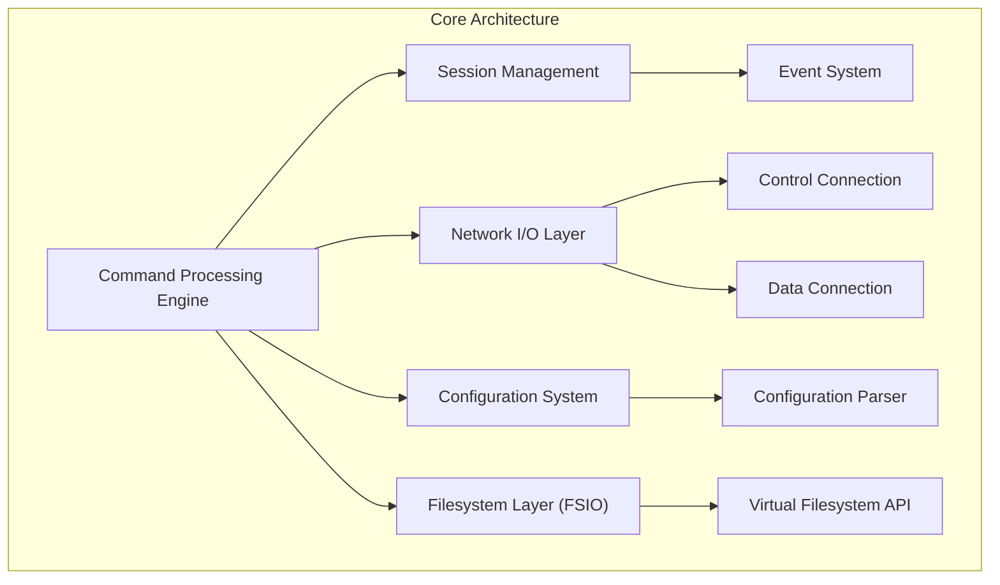
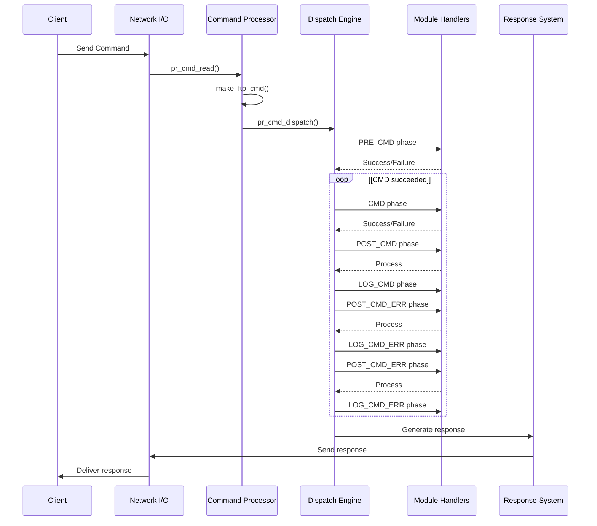
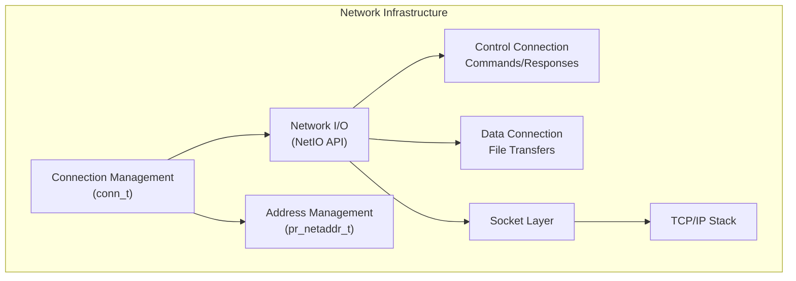
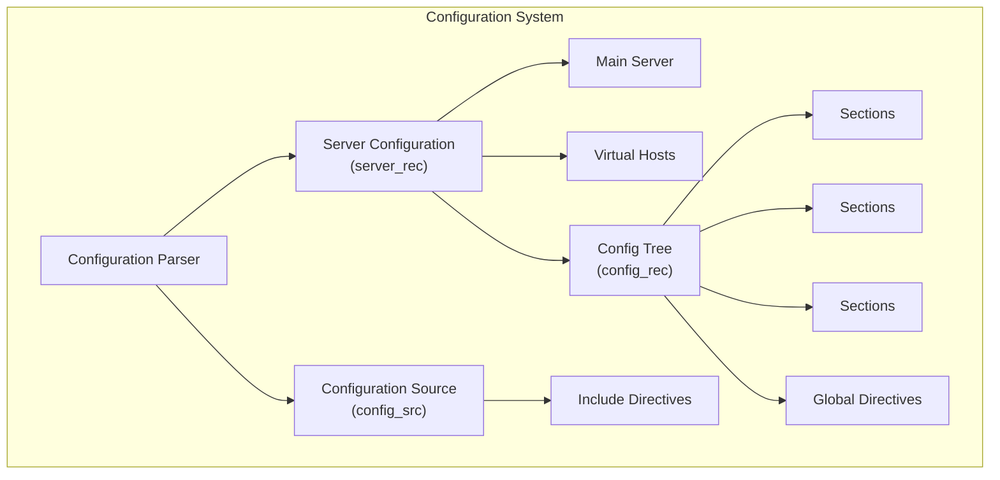
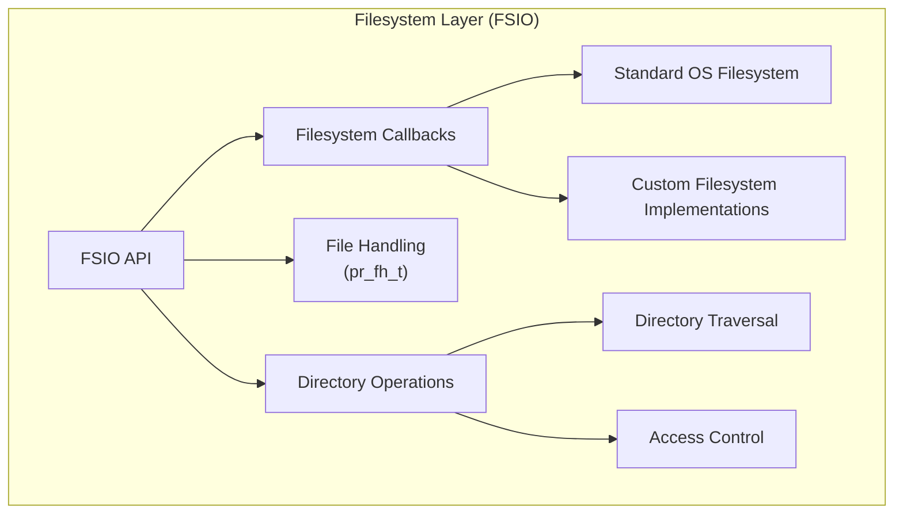
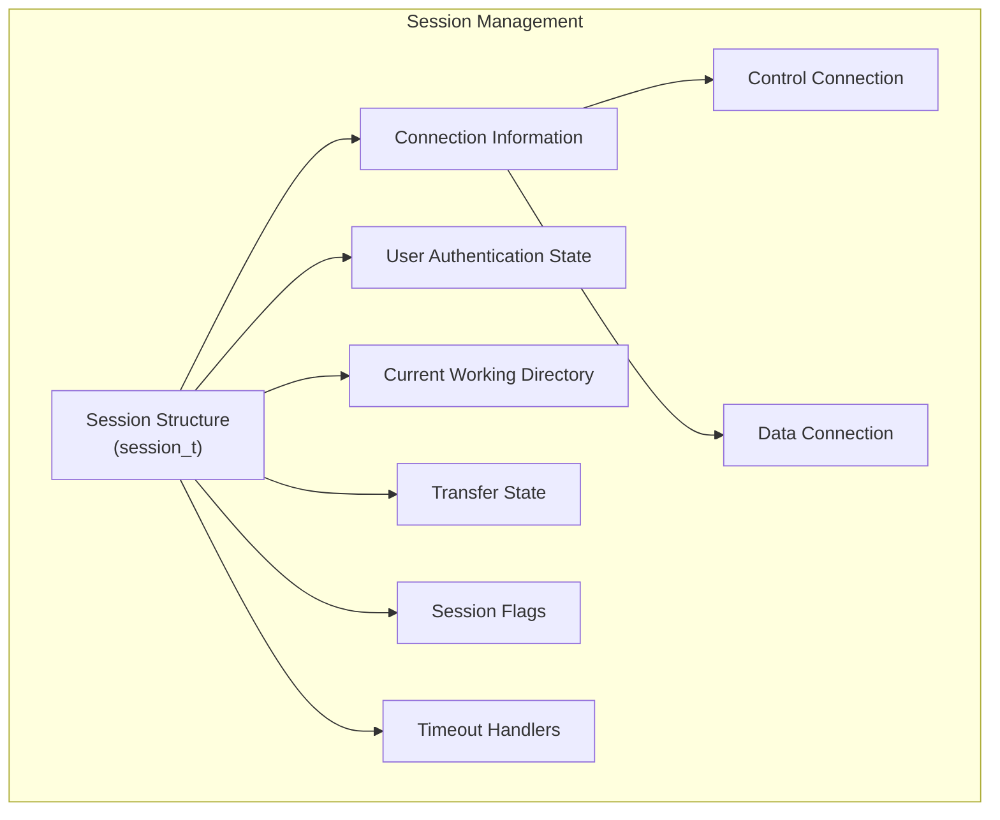

# Core Architecture

> **Relevant source files**
> * [NEWS](https://github.com/proftpd/proftpd/blob/362466f3/NEWS)
> * [include/dirtree.h](https://github.com/proftpd/proftpd/blob/362466f3/include/dirtree.h)
> * [include/inet.h](https://github.com/proftpd/proftpd/blob/362466f3/include/inet.h)
> * [include/netio.h](https://github.com/proftpd/proftpd/blob/362466f3/include/netio.h)
> * [include/parser.h](https://github.com/proftpd/proftpd/blob/362466f3/include/parser.h)
> * [include/proftpd.h](https://github.com/proftpd/proftpd/blob/362466f3/include/proftpd.h)
> * [include/support.h](https://github.com/proftpd/proftpd/blob/362466f3/include/support.h)
> * [modules/mod_auth.c](https://github.com/proftpd/proftpd/blob/362466f3/modules/mod_auth.c)
> * [modules/mod_core.c](https://github.com/proftpd/proftpd/blob/362466f3/modules/mod_core.c)
> * [modules/mod_ls.c](https://github.com/proftpd/proftpd/blob/362466f3/modules/mod_ls.c)
> * [modules/mod_site.c](https://github.com/proftpd/proftpd/blob/362466f3/modules/mod_site.c)
> * [modules/mod_xfer.c](https://github.com/proftpd/proftpd/blob/362466f3/modules/mod_xfer.c)
> * [src/data.c](https://github.com/proftpd/proftpd/blob/362466f3/src/data.c)
> * [src/dirtree.c](https://github.com/proftpd/proftpd/blob/362466f3/src/dirtree.c)
> * [src/inet.c](https://github.com/proftpd/proftpd/blob/362466f3/src/inet.c)
> * [src/main.c](https://github.com/proftpd/proftpd/blob/362466f3/src/main.c)
> * [src/netio.c](https://github.com/proftpd/proftpd/blob/362466f3/src/netio.c)
> * [src/parser.c](https://github.com/proftpd/proftpd/blob/362466f3/src/parser.c)
> * [src/support.c](https://github.com/proftpd/proftpd/blob/362466f3/src/support.c)
> * [tests/api/filter.c](https://github.com/proftpd/proftpd/blob/362466f3/tests/api/filter.c)
> * [tests/api/inet.c](https://github.com/proftpd/proftpd/blob/362466f3/tests/api/inet.c)
> * [tests/api/misc.c](https://github.com/proftpd/proftpd/blob/362466f3/tests/api/misc.c)
> * [tests/api/netio.c](https://github.com/proftpd/proftpd/blob/362466f3/tests/api/netio.c)
> * [tests/api/parser.c](https://github.com/proftpd/proftpd/blob/362466f3/tests/api/parser.c)
> * [tests/api/pool.c](https://github.com/proftpd/proftpd/blob/362466f3/tests/api/pool.c)
> * [tests/api/version.c](https://github.com/proftpd/proftpd/blob/362466f3/tests/api/version.c)

This page provides an overview of the fundamental architecture of ProFTPD, explaining its core components, command processing flow, and essential subsystems. The ProFTPD server is built around a modular, extensible design that allows for significant customization while maintaining a solid core framework.

## Overview

ProFTPD's architecture is organized around several primary components that interact to provide FTP server functionality:

1. Command Processing System - processes and dispatches FTP commands
2. Configuration System - manages server settings and runtime behavior
3. Network Infrastructure - handles connections and data transfer
4. Filesystem Layer (FSIO) - abstracts filesystem operations
5. Session Management - maintains client session state

For more detailed information about specific components, see [Authentication Systems](/proftpd/proftpd/3-authentication-systems), [Protocol Implementations](/proftpd/proftpd/4-protocol-implementations), and [Module System](/proftpd/proftpd/6-module-system).

Sources: [modules/mod_core.c](https://github.com/proftpd/proftpd/blob/362466f3/modules/mod_core.c)

 [src/main.c](https://github.com/proftpd/proftpd/blob/362466f3/src/main.c)

 [src/dirtree.c](https://github.com/proftpd/proftpd/blob/362466f3/src/dirtree.c)

 [src/netio.c](https://github.com/proftpd/proftpd/blob/362466f3/src/netio.c)

## Command Processing

The command processing engine is the heart of ProFTPD, responsible for handling FTP commands from clients. ProFTPD uses a phase-based command dispatch system that allows modules to hook into different stages of command processing.

### Command Processing Flow

The command processing flow follows these steps:

1. **Read Command**: Commands from clients are read via the `pr_cmd_read()` function in [src/main.c L477-L596](https://github.com/proftpd/proftpd/blob/362466f3/src/main.c#L477-L596)
2. **Create Command Record**: The command is parsed into a `cmd_rec` structure by `make_ftp_cmd()` in [src/main.c L805-L889](https://github.com/proftpd/proftpd/blob/362466f3/src/main.c#L805-L889)
3. **Dispatch Command**: `pr_cmd_dispatch()` handles the command through multiple processing phases in [src/main.c L621-L798](https://github.com/proftpd/proftpd/blob/362466f3/src/main.c#L621-L798)
4. **Phase Processing**: Commands go through multiple phases (PRE_CMD, CMD, POST_CMD, etc.) allowing modules to interact at different points

The dispatch system uses a lookup mechanism in `_dispatch()` to find the appropriate handler for each command based on its name and the current phase.

Sources: [src/main.c L215-L455](https://github.com/proftpd/proftpd/blob/362466f3/src/main.c#L215-L455)

 [src/main.c L477-L596](https://github.com/proftpd/proftpd/blob/362466f3/src/main.c#L477-L596)

 [src/main.c L621-L798](https://github.com/proftpd/proftpd/blob/362466f3/src/main.c#L621-L798)

 [modules/mod_core.c L66-L124](https://github.com/proftpd/proftpd/blob/362466f3/modules/mod_core.c#L66-L124)

### Command Handlers

Command handlers are registered by modules and stored in a symbol table. When a command is dispatched, the appropriate handler is called based on the command name and phase. The core module (`mod_core.c`) provides handlers for basic FTP commands, while other modules extend functionality.

The command handler function receives a `cmd_rec` structure containing:

* Command name (argv[0])
* Command arguments (argv[1..n])
* Pool for allocating memory
* Server configuration context
* Connection information

Sources: [modules/mod_core.c](https://github.com/proftpd/proftpd/blob/362466f3/modules/mod_core.c)

 [src/main.c L232-L260](https://github.com/proftpd/proftpd/blob/362466f3/src/main.c#L232-L260)

## Network Infrastructure

ProFTPD's network infrastructure handles connection management, socket operations, and data transfer. It consists of several components:

### Connection Management

ProFTPD uses a `conn_t` structure to represent network connections. Each connection has:

* A file descriptor
* Local and remote addresses (`pr_netaddr_t` objects)
* Input and output streams
* Connection mode (active or passive)

The `pr_inet_*` functions in [src/inet.c](https://github.com/proftpd/proftpd/blob/362466f3/src/inet.c)

 handle connection creation, management, and cleanup. Key functions include:

* `pr_inet_create_conn()`: Creates a new connection
* `pr_inet_accept()`: Accepts a client connection
* `pr_inet_connect()`: Establishes a connection to a remote host
* `pr_inet_close()`: Closes a connection

Sources: [src/inet.c L133-L189](https://github.com/proftpd/proftpd/blob/362466f3/src/inet.c#L133-L189)

 [src/inet.c L191-L631](https://github.com/proftpd/proftpd/blob/362466f3/src/inet.c#L191-L631)

 [include/inet.h](https://github.com/proftpd/proftpd/blob/362466f3/include/inet.h)

### Network I/O

The NetIO API provides an abstraction layer for network input/output operations. It uses stream-based I/O with support for buffering, non-blocking operations, and protocol-specific handling.

Key components of the NetIO system:

* **Streams**: Represented by `pr_netio_stream_t` structures
* **Stream Types**: Different stream types for control and data connections
* **I/O Operations**: Read, write, and control operations
* **Protocol Handling**: Special handling for Telnet protocol in control connections

The NetIO API is implemented in [src/netio.c](https://github.com/proftpd/proftpd/blob/362466f3/src/netio.c)

 and includes functions like:

* `pr_netio_read()`: Reads data from a stream
* `pr_netio_write()`: Writes data to a stream
* `pr_netio_telnet_gets()`: Reads a Telnet-encoded line from a stream

Data transfers for file uploads and downloads are handled separately by functions in [src/data.c](https://github.com/proftpd/proftpd/blob/362466f3/src/data.c)

 such as:

* `pr_data_open()`: Opens a data connection
* `pr_data_close()`: Closes a data connection
* `pr_data_xfer()`: Transfers data over an open connection

Sources: [src/netio.c L79-L134](https://github.com/proftpd/proftpd/blob/362466f3/src/netio.c#L79-L134)

 [src/netio.c L138-L141](https://github.com/proftpd/proftpd/blob/362466f3/src/netio.c#L138-L141)

 [src/data.c L110-L462](https://github.com/proftpd/proftpd/blob/362466f3/src/data.c#L110-L462)

 [src/data.c L526-L632](https://github.com/proftpd/proftpd/blob/362466f3/src/data.c#L526-L632)

## Configuration System

ProFTPD's configuration system provides a flexible framework for configuring server behavior. It uses a hierarchical structure to represent server configurations and directives.

### Configuration Parsing

The configuration parser reads the server configuration files and builds a tree of configuration records (`config_rec` structures). The parsing process is handled by functions in [src/parser.c](https://github.com/proftpd/proftpd/blob/362466f3/src/parser.c)

:

* `pr_parser_parse_file()`: Parses a configuration file
* `parse_config_path()`: Processes configuration for a specific path
* `pr_parser_read_line()`: Reads a line from the configuration source

Configuration directives are processed by handlers registered by modules. The core module provides handlers for basic directives in [modules/mod_core.c L196-L442](https://github.com/proftpd/proftpd/blob/362466f3/modules/mod_core.c#L196-L442)

Sources: [src/parser.c L70-L104](https://github.com/proftpd/proftpd/blob/362466f3/src/parser.c#L70-L104)

 [src/parser.c L94-L442](https://github.com/proftpd/proftpd/blob/362466f3/src/parser.c#L94-L442)

 [modules/mod_core.c L196-L442](https://github.com/proftpd/proftpd/blob/362466f3/modules/mod_core.c#L196-L442)

### Server Configuration

Server configurations are represented by `server_rec` structures defined in [include/dirtree.h L47-L220](https://github.com/proftpd/proftpd/blob/362466f3/include/dirtree.h#L47-L220)

 Each server has:

* A name and address
* A port number
* TCP settings (buffer sizes, keepalive options)
* A configuration tree of directives

The main server configuration is stored in `main_server`, and additional virtual hosts are stored in the `server_list` linked list. The `server_rec` structure includes fields for server identification, network settings, and configuration references.

Sources: [src/dirtree.c L35-L42](https://github.com/proftpd/proftpd/blob/362466f3/src/dirtree.c#L35-L42)

 [include/dirtree.h L47-L220](https://github.com/proftpd/proftpd/blob/362466f3/include/dirtree.h#L47-L220)

### Configuration Tree

The configuration tree consists of `config_rec` structures organized in a hierarchical manner. Each configuration record contains:

* A name (the directive name)
* Arguments (the directive values)
* A configuration context (global, server, directory, etc.)
* Pointers to child configurations (subsets)

The tree is traversed when looking up directive values based on the current execution context. Functions like `find_config()` and `get_param_ptr()` are used to retrieve configuration values.

Sources: [src/dirtree.c L125-L145](https://github.com/proftpd/proftpd/blob/362466f3/src/dirtree.c#L125-L145)

 [include/configdb.h](https://github.com/proftpd/proftpd/blob/362466f3/include/configdb.h)

## Filesystem Layer (FSIO)

The filesystem layer (FSIO) provides an abstraction for filesystem operations. It allows ProFTPD to support various filesystem types and implement virtual filesystems.

The FSIO API provides functions for file and directory operations:

* **File Operations**: Open, close, read, write, stat, etc.
* **Directory Operations**: Open, read, close, etc.
* **Path Operations**: Resolve paths, check permissions, etc.

File handles are represented by `pr_fh_t` structures, which encapsulate the file descriptor and provide additional metadata.

Directory traversal and access control are handled by functions in [src/dirtree.c](https://github.com/proftpd/proftpd/blob/362466f3/src/dirtree.c)

 such as:

* `dir_check()`: Checks if a user has permission to access a directory
* `dir_check_full()`: Performs a full permission check
* `dir_hide_file()`: Checks if a file should be hidden based on configuration

Sources: [src/dirtree.c L153-L325](https://github.com/proftpd/proftpd/blob/362466f3/src/dirtree.c#L153-L325)

 [modules/mod_xfer.c L526-L632](https://github.com/proftpd/proftpd/blob/362466f3/modules/mod_xfer.c#L526-L632)

## Session Management

ProFTPD uses a session model to manage client connections and state. Each client connection has an associated session with related information.

The session structure (`session_t`) is defined in [include/proftpd.h L70-L158](https://github.com/proftpd/proftpd/blob/362466f3/include/proftpd.h#L70-L158)

 and includes:

* Connection information (control and data connections)
* User authentication state (username, uid, gid)
* Current working directory
* Transfer state (file, direction, size)
* Session flags (SF_*)
* Timeout and event handlers

Session initialization and management are handled primarily by functions in [modules/mod_core.c](https://github.com/proftpd/proftpd/blob/362466f3/modules/mod_core.c)

 and [src/main.c](https://github.com/proftpd/proftpd/blob/362466f3/src/main.c)

Key aspects of session management include:

* **Authentication**: Handled by `mod_auth.c` which verifies user credentials
* **Session Initialization**: Set up initial session state
* **Session Cleanup**: Clean up resources when a session ends
* **Timeout Handling**: Handle various timeouts (login, idle, no-transfer)

Sources: [modules/mod_auth.c L66-L93](https://github.com/proftpd/proftpd/blob/362466f3/modules/mod_auth.c#L66-L93)

 [modules/mod_auth.c L170-L332](https://github.com/proftpd/proftpd/blob/362466f3/modules/mod_auth.c#L170-L332)

 [modules/mod_core.c L126-L153](https://github.com/proftpd/proftpd/blob/362466f3/modules/mod_core.c#L126-L153)

 [include/proftpd.h L70-L158](https://github.com/proftpd/proftpd/blob/362466f3/include/proftpd.h#L70-L158)

## Event System

ProFTPD uses an event-driven model to handle various occurrences during server operation. Events can be registered, generated, and handled by different modules.

Key events include:

* **Session Events**: Login, logout, session initialization
* **Command Events**: Before and after command processing
* **Timeout Events**: Login timeout, idle timeout, stalled transfer
* **Signal Events**: SIGTERM, SIGHUP, etc.

The event system is used throughout the codebase to decouple modules and provide extension points. Events are registered using `pr_event_register()` and triggered with `pr_event_generate()`.

Sources: [src/main.c L141-L152](https://github.com/proftpd/proftpd/blob/362466f3/src/main.c#L141-L152)

 [src/main.c L207-L214](https://github.com/proftpd/proftpd/blob/362466f3/src/main.c#L207-L214)

 [modules/mod_core.c L64-L68](https://github.com/proftpd/proftpd/blob/362466f3/modules/mod_core.c#L64-L68)

 [src/support.c L55-L86](https://github.com/proftpd/proftpd/blob/362466f3/src/support.c#L55-L86)

## Module Integration

ProFTPD's core architecture is designed to be extended through modules. Modules register handlers for various hooks:

* **Command Handlers**: Process FTP commands
* **Authentication Handlers**: Verify user credentials
* **Configuration Handlers**: Process configuration directives
* **Event Handlers**: React to system events

The core module system manages module loading, initialization, and interaction with the core architecture.

Sources: [modules/mod_core.c L52-L68](https://github.com/proftpd/proftpd/blob/362466f3/modules/mod_core.c#L52-L68)

 [src/main.c L52-L54](https://github.com/proftpd/proftpd/blob/362466f3/src/main.c#L52-L54)

## Conclusion

ProFTPD's core architecture provides a robust foundation for FTP server functionality. Its modular design, phase-based command processing, and extensible configuration system allow for significant customization while maintaining consistent behavior. The clear separation between network handling, filesystem operations, and command processing makes the codebase maintainable and extensible.

Understanding these core components helps in effectively configuring, extending, and troubleshooting ProFTPD installations. For more details on specific components, refer to the related wiki pages on [Authentication Systems](/proftpd/proftpd/3-authentication-systems), [Protocol Implementations](/proftpd/proftpd/4-protocol-implementations), and [Module System](/proftpd/proftpd/6-module-system).