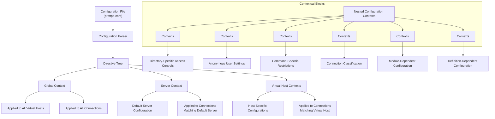
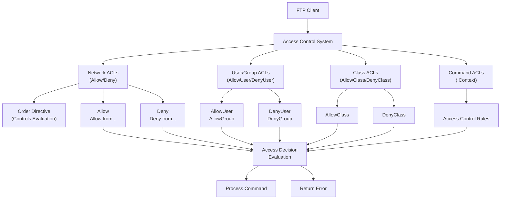
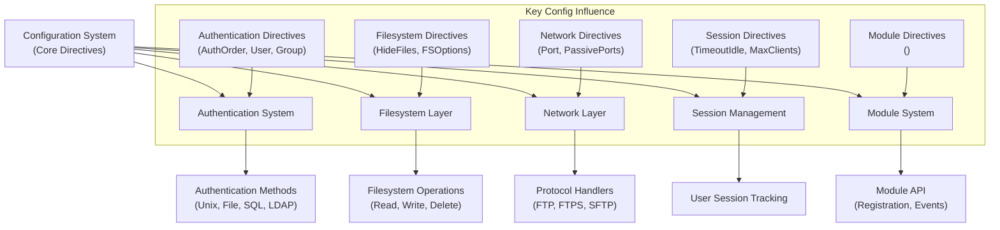

# Core Configuration Directives

> **Relevant source files**
> * [doc/modules/mod_auth.html](https://github.com/proftpd/proftpd/blob/362466f3/doc/modules/mod_auth.html)
> * [doc/modules/mod_core.html](https://github.com/proftpd/proftpd/blob/362466f3/doc/modules/mod_core.html)
> * [doc/modules/mod_xfer.html](https://github.com/proftpd/proftpd/blob/362466f3/doc/modules/mod_xfer.html)
> * [include/options.h](https://github.com/proftpd/proftpd/blob/362466f3/include/options.h)
> * [tests/t/config/include.t](https://github.com/proftpd/proftpd/blob/362466f3/tests/t/config/include.t)
> * [tests/t/lib/ProFTPD/Tests/Config/Include.pm](https://github.com/proftpd/proftpd/blob/362466f3/tests/t/lib/ProFTPD/Tests/Config/Include.pm)
> * [tests/t/lib/ProFTPD/Tests/Modules/mod_sftp/rewrite.pm](https://github.com/proftpd/proftpd/blob/362466f3/tests/t/lib/ProFTPD/Tests/Modules/mod_sftp/rewrite.pm)
> * [tests/t/modules/mod_sftp/rewrite.t](https://github.com/proftpd/proftpd/blob/362466f3/tests/t/modules/mod_sftp/rewrite.t)

## Purpose and Scope

This document provides a comprehensive reference for the essential core configuration directives in ProFTPD. These directives form the foundation of server operation and control fundamental aspects like server identity, network configuration, access control, authentication, and filesystem behavior. This section focuses on directives provided by the `mod_core` module, which handles the core FTP commands and server functionality.

For authentication-specific directives, see [Authentication Systems](/proftpd/proftpd/3-authentication-systems), and for file transfer-specific directives, see [Protocol Implementations](/proftpd/proftpd/4-protocol-implementations).

## Configuration System Architecture

The configuration system in ProFTPD is hierarchical and context-based, allowing administrators to apply directives globally or to specific virtual servers, directories, or user sessions.



Sources: [doc/modules/mod_core.html L15-L104](https://github.com/proftpd/proftpd/blob/362466f3/doc/modules/mod_core.html#L15-L104)

 This diagram visualizes the hierarchical structure of the ProFTPD configuration system, showing how directives are organized and applied in different contexts.

## Essential Server Configuration Directives

### Server Identity Directives

These directives define how the server identifies itself to clients and administrators.

| Directive | Description | Default | Context |
| --- | --- | --- | --- |
| `ServerName` | Sets the name displayed to connecting clients | None | server config, `<VirtualHost>` |
| `ServerIdent` | Controls server version information displayed | on | server config, `<VirtualHost>`, `<Global>` |
| `ServerAdmin` | Email address of the server administrator | None | server config, `<VirtualHost>`, `<Global>` |
| `ServerAlias` | Alternative names for a virtual server | None | `<VirtualHost>` |

**Example:**

```markdown
# Define server identity
ServerName "Development FTP Server"
ServerAdmin admin@example.com
ServerIdent on "FTP Server Ready"
```

Sources: [doc/modules/mod_core.html L77-L82](https://github.com/proftpd/proftpd/blob/362466f3/doc/modules/mod_core.html#L77-L82)

### Network Configuration Directives

These directives control how the server listens for connections and manages network resources.

| Directive | Description | Default | Context |
| --- | --- | --- | --- |
| `Port` | Specifies the listening port for incoming connections | 21 | server config, `<VirtualHost>` |
| `DefaultAddress` | Sets the IP address the server will bind to | None | server config |
| `PassivePorts` | Range of ports for passive data transfers | None | server config, `<VirtualHost>`, `<Global>` |
| `MasqueradeAddress` | External IP address to advertise to clients | None | server config, `<VirtualHost>`, `<Global>`, `<Anonymous>` |
| `SocketBindTight` | Controls binding behavior when using DefaultAddress | off | server config |

**Example:**

```markdown
# Network configuration
Port 2121
DefaultAddress 192.168.1.10
PassivePorts 49152 65534
MasqueradeAddress ftp.example.com
```

Sources: [doc/modules/mod_core.html L61-L70](https://github.com/proftpd/proftpd/blob/362466f3/doc/modules/mod_core.html#L61-L70)

 [doc/modules/mod_core.html L617-L665](https://github.com/proftpd/proftpd/blob/362466f3/doc/modules/mod_core.html#L617-L665)

## Configuration Context Directives

These directives create special configuration contexts that alter how other directives are applied.

```mermaid
flowchart TD

ConnMatch["Connection Matching"]
Context["Context Selection"]
Directives["Directive Application"]
ACL["Access Control Checking"]
Execution["Command Execution"]
Client["FTP Client"]
ProFTPD["ProFTPD Server"]
ConfigTree["Configuration Tree"]
GlobalContext["<br>Applies to All Servers"]
ServerConfig["Server Config<br>(Default Server)"]
VirtualHosts["<br>Host-Specific Configs"]
DirectoryContexts["<br>Path-Specific Settings"]
AnonymousContexts["<br>Anonymous Access"]
LimitContexts["<br>Command Restrictions"]
ClassContexts["<br>Client Classification"]
VhostDirContexts[""]
VhostAnonContexts[""]
VhostLimitContexts[""]
DirACLs["Access Control Lists"]
AnonACLs["Anonymous Controls"]
CommandACLs["Command Controls"]

Client --> ProFTPD
ProFTPD --> ConfigTree
ConfigTree --> GlobalContext
ConfigTree --> ServerConfig
ConfigTree --> VirtualHosts
GlobalContext --> ServerConfig
GlobalContext --> VirtualHosts
ServerConfig --> DirectoryContexts
ServerConfig --> AnonymousContexts
ServerConfig --> LimitContexts
ServerConfig --> ClassContexts
VirtualHosts --> VhostDirContexts
VirtualHosts --> VhostAnonContexts
VirtualHosts --> VhostLimitContexts
DirectoryContexts --> DirACLs
AnonymousContexts --> AnonACLs
LimitContexts --> CommandACLs

subgraph subGraph0 ["Configuration Evaluation"]
    ConnMatch
    Context
    Directives
    ACL
    Execution
    ConnMatch --> Context
    Context --> Directives
    Directives --> ACL
    ACL --> Execution
end
```

Sources: [doc/modules/mod_core.html L42-L49](https://github.com/proftpd/proftpd/blob/362466f3/doc/modules/mod_core.html#L42-L49)

 [doc/modules/mod_core.html L439-L506](https://github.com/proftpd/proftpd/blob/362466f3/doc/modules/mod_core.html#L439-L506)

### Context Containers

| Directive | Description | Context |
| --- | --- | --- |
| `<VirtualHost>` | Creates a virtual server configuration for specific IP/hostname | server config |
| `<Global>` | Specifies directives that apply to all servers | server config |
| `<Directory>` | Applies directives to a specific directory | server config, `<VirtualHost>`, `<Global>`, `<Anonymous>` |
| `<Anonymous>` | Creates an anonymous FTP login configuration | server config, `<VirtualHost>`, `<Global>` |
| `<Limit>` | Restricts directives to specific FTP commands | All contexts |
| `<Class>` | Defines a connection class for categorizing clients | server config, `<Global>` |
| `<IfModule>` | Conditionally applies directives if module is loaded | All contexts |
| `<IfDefine>` | Conditionally applies directives if parameter defined | All contexts |

**Example:**

```xml
# Virtual host example
<VirtualHost 192.168.1.100>
  ServerName "Private FTP Server"
  
  <Directory /private/files>
    <Limit READ>
      AllowUser john
      DenyAll
    </Limit>
  </Directory>
</VirtualHost>

# Global settings example
<Global>
  MaxClientsPerHost 10
  TimeoutIdle 600
</Global>
```

Sources: [doc/modules/mod_core.html L103](https://github.com/proftpd/proftpd/blob/362466f3/doc/modules/mod_core.html#L103-L103)

 [doc/modules/mod_core.html L439-L506](https://github.com/proftpd/proftpd/blob/362466f3/doc/modules/mod_core.html#L439-L506)

 [doc/modules/mod_core.html L42-L60](https://github.com/proftpd/proftpd/blob/362466f3/doc/modules/mod_core.html#L42-L60)

## Configuration Processing Directives

These directives control how configuration files are processed and loaded.

| Directive | Description | Default | Context |
| --- | --- | --- | --- |
| `Include` | Includes additional configuration files | None | All contexts |
| `IncludeOptions` | Controls behavior of Include directive | None | server config, `<VirtualHost>`, `<Global>` |
| `Define` | Defines a label for conditional configuration | None | All contexts |
| `AllowOverride` | Controls whether `.ftpaccess` files are processed | None | server config, `<VirtualHost>`, `<Global>`, `<Anonymous>` |

**Example:**

```xml
# Include site-specific configurations
Include /etc/proftpd/sites/*.conf

# Define a label for conditional configuration
Define ENABLE_TLS

# Use the label in conditional configuration
<IfDefine ENABLE_TLS>
  Include /etc/proftpd/tls.conf
</IfDefine>
```

Sources: [doc/modules/mod_core.html L58-L59](https://github.com/proftpd/proftpd/blob/362466f3/doc/modules/mod_core.html#L58-L59)

 [doc/modules/mod_core.html L694-L719](https://github.com/proftpd/proftpd/blob/362466f3/doc/modules/mod_core.html#L694-L719)

## Access Control Directives

These directives control which clients can access the server and what they can do.



Sources: [doc/modules/mod_core.html L107-L139](https://github.com/proftpd/proftpd/blob/362466f3/doc/modules/mod_core.html#L107-L139)

 [doc/modules/mod_core.html L723-L737](https://github.com/proftpd/proftpd/blob/362466f3/doc/modules/mod_core.html#L723-L737)

### Access Control Rules

| Directive | Description | Default | Context |
| --- | --- | --- | --- |
| `Allow` | Specifies hosts/networks with access | Allow from all | `<Limit>` |
| `Deny` | Specifies hosts/networks without access | None | `<Limit>` |
| `Order` | Determines processing order of Allow/Deny | None | `<Limit>` |
| `AllowUser` | Allows specific users access | None | `<Limit>` |
| `DenyUser` | Denies specific users access | None | `<Limit>` |
| `AllowGroup` | Allows specific groups access | None | `<Limit>` |
| `DenyGroup` | Denies specific groups access | None | `<Limit>` |
| `AllowClass` | Allows specific connection classes access | None | `<Limit>` |
| `DenyClass` | Denies specific connection classes access | None | `<Limit>` |
| `AllowAll` | Explicitly allows access to all | None | `<Anonymous>`, `<Limit>`, `<Directory>` |
| `DenyAll` | Explicitly denies access to all | None | `<Anonymous>`, `<Limit>`, `<Directory>` |

**Example:**

```python
# Restrict logins to local network
<Limit LOGIN>
  Order allow,deny
  Allow from 192.168.1.
  Allow from 10.0.0.
  Deny from all
</Limit>

# Only allow specific users to upload files
<Limit STOR APPE>
  Order deny,allow
  AllowUser john,mary
  DenyAll
</Limit>
```

Sources: [doc/modules/mod_core.html L107-L229](https://github.com/proftpd/proftpd/blob/362466f3/doc/modules/mod_core.html#L107-L229)

 [doc/modules/mod_core.html L723-L946](https://github.com/proftpd/proftpd/blob/362466f3/doc/modules/mod_core.html#L723-L946)

## Authentication Directives

These directives control how users are authenticated when connecting to the server.

| Directive | Description | Default | Context |
| --- | --- | --- | --- |
| `AuthOrder` | Module order for authentication checks | mod_auth_file.c mod_auth_unix.c | server config, `<VirtualHost>`, `<Global>` |
| `User` | User the daemon will run as after login | None | server config, `<VirtualHost>`, `<Global>`, `<Anonymous>` |
| `Group` | Group the daemon will run as after login | None | server config, `<VirtualHost>`, `<Global>`, `<Anonymous>` |
| `UserAlias` | Maps client usernames to system usernames | None | server config, `<VirtualHost>`, `<Global>`, `<Anonymous>` |
| `UserPassword` | Sets alternative password for user | None | server config, `<VirtualHost>`, `<Global>`, `<Anonymous>` |

**Example:**

```xml
# Authentication order - use SQL first, then Unix
AuthOrder mod_sql.c mod_auth_unix.c

# Run as specific user/group after login
User ftpd
Group ftpd

# Map anonymous logins to system user 'ftp'
<Anonymous ~ftp>
  User ftp
  Group ftp
  UserAlias anonymous ftp
</Anonymous>
```

Sources: [doc/modules/mod_core.html L510-L555](https://github.com/proftpd/proftpd/blob/362466f3/doc/modules/mod_core.html#L510-L555)

 [doc/modules/mod_auth.html L267-L338](https://github.com/proftpd/proftpd/blob/362466f3/doc/modules/mod_auth.html#L267-L338)

## Network and Connection Directives

These directives control network behavior and connection handling.

| Directive | Description | Default | Context |
| --- | --- | --- | --- |
| `MaxConnectionRate` | Max number of connections per second | None | server config, `<VirtualHost>`, `<Global>` |
| `MaxInstances` | Max number of server processes | None | server config |
| `SocketBindTight` | Controls socket binding behavior | off | server config |
| `SocketOptions` | Configures socket options | None | server config, `<VirtualHost>`, `<Global>` |
| `TCPBacklog` | Configures connection backlog size | 128 | server config, `<VirtualHost>`, `<Global>` |
| `TCPNoDelay` | Controls Nagle algorithm for TCP connections | off | server config, `<VirtualHost>`, `<Global>` |
| `UseIPv6` | Controls IPv6 support | off | server config, `<VirtualHost>`, `<Global>` |
| `UseReverseDNS` | Controls reverse DNS lookups | off | server config, `<VirtualHost>`, `<Global>` |

**Example:**

```markdown
# Network settings
MaxConnectionRate 30
MaxInstances 50
TCPNoDelay on
UseIPv6 on
```

Sources: [doc/modules/mod_core.html L62-L99](https://github.com/proftpd/proftpd/blob/362466f3/doc/modules/mod_core.html#L62-L99)

 [include/options.h L45-L58](https://github.com/proftpd/proftpd/blob/362466f3/include/options.h#L45-L58)

## Timeout Directives

These directives control various timeouts in the server.

| Directive | Description | Default | Context |
| --- | --- | --- | --- |
| `TimeoutIdle` | Idle connection timeout | 600 | server config, `<VirtualHost>`, `<Global>` |
| `TimeoutLinger` | Socket linger timeout | 10 | server config, `<VirtualHost>`, `<Global>` |

**Example:**

```markdown
# Timeout settings
TimeoutIdle 300
TimeoutLinger 5
```

Sources: [doc/modules/mod_core.html L90-L91](https://github.com/proftpd/proftpd/blob/362466f3/doc/modules/mod_core.html#L90-L91)

 [include/options.h L134-L151](https://github.com/proftpd/proftpd/blob/362466f3/include/options.h#L134-L151)

## Logging Directives

These directives control logging behavior.

| Directive | Description | Default | Context |
| --- | --- | --- | --- |
| `SystemLog` | System log file | None | server config, `<VirtualHost>`, `<Global>` |
| `SyslogLevel` | Syslog level to use | None | server config, `<VirtualHost>`, `<Global>` |
| `SyslogFacility` | Syslog facility to use | None | server config, `<VirtualHost>`, `<Global>` |
| `TraceLog` | Trace log file | None | server config, `<VirtualHost>`, `<Global>` |
| `TraceOptions` | Trace logging options | None | server config, `<VirtualHost>`, `<Global>` |
| `TransferLog` | Transfer log file | None | server config, `<VirtualHost>`, `<Global>` |
| `DebugLevel` | Debugging level | 0 | server config, `<VirtualHost>`, `<Global>` |

**Example:**

```markdown
# Logging configuration
SystemLog /var/log/proftpd/proftpd.log
SyslogLevel debug
SyslogFacility daemon
```

Sources: [doc/modules/mod_core.html L86-L89](https://github.com/proftpd/proftpd/blob/362466f3/doc/modules/mod_core.html#L86-L89)

 [doc/modules/mod_core.html L598-L616](https://github.com/proftpd/proftpd/blob/362466f3/doc/modules/mod_core.html#L598-L616)

## Filesystem and Display Directives

These directives control how files and directories are displayed and accessed.

| Directive | Description | Default | Context |
| --- | --- | --- | --- |
| `DisplayConnect` | Display file shown upon connection | None | server config, `<VirtualHost>`, `<Global>`, `<Anonymous>` |
| `DisplayLogin` | Display file shown after login | None | server config, `<VirtualHost>`, `<Global>`, `<Anonymous>` |
| `DisplayChdir` | Display file shown when changing directories | None | server config, `<VirtualHost>`, `<Global>`, `<Anonymous>` |
| `DisplayQuit` | Display file shown when client quits | None | server config, `<VirtualHost>`, `<Global>`, `<Anonymous>` |
| `HideFiles` | Hides files matching pattern | None | server config, `<VirtualHost>`, `<Global>`, `<Anonymous>`, `<Directory>` |
| `HideGroup` | Hides files owned by group | None | server config, `<VirtualHost>`, `<Global>`, `<Anonymous>`, `<Directory>` |
| `HideUser` | Hides files owned by user | None | server config, `<VirtualHost>`, `<Global>`, `<Anonymous>`, `<Directory>` |
| `HideNoAccess` | Hides files user cannot access | off | server config, `<VirtualHost>`, `<Global>`, `<Anonymous>`, `<Directory>` |

**Example:**

```markdown
# Display settings
DisplayConnect /etc/proftpd/welcome.txt
DisplayLogin /etc/proftpd/welcome.login
DisplayQuit /etc/proftpd/goodbye.txt

# Hide certain files
HideFiles \.hidden$
HideGroup wheel
HideNoAccess on
```

Sources: [doc/modules/mod_core.html L43-L46](https://github.com/proftpd/proftpd/blob/362466f3/doc/modules/mod_core.html#L43-L46)

 [doc/modules/mod_core.html L51-L57](https://github.com/proftpd/proftpd/blob/362466f3/doc/modules/mod_core.html#L51-L57)

## Security-Related Directives

These directives affect the security posture of the server.

| Directive | Description | Default | Context |
| --- | --- | --- | --- |
| `AllowForeignAddress` | Controls use of PORT command with foreign addresses | off | server config, `<VirtualHost>`, `<Global>`, `<Anonymous>` |
| `AllowOverwrite` | Controls file overwriting | off | server config, `<VirtualHost>`, `<Global>`, `<Anonymous>`, `<Directory>` |
| `CommandBufferSize` | Maximum command size | 512 | server config, `<VirtualHost>`, `<Global>` |
| `PathAllowFilter` | Regex for allowed paths | None | server config, `<VirtualHost>`, `<Global>`, `<Anonymous>`, `<Directory>` |
| `PathDenyFilter` | Regex for denied paths | None | server config, `<VirtualHost>`, `<Global>`, `<Anonymous>`, `<Directory>` |
| `AllowFilter` | Regex for allowed commands | None | server config, `<VirtualHost>`, `<Global>`, `<Anonymous>`, `<Directory>` |
| `DenyFilter` | Regex for denied commands | None | server config, `<VirtualHost>`, `<Global>`, `<Anonymous>`, `<Directory>` |

**Example:**

```markdown
# Security settings
AllowOverwrite on
CommandBufferSize 1024
PathDenyFilter "(\\.ftpaccess|\\.htaccess)$"
DenyFilter "%"
```

Sources: [doc/modules/mod_core.html L281-L324](https://github.com/proftpd/proftpd/blob/362466f3/doc/modules/mod_core.html#L281-L324)

 [doc/modules/mod_core.html L824-L870](https://github.com/proftpd/proftpd/blob/362466f3/doc/modules/mod_core.html#L824-L870)

## Tuning and Performance Directives

These directives affect the performance and behavior of the server.

| Directive | Description | Default | Context |
| --- | --- | --- | --- |
| `ScoreboardFile` | Path to scoreboard file | None | server config |
| `ScoreboardScrub` | Controls scoreboard cleaning | off | server config |
| `PidFile` | Path to PID file | None | server config |
| `ProcessTitles` | Controls process title format | full | server config |
| `ServerType` | Server operation mode (inetd or standalone) | standalone | server config |
| `SetEnv` | Sets environment variable | None | server config, `<VirtualHost>`, `<Global>` |
| `UnsetEnv` | Unsets environment variable | None | server config, `<VirtualHost>`, `<Global>` |
| `FSCachePolicy` | Filesystem cache policy | off | server config, `<VirtualHost>`, `<Global>` |
| `FSOptions` | Filesystem operation options | None | server config, `<VirtualHost>`, `<Global>` |

**Example:**

```markdown
# Performance settings
ScoreboardFile /var/run/proftpd/proftpd.scoreboard
ScoreboardScrub on
SetEnv TZ America/New_York
FSCachePolicy 10%
```

Sources: [doc/modules/mod_core.html L74-L77](https://github.com/proftpd/proftpd/blob/362466f3/doc/modules/mod_core.html#L74-L77)

 [include/options.h L178-L211](https://github.com/proftpd/proftpd/blob/362466f3/include/options.h#L178-L211)

## Relationship to Other Subsystems

The core configuration directives establish the foundation that other ProFTPD subsystems build upon. Here's how they relate to other major components:



Sources: [doc/modules/mod_core.html L15-L17](https://github.com/proftpd/proftpd/blob/362466f3/doc/modules/mod_core.html#L15-L17)

 [include/options.h L27-L32](https://github.com/proftpd/proftpd/blob/362466f3/include/options.h#L27-L32)

## Default Values and Optimization

Many core directives have default values defined in the ProFTPD code. These defaults are chosen to provide a balance between security, performance, and compatibility.

The following table shows some key default values that can affect server performance:

| Directive | Default Value | Source | Description |
| --- | --- | --- | --- |
| `TimeoutIdle` | 600 seconds | [include/options.h L139-L140](https://github.com/proftpd/proftpd/blob/362466f3/include/options.h#L139-L140) | Connection timeout for idle clients |
| `CommandBufferSize` | 512 bytes | [include/options.h L113-L115](https://github.com/proftpd/proftpd/blob/362466f3/include/options.h#L113-L115) | Size of command buffer (can be up to 512KB) |
| `TCPBacklog` | 128 connections | [include/options.h L52-L58](https://github.com/proftpd/proftpd/blob/362466f3/include/options.h#L52-L58) | Backlog for pending connections |
| `TransferRate` | Unlimited | N/A | No default transfer rate limiting |
| `MaxInstances` | None | N/A | No default limit on server processes |
| `ScoreboardScrub` | 30 seconds | [include/options.h L188-L190](https://github.com/proftpd/proftpd/blob/362466f3/include/options.h#L188-L190) | Interval between scoreboard cleaning |

**Optimization Recommendations:**

1. Adjust `TimeoutIdle` based on expected client behavior
2. Increase `CommandBufferSize` if dealing with long command paths
3. Adjust `TCPBacklog` based on server load and connection patterns
4. Consider using `TransferRate` to prevent bandwidth saturation
5. Set appropriate `MaxInstances` to prevent resource exhaustion
6. Use `ScoreboardScrub` to keep server status information accurate

Sources: [include/options.h L134-L151](https://github.com/proftpd/proftpd/blob/362466f3/include/options.h#L134-L151)

 [include/options.h L45-L58](https://github.com/proftpd/proftpd/blob/362466f3/include/options.h#L45-L58)

 [include/options.h L178-L190](https://github.com/proftpd/proftpd/blob/362466f3/include/options.h#L178-L190)

## Conclusion

The core configuration directives in ProFTPD provide the foundation for all server functionality. They control essential aspects like server identity, network operations, authentication, access control, and filesystem behavior. By properly configuring these directives, administrators can create a secure, efficient, and tailored FTP service that meets specific requirements.

When configuring ProFTPD, it's important to understand the interaction between different directives and how they affect overall server behavior. Directives can be applied globally or in specific contexts, allowing for fine-grained control over the server's operation.

For more detailed information on authentication-specific directives, see [Authentication Systems](/proftpd/proftpd/3-authentication-systems), and for file transfer-specific directives, see [Protocol Implementations](/proftpd/proftpd/4-protocol-implementations).