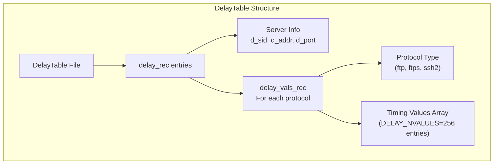
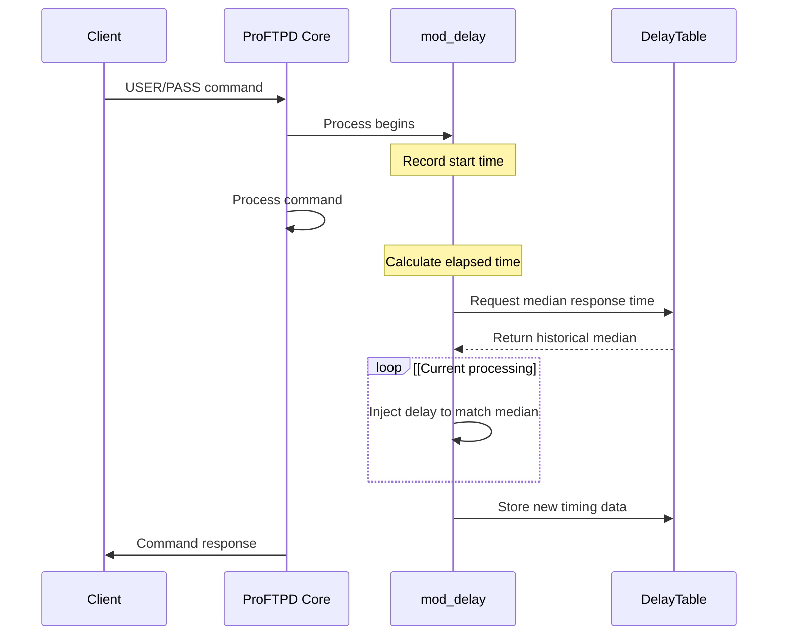
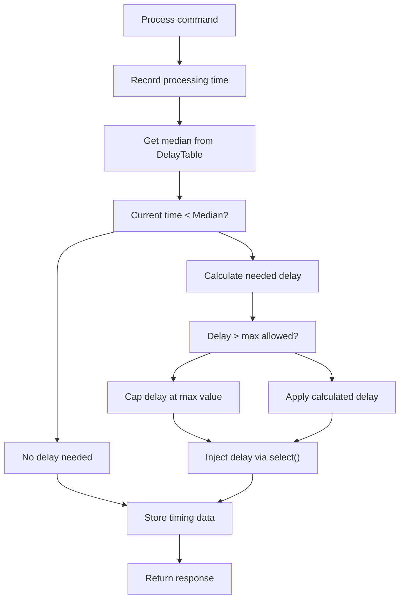

# Delay Mechanism

> **Relevant source files**
> * [contrib/mod_ctrls_admin.c](https://github.com/proftpd/proftpd/blob/362466f3/contrib/mod_ctrls_admin.c)
> * [doc/modules/mod_delay.html](https://github.com/proftpd/proftpd/blob/362466f3/doc/modules/mod_delay.html)
> * [include/compat.h](https://github.com/proftpd/proftpd/blob/362466f3/include/compat.h)
> * [include/ctrls.h](https://github.com/proftpd/proftpd/blob/362466f3/include/ctrls.h)
> * [include/mod_ctrls.h](https://github.com/proftpd/proftpd/blob/362466f3/include/mod_ctrls.h)
> * [modules/mod_ctrls.c](https://github.com/proftpd/proftpd/blob/362466f3/modules/mod_ctrls.c)
> * [modules/mod_delay.c](https://github.com/proftpd/proftpd/blob/362466f3/modules/mod_delay.c)
> * [modules/mod_dso.c](https://github.com/proftpd/proftpd/blob/362466f3/modules/mod_dso.c)
> * [src/ctrls.c](https://github.com/proftpd/proftpd/blob/362466f3/src/ctrls.c)
> * [src/ftpdctl.c](https://github.com/proftpd/proftpd/blob/362466f3/src/ftpdctl.c)
> * [tests/api/ctrls.c](https://github.com/proftpd/proftpd/blob/362466f3/tests/api/ctrls.c)
> * [tests/t/lib/ProFTPD/Tests/Modules/mod_ctrls.pm](https://github.com/proftpd/proftpd/blob/362466f3/tests/t/lib/ProFTPD/Tests/Modules/mod_ctrls.pm)
> * [tests/t/lib/ProFTPD/Tests/Modules/mod_delay.pm](https://github.com/proftpd/proftpd/blob/362466f3/tests/t/lib/ProFTPD/Tests/Modules/mod_delay.pm)
> * [tests/t/modules/mod_ctrls.t](https://github.com/proftpd/proftpd/blob/362466f3/tests/t/modules/mod_ctrls.t)
> * [tests/t/modules/mod_delay.t](https://github.com/proftpd/proftpd/blob/362466f3/tests/t/modules/mod_delay.t)

The Delay Mechanism in ProFTPD is a security feature designed to protect against timing attacks during authentication by introducing calculated delays to normalize server response times.

## Purpose

Timing attacks are a class of side-channel attacks where an attacker measures the time it takes for a server to respond to different inputs. In FTP authentication, the server typically processes valid usernames differently than invalid ones, potentially allowing attackers to enumerate valid user accounts by analyzing response time variations.

The `mod_delay` module addresses this vulnerability by:

1. Tracking the time taken to process USER and PASS commands
2. Calculating the median of these times
3. Adding delays when necessary to normalize response times
4. Supporting explicit delay configurations for specific events

Sources: [modules/mod_delay.c L1-L28](https://github.com/proftpd/proftpd/blob/362466f3/modules/mod_delay.c#L1-L28)

 [doc/modules/mod_delay.html L15-L35](https://github.com/proftpd/proftpd/blob/362466f3/doc/modules/mod_delay.html#L15-L35)

## Architecture

### DelayTable System

The core of the delay mechanism is the DelayTable, which stores timing information across server restarts. This persistent table is organized by server ID and tracks timing data for USER and PASS commands across different protocols.



The DelayTable maintains separate entries for different protocols (ftp, ftps, ssh2) because encryption overhead and other factors can cause response times to vary between protocols.

Sources: [modules/mod_delay.c L56-L107](https://github.com/proftpd/proftpd/blob/362466f3/modules/mod_delay.c#L56-L107)

 [modules/mod_delay.c L167-L191](https://github.com/proftpd/proftpd/blob/362466f3/modules/mod_delay.c#L167-L191)

### Delay Process Flow



Sources: [modules/mod_delay.c L167-L252](https://github.com/proftpd/proftpd/blob/362466f3/modules/mod_delay.c#L167-L252)

 [modules/mod_delay.c L368-L414](https://github.com/proftpd/proftpd/blob/362466f3/modules/mod_delay.c#L368-L414)

## Implementation Details

### Median Selection Algorithm

The module uses a selection algorithm based on "Numeric Recipes in C" to find the median value from the stored timing data. This algorithm:

1. Takes the current interval and all stored intervals for a specific command type
2. Efficiently selects the median value without fully sorting the array
3. Returns the median for use in delay calculations

Sources: [modules/mod_delay.c L167-L252](https://github.com/proftpd/proftpd/blob/362466f3/modules/mod_delay.c#L167-L252)

### Delay Injection

When a command is processed faster than the historical median time, `mod_delay` adds a delay to match the expected response time:



The module may also add random jitter to delays for certain events to further obscure patterns.

Sources: [modules/mod_delay.c L368-L414](https://github.com/proftpd/proftpd/blob/362466f3/modules/mod_delay.c#L368-L414)

### Signal Handling

The module carefully manages signal blocking during delay injection to prevent interruptions while still allowing the server to handle critical signals:

1. Block signals during the delay period
2. Use `select()` with a timeout to implement the delay
3. Handle any interrupting signals after the delay completes

Sources: [modules/mod_delay.c L326-L366](https://github.com/proftpd/proftpd/blob/362466f3/modules/mod_delay.c#L326-L366)

## Configuration

### DelayEngine

```
DelayEngine on|off
```

Enables or disables the delay mechanism. Default is `on`.

Sources: [modules/mod_delay.c L127](https://github.com/proftpd/proftpd/blob/362466f3/modules/mod_delay.c#L127-L127)

 [doc/modules/mod_delay.html L100-L117](https://github.com/proftpd/proftpd/blob/362466f3/doc/modules/mod_delay.html#L100-L117)

### DelayTable

```
DelayTable path|none
```

Specifies the path to the file storing timing data. Default is `/var/proftpd/proftpd.delay`.

Using `none` disables persistent storage of timing data, typically used with explicit `DelayOnEvent` settings.

Sources: [modules/mod_delay.c L118-L125](https://github.com/proftpd/proftpd/blob/362466f3/modules/mod_delay.c#L118-L125)

 [doc/modules/mod_delay.html L174-L200](https://github.com/proftpd/proftpd/blob/362466f3/doc/modules/mod_delay.html#L174-L200)

### DelayOnEvent

```
DelayOnEvent event delay-ms
```

Configures explicit delays for specific events:

| Event | Description |
| --- | --- |
| USER | Delay after USER command |
| PASS | Delay after PASS command |
| FailedLogin | Delay after failed login attempt |
| Connect | Delay at connection time (supports ranges) |

Examples:

```markdown
DelayOnEvent PASS 2000ms                # 2 second delay for PASS
DelayOnEvent FailedLogin 5s             # 5 second delay after failed login
DelayOnEvent Connect 100-3000ms         # Random delay between 100ms-3s on connect
```

Sources: [modules/mod_delay.c L142-L155](https://github.com/proftpd/proftpd/blob/362466f3/modules/mod_delay.c#L142-L155)

 [doc/modules/mod_delay.html L121-L172](https://github.com/proftpd/proftpd/blob/362466f3/doc/modules/mod_delay.html#L121-L172)

## Administrative Control

### DelayTable Management

The delay table is automatically maintained, but administrators can interact with it via control actions:

```markdown
ftpdctl delay info         # Display current DelayTable data
ftpdctl delay reset        # Reset the DelayTable, clearing all timing data
```

Sources: [doc/modules/mod_delay.html L204-L228](https://github.com/proftpd/proftpd/blob/362466f3/doc/modules/mod_delay.html#L204-L228)

### Access Control

```
DelayControlsACLs actions|all allow|deny user|group list
```

Controls which users or groups can execute delay-related control actions.

Sources: [doc/modules/mod_delay.html L75-L96](https://github.com/proftpd/proftpd/blob/362466f3/doc/modules/mod_delay.html#L75-L96)

## Practical Considerations

### Performance Impact

Since the delay mechanism only adds time to match historical medians, the performance impact is primarily normalization rather than universal slowdown. As the DelayTable warms up with data, the delay times stabilize around typical server response times.

### Security vs. Usability

For high-traffic sites, the delay mechanism may impact user experience. Possible approaches:

1. **Disable completely**: `DelayEngine off`
2. **Use explicit delays only**: `DelayTable none` with `DelayOnEvent` settings
3. **Reset periodically**: Use `ftpdctl delay reset` to clear unusually long delays

### Table Poisoning Protection

The module protects against "poisoning" (where attackers intentionally create long delays) by:

1. Limiting how many values a single session can contribute
2. Setting absolute maximum delay limits
3. Only accepting positive delay values

Sources: [modules/mod_delay.c L272-L324](https://github.com/proftpd/proftpd/blob/362466f3/modules/mod_delay.c#L272-L324)

 [doc/modules/mod_delay.html L231-L244](https://github.com/proftpd/proftpd/blob/362466f3/doc/modules/mod_delay.html#L231-L244)

 [modules/mod_delay.c L87-L93](https://github.com/proftpd/proftpd/blob/362466f3/modules/mod_delay.c#L87-L93)

## Integration with ProFTPD

The delay mechanism is part of ProFTPD's session management subsystem and integrates with:

1. The authentication system
2. The controls API (for administrative management)
3. Signal handling mechanisms

This integration ensures that timing attacks are mitigated while maintaining proper server functionality and administrative control.

Sources: [modules/mod_delay.c L60-L84](https://github.com/proftpd/proftpd/blob/362466f3/modules/mod_delay.c#L60-L84)