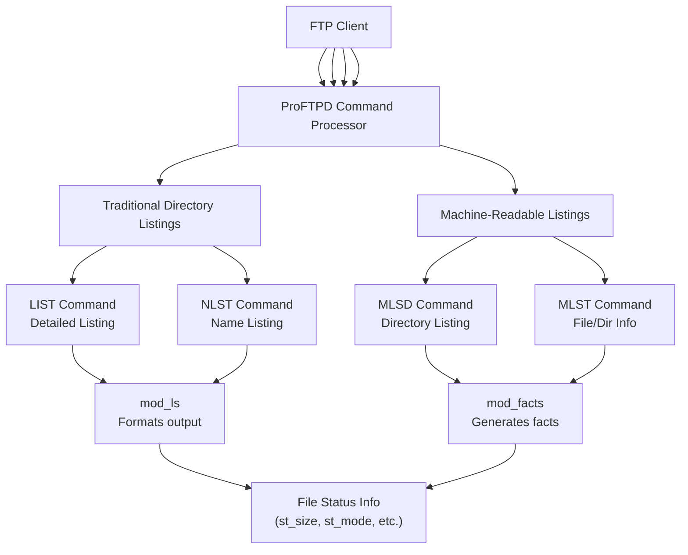
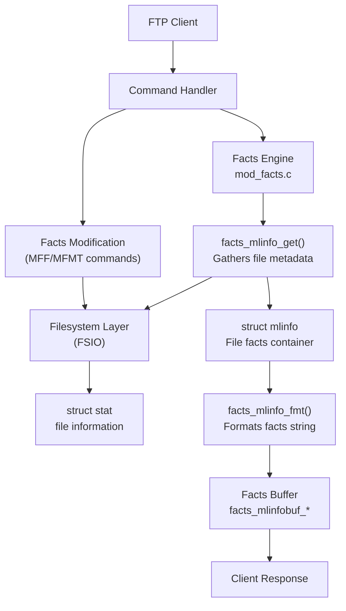
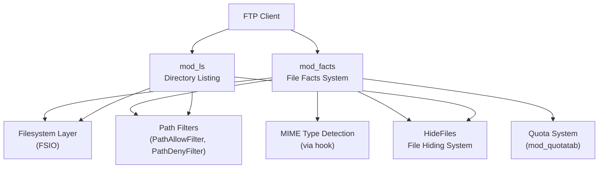

# Directory Listings and File Facts

> **Relevant source files**
> * [contrib/mod_site_misc.c](https://github.com/proftpd/proftpd/blob/362466f3/contrib/mod_site_misc.c)
> * [modules/mod_facts.c](https://github.com/proftpd/proftpd/blob/362466f3/modules/mod_facts.c)
> * [tests/t/commands/abor.t](https://github.com/proftpd/proftpd/blob/362466f3/tests/t/commands/abor.t)
> * [tests/t/commands/mlsd.t](https://github.com/proftpd/proftpd/blob/362466f3/tests/t/commands/mlsd.t)
> * [tests/t/commands/mlst.t](https://github.com/proftpd/proftpd/blob/362466f3/tests/t/commands/mlst.t)
> * [tests/t/lib/ProFTPD/Tests/Commands/ABOR.pm](https://github.com/proftpd/proftpd/blob/362466f3/tests/t/lib/ProFTPD/Tests/Commands/ABOR.pm)
> * [tests/t/lib/ProFTPD/Tests/Commands/LIST.pm](https://github.com/proftpd/proftpd/blob/362466f3/tests/t/lib/ProFTPD/Tests/Commands/LIST.pm)
> * [tests/t/lib/ProFTPD/Tests/Commands/MLSD.pm](https://github.com/proftpd/proftpd/blob/362466f3/tests/t/lib/ProFTPD/Tests/Commands/MLSD.pm)
> * [tests/t/lib/ProFTPD/Tests/Commands/MLST.pm](https://github.com/proftpd/proftpd/blob/362466f3/tests/t/lib/ProFTPD/Tests/Commands/MLST.pm)
> * [tests/t/lib/ProFTPD/Tests/Commands/NLST.pm](https://github.com/proftpd/proftpd/blob/362466f3/tests/t/lib/ProFTPD/Tests/Commands/NLST.pm)
> * [tests/t/lib/ProFTPD/Tests/Commands/RETR.pm](https://github.com/proftpd/proftpd/blob/362466f3/tests/t/lib/ProFTPD/Tests/Commands/RETR.pm)
> * [tests/t/lib/ProFTPD/Tests/Commands/STOR.pm](https://github.com/proftpd/proftpd/blob/362466f3/tests/t/lib/ProFTPD/Tests/Commands/STOR.pm)
> * [tests/t/lib/ProFTPD/Tests/Commands/STOU.pm](https://github.com/proftpd/proftpd/blob/362466f3/tests/t/lib/ProFTPD/Tests/Commands/STOU.pm)
> * [tests/t/lib/ProFTPD/Tests/Config/HideFiles.pm](https://github.com/proftpd/proftpd/blob/362466f3/tests/t/lib/ProFTPD/Tests/Config/HideFiles.pm)
> * [tests/t/lib/ProFTPD/Tests/Modules/mod_site_misc.pm](https://github.com/proftpd/proftpd/blob/362466f3/tests/t/lib/ProFTPD/Tests/Modules/mod_site_misc.pm)
> * [tests/t/modules/mod_site_misc.t](https://github.com/proftpd/proftpd/blob/362466f3/tests/t/modules/mod_site_misc.t)

## Overview

This page documents ProFTPD's implementation of directory listing formats and file metadata (facts) handling. ProFTPD supports both traditional FTP directory listings and the machine-readable formats defined in RFC 3659. This system provides clients with detailed file information in standardized formats and allows for consistent representation of file metadata across the server.

For information about the core filesystem layer that provides the underlying file data, see [Filesystem Layer (FSIO)](/proftpd/proftpd/2.2-filesystem-layer-(fsio)).

## Directory Listing Commands

ProFTPD implements several FTP commands for retrieving directory listings:



Sources: [modules/mod_facts.c L1-L50](https://github.com/proftpd/proftpd/blob/362466f3/modules/mod_facts.c#L1-L50)

 [tests/t/lib/ProFTPD/Tests/Commands/LIST.pm L1-L40](https://github.com/proftpd/proftpd/blob/362466f3/tests/t/lib/ProFTPD/Tests/Commands/LIST.pm#L1-L40)

 [tests/t/lib/ProFTPD/Tests/Commands/NLST.pm L1-L40](https://github.com/proftpd/proftpd/blob/362466f3/tests/t/lib/ProFTPD/Tests/Commands/NLST.pm#L1-L40)

 [tests/t/lib/ProFTPD/Tests/Commands/MLSD.pm L1-L40](https://github.com/proftpd/proftpd/blob/362466f3/tests/t/lib/ProFTPD/Tests/Commands/MLSD.pm#L1-L40)

 [tests/t/lib/ProFTPD/Tests/Commands/MLST.pm L1-L40](https://github.com/proftpd/proftpd/blob/362466f3/tests/t/lib/ProFTPD/Tests/Commands/MLST.pm#L1-L40)

### Traditional Directory Listings

The traditional FTP protocol defines two main commands for directory listings:

1. **LIST** - Provides a detailed directory listing in a format similar to the Unix `ls -l` command, showing file permissions, size, modification date, and filename.
2. **NLST** - Provides a simple list of filenames, suitable for machine processing but with limited metadata.

These formats are not standardized in detail by the FTP protocol, which can lead to compatibility issues between different servers and clients.

Sources: [tests/t/lib/ProFTPD/Tests/Commands/LIST.pm L1-L252](https://github.com/proftpd/proftpd/blob/362466f3/tests/t/lib/ProFTPD/Tests/Commands/LIST.pm#L1-L252)

 [tests/t/lib/ProFTPD/Tests/Commands/NLST.pm L1-L184](https://github.com/proftpd/proftpd/blob/362466f3/tests/t/lib/ProFTPD/Tests/Commands/NLST.pm#L1-L184)

### Machine-Readable Directory Listings

RFC 3659 defines an extension to the FTP protocol that includes standardized, machine-readable directory listings with rich metadata:

1. **MLSD** - Machine Listing Directory - Lists multiple files in a directory with standardized "facts" (metadata attributes).
2. **MLST** - Machine Listing - Shows standardized facts for a single file or directory.

These commands produce output with consistent formatting that's easier for programs to parse reliably.

Sources: [modules/mod_facts.c L424-L510](https://github.com/proftpd/proftpd/blob/362466f3/modules/mod_facts.c#L424-L510)

 [tests/t/lib/ProFTPD/Tests/Commands/MLSD.pm L156-L273](https://github.com/proftpd/proftpd/blob/362466f3/tests/t/lib/ProFTPD/Tests/Commands/MLSD.pm#L156-L273)

 [tests/t/lib/ProFTPD/Tests/Commands/MLST.pm L109-L154](https://github.com/proftpd/proftpd/blob/362466f3/tests/t/lib/ProFTPD/Tests/Commands/MLST.pm#L109-L154)

## File Facts Architecture

The `mod_facts` module implements the file facts system, which provides standardized metadata attributes for files and directories according to RFC 3659.



Sources: [modules/mod_facts.c L71-L81](https://github.com/proftpd/proftpd/blob/362466f3/modules/mod_facts.c#L71-L81)

 [modules/mod_facts.c L514-L756](https://github.com/proftpd/proftpd/blob/362466f3/modules/mod_facts.c#L514-L756)

 [modules/mod_facts.c L886-L989](https://github.com/proftpd/proftpd/blob/362466f3/modules/mod_facts.c#L886-L989)

### File Facts Data Structure

The core data structure for file facts is the `mlinfo` struct:

```javascript
struct mlinfo {
  pool *pool;
  struct stat st;        // Standard file stats (size, permissions, etc.)
  struct tm *tm;         // Modification time
  const char *user;      // Username
  const char *group;     // Group name
  const char *type;      // File type
  const char *perm;      // Permission string
  const char *path;      // File path
  const char *real_path; // Real path (for symlinks)
};
```

This structure stores all the metadata needed to format the facts for a file. The `facts_mlinfo_get()` function populates this structure based on a file path.

Sources: [modules/mod_facts.c L71-L81](https://github.com/proftpd/proftpd/blob/362466f3/modules/mod_facts.c#L71-L81)

 [modules/mod_facts.c L514-L756](https://github.com/proftpd/proftpd/blob/362466f3/modules/mod_facts.c#L514-L756)

## Supported Facts

ProFTPD supports a range of standard and UNIX-specific file facts:

| Fact Name | Description | Configuration Option |
| --- | --- | --- |
| `modify` | Modification time (YYYYMMDDhhmmss) | `FACTS_OPT_SHOW_MODIFY` |
| `perm` | Permission flags (e.g., "adfr", "flcdmpe") | `FACTS_OPT_SHOW_PERM` |
| `size` | File size in bytes | `FACTS_OPT_SHOW_SIZE` |
| `type` | File type (file, dir, cdir, pdir, OS.unix=symlink) | `FACTS_OPT_SHOW_TYPE` |
| `unique` | Unique file identifier | `FACTS_OPT_SHOW_UNIQUE` |
| `UNIX.group` | UNIX group ID | `FACTS_OPT_SHOW_UNIX_GROUP` |
| `UNIX.mode` | UNIX file mode (octal) | `FACTS_OPT_SHOW_UNIX_MODE` |
| `UNIX.owner` | UNIX owner ID | `FACTS_OPT_SHOW_UNIX_OWNER` |
| `media-type` | MIME media type | `FACTS_OPT_SHOW_MEDIA_TYPE` |
| `UNIX.ownername` | UNIX owner name | `FACTS_OPT_SHOW_UNIX_OWNER_NAME` |
| `UNIX.groupname` | UNIX group name | `FACTS_OPT_SHOW_UNIX_GROUP_NAME` |

By default, most facts are enabled as defined by `FACTS_OPT_SHOW_DEFAULT`.

Sources: [modules/mod_facts.c L37-L49](https://github.com/proftpd/proftpd/blob/362466f3/modules/mod_facts.c#L37-L49)

 [modules/mod_facts.c L51-L61](https://github.com/proftpd/proftpd/blob/362466f3/modules/mod_facts.c#L51-L61)

 [modules/mod_facts.c L90-L135](https://github.com/proftpd/proftpd/blob/362466f3/modules/mod_facts.c#L90-L135)

 [modules/mod_facts.c L298-L423](https://github.com/proftpd/proftpd/blob/362466f3/modules/mod_facts.c#L298-L423)

### Fact Types and Values

Each fact has specific formatting and semantics:

1. **modify** - Modification time in the format "YYYYMMDDhhmmss" in GMT
2. **perm** - Permission flags: * For files: "adfr" (append, delete, file retrieval) and "w" (write) * For directories: "flcdmpe" (list, create file, change dir, delete, mkdir, remove dir, enter)
3. **type** - One of: * "file" - Regular file * "dir" - Directory * "cdir" - Current directory (in MLSD output for ".") * "pdir" - Parent directory (in MLSD output for "..") * "OS.unix=symlink" or "OS.unix=slink:" - Symbolic link
4. **unique** - A unique identifier that combines device ID and inode number

Sources: [modules/mod_facts.c L298-L423](https://github.com/proftpd/proftpd/blob/362466f3/modules/mod_facts.c#L298-L423)

 [modules/mod_facts.c L631-L681](https://github.com/proftpd/proftpd/blob/362466f3/modules/mod_facts.c#L631-L681)

 [modules/mod_facts.c L689-L742](https://github.com/proftpd/proftpd/blob/362466f3/modules/mod_facts.c#L689-L742)

## Facts Formatting and Output

File facts are formatted as a series of "fact=value;" pairs, followed by a space and the filename. For example:

```
modify=20230405120000;perm=adfr;size=12345;type=file;unique=1X123U456;UNIX.group=100;UNIX.mode=0644;UNIX.owner=1000; example.txt
```

The `facts_mlinfo_fmt()` function handles the formatting of these strings based on the enabled facts and configuration options.

For multiple files (MLSD command), facts are buffered and then flushed to the client using the `facts_mlinfobuf_*` functions.

Sources: [modules/mod_facts.c L298-L423](https://github.com/proftpd/proftpd/blob/362466f3/modules/mod_facts.c#L298-L423)

 [modules/mod_facts.c L434-L510](https://github.com/proftpd/proftpd/blob/362466f3/modules/mod_facts.c#L434-L510)

## Symlink Handling

Symbolic links require special handling, particularly for the `type` fact. The `mod_facts` module supports several options for displaying symlinks:

1. **Standard mode** (`FACTS_MLINFO_FL_SHOW_SYMLINKS` off): Symlinks appear as their target type (file/dir)
2. **Show symlinks** (`FACTS_MLINFO_FL_SHOW_SYMLINKS` on): Symlinks are shown with type "OS.unix=symlink"
3. **Show symlinks with target** (`FACTS_MLINFO_FL_SHOW_SYMLINKS` and `FACTS_MLINFO_FL_SHOW_SYMLINKS_USE_SLINK`): Symlinks are shown with type "OS.unix=slink:"
4. **Adjusted symlinks** (`FACTS_MLINFO_FL_ADJUSTED_SYMLINKS`): Special handling for chrooted environments

This flexibility accommodates different client expectations and server configurations.

Sources: [modules/mod_facts.c L63-L68](https://github.com/proftpd/proftpd/blob/362466f3/modules/mod_facts.c#L63-L68)

 [modules/mod_facts.c L555-L610](https://github.com/proftpd/proftpd/blob/362466f3/modules/mod_facts.c#L555-L610)

## Facts Modification Commands

ProFTPD implements two commands for modifying file facts:

1. **MFF** (Modify File Facts) - Allows modification of various facts * Can modify: * `modify` (modification time) * `UNIX.group` (group ID) * `UNIX.mode` (file permissions)
2. **MFMT** (Modify File Modification Time) - Specifically for modifying the modification time

Example usage:

```
MFF modify=20230405120000;UNIX.mode=0644; example.txt
MFMT 20230405120000 example.txt
```

Sources: [modules/mod_facts.c L886-L989](https://github.com/proftpd/proftpd/blob/362466f3/modules/mod_facts.c#L886-L989)

 [modules/mod_facts.c L1080-L1308](https://github.com/proftpd/proftpd/blob/362466f3/modules/mod_facts.c#L1080-L1308)

 [modules/mod_facts.c L1310-L1369](https://github.com/proftpd/proftpd/blob/362466f3/modules/mod_facts.c#L1310-L1369)

## Integration with Other ProFTPD Components

The file facts system integrates with several other components of ProFTPD:



Sources: [modules/mod_facts.c L138-L159](https://github.com/proftpd/proftpd/blob/362466f3/modules/mod_facts.c#L138-L159)

 [modules/mod_facts.c L276-L296](https://github.com/proftpd/proftpd/blob/362466f3/modules/mod_facts.c#L276-L296)

 [tests/t/lib/ProFTPD/Tests/Config/HideFiles.pm L100-L132](https://github.com/proftpd/proftpd/blob/362466f3/tests/t/lib/ProFTPD/Tests/Config/HideFiles.pm#L100-L132)

### Key Integration Points

1. **Path Filtering**: The facts system respects `PathAllowFilter` and `PathDenyFilter` configuration directives.
2. **MIME Type Detection**: The `media-type` fact uses hooks to detect the MIME type of files.
3. **File Hiding**: The facts system works with the `HideFiles` directive to hide specified files and directories from listings.
4. **Filesystem Operations**: Fact modifications (MFF/MFMT) use the FSIO API for making changes to files.

Sources: [modules/mod_facts.c L138-L159](https://github.com/proftpd/proftpd/blob/362466f3/modules/mod_facts.c#L138-L159)

 [modules/mod_facts.c L276-L296](https://github.com/proftpd/proftpd/blob/362466f3/modules/mod_facts.c#L276-L296)

 [tests/t/lib/ProFTPD/Tests/Config/HideFiles.pm L100-L132](https://github.com/proftpd/proftpd/blob/362466f3/tests/t/lib/ProFTPD/Tests/Config/HideFiles.pm#L100-L132)

## Configuring File Facts

The facts system offers several configuration options through the MLST FEAT (feature) response. Clients can use the `OPTS MLST` command to choose which facts should be included in MLST/MLSD outputs.

Example FEAT response showing available facts:

```
211-Features:
 ...
 MLST modify*;perm*;size*;type*;unique*;UNIX.group*;UNIX.groupname*;UNIX.mode*;UNIX.owner*;UNIX.ownername*;media-type*;
 ...
211 End
```

The asterisk indicates facts that are enabled by default. Clients can enable/disable specific facts:

```
OPTS MLST modify;size;type;
```

This would show only the modify, size, and type facts in MLST/MLSD responses.

Sources: [modules/mod_facts.c L767-L864](https://github.com/proftpd/proftpd/blob/362466f3/modules/mod_facts.c#L767-L864)

## Performance Considerations

The facts system includes optimizations for handling large directory listings:

1. **Buffering**: MLSD output is buffered and flushed in chunks to improve performance
2. **Configurable Facts**: Limiting the number of facts can reduce processing time and bandwidth
3. **Time Handling**: Custom time conversion functions to avoid external files dependency

Sources: [modules/mod_facts.c L434-L510](https://github.com/proftpd/proftpd/blob/362466f3/modules/mod_facts.c#L434-L510)

 [modules/mod_facts.c L161-L274](https://github.com/proftpd/proftpd/blob/362466f3/modules/mod_facts.c#L161-L274)