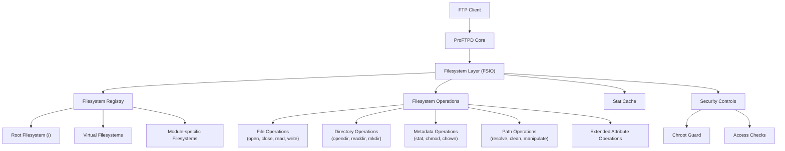
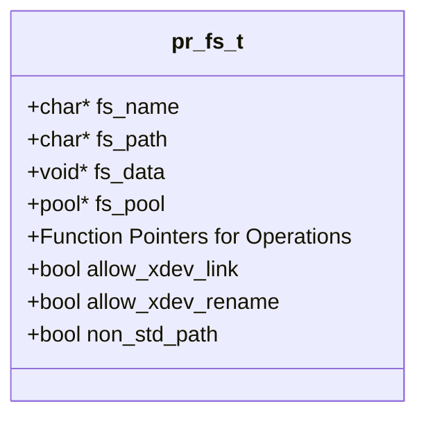
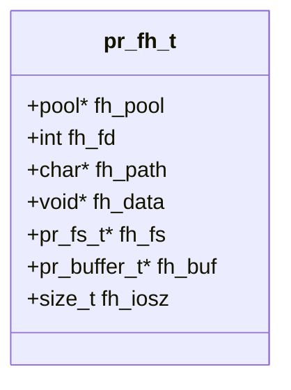
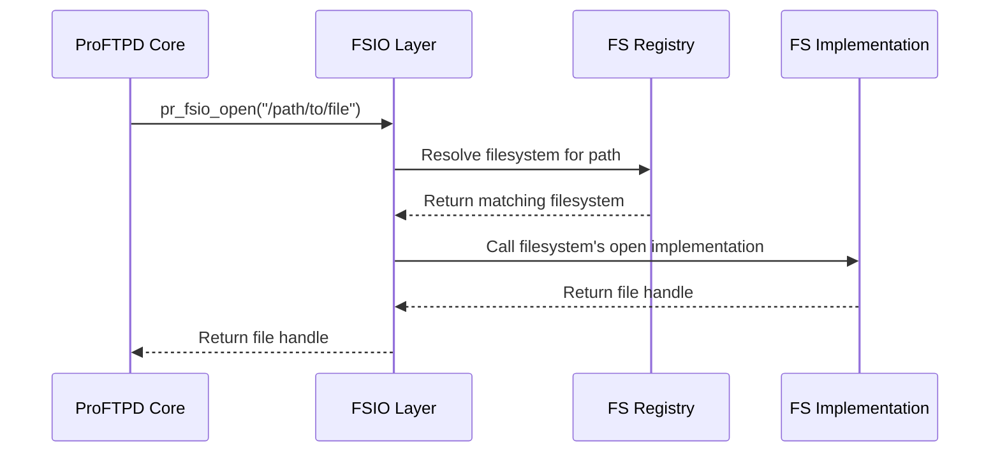
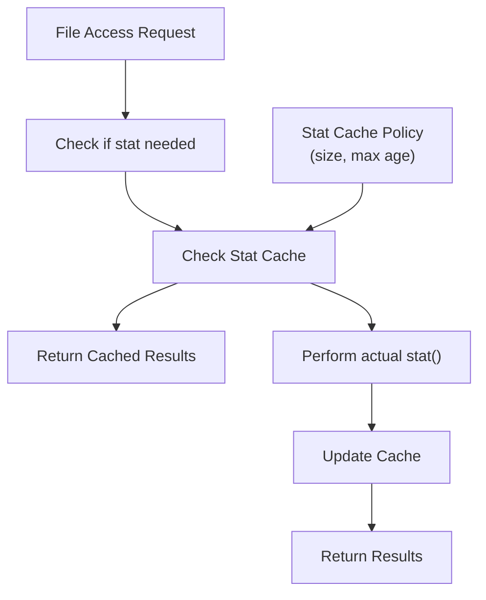
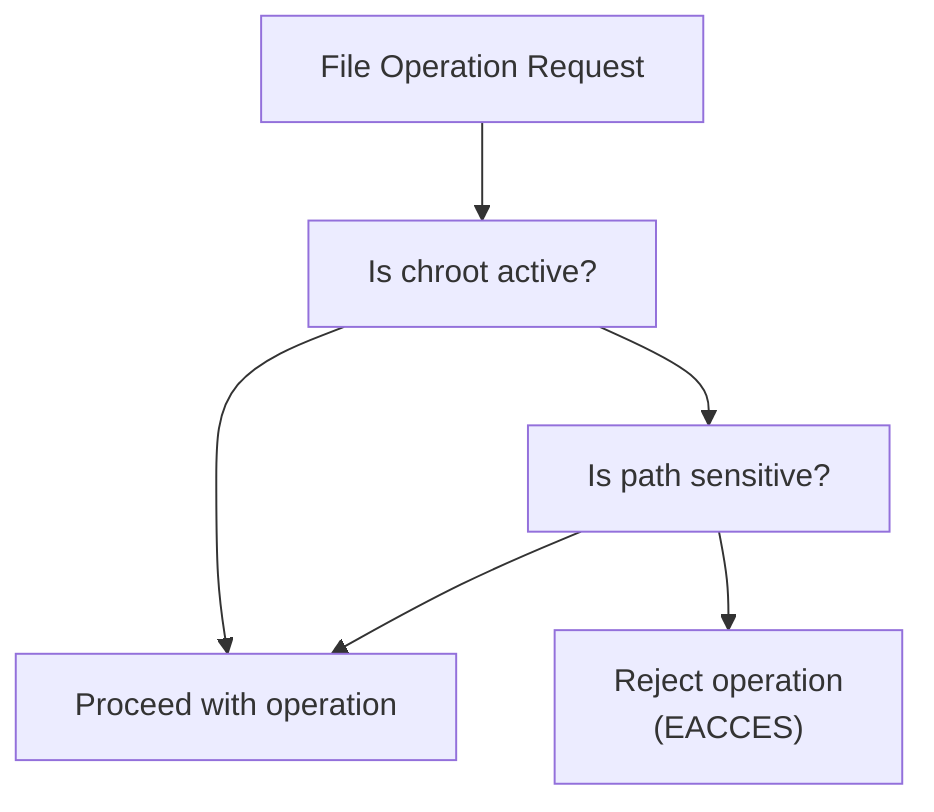
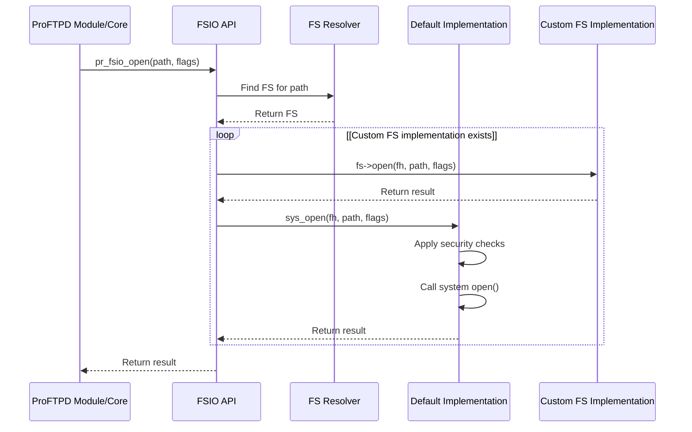

# Filesystem Layer (FSIO)

> **Relevant source files**
> * [include/fsio.h](https://github.com/proftpd/proftpd/blob/362466f3/include/fsio.h)
> * [include/str.h](https://github.com/proftpd/proftpd/blob/362466f3/include/str.h)
> * [src/fsio.c](https://github.com/proftpd/proftpd/blob/362466f3/src/fsio.c)
> * [src/str.c](https://github.com/proftpd/proftpd/blob/362466f3/src/str.c)
> * [tests/api/fsio.c](https://github.com/proftpd/proftpd/blob/362466f3/tests/api/fsio.c)
> * [tests/api/str.c](https://github.com/proftpd/proftpd/blob/362466f3/tests/api/str.c)

The Filesystem Layer (FSIO) in ProFTPD provides a virtual filesystem abstraction that enables consistent filesystem operations across different backend storage systems. This abstraction allows ProFTPD to support various filesystem types, implement security controls, and provide a unified API for file operations throughout the server.

## Purpose and Scope

FSIO serves as the foundation for all file and directory operations in ProFTPD. It provides:

* Abstraction over system-level filesystem operations
* Virtual filesystem capabilities allowing customized filesystem implementations
* Path canonicalization and manipulation functionality
* Security controls for filesystem access
* Performance optimizations via caching
* Extended attribute support

This document focuses on the architecture and implementation of the FSIO layer itself. For information about specific filesystem implementations provided by modules, see the respective module documentation.

## FSIO Architecture

The FSIO layer sits between the ProFTPD core and the actual filesystem implementations. It provides a consistent API for all filesystem operations, delegating to the appropriate filesystem handler based on the path being accessed.

Sources: [include/fsio.h L102-L223](https://github.com/proftpd/proftpd/blob/362466f3/include/fsio.h#L102-L223)

 [src/fsio.c L27-L86](https://github.com/proftpd/proftpd/blob/362466f3/src/fsio.c#L27-L86)

## Core Data Structures

### Filesystem Structure (pr_fs_t)

The `pr_fs_t` structure represents a filesystem implementation in ProFTPD. Each filesystem provides function pointers for various filesystem operations.

Key fields in the structure:

* `fs_name`: Descriptive name for the filesystem
* `fs_path`: Path where this filesystem is mounted
* `fs_data`: Module-specific data
* Function pointers for all filesystem operations
* Flags controlling cross-device operations and path handling

Sources: [include/fsio.h L105-L223](https://github.com/proftpd/proftpd/blob/362466f3/include/fsio.h#L105-L223)

### File Handle Structure (pr_fh_t)

The `pr_fh_t` structure represents an open file handle in ProFTPD.

Key fields:

* `fh_fd`: The actual file descriptor
* `fh_path`: Path to the file
* `fh_fs`: Pointer to the filesystem handling this file
* `fh_buf`: Buffer for I/O operations
* `fh_iosz`: Hint for optimal I/O buffer size

Sources: [include/fsio.h L225-L244](https://github.com/proftpd/proftpd/blob/362466f3/include/fsio.h#L225-L244)

## Filesystem Registration and Resolution

ProFTPD maintains a registry of filesystem implementations, each responsible for a specific path in the filesystem hierarchy. When a filesystem operation is requested, FSIO determines which implementation to use based on the path.

Key functions for registration:

* `pr_register_fs()`: Register a new filesystem
* `pr_register_fs2()`: Register with additional flags
* `pr_unmount_fs()`: Remove a filesystem
* `pr_unregister_fs()`: Unregister a filesystem

Sources: [include/fsio.h L368-L377](https://github.com/proftpd/proftpd/blob/362466f3/include/fsio.h#L368-L377)

 [src/fsio.c L1225-L1243](https://github.com/proftpd/proftpd/blob/362466f3/src/fsio.c#L1225-L1243)

## Filesystem Operations

FSIO provides a comprehensive set of filesystem operations that are exposed through the API and delegated to the appropriate filesystem implementation.

### File Operations

Basic file operations include:

* Opening and closing files (`pr_fsio_open()`, `pr_fsio_close()`)
* Reading and writing data (`pr_fsio_read()`, `pr_fsio_write()`)
* Positioning within files (`pr_fsio_lseek()`)
* Manipulating file metadata (`pr_fsio_chmod()`, `pr_fsio_chown()`)
* Truncating files (`pr_fsio_truncate()`)

Each operation is first routed through the FSIO layer, which determines which filesystem implementation should handle the request.

Sources: [include/fsio.h L254-L292](https://github.com/proftpd/proftpd/blob/362466f3/include/fsio.h#L254-L292)

 [src/fsio.c L202-L363](https://github.com/proftpd/proftpd/blob/362466f3/src/fsio.c#L202-L363)

### Directory Operations

Directory operations include:

* Creating and removing directories (`pr_fsio_mkdir()`, `pr_fsio_rmdir()`)
* Changing directories (`pr_fsio_chdir()`)
* Changing the root directory (`pr_fsio_chroot()`)
* Listing directory contents (`pr_fsio_opendir()`, `pr_fsio_readdir()`, `pr_fsio_closedir()`)

Sources: [include/fsio.h L258-L262](https://github.com/proftpd/proftpd/blob/362466f3/include/fsio.h#L258-L262)

 [src/fsio.c L1166-L1222](https://github.com/proftpd/proftpd/blob/362466f3/src/fsio.c#L1166-L1222)

### Path Operations

FSIO provides several functions for working with paths:

* `pr_fs_clean_path()`: Normalize a path by removing redundant components
* `pr_fs_resolve_path()`: Resolve a path to its canonical form
* `pr_fs_interpolate()`: Expand variables in a path
* `pr_fs_virtual_path()`: Convert a physical path to a virtual path

Sources: [include/fsio.h L417-L454](https://github.com/proftpd/proftpd/blob/362466f3/include/fsio.h#L417-L454)

## Path Handling

ProFTPD implements sophisticated path handling to ensure security and correct operation:

### Path Canonicalization

Paths are canonicalized to remove redundant elements like `..` and `.` and to handle symbolic links properly. This ensures consistent path handling and helps prevent security issues like path traversal attacks.

### Virtual Paths

ProFTPD supports virtual paths, which map physical filesystem paths to virtual paths presented to FTP clients. This allows for flexible server configurations where the directory structure seen by clients may differ from the actual filesystem structure.

### Path Encoding/Decoding

To handle non-ASCII characters in filenames, FSIO provides functions to encode and decode paths:

* `pr_fs_encode_path()`: Encode a path
* `pr_fs_decode_path()`: Decode a path
* `pr_fs_use_encoding()`: Enable/disable path encoding

Sources: [include/fsio.h L424-L435](https://github.com/proftpd/proftpd/blob/362466f3/include/fsio.h#L424-L435)

## Stat Cache

For performance optimization, FSIO includes a stat cache that caches the results of `stat()` calls. This reduces the number of system calls needed when repeatedly accessing the same files.

The stat cache can be configured with:

* Maximum cache size (number of entries)
* Maximum entry age (time before entries expire)
* Policy flags

Key functions:

* `pr_fs_statcache_set_policy()`: Configure cache behavior
* `pr_fs_statcache_reset()`: Clear the cache
* `pr_fs_clear_cache()`: Clear specific entries

Sources: [src/fsio.c L1245-L1343](https://github.com/proftpd/proftpd/blob/362466f3/src/fsio.c#L1245-L1343)

 [include/fsio.h L380-L402](https://github.com/proftpd/proftpd/blob/362466f3/include/fsio.h#L380-L402)

## Extended Attributes

FSIO provides support for filesystem extended attributes (xattrs) with a cross-platform implementation that works on different operating systems:

* Get attributes (`pr_fsio_getxattr()`, `pr_fsio_lgetxattr()`, `pr_fsio_fgetxattr()`)
* Set attributes (`pr_fsio_setxattr()`, `pr_fsio_lsetxattr()`, `pr_fsio_fsetxattr()`)
* List attributes (`pr_fsio_listxattr()`, `pr_fsio_llistxattr()`, `pr_fsio_flistxattr()`)
* Remove attributes (`pr_fsio_removexattr()`, `pr_fsio_lremovexattr()`, `pr_fsio_fremovexattr()`)

The implementation abstracts away the differences between BSD-style and Linux-style extended attributes APIs.

Sources: [include/fsio.h L296-L311](https://github.com/proftpd/proftpd/blob/362466f3/include/fsio.h#L296-L311)

 [src/fsio.c L491-L1164](https://github.com/proftpd/proftpd/blob/362466f3/src/fsio.c#L491-L1164)

## Security Features

### Chroot Guard

FSIO includes a "chroot guard" feature that protects sensitive directories inside a chroot environment. This helps prevent attacks like "Roaring Beast" that attempt to manipulate sensitive files in a chroot environment.

The chroot guard protects paths like `/etc` and `/lib` inside a chroot environment.

Sources: [src/fsio.c L119-L164](https://github.com/proftpd/proftpd/blob/362466f3/src/fsio.c#L119-L164)

### Access Checking

FSIO provides its own implementation of access checking through the `pr_fsio_access()` function, which uses the effective IDs of the process rather than the real IDs used by the system `access()` function.

Sources: [src/fsio.c L419-L428](https://github.com/proftpd/proftpd/blob/362466f3/src/fsio.c#L419-L428)

## FSIO API Implementation

The FSIO API is implemented as a set of wrapper functions that handle:

1. Determining which filesystem implementation should handle the request
2. Invoking the appropriate function in that implementation
3. Applying security checks and other controls
4. Providing default implementations for each operation

Default implementations for all operations are provided in the `sys_*` functions in `fsio.c`.

Sources: [src/fsio.c L202-L480](https://github.com/proftpd/proftpd/blob/362466f3/src/fsio.c#L202-L480)

## Using The FSIO API

Modules and core components interact with the filesystem exclusively through the FSIO API. This ensures consistent behavior and proper security controls regardless of the underlying filesystem implementation.

Example operations:

| Operation | Function | Description |
| --- | --- | --- |
| Open file | `pr_fsio_open()` | Opens a file for reading or writing |
| Read data | `pr_fsio_read()` | Reads data from a file |
| Write data | `pr_fsio_write()` | Writes data to a file |
| Get file info | `pr_fsio_stat()` | Gets file information |
| Create directory | `pr_fsio_mkdir()` | Creates a directory |
| List directory | `pr_fsio_opendir()`, `pr_fsio_readdir()` | Lists directory contents |
| Change directory | `pr_fsio_chdir()` | Changes the current directory |

Sources: [include/fsio.h L254-L292](https://github.com/proftpd/proftpd/blob/362466f3/include/fsio.h#L254-L292)

## Implementing Custom Filesystems

Modules can implement custom filesystem handlers by:

1. Creating a `pr_fs_t` structure and initializing it
2. Implementing required operation functions
3. Registering the filesystem with `pr_register_fs()`

This allows modules to provide virtual filesystems, overlay filesystems, or specialized handling for certain paths.

Key considerations:

* Determine which operations to implement (others will use defaults)
* Decide on a mount point in the filesystem hierarchy
* Consider cross-device operation handling (links, renames)

Sources: [include/fsio.h L368-L370](https://github.com/proftpd/proftpd/blob/362466f3/include/fsio.h#L368-L370)

## Conclusion

The FSIO layer provides a flexible, secure, and extensible foundation for filesystem operations in ProFTPD. By abstracting the details of filesystem access, it enables consistent behavior across different storage backends while maintaining security and performance.

For developers extending ProFTPD or working with its codebase, understanding the FSIO layer is essential as it forms the basis for all file and directory operations throughout the server.