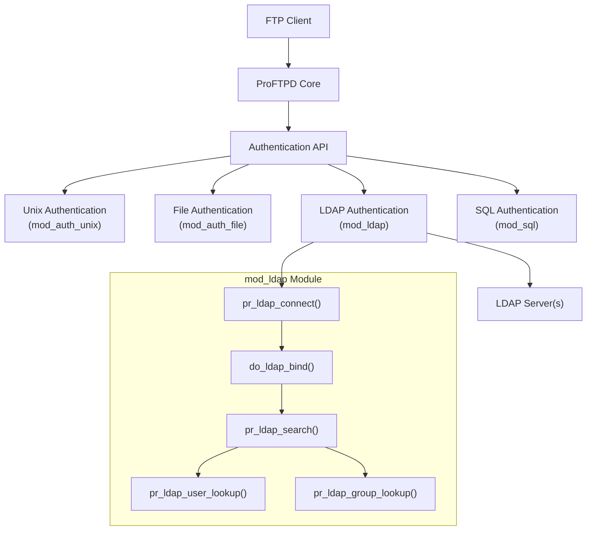
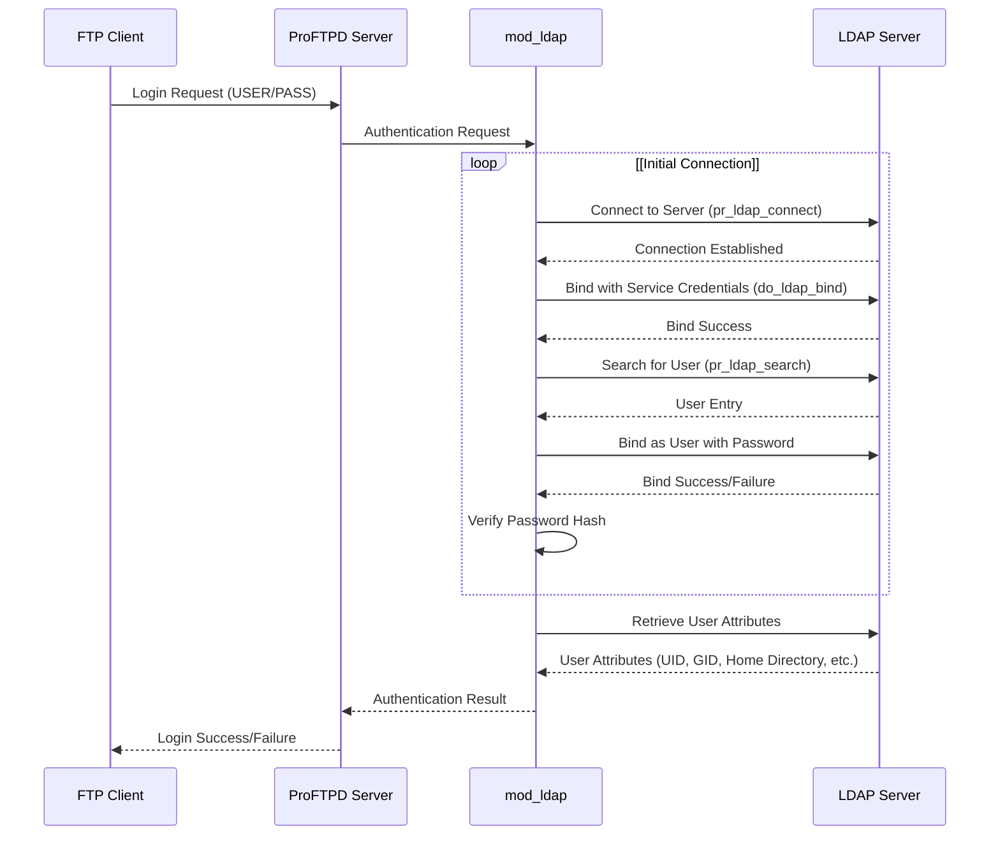

# LDAP Authentication

> **Relevant source files**
> * [contrib/mod_ldap.c](https://github.com/proftpd/proftpd/blob/362466f3/contrib/mod_ldap.c)
> * [doc/contrib/mod_ldap.html](https://github.com/proftpd/proftpd/blob/362466f3/doc/contrib/mod_ldap.html)
> * [doc/howto/ListOptions.html](https://github.com/proftpd/proftpd/blob/362466f3/doc/howto/ListOptions.html)
> * [doc/howto/Testing.html](https://github.com/proftpd/proftpd/blob/362466f3/doc/howto/Testing.html)
> * [doc/modules/mod_facts.html](https://github.com/proftpd/proftpd/blob/362466f3/doc/modules/mod_facts.html)
> * [doc/modules/mod_ls.html](https://github.com/proftpd/proftpd/blob/362466f3/doc/modules/mod_ls.html)
> * [tests/t/config/listoptions.t](https://github.com/proftpd/proftpd/blob/362466f3/tests/t/config/listoptions.t)
> * [tests/t/lib/ProFTPD/Tests/Config/ListOptions.pm](https://github.com/proftpd/proftpd/blob/362466f3/tests/t/lib/ProFTPD/Tests/Config/ListOptions.pm)

This document explains how ProFTPD's LDAP authentication system works, including configuration options, authentication flows, and best practices. LDAP authentication in ProFTPD enables user authentication against existing LDAP directories such as OpenLDAP, Microsoft Active Directory, and others. For information about other authentication methods like SQL authentication, see [SQL Authentication](/proftpd/proftpd/3.2-sql-authentication).

## Overview of LDAP Authentication in ProFTPD

ProFTPD's LDAP authentication is implemented through the `mod_ldap` module, which allows the FTP server to validate user credentials against an LDAP directory server. The module also supports retrieving user and group information such as UID/GID values, home directories, and quota settings from the LDAP directory.

### Key Features

* User authentication against LDAP directories
* Support for multiple LDAP servers (failover)
* TLS/SSL encryption for LDAP connections
* SASL authentication support
* User and group information retrieval
* Home directory generation
* Customizable LDAP attribute mapping
* Configurable search filters

## LDAP Authentication Architecture



Sources: [contrib/mod_ldap.c L233-L234](https://github.com/proftpd/proftpd/blob/362466f3/contrib/mod_ldap.c#L233-L234)

 [contrib/mod_ldap.c L673-L713](https://github.com/proftpd/proftpd/blob/362466f3/contrib/mod_ldap.c#L673-L713)

## LDAP Authentication Process Flow



Sources: [contrib/mod_ldap.c L673-L713](https://github.com/proftpd/proftpd/blob/362466f3/contrib/mod_ldap.c#L673-L713)

 [contrib/mod_ldap.c L402-L463](https://github.com/proftpd/proftpd/blob/362466f3/contrib/mod_ldap.c#L402-L463)

 [contrib/mod_ldap.c L798-L1158](https://github.com/proftpd/proftpd/blob/362466f3/contrib/mod_ldap.c#L798-L1158)

## Configuration Directives

The `mod_ldap` module provides numerous configuration directives to customize LDAP authentication behavior.

### Basic Configuration

To enable LDAP authentication, you need to specify the LDAP server and basic connection parameters:

```markdown
# Basic LDAP server configuration
LDAPServer ldap.example.com
LDAPBindDN "cn=proftpd,dc=example,dc=com" "password"
LDAPUsers dc=users,dc=example,dc=com
```

### Core Directives

| Directive | Description | Default |
| --- | --- | --- |
| `LDAPServer` | LDAP server host/URL and port | None |
| `LDAPBindDN` | DN and password for binding to LDAP | Anonymous bind |
| `LDAPUsers` | Base DN and search filter for users | None |
| `LDAPGroups` | Base DN and search filter for groups | None |
| `LDAPAuthBinds` | Enable user authentication via binding | on |
| `LDAPSearchScope` | Search scope for LDAP queries | subtree |
| `LDAPProtocolVersion` | LDAP protocol version to use | 3 |

Sources: [doc/contrib/mod_ldap.html L150-L156](https://github.com/proftpd/proftpd/blob/362466f3/doc/contrib/mod_ldap.html#L150-L156)

 [doc/contrib/mod_ldap.html L630-L654](https://github.com/proftpd/proftpd/blob/362466f3/doc/contrib/mod_ldap.html#L630-L654)

 [doc/contrib/mod_ldap.html L726-L753](https://github.com/proftpd/proftpd/blob/362466f3/doc/contrib/mod_ldap.html#L726-L753)

### Connection Settings

| Directive | Description | Default |
| --- | --- | --- |
| `LDAPConnectTimeout` | Timeout for LDAP server connections | Determined by LDAP API |
| `LDAPQueryTimeout` | Timeout for LDAP queries | 5 seconds |
| `LDAPAliasDereference` | How to handle LDAP aliases | never |

Sources: [contrib/mod_ldap.c L657-L662](https://github.com/proftpd/proftpd/blob/362466f3/contrib/mod_ldap.c#L657-L662)

 [doc/contrib/mod_ldap.html L186-L196](https://github.com/proftpd/proftpd/blob/362466f3/doc/contrib/mod_ldap.html#L186-L196)

 [doc/contrib/mod_ldap.html L564-L575](https://github.com/proftpd/proftpd/blob/362466f3/doc/contrib/mod_ldap.html#L564-L575)

### Authentication Settings

| Directive | Description | Default |
| --- | --- | --- |
| `LDAPDefaultAuthScheme` | Default authentication scheme for passwords | crypt |
| `LDAPUseSASL` | Use SASL authentication mechanisms | None |
| `LDAPUseTLS` | Enable STARTTLS for LDAP connections | None |

Sources: [doc/contrib/mod_ldap.html L200-L221](https://github.com/proftpd/proftpd/blob/362466f3/doc/contrib/mod_ldap.html#L200-L221)

 [doc/contrib/mod_ldap.html L757-L764](https://github.com/proftpd/proftpd/blob/362466f3/doc/contrib/mod_ldap.html#L757-L764)

 [doc/contrib/mod_ldap.html L757-L764](https://github.com/proftpd/proftpd/blob/362466f3/doc/contrib/mod_ldap.html#L757-L764)

### User/Group Attribute Mapping

The `LDAPAttr` directive allows remapping of standard LDAP attributes to non-standard attribute names:

```markdown
# Example: if your LDAP uses "loginName" instead of "uid"
LDAPAttr uid loginName
```

Default attribute mappings:

| LDAP Attribute | Description |
| --- | --- |
| `uid` | Username |
| `uidNumber` | User ID |
| `gidNumber` | Group ID |
| `homeDirectory` | Home directory path |
| `userPassword` | User password |
| `loginShell` | Login shell |
| `cn` | Common name |
| `memberUid` | Group member usernames |

Sources: [contrib/mod_ldap.c L196-L206](https://github.com/proftpd/proftpd/blob/362466f3/contrib/mod_ldap.c#L196-L206)

 [doc/contrib/mod_ldap.html L110-L128](https://github.com/proftpd/proftpd/blob/362466f3/doc/contrib/mod_ldap.html#L110-L128)

### Default Value Settings

| Directive | Description | Default |
| --- | --- | --- |
| `LDAPDefaultUID` | Default UID when not in LDAP | None |
| `LDAPDefaultGID` | Default GID when not in LDAP | None |
| `LDAPForceDefaultUID` | Always use default UID | None |
| `LDAPForceDefaultGID` | Always use default GID | None |
| `LDAPDefaultQuota` | Default quota when not in LDAP | None |

Sources: [doc/contrib/mod_ldap.html L226-L250](https://github.com/proftpd/proftpd/blob/362466f3/doc/contrib/mod_ldap.html#L226-L250)

 [doc/contrib/mod_ldap.html L268-L298](https://github.com/proftpd/proftpd/blob/362466f3/doc/contrib/mod_ldap.html#L268-L298)

 [doc/contrib/mod_ldap.html L254-L264](https://github.com/proftpd/proftpd/blob/362466f3/doc/contrib/mod_ldap.html#L254-L264)

## Home Directory Management

The `mod_ldap` module can generate home directories for users when no `homeDirectory` attribute is present in the LDAP directory.

| Directive | Description | Default |
| --- | --- | --- |
| `LDAPGenerateHomedir` | Enable home directory generation | off |
| `LDAPGenerateHomedirPrefix` | Prefix for generated home dirs | None |
| `LDAPGenerateHomedirPrefixNoUsername` | Skip adding username to prefix | off |
| `LDAPForceGeneratedHomedir` | Override LDAP home directory | off |

Home directory generation works like this:

1. If `LDAPGenerateHomedir` is enabled and the user has no `homeDirectory` attribute, a home directory is generated
2. The generated home directory is: `prefix/username` (or just `prefix` if `LDAPGenerateHomedirPrefixNoUsername` is on)
3. If `LDAPForceGeneratedHomedir` is enabled, the generated home directory is used even if the user has a `homeDirectory` attribute

Sources: [contrib/mod_ldap.c L934-L979](https://github.com/proftpd/proftpd/blob/362466f3/contrib/mod_ldap.c#L934-L979)

 [contrib/mod_ldap.c L1079-L1128](https://github.com/proftpd/proftpd/blob/362466f3/contrib/mod_ldap.c#L1079-L1128)

 [doc/contrib/mod_ldap.html L386-L455](https://github.com/proftpd/proftpd/blob/362466f3/doc/contrib/mod_ldap.html#L386-L455)

## LDAP Over TLS/SSL

The `mod_ldap` module supports secure LDAP connections using either LDAPS (LDAP over SSL) or STARTTLS.

### LDAPS (Deprecated)

```markdown
# Using LDAPS (deprecated)
LDAPServer ldaps://ldap.example.com:636
```

### STARTTLS (Recommended)

```markdown
# Using STARTTLS (recommended)
LDAPServer ldap://ldap.example.com:389
LDAPUseTLS on
```

For advanced TLS configuration, you can specify certificate files and validation options:

```markdown
# Advanced TLS configuration
LDAPServer ldap://ldap.example.com ssl-ca:/path/to/cacert.pem ssl-cert:/path/to/client-cert.pem ssl-key:/path/to/client-key.pem
```

Sources: [contrib/mod_ldap.c L517-L630](https://github.com/proftpd/proftpd/blob/362466f3/contrib/mod_ldap.c#L517-L630)

 [doc/contrib/mod_ldap.html L672-L722](https://github.com/proftpd/proftpd/blob/362466f3/doc/contrib/mod_ldap.html#L672-L722)

## SASL Authentication

The `mod_ldap` module supports SASL authentication for connecting to the LDAP server:

```markdown
# Using SASL authentication
LDAPBindDN "" ""
LDAPUseSASL DIGEST-MD5
```

The module uses the authentication ID extracted from the configured `LDAPBindDN` and the password from the `LDAPBindDN` directive.

Sources: [contrib/mod_ldap.c L330-L400](https://github.com/proftpd/proftpd/blob/362466f3/contrib/mod_ldap.c#L330-L400)

 [contrib/mod_ldap.c L406-L444](https://github.com/proftpd/proftpd/blob/362466f3/contrib/mod_ldap.c#L406-L444)

## LDAP Authentication Flows

The `mod_ldap` module supports two authentication methods, controlled by the `LDAPAuthBinds` directive:

### 1. Authentication by Binding (LDAPAuthBinds on)

1. ProFTPD connects to the LDAP server using the service credentials (`LDAPBindDN`)
2. The user's DN is located using the configured search filter
3. ProFTPD attempts to bind to the LDAP server using the user's DN and the provided password
4. If the bind succeeds, authentication is successful

This method supports any password encryption scheme supported by the LDAP server.

### 2. Authentication by Password Comparison (LDAPAuthBinds off)

1. ProFTPD connects to the LDAP server using the service credentials
2. The user's DN and password hash are retrieved from the LDAP server
3. The provided password is compared against the stored hash
4. If they match, authentication is successful

The password hash format is determined by the prefix in the LDAP `userPassword` attribute or by the `LDAPDefaultAuthScheme` directive.

Sources: [doc/contrib/mod_ldap.html L132-L156](https://github.com/proftpd/proftpd/blob/362466f3/doc/contrib/mod_ldap.html#L132-L156)

 [contrib/mod_ldap.c L402-L463](https://github.com/proftpd/proftpd/blob/362466f3/contrib/mod_ldap.c#L402-L463)

## Best Practices

1. **Use STARTTLS**: Always secure LDAP connections with STARTTLS rather than the deprecated LDAPS.
2. **Use Bind Authentication**: Enable `LDAPAuthBinds` to delegate authentication to the LDAP server rather than comparing passwords locally.
3. **Configure Connection Timeouts**: Set appropriate timeouts with `LDAPConnectTimeout` and `LDAPQueryTimeout` to prevent hanging connections.
4. **Set Default Values**: Configure fallback values with `LDAPDefaultUID` and `LDAPDefaultGID` for users without these attributes.
5. **Configure Multiple LDAP Servers**: For high availability, specify multiple LDAP servers: ``` LDAPServer ldap1.example.com ldap2.example.com ```
6. **Use Dedicated Service Account**: Create a dedicated service account with minimal privileges for the `LDAPBindDN`.
7. **Enable Logging**: Use `LDAPLog` to troubleshoot authentication issues: ``` LDAPLog /var/log/proftpd/ldap.log ```

Sources: [doc/contrib/mod_ldap.html L630-L663](https://github.com/proftpd/proftpd/blob/362466f3/doc/contrib/mod_ldap.html#L630-L663)

 [doc/contrib/mod_ldap.html L532-L546](https://github.com/proftpd/proftpd/blob/362466f3/doc/contrib/mod_ldap.html#L532-L546)

## Troubleshooting

Common issues and their solutions:

1. **Connection Problems**: * Verify LDAP server hostname and port * Check network connectivity and firewall rules * Verify SSL/TLS certificate validity
2. **Authentication Failures**: * Verify bind DN and password * Check user search base and filter * Verify that the user exists in the LDAP directory
3. **Attribute Mapping Issues**: * Confirm that your LDAP schema uses the expected attribute names or configure `LDAPAttr` directives * Use an LDAP browser to verify attribute values
4. **TLS/SSL Problems**: * Verify certificate paths and permissions * Check certificate validity dates * Ensure the CA certificate is trusted
5. **Performance Issues**: * Optimize LDAP search filters * Set appropriate connection and query timeouts * Consider adding LDAP indexes for frequently searched attributes

Sources: [contrib/mod_ldap.c L233-L256](https://github.com/proftpd/proftpd/blob/362466f3/contrib/mod_ldap.c#L233-L256)

 [contrib/mod_ldap.c L748-L796](https://github.com/proftpd/proftpd/blob/362466f3/contrib/mod_ldap.c#L748-L796)

## Example Configurations

### Basic LDAP Authentication

```xml
<IfModule mod_ldap.c>
  # Basic LDAP settings
  LDAPServer ldap.example.com
  LDAPBindDN "cn=proftpd,dc=example,dc=com" "secret"
  LDAPUsers dc=users,dc=example,dc=com
  
  # Authentication settings
  LDAPAuthBinds on
  LDAPSearchScope subtree
  
  # Default values
  LDAPDefaultUID 65534
  LDAPDefaultGID 65534
</IfModule>
```

### Secure LDAP with TLS

```xml
<IfModule mod_ldap.c>
  # Secure LDAP connection
  LDAPServer ldap://ldap.example.com
  LDAPUseTLS on
  
  # Authentication credentials
  LDAPBindDN "cn=proftpd,dc=example,dc=com" "secret"
  
  # User and group lookups
  LDAPUsers dc=users,dc=example,dc=com "(&(uid=%v)(objectclass=posixAccount))"
  LDAPGroups dc=groups,dc=example,dc=com
  
  # Home directory handling
  LDAPGenerateHomedir on
  LDAPGenerateHomedirPrefix /home/ftp
</IfModule>
```

### Active Directory Integration

```xml
<IfModule mod_ldap.c>
  # Active Directory connection
  LDAPServer ldap://ad.example.com
  LDAPBindDN "cn=proftpd,cn=Users,dc=example,dc=com" "secret"
  
  # AD-specific settings
  LDAPUsers "dc=example,dc=com" "(&(sAMAccountName=%v)(objectclass=user))"
  LDAPGroups "dc=example,dc=com" "(&(cn=%v)(objectclass=group))"
  
  # Custom attribute mapping for AD
  LDAPAttr uid sAMAccountName
  LDAPAttr uidNumber objectSid
  LDAPAttr gidNumber primaryGroupID
  LDAPAttr homeDirectory homeDirectory
  
  # Default values
  LDAPDefaultUID Auto
  LDAPDefaultGID Auto
</IfModule>
```

Sources: [doc/contrib/mod_ldap.html L174-L179](https://github.com/proftpd/proftpd/blob/362466f3/doc/contrib/mod_ldap.html#L174-L179)

 [doc/contrib/mod_ldap.html L635-L663](https://github.com/proftpd/proftpd/blob/362466f3/doc/contrib/mod_ldap.html#L635-L663)

## Integration with Other Modules

The `mod_ldap` module integrates with other ProFTPD modules:

1. **mod_auth**: LDAP is one of several authentication backends that can be configured in the authentication order.
2. **mod_quotatab**: LDAP can provide quota information through the `ftpQuota` attribute.
3. **mod_sftp**: LDAP can store SSH public keys for SFTP authentication using the `sshPublicKey` attribute.

The authentication order is controlled by the `AuthOrder` directive, allowing LDAP to be tried before or after other authentication methods.

Sources: [contrib/mod_ldap.c L204-L206](https://github.com/proftpd/proftpd/blob/362466f3/contrib/mod_ldap.c#L204-L206)