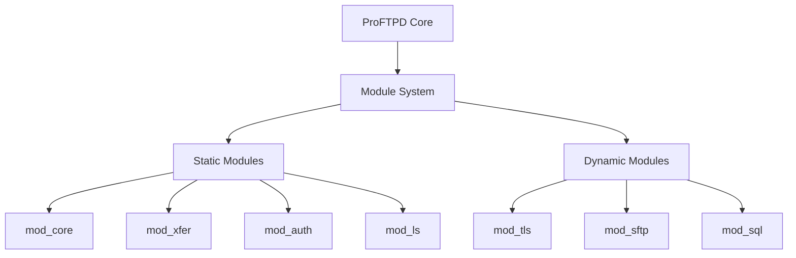
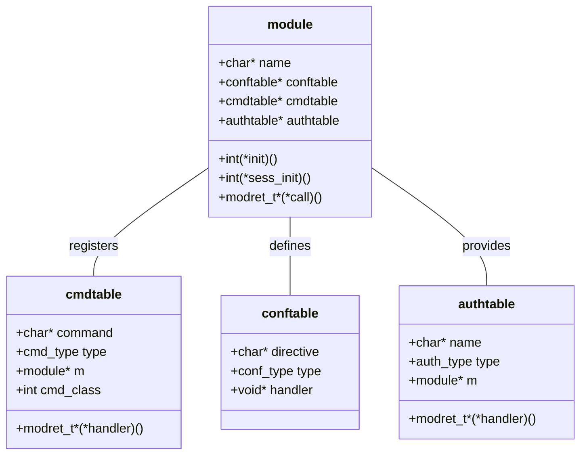
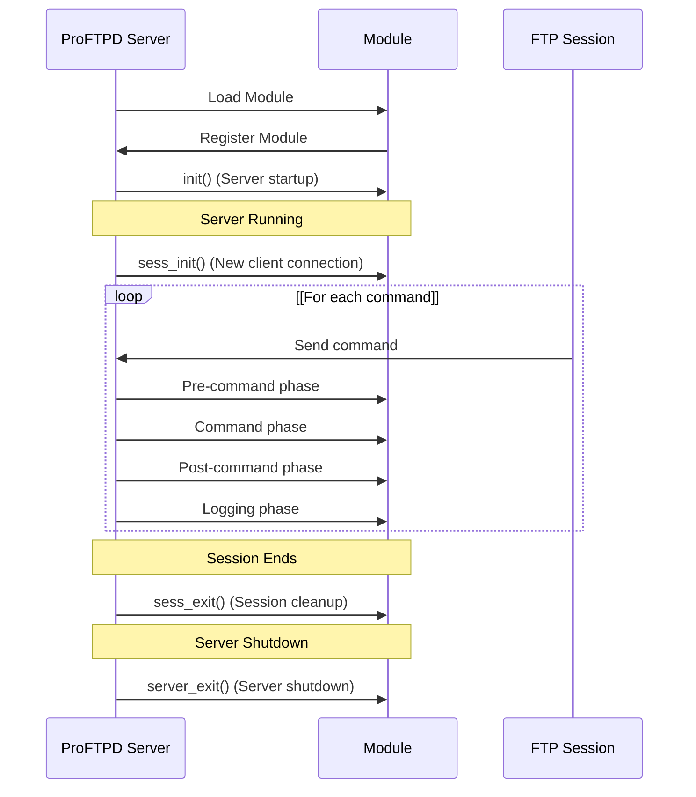
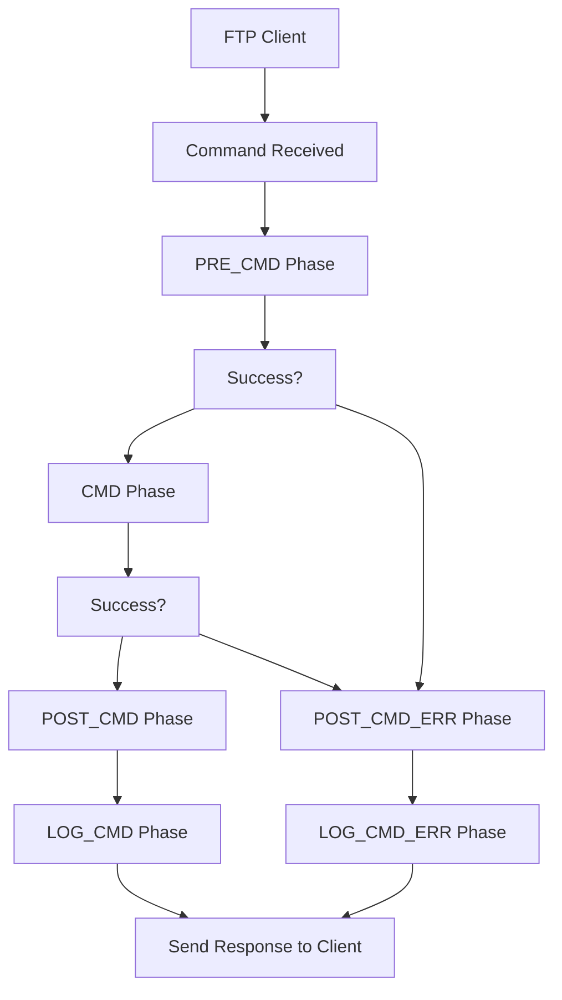
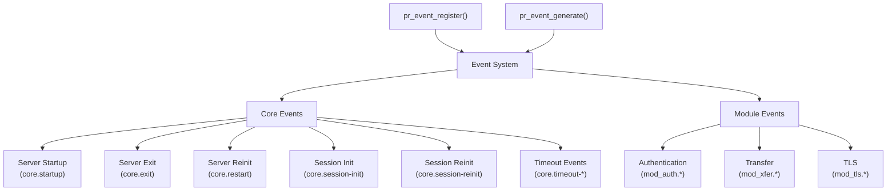
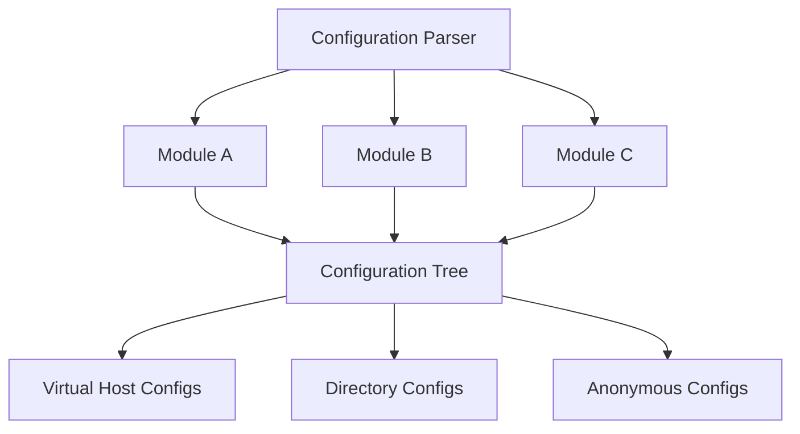
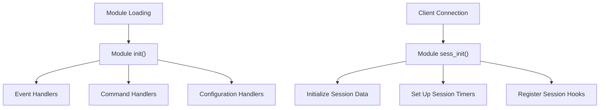
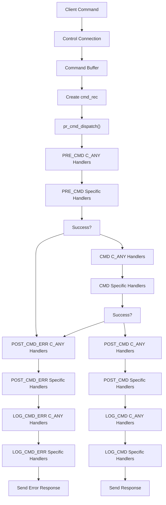

# Module API

> **Relevant source files**
> * [NEWS](https://github.com/proftpd/proftpd/blob/362466f3/NEWS)
> * [contrib/mod_ctrls_admin.c](https://github.com/proftpd/proftpd/blob/362466f3/contrib/mod_ctrls_admin.c)
> * [doc/modules/mod_delay.html](https://github.com/proftpd/proftpd/blob/362466f3/doc/modules/mod_delay.html)
> * [include/compat.h](https://github.com/proftpd/proftpd/blob/362466f3/include/compat.h)
> * [include/ctrls.h](https://github.com/proftpd/proftpd/blob/362466f3/include/ctrls.h)
> * [include/dirtree.h](https://github.com/proftpd/proftpd/blob/362466f3/include/dirtree.h)
> * [include/inet.h](https://github.com/proftpd/proftpd/blob/362466f3/include/inet.h)
> * [include/mod_ctrls.h](https://github.com/proftpd/proftpd/blob/362466f3/include/mod_ctrls.h)
> * [include/proftpd.h](https://github.com/proftpd/proftpd/blob/362466f3/include/proftpd.h)
> * [modules/mod_auth.c](https://github.com/proftpd/proftpd/blob/362466f3/modules/mod_auth.c)
> * [modules/mod_core.c](https://github.com/proftpd/proftpd/blob/362466f3/modules/mod_core.c)
> * [modules/mod_ctrls.c](https://github.com/proftpd/proftpd/blob/362466f3/modules/mod_ctrls.c)
> * [modules/mod_delay.c](https://github.com/proftpd/proftpd/blob/362466f3/modules/mod_delay.c)
> * [modules/mod_dso.c](https://github.com/proftpd/proftpd/blob/362466f3/modules/mod_dso.c)
> * [modules/mod_ls.c](https://github.com/proftpd/proftpd/blob/362466f3/modules/mod_ls.c)
> * [modules/mod_site.c](https://github.com/proftpd/proftpd/blob/362466f3/modules/mod_site.c)
> * [modules/mod_xfer.c](https://github.com/proftpd/proftpd/blob/362466f3/modules/mod_xfer.c)
> * [src/ctrls.c](https://github.com/proftpd/proftpd/blob/362466f3/src/ctrls.c)
> * [src/data.c](https://github.com/proftpd/proftpd/blob/362466f3/src/data.c)
> * [src/dirtree.c](https://github.com/proftpd/proftpd/blob/362466f3/src/dirtree.c)
> * [src/ftpdctl.c](https://github.com/proftpd/proftpd/blob/362466f3/src/ftpdctl.c)
> * [src/inet.c](https://github.com/proftpd/proftpd/blob/362466f3/src/inet.c)
> * [src/main.c](https://github.com/proftpd/proftpd/blob/362466f3/src/main.c)
> * [tests/api/ctrls.c](https://github.com/proftpd/proftpd/blob/362466f3/tests/api/ctrls.c)
> * [tests/t/lib/ProFTPD/Tests/Modules/mod_ctrls.pm](https://github.com/proftpd/proftpd/blob/362466f3/tests/t/lib/ProFTPD/Tests/Modules/mod_ctrls.pm)
> * [tests/t/lib/ProFTPD/Tests/Modules/mod_delay.pm](https://github.com/proftpd/proftpd/blob/362466f3/tests/t/lib/ProFTPD/Tests/Modules/mod_delay.pm)
> * [tests/t/modules/mod_ctrls.t](https://github.com/proftpd/proftpd/blob/362466f3/tests/t/modules/mod_ctrls.t)
> * [tests/t/modules/mod_delay.t](https://github.com/proftpd/proftpd/blob/362466f3/tests/t/modules/mod_delay.t)

The Module API in ProFTPD provides the framework for extending the server's functionality through modules. This document explains how modules are structured, loaded, and integrated with the core server, as well as how to implement various types of handlers for commands, authentication, and events.

For information about the Controls API, which some modules use to provide administrative controls, see [Controls API](/proftpd/proftpd/6.2-controls-api).

## Introduction to the Module Architecture

ProFTPD is designed around a modular architecture where the core server delegates specific functionality to modules. The module system allows for extensibility while maintaining a clean separation between the core server and optional features.



Sources: [modules/mod_core.c](https://github.com/proftpd/proftpd/blob/362466f3/modules/mod_core.c)

 [src/main.c L53-L54](https://github.com/proftpd/proftpd/blob/362466f3/src/main.c#L53-L54)

 [modules/mod_dso.c](https://github.com/proftpd/proftpd/blob/362466f3/modules/mod_dso.c)

## Module Structure

Each module in ProFTPD is defined by a `module` structure that contains metadata about the module and function pointers to various handlers. This structure serves as the module's identity within the server.



Sources: [modules/mod_core.c L53](https://github.com/proftpd/proftpd/blob/362466f3/modules/mod_core.c#L53-L53)

 [modules/mod_auth.c L42](https://github.com/proftpd/proftpd/blob/362466f3/modules/mod_auth.c#L42-L42)

 [modules/mod_xfer.c L79](https://github.com/proftpd/proftpd/blob/362466f3/modules/mod_xfer.c#L79-L79)

## Module Lifecycle

Modules go through a defined lifecycle from loading to unloading, with initialization points and opportunities to hook into session events.



Sources: [src/main.c L621-L798](https://github.com/proftpd/proftpd/blob/362466f3/src/main.c#L621-L798)

 [modules/mod_auth.c L158-L168](https://github.com/proftpd/proftpd/blob/362466f3/modules/mod_auth.c#L158-L168)

 [modules/mod_core.c L64-L74](https://github.com/proftpd/proftpd/blob/362466f3/modules/mod_core.c#L64-L74)

## Static vs. Dynamic Modules

ProFTPD supports both statically linked modules and dynamically loaded modules:

| Module Type | Description | Loading Mechanism |
| --- | --- | --- |
| Static | Compiled directly into the server binary | Loaded at server startup automatically |
| Dynamic | Compiled as separate shared objects (.so files) | Loaded through the `LoadModule` directive using `mod_dso` |

Static modules are compiled into the server and always available, while dynamic modules provide flexibility to add or remove functionality without recompiling the server.

Sources: [modules/mod_dso.c](https://github.com/proftpd/proftpd/blob/362466f3/modules/mod_dso.c)

 [src/main.c L53-L54](https://github.com/proftpd/proftpd/blob/362466f3/src/main.c#L53-L54)

## Command Handling

One of the primary tasks of modules is to handle FTP commands. ProFTPD breaks command processing into multiple phases, allowing modules to intervene at different points.

### Command Phases

| Phase | Purpose | When Called |
| --- | --- | --- |
| PRE_CMD | Pre-processing before command execution | Before command is validated |
| CMD | Actual command execution | After command is validated |
| POST_CMD | Post-processing after successful command | After successful command execution |
| POST_CMD_ERR | Error handling after failed command | After failed command execution |
| LOG_CMD | Logging for successful command | After POST_CMD phase |
| LOG_CMD_ERR | Logging for failed command | After POST_CMD_ERR phase |



Sources: [src/main.c L621-L798](https://github.com/proftpd/proftpd/blob/362466f3/src/main.c#L621-L798)

 [src/main.c L232-L455](https://github.com/proftpd/proftpd/blob/362466f3/src/main.c#L232-L455)

### Registering Command Handlers

Modules register command handlers using command tables that map FTP commands to handler functions. Each entry in the command table specifies:

1. The command name
2. The command phase
3. The handler function
4. Command class for logging

Example of a command table entry:

```
static cmdtable mod_example_cmdtab[] = {
  { PRE_CMD,  C_USER, G_NONE, example_pre_user,  FALSE, FALSE },
  { CMD,      C_USER, G_NONE, example_user,      FALSE, FALSE },
  { POST_CMD, C_USER, G_NONE, example_post_user, FALSE, FALSE },
  { 0, NULL }
};
```

Sources: [modules/mod_core.c L5555-L5761](https://github.com/proftpd/proftpd/blob/362466f3/modules/mod_core.c#L5555-L5761)

 [modules/mod_auth.c L1888-L1913](https://github.com/proftpd/proftpd/blob/362466f3/modules/mod_auth.c#L1888-L1913)

## Event System

ProFTPD provides an event system that allows modules to register callbacks for various server events. This allows modules to respond to server lifecycle events without directly handling commands.



Sources: [modules/mod_auth.c L131-L165](https://github.com/proftpd/proftpd/blob/362466f3/modules/mod_auth.c#L131-L165)

 [modules/mod_delay.c L347-L352](https://github.com/proftpd/proftpd/blob/362466f3/modules/mod_delay.c#L347-L352)

### Registering Event Handlers

Modules register event handlers using the `pr_event_register()` function, which takes:

1. The module registering the handler
2. The event name
3. The callback function
4. Optional data to pass to the callback

Example:

```
pr_event_register("mod_example", "core.session-init", session_init_ev, NULL);
```

### Generating Events

Modules can generate events using the `pr_event_generate()` function, which takes:

1. The event name
2. Optional event data

Example:

```
pr_event_generate("mod_example.custom_event", session_data);
```

Sources: [modules/mod_auth.c L131-L165](https://github.com/proftpd/proftpd/blob/362466f3/modules/mod_auth.c#L131-L165)

 [modules/mod_core.c L64-L74](https://github.com/proftpd/proftpd/blob/362466f3/modules/mod_core.c#L64-L74)

## Configuration Directives

Modules can define and handle configuration directives that users can set in the server configuration file. These directives are processed during server startup or when the configuration is reloaded.



Sources: [modules/mod_core.c L444-L467](https://github.com/proftpd/proftpd/blob/362466f3/modules/mod_core.c#L444-L467)

 [src/dirtree.c](https://github.com/proftpd/proftpd/blob/362466f3/src/dirtree.c)

### Registering Configuration Directives

Modules register configuration directives using a configuration table that maps directive names to handler functions. Each entry in the configuration table specifies:

1. The directive name
2. The handler function
3. The configuration context where the directive is valid

Example of a configuration table entry:

```
static conftable example_conftab[] = {
  { "ExampleDirective", set_example_directive, NULL },
  { NULL }
};
```

The handler function processes the directive and creates a `config_rec` structure that stores the directive's parameters. This structure is added to the configuration tree for later retrieval.

Sources: [modules/mod_core.c L444-L467](https://github.com/proftpd/proftpd/blob/362466f3/modules/mod_core.c#L444-L467)

 [modules/mod_auth.c L1888-L1913](https://github.com/proftpd/proftpd/blob/362466f3/modules/mod_auth.c#L1888-L1913)

## Module Initialization

Modules perform initialization in two main functions:

1. `init()` - Called when the module is loaded, typically used to register handlers and set up global data
2. `sess_init()` - Called when a new client session starts, used to initialize session-specific data



Sources: [modules/mod_auth.c L170-L180](https://github.com/proftpd/proftpd/blob/362466f3/modules/mod_auth.c#L170-L180)

 [modules/mod_auth.c L183-L332](https://github.com/proftpd/proftpd/blob/362466f3/modules/mod_auth.c#L183-L332)

### Module Registration

Modules register themselves with the core server by defining a `module` structure with their name, version, and handlers. This structure is then referenced in the server's module list.

For static modules, this registration happens automatically during compilation. For dynamic modules loaded with `mod_dso`, the module must provide a specific entry point function.

Sources: [modules/mod_core.c L53](https://github.com/proftpd/proftpd/blob/362466f3/modules/mod_core.c#L53-L53)

 [modules/mod_dso.c](https://github.com/proftpd/proftpd/blob/362466f3/modules/mod_dso.c)

## Handler Return Values

Handlers in ProFTPD use a `modret_t` structure to return values and status information. This structure allows handlers to indicate success, failure, or whether they handled the request.

| Return Value | Meaning |
| --- | --- |
| HANDLED(cmd) | The handler successfully processed the command |
| ERROR(cmd) | The handler encountered an error processing the command |
| ERROR_INT(cmd, err_code) | The handler encountered an error with a specific code |
| ERROR_MSG(cmd, msg) | The handler encountered an error with a specific message |
| DECLINED(cmd) | The handler did not process the command |

Sources: [src/main.c L369-L404](https://github.com/proftpd/proftpd/blob/362466f3/src/main.c#L369-L404)

## Developing a Module

When developing a new ProFTPD module, you'll need to implement the following components:

1. **Module Structure** - Define the module structure with metadata and handlers
2. **Initialization Functions** - Implement `init()` and `sess_init()` functions
3. **Command Handlers** - Implement handlers for FTP commands
4. **Configuration Handlers** - Implement handlers for configuration directives
5. **Event Handlers** - Implement handlers for server events

### Module Template

Here's a basic template for a ProFTPD module:

```javascript
#include "conf.h"

static int example_init(void) {
    /* Register event handlers, etc. */
    return 0;
}

static int example_sess_init(void) {
    /* Initialize session data */
    return 0;
}

MODRET example_cmd(cmd_rec *cmd) {
    /* Handle command */
    return PR_HANDLED(cmd);
}

MODRET set_example_directive(cmd_rec *cmd) {
    /* Handle configuration directive */
    return PR_HANDLED(cmd);
}

static conftable example_conftab[] = {
    { "ExampleDirective", set_example_directive, NULL },
    { NULL }
};

static cmdtable example_cmdtab[] = {
    { CMD, C_SITE, G_NONE, example_cmd, FALSE, FALSE },
    { 0, NULL }
};

module example_module = {
    NULL, NULL,              /* Always NULL */
    0x20,                    /* API version */
    "example",               /* Module name */
    example_conftab,         /* Configuration directive table */
    example_cmdtab,          /* Command handler table */
    NULL,                    /* Authentication handler table */
    NULL,                    /* Initialization function */
    example_sess_init,       /* Session initialization function */
    MOD_EXAMPLE_VERSION      /* Module version */
};
```

Sources: [modules/mod_core.c](https://github.com/proftpd/proftpd/blob/362466f3/modules/mod_core.c)

 [modules/mod_auth.c](https://github.com/proftpd/proftpd/blob/362466f3/modules/mod_auth.c)

 [modules/mod_xfer.c](https://github.com/proftpd/proftpd/blob/362466f3/modules/mod_xfer.c)

## Key API Functions

The following table lists some of the key API functions available to modules:

| Function | Purpose |
| --- | --- |
| `pr_log_debug()` | Log debug messages |
| `pr_log_pri()` | Log messages with specific priority |
| `pr_response_add()` | Add response line to be sent to client |
| `pr_response_send()` | Send response to client |
| `pr_config_add_set()` | Add a configuration set |
| `pr_config_add_server_set()` | Add a server configuration set |
| `find_config()` | Find a configuration record |
| `add_config_param()` | Add a configuration parameter |
| `pr_event_register()` | Register an event handler |
| `pr_event_generate()` | Generate an event |
| `pr_netio_read()` | Read from network |
| `pr_netio_write()` | Write to network |
| `pr_fs_stat()` | Get file status |
| `pr_fs_open()` | Open a file |

Sources: [src/main.c](https://github.com/proftpd/proftpd/blob/362466f3/src/main.c)

 [src/dirtree.c](https://github.com/proftpd/proftpd/blob/362466f3/src/dirtree.c)

## Command Dispatch Flow

This diagram illustrates how commands flow through the ProFTPD module system:



Sources: [src/main.c L621-L798](https://github.com/proftpd/proftpd/blob/362466f3/src/main.c#L621-L798)

 [src/main.c L232-L455](https://github.com/proftpd/proftpd/blob/362466f3/src/main.c#L232-L455)

## Module Communications

Modules can communicate with each other through several mechanisms:

1. **Event System** - Generate events that other modules listen for
2. **Configuration Storage** - Store data in the configuration tree for other modules to retrieve
3. **Session Notes** - Store session-specific data in the session notes table
4. **Controls API** - Use the Controls API for inter-module communication

Sources: [modules/mod_auth.c](https://github.com/proftpd/proftpd/blob/362466f3/modules/mod_auth.c)

 [modules/mod_ctrls.c](https://github.com/proftpd/proftpd/blob/362466f3/modules/mod_ctrls.c)

## Best Practices

When developing modules for ProFTPD, consider the following best practices:

1. **Use Memory Pools** - Always allocate memory from pools to avoid memory leaks
2. **Handle Signals** - Use pr_signals_handle() in loops to ensure proper signal handling
3. **Check Return Values** - Always check return values from API functions
4. **Use Proper Return Values** - Return the correct modret_t values from handlers
5. **Respect Configuration Contexts** - Only process directives in their appropriate contexts
6. **Handle Errors Gracefully** - Provide meaningful error messages and handle errors properly
7. **Document Your Module** - Provide documentation for your module's directives and functionality

Sources: [modules/mod_core.c](https://github.com/proftpd/proftpd/blob/362466f3/modules/mod_core.c)

 [modules/mod_auth.c](https://github.com/proftpd/proftpd/blob/362466f3/modules/mod_auth.c)

## Conclusion

The ProFTPD Module API provides a powerful and flexible framework for extending the server's functionality. By implementing the appropriate handlers and following the module lifecycle, developers can add new features, protocols, and integrations to ProFTPD without modifying the core server code.