# Module System

> **Relevant source files**
> * [NEWS](https://github.com/proftpd/proftpd/blob/362466f3/NEWS)
> * [contrib/mod_ctrls_admin.c](https://github.com/proftpd/proftpd/blob/362466f3/contrib/mod_ctrls_admin.c)
> * [doc/modules/mod_delay.html](https://github.com/proftpd/proftpd/blob/362466f3/doc/modules/mod_delay.html)
> * [include/compat.h](https://github.com/proftpd/proftpd/blob/362466f3/include/compat.h)
> * [include/ctrls.h](https://github.com/proftpd/proftpd/blob/362466f3/include/ctrls.h)
> * [include/dirtree.h](https://github.com/proftpd/proftpd/blob/362466f3/include/dirtree.h)
> * [include/inet.h](https://github.com/proftpd/proftpd/blob/362466f3/include/inet.h)
> * [include/mod_ctrls.h](https://github.com/proftpd/proftpd/blob/362466f3/include/mod_ctrls.h)
> * [include/proftpd.h](https://github.com/proftpd/proftpd/blob/362466f3/include/proftpd.h)
> * [modules/mod_auth.c](https://github.com/proftpd/proftpd/blob/362466f3/modules/mod_auth.c)
> * [modules/mod_core.c](https://github.com/proftpd/proftpd/blob/362466f3/modules/mod_core.c)
> * [modules/mod_ctrls.c](https://github.com/proftpd/proftpd/blob/362466f3/modules/mod_ctrls.c)
> * [modules/mod_delay.c](https://github.com/proftpd/proftpd/blob/362466f3/modules/mod_delay.c)
> * [modules/mod_dso.c](https://github.com/proftpd/proftpd/blob/362466f3/modules/mod_dso.c)
> * [modules/mod_ls.c](https://github.com/proftpd/proftpd/blob/362466f3/modules/mod_ls.c)
> * [modules/mod_site.c](https://github.com/proftpd/proftpd/blob/362466f3/modules/mod_site.c)
> * [modules/mod_xfer.c](https://github.com/proftpd/proftpd/blob/362466f3/modules/mod_xfer.c)
> * [src/ctrls.c](https://github.com/proftpd/proftpd/blob/362466f3/src/ctrls.c)
> * [src/data.c](https://github.com/proftpd/proftpd/blob/362466f3/src/data.c)
> * [src/dirtree.c](https://github.com/proftpd/proftpd/blob/362466f3/src/dirtree.c)
> * [src/ftpdctl.c](https://github.com/proftpd/proftpd/blob/362466f3/src/ftpdctl.c)
> * [src/inet.c](https://github.com/proftpd/proftpd/blob/362466f3/src/inet.c)
> * [src/main.c](https://github.com/proftpd/proftpd/blob/362466f3/src/main.c)
> * [tests/api/ctrls.c](https://github.com/proftpd/proftpd/blob/362466f3/tests/api/ctrls.c)
> * [tests/t/lib/ProFTPD/Tests/Modules/mod_ctrls.pm](https://github.com/proftpd/proftpd/blob/362466f3/tests/t/lib/ProFTPD/Tests/Modules/mod_ctrls.pm)
> * [tests/t/lib/ProFTPD/Tests/Modules/mod_delay.pm](https://github.com/proftpd/proftpd/blob/362466f3/tests/t/lib/ProFTPD/Tests/Modules/mod_delay.pm)
> * [tests/t/modules/mod_ctrls.t](https://github.com/proftpd/proftpd/blob/362466f3/tests/t/modules/mod_ctrls.t)
> * [tests/t/modules/mod_delay.t](https://github.com/proftpd/proftpd/blob/362466f3/tests/t/modules/mod_delay.t)

The ProFTPD Module System is the extensible architecture that allows the FTP server to be customized through modular components. This document explains how modules are structured, loaded, and integrated with the core server, as well as how they handle commands, configuration directives, and events. For information about specific module APIs, see [Module API](/proftpd/proftpd/6.1-module-api), and for information about the administrative control system for modules, see [Controls API](/proftpd/proftpd/6.2-controls-api).

## Architecture Overview

ProFTPD uses a modular architecture that consists of a core engine surrounded by modules that provide specific functionality. Modules can be either statically linked into the server binary or dynamically loaded at runtime.

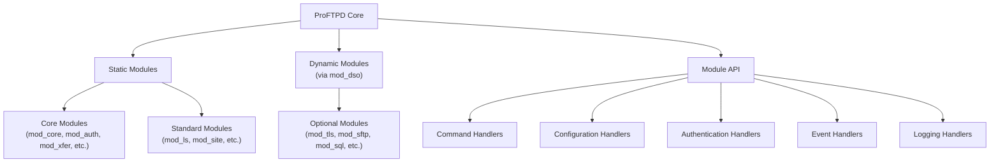

Sources: [modules/mod_core.c L53](https://github.com/proftpd/proftpd/blob/362466f3/modules/mod_core.c#L53-L53)

 [src/main.c L52-L54](https://github.com/proftpd/proftpd/blob/362466f3/src/main.c#L52-L54)

 [modules/mod_dso.c L39-L43](https://github.com/proftpd/proftpd/blob/362466f3/modules/mod_dso.c#L39-L43)

## Module Types

### Static Modules

Static modules are compiled directly into the ProFTPD binary. The core modules like `mod_core`, `mod_auth`, and `mod_xfer` provide essential functionality and are always available. Static modules are defined in the source code and cannot be removed or added without recompiling the server.

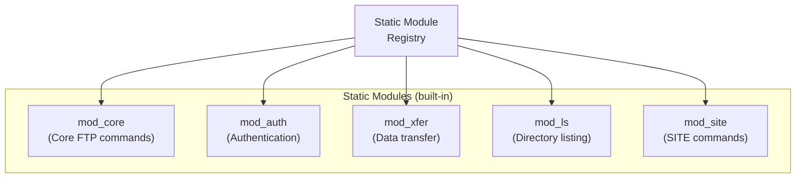

Sources: [src/main.c L52-L54](https://github.com/proftpd/proftpd/blob/362466f3/src/main.c#L52-L54)

 [modules/mod_core.c L53-L69](https://github.com/proftpd/proftpd/blob/362466f3/modules/mod_core.c#L53-L69)

 [modules/mod_auth.c L42-L76](https://github.com/proftpd/proftpd/blob/362466f3/modules/mod_auth.c#L42-L76)

 [modules/mod_xfer.c L79-L84](https://github.com/proftpd/proftpd/blob/362466f3/modules/mod_xfer.c#L79-L84)

 [modules/mod_ls.c L60-L73](https://github.com/proftpd/proftpd/blob/362466f3/modules/mod_ls.c#L60-L73)

 [modules/mod_site.c L31-L42](https://github.com/proftpd/proftpd/blob/362466f3/modules/mod_site.c#L31-L42)

### Dynamic Modules

Dynamic modules are loaded at runtime via the `mod_dso` module. This allows for extending the server's functionality without recompiling. Dynamic modules are typically loaded using the `LoadModule` directive in the configuration file.

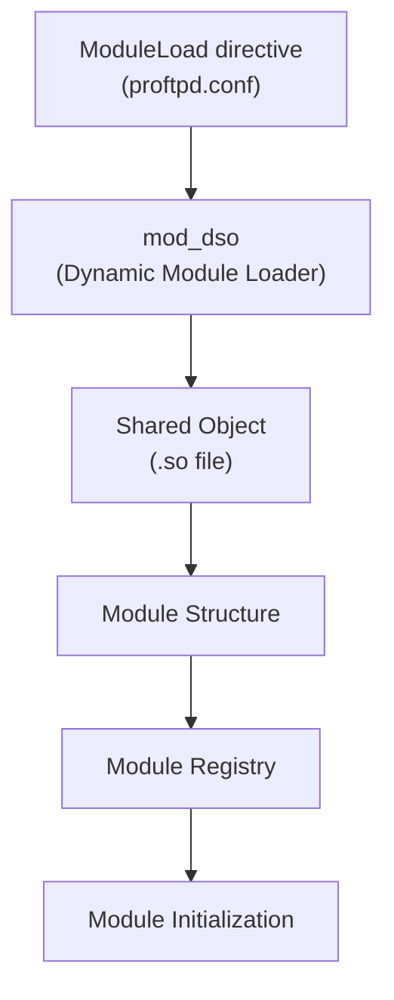

Sources: [modules/mod_dso.c L39-L44](https://github.com/proftpd/proftpd/blob/362466f3/modules/mod_dso.c#L39-L44)

 [modules/mod_dso.c L175-L245](https://github.com/proftpd/proftpd/blob/362466f3/modules/mod_dso.c#L175-L245)

## Module Structure and Lifecycle

Each module in ProFTPD is represented by a `module` structure that contains information about the module and pointers to various handler functions.

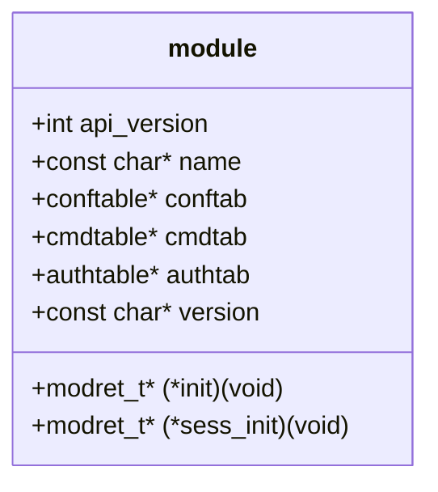

The lifecycle of a module consists of several phases:

1. **Registration**: Module is loaded and registered with the core
2. **Configuration**: Module's configuration directives are processed
3. **Initialization**: Module's `init` function is called during server startup
4. **Session Initialization**: Module's `sess_init` function is called for each client connection
5. **Command/Event Handling**: Module handles commands and events during the session
6. **Session Cleanup**: Module cleans up session resources

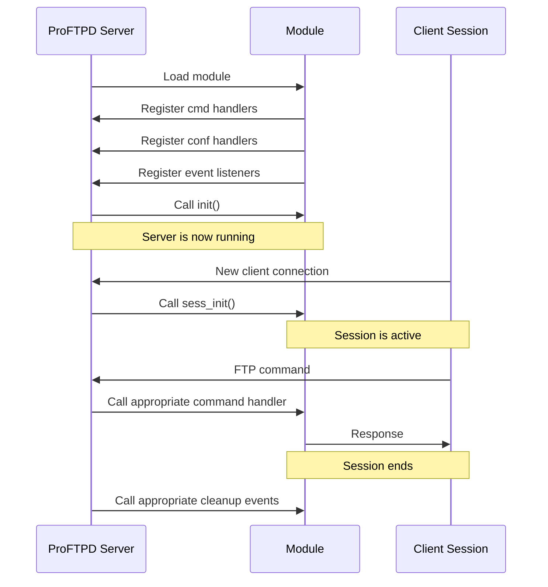

Sources: [src/main.c L52-L54](https://github.com/proftpd/proftpd/blob/362466f3/src/main.c#L52-L54)

 [src/main.c L232-L243](https://github.com/proftpd/proftpd/blob/362466f3/src/main.c#L232-L243)

 [src/main.c L374-L422](https://github.com/proftpd/proftpd/blob/362466f3/src/main.c#L374-L422)

 [modules/mod_core.c L66-L74](https://github.com/proftpd/proftpd/blob/362466f3/modules/mod_core.c#L66-L74)

 [modules/mod_auth.c L170-L182](https://github.com/proftpd/proftpd/blob/362466f3/modules/mod_auth.c#L170-L182)

 [modules/mod_auth.c L332-L368](https://github.com/proftpd/proftpd/blob/362466f3/modules/mod_auth.c#L332-L368)

## Command Processing

The command processing in ProFTPD involves several phases, allowing multiple modules to participate in handling a single command.

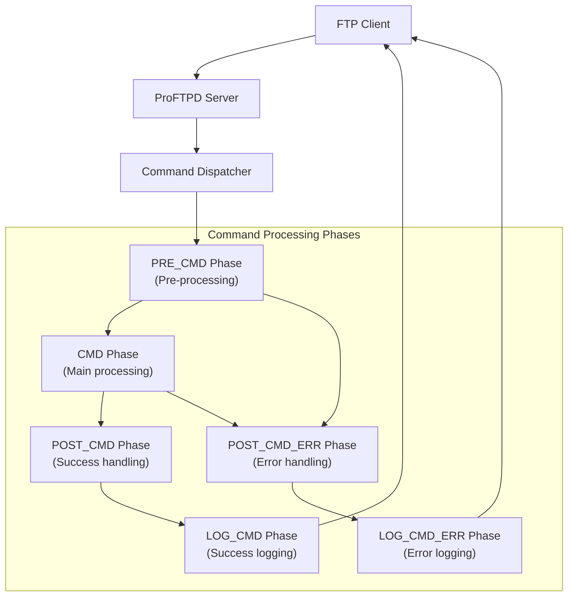

When a command is received, the server:

1. Dispatches the command to all modules registered for the PRE_CMD phase
2. If PRE_CMD succeeds, dispatches to modules for the CMD phase
3. Based on success/failure, dispatches to POST_CMD or POST_CMD_ERR
4. Finally, dispatches to LOG_CMD or LOG_CMD_ERR for logging

Sources: [src/main.c L232-L321](https://github.com/proftpd/proftpd/blob/362466f3/src/main.c#L232-L321)

 [src/main.c L621-L798](https://github.com/proftpd/proftpd/blob/362466f3/src/main.c#L621-L798)

## Module Registration and Stash Tables

Modules register their handlers in different stash tables based on the handler type (command, configuration, authentication, etc.). These stash tables allow the core server to find the appropriate handler when needed.

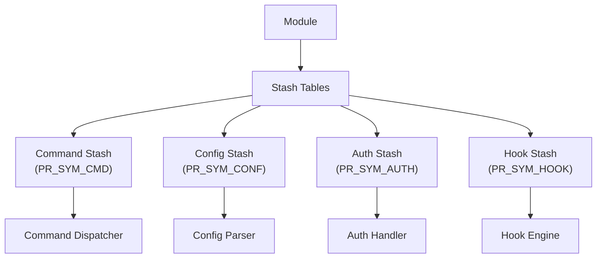

This stash system allows multiple modules to register handlers for the same command or configuration directive, creating a chain of handlers that can be processed in order.

Sources: [src/main.c L220-L230](https://github.com/proftpd/proftpd/blob/362466f3/src/main.c#L220-L230)

 [src/main.c L262-L273](https://github.com/proftpd/proftpd/blob/362466f3/src/main.c#L262-L273)

## Configuration Directive Handling

Modules can register handlers for configuration directives using a configuration table (`conftable`). When the configuration file is parsed, the server looks up handlers for each directive in the stash table.

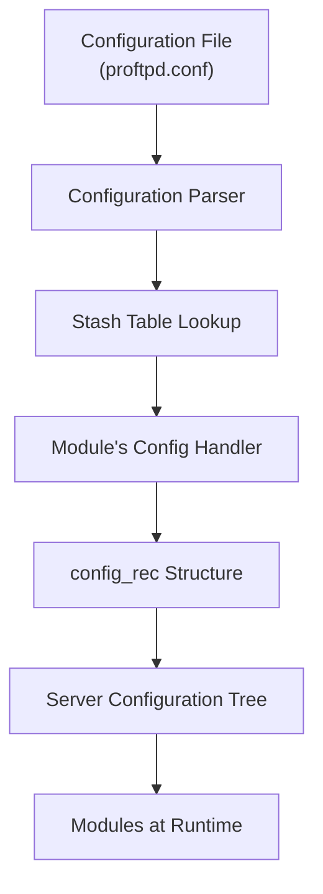

Configuration handlers create `config_rec` structures that are added to the server's configuration tree. Modules can then access these structures at runtime using functions like `find_config()`.

Sources: [src/dirtree.c L35-L42](https://github.com/proftpd/proftpd/blob/362466f3/src/dirtree.c#L35-L42)

 [modules/mod_core.c L196-L251](https://github.com/proftpd/proftpd/blob/362466f3/modules/mod_core.c#L196-L251)

 [modules/mod_core.c L444-L467](https://github.com/proftpd/proftpd/blob/362466f3/modules/mod_core.c#L444-L467)

## Dynamic Module Loading (mod_dso)

The `mod_dso` module provides support for loading modules at runtime. Modules are loaded as shared objects (.so files) and integrated into the server's module system.

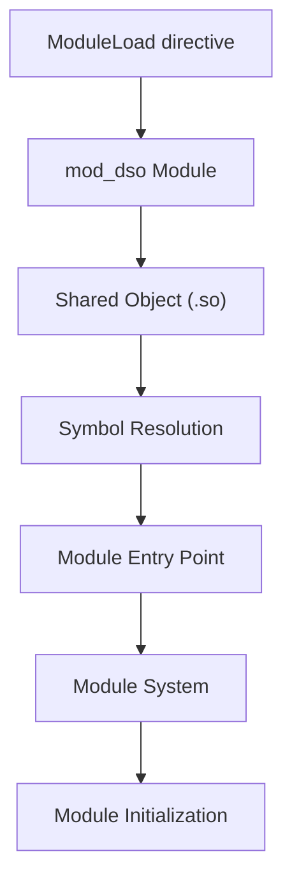

The dynamic module loading process:

1. The `ModuleLoad` directive specifies a module to load
2. `mod_dso` opens the shared object file using `dlopen()`
3. It looks up the module entry point using `dlsym()`
4. The module is registered with the core system
5. The module's initialization function is called

Sources: [modules/mod_dso.c L39-L43](https://github.com/proftpd/proftpd/blob/362466f3/modules/mod_dso.c#L39-L43)

 [modules/mod_dso.c L175-L245](https://github.com/proftpd/proftpd/blob/362466f3/modules/mod_dso.c#L175-L245)

## Controls System (mod_ctrls)

The Controls system provides a mechanism for runtime administration of the server through the `ftpdctl` utility. Modules can register control actions that can be invoked through this interface.

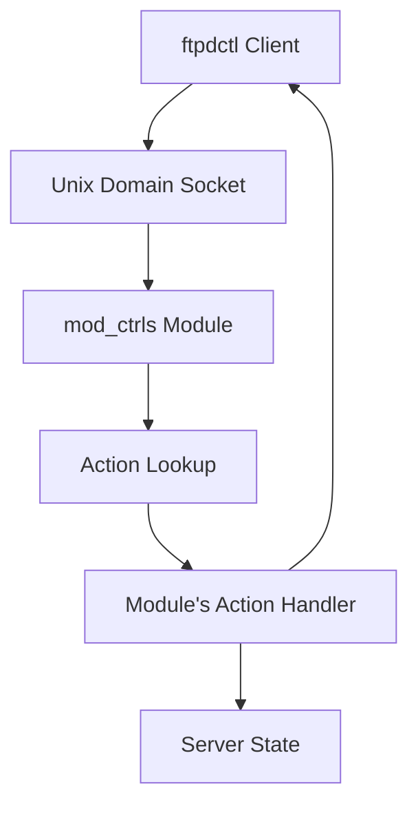

The Controls system allows for:

* Server status monitoring
* Virtual host management
* User session management
* Module-specific administration

Sources: [modules/mod_ctrls.c L43-L47](https://github.com/proftpd/proftpd/blob/362466f3/modules/mod_ctrls.c#L43-L47)

 [modules/mod_ctrls.c L425-L617](https://github.com/proftpd/proftpd/blob/362466f3/modules/mod_ctrls.c#L425-L617)

 [src/ctrls.c L59-L71](https://github.com/proftpd/proftpd/blob/362466f3/src/ctrls.c#L59-L71)

 [contrib/mod_ctrls_admin.c L32-L43](https://github.com/proftpd/proftpd/blob/362466f3/contrib/mod_ctrls_admin.c#L32-L43)

## Event System

The event system provides a way for modules to register interest in specific events and be notified when those events occur. Events include server startup/shutdown, client connection/disconnection, authentication, and more.

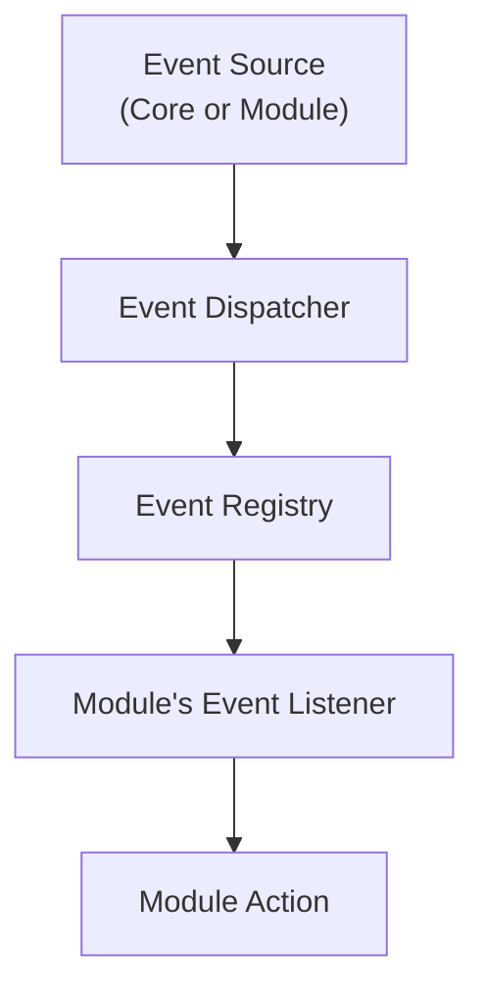

Modules register event listeners using `pr_event_register()` and can generate events using `pr_event_generate()`. This system allows for loose coupling between modules.

Sources: [modules/mod_core.c L64-L65](https://github.com/proftpd/proftpd/blob/362466f3/modules/mod_core.c#L64-L65)

 [modules/mod_auth.c L130-L165](https://github.com/proftpd/proftpd/blob/362466f3/modules/mod_auth.c#L130-L165)

## Module Development

Developing a new module involves:

1. Creating a module structure
2. Defining command handlers
3. Defining configuration handlers
4. Implementing initialization functions
5. Registering event listeners

The basic structure of a module looks like:

```javascript
module my_module = {
  /* Module API version */
  0x20,
  
  /* Module name */
  "my_module",
  
  /* Module configuration directive handlers */
  my_conftab,
  
  /* Module command handlers */
  my_cmdtab,
  
  /* Module authentication handlers */
  NULL,
  
  /* Module initialization function */
  my_init,
  
  /* Session initialization function */
  my_sess_init,
  
  /* Module version */
  "1.0"
};
```

This structure is then registered with the core system during module loading.

## Conclusion

The ProFTPD Module System provides a flexible and extensible architecture that allows the server to be customized for a wide range of requirements. Through a well-defined API, modules can register handlers for commands, configuration directives, and events, as well as participate in authentication and logging. The dynamic loading capability allows modules to be added or removed without recompiling the server, while the Controls system enables runtime administration.

This modular approach has enabled ProFTPD to support a wide variety of features while maintaining a clean and maintainable core codebase.