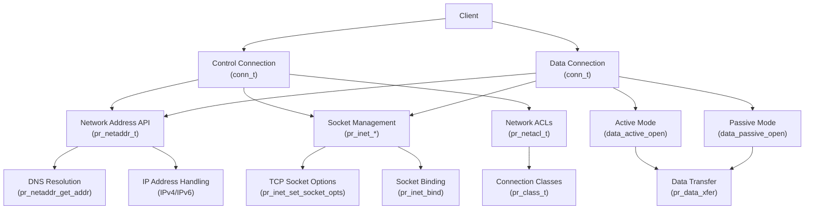
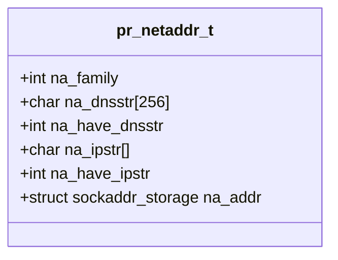
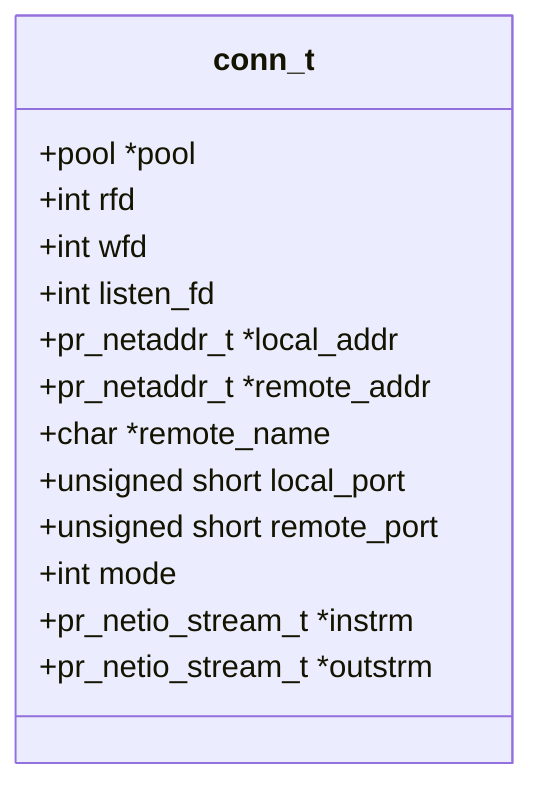
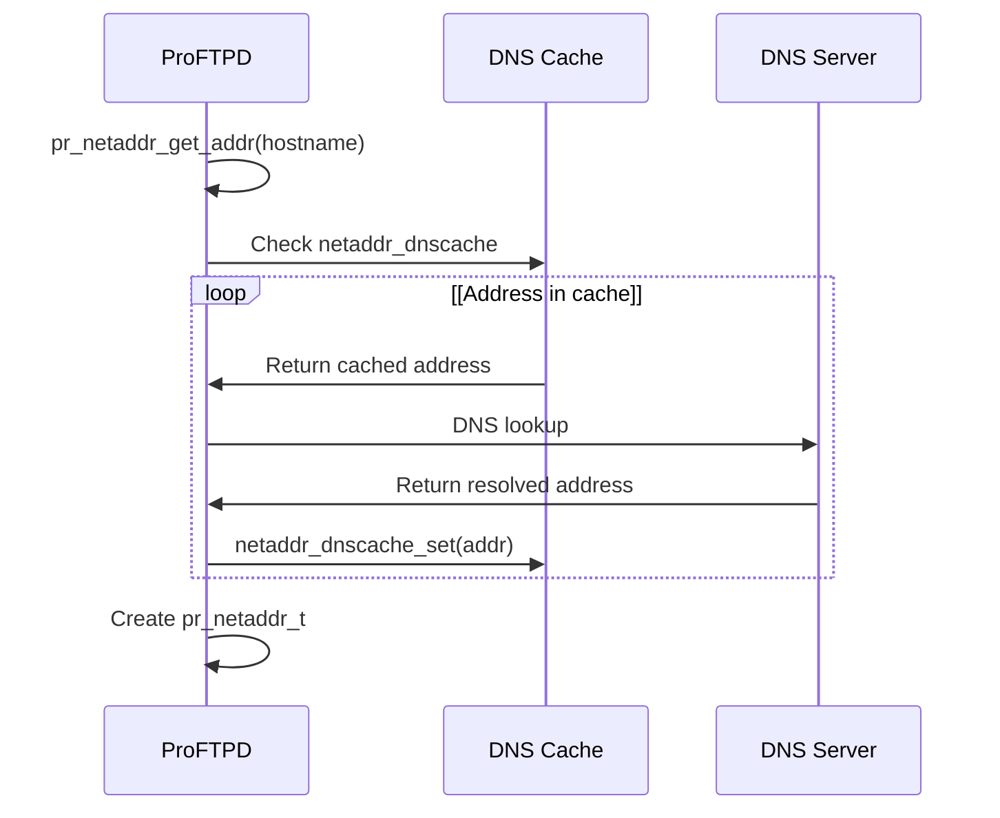
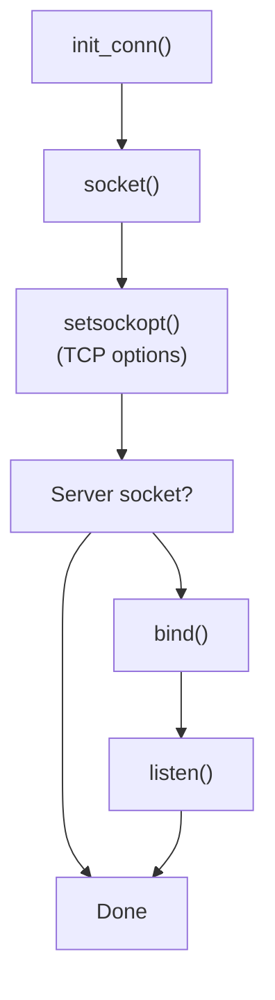
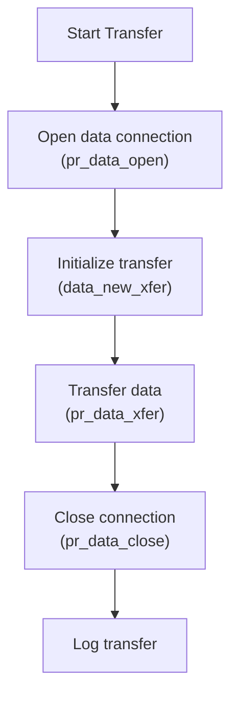
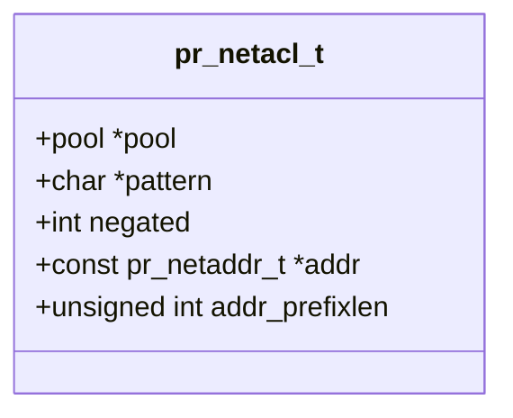
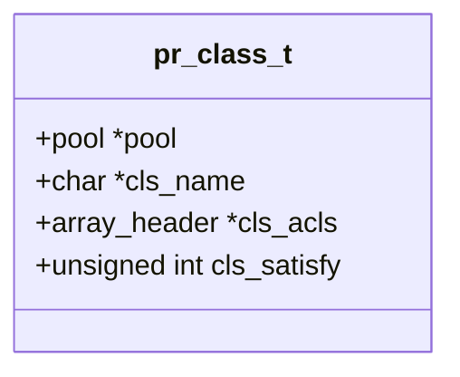
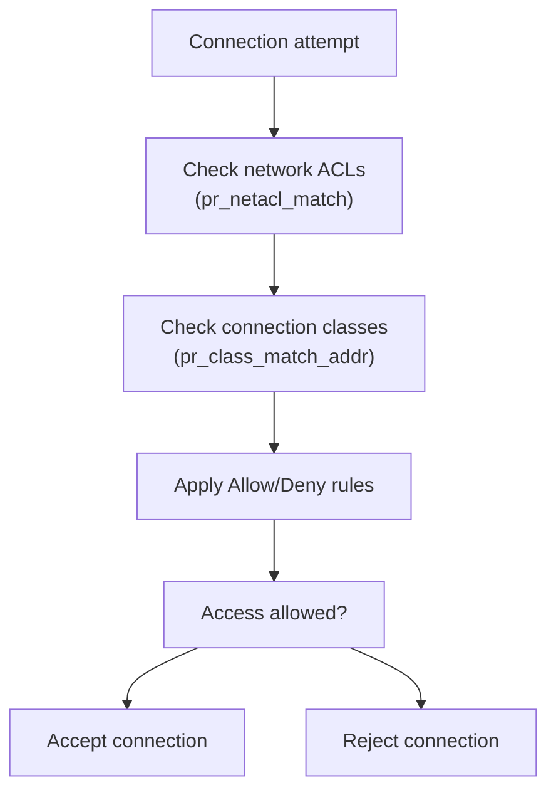

# Network Infrastructure

> **Relevant source files**
> * [NEWS](https://github.com/proftpd/proftpd/blob/362466f3/NEWS)
> * [doc/howto/IPv6.html](https://github.com/proftpd/proftpd/blob/362466f3/doc/howto/IPv6.html)
> * [include/class.h](https://github.com/proftpd/proftpd/blob/362466f3/include/class.h)
> * [include/dirtree.h](https://github.com/proftpd/proftpd/blob/362466f3/include/dirtree.h)
> * [include/inet.h](https://github.com/proftpd/proftpd/blob/362466f3/include/inet.h)
> * [include/netacl.h](https://github.com/proftpd/proftpd/blob/362466f3/include/netacl.h)
> * [include/netaddr.h](https://github.com/proftpd/proftpd/blob/362466f3/include/netaddr.h)
> * [include/proftpd.h](https://github.com/proftpd/proftpd/blob/362466f3/include/proftpd.h)
> * [modules/mod_auth.c](https://github.com/proftpd/proftpd/blob/362466f3/modules/mod_auth.c)
> * [modules/mod_core.c](https://github.com/proftpd/proftpd/blob/362466f3/modules/mod_core.c)
> * [modules/mod_ls.c](https://github.com/proftpd/proftpd/blob/362466f3/modules/mod_ls.c)
> * [modules/mod_site.c](https://github.com/proftpd/proftpd/blob/362466f3/modules/mod_site.c)
> * [modules/mod_xfer.c](https://github.com/proftpd/proftpd/blob/362466f3/modules/mod_xfer.c)
> * [src/class.c](https://github.com/proftpd/proftpd/blob/362466f3/src/class.c)
> * [src/data.c](https://github.com/proftpd/proftpd/blob/362466f3/src/data.c)
> * [src/dirtree.c](https://github.com/proftpd/proftpd/blob/362466f3/src/dirtree.c)
> * [src/inet.c](https://github.com/proftpd/proftpd/blob/362466f3/src/inet.c)
> * [src/main.c](https://github.com/proftpd/proftpd/blob/362466f3/src/main.c)
> * [src/netacl.c](https://github.com/proftpd/proftpd/blob/362466f3/src/netacl.c)
> * [src/netaddr.c](https://github.com/proftpd/proftpd/blob/362466f3/src/netaddr.c)
> * [tests/api/class.c](https://github.com/proftpd/proftpd/blob/362466f3/tests/api/class.c)
> * [tests/api/netacl.c](https://github.com/proftpd/proftpd/blob/362466f3/tests/api/netacl.c)
> * [tests/api/netaddr.c](https://github.com/proftpd/proftpd/blob/362466f3/tests/api/netaddr.c)

## Purpose and Scope

This document describes ProFTPD's network infrastructure, which is responsible for handling network addresses, socket management, connection processing, and data transfers. The network infrastructure provides the foundation for all client-server communications in ProFTPD, including both control and data connections.

For information about protocol-specific implementations like FTPS (FTP over TLS/SSL) or SFTP, see [Protocol Implementations](/proftpd/proftpd/4-protocol-implementations).

## Network Architecture Overview

The network infrastructure in ProFTPD consists of several interconnected components:



Sources: [src/inet.c](https://github.com/proftpd/proftpd/blob/362466f3/src/inet.c)

 [src/netaddr.c](https://github.com/proftpd/proftpd/blob/362466f3/src/netaddr.c)

 [src/data.c](https://github.com/proftpd/proftpd/blob/362466f3/src/data.c)

 [src/netacl.c](https://github.com/proftpd/proftpd/blob/362466f3/src/netacl.c)

## Core Network Structures

### Network Address (pr_netaddr_t)

The `pr_netaddr_t` structure represents network addresses and provides an abstraction layer for IPv4 and IPv6 addresses:



Sources: [include/netaddr.h L41-L56](https://github.com/proftpd/proftpd/blob/362466f3/include/netaddr.h#L41-L56)

### Connection (conn_t)

The `conn_t` structure represents a network connection, containing information about the socket descriptors, local and remote addresses, and network I/O streams:



Sources: [include/inet.h L124-L156](https://github.com/proftpd/proftpd/blob/362466f3/include/inet.h#L124-L156)

## Network Address Management

### Address Resolution Flow

This diagram illustrates how ProFTPD resolves network addresses:



Sources: [src/netaddr.c L68-L149](https://github.com/proftpd/proftpd/blob/362466f3/src/netaddr.c#L68-L149)

 [src/netaddr.c L1103-L1271](https://github.com/proftpd/proftpd/blob/362466f3/src/netaddr.c#L1103-L1271)

### Key Address Functions

| Function | Purpose | File Reference |
| --- | --- | --- |
| `pr_netaddr_alloc` | Allocates a network address structure | [src/netaddr.c L151-L172](https://github.com/proftpd/proftpd/blob/362466f3/src/netaddr.c#L151-L172) |
| `pr_netaddr_get_addr` | Resolves hostname to IP address | [src/netaddr.c L1103-L1271](https://github.com/proftpd/proftpd/blob/362466f3/src/netaddr.c#L1103-L1271) |
| `pr_netaddr_get_ipstr` | Gets string representation of IP | [src/netaddr.c L1471-L1501](https://github.com/proftpd/proftpd/blob/362466f3/src/netaddr.c#L1471-L1501) |
| `pr_netaddr_set_family` | Sets address family (IPv4/IPv6) | [src/netaddr.c L1392-L1412](https://github.com/proftpd/proftpd/blob/362466f3/src/netaddr.c#L1392-L1412) |

### IPv4/IPv6 Support

ProFTPD supports both IPv4 and IPv6 addressing through the `UseIPv6` directive:

```
UseIPv6 on|off
```

The implementation is in [modules/mod_core.c L674-L699](https://github.com/proftpd/proftpd/blob/362466f3/modules/mod_core.c#L674-L699)

 which toggles IPv6 support via the `pr_netaddr_enable_ipv6()` and `pr_netaddr_disable_ipv6()` functions.

## Socket Management

### Socket Creation and Configuration



Sources: [src/inet.c L195-L320](https://github.com/proftpd/proftpd/blob/362466f3/src/inet.c#L195-L320)

### Key Socket Functions

| Function | Purpose | File Reference |
| --- | --- | --- |
| `pr_inet_create_conn` | Creates a new connection | [src/inet.c L382-L451](https://github.com/proftpd/proftpd/blob/362466f3/src/inet.c#L382-L451) |
| `pr_inet_copy_conn` | Duplicates a connection | [src/inet.c L133-L189](https://github.com/proftpd/proftpd/blob/362466f3/src/inet.c#L133-L189) |
| `pr_inet_set_socket_opts` | Sets socket options | [src/inet.c L1041-L1126](https://github.com/proftpd/proftpd/blob/362466f3/src/inet.c#L1041-L1126) |
| `pr_inet_listen` | Puts socket in listening mode | [src/inet.c L1137-L1157](https://github.com/proftpd/proftpd/blob/362466f3/src/inet.c#L1137-L1157) |
| `pr_inet_accept` | Accepts incoming connection | [src/inet.c L579-L640](https://github.com/proftpd/proftpd/blob/362466f3/src/inet.c#L579-L640) |
| `pr_inet_connect` | Establishes outgoing connection | [src/inet.c L645-L719](https://github.com/proftpd/proftpd/blob/362466f3/src/inet.c#L645-L719) |

### TCP Options

Socket options can be configured using the `SocketOptions` directive:

```
SocketOptions [keepalive on|off] [reuseaddr on|off] [linger on|off [seconds]] [sndbuf size] [rcvbuf size] [nopush on|off]
```

ProFTPD also supports specific TCP tuning parameters:

| Directive | Purpose | Default |
| --- | --- | --- |
| `TCPBackLog` | Sets the TCP backlog queue size | 5 |
| `TCPNoDelay` | Enables/disables Nagle's algorithm | on |
| `SocketBindTight` | Controls binding to specific addresses | off |

Sources: [src/inet.c L1041-L1126](https://github.com/proftpd/proftpd/blob/362466f3/src/inet.c#L1041-L1126)

 [modules/mod_core.c L1085-L1125](https://github.com/proftpd/proftpd/blob/362466f3/modules/mod_core.c#L1085-L1125)

## Data Connection Handling

ProFTPD supports both active and passive data connection modes for file transfers.

### Data Connection Modes

```mermaid
flowchart TD

P1["Client sends PASV/EPSV"]
P2["Server opens listening socket"]
P3["Server sends address:port to client"]
P4["Client connects to server"]
P5["Server accepts connection<br>(data_passive_open)"]
P6["Data transfer begins"]
A1["Client sends PORT/EPRT"]
A2["Server parses client address/port"]
A3["Server connects to client<br>(data_active_open)"]
A4["Data transfer begins"]

subgraph subGraph1 ["Passive Mode"]
    P1
    P2
    P3
    P4
    P5
    P6
    P1 --> P2
    P2 --> P3
    P3 --> P4
    P4 --> P5
    P5 --> P6
end

subgraph subGraph0 ["Active Mode"]
    A1
    A2
    A3
    A4
    A1 --> A2
    A2 --> A3
    A3 --> A4
end
```



Sources: [src/data.c L612-L731](https://github.com/proftpd/proftpd/blob/362466f3/src/data.c#L612-L731)

 [src/data.c L110-L208](https://github.com/proftpd/proftpd/blob/362466f3/src/data.c#L110-L208)

### Data Transfer Flow



Sources: [src/data.c L733-L813](https://github.com/proftpd/proftpd/blob/362466f3/src/data.c#L733-L813)

 [src/data.c L94-L108](https://github.com/proftpd/proftpd/blob/362466f3/src/data.c#L94-L108)

 [src/data.c L946-L985](https://github.com/proftpd/proftpd/blob/362466f3/src/data.c#L946-L985)

 [src/data.c L867-L939](https://github.com/proftpd/proftpd/blob/362466f3/src/data.c#L867-L939)

### Key Data Functions

| Function | Purpose | File Reference |
| --- | --- | --- |
| `pr_data_open` | Opens a data connection | [src/data.c L733-L813](https://github.com/proftpd/proftpd/blob/362466f3/src/data.c#L733-L813) |
| `pr_data_close` | Closes a data connection | [src/data.c L867-L939](https://github.com/proftpd/proftpd/blob/362466f3/src/data.c#L867-L939) |
| `pr_data_xfer` | Transfers data over connection | [src/data.c L946-L985](https://github.com/proftpd/proftpd/blob/362466f3/src/data.c#L946-L985) |
| `data_active_open` | Opens active connection | [src/data.c L612-L731](https://github.com/proftpd/proftpd/blob/362466f3/src/data.c#L612-L731) |
| `data_passive_open` | Opens passive connection | [src/data.c L110-L208](https://github.com/proftpd/proftpd/blob/362466f3/src/data.c#L110-L208) |

## Network Access Control

ProFTPD implements network access control through ACLs and connection classes.

### Network ACL Structure



Sources: [include/netacl.h L37-L43](https://github.com/proftpd/proftpd/blob/362466f3/include/netacl.h#L37-L43)

### Connection Class Structure



Sources: [include/class.h L37-L42](https://github.com/proftpd/proftpd/blob/362466f3/include/class.h#L37-L42)

### Access Control Flow



Sources: [src/netacl.c L378-L518](https://github.com/proftpd/proftpd/blob/362466f3/src/netacl.c#L378-L518)

 [src/class.c L245-L285](https://github.com/proftpd/proftpd/blob/362466f3/src/class.c#L245-L285)

### Key ACL Functions

| Function | Purpose | File Reference |
| --- | --- | --- |
| `pr_netacl_create` | Creates a network ACL | [src/netacl.c L220-L376](https://github.com/proftpd/proftpd/blob/362466f3/src/netacl.c#L220-L376) |
| `pr_netacl_match` | Matches address against ACL | [src/netacl.c L378-L518](https://github.com/proftpd/proftpd/blob/362466f3/src/netacl.c#L378-L518) |
| `pr_class_open` | Opens a new connection class | [src/class.c L107-L150](https://github.com/proftpd/proftpd/blob/362466f3/src/class.c#L107-L150) |
| `pr_class_add_acl` | Adds an ACL to a class | [src/class.c L152-L194](https://github.com/proftpd/proftpd/blob/362466f3/src/class.c#L152-L194) |
| `pr_class_match_addr` | Checks if address matches class | [src/class.c L245-L285](https://github.com/proftpd/proftpd/blob/362466f3/src/class.c#L245-L285) |

## Network Configuration Directives

ProFTPD provides numerous directives for controlling network behavior:

| Directive | Description | Default |
| --- | --- | --- |
| `DefaultAddress` | Sets default IP address | First available IP |
| `Port` | Sets listening port | 21 |
| `UseIPv6` | Enables/disables IPv6 | on |
| `SocketBindTight` | Controls binding to specific IPs | off |
| `MasqueradeAddress` | External IP for passive mode | None |
| `PassivePorts` | Port range for passive transfers | None |
| `MaxConnectionRate` | Limits connection rate | None |
| `MaxConnections` | Limits total connections | None |
| `MaxConnectionsPerHost` | Limits connections per host | None |
| `MaxTransfersPerHost` | Limits data transfers per host | None |
| `MaxTransfersPerUser` | Limits data transfers per user | None |

Sources: [modules/mod_core.c L469-L593](https://github.com/proftpd/proftpd/blob/362466f3/modules/mod_core.c#L469-L593)

 [modules/mod_core.c L674-L715](https://github.com/proftpd/proftpd/blob/362466f3/modules/mod_core.c#L674-L715)

 [modules/mod_core.c L930-L951](https://github.com/proftpd/proftpd/blob/362466f3/modules/mod_core.c#L930-L951)

 [modules/mod_core.c L979-L1038](https://github.com/proftpd/proftpd/blob/362466f3/modules/mod_core.c#L979-L1038)

 [modules/mod_xfer.c L266-L368](https://github.com/proftpd/proftpd/blob/362466f3/modules/mod_xfer.c#L266-L368)

## Connection Handling Details

### Connection Establishment

When a client connects to the server, the following process occurs:

1. Server accepts the connection via `pr_inet_accept()`
2. A `conn_t` structure is initialized for the connection
3. Socket options are set via `pr_inet_set_socket_opts()`
4. The connection is added to the scoreboard
5. If the connection is authorized, command processing begins

Sources: [src/inet.c L579-L640](https://github.com/proftpd/proftpd/blob/362466f3/src/inet.c#L579-L640)

 [src/main.c L92-L129](https://github.com/proftpd/proftpd/blob/362466f3/src/main.c#L92-L129)

### Connection Cleanup

Connections are cleaned up when they are no longer needed:

```
static void conn_cleanup_cb(void *cv) {
  conn_t *c = (conn_t *) cv;

  if (c->instrm != NULL) {
    pr_netio_close(c->instrm);
  }

  if (c->outstrm != NULL &&
      c->outstrm != c->instrm) {
    pr_netio_close(c->outstrm);
  }

  // Close file descriptors
  if (c->listen_fd != -1) {
    (void) close(c->listen_fd);
    c->listen_fd = -1;
  }

  if (c->rfd != -1) {
    (void) close(c->rfd);
    c->rfd = -1;
  }

  if (c->wfd != -1) {
    (void) close(c->wfd);
    c->wfd = -1;
  }
}
```

Sources: [src/inet.c L93-L128](https://github.com/proftpd/proftpd/blob/362466f3/src/inet.c#L93-L128)

## Summary

ProFTPD's network infrastructure provides a robust foundation for handling client connections, resolving network addresses, managing sockets, and transferring data. The modular design allows for flexibility in configuration and extension to support various network environments and requirements.

Sources: [src/inet.c](https://github.com/proftpd/proftpd/blob/362466f3/src/inet.c)

 [src/netaddr.c](https://github.com/proftpd/proftpd/blob/362466f3/src/netaddr.c)

 [src/data.c](https://github.com/proftpd/proftpd/blob/362466f3/src/data.c)

 [src/netacl.c](https://github.com/proftpd/proftpd/blob/362466f3/src/netacl.c)

 [modules/mod_core.c](https://github.com/proftpd/proftpd/blob/362466f3/modules/mod_core.c)

 [modules/mod_xfer.c](https://github.com/proftpd/proftpd/blob/362466f3/modules/mod_xfer.c)