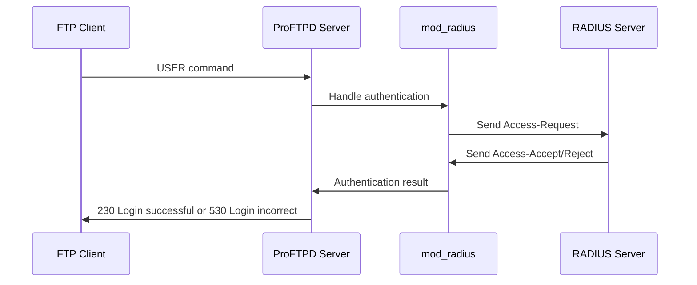
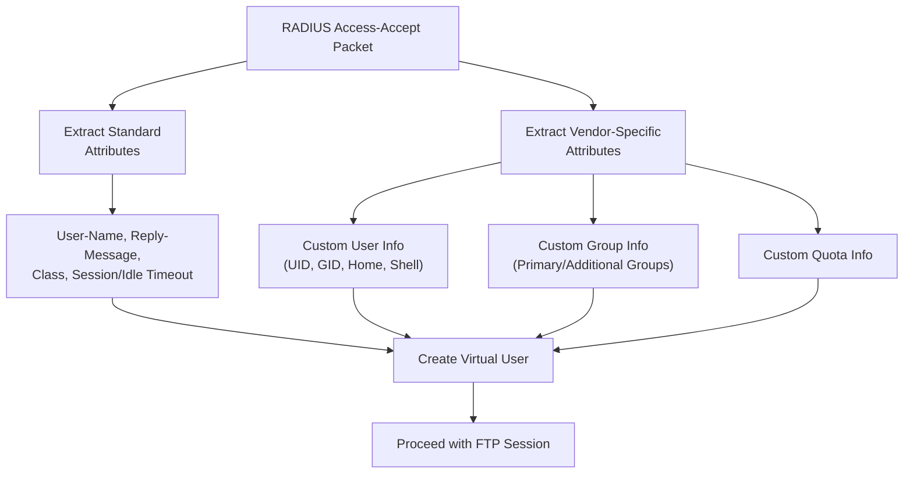
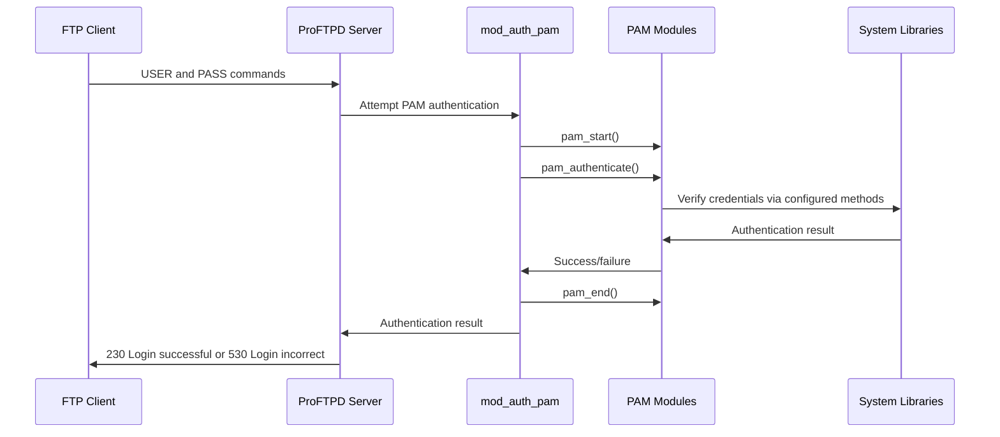
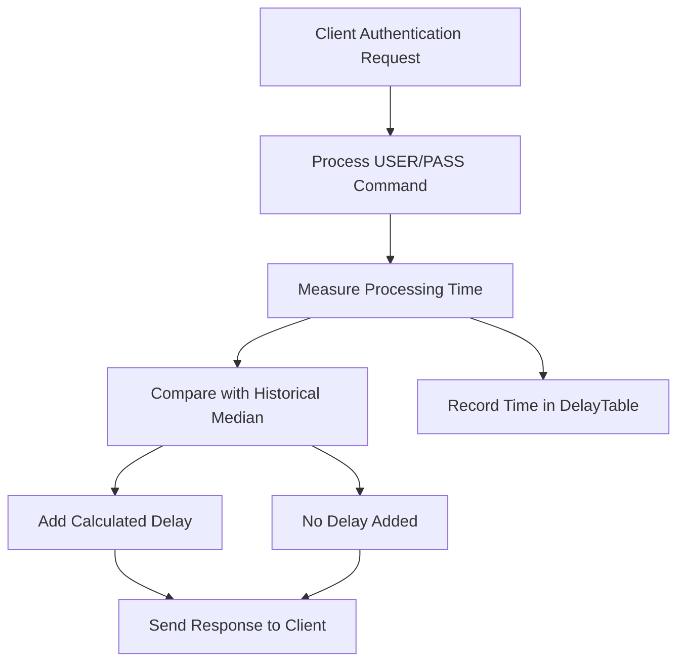
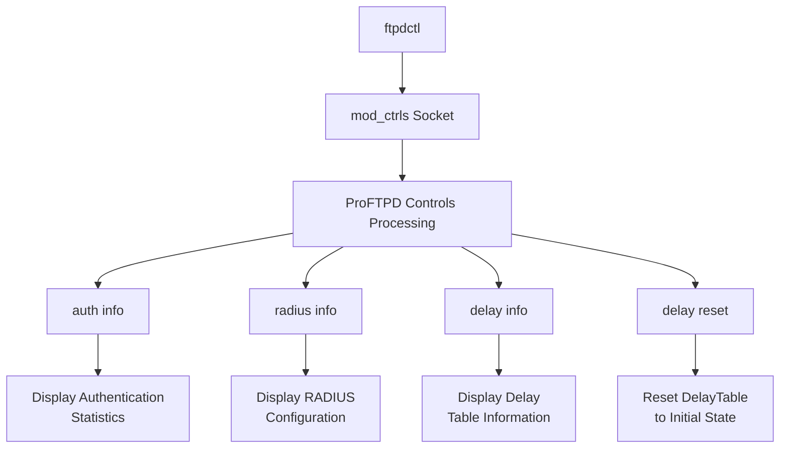

# Other Authentication Methods

> **Relevant source files**
> * [contrib/mod_ctrls_admin.c](https://github.com/proftpd/proftpd/blob/362466f3/contrib/mod_ctrls_admin.c)
> * [contrib/mod_radius.c](https://github.com/proftpd/proftpd/blob/362466f3/contrib/mod_radius.c)
> * [contrib/mod_rewrite.c](https://github.com/proftpd/proftpd/blob/362466f3/contrib/mod_rewrite.c)
> * [doc/contrib/mod_rewrite.html](https://github.com/proftpd/proftpd/blob/362466f3/doc/contrib/mod_rewrite.html)
> * [doc/modules/mod_delay.html](https://github.com/proftpd/proftpd/blob/362466f3/doc/modules/mod_delay.html)
> * [include/compat.h](https://github.com/proftpd/proftpd/blob/362466f3/include/compat.h)
> * [include/ctrls.h](https://github.com/proftpd/proftpd/blob/362466f3/include/ctrls.h)
> * [include/mod_ctrls.h](https://github.com/proftpd/proftpd/blob/362466f3/include/mod_ctrls.h)
> * [modules/mod_ctrls.c](https://github.com/proftpd/proftpd/blob/362466f3/modules/mod_ctrls.c)
> * [modules/mod_delay.c](https://github.com/proftpd/proftpd/blob/362466f3/modules/mod_delay.c)
> * [modules/mod_dso.c](https://github.com/proftpd/proftpd/blob/362466f3/modules/mod_dso.c)
> * [src/ctrls.c](https://github.com/proftpd/proftpd/blob/362466f3/src/ctrls.c)
> * [src/ftpdctl.c](https://github.com/proftpd/proftpd/blob/362466f3/src/ftpdctl.c)
> * [tests/api/ctrls.c](https://github.com/proftpd/proftpd/blob/362466f3/tests/api/ctrls.c)
> * [tests/t/etc/modules/mod_rewrite/reverse.pl](https://github.com/proftpd/proftpd/blob/362466f3/tests/t/etc/modules/mod_rewrite/reverse.pl)
> * [tests/t/lib/ProFTPD/Tests/Modules/mod_ctrls.pm](https://github.com/proftpd/proftpd/blob/362466f3/tests/t/lib/ProFTPD/Tests/Modules/mod_ctrls.pm)
> * [tests/t/lib/ProFTPD/Tests/Modules/mod_delay.pm](https://github.com/proftpd/proftpd/blob/362466f3/tests/t/lib/ProFTPD/Tests/Modules/mod_delay.pm)
> * [tests/t/lib/ProFTPD/Tests/Modules/mod_rewrite.pm](https://github.com/proftpd/proftpd/blob/362466f3/tests/t/lib/ProFTPD/Tests/Modules/mod_rewrite.pm)
> * [tests/t/modules/mod_ctrls.t](https://github.com/proftpd/proftpd/blob/362466f3/tests/t/modules/mod_ctrls.t)
> * [tests/t/modules/mod_delay.t](https://github.com/proftpd/proftpd/blob/362466f3/tests/t/modules/mod_delay.t)
> * [tests/t/modules/mod_rewrite.t](https://github.com/proftpd/proftpd/blob/362466f3/tests/t/modules/mod_rewrite.t)

This document covers additional authentication methods available in ProFTPD beyond the core authentication systems. Specifically, we focus on RADIUS and PAM authentication, and related security mechanisms like mod_delay. For information about Unix and File-based authentication, see [Unix and File-based Authentication](/proftpd/proftpd/3.1-unix-and-file-based-authentication). For SQL and LDAP authentication, see [SQL Authentication](/proftpd/proftpd/3.2-sql-authentication) and [LDAP Authentication](/proftpd/proftpd/3.3-ldap-authentication) respectively.

## RADIUS Authentication

RADIUS (Remote Authentication Dial-In User Service) is a client/server protocol that provides centralized authentication, authorization, and accounting management for users who connect to a network service. In ProFTPD, RADIUS authentication is implemented by the `mod_radius` module.

### RADIUS Authentication Flow



Sources: [contrib/mod_radius.c L507-L580](https://github.com/proftpd/proftpd/blob/362466f3/contrib/mod_radius.c#L507-L580)

### RADIUS Configuration

To enable RADIUS authentication in ProFTPD, you need to:

1. Compile ProFTPD with mod_radius support
2. Configure your RADIUS server details in proftpd.conf
3. Set up the AuthOrder to include mod_radius

Example configuration:

```xml
<IfModule mod_radius.c>
  # RADIUS server for authentication
  RadiusEngine on
  RadiusAuthServer radius.example.com:1812 mysharedsecret 5
  
  # RADIUS server for accounting
  RadiusAcctServer radius.example.com:1813 mysharedsecret 5
  
  # Log RADIUS activity
  RadiusLog /var/log/proftpd/radius.log
  
  # User/group info
  RadiusUserInfo uid=nobody gid=nobody home=/home/ftp shell=/bin/false
</IfModule>

# Set AuthOrder to try RADIUS first, then fall back to other methods
AuthOrder mod_radius.c mod_auth_file.c
```

The module will attempt to authenticate users by sending RADIUS Access-Request packets to the configured RADIUS server. If the server responds with an Access-Accept packet, the user is authenticated.

Sources: [contrib/mod_radius.c L107-L213](https://github.com/proftpd/proftpd/blob/362466f3/contrib/mod_radius.c#L107-L213)

 [contrib/mod_radius.c L507-L706](https://github.com/proftpd/proftpd/blob/362466f3/contrib/mod_radius.c#L507-L706)

### RADIUS Attributes

The mod_radius module supports various standard RADIUS attributes and can be configured to use vendor-specific attributes (VSAs) for custom implementations.

Key supported attributes include:

| Attribute | Description |
| --- | --- |
| User-Name | Username for authentication |
| Password | Encrypted password |
| NAS-IP-Address | Server IP address |
| Service-Type | Type of service requested (Login) |
| Class | Session tracking information |
| Reply-Message | Messages displayed to user |
| Session-Timeout | Maximum session time |
| Idle-Timeout | Maximum idle time |

Custom VSAs can be used for:

* User information (UID, GID, home directory, shell)
* Group membership
* Quota limits
* Other custom parameters

Sources: [contrib/mod_radius.c L200-L258](https://github.com/proftpd/proftpd/blob/362466f3/contrib/mod_radius.c#L200-L258)

 [contrib/mod_radius.c L706-L880](https://github.com/proftpd/proftpd/blob/362466f3/contrib/mod_radius.c#L706-L880)

### RADIUS User Information Handling

The mod_radius module can construct a virtual user based on RADIUS attributes. This is useful when the FTP users don't have actual system accounts.



Sources: [contrib/mod_radius.c L706-L887](https://github.com/proftpd/proftpd/blob/362466f3/contrib/mod_radius.c#L706-L887)

## PAM Authentication

PAM (Pluggable Authentication Modules) provides a flexible mechanism for authenticating users. ProFTPD supports PAM authentication through the `mod_auth_pam` module, allowing integration with system-wide authentication policies.

### PAM Authentication Flow



### PAM Configuration

To enable PAM authentication in ProFTPD:

1. Ensure ProFTPD is compiled with PAM support
2. Create a PAM configuration file for ProFTPD (usually `/etc/pam.d/proftpd`)
3. Configure ProFTPD to use PAM authentication

Example `/etc/pam.d/proftpd` configuration:

```markdown
# Standard PAM configuration for ProFTPD
auth       required     pam_unix.so shadow nullok
account    required     pam_unix.so
session    required     pam_unix.so
```

Example ProFTPD configuration:

```markdown
# Enable PAM authentication
AuthPAM on

# Use PAM first, then fall back to other methods
AuthOrder mod_auth_pam.c mod_auth_unix.c
```

PAM authentication allows ProFTPD to leverage the system's authentication mechanisms, including:

* Password verification against `/etc/shadow`
* LDAP authentication
* Multi-factor authentication
* Smart card authentication
* Any other PAM-compatible authentication method

## Security with mod_delay

The mod_delay module helps prevent timing-based attacks on authentication by normalizing the response time for both successful and failed authentication attempts.

### Understanding Timing Attacks

In authentication systems, the server may process valid usernames differently than invalid ones, creating measurable timing differences. Attackers can exploit these timing differences to determine valid usernames, making password guessing more efficient.

### How mod_delay Works



When the server processes a USER or PASS command, mod_delay:

1. Measures the time taken to process the command
2. Records this time in the DelayTable
3. Compares the current processing time to historical values
4. Adds a delay if processing was faster than normal

This normalizes response times, making it difficult for attackers to determine whether a username exists or not based on timing.

Sources: [modules/mod_delay.c L167-L324](https://github.com/proftpd/proftpd/blob/362466f3/modules/mod_delay.c#L167-L324)

 [modules/mod_delay.c L378-L414](https://github.com/proftpd/proftpd/blob/362466f3/modules/mod_delay.c#L378-L414)

### DelayTable

The DelayTable is a memory-mapped file that stores timing statistics for USER and PASS commands for each server ID. It's used to calculate the median processing time for these commands.

Key components:

* Processing times are stored per-protocol (FTP, FTPS, SSH2)
* Each virtual host has its own entry in the table
* The code calculates the median time across stored values
* A maximum delay value prevents excessive delays

When a new value is recorded, it's added to the table, and the oldest value is removed.

Sources: [modules/mod_delay.c L613-L671](https://github.com/proftpd/proftpd/blob/362466f3/modules/mod_delay.c#L613-L671)

 [modules/mod_delay.c L1067-L1148](https://github.com/proftpd/proftpd/blob/362466f3/modules/mod_delay.c#L1067-L1148)

### Additional Security Features

Beyond the core timing normalization, mod_delay supports:

| Feature | Description |
| --- | --- |
| DelayOnEvent | Configure specific delays for events like USER, PASS, failed logins, and connections |
| Min/Max Delay | Set boundaries for the delay range for each event type |
| Random Jitter | Add randomness to delays to further obscure timing patterns |

Example configuration:

```xml
<IfModule mod_delay.c>
  DelayEngine on
  DelayTable /var/proftpd/delay.dat
  
  # Add 1-3 second delay on failed logins
  DelayOnEvent FailedLogin 1s-3s
  
  # Add 0.5-2 second delay on USER command
  DelayOnEvent USER 500ms-2s
</IfModule>
```

Sources: [modules/mod_delay.c L421-L607](https://github.com/proftpd/proftpd/blob/362466f3/modules/mod_delay.c#L421-L607)

 [doc/modules/mod_delay.html L99-L110](https://github.com/proftpd/proftpd/blob/362466f3/doc/modules/mod_delay.html#L99-L110)

## Integration with Controls System

Both RADIUS and PAM authentication methods can be managed at runtime through ProFTPD's controls system (mod_ctrls).

### Control Actions



The controls system allows administrators to:

1. View current authentication configuration
2. Check authentication statistics
3. Reset the delay table
4. View or modify RADIUS server settings

This provides real-time management of authentication systems without restarting the server.

Sources: [modules/mod_ctrls.c L294-L455](https://github.com/proftpd/proftpd/blob/362466f3/modules/mod_ctrls.c#L294-L455)

 [contrib/mod_ctrls_admin.c L112-L454](https://github.com/proftpd/proftpd/blob/362466f3/contrib/mod_ctrls_admin.c#L112-L454)

## Conclusion

ProFTPD provides flexible authentication options beyond the core methods. RADIUS and PAM authentication allow integration with external authentication systems and enterprise environments, while mod_delay enhances security by preventing timing attacks during the authentication process.

When selecting an authentication method, consider:

* Security requirements
* Integration with existing systems
* User management complexity
* Performance needs

The modular architecture of ProFTPD makes it possible to chain multiple authentication methods using the AuthOrder directive, providing both flexibility and fallback options.

Sources: [contrib/mod_radius.c L172-L195](https://github.com/proftpd/proftpd/blob/362466f3/contrib/mod_radius.c#L172-L195)