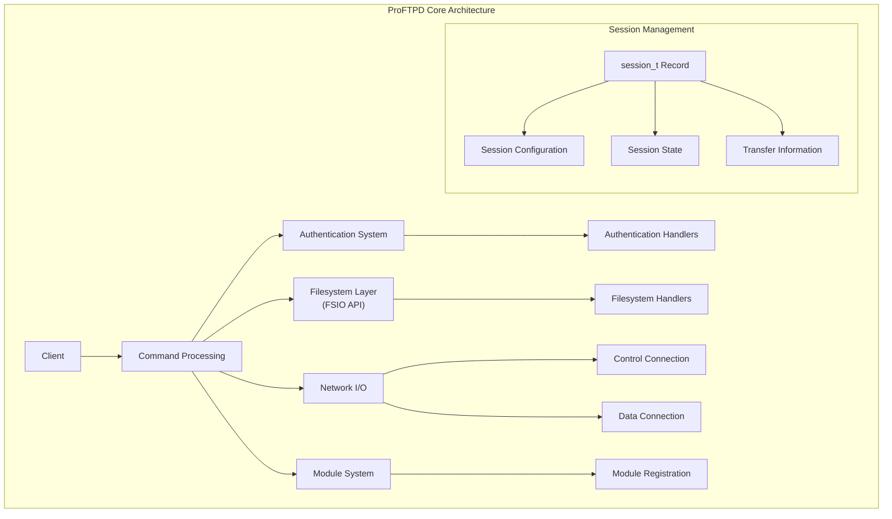
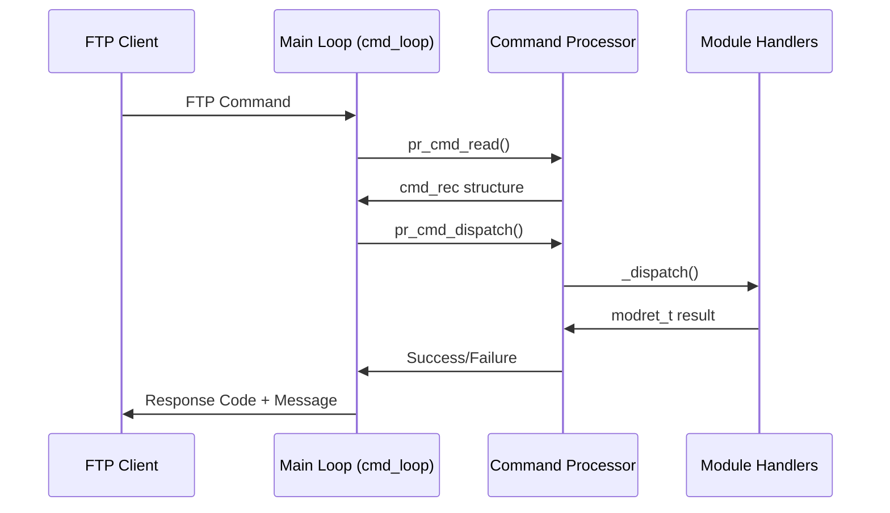
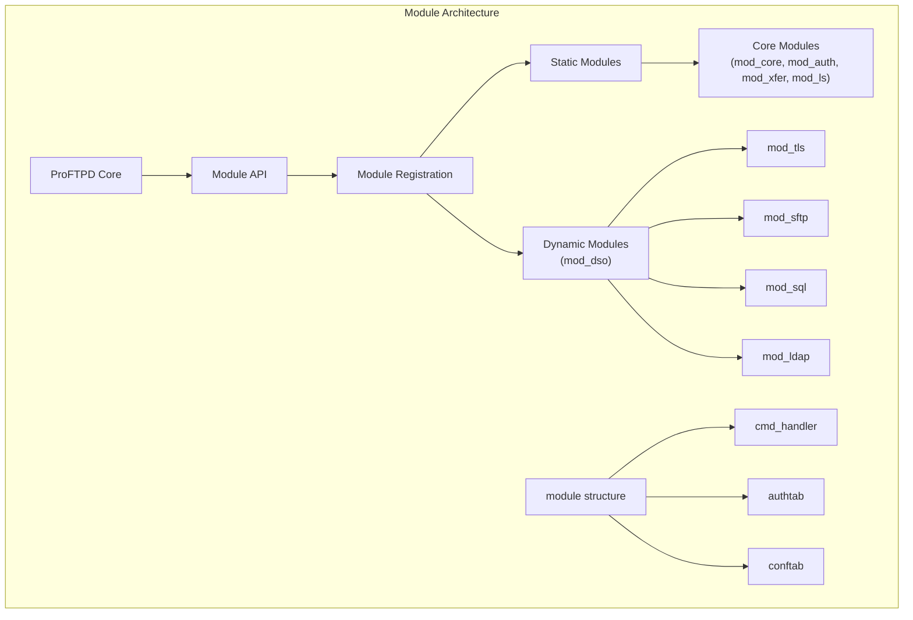
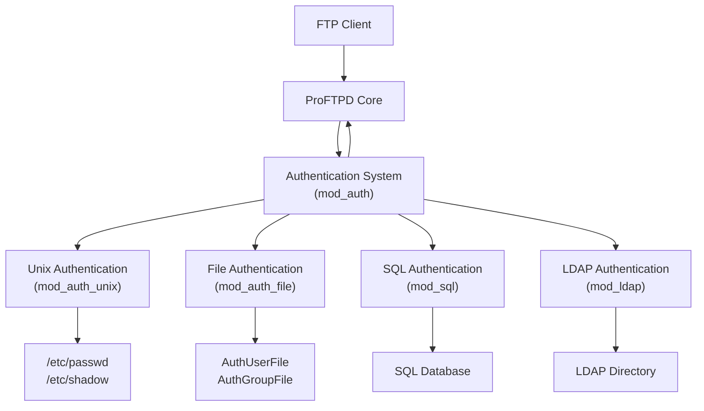
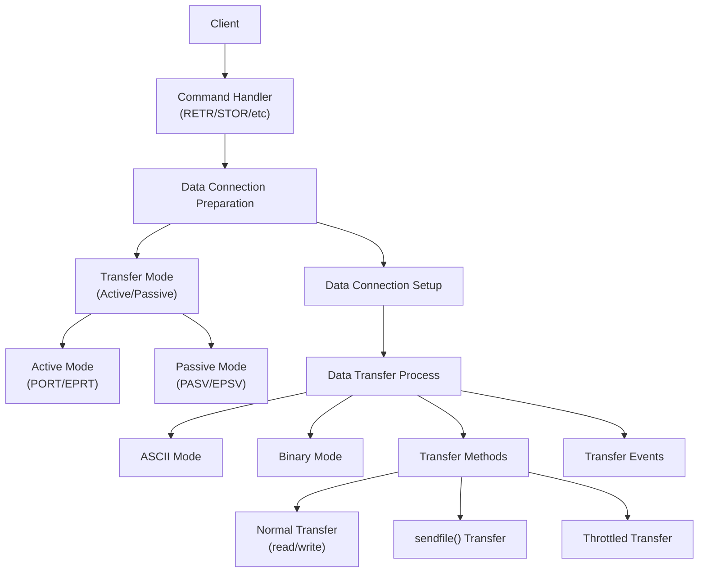
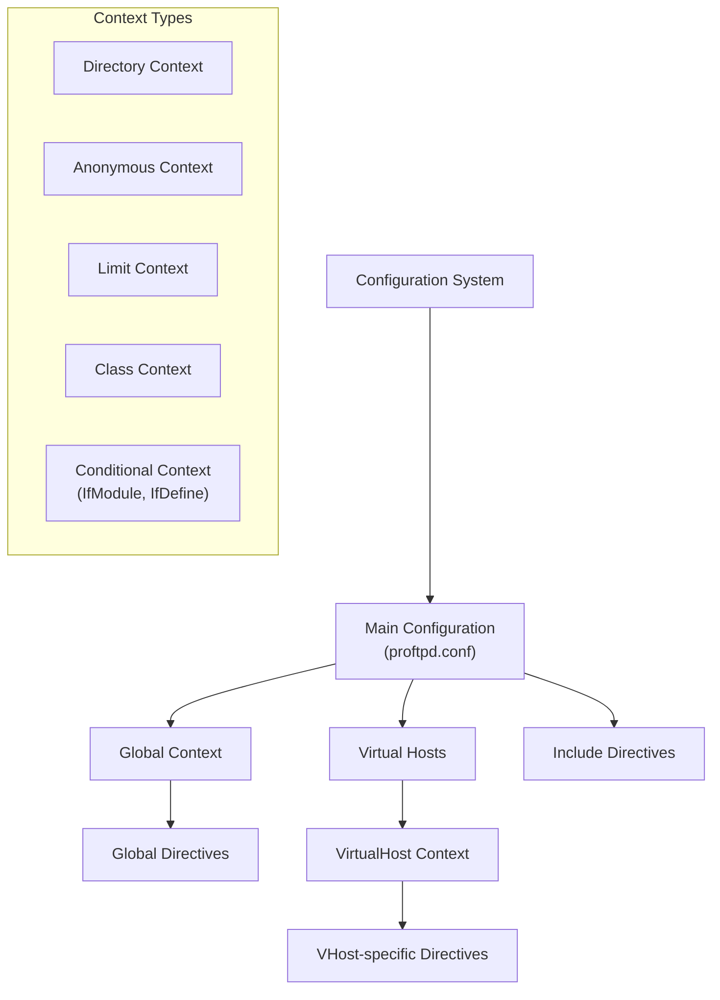
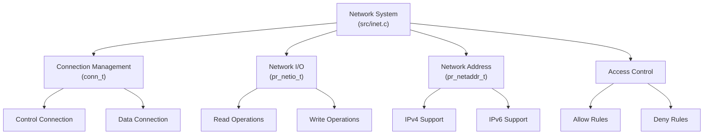
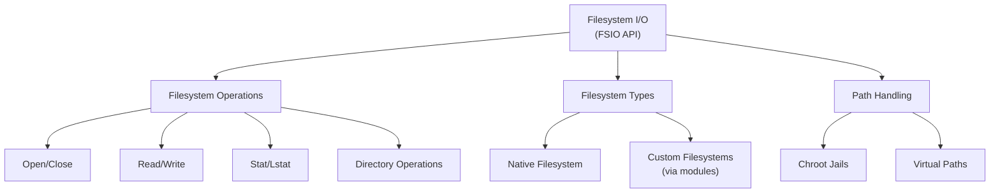

# Overview

> **Relevant source files**
> * [.codeql.yml](https://github.com/proftpd/proftpd/blob/362466f3/.codeql.yml)
> * [.github/workflows/ci.yml](https://github.com/proftpd/proftpd/blob/362466f3/.github/workflows/ci.yml)
> * [.github/workflows/codeql.yml](https://github.com/proftpd/proftpd/blob/362466f3/.github/workflows/codeql.yml)
> * [.github/workflows/legacy-platforms-ci.yml](https://github.com/proftpd/proftpd/blob/362466f3/.github/workflows/legacy-platforms-ci.yml)
> * [.github/workflows/rpm.yml](https://github.com/proftpd/proftpd/blob/362466f3/.github/workflows/rpm.yml)
> * [ChangeLog](https://github.com/proftpd/proftpd/blob/362466f3/ChangeLog)
> * [NEWS](https://github.com/proftpd/proftpd/blob/362466f3/NEWS)
> * [README.md](https://github.com/proftpd/proftpd/blob/362466f3/README.md)
> * [contrib/dist/rpm/proftpd.spec](https://github.com/proftpd/proftpd/blob/362466f3/contrib/dist/rpm/proftpd.spec)
> * [include/dirtree.h](https://github.com/proftpd/proftpd/blob/362466f3/include/dirtree.h)
> * [include/inet.h](https://github.com/proftpd/proftpd/blob/362466f3/include/inet.h)
> * [include/privs.h](https://github.com/proftpd/proftpd/blob/362466f3/include/privs.h)
> * [include/proftpd.h](https://github.com/proftpd/proftpd/blob/362466f3/include/proftpd.h)
> * [include/version.h](https://github.com/proftpd/proftpd/blob/362466f3/include/version.h)
> * [modules/mod_auth.c](https://github.com/proftpd/proftpd/blob/362466f3/modules/mod_auth.c)
> * [modules/mod_core.c](https://github.com/proftpd/proftpd/blob/362466f3/modules/mod_core.c)
> * [modules/mod_ls.c](https://github.com/proftpd/proftpd/blob/362466f3/modules/mod_ls.c)
> * [modules/mod_site.c](https://github.com/proftpd/proftpd/blob/362466f3/modules/mod_site.c)
> * [modules/mod_xfer.c](https://github.com/proftpd/proftpd/blob/362466f3/modules/mod_xfer.c)
> * [src/data.c](https://github.com/proftpd/proftpd/blob/362466f3/src/data.c)
> * [src/dirtree.c](https://github.com/proftpd/proftpd/blob/362466f3/src/dirtree.c)
> * [src/inet.c](https://github.com/proftpd/proftpd/blob/362466f3/src/inet.c)
> * [src/main.c](https://github.com/proftpd/proftpd/blob/362466f3/src/main.c)
> * [src/privs.c](https://github.com/proftpd/proftpd/blob/362466f3/src/privs.c)
> * [tests/api/privs.c](https://github.com/proftpd/proftpd/blob/362466f3/tests/api/privs.c)

ProFTPD is a highly configurable and secure FTP server daemon for Unix and Unix-like operating systems. It provides a feature-rich platform for file transfer services with support for multiple protocols including standard FTP, FTPS (FTP over TLS/SSL), SFTP, and SCP through its modular architecture.

This document provides an introduction to the core architecture, primary components, and key features of ProFTPD. For detailed information on specific subsystems, please refer to the corresponding pages in this wiki.

## Version and Status

ProFTPD is currently at version 1.3.10rc1 as defined in [include/version.h L32](https://github.com/proftpd/proftpd/blob/362466f3/include/version.h#L32-L32)

 with a modular API version of 0x20 [include/version.h L35](https://github.com/proftpd/proftpd/blob/362466f3/include/version.h#L35-L35)

 The software is released under the GNU General Public License.

## Core Architecture

ProFTPD is built with a modular architecture that separates functionality into distinct components. The core server manages configuration, network connections, command processing, and coordinates between various subsystems.

Sources: [src/main.c](https://github.com/proftpd/proftpd/blob/362466f3/src/main.c)

 [modules/mod_core.c](https://github.com/proftpd/proftpd/blob/362466f3/modules/mod_core.c)

 [src/dirtree.c](https://github.com/proftpd/proftpd/blob/362466f3/src/dirtree.c)

### Server Records

The `server_rec` structure ([include/dirtree.h L47-L108](https://github.com/proftpd/proftpd/blob/362466f3/include/dirtree.h#L47-L108)

) is the primary container for server configuration information. ProFTPD can manage multiple virtual servers through a linked list of server records (`server_list`). The main server is accessible through the `main_server` global variable.

### Session Management

When a client connects, ProFTPD creates a session structure (`session_t` in [include/proftpd.h](https://github.com/proftpd/proftpd/blob/362466f3/include/proftpd.h)

) that tracks all information about the current client connection, including authentication state, current working directory, and transfer information.

### Command Processing

The command processing subsystem:

1. Reads commands from the client connection
2. Parses the commands into a `cmd_rec` structure
3. Dispatches commands to registered handlers
4. Returns appropriate responses to the client

Sources: [src/main.c L92-L796](https://github.com/proftpd/proftpd/blob/362466f3/src/main.c#L92-L796)

 [src/main.c L977-L803](https://github.com/proftpd/proftpd/blob/362466f3/src/main.c#L977-L803)

## Module System

ProFTPD uses a modular architecture where functionality is implemented through modules. Each module registers handlers for specific commands, configuration directives, and other events.

Sources: [modules/mod_core.c L53-L54](https://github.com/proftpd/proftpd/blob/362466f3/modules/mod_core.c#L53-L54)

 [modules/mod_auth.c L42](https://github.com/proftpd/proftpd/blob/362466f3/modules/mod_auth.c#L42-L42)

 [modules/mod_xfer.c L79](https://github.com/proftpd/proftpd/blob/362466f3/modules/mod_xfer.c#L79-L79)

 [modules/mod_ls.c](https://github.com/proftpd/proftpd/blob/362466f3/modules/mod_ls.c)

### Core Modules

ProFTPD includes several core modules that provide essential functionality:

1. **mod_core**: Implements core FTP commands and server functionality
2. **mod_auth**: Provides authentication framework and methods
3. **mod_xfer**: Handles data transfers (uploads and downloads)
4. **mod_ls**: Implements directory listing commands

### Dynamic Modules

Additional functionality can be added through dynamically loaded modules:

1. **mod_tls**: Adds support for FTPS (FTP over TLS/SSL)
2. **mod_sftp**: Provides SFTP and SCP protocol support
3. **mod_sql**: Adds support for SQL-based authentication and storage
4. **mod_ldap**: Enables LDAP authentication

## Authentication System

The authentication system allows users to log in using various authentication methods. It's primarily implemented in the `mod_auth` module.

Sources: [modules/mod_auth.c L372-L498](https://github.com/proftpd/proftpd/blob/362466f3/modules/mod_auth.c#L372-L498)

The authentication flow:

1. Client sends USER and PASS commands
2. ProFTPD dispatches to the auth_module handlers
3. Authentication methods are tried in the order specified by AuthOrder
4. If authentication succeeds, session.user is set and authenticated flag is enabled
5. If all methods fail, an error is returned to the client

## Data Transfer System

Data transfers are handled by the `mod_xfer` module, which manages:

1. File uploads (STOR, APPE, STOU commands)
2. File downloads (RETR command)
3. ASCII/Binary transfer modes
4. Throttling and bandwidth controls
5. Resume support

Sources: [modules/mod_xfer.c L527-L596](https://github.com/proftpd/proftpd/blob/362466f3/modules/mod_xfer.c#L527-L596)

 [src/data.c L622-L799](https://github.com/proftpd/proftpd/blob/362466f3/src/data.c#L622-L799)

The data transfer process involves:

1. Setting up a data connection (active or passive mode)
2. Opening the file to be transferred
3. Transferring data over the data connection
4. Closing the data connection and file
5. Sending a completion response to the client

## Configuration System

ProFTPD's configuration system is highly flexible and hierarchical. Configuration is typically stored in the `proftpd.conf` file, which can include directives for:

Sources: [src/dirtree.c](https://github.com/proftpd/proftpd/blob/362466f3/src/dirtree.c)

 [modules/mod_core.c L196-L334](https://github.com/proftpd/proftpd/blob/362466f3/modules/mod_core.c#L196-L334)

Configuration is processed hierarchically:

1. Global settings apply to all servers
2. Virtual host settings override global settings
3. Directory and other contexts further refine settings
4. `.ftpaccess` files can provide per-directory configuration

## Network Infrastructure

ProFTPD's network layer handles socket creation, connection management, and network I/O operations.

Sources: [src/inet.c](https://github.com/proftpd/proftpd/blob/362466f3/src/inet.c)

 [src/netio.c](https://github.com/proftpd/proftpd/blob/362466f3/src/netio.c)

 [src/netacl.c](https://github.com/proftpd/proftpd/blob/362466f3/src/netacl.c)

The network infrastructure provides:

1. Socket creation and management
2. Network address handling (IPv4 and IPv6)
3. Network I/O operations through a stream-based interface
4. Access control based on IP addresses and networks

## Filesystem Operations

ProFTPD uses a virtual filesystem layer (FSIO) that provides an abstraction over filesystem operations.

Sources: [src/fsio.c](https://github.com/proftpd/proftpd/blob/362466f3/src/fsio.c)

 [modules/mod_xfer.c](https://github.com/proftpd/proftpd/blob/362466f3/modules/mod_xfer.c)

 [modules/mod_ls.c](https://github.com/proftpd/proftpd/blob/362466f3/modules/mod_ls.c)

The filesystem layer provides:

1. A consistent API for filesystem operations
2. Support for chroot environments
3. Virtual filesystems through modules
4. Path normalization and security checks

## Conclusion

ProFTPD's modular architecture provides a flexible and extensible platform for FTP services. Its core components work together to handle configuration, authentication, data transfer, and filesystem operations, while providing hooks for additional functionality through modules.

For more detailed information about specific subsystems, please refer to the corresponding wiki pages:

* [Core Architecture](/proftpd/proftpd/2-core-architecture)
* [Command Processing](/proftpd/proftpd/2.1-command-processing)
* [Filesystem Layer (FSIO)](/proftpd/proftpd/2.2-filesystem-layer-(fsio))
* [Network Infrastructure](/proftpd/proftpd/2.3-network-infrastructure)
* [Authentication Systems](/proftpd/proftpd/3-authentication-systems)
* [Protocol Implementations](/proftpd/proftpd/4-protocol-implementations)
* [Configuration System](/proftpd/proftpd/5-configuration-system)
* [Module System](/proftpd/proftpd/6-module-system)
* [Security Features](/proftpd/proftpd/7-security-features)
* [Building and Testing](/proftpd/proftpd/8-building-and-testing)

Sources: [include/version.h](https://github.com/proftpd/proftpd/blob/362466f3/include/version.h)

 [src/main.c](https://github.com/proftpd/proftpd/blob/362466f3/src/main.c)

 [modules/mod_core.c](https://github.com/proftpd/proftpd/blob/362466f3/modules/mod_core.c)

 [modules/mod_auth.c](https://github.com/proftpd/proftpd/blob/362466f3/modules/mod_auth.c)

 [modules/mod_xfer.c](https://github.com/proftpd/proftpd/blob/362466f3/modules/mod_xfer.c)

 [src/dirtree.c](https://github.com/proftpd/proftpd/blob/362466f3/src/dirtree.c)

 [src/inet.c](https://github.com/proftpd/proftpd/blob/362466f3/src/inet.c)