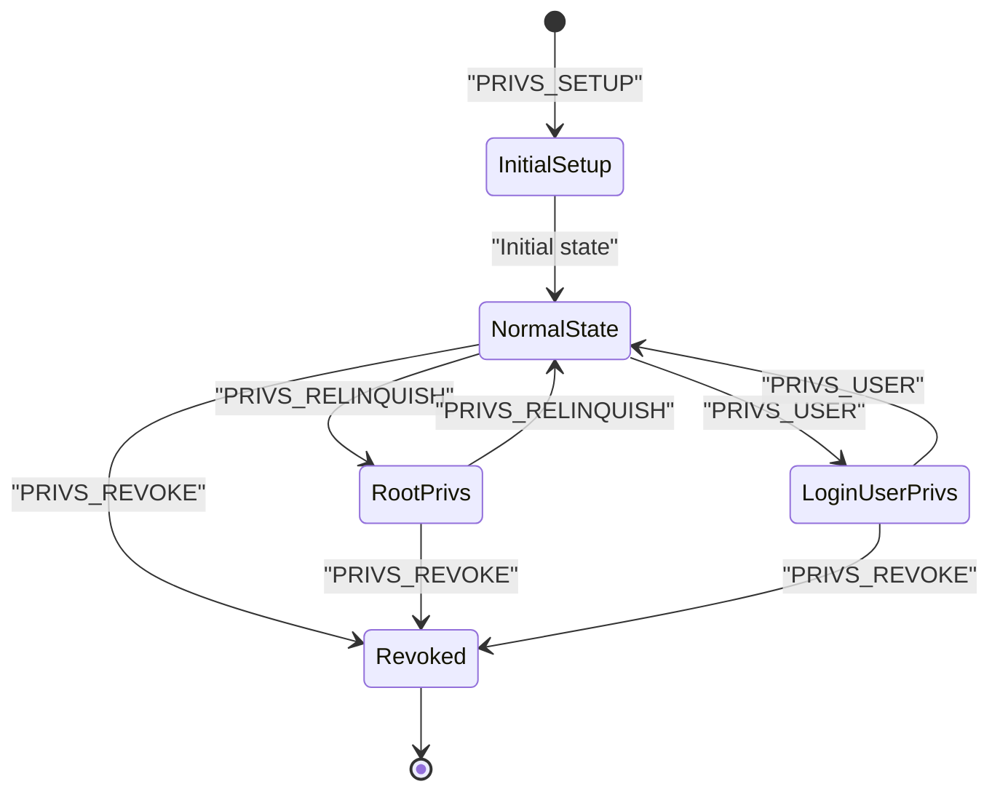
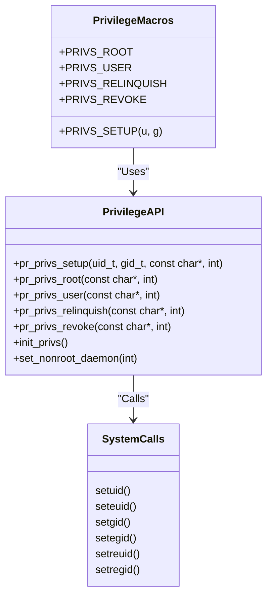
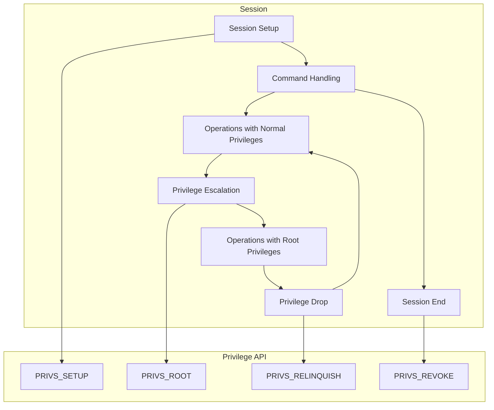

# Privilege Separation

> **Relevant source files**
> * [.codeql.yml](https://github.com/proftpd/proftpd/blob/362466f3/.codeql.yml)
> * [.github/workflows/ci.yml](https://github.com/proftpd/proftpd/blob/362466f3/.github/workflows/ci.yml)
> * [.github/workflows/codeql.yml](https://github.com/proftpd/proftpd/blob/362466f3/.github/workflows/codeql.yml)
> * [.github/workflows/legacy-platforms-ci.yml](https://github.com/proftpd/proftpd/blob/362466f3/.github/workflows/legacy-platforms-ci.yml)
> * [.github/workflows/rpm.yml](https://github.com/proftpd/proftpd/blob/362466f3/.github/workflows/rpm.yml)
> * [ChangeLog](https://github.com/proftpd/proftpd/blob/362466f3/ChangeLog)
> * [README.md](https://github.com/proftpd/proftpd/blob/362466f3/README.md)
> * [contrib/dist/rpm/proftpd.spec](https://github.com/proftpd/proftpd/blob/362466f3/contrib/dist/rpm/proftpd.spec)
> * [include/privs.h](https://github.com/proftpd/proftpd/blob/362466f3/include/privs.h)
> * [include/version.h](https://github.com/proftpd/proftpd/blob/362466f3/include/version.h)
> * [src/privs.c](https://github.com/proftpd/proftpd/blob/362466f3/src/privs.c)
> * [tests/api/privs.c](https://github.com/proftpd/proftpd/blob/362466f3/tests/api/privs.c)

Privilege separation is a core security mechanism in ProFTPD that minimizes the amount of code that needs to run with elevated privileges. This technique is essential for reducing the attack surface of the FTP server by ensuring that most operations run with the minimum necessary privileges.

## Overview and Purpose

The ProFTPD privilege separation system enables the server to:

1. Start as root to bind to privileged ports (< 1024) and access protected system resources
2. Drop privileges to a less-privileged user for normal operations
3. Temporarily regain root privileges when needed for specific operations
4. Completely revoke privileges when they're no longer needed

This approach significantly reduces the security risk in case of a vulnerability, as an attacker who might compromise the process would only gain the limited privileges of the non-root user.

## Privilege States and Transitions

### Privilege State Diagram



Sources: [src/privs.c](https://github.com/proftpd/proftpd/blob/362466f3/src/privs.c)

 [include/privs.h](https://github.com/proftpd/proftpd/blob/362466f3/include/privs.h)

This diagram illustrates the different privilege states and the API calls used to transition between them:

1. **Initial Setup**: The process starts and initializes its privilege state using `PRIVS_SETUP`
2. **Normal State**: The process runs with normal (non-root) privileges for most operations
3. **Root Privileges**: Temporarily elevated to root using `PRIVS_ROOT` for privileged operations
4. **Login User Privileges**: Temporarily switched to the authenticated user using `PRIVS_USER`
5. **Revoked**: All privileges permanently dropped using `PRIVS_REVOKE`

## Privilege Management API

ProFTPD provides a set of functions and macros for managing privileges throughout the codebase.

### API Structure



Sources: [include/privs.h L29-L67](https://github.com/proftpd/proftpd/blob/362466f3/include/privs.h#L29-L67)

 [src/privs.c L76-L439](https://github.com/proftpd/proftpd/blob/362466f3/src/privs.c#L76-L439)

### Core Functions

| Function | Purpose |
| --- | --- |
| `pr_privs_setup()` | Initialize privileges for a session |
| `pr_privs_root()` | Temporarily acquire root privileges |
| `pr_privs_user()` | Temporarily switch to the login user's privileges |
| `pr_privs_relinquish()` | Give up temporarily acquired privileges |
| `pr_privs_revoke()` | Permanently drop all privileges |
| `init_privs()` | Initialize the privilege subsystem |
| `set_nonroot_daemon()` | Configure daemon to run in non-root mode |

Sources: [src/privs.c L76-L147](https://github.com/proftpd/proftpd/blob/362466f3/src/privs.c#L76-L147)

 [src/privs.c L149-L196](https://github.com/proftpd/proftpd/blob/362466f3/src/privs.c#L149-L196)

 [src/privs.c L198-L260](https://github.com/proftpd/proftpd/blob/362466f3/src/privs.c#L198-L260)

 [src/privs.c L262-L367](https://github.com/proftpd/proftpd/blob/362466f3/src/privs.c#L262-L367)

 [src/privs.c L369-L414](https://github.com/proftpd/proftpd/blob/362466f3/src/privs.c#L369-L414)

 [src/privs.c L432-L439](https://github.com/proftpd/proftpd/blob/362466f3/src/privs.c#L432-L439)

 [src/privs.c L417-L430](https://github.com/proftpd/proftpd/blob/362466f3/src/privs.c#L417-L430)

### Convenience Macros

ProFTPD defines macros that expand to the core privilege functions for easier use:

| Macro | Expands To |
| --- | --- |
| `PRIVS_SETUP(u, g)` | `pr_privs_setup((u), (g), __FILE__, __LINE__)` |
| `PRIVS_ROOT` | `pr_privs_root(__FILE__, __LINE__)` |
| `PRIVS_USER` | `pr_privs_user(__FILE__, __LINE__)` |
| `PRIVS_RELINQUISH` | `pr_privs_relinquish(__FILE__, __LINE__)` |
| `PRIVS_REVOKE` | `pr_privs_revoke(__FILE__, __LINE__)` |

Source: [include/privs.h L53-L57](https://github.com/proftpd/proftpd/blob/362466f3/include/privs.h#L53-L57)

These macros automatically include source file and line information for better debugging and logging.

## How Privilege Separation Is Used

The following diagram shows how privilege separation is integrated into ProFTPD's architecture:



Sources: [src/privs.c L76-L147](https://github.com/proftpd/proftpd/blob/362466f3/src/privs.c#L76-L147)

 [src/privs.c L149-L196](https://github.com/proftpd/proftpd/blob/362466f3/src/privs.c#L149-L196)

 [src/privs.c L262-L367](https://github.com/proftpd/proftpd/blob/362466f3/src/privs.c#L262-L367)

 [src/privs.c L369-L414](https://github.com/proftpd/proftpd/blob/362466f3/src/privs.c#L369-L414)

## Implementation Details

### Privilege Nesting

The privilege API maintains counters (`root_privs` and `user_privs`) to track the nesting of privilege calls. This allows for nested calls to privilege functions, where privileges are only actually relinquished when the outermost nested call is made:

```sql
// Example of nested privilege calls
PRIVS_ROOT
  // Some code that needs root privs
  PRIVS_ROOT
    // More code needing root privs
  PRIVS_RELINQUISH  // Doesn't actually drop, just decrements counter
PRIVS_RELINQUISH  // Actually drops root privs here
```

Source: [src/privs.c L64-L65](https://github.com/proftpd/proftpd/blob/362466f3/src/privs.c#L64-L65)

 [src/privs.c L158-L166](https://github.com/proftpd/proftpd/blob/362466f3/src/privs.c#L158-L166)

 [src/privs.c L208-L216](https://github.com/proftpd/proftpd/blob/362466f3/src/privs.c#L208-L216)

 [src/privs.c L282-L288](https://github.com/proftpd/proftpd/blob/362466f3/src/privs.c#L282-L288)

### Root vs. Non-Root Operation

ProFTPD can operate in two primary modes:

1. **Root daemon mode**: Started as root, can drop to unprivileged user and regain root privileges as needed
2. **Non-root daemon mode**: Started as non-root, cannot gain privileges it doesn't have

When operating as a non-root daemon (determined by checking the UID during startup), privilege switching is essentially a no-op operation, as the process cannot gain privileges it doesn't have.

Source: [src/privs.c L32-L33](https://github.com/proftpd/proftpd/blob/362466f3/src/privs.c#L32-L33)

 [src/privs.c L77-L84](https://github.com/proftpd/proftpd/blob/362466f3/src/privs.c#L77-L84)

 [src/privs.c L150-L154](https://github.com/proftpd/proftpd/blob/362466f3/src/privs.c#L150-L154)

 [src/privs.c L199-L203](https://github.com/proftpd/proftpd/blob/362466f3/src/privs.c#L199-L203)

 [src/privs.c L263-L268](https://github.com/proftpd/proftpd/blob/362466f3/src/privs.c#L263-L268)

 [src/privs.c L370-L375](https://github.com/proftpd/proftpd/blob/362466f3/src/privs.c#L370-L375)

### Platform-Specific Considerations

ProFTPD uses either `seteuid()`/`setegid()` or `setreuid()`/`setregid()` depending on platform availability. This is handled by preprocessor conditionals in the code:

```
#if defined(HAVE_SETEUID)
  // Use seteuid()/setegid()
#else
  // Use setreuid()/setregid()
#endif
```

Source: [src/privs.c L103-L142](https://github.com/proftpd/proftpd/blob/362466f3/src/privs.c#L103-L142)

 [src/privs.c L172-L188](https://github.com/proftpd/proftpd/blob/362466f3/src/privs.c#L172-L188)

 [src/privs.c L221-L252](https://github.com/proftpd/proftpd/blob/362466f3/src/privs.c#L221-L252)

 [src/privs.c L296-L360](https://github.com/proftpd/proftpd/blob/362466f3/src/privs.c#L296-L360)

 [src/privs.c L385-L410](https://github.com/proftpd/proftpd/blob/362466f3/src/privs.c#L385-L410)

## Best Practices

### When to Use Each Function

| Function | When to Use |
| --- | --- |
| `PRIVS_SETUP` | During session initialization to set the base privilege level |
| `PRIVS_ROOT` | Before operations requiring root access (binding to ports, accessing protected files) |
| `PRIVS_USER` | When operations need to be performed as the authenticated user |
| `PRIVS_RELINQUISH` | After completing privileged operations to return to normal privileges |
| `PRIVS_REVOKE` | When privileges will no longer be needed (session end) |

### Security Considerations

1. **Minimize privilege duration**: Only hold elevated privileges for as short a time as possible
2. **Check return values**: Always check the return values of privilege functions
3. **Handle errors gracefully**: Be prepared for privilege operations to fail
4. **Debug with trace logging**: Enable trace logging for the `privs` channel to help debug privilege issues

## Testing

ProFTPD includes unit tests for the privilege separation functionality in the test suite:

Source: [tests/api/privs.c L1-L186](https://github.com/proftpd/proftpd/blob/362466f3/tests/api/privs.c#L1-L186)

These tests verify correct behavior of all privilege functions, including behavior under non-root operation.