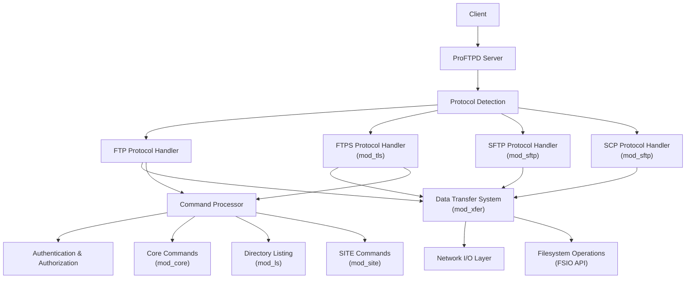
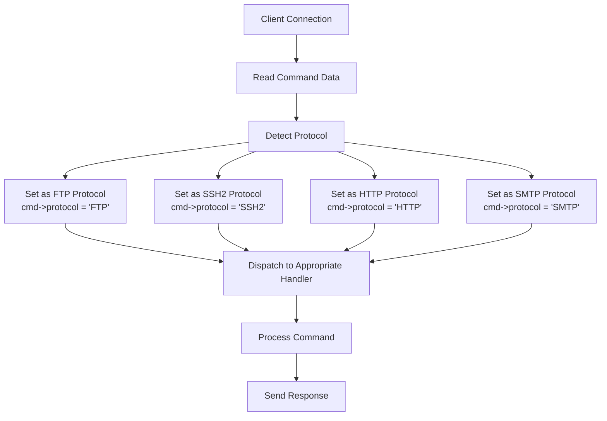
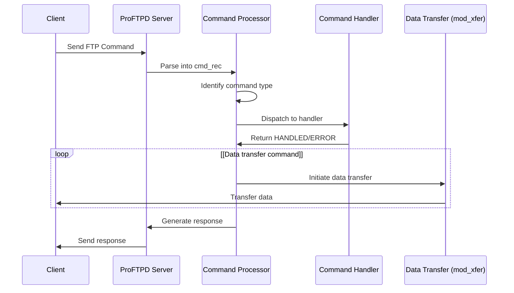
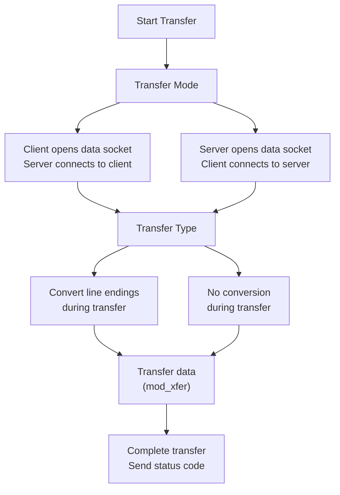
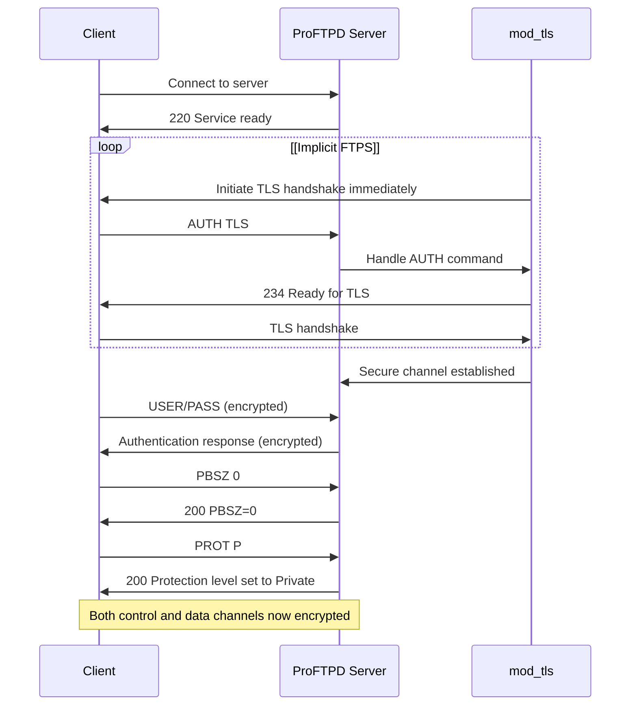
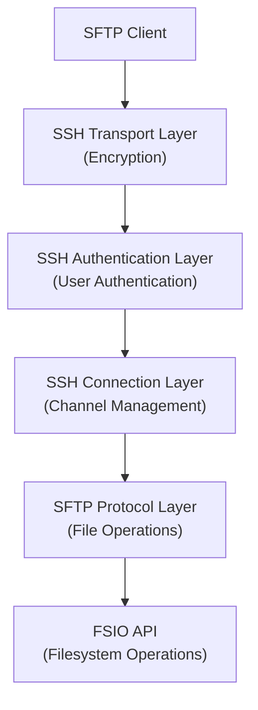
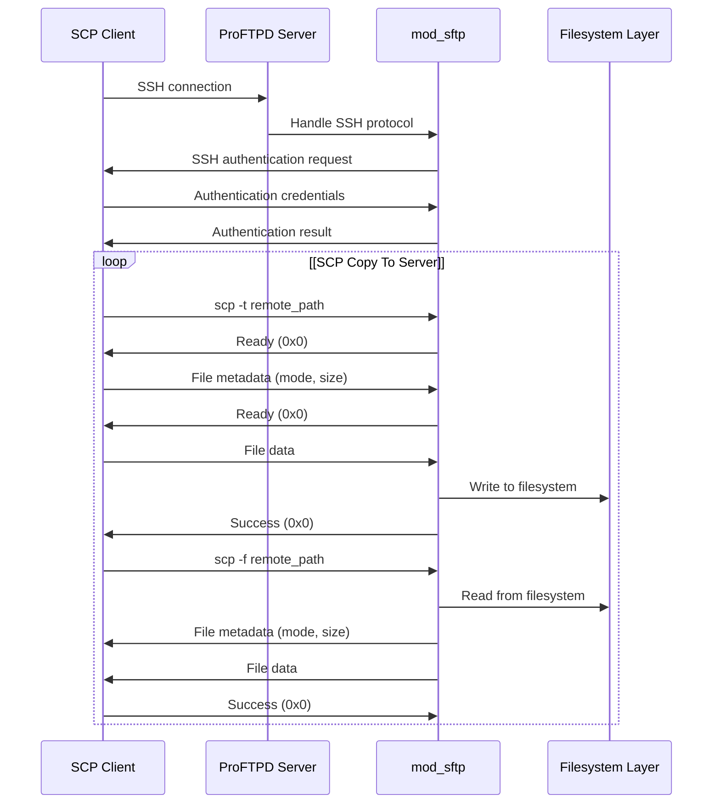

# Protocol Implementations

> **Relevant source files**
> * [NEWS](https://github.com/proftpd/proftpd/blob/362466f3/NEWS)
> * [include/dirtree.h](https://github.com/proftpd/proftpd/blob/362466f3/include/dirtree.h)
> * [include/inet.h](https://github.com/proftpd/proftpd/blob/362466f3/include/inet.h)
> * [include/proftpd.h](https://github.com/proftpd/proftpd/blob/362466f3/include/proftpd.h)
> * [modules/mod_auth.c](https://github.com/proftpd/proftpd/blob/362466f3/modules/mod_auth.c)
> * [modules/mod_core.c](https://github.com/proftpd/proftpd/blob/362466f3/modules/mod_core.c)
> * [modules/mod_ls.c](https://github.com/proftpd/proftpd/blob/362466f3/modules/mod_ls.c)
> * [modules/mod_site.c](https://github.com/proftpd/proftpd/blob/362466f3/modules/mod_site.c)
> * [modules/mod_xfer.c](https://github.com/proftpd/proftpd/blob/362466f3/modules/mod_xfer.c)
> * [src/data.c](https://github.com/proftpd/proftpd/blob/362466f3/src/data.c)
> * [src/dirtree.c](https://github.com/proftpd/proftpd/blob/362466f3/src/dirtree.c)
> * [src/inet.c](https://github.com/proftpd/proftpd/blob/362466f3/src/inet.c)
> * [src/main.c](https://github.com/proftpd/proftpd/blob/362466f3/src/main.c)

## Purpose and Scope

This document describes the protocol implementations in ProFTPD, including the various file transfer protocols supported, how they're implemented, and how they interact with the core systems. It covers the standard FTP protocol, FTPS (FTP over TLS/SSL), and SFTP/SCP (SSH-based protocols) implementations.

For information about authentication mechanisms, see [Authentication Systems](/proftpd/proftpd/3-authentication-systems). For details on network infrastructure that supports these protocols, see [Network Infrastructure](/proftpd/proftpd/2.3-network-infrastructure).

## Protocol Architecture Overview

ProFTPD supports multiple file transfer protocols through its modular architecture. The core server handles command dispatching, while specific modules implement the actual protocol behaviors.

Sources: [src/main.c L577-L591](https://github.com/proftpd/proftpd/blob/362466f3/src/main.c#L577-L591)

 [modules/mod_core.c L27-L28](https://github.com/proftpd/proftpd/blob/362466f3/modules/mod_core.c#L27-L28)

 [modules/mod_xfer.c L27-L28](https://github.com/proftpd/proftpd/blob/362466f3/modules/mod_xfer.c#L27-L28)

## Protocol Detection

ProFTPD determines which protocol a client is using by examining the first command sent. This happens in the command processing system in `src/main.c`.

Sources: [src/main.c L575-L591](https://github.com/proftpd/proftpd/blob/362466f3/src/main.c#L575-L591)

## FTP Protocol Implementation

The standard FTP protocol is ProFTPD's core functionality, implemented primarily through the `mod_core` and `mod_xfer` modules.

### FTP Command Processing

FTP commands follow a request-response pattern. When a command arrives:

1. The main server parses it into a command record (`cmd_rec`)
2. The command is dispatched to appropriate handlers
3. Command handlers process the request and generate a response
4. The response is sent back to the client

Sources: [src/main.c L457-L454](https://github.com/proftpd/proftpd/blob/362466f3/src/main.c#L457-L454)

 [src/main.c L800-L803](https://github.com/proftpd/proftpd/blob/362466f3/src/main.c#L800-L803)

### FTP Data Transfers

FTP uses separate control and data channels. Data transfers are handled by the `mod_xfer` module, which supports both active (PORT) and passive (PASV) modes.

Sources: [src/data.c L110-L170](https://github.com/proftpd/proftpd/blob/362466f3/src/data.c#L110-L170)

 [modules/mod_xfer.c L527-L578](https://github.com/proftpd/proftpd/blob/362466f3/modules/mod_xfer.c#L527-L578)

## FTPS (FTP over TLS/SSL) Implementation

FTPS extends the standard FTP protocol with TLS/SSL encryption. It's implemented through the `mod_tls` module.

### FTPS Session Establishment

Sources: [modules/mod_core.c](https://github.com/proftpd/proftpd/blob/362466f3/modules/mod_core.c)

 [NEWS L250-L255](https://github.com/proftpd/proftpd/blob/362466f3/NEWS#L250-L255)

 [NEWS L704-L705](https://github.com/proftpd/proftpd/blob/362466f3/NEWS#L704-L705)

### FTPS Data Channel Protection

FTPS can encrypt both the control channel (commands) and data channel (file transfers). The level of protection is negotiated using the PROT command.

The module handles:

* TLS session management
* Certificate validation
* Secure data transfers
* Protection level negotiation

Sources: [NEWS L618](https://github.com/proftpd/proftpd/blob/362466f3/NEWS#L618-L618)

 [NEWS L959](https://github.com/proftpd/proftpd/blob/362466f3/NEWS#L959-L959)

 [NEWS L968](https://github.com/proftpd/proftpd/blob/362466f3/NEWS#L968-L968)

## SFTP/SCP Protocol Implementation

SSH-based file transfer protocols (SFTP and SCP) are handled by the `mod_sftp` module. Unlike FTP/FTPS, these protocols:

* Use a single encrypted channel for both commands and data
* Provide built-in authentication mechanisms
* Support more advanced file operations

### SFTP Protocol Layers

Sources: [NEWS L579-L580](https://github.com/proftpd/proftpd/blob/362466f3/NEWS#L579-L580)

 [NEWS L1570-L1571](https://github.com/proftpd/proftpd/blob/362466f3/NEWS#L1570-L1571)

 [NEWS L1579-L1580](https://github.com/proftpd/proftpd/blob/362466f3/NEWS#L1579-L1580)

### SFTP/SCP Key Features

The SFTP/SCP implementation in ProFTPD includes:

1. **SSH Key Management**: Support for various key types including RSA, DSA, ECDSA, and ED25519
2. **Multiple Authentication Methods**: PublicKey, Password, and Keyboard-Interactive
3. **Protocol Versions**: Supports SFTP versions 3-6
4. **Extensions**: Implements standard extensions such as statvfs, fsync, and check-file

Sources: [NEWS L907-L908](https://github.com/proftpd/proftpd/blob/362466f3/NEWS#L907-L908)

 [NEWS L392-L393](https://github.com/proftpd/proftpd/blob/362466f3/NEWS#L392-L393)

 [NEWS L1570-L1571](https://github.com/proftpd/proftpd/blob/362466f3/NEWS#L1570-L1571)

 [NEWS L180-L183](https://github.com/proftpd/proftpd/blob/362466f3/NEWS#L180-L183)

 [NEWS L1798-L1799](https://github.com/proftpd/proftpd/blob/362466f3/NEWS#L1798-L1799)

### SCP Command Flow

Sources: [NEWS L1886](https://github.com/proftpd/proftpd/blob/362466f3/NEWS#L1886-L1886)

 [NEWS L4341](https://github.com/proftpd/proftpd/blob/362466f3/NEWS#L4341-L4341)

 [NEWS L676](https://github.com/proftpd/proftpd/blob/362466f3/NEWS#L676-L676)

 [NEWS L4257](https://github.com/proftpd/proftpd/blob/362466f3/NEWS#L4257-L4257)

## Protocol Extensions and Feature Negotiation

ProFTPD supports protocol extensions and feature negotiation to enhance functionality while maintaining compatibility.

### FTP Feature Negotiation

The FEAT command allows clients to discover supported features:

| Extension | Description | Implementing Module |
| --- | --- | --- |
| AUTH | Authentication/Security Mechanism | mod_tls |
| EPRT | Extended PORT Command (IPv6 support) | mod_core |
| EPSV | Extended PASV Command (IPv6 support) | mod_core |
| MDTM | File Modification Time | mod_core |
| MLSD | Machine Readable Directory Listing | mod_facts |
| MLST | Machine Readable File Status | mod_facts |
| PROT | Data Channel Protection Level | mod_tls |
| SIZE | Get File Size | mod_core |
| SITE | Site-specific Commands | mod_site |
| UTF8 | UTF-8 Encoding Support | mod_lang |

Sources: [modules/mod_core.c](https://github.com/proftpd/proftpd/blob/362466f3/modules/mod_core.c)

 [NEWS L1212-L1213](https://github.com/proftpd/proftpd/blob/362466f3/NEWS#L1212-L1213)

 [modules/mod_site.c L36-L41](https://github.com/proftpd/proftpd/blob/362466f3/modules/mod_site.c#L36-L41)

### SFTP Protocol Extensions

SFTP extensions add functionality beyond the base protocol:

| Extension | Description | Implementation Status |
| --- | --- | --- |
| check-file | Verify file integrity | Supported |
| copy-file | Server-side file copy | Supported |
| fsync | Flush data to disk | Supported |
| limits | Server resource limits | Added in 1.3.9rc3 |
| statvfs | File system information | Supported |
| vendor-id | Server identification | Supported |

Sources: [NEWS L1569-L1570](https://github.com/proftpd/proftpd/blob/362466f3/NEWS#L1569-L1570)

 [NEWS L1798-L1799](https://github.com/proftpd/proftpd/blob/362466f3/NEWS#L1798-L1799)

 [NEWS L1792-L1793](https://github.com/proftpd/proftpd/blob/362466f3/NEWS#L1792-L1793)

 [NEWS L580-L581](https://github.com/proftpd/proftpd/blob/362466f3/NEWS#L580-L581)

## Protocol Compatibility Considerations

ProFTPD includes various features to ensure compatibility with different clients:

1. **TLS/SSL Version Compatibility**: Configurable SSL/TLS protocol versions and cipher suites
2. **SSH Algorithm Negotiation**: Support for various key exchange, encryption, and MAC algorithms
3. **Client Behavior Accommodations**: Handling of non-standard client implementations
4. **Protocol Stacks**: Support for legacy and modern protocol features

Sources: [NEWS L954-L955](https://github.com/proftpd/proftpd/blob/362466f3/NEWS#L954-L955)

 [NEWS L1089-L1090](https://github.com/proftpd/proftpd/blob/362466f3/NEWS#L1089-L1090)

 [NEWS L1806-L1808](https://github.com/proftpd/proftpd/blob/362466f3/NEWS#L1806-L1808)

 [NEWS L663](https://github.com/proftpd/proftpd/blob/362466f3/NEWS#L663-L663)