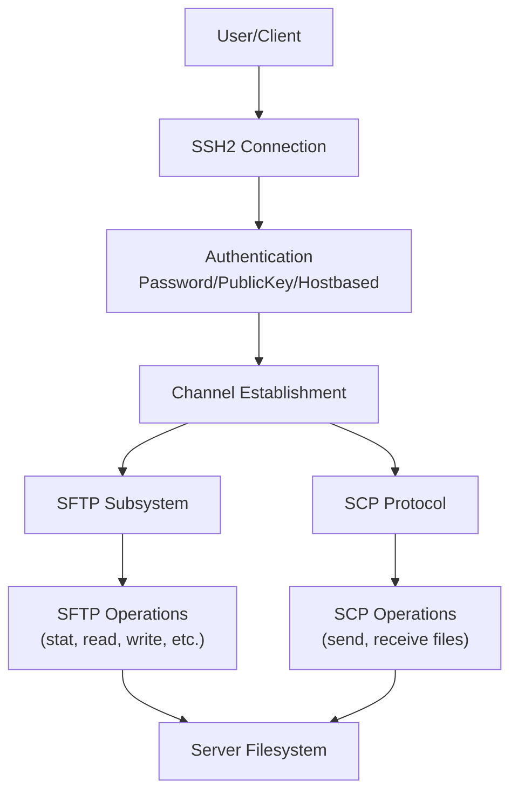
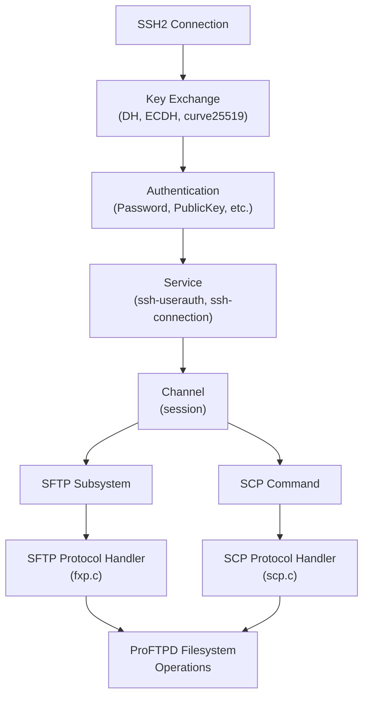
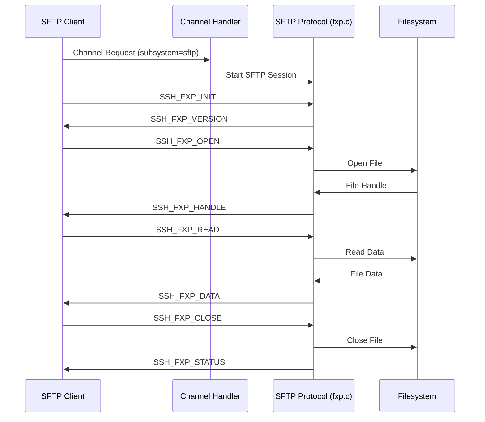
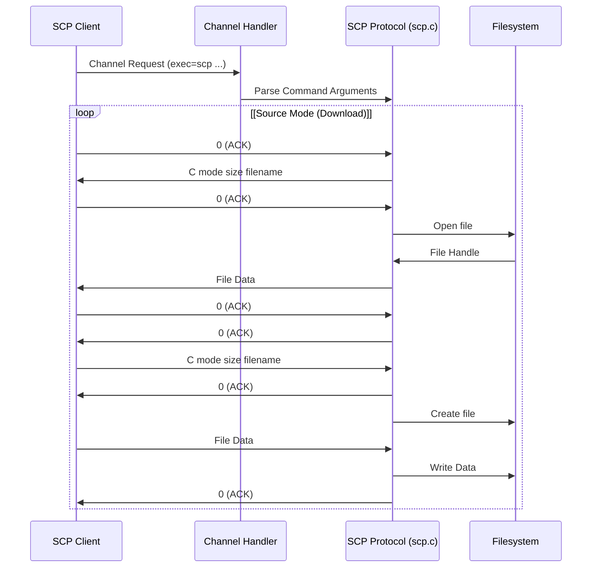
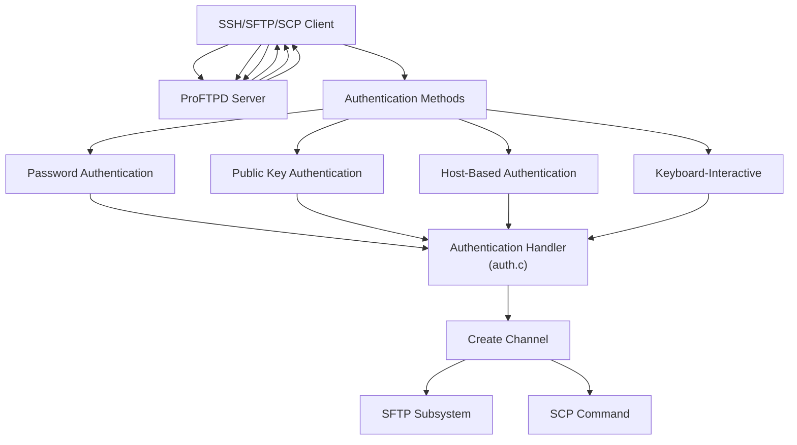
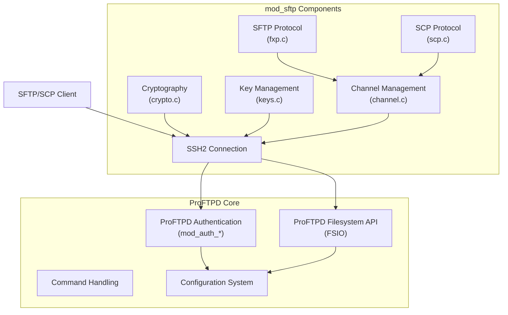

# SFTP and SCP

> **Relevant source files**
> * [contrib/mod_sftp/auth.c](https://github.com/proftpd/proftpd/blob/362466f3/contrib/mod_sftp/auth.c)
> * [contrib/mod_sftp/blacklist.h](https://github.com/proftpd/proftpd/blob/362466f3/contrib/mod_sftp/blacklist.h)
> * [contrib/mod_sftp/channel.c](https://github.com/proftpd/proftpd/blob/362466f3/contrib/mod_sftp/channel.c)
> * [contrib/mod_sftp/channel.h](https://github.com/proftpd/proftpd/blob/362466f3/contrib/mod_sftp/channel.h)
> * [contrib/mod_sftp/crypto.c](https://github.com/proftpd/proftpd/blob/362466f3/contrib/mod_sftp/crypto.c)
> * [contrib/mod_sftp/fxp.c](https://github.com/proftpd/proftpd/blob/362466f3/contrib/mod_sftp/fxp.c)
> * [contrib/mod_sftp/fxp.h](https://github.com/proftpd/proftpd/blob/362466f3/contrib/mod_sftp/fxp.h)
> * [contrib/mod_sftp/kex.c](https://github.com/proftpd/proftpd/blob/362466f3/contrib/mod_sftp/kex.c)
> * [contrib/mod_sftp/mod_sftp.c](https://github.com/proftpd/proftpd/blob/362466f3/contrib/mod_sftp/mod_sftp.c)
> * [contrib/mod_sftp/mod_sftp.h.in](https://github.com/proftpd/proftpd/blob/362466f3/contrib/mod_sftp/mod_sftp.h.in)
> * [contrib/mod_sftp/scp.c](https://github.com/proftpd/proftpd/blob/362466f3/contrib/mod_sftp/scp.c)
> * [contrib/mod_sftp/scp.h](https://github.com/proftpd/proftpd/blob/362466f3/contrib/mod_sftp/scp.h)
> * [contrib/mod_sftp/service.c](https://github.com/proftpd/proftpd/blob/362466f3/contrib/mod_sftp/service.c)
> * [doc/contrib/mod_sftp.html](https://github.com/proftpd/proftpd/blob/362466f3/doc/contrib/mod_sftp.html)
> * [tests/t/lib/ProFTPD/Tests/Modules/mod_sftp.pm](https://github.com/proftpd/proftpd/blob/362466f3/tests/t/lib/ProFTPD/Tests/Modules/mod_sftp.pm)

## Overview

This document describes the SFTP (SSH File Transfer Protocol) and SCP (Secure Copy Protocol) implementations in ProFTPD's mod_sftp module. The module provides secure file transfer capabilities through the SSH2 protocol, allowing clients to securely connect and transfer files without requiring standard FTP. For information about FTP over SSL/TLS (FTPS), see [FTPS over TLS/SSL](/proftpd/proftpd/4.1-ftp-over-tlsssl-(ftps)).

SFTP and SCP are distinct from the FTP protocol in several important ways:

* They operate over a single, encrypted SSH connection
* They don't require separate control and data channels
* They provide built-in encryption, authentication, and integrity verification

ProFTPD's mod_sftp implementation supports both protocols within the same module, allowing administrators to offer either or both services.

Sources: [contrib/mod_sftp/mod_sftp.c L1-L27](https://github.com/proftpd/proftpd/blob/362466f3/contrib/mod_sftp/mod_sftp.c#L1-L27)

 [doc/contrib/mod_sftp.html L15-L96](https://github.com/proftpd/proftpd/blob/362466f3/doc/contrib/mod_sftp.html#L15-L96)

## Protocol Overview and Architecture

### Protocol Comparison

Sources: [contrib/mod_sftp/mod_sftp.c L25-L47](https://github.com/proftpd/proftpd/blob/362466f3/contrib/mod_sftp/mod_sftp.c#L25-L47)

 [contrib/mod_sftp/mod_sftp.h.in L25-L73](https://github.com/proftpd/proftpd/blob/362466f3/contrib/mod_sftp/mod_sftp.h.in#L25-L73)

### SSH2 Channel Architecture

SSH2 uses a channel mechanism that allows multiplexing multiple data streams over a single connection. The mod_sftp module creates channels for SFTP and SCP operations:

Sources: [contrib/mod_sftp/channel.c L38-L97](https://github.com/proftpd/proftpd/blob/362466f3/contrib/mod_sftp/channel.c#L38-L97)

 [contrib/mod_sftp/channel.h L25-L41](https://github.com/proftpd/proftpd/blob/362466f3/contrib/mod_sftp/channel.h#L25-L41)

 [contrib/mod_sftp/kex.c L25-L49](https://github.com/proftpd/proftpd/blob/362466f3/contrib/mod_sftp/kex.c#L25-L49)

 [contrib/mod_sftp/service.c L25-L34](https://github.com/proftpd/proftpd/blob/362466f3/contrib/mod_sftp/service.c#L25-L34)

## SFTP Implementation

The SFTP subsystem in mod_sftp implements the SFTP protocol versions 1-6. It handles file and directory operations through the SSH channel mechanism.

### SFTP Protocol Data Flow

Sources: [contrib/mod_sftp/fxp.c L25-L37](https://github.com/proftpd/proftpd/blob/362466f3/contrib/mod_sftp/fxp.c#L25-L37)

 [contrib/mod_sftp/fxp.h L25-L37](https://github.com/proftpd/proftpd/blob/362466f3/contrib/mod_sftp/fxp.h#L25-L37)

### SFTP Packet Types

ProFTPD's SFTP implementation supports all standard SFTP packet types, including:

| Packet Type | ID | Description |
| --- | --- | --- |
| FXP_INIT | 1 | Initialize SFTP session |
| FXP_VERSION | 2 | Server version response |
| FXP_OPEN | 3 | Open a file |
| FXP_CLOSE | 4 | Close a file handle |
| FXP_READ | 5 | Read from a file handle |
| FXP_WRITE | 6 | Write to a file handle |
| FXP_LSTAT | 7 | Get file attributes (no follow symlinks) |
| FXP_FSTAT | 8 | Get file handle attributes |
| FXP_SETSTAT | 9 | Set file attributes |
| FXP_FSETSTAT | 10 | Set file handle attributes |
| FXP_OPENDIR | 11 | Open a directory |
| FXP_READDIR | 12 | Read directory entries |
| FXP_REMOVE | 13 | Remove a file |
| FXP_MKDIR | 14 | Create a directory |
| FXP_RMDIR | 15 | Remove a directory |
| FXP_REALPATH | 16 | Canonicalize a path |
| FXP_STAT | 17 | Get file attributes (follow symlinks) |
| FXP_RENAME | 18 | Rename a file |
| FXP_READLINK | 19 | Read a symbolic link |
| FXP_SYMLINK | 20 | Create a symbolic link |

Sources: [contrib/mod_sftp/fxp.c L35-L65](https://github.com/proftpd/proftpd/blob/362466f3/contrib/mod_sftp/fxp.c#L35-L65)

 [contrib/mod_sftp/fxp.h L35-L64](https://github.com/proftpd/proftpd/blob/362466f3/contrib/mod_sftp/fxp.h#L35-L64)

### SFTP Extensions

ProFTPD's SFTP implementation supports several protocol extensions:

| Extension | Description |
| --- | --- |
| check-file | Verify file checksums |
| copy-file | Server-side file copying |
| version-select | Negotiate protocol version |
| [posix-rename@openssh.com](mailto:posix-rename@openssh.com) | Atomic rename operations |
| [statvfs@openssh.com](mailto:statvfs@openssh.com) | Filesystem statistics |
| vendor-id | Server vendor identification |
| space-avail | Available space information |
| fsync | Synchronize file data |
| [hardlink@openssh.com](mailto:hardlink@openssh.com) | Create hard links |
| xattr | Extended attributes |

Sources: [contrib/mod_sftp/fxp.c L66-L83](https://github.com/proftpd/proftpd/blob/362466f3/contrib/mod_sftp/fxp.c#L66-L83)

 [contrib/mod_sftp/fxp.h L66-L82](https://github.com/proftpd/proftpd/blob/362466f3/contrib/mod_sftp/fxp.h#L66-L82)

### SFTP File Operations

SFTP file operations are handled by creating and processing packets with specific message types. The flow involves:

1. Client sends a request packet (e.g., OPEN, READ, WRITE)
2. Server processes the request in the corresponding handler function
3. Server accesses the filesystem using ProFTPD's filesystems API
4. Server sends a response packet (HANDLE, DATA, STATUS)

The file transfer process is window-based, with flow control to prevent overwhelming either side.

Sources: [contrib/mod_sftp/fxp.c L195-L250](https://github.com/proftpd/proftpd/blob/362466f3/contrib/mod_sftp/fxp.c#L195-L250)

 [contrib/mod_sftp/fxp.c L601-L758](https://github.com/proftpd/proftpd/blob/362466f3/contrib/mod_sftp/fxp.c#L601-L758)

## SCP Implementation

Secure Copy Protocol (SCP) provides a mechanism for securely transferring files similar to the Unix `cp` command. It's simpler than SFTP but less flexible.

### SCP Protocol Flow

Sources: [contrib/mod_sftp/scp.c L25-L166](https://github.com/proftpd/proftpd/blob/362466f3/contrib/mod_sftp/scp.c#L25-L166)

 [contrib/mod_sftp/scp.h L25-L39](https://github.com/proftpd/proftpd/blob/362466f3/contrib/mod_sftp/scp.h#L25-L39)

### SCP Command Options

SCP supports several options that determine how files are transferred:

| Option | Flag | Description |
| --- | --- | --- |
| Source Mode | SFTP_SCP_OPT_ISSRC | Copy from server to client |
| Target Mode | SFTP_SCP_OPT_ISDST | Copy from client to server |
| Directory Mode | SFTP_SCP_OPT_DIR | Transfer directories |
| Verbose | SFTP_SCP_OPT_VERBOSE | Provide verbose output |
| Preserve Attributes | SFTP_SCP_OPT_PRESERVE | Preserve timestamps, modes |
| Recursive | SFTP_SCP_OPT_RECURSE | Recursively copy directories |

Sources: [contrib/mod_sftp/scp.c L139-L146](https://github.com/proftpd/proftpd/blob/362466f3/contrib/mod_sftp/scp.c#L139-L146)

### SCP Transfer Process

The SCP protocol uses a simple command-response mechanism:

1. Command messages for control (C = file, D = directory, etc.)
2. Single-byte response codes (0 = OK, 1 = warning, 2 = fatal error)
3. File data transfers after confirmation

For uploads (client to server):

* Client sends file/directory information
* Server acknowledges
* Client sends file data
* Server acknowledges completion

For downloads (server to client):

* Server sends file/directory information
* Client acknowledges
* Server sends file data
* Client acknowledges completion

Sources: [contrib/mod_sftp/scp.c L304-L378](https://github.com/proftpd/proftpd/blob/362466f3/contrib/mod_sftp/scp.c#L304-L378)

 [contrib/mod_sftp/scp.c L379-L447](https://github.com/proftpd/proftpd/blob/362466f3/contrib/mod_sftp/scp.c#L379-L447)

## Authentication Methods

Both SFTP and SCP use the same SSH authentication mechanisms. ProFTPD's mod_sftp supports several authentication methods:

### Authentication Flow

Sources: [contrib/mod_sftp/auth.c L58-L97](https://github.com/proftpd/proftpd/blob/362466f3/contrib/mod_sftp/auth.c#L58-L97)

 [contrib/mod_sftp/auth.c L223-L333](https://github.com/proftpd/proftpd/blob/362466f3/contrib/mod_sftp/auth.c#L223-L333)

### Public Key Authentication

Public key authentication is a secure, key-based method that uses:

1. Client generates a key pair (private and public)
2. Server stores or verifies the public key
3. Client signs data with private key to prove identity
4. Server verifies signature using public key

ProFTPD supports various key types:

* RSA
* DSA
* ECDSA (with NIST curves P-256, P-384, P-521)
* Ed25519
* Ed448

Sources: [contrib/mod_sftp/auth.c L73-L96](https://github.com/proftpd/proftpd/blob/362466f3/contrib/mod_sftp/auth.c#L73-L96)

 [doc/contrib/mod_sftp.html L262-L274](https://github.com/proftpd/proftpd/blob/362466f3/doc/contrib/mod_sftp.html#L262-L274)

## Integration with ProFTPD

The mod_sftp module integrates with ProFTPD's core architecture, leveraging existing authentication and filesystem mechanisms while providing SSH-specific functionality.

Sources: [contrib/mod_sftp/mod_sftp.c L238-L336](https://github.com/proftpd/proftpd/blob/362466f3/contrib/mod_sftp/mod_sftp.c#L238-L336)

 [contrib/mod_sftp/mod_sftp.h.in L25-L89](https://github.com/proftpd/proftpd/blob/362466f3/contrib/mod_sftp/mod_sftp.h.in#L25-L89)

## Security Considerations

### Cipher and MAC Algorithms

The SFTP/SCP implementation supports various encryption and message authentication algorithms:

**Ciphers:**

* AES (128, 192, 256-bit) in CBC and CTR modes
* AES-GCM (128, 256-bit)
* ChaCha20-Poly1305
* 3DES
* Blowfish, CAST128, Arcfour (disabled by default)

**MAC algorithms:**

* HMAC-SHA1, HMAC-SHA1-96
* HMAC-SHA2-256, HMAC-SHA2-512
* HMAC-MD5, HMAC-MD5-96 (disabled by default)
* UMAC-64, UMAC-128
* ETM (encrypt-then-MAC) variants

Sources: [contrib/mod_sftp/crypto.c L85-L156](https://github.com/proftpd/proftpd/blob/362466f3/contrib/mod_sftp/crypto.c#L85-L156)

 [contrib/mod_sftp/crypto.c L181-L197](https://github.com/proftpd/proftpd/blob/362466f3/contrib/mod_sftp/crypto.c#L181-L197)

 [doc/contrib/mod_sftp.html L366-L431](https://github.com/proftpd/proftpd/blob/362466f3/doc/contrib/mod_sftp.html#L366-L431)

### Key Exchange Methods

Key exchange algorithms establish the shared secret for encryption:

* Diffie-Hellman Groups 1, 14, 16, 18
* Diffie-Hellman Group Exchange
* ECDH with NIST curves (P-256, P-384, P-521)
* Curve25519, Curve448 (when supported)

Sources: [contrib/mod_sftp/kex.c L177-L261](https://github.com/proftpd/proftpd/blob/362466f3/contrib/mod_sftp/kex.c#L177-L261)

 [contrib/mod_sftp/kex.c L264-L276](https://github.com/proftpd/proftpd/blob/362466f3/contrib/mod_sftp/kex.c#L264-L276)

 [doc/contrib/mod_sftp.html L60-L72](https://github.com/proftpd/proftpd/blob/362466f3/doc/contrib/mod_sftp.html#L60-L72)

## Performance and Configuration

### Window Size and Buffer Management

SFTP uses a windowing mechanism for flow control:

* Default window size: 4 GB (can be tuned)
* Default packet size: 32 KB (can be tuned)
* Buffering for managing flow control

Sources: [contrib/mod_sftp/channel.c L87-L89](https://github.com/proftpd/proftpd/blob/362466f3/contrib/mod_sftp/channel.c#L87-L89)

 [contrib/mod_sftp/channel.h L36-L40](https://github.com/proftpd/proftpd/blob/362466f3/contrib/mod_sftp/channel.h#L36-L40)

### Client Compatibility

The module includes interoperability features for various clients:

* Client detection and version handling
* Protocol variations for specific clients
* Extension negotiation support

Sources: [contrib/mod_sftp/mod_sftp.c L84-L236](https://github.com/proftpd/proftpd/blob/362466f3/contrib/mod_sftp/mod_sftp.c#L84-L236)

 [doc/contrib/mod_sftp.html L475-L558](https://github.com/proftpd/proftpd/blob/362466f3/doc/contrib/mod_sftp.html#L475-L558)

## Conclusion

ProFTPD's mod_sftp module provides a robust implementation of both SFTP and SCP protocols, offering secure file transfer capabilities through the SSH2 protocol. The implementation supports modern encryption algorithms, various authentication methods, and numerous protocol extensions, making it a versatile solution for secure file transfers.