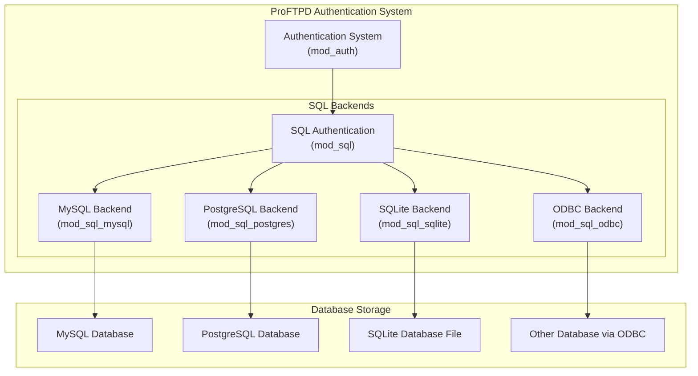
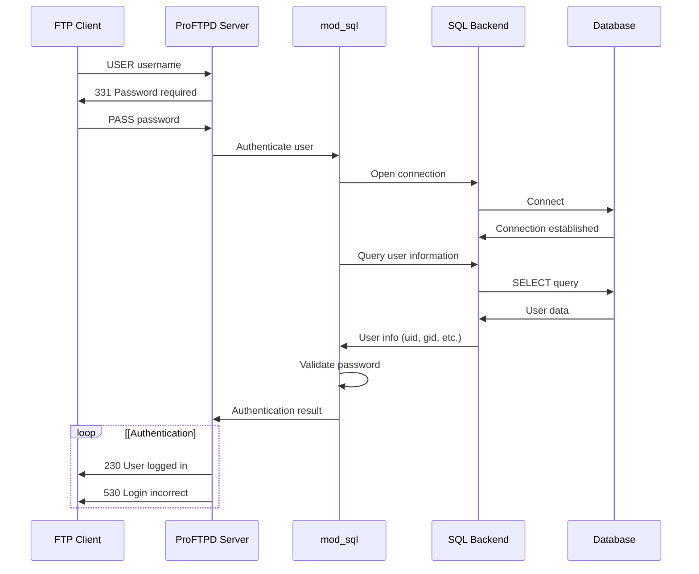
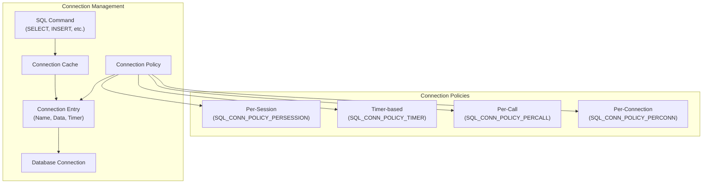

# SQL Authentication

> **Relevant source files**
> * [contrib/mod_sql.c](https://github.com/proftpd/proftpd/blob/362466f3/contrib/mod_sql.c)
> * [contrib/mod_sql.h](https://github.com/proftpd/proftpd/blob/362466f3/contrib/mod_sql.h)
> * [contrib/mod_sql_mysql.c](https://github.com/proftpd/proftpd/blob/362466f3/contrib/mod_sql_mysql.c)
> * [contrib/mod_sql_odbc.c](https://github.com/proftpd/proftpd/blob/362466f3/contrib/mod_sql_odbc.c)
> * [contrib/mod_sql_postgres.c](https://github.com/proftpd/proftpd/blob/362466f3/contrib/mod_sql_postgres.c)
> * [contrib/mod_sql_sqlite.c](https://github.com/proftpd/proftpd/blob/362466f3/contrib/mod_sql_sqlite.c)
> * [doc/contrib/mod_sql_odbc.html](https://github.com/proftpd/proftpd/blob/362466f3/doc/contrib/mod_sql_odbc.html)
> * [doc/contrib/mod_sql_sqlite.html](https://github.com/proftpd/proftpd/blob/362466f3/doc/contrib/mod_sql_sqlite.html)
> * [include/log.h](https://github.com/proftpd/proftpd/blob/362466f3/include/log.h)
> * [modules/mod_log.c](https://github.com/proftpd/proftpd/blob/362466f3/modules/mod_log.c)
> * [src/log.c](https://github.com/proftpd/proftpd/blob/362466f3/src/log.c)
> * [tests/t/etc/modules/mod_sql_odbc/odbc.ini](https://github.com/proftpd/proftpd/blob/362466f3/tests/t/etc/modules/mod_sql_odbc/odbc.ini)
> * [tests/t/etc/modules/mod_sql_odbc/odbcinst.ini](https://github.com/proftpd/proftpd/blob/362466f3/tests/t/etc/modules/mod_sql_odbc/odbcinst.ini)
> * [tests/t/lib/ProFTPD/Tests/Modules/mod_sql_sqlite.pm](https://github.com/proftpd/proftpd/blob/362466f3/tests/t/lib/ProFTPD/Tests/Modules/mod_sql_sqlite.pm)

This page documents the SQL Authentication system in ProFTPD, which allows users to be authenticated against SQL databases instead of traditional Unix authentication methods. SQL Authentication provides a flexible way to store and validate user credentials, retrieve user information, and manage user privileges via various SQL database backends.

For information about Unix and File-based authentication methods, see [Unix and File-based Authentication](/proftpd/proftpd/3.1-unix-and-file-based-authentication).

## Overview

The SQL Authentication system is part of ProFTPD's modular authentication framework. It consists of a core SQL module (`mod_sql`) that provides a common interface for various database backends. These backends include MySQL, PostgreSQL, SQLite, and ODBC-compatible databases.



Sources: [contrib/mod_sql.c L102-L207](https://github.com/proftpd/proftpd/blob/362466f3/contrib/mod_sql.c#L102-L207)

 [contrib/mod_sql_mysql.c L26-L120](https://github.com/proftpd/proftpd/blob/362466f3/contrib/mod_sql_mysql.c#L26-L120)

 [contrib/mod_sql_postgres.c L20-L100](https://github.com/proftpd/proftpd/blob/362466f3/contrib/mod_sql_postgres.c#L20-L100)

 [contrib/mod_sql_sqlite.c L15-L40](https://github.com/proftpd/proftpd/blob/362466f3/contrib/mod_sql_sqlite.c#L15-L40)

 [contrib/mod_sql_odbc.c L17-L40](https://github.com/proftpd/proftpd/blob/362466f3/contrib/mod_sql_odbc.c#L17-L40)

## Authentication Flow

When a user attempts to log in, the authentication flow proceeds as follows:



Sources: [contrib/mod_sql.c L1312-L1344](https://github.com/proftpd/proftpd/blob/362466f3/contrib/mod_sql.c#L1312-L1344)

 [contrib/mod_sql.c L1099-L1212](https://github.com/proftpd/proftpd/blob/362466f3/contrib/mod_sql.c#L1099-L1212)

## Configuration Components

### Database Tables

SQL Authentication requires at least two tables in your database:

1. **Users Table**: Stores user authentication information
2. **Groups Table**: Stores group membership information

The default table structure includes:

| Table | Default Name | Purpose |
| --- | --- | --- |
| Users | `users` | Stores user credentials and information |
| Groups | `groups` | Stores group membership information |

#### Default User Table Structure

| Field | Default Column Name | Description |
| --- | --- | --- |
| Username | `userid` | User's login name |
| Password | `passwd` | User's password (plaintext or hashed) |
| UID | `uid` | User's numeric user ID |
| GID | `gid` | User's primary group ID |
| Home Directory | `homedir` | User's home directory |
| Shell | `shell` | User's shell (optional) |

#### Default Group Table Structure

| Field | Default Column Name | Description |
| --- | --- | --- |
| Group Name | `groupname` | Group's name |
| GID | `gid` | Group's numeric ID |
| Members | `members` | Comma-separated list of group members |

Sources: [contrib/mod_sql.c L47-L65](https://github.com/proftpd/proftpd/blob/362466f3/contrib/mod_sql.c#L47-L65)

## Authentication Types

`mod_sql` supports multiple authentication types for verifying passwords:

| Auth Type | Description |
| --- | --- |
| `Plaintext` | Direct comparison of passwords |
| `Crypt` | Uses system's crypt() function |
| `OpenSSL` | Various digest formats with {digest}hash syntax |
| `Empty` | Allow empty passwords |
| `Backend` | Backend-specific authentication methods |

Sources: [contrib/mod_sql.c L1099-L1212](https://github.com/proftpd/proftpd/blob/362466f3/contrib/mod_sql.c#L1099-L1212)

## Connection Management

`mod_sql` manages database connections through a connection cache system. The module supports named connections and various connection policies.



Sources: [contrib/mod_sql.c L151-L207](https://github.com/proftpd/proftpd/blob/362466f3/contrib/mod_sql.c#L151-L207)

 [contrib/mod_sql.c L254-L307](https://github.com/proftpd/proftpd/blob/362466f3/contrib/mod_sql.c#L254-L307)

## Backend Modules

### MySQL Backend

The MySQL backend uses the native MySQL client library to connect to MySQL databases.

Key features:

* Connection parameters: host, user, password, database, port, socket
* SSL/TLS support for encrypted connections
* Custom MySQL-specific authentication

Sources: [contrib/mod_sql_mysql.c L155-L179](https://github.com/proftpd/proftpd/blob/362466f3/contrib/mod_sql_mysql.c#L155-L179)

### PostgreSQL Backend

The PostgreSQL backend uses the native PostgreSQL client library.

Key features:

* Connection parameters: host, user, password, database, port
* SSL/TLS support
* NLS (National Language Support) encoding

Sources: [contrib/mod_sql_postgres.c L81-L98](https://github.com/proftpd/proftpd/blob/362466f3/contrib/mod_sql_postgres.c#L81-L98)

### SQLite Backend

The SQLite backend provides a lightweight database option with no separate server requirement.

Key features:

* Uses a local database file
* Simple configuration (just specify the database file path)
* Transaction support

Sources: [contrib/mod_sql_sqlite.c L49-L56](https://github.com/proftpd/proftpd/blob/362466f3/contrib/mod_sql_sqlite.c#L49-L56)

### ODBC Backend

The ODBC backend allows connection to any database that supports the ODBC standard.

Key features:

* Connect to various databases via a common interface
* DSN-based connection configuration
* Support for both iODBC and unixODBC implementations

Sources: [contrib/mod_sql_odbc.c L39-L47](https://github.com/proftpd/proftpd/blob/362466f3/contrib/mod_sql_odbc.c#L39-L47)

## Query Customization

`mod_sql` provides named queries for user and group lookups with customizable SQL statements:

```mermaid
flowchart TD

UserQuery["User Queries"]
GroupQuery["Group Queries"]
LogQuery["Log Queries"]
UserByName["userbyname<br>(Get user by username)"]
UserById["userbyid<br>(Get user by UID)"]
UserSet["userset<br>(Get all users)"]
UserSetFast["usersetfast<br>(Get all usernames)"]
UserCustom["Custom User Queries"]
GroupByName["groupbyname<br>(Get group by name)"]
GroupById["groupbyid<br>(Get group by GID)"]
GroupMembers["groupmembers<br>(Get members of group)"]
GroupSet["groupset<br>(Get all groups)"]
GroupSetFast["groupsetfast<br>(Get all groupnames)"]
GroupCustom["Custom Group Queries"]

UserQuery --> UserByName
UserQuery --> UserById
UserQuery --> UserSet
UserQuery --> UserSetFast
UserQuery --> UserCustom
GroupQuery --> GroupByName
GroupQuery --> GroupById
GroupQuery --> GroupMembers
GroupQuery --> GroupSet
GroupQuery --> GroupSetFast
GroupQuery --> GroupCustom

subgraph subGraph2 ["Group Queries"]
    GroupByName
    GroupById
    GroupMembers
    GroupSet
    GroupSetFast
    GroupCustom
end

subgraph subGraph1 ["User Queries"]
    UserByName
    UserById
    UserSet
    UserSetFast
    UserCustom
end

subgraph subGraph0 ["Query Types"]
    UserQuery
    GroupQuery
    LogQuery
end
```



Sources: [contrib/mod_sql.c L179-L195](https://github.com/proftpd/proftpd/blob/362466f3/contrib/mod_sql.c#L179-L195)

## Key Configuration Directives

Here are the main configuration directives for SQL Authentication:

| Directive | Description |
| --- | --- |
| `SQLBackend` | Specifies which backend module to use |
| `SQLConnectInfo` | Connection parameters for the database |
| `SQLAuthTypes` | Authentication methods to use |
| `SQLUserTable` | Table name for user information |
| `SQLGroupTable` | Table name for group information |
| `SQLUserInfo` | Field names for user information |
| `SQLGroupInfo` | Field names for group information |
| `SQLAuthenticate` | Control which aspects to authenticate |
| `SQLNamedConnectInfo` | Define a named connection |
| `SQLLog` | Log SQL queries for specific FTP commands |
| `SQLLogFile` | File for SQL module logging |

Sources: [contrib/mod_sql.c](https://github.com/proftpd/proftpd/blob/362466f3/contrib/mod_sql.c)

## Common Usage Examples

### Basic MySQL Authentication

```markdown
# Load modules
LoadModule mod_sql.c
LoadModule mod_sql_mysql.c

# Configure SQL authentication
SQLBackend mysql
SQLAuthTypes Plaintext
SQLConnectInfo database@hostname username password
SQLUserInfo users userid passwd uid gid homedir shell
SQLGroupInfo groups groupname gid members
```

### PostgreSQL with Custom Table Names

```markdown
# Load modules
LoadModule mod_sql.c
LoadModule mod_sql_postgres.c

# Configure SQL authentication
SQLBackend postgres
SQLAuthTypes Plaintext Crypt
SQLConnectInfo ftpdb@localhost:5432 ftpuser ftppass
SQLUserInfo ftpusers username password uid gid homedir shell
SQLGroupInfo ftpgroups groupname gid members
```

### SQLite with OpenSSL Password Hashing

```markdown
# Load modules
LoadModule mod_sql.c
LoadModule mod_sql_sqlite.c

# Configure SQL authentication
SQLBackend sqlite3
SQLAuthTypes OpenSSL
SQLConnectInfo /path/to/proftpd.db
SQLUserInfo users username password uid gid homedir shell
SQLGroupInfo groups groupname gid members
```

## Security Considerations

1. **Password Storage**: Avoid plaintext password storage; use cryptographic hashing
2. **Connection Credentials**: Use a database account with minimal required permissions
3. **Query Parameters**: Be aware of potential SQL injection in custom queries
4. **Connection Security**: Consider using SSL/TLS for database connections where available

## Troubleshooting

Common issues and solutions:

1. **Authentication Failures**: * Check that the user exists in the database * Verify the password storage format matches SQLAuthTypes * Check database connection parameters
2. **Connection Issues**: * Verify network connectivity to the database server * Check database credentials and permissions * Examine database server logs for connection rejections
3. **Permission Problems**: * Ensure UID/GID values in the database are valid * Verify home directory permissions * Check that supplementary groups are correctly configured

Sources: [contrib/mod_sql.c L486-L517](https://github.com/proftpd/proftpd/blob/362466f3/contrib/mod_sql.c#L486-L517)

## See Also

* [Unix and File-based Authentication](/proftpd/proftpd/3.1-unix-and-file-based-authentication)
* [LDAP Authentication](/proftpd/proftpd/3.3-ldap-authentication)
* [Other Authentication Methods](/proftpd/proftpd/3.4-other-authentication-methods)
* [Configuration System](/proftpd/proftpd/5-configuration-system)