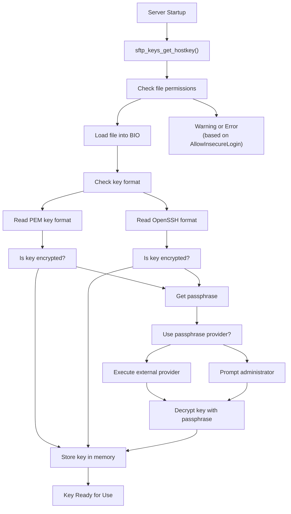
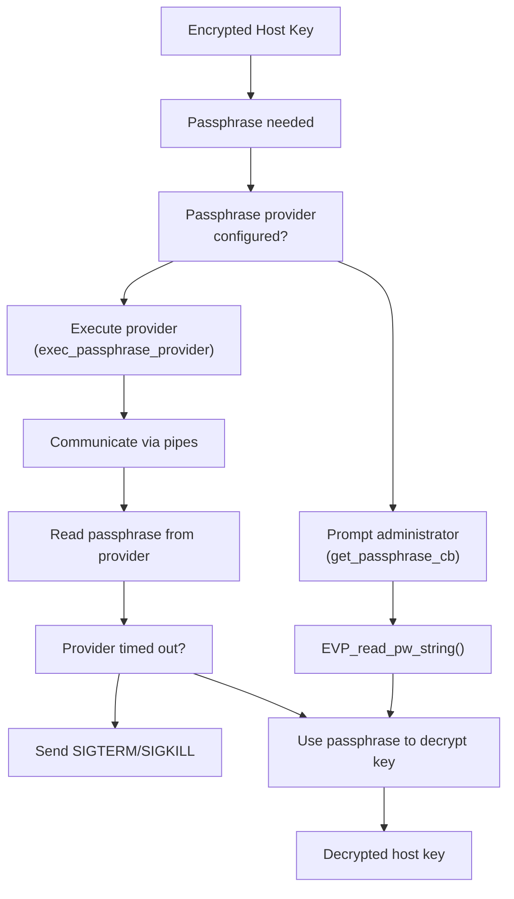
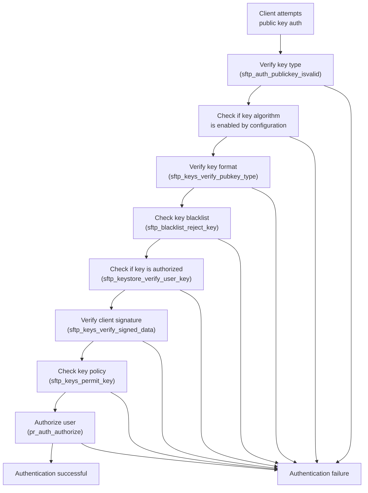
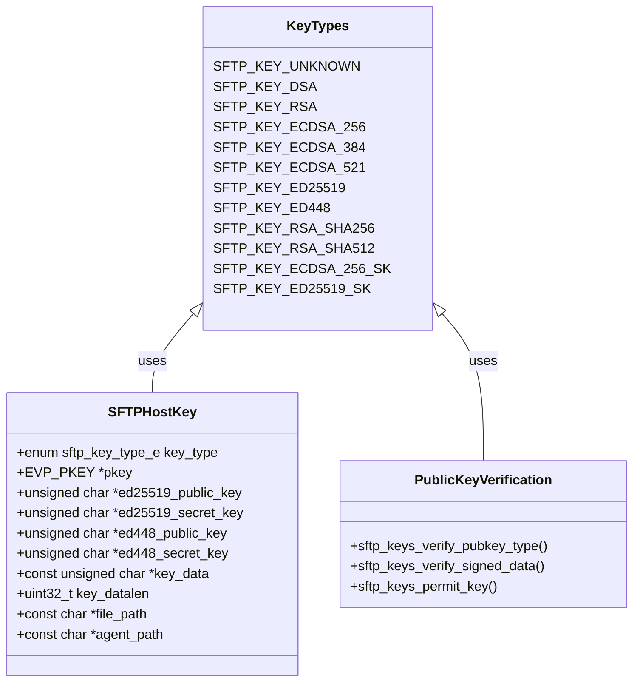
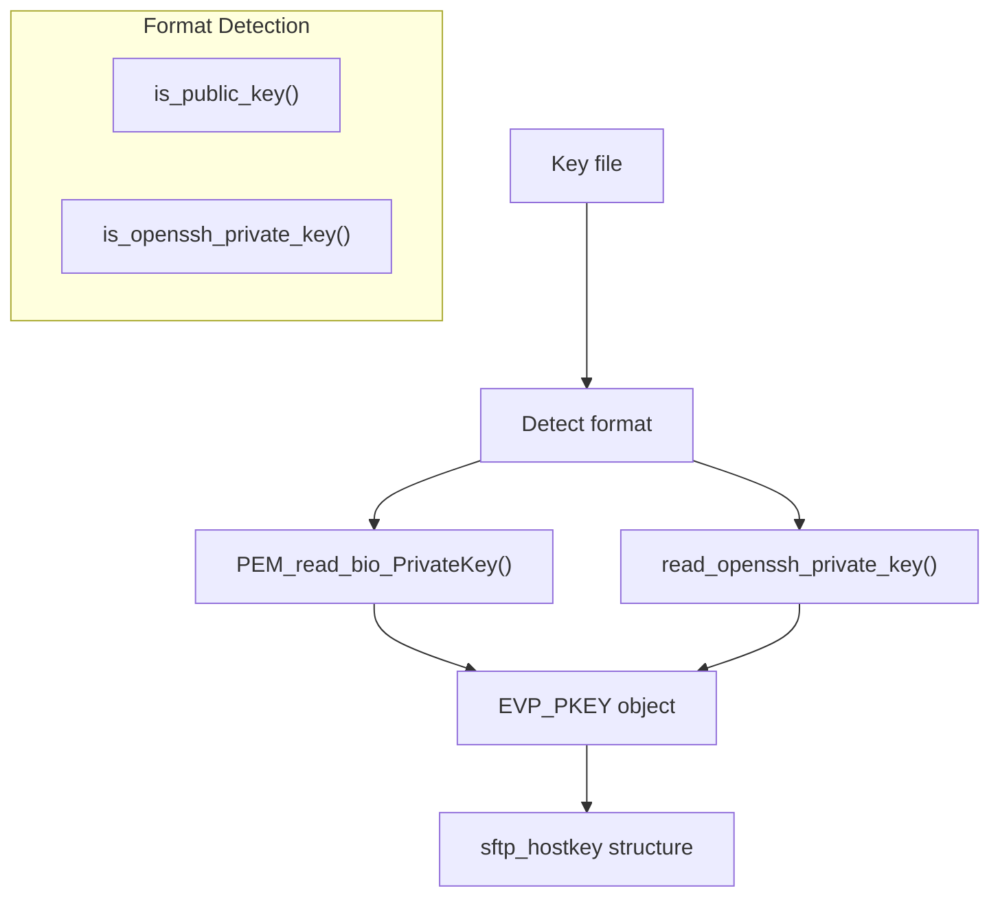
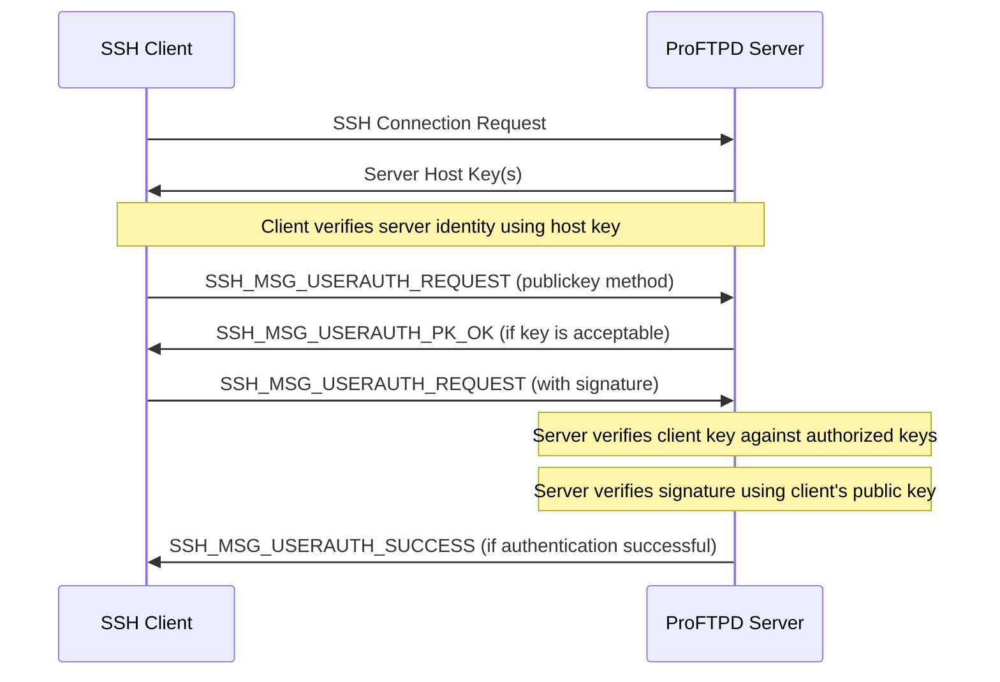
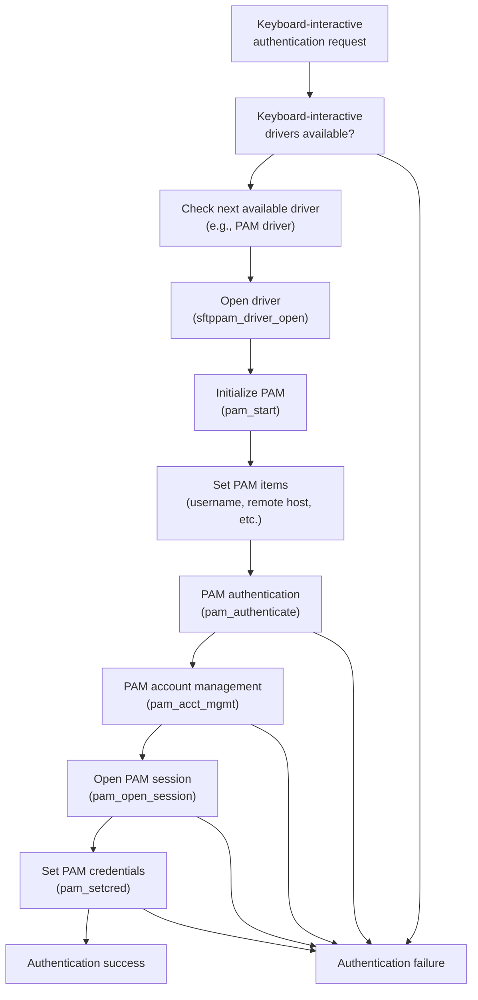

# SSH Key Management

> **Relevant source files**
> * [contrib/mod_sftp/auth-hostbased.c](https://github.com/proftpd/proftpd/blob/362466f3/contrib/mod_sftp/auth-hostbased.c)
> * [contrib/mod_sftp/auth-kbdint.c](https://github.com/proftpd/proftpd/blob/362466f3/contrib/mod_sftp/auth-kbdint.c)
> * [contrib/mod_sftp/auth-password.c](https://github.com/proftpd/proftpd/blob/362466f3/contrib/mod_sftp/auth-password.c)
> * [contrib/mod_sftp/auth-publickey.c](https://github.com/proftpd/proftpd/blob/362466f3/contrib/mod_sftp/auth-publickey.c)
> * [contrib/mod_sftp/auth.h](https://github.com/proftpd/proftpd/blob/362466f3/contrib/mod_sftp/auth.h)
> * [contrib/mod_sftp/kbdint.c](https://github.com/proftpd/proftpd/blob/362466f3/contrib/mod_sftp/kbdint.c)
> * [contrib/mod_sftp/keys.c](https://github.com/proftpd/proftpd/blob/362466f3/contrib/mod_sftp/keys.c)
> * [contrib/mod_sftp/keys.h](https://github.com/proftpd/proftpd/blob/362466f3/contrib/mod_sftp/keys.h)
> * [contrib/mod_sftp_pam.c](https://github.com/proftpd/proftpd/blob/362466f3/contrib/mod_sftp_pam.c)
> * [modules/mod_auth_pam.c](https://github.com/proftpd/proftpd/blob/362466f3/modules/mod_auth_pam.c)

This document explains how SSH keys are managed in ProFTPD's mod_sftp module, covering both server-side host keys and client authentication keys. For information about the overall SFTP protocol implementation, see [SFTP and SCP](/proftpd/proftpd/4.2-sftp-and-scp).

SSH key management in ProFTPD involves two main components:

1. **Server host keys** - The keys that identify your SFTP server to clients
2. **Client authentication keys** - The keys that clients use to authenticate to your server

## Server Host Keys

ProFTPD's mod_sftp module manages server host keys through the `SFTPHostKey` directive. These keys identify the server to connecting clients and are used as part of the SSH key exchange process.

### Supported Host Key Types

ProFTPD supports the following types of host keys:

| Key Type | Description | Implementation |
| --- | --- | --- |
| RSA | Traditional RSA keys (supports various key sizes) | OpenSSL |
| DSA | Digital Signature Algorithm keys | OpenSSL |
| ECDSA | Elliptic Curve Digital Signature Algorithm (256/384/521 bit variants) | OpenSSL ECC |
| Ed25519 | Edwards-curve Digital Signature Algorithm | libsodium |
| Ed448 | Edwards-curve with 448-bit security | OpenSSL |

The server can be configured with multiple host keys of different types simultaneously, allowing compatibility with various clients.

Sources: [contrib/mod_sftp/keys.h L30-L45](https://github.com/proftpd/proftpd/blob/362466f3/contrib/mod_sftp/keys.h#L30-L45)

 [contrib/mod_sftp/keys.c L82-L90](https://github.com/proftpd/proftpd/blob/362466f3/contrib/mod_sftp/keys.c#L82-L90)

### Host Key Loading Process



Sources: [contrib/mod_sftp/keys.c L885-L892](https://github.com/proftpd/proftpd/blob/362466f3/contrib/mod_sftp/keys.c#L885-L892)

 [contrib/mod_sftp/keys.c L799-L1018](https://github.com/proftpd/proftpd/blob/362466f3/contrib/mod_sftp/keys.c#L799-L1018)

### Encrypted Host Keys and Passphrases

When encrypted host keys are used, ProFTPD needs to obtain the passphrase to decrypt them. This can happen in two ways:

1. **Interactive prompt** - The administrator is prompted for the passphrase at server startup
2. **Passphrase provider** - An external program provides the passphrase

The passphrase provider is configured with the `SFTPPassPhraseProvider` directive, which specifies an external program that will be executed to retrieve the passphrase. This allows for automated server startup without manual intervention.



Sources: [contrib/mod_sftp/keys.c L320-L576](https://github.com/proftpd/proftpd/blob/362466f3/contrib/mod_sftp/keys.c#L320-L576)

 [contrib/mod_sftp/keys.c L720-L797](https://github.com/proftpd/proftpd/blob/362466f3/contrib/mod_sftp/keys.c#L720-L797)

## Client Authentication Keys

ProFTPD supports multiple authentication methods with mod_sftp, including:

1. **Public key authentication** - Clients authenticate using their private key
2. **Host-based authentication** - Authentication based on client host key and user
3. **Password authentication** - Standard password-based authentication
4. **Keyboard-interactive authentication** - Interactive challenge-response authentication

### Public Key Authentication Flow



Sources: [contrib/mod_sftp/auth-publickey.c L82-L420](https://github.com/proftpd/proftpd/blob/362466f3/contrib/mod_sftp/auth-publickey.c#L82-L420)

### Key Storage for Authentication

Client public keys for authentication are typically stored in the OpenSSH `authorized_keys` format. The location of these files is configured with the `SFTPAuthorizedKeysFile` directive, which defaults to `.ssh/authorized_keys` in the user's home directory.

ProFTPD supports multiple key storage mechanisms through its "key store" API, which can be extended to support different key storage backends.

## Key Types and Algorithms

ProFTPD supports a wide range of key types and algorithms for both host keys and client authentication.



Sources: [contrib/mod_sftp/keys.h L30-L45](https://github.com/proftpd/proftpd/blob/362466f3/contrib/mod_sftp/keys.h#L30-L45)

 [contrib/mod_sftp/keys.c L52-L80](https://github.com/proftpd/proftpd/blob/362466f3/contrib/mod_sftp/keys.c#L52-L80)

 [contrib/mod_sftp/keys.h L96-L101](https://github.com/proftpd/proftpd/blob/362466f3/contrib/mod_sftp/keys.h#L96-L101)

### Key Format Support

ProFTPD supports multiple key formats:

1. **PEM encoded keys** - Traditional OpenSSL format
2. **OpenSSH format** - Native OpenSSH key format with bcrypt encryption

The system automatically detects the format when loading keys.



Sources: [contrib/mod_sftp/keys.c L651-L718](https://github.com/proftpd/proftpd/blob/362466f3/contrib/mod_sftp/keys.c#L651-L718)

 [contrib/mod_sftp/keys.c L136-L156](https://github.com/proftpd/proftpd/blob/362466f3/contrib/mod_sftp/keys.c#L136-L156)

## Configuration Directives

### Host Key Configuration

The main directive for configuring server host keys is `SFTPHostKey`:

```
SFTPHostKey /path/to/rsa_key
SFTPHostKey /path/to/dsa_key
SFTPHostKey /path/to/ecdsa_key
SFTPHostKey /path/to/ed25519_key
```

Multiple `SFTPHostKey` directives can be used to specify multiple host keys.

### Authentication Configuration

For controlling public key authentication:

```markdown
# Enable/disable public key authentication
SFTPAuthMethods publickey

# Specify authorized keys file location
SFTPAuthorizedKeysFile /path/to/keys/%u

# Restrict public key algorithms 
SFTPAuthPublicKeys rsa-sha2-512 ecdsa-sha2-nistp256
```

For passphrase handling:

```markdown
# Configure passphrase provider for encrypted host keys
SFTPPassPhraseProvider /path/to/provider
```

## Security Considerations

1. **Host key file permissions**: ProFTPD checks key file permissions and will reject keys with insecure permissions (group readable or world readable) unless explicitly allowed.
2. **Minimum key sizes**: ProFTPD enforces minimum key sizes for security: * RSA: 768 bits minimum (default) * DSA: 384 bits minimum (default) * EC: 160 bits minimum (default) These can be adjusted with the `SFTPKeyBlacklist` directive.
3. **Key blacklisting**: Known weak or compromised keys can be blacklisted using the `SFTPKeyBlacklist` directive.
4. **Encryption requirements**: By default, mod_sftp will not allow public key authentication when using unencrypted channels. This can be overridden with the `AllowInsecureLogin` option.

Sources: [contrib/mod_sftp/keys.c L1099-L1119](https://github.com/proftpd/proftpd/blob/362466f3/contrib/mod_sftp/keys.c#L1099-L1119)

 [contrib/mod_sftp/keys.c L127-L130](https://github.com/proftpd/proftpd/blob/362466f3/contrib/mod_sftp/keys.c#L127-L130)

 [contrib/mod_sftp/auth-publickey.c L150-L175](https://github.com/proftpd/proftpd/blob/362466f3/contrib/mod_sftp/auth-publickey.c#L150-L175)

## Host Key and Client Key Interaction

The relationship between host keys and client authentication keys in the SSH protocol:



Sources: [contrib/mod_sftp/auth-publickey.c L46-L80](https://github.com/proftpd/proftpd/blob/362466f3/contrib/mod_sftp/auth-publickey.c#L46-L80)

 [contrib/mod_sftp/auth-publickey.c L254-L275](https://github.com/proftpd/proftpd/blob/362466f3/contrib/mod_sftp/auth-publickey.c#L254-L275)

## Integration with PAM Authentication

ProFTPD's mod_sftp can also integrate with PAM authentication through the keyboard-interactive authentication method. This is provided by the mod_sftp_pam module.



Sources: [contrib/mod_sftp_pam.c L414-L564](https://github.com/proftpd/proftpd/blob/362466f3/contrib/mod_sftp_pam.c#L414-L564)

 [contrib/mod_auth_pam.c L243-L595](https://github.com/proftpd/proftpd/blob/362466f3/contrib/mod_auth_pam.c#L243-L595)

## Summary

ProFTPD's mod_sftp provides a comprehensive SSH key management system that supports:

1. Multiple server host key types and formats
2. Encrypted host keys with passphrase management
3. Multiple client authentication methods
4. Flexible key storage options
5. Security features like key blacklisting and minimum key sizes

This flexibility allows ProFTPD to be compatible with a wide range of SSH clients while maintaining robust security practices.