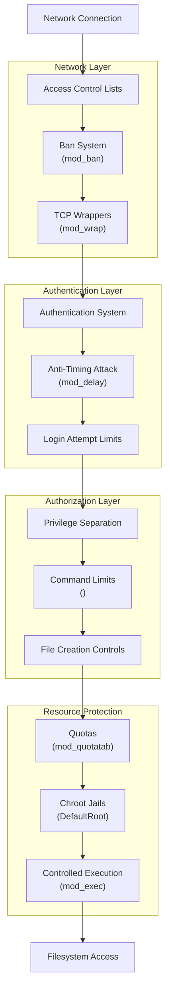
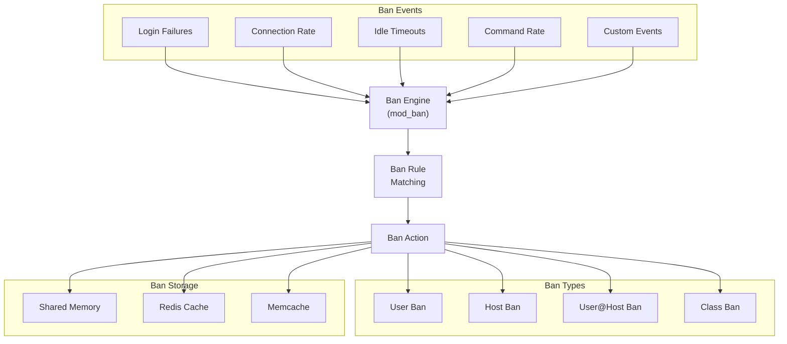
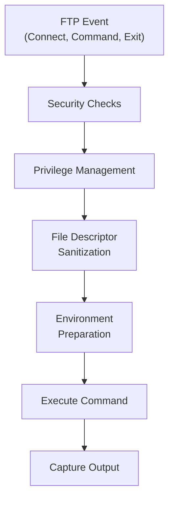

# Security Features

> **Relevant source files**
> * [.codeql.yml](https://github.com/proftpd/proftpd/blob/362466f3/.codeql.yml)
> * [.github/workflows/ci.yml](https://github.com/proftpd/proftpd/blob/362466f3/.github/workflows/ci.yml)
> * [.github/workflows/codeql.yml](https://github.com/proftpd/proftpd/blob/362466f3/.github/workflows/codeql.yml)
> * [.github/workflows/legacy-platforms-ci.yml](https://github.com/proftpd/proftpd/blob/362466f3/.github/workflows/legacy-platforms-ci.yml)
> * [.github/workflows/rpm.yml](https://github.com/proftpd/proftpd/blob/362466f3/.github/workflows/rpm.yml)
> * [ChangeLog](https://github.com/proftpd/proftpd/blob/362466f3/ChangeLog)
> * [README.md](https://github.com/proftpd/proftpd/blob/362466f3/README.md)
> * [contrib/dist/rpm/proftpd.spec](https://github.com/proftpd/proftpd/blob/362466f3/contrib/dist/rpm/proftpd.spec)
> * [contrib/mod_ban.c](https://github.com/proftpd/proftpd/blob/362466f3/contrib/mod_ban.c)
> * [contrib/mod_exec.c](https://github.com/proftpd/proftpd/blob/362466f3/contrib/mod_exec.c)
> * [doc/contrib/mod_ban.html](https://github.com/proftpd/proftpd/blob/362466f3/doc/contrib/mod_ban.html)
> * [doc/contrib/mod_exec.html](https://github.com/proftpd/proftpd/blob/362466f3/doc/contrib/mod_exec.html)
> * [doc/contrib/mod_shaper.html](https://github.com/proftpd/proftpd/blob/362466f3/doc/contrib/mod_shaper.html)
> * [include/privs.h](https://github.com/proftpd/proftpd/blob/362466f3/include/privs.h)
> * [include/version.h](https://github.com/proftpd/proftpd/blob/362466f3/include/version.h)
> * [src/privs.c](https://github.com/proftpd/proftpd/blob/362466f3/src/privs.c)
> * [tests/api/privs.c](https://github.com/proftpd/proftpd/blob/362466f3/tests/api/privs.c)
> * [tests/t/lib/ProFTPD/Tests/Modules/mod_ban.pm](https://github.com/proftpd/proftpd/blob/362466f3/tests/t/lib/ProFTPD/Tests/Modules/mod_ban.pm)
> * [tests/t/lib/ProFTPD/Tests/Modules/mod_exec.pm](https://github.com/proftpd/proftpd/blob/362466f3/tests/t/lib/ProFTPD/Tests/Modules/mod_exec.pm)
> * [tests/t/modules/mod_ban.t](https://github.com/proftpd/proftpd/blob/362466f3/tests/t/modules/mod_ban.t)
> * [tests/t/modules/mod_exec.t](https://github.com/proftpd/proftpd/blob/362466f3/tests/t/modules/mod_exec.t)

## Introduction

This page provides an overview of the security mechanisms built into ProFTPD. The server was designed with security as a primary consideration, implementing multiple layers of protection to safeguard both the server and the underlying system. This document covers the core security features, how they interact, and how they can be configured to enhance your server's security posture.

For information about specific protocol security (TLS/SFTP), see [Protocol Implementations](/proftpd/proftpd/4-protocol-implementations).

## Security Architecture Overview

ProFTPD's security architecture is built around multiple defensive layers that work together to provide comprehensive protection:



Sources: `contrib/mod_ban.c`, `include/privs.h`, `src/privs.c`, `contrib/mod_exec.c`

## Privilege Separation

ProFTPD implements a robust privilege separation mechanism that allows it to run with minimal privileges while still performing operations that require elevated permissions. This approach significantly reduces the attack surface by ensuring the daemon only has the permissions it absolutely needs.

### Privilege Model

```

```

The privilege system uses a set of macros and functions to safely switch between privileged and unprivileged states:

* `PRIVS_ROOT` - Switch to root privileges (requires existing saved UID of root)
* `PRIVS_USER` - Switch to the configured user's privileges
* `PRIVS_RELINQUISH` - Drop back to the user privileges after an operation
* `PRIVS_REVOKE` - Permanently drop root privileges (cannot regain them)

The system maintains internal counters (`root_privs` and `user_privs`) to support nested privilege operations, ensuring that privileges are only fully relinquished when all privileged sections have completed.

Sources: `include/privs.h`, `src/privs.c`, `tests/api/privs.c`

### Code Implementation

The privilege separation system is implemented in `src/privs.c` with the interface defined in `include/privs.h`. The core functions include:

* `pr_privs_setup()` - Initialize the privilege system
* `pr_privs_root()` - Temporarily assume root privileges
* `pr_privs_user()` - Return to the user's privileges
* `pr_privs_relinquish()` - Drop back to user privileges
* `pr_privs_revoke()` - Permanently drop all root privileges

These functions are wrapped by the macros `PRIVS_ROOT`, `PRIVS_USER`, etc., which also include source file and line information for debugging.

Sources: `src/privs.c:60-75`, `include/privs.h:42-66`

## Ban System (mod_ban)

The `mod_ban` module provides a dynamic ban system that can automatically block users, hosts, or classes that exhibit suspicious or abusive behavior. This serves as an important defense-in-depth measure to prevent brute-force attacks and resource abuse.

### Ban Architecture



Sources: `contrib/mod_ban.c`, `doc/contrib/mod_ban.html`

### Ban Events

The module can automatically trigger bans based on various events:

| Event Type | Description | Ban Target |
| --- | --- | --- |
| MaxLoginAttempts | Excessive failed logins | Host |
| MaxLoginAttemptsFromUser | Failed logins from specific user | User@Host |
| ClientConnectRate | Connections coming too quickly | Host |
| MaxClientsPerHost | Too many connections from one host | Host |
| MaxCommandRate | Commands sent too quickly | Host |
| TimeoutIdle | Session idle timeout | Host |
| TimeoutNoTransfer | Transfer timeout | Host |
| TLSHandshake | Failed TLS handshake | Host |
| AnonRejectPasswords | Invalid anonymous passwords | Host |
| RootLogin | Attempted root login | Host |
| UnhandledCommand | Unknown commands | Host |

Administrators can configure thresholds, timeframes, and ban durations for each event type.

Sources: `contrib/mod_ban.c:122-142`, `doc/contrib/mod_ban.html:231-327`

### Ban Storage and Distribution

The ban system can store ban information in:

1. Local shared memory (SHM)
2. Redis cache (distributed)
3. Memcache (distributed)

This allows for ban coordination across multiple servers in a cluster, improving security for distributed deployments.

Sources: `contrib/mod_ban.c:160-177`, `contrib/mod_ban.c:216-232`

## Access Control Lists (ACLs)

ProFTPD provides powerful access control mechanisms through several complementary systems.

### Directory-Level Access Control

The server supports both global and directory-specific access controls:

* `<Limit>` blocks to restrict commands
* `.ftpaccess` files for per-directory controls
* User/group ownership checks
* Permission-based access control

Example ACL implementation:

```xml
# Allow downloads but prevent uploads in a directory
<Directory /path/to/downloads>
  <Limit WRITE>
    DenyAll
  </Limit>
  
  <Limit READ>
    AllowAll
  </Limit>
</Directory>
```

### TCP Wrappers Integration

Through the `mod_wrap` module, ProFTPD can integrate with the system's TCP wrappers (`hosts.allow` and `hosts.deny`) for additional network-level access control.

Sources: `contrib/dist/rpm/proftpd.spec:163-166`

## Delay Mechanism

The `mod_delay` module implements an anti-timing attack mechanism that helps protect against password cracking attempts. Timing attacks try to deduce passwords based on how long the server takes to respond to authentication requests.

### How it Works

1. The module records the time taken to process authentication requests
2. It then ensures that all authentication responses take the same amount of time
3. This prevents attackers from determining if a username exists or if a password was partially correct

The delay is applied to all authentication attempts, making it impossible to gather information about user accounts from response timing differences.

Sources: `tests/t/lib/ProFTPD/Tests/Modules/mod_ban.pm:175-178`

## Controlled Command Execution

The `mod_exec` module allows the server to execute external commands at various points during an FTP session, but with strict security controls to prevent abuse.

### Security Considerations



The module implements several security measures:

1. Privilege control - Commands run with specific user privileges
2. File descriptor management - Prevents information leakage
3. Environment sanitization - Controls what environment variables are passed
4. Timeout enforcement - Prevents resource exhaustion

Sources: `contrib/mod_exec.c:65-76`, `contrib/mod_exec.c:491-501`, `doc/contrib/mod_exec.html:28-35`

## Resource Protection

ProFTPD includes mechanisms to protect server resources from abuse:

### Quotas

The `mod_quotatab` module enforces limits on:

* Total disk space usage
* Per-session transfer limits
* File count limits

### Rate Limiting

Connection and command rate limiting prevents:

* Connection flooding
* Command flooding
* Bandwidth exhaustion

Sources: `contrib/mod_ban.c:125-132`

## Security-Focused Modules

ProFTPD's modular architecture allows administrators to add specific security features as needed:

| Module | Purpose |
| --- | --- |
| mod_ban | Dynamic banning of abusive clients |
| mod_delay | Anti-timing attack protection |
| mod_tls | Encrypted transport via SSL/TLS |
| mod_sftp | Secure file transfer via SSH protocol |
| mod_wrap | TCP wrappers integration |
| mod_wrap2 | Enhanced access control lists |
| mod_radius | RADIUS authentication |
| mod_sql_passwd | Secure password storage |

Sources: `contrib/dist/rpm/proftpd.spec:33-52`

## Best Practices for Secure Configuration

To maximize security in your ProFTPD deployment:

1. **Run with minimal privileges** * Create a dedicated user and group for ProFTPD * Avoid running as root when possible
2. **Enable appropriate security modules** * mod_ban for automatic abuse prevention * mod_delay to prevent timing attacks * mod_tls for encrypted connections
3. **Implement strong authentication** * Use strong password policies * Consider multi-factor authentication where appropriate * Implement account lockouts via mod_ban
4. **Control resource usage** * Set appropriate limits on connections per user/host * Implement quotas to prevent resource exhaustion * Configure timeouts to release abandoned sessions
5. **Secure the filesystem** * Use DefaultRoot to chroot users * Set appropriate Umask values * Verify file ownership and permissions

Sources: `README.md:46-54`, `contrib/dist/rpm/proftpd.spec:42-52`

## Conclusion

ProFTPD's security architecture provides a robust, defense-in-depth approach to protecting both the server and underlying system. Through its privilege separation model, ban system, access controls, and resource protections, it offers administrators the tools needed to maintain a secure file transfer environment that can withstand common attack vectors.

For more detailed information on configuring specific security features, refer to the documentation for the individual modules mentioned in this overview.