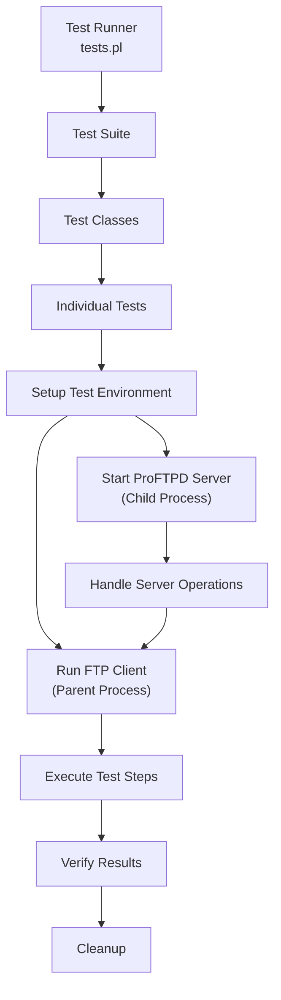
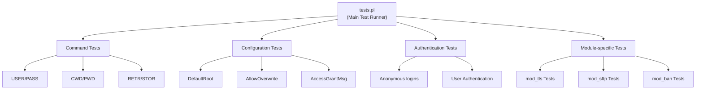
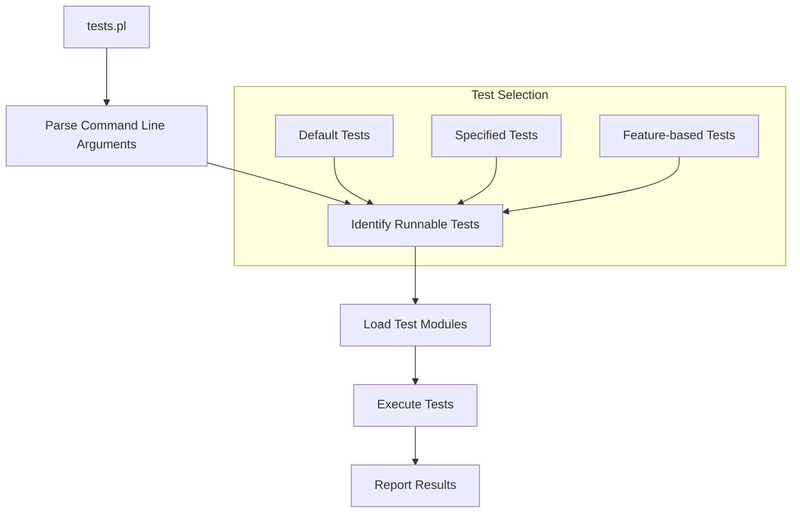
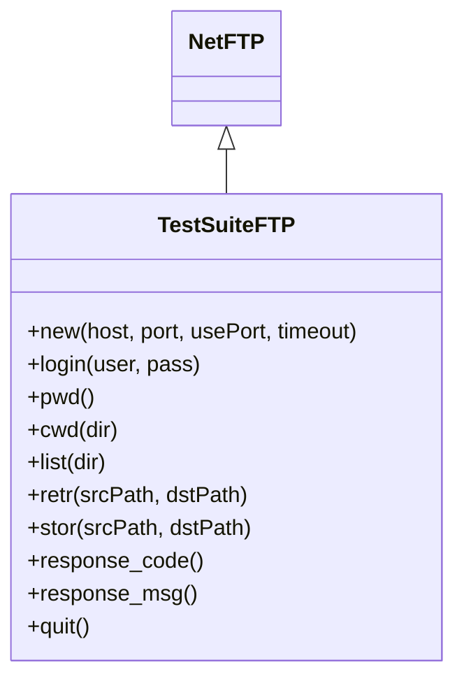
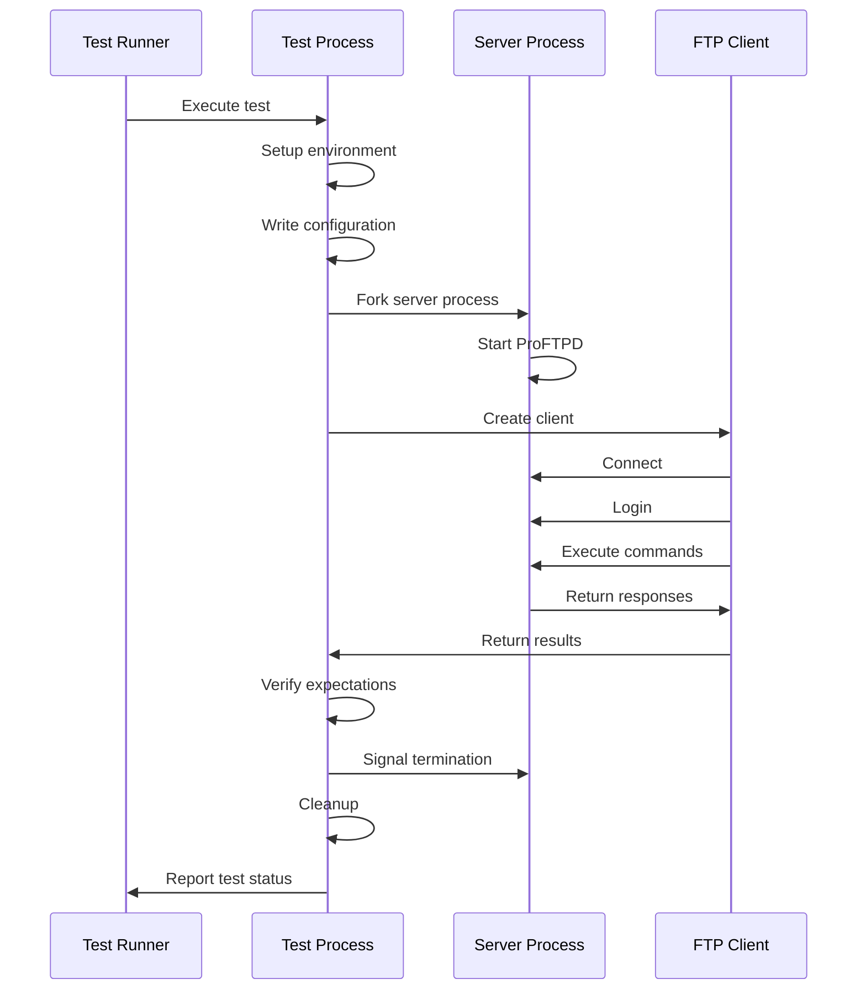
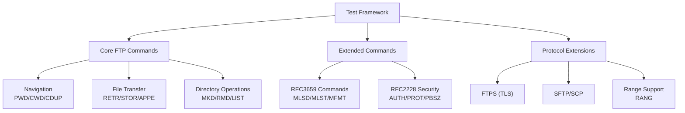

# Testing Framework

> **Relevant source files**
> * [include/cmd.h](https://github.com/proftpd/proftpd/blob/362466f3/include/cmd.h)
> * [include/ftp.h](https://github.com/proftpd/proftpd/blob/362466f3/include/ftp.h)
> * [src/cmd.c](https://github.com/proftpd/proftpd/blob/362466f3/src/cmd.c)
> * [tests/api/cmd.c](https://github.com/proftpd/proftpd/blob/362466f3/tests/api/cmd.c)
> * [tests/t/commands.t](https://github.com/proftpd/proftpd/blob/362466f3/tests/t/commands.t)
> * [tests/t/commands/rang.t](https://github.com/proftpd/proftpd/blob/362466f3/tests/t/commands/rang.t)
> * [tests/t/config/defaultroot.t](https://github.com/proftpd/proftpd/blob/362466f3/tests/t/config/defaultroot.t)
> * [tests/t/lib/ProFTPD/TestSuite/FTP.pm](https://github.com/proftpd/proftpd/blob/362466f3/tests/t/lib/ProFTPD/TestSuite/FTP.pm)
> * [tests/t/lib/ProFTPD/TestSuite/Utils.pm](https://github.com/proftpd/proftpd/blob/362466f3/tests/t/lib/ProFTPD/TestSuite/Utils.pm)
> * [tests/t/lib/ProFTPD/Tests/Commands.pm](https://github.com/proftpd/proftpd/blob/362466f3/tests/t/lib/ProFTPD/Tests/Commands.pm)
> * [tests/t/lib/ProFTPD/Tests/Commands/CLNT.pm](https://github.com/proftpd/proftpd/blob/362466f3/tests/t/lib/ProFTPD/Tests/Commands/CLNT.pm)
> * [tests/t/lib/ProFTPD/Tests/Commands/RANG.pm](https://github.com/proftpd/proftpd/blob/362466f3/tests/t/lib/ProFTPD/Tests/Commands/RANG.pm)
> * [tests/t/lib/ProFTPD/Tests/Config/DefaultRoot.pm](https://github.com/proftpd/proftpd/blob/362466f3/tests/t/lib/ProFTPD/Tests/Config/DefaultRoot.pm)
> * [tests/t/lib/ProFTPD/Tests/Logins.pm](https://github.com/proftpd/proftpd/blob/362466f3/tests/t/lib/ProFTPD/Tests/Logins.pm)
> * [tests/tests.pl](https://github.com/proftpd/proftpd/blob/362466f3/tests/tests.pl)

This page documents the ProFTPD testing framework, which is used to validate the server's functionality through automated tests. The framework provides utilities for running tests against a live ProFTPD server instance, simulating client interactions, and verifying expected behavior.

## Purpose and Scope

The testing framework provides a structured way to test various aspects of the ProFTPD server, including:

* Command handling
* Configuration directives
* Module functionality
* Authentication mechanisms
* Error conditions
* Protocol compliance

The framework is designed to be run in a controlled environment, typically during development or as part of a continuous integration process.

## Overview

The ProFTPD testing framework is built on Perl and uses a parent-child process model where:

1. The parent process configures and initiates tests
2. A child process runs the ProFTPD server
3. The parent process acts as an FTP client to test the server
4. Results are validated against expected outcomes



Sources: [tests/tests.pl](https://github.com/proftpd/proftpd/blob/362466f3/tests/tests.pl)

 [tests/t/lib/ProFTPD/TestSuite/Utils.pm](https://github.com/proftpd/proftpd/blob/362466f3/tests/t/lib/ProFTPD/TestSuite/Utils.pm)

## Test Organization

Tests are organized into hierarchical modules based on functionality, with each module containing multiple test cases. Each test is implemented as a method within a test class.



Sources: [tests/tests.pl L56-L228](https://github.com/proftpd/proftpd/blob/362466f3/tests/tests.pl#L56-L228)

 [tests/t/lib/ProFTPD/Tests/Commands.pm](https://github.com/proftpd/proftpd/blob/362466f3/tests/t/lib/ProFTPD/Tests/Commands.pm)

 [tests/t/lib/ProFTPD/Tests/Config/DefaultRoot.pm](https://github.com/proftpd/proftpd/blob/362466f3/tests/t/lib/ProFTPD/Tests/Config/DefaultRoot.pm)

## Key Components

### Test Runner

The main entry point is `tests.pl`, which:

1. Processes command-line arguments
2. Determines which tests to run
3. Sets up the test environment
4. Executes the tests in the specified order



Sources: [tests/tests.pl L10-L48](https://github.com/proftpd/proftpd/blob/362466f3/tests/tests.pl#L10-L48)

 [tests/tests.pl L235-L543](https://github.com/proftpd/proftpd/blob/362466f3/tests/tests.pl#L235-L543)

### TestSuite::Utils

The `ProFTPD::TestSuite::Utils` module provides utility functions for:

* Creating authentication files
* Building and writing configuration files
* Starting and stopping the server
* Managing test environments
* Detecting server features

| Function Category | Description | Examples |
| --- | --- | --- |
| Auth | Authentication file management | `auth_user_write()`, `auth_group_write()` |
| Config | Configuration file creation | `config_write()`, `config_get_identity()` |
| Features | Server feature detection | `feature_have_module_compiled()`, `feature_have_feature_enabled()` |
| Running | Server process management | `server_start()`, `server_stop()`, `server_wait()` |
| Test | Test environment management | `test_setup()`, `test_cleanup()`, `test_append_logfile()` |
| Testsuite | General testsuite utilities | `testsuite_get_runnable_tests()`, `testsuite_get_tmp_dir()` |

Sources: [tests/t/lib/ProFTPD/TestSuite/Utils.pm L14-L64](https://github.com/proftpd/proftpd/blob/362466f3/tests/t/lib/ProFTPD/TestSuite/Utils.pm#L14-L64)

### TestSuite::FTP

The `ProFTPD::TestSuite::FTP` module is a wrapper around `Net::FTP` that provides methods for:

* Connecting to the FTP server
* Authenticating with the server
* Executing FTP commands
* Analyzing server responses



Sources: [tests/t/lib/ProFTPD/TestSuite/FTP.pm L12-L89](https://github.com/proftpd/proftpd/blob/362466f3/tests/t/lib/ProFTPD/TestSuite/FTP.pm#L12-L89)

 [tests/t/lib/ProFTPD/TestSuite/FTP.pm L90-L250](https://github.com/proftpd/proftpd/blob/362466f3/tests/t/lib/ProFTPD/TestSuite/FTP.pm#L90-L250)

## Test Execution Flow

Each test follows a similar pattern:

1. **Setup**: Create temporary files, directories, and configuration
2. **Server Start**: Fork a child process to start the ProFTPD server
3. **Client Actions**: Execute FTP commands against the server
4. **Verification**: Check that responses match expected values
5. **Cleanup**: Stop the server, remove temporary files



Sources: [tests/t/lib/ProFTPD/Tests/Commands.pm L198-L313](https://github.com/proftpd/proftpd/blob/362466f3/tests/t/lib/ProFTPD/Tests/Commands.pm#L198-L313)

 [tests/t/lib/ProFTPD/Tests/Logins.pm L114-L179](https://github.com/proftpd/proftpd/blob/362466f3/tests/t/lib/ProFTPD/Tests/Logins.pm#L114-L179)

## Running Tests

The test framework can be run with various options to control which tests are executed:

```
perl tests.pl [--help] [--class=NAME] [--file-pattern=PATTERN] [--verbose] [--keep-tmpfiles]
```

| Option | Description |
| --- | --- |
| `--help` | Display usage information |
| `--class=NAME` | Run tests belonging to specific class(es) |
| `--file-pattern=PATTERN` | Run tests matching the pattern |
| `--verbose` | Enable verbose output |
| `--keep-tmpfiles` | Keep temporary files after tests |

Sources: [tests/tests.pl L578-L588](https://github.com/proftpd/proftpd/blob/362466f3/tests/tests.pl#L578-L588)

### Test Classes

Tests can be tagged with classes that determine when they should be run:

| Class | Description |
| --- | --- |
| `forking` | Tests that require process forking |
| `rootprivs` | Tests that require root privileges |
| `bug` | Tests for specific bug fixes |
| `feat_*` | Tests that require specific features (e.g., `feat_openssl_fips`) |
| `mod_*` | Tests for specific modules (e.g., `mod_tls`, `mod_sftp`) |
| `inprogress` | Tests that are still being developed |
| `slow` | Tests that take a long time to run |

Sources: [tests/tests.pl L402-L465](https://github.com/proftpd/proftpd/blob/362466f3/tests/tests.pl#L402-L465)

 [tests/t/lib/ProFTPD/TestSuite/Utils.pm L1281-L1349](https://github.com/proftpd/proftpd/blob/362466f3/tests/t/lib/ProFTPD/TestSuite/Utils.pm#L1281-L1349)

## Test Implementation

Test modules are Perl classes that inherit from `ProFTPD::TestSuite::Child` and implement test cases. A typical test module consists of:

1. A package declaration
2. Required imports
3. A hash of test definitions
4. Implementation of each test method

Each test typically follows this structure:

```python
sub test_name {
  my $self = shift;
  my $tmpdir = $self->{tmpdir};
  
  # Setup configuration
  my $config = { ... };
  
  # Create files and directories
  
  # Write configuration file
  my ($port, $user, $group) = config_write($config_file, $config);
  
  # Setup parent-child communication
  my ($rfh, $wfh);
  unless (pipe($rfh, $wfh)) {
    die("Can't open pipe: $!");
  }
  
  # Fork and run server/client
  $self->handle_sigchld();
  defined(my $pid = fork()) or die("Can't fork: $!");
  if ($pid) {
    # Parent process - client
    eval {
      my $client = ProFTPD::TestSuite::FTP->new('127.0.0.1', $port);
      # Perform test actions
      # Assert expectations
    };
    
    # Signal child when done
    $wfh->print("done\n");
    $wfh->flush();
  } else {
    # Child process - server
    eval { server_wait($config_file, $rfh) };
    exit 0;
  }
  
  # Stop server
  server_stop($pid_file);
  
  # Cleanup
  test_cleanup($log_file, $ex);
}
```

Sources: [tests/t/lib/ProFTPD/Tests/Commands.pm L198-L313](https://github.com/proftpd/proftpd/blob/362466f3/tests/t/lib/ProFTPD/Tests/Commands.pm#L198-L313)

 [tests/t/lib/ProFTPD/Tests/Logins.pm L114-L179](https://github.com/proftpd/proftpd/blob/362466f3/tests/t/lib/ProFTPD/Tests/Logins.pm#L114-L179)

## Environment Variables

The test framework uses several environment variables to control its behavior:

| Variable | Description |
| --- | --- |
| `PROFTPD_TEST_BIN` | Path to the ProFTPD binary |
| `PROFTPD_TEST_PATH` | Path to the ProFTPD test directory |
| `PROFTPD_TEST` | Set to indicate tests are running |
| `PROFTPD_TEST_ENABLE_CLASS` | Classes of tests to enable |
| `PROFTPD_TEST_DISABLE_CLASS` | Classes of tests to disable |
| `TEST_VERBOSE` | Enable verbose output |
| `KEEP_TMPFILES` | Keep temporary files after tests |

Sources: [tests/tests.pl L39-L46](https://github.com/proftpd/proftpd/blob/362466f3/tests/tests.pl#L39-L46)

 [tests/tests.pl L548-L554](https://github.com/proftpd/proftpd/blob/362466f3/tests/tests.pl#L548-L554)

## Protocol and Command Validation

The testing framework includes mechanisms to test various FTP commands and protocols:



Sources: [include/ftp.h L33-L98](https://github.com/proftpd/proftpd/blob/362466f3/include/ftp.h#L33-L98)

 [include/cmd.h L46-L106](https://github.com/proftpd/proftpd/blob/362466f3/include/cmd.h#L46-L106)

 [tests/t/lib/ProFTPD/Tests/Commands/RANG.pm](https://github.com/proftpd/proftpd/blob/362466f3/tests/t/lib/ProFTPD/Tests/Commands/RANG.pm)

## Test Result Verification

Tests use assertions to verify that the server behaves as expected:

* Response codes match expected values
* Response messages contain expected content
* Files are created, modified, or deleted as expected
* Error conditions are handled properly

The test framework includes utilities to check these conditions and report failures.

Sources: [tests/t/lib/ProFTPD/Tests/Commands.pm L272-L278](https://github.com/proftpd/proftpd/blob/362466f3/tests/t/lib/ProFTPD/Tests/Commands.pm#L272-L278)

 [tests/t/lib/ProFTPD/Tests/Logins.pm L258-L269](https://github.com/proftpd/proftpd/blob/362466f3/tests/t/lib/ProFTPD/Tests/Logins.pm#L258-L269)

## Writing New Tests

To add new tests:

1. Create a module in `tests/t/lib/ProFTPD/Tests/` or add to an existing one
2. Define test cases in the `$TESTS` hash
3. Implement test methods
4. Create a `.t` file in `tests/t/` that calls your module if needed

If testing a module, add entries to the `$FEATURE_TESTS` hash in `tests.pl` to ensure tests are only run when the module is available.

Sources: [tests/tests.pl L235-L535](https://github.com/proftpd/proftpd/blob/362466f3/tests/tests.pl#L235-L535)

 [tests/t/commands.t](https://github.com/proftpd/proftpd/blob/362466f3/tests/t/commands.t)

 [tests/t/commands/rang.t](https://github.com/proftpd/proftpd/blob/362466f3/tests/t/commands/rang.t)

## Conclusion

The ProFTPD testing framework provides a comprehensive system for testing various aspects of the server's functionality. By using a parent-child process model and a structured approach to test organization, it enables thorough validation of server behavior across different configurations and scenarios.