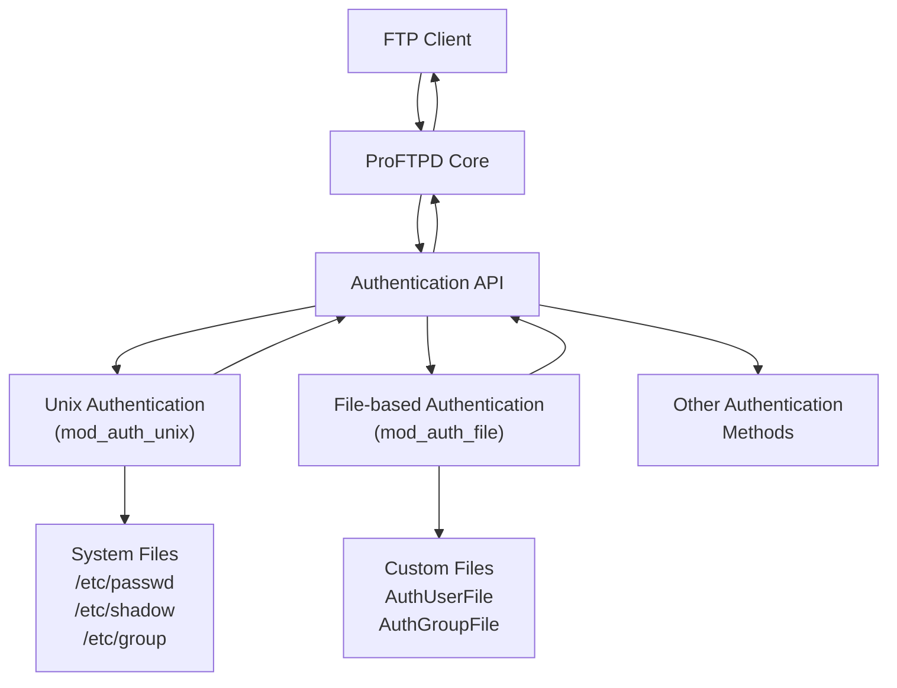
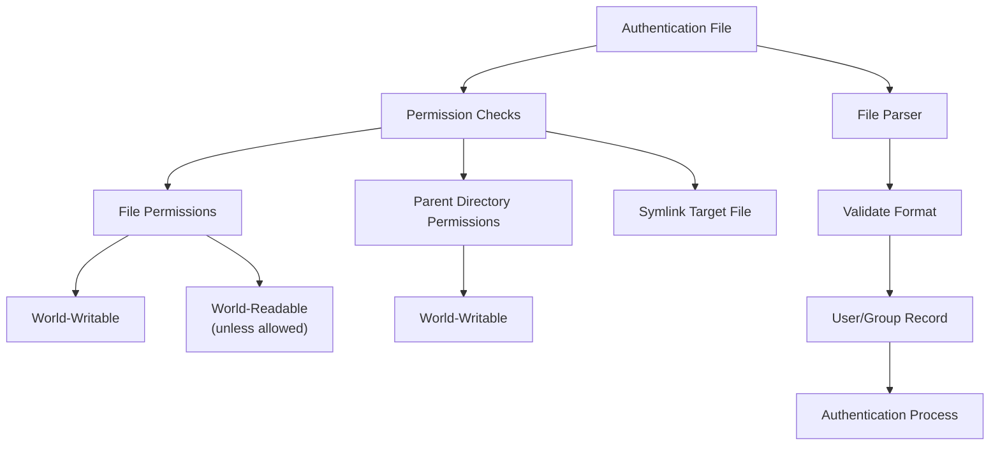

# Unix and File-based Authentication

> **Relevant source files**
> * [Make.rules.in](https://github.com/proftpd/proftpd/blob/362466f3/Make.rules.in)
> * [Makefile.in](https://github.com/proftpd/proftpd/blob/362466f3/Makefile.in)
> * [acconfig.h](https://github.com/proftpd/proftpd/blob/362466f3/acconfig.h)
> * [config.h.in](https://github.com/proftpd/proftpd/blob/362466f3/config.h.in)
> * [configure](https://github.com/proftpd/proftpd/blob/362466f3/configure)
> * [configure.in](https://github.com/proftpd/proftpd/blob/362466f3/configure.in)
> * [include/conf.h](https://github.com/proftpd/proftpd/blob/362466f3/include/conf.h)
> * [lib/Makefile.in](https://github.com/proftpd/proftpd/blob/362466f3/lib/Makefile.in)
> * [modules/Makefile.in](https://github.com/proftpd/proftpd/blob/362466f3/modules/Makefile.in)
> * [modules/mod_auth_file.c](https://github.com/proftpd/proftpd/blob/362466f3/modules/mod_auth_file.c)
> * [modules/mod_auth_unix.c](https://github.com/proftpd/proftpd/blob/362466f3/modules/mod_auth_unix.c)
> * [src/Makefile.in](https://github.com/proftpd/proftpd/blob/362466f3/src/Makefile.in)
> * [tests/t/lib/ProFTPD/Tests/Modules/mod_auth_file.pm](https://github.com/proftpd/proftpd/blob/362466f3/tests/t/lib/ProFTPD/Tests/Modules/mod_auth_file.pm)
> * [tests/t/modules/mod_auth_file.t](https://github.com/proftpd/proftpd/blob/362466f3/tests/t/modules/mod_auth_file.t)
> * [utils/Makefile.in](https://github.com/proftpd/proftpd/blob/362466f3/utils/Makefile.in)

This document explains ProFTPD's core authentication mechanisms provided by the `mod_auth_unix` and `mod_auth_file` modules. These modules enable user authentication against system password databases or custom authentication files, forming the foundation of ProFTPD's authentication system. For information about other authentication methods like SQL or LDAP, see [SQL Authentication](/proftpd/proftpd/3.2-sql-authentication) and [LDAP Authentication](/proftpd/proftpd/3.3-ldap-authentication).

## Authentication System Overview

ProFTPD's authentication system uses a modular approach where multiple authentication modules can be registered and consulted in a configurable order. The `mod_auth_unix` and `mod_auth_file` modules are included in the core distribution and provide Unix-based and file-based authentication respectively.



**Authentication Flow Diagram**

Sources: [modules/mod_auth_unix.c](https://github.com/proftpd/proftpd/blob/362466f3/modules/mod_auth_unix.c)

 [modules/mod_auth_file.c](https://github.com/proftpd/proftpd/blob/362466f3/modules/mod_auth_file.c)

 [include/auth.h](https://github.com/proftpd/proftpd/blob/362466f3/include/auth.h)

## Unix Authentication (mod_auth_unix)

The `mod_auth_unix` module provides authentication using the operating system's native user database. It is built into ProFTPD by default and is typically the first authentication method used.

### Features

* Authenticates against system password files (`/etc/passwd`, `/etc/shadow`, `/etc/group`)
* Automatically detects and supports shadow password systems
* Supports various Unix variants (Linux, AIX, HP-UX, etc.)
* Can use persistent file handles for password database access
* Supports retrieval of supplementary groups

### Configuration

Unix authentication is controlled through the `AuthOrder` directive and the `AuthUnixOption` directive:

```markdown
# Use Unix authentication first, then try other methods
AuthOrder mod_auth_unix.c mod_auth_file.c

# Enable the Magic Token Chroot feature
AuthUnixOption MagicTokenChroot
```

### AuthUnixOption Options

| Option | Description |
| --- | --- |
| `AIXNoRlogin` | Disables AIX rlogin authentication |
| `NoGetgrouplist` | Disables use of getgrouplist() for retrieving supplementary groups |
| `MagicTokenChroot` | Enables automatic chroot based on home directory path format |
| `NoInitgroups` | Disables calling initgroups() |
| `AIXNoAuthenticate` | Disables use of AIX authenticate() function |

### Magic Token Chroot Feature

When the `MagicTokenChroot` option is enabled, the module looks for the pattern `/.` in a user's home directory path. If found, it:

1. Uses the part before `/.` as the chroot directory
2. Uses the part after `/.` as the initial directory after login

For example, with a home directory of `/chroot/./home/user`:

* The user will be chrooted to `/chroot`
* Their initial directory will be `/home/user` (relative to the chroot)

This feature provides a simple way to implement per-user chrooting without additional configuration.

Sources: [modules/mod_auth_unix.c L374-L453](https://github.com/proftpd/proftpd/blob/362466f3/modules/mod_auth_unix.c#L374-L453)

 [configure.in L618-L644](https://github.com/proftpd/proftpd/blob/362466f3/configure.in#L618-L644)

## File-based Authentication (mod_auth_file)

The `mod_auth_file` module allows ProFTPD to authenticate against custom password and group files, providing a way to have FTP-specific users without creating system accounts.

### Features

* Uses custom password and group files in Unix format
* Supports various security checks on authentication files
* Allows restricting access based on UID/GID ranges
* Supports filtering users by username or home directory using regular expressions
* Enables syntax checking of authentication files

### Configuration

File-based authentication is configured using the following directives:

```markdown
# Use file-based authentication
AuthOrder mod_auth_file.c

# Specify custom password and group files
AuthUserFile /etc/proftpd/ftpd.passwd
AuthGroupFile /etc/proftpd/ftpd.group

# Options for file-based authentication
AuthFileOptions SyntaxCheck
```

### Authentication File Formats

#### Password File Format (AuthUserFile)

```yaml
username:password:uid:gid:gecos:home:shell
```

Fields:

* `username` - The username for FTP login
* `password` - Encrypted password (same format as in /etc/shadow)
* `uid` - Numeric user ID
* `gid` - Numeric group ID
* `gecos` - User information field (comment)
* `home` - Home directory
* `shell` - Shell (not used by ProFTPD but required for format compatibility)

#### Group File Format (AuthGroupFile)

```yaml
groupname:password:gid:members
```

Fields:

* `groupname` - The group name
* `password` - Usually set to 'x' (not used)
* `gid` - Numeric group ID
* `members` - Comma-separated list of usernames that belong to this group

### Advanced Authentication File Options

#### ID Range Restrictions

Restrict users to specific UID or GID ranges:

```markdown
# Only allow users with UIDs between 500 and 10000
AuthUserFile /etc/proftpd/ftpd.passwd id 500-10000

# Only allow groups with GIDs between 100 and 5000
AuthGroupFile /etc/proftpd/ftpd.group id 100-5000
```

#### Name and Home Directory Filtering

Filter users based on username or home directory patterns:

```markdown
# Only allow usernames starting with 'ftp'
AuthUserFile /etc/proftpd/ftpd.passwd name regex ^ftp

# Only allow users with home directories under /home/ftpusers
AuthUserFile /etc/proftpd/ftpd.passwd home regex ^/home/ftpusers/
```

### AuthFileOptions

| Option | Description |
| --- | --- |
| `InsecurePerms` | Skips permission checks on authentication files |
| `SyntaxCheck` | Performs syntax validation of authentication files at startup |

Sources: [modules/mod_auth_file.c L250-L473](https://github.com/proftpd/proftpd/blob/362466f3/modules/mod_auth_file.c#L250-L473)

 [tests/t/lib/ProFTPD/Tests/Modules/mod_auth_file.pm](https://github.com/proftpd/proftpd/blob/362466f3/tests/t/lib/ProFTPD/Tests/Modules/mod_auth_file.pm)

## Security Considerations

Both authentication modules implement important security checks to protect the integrity of the authentication system.



**Security Check Flow Diagram**

Sources: [modules/mod_auth_file.c L105-L251](https://github.com/proftpd/proftpd/blob/362466f3/modules/mod_auth_file.c#L105-L251)

### File Permission Checks

The `mod_auth_file` module enforces strict permission requirements:

* Files must not be world-writable (mode 0002)
* Files must not be world-readable (mode 0004) by default
* Parent directories must not be world-writable
* If the file is a symlink, both the link and target are checked
* Files must be regular files, not directories or special files

These checks prevent attackers from:

* Reading authentication data (username/password hashes)
* Modifying authentication data to gain unauthorized access
* Replacing authentication files with malicious versions

### Bypassing Security Checks

In some cases, it may be necessary to use authentication files with less strict permissions. The `InsecurePerms` option can be used to bypass permission checks:

```
AuthFileOptions InsecurePerms
```

**Warning**: This option should be used with caution as it reduces the security of your FTP server.

## Deciding Which Authentication Method to Use

### Use Unix Authentication When:

* You want FTP users to match system users
* You need to integrate with existing system authentication
* You want to use standard Unix tools to manage users

### Use File-based Authentication When:

* You need FTP-specific users without creating system accounts
* You want to restrict FTP access based on UID/GID ranges
* You want to filter users based on username patterns
* You need a separate user database for FTP services

### Combined Authentication

You can use both methods together by setting multiple modules in the `AuthOrder` directive:

```markdown
# Try file-based authentication first, then Unix
AuthOrder mod_auth_file.c mod_auth_unix.c
```

## Configuration Examples

### Basic Unix Authentication (Default)

```markdown
# This is the default configuration
AuthOrder mod_auth_unix.c
```

### Basic File-based Authentication

```markdown
# Use only file-based authentication
AuthOrder mod_auth_file.c

AuthUserFile /etc/proftpd/ftpd.passwd
AuthGroupFile /etc/proftpd/ftpd.group
```

### Advanced File-based Authentication with Restrictions

```markdown
# Only allow users with UIDs between 1000-2000 and usernames starting with 'ftp'
AuthOrder mod_auth_file.c
AuthUserFile /etc/proftpd/ftpd.passwd id 1000-2000 name regex ^ftp
AuthGroupFile /etc/proftpd/ftpd.group
AuthFileOptions SyntaxCheck
```

### Fallback Authentication Configuration

```markdown
# Try file-based first, fall back to Unix if needed
AuthOrder mod_auth_file.c mod_auth_unix.c

AuthUserFile /etc/proftpd/ftpd.passwd
AuthGroupFile /etc/proftpd/ftpd.group
```

Sources: [modules/mod_auth_file.c](https://github.com/proftpd/proftpd/blob/362466f3/modules/mod_auth_file.c)

 [modules/mod_auth_unix.c](https://github.com/proftpd/proftpd/blob/362466f3/modules/mod_auth_unix.c)

 [tests/t/lib/ProFTPD/Tests/Modules/mod_auth_file.pm](https://github.com/proftpd/proftpd/blob/362466f3/tests/t/lib/ProFTPD/Tests/Modules/mod_auth_file.pm)