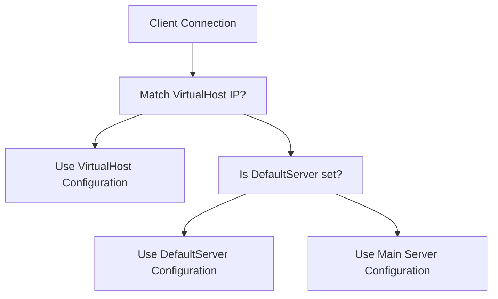
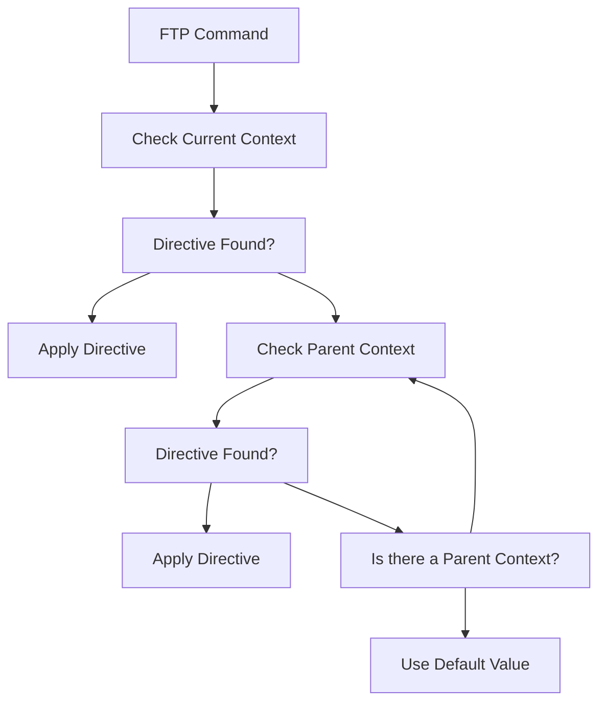
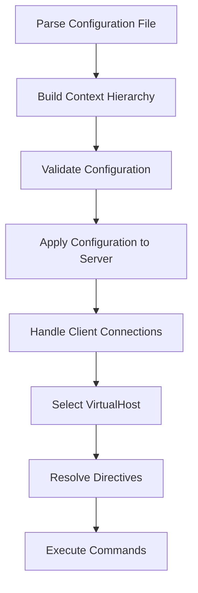

# Virtual Hosts and Contexts

> **Relevant source files**
> * [doc/modules/mod_auth.html](https://github.com/proftpd/proftpd/blob/362466f3/doc/modules/mod_auth.html)
> * [doc/modules/mod_core.html](https://github.com/proftpd/proftpd/blob/362466f3/doc/modules/mod_core.html)
> * [doc/modules/mod_xfer.html](https://github.com/proftpd/proftpd/blob/362466f3/doc/modules/mod_xfer.html)
> * [include/cmd.h](https://github.com/proftpd/proftpd/blob/362466f3/include/cmd.h)
> * [include/ftp.h](https://github.com/proftpd/proftpd/blob/362466f3/include/ftp.h)
> * [include/options.h](https://github.com/proftpd/proftpd/blob/362466f3/include/options.h)
> * [src/cmd.c](https://github.com/proftpd/proftpd/blob/362466f3/src/cmd.c)
> * [tests/api/cmd.c](https://github.com/proftpd/proftpd/blob/362466f3/tests/api/cmd.c)
> * [tests/t/commands.t](https://github.com/proftpd/proftpd/blob/362466f3/tests/t/commands.t)
> * [tests/t/commands/rang.t](https://github.com/proftpd/proftpd/blob/362466f3/tests/t/commands/rang.t)
> * [tests/t/config/defaultroot.t](https://github.com/proftpd/proftpd/blob/362466f3/tests/t/config/defaultroot.t)
> * [tests/t/config/include.t](https://github.com/proftpd/proftpd/blob/362466f3/tests/t/config/include.t)
> * [tests/t/lib/ProFTPD/TestSuite/FTP.pm](https://github.com/proftpd/proftpd/blob/362466f3/tests/t/lib/ProFTPD/TestSuite/FTP.pm)
> * [tests/t/lib/ProFTPD/TestSuite/Utils.pm](https://github.com/proftpd/proftpd/blob/362466f3/tests/t/lib/ProFTPD/TestSuite/Utils.pm)
> * [tests/t/lib/ProFTPD/Tests/Commands.pm](https://github.com/proftpd/proftpd/blob/362466f3/tests/t/lib/ProFTPD/Tests/Commands.pm)
> * [tests/t/lib/ProFTPD/Tests/Commands/CLNT.pm](https://github.com/proftpd/proftpd/blob/362466f3/tests/t/lib/ProFTPD/Tests/Commands/CLNT.pm)
> * [tests/t/lib/ProFTPD/Tests/Commands/RANG.pm](https://github.com/proftpd/proftpd/blob/362466f3/tests/t/lib/ProFTPD/Tests/Commands/RANG.pm)
> * [tests/t/lib/ProFTPD/Tests/Config/DefaultRoot.pm](https://github.com/proftpd/proftpd/blob/362466f3/tests/t/lib/ProFTPD/Tests/Config/DefaultRoot.pm)
> * [tests/t/lib/ProFTPD/Tests/Config/Include.pm](https://github.com/proftpd/proftpd/blob/362466f3/tests/t/lib/ProFTPD/Tests/Config/Include.pm)
> * [tests/t/lib/ProFTPD/Tests/Logins.pm](https://github.com/proftpd/proftpd/blob/362466f3/tests/t/lib/ProFTPD/Tests/Logins.pm)
> * [tests/t/lib/ProFTPD/Tests/Modules/mod_sftp/rewrite.pm](https://github.com/proftpd/proftpd/blob/362466f3/tests/t/lib/ProFTPD/Tests/Modules/mod_sftp/rewrite.pm)
> * [tests/t/modules/mod_sftp/rewrite.t](https://github.com/proftpd/proftpd/blob/362466f3/tests/t/modules/mod_sftp/rewrite.t)
> * [tests/tests.pl](https://github.com/proftpd/proftpd/blob/362466f3/tests/tests.pl)

Virtual Hosts and Contexts are primary organizational constructs in ProFTPD's configuration system, allowing for flexible and granular configuration of FTP services. This document explains how these features are implemented and work together to provide fine-grained control over server behavior based on IP addresses, directories, commands, and other criteria.

## Virtual Hosts

Virtual Hosts in ProFTPD allow you to serve different FTP configurations based on the IP address or hostname used to connect to the server. This enables hosting multiple FTP sites on a single server, each with its own configuration.

### Syntax and Implementation

The VirtualHost directive has the following syntax:

```xml
<VirtualHost addr [addr2 ...]>
  # Virtual host specific directives
</VirtualHost>
```

Within the ProFTPD codebase, each Virtual Host is represented internally as a `server_rec` structure containing its own configuration parameters.

### Virtual Host Selection Process



When a client connects to the server, ProFTPD selects the appropriate virtual host by:

1. Getting the local (server) IP address of the connection
2. Comparing it with IP addresses defined for each VirtualHost
3. If a match is found, using that VirtualHost's configuration
4. If no match is found and a DefaultServer is defined, using that configuration
5. Otherwise, using the main server configuration

If no matching virtual host is found and no DefaultServer is configured, the client receives a "500 Sorry, no server available" error.

### DefaultServer Directive

The DefaultServer directive controls which server configuration is used as the fallback when a matching virtual host cannot be found:

```
DefaultServer on|off
```

Only one server configuration can be designated as the DefaultServer. In the code, this is implemented by setting a flag in the `server_rec` structure.

Sources: [doc/modules/mod_core.html L663-L673](https://github.com/proftpd/proftpd/blob/362466f3/doc/modules/mod_core.html#L663-L673)

 [tests/t/lib/ProFTPD/TestSuite/Utils.pm L415-L419](https://github.com/proftpd/proftpd/blob/362466f3/tests/t/lib/ProFTPD/TestSuite/Utils.pm#L415-L419)

## Configuration Contexts

Contexts are hierarchical configuration sections that group related directives and apply them to specific scenarios. They create a nested structure that ProFTPD traverses to determine the applicable configuration for each client request.

### Types of Contexts

ProFTPD supports several context types, all implemented in the `mod_core` module:

1. **`<Anonymous>`** - Defines an anonymous FTP login and restricts the session to a specific directory via chroot
2. **`<Directory>`** - Applies directives to a specific directory and its subdirectories
3. **`<Limit>`** - Restricts access to specific FTP commands or groups of commands
4. **`<Global>`** - Defines directives that apply to all virtual hosts and the main server
5. **`<IfDefine>`** - Contains configuration applied only if a specified label is defined
6. **`<IfModule>`** - Contains configuration applied only if a specified module is loaded
7. **`<Class>`** - Defines a connection class based on client attributes like IP address

```mermaid
flowchart TD

A["Configuration Contexts"]
B[""]
C[""]
D[""]
E[""]
F[""]
G[""]
H[""]
I[""]

A --> B
A --> C
A --> D
A --> E
A --> F
A --> G
A --> H
A --> I
```

Sources: [doc/modules/mod_core.html L22-L103](https://github.com/proftpd/proftpd/blob/362466f3/doc/modules/mod_core.html#L22-L103)

### Context Hierarchy and Nesting

Contexts in ProFTPD form a tree-like structure with the server config at the root. Child contexts inherit settings from their parents but can override them with their own directives.

```mermaid
flowchart TD

A["Server Config (Global)"]
B[""]
C[""]
D[""]
E[""]
F["in Anonymous"]
G[""]
H["in Directory in Anonymous"]

A --> B
A --> C
B --> D
B --> E
D --> F
E --> G
F --> H
```

In the codebase, this hierarchy is maintained through nested `config_rec` structures, each representing a configuration context. The structure follows a generally predictable order from most general to most specific:

1. Server config (global)
2. `<Global>`
3. `<VirtualHost>`
4. `<Anonymous>`
5. `<Directory>`
6. `<Limit>`

Sources: [tests/t/lib/ProFTPD/TestSuite/Utils.pm L362-L359](https://github.com/proftpd/proftpd/blob/362466f3/tests/t/lib/ProFTPD/TestSuite/Utils.pm#L362-L359)

### Directive Resolution Process



When processing a directive, ProFTPD follows this approach:

1. Look for the directive in the most specific context first
2. If not found, move up to the parent context
3. Continue until reaching the global context
4. Use the default value if not found anywhere

For example, if a client attempts a STOR operation in `/var/ftp/uploads` within an anonymous session on a virtual host, ProFTPD checks for applicable directives in this order:

1. `<Limit STOR>` within `<Directory uploads>` within `<Anonymous>` within `<VirtualHost>`
2. `<Directory uploads>` within `<Anonymous>` within `<VirtualHost>`
3. `<Anonymous>` within `<VirtualHost>`
4. `<VirtualHost>`
5. Server config or `<Global>`

Sources: [tests/t/lib/ProFTPD/TestSuite/Utils.pm L315-L336](https://github.com/proftpd/proftpd/blob/362466f3/tests/t/lib/ProFTPD/TestSuite/Utils.pm#L315-L336)

## Anonymous Context

The `<Anonymous>` context creates an anonymous FTP login with its own restricted file system view. When a client logs in using a username mapped to an anonymous login, the server executes a `chroot()` operation to restrict the session to the specified directory.

```xml
<Anonymous anon-directory>
  User ftp
  Group ftp
  # Other directives...
</Anonymous>
```

The `<Anonymous>` context supports nested `<Directory>` and `<Limit>` contexts to further control access within the anonymous area. A common pattern is to restrict write access except in specific upload directories:

```xml
<Anonymous ~ftp>
  User ftp
  Group ftp
  UserAlias anonymous ftp
  
  <Directory *>
    <Limit WRITE>
      DenyAll
    </Limit>
  </Directory>
  
  <Directory incoming>
    <Limit READ>
      DenyAll
    </Limit>
    
    <Limit STOR>
      AllowAll
    </Limit>
  </Directory>
</Anonymous>
```

Sources: [doc/modules/mod_core.html L439-L506](https://github.com/proftpd/proftpd/blob/362466f3/doc/modules/mod_core.html#L439-L506)

 [tests/t/lib/ProFTPD/Tests/Logins.pm L30-L58](https://github.com/proftpd/proftpd/blob/362466f3/tests/t/lib/ProFTPD/Tests/Logins.pm#L30-L58)

## Directory Context

The `<Directory>` context applies directives to specific directories and their subdirectories. This allows for path-specific configuration:

```xml
<Directory /path/to/directory>
  # Directory-specific directives
</Directory>
```

Directory contexts can be nested within `<Anonymous>` contexts or directly within the server config or virtual hosts. They can also contain `<Limit>` contexts to restrict specific commands.

Sources: [tests/t/lib/ProFTPD/TestSuite/Utils.pm L281-L307](https://github.com/proftpd/proftpd/blob/362466f3/tests/t/lib/ProFTPD/TestSuite/Utils.pm#L281-L307)

## Limit Context

The `<Limit>` context restricts access to specific FTP commands or command groups:

```xml
<Limit command1 command2 ...>
  # Access control directives
</Limit>
```

Common limit sections include:

* `<Limit LOGIN>` - Controls who can log in
* `<Limit READ>` - Controls who can download files or view directories
* `<Limit WRITE>` - Controls who can upload, delete, or modify files

Within a `<Limit>` context, directives like `AllowUser`, `DenyUser`, `AllowGroup`, `DenyGroup`, etc. control access based on user or group membership.

Sources: [doc/modules/mod_core.html L60-L61](https://github.com/proftpd/proftpd/blob/362466f3/doc/modules/mod_core.html#L60-L61)

 [tests/t/lib/ProFTPD/TestSuite/Utils.pm L309-L336](https://github.com/proftpd/proftpd/blob/362466f3/tests/t/lib/ProFTPD/TestSuite/Utils.pm#L309-L336)

## Configuration Processing Flow



The configuration process in ProFTPD involves:

1. **Parsing and Lexical Analysis**: Reading the configuration file and identifying directives and contexts
2. **Context Building**: Constructing the hierarchy of configuration contexts
3. **Validation**: Checking for syntax and logical errors
4. **Application**: Applying configuration based on client connections and requests

Functions like `config_write_subsection` in the test suite demonstrate how different contexts are represented in the configuration.

Sources: [tests/t/lib/ProFTPD/TestSuite/Utils.pm L274-L359](https://github.com/proftpd/proftpd/blob/362466f3/tests/t/lib/ProFTPD/TestSuite/Utils.pm#L274-L359)

## Include Directive

ProFTPD supports including other configuration files using the `Include` directive:

```
Include /path/to/config/file
```

The server processes included files as if their contents were directly in the main configuration file, enabling modular configuration organization. The `Include` directive can also use wildcards to include multiple files:

```
Include /etc/proftpd/conf.d/*.conf
```

Sources: [tests/t/lib/ProFTPD/Tests/Config/Include.pm L19-L53](https://github.com/proftpd/proftpd/blob/362466f3/tests/t/lib/ProFTPD/Tests/Config/Include.pm#L19-L53)

## Examples and Best Practices

### Virtual Host Example

```xml
# Main server configuration
ServerName "Main FTP Server"
Port 21

# Virtual host for specific IP
<VirtualHost 192.168.1.1>
  ServerName "Marketing FTP"
  MaxClients 10
</VirtualHost>

# Default virtual host
<VirtualHost 192.168.1.2>
  ServerName "Default FTP"
  DefaultServer on
</VirtualHost>
```

### Directory-Specific Access Control Example

```xml
<Directory /var/ftp/pub>
  <Limit ALL>
    AllowAll
  </Limit>
</Directory>

<Directory /var/ftp/private>
  <Limit ALL>
    DenyAll
  </Limit>
  
  <Limit READ>
    AllowUser john
    AllowUser jane
  </Limit>
</Directory>
```

### Best Practices

1. Use meaningful `ServerName` directives for each virtual host to identify them in logs
2. Use the `DefaultServer` directive to handle connections to unspecified IP addresses
3. Organize your configuration with nested contexts for clarity and maintainability
4. Use specific contexts rather than global settings when possible
5. Use `Include` directives to modularize complex configurations
6. Test your configuration before deploying to production using the `-t` flag: `proftpd -t -c /path/to/proftpd.conf`

Sources: [tests/t/lib/ProFTPD/Tests/Config/DefaultRoot.pm L20-L48](https://github.com/proftpd/proftpd/blob/362466f3/tests/t/lib/ProFTPD/Tests/Config/DefaultRoot.pm#L20-L48)

 [tests/t/lib/ProFTPD/Tests/Logins.pm L30-L58](https://github.com/proftpd/proftpd/blob/362466f3/tests/t/lib/ProFTPD/Tests/Logins.pm#L30-L58)

## Summary

Virtual Hosts and Contexts form the foundation of ProFTPD's configuration system, providing a flexible and powerful way to organize server settings. The hierarchical nature of contexts allows for granular control over server behavior based on various criteria, while Virtual Hosts enable serving different configurations based on IP addresses or hostnames.

Understanding how these constructs work together is essential for effectively configuring and maintaining ProFTPD servers. By leveraging the context hierarchy, administrators can create sophisticated access control rules and customize the server's behavior for different scenarios.

Sources: [doc/modules/mod_core.html L28-L104](https://github.com/proftpd/proftpd/blob/362466f3/doc/modules/mod_core.html#L28-L104)

 [tests/t/lib/ProFTPD/TestSuite/Utils.pm L274-L359](https://github.com/proftpd/proftpd/blob/362466f3/tests/t/lib/ProFTPD/TestSuite/Utils.pm#L274-L359)