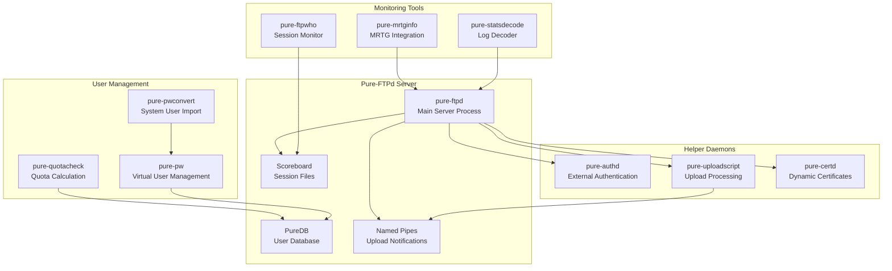
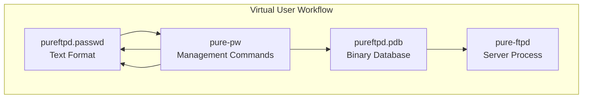
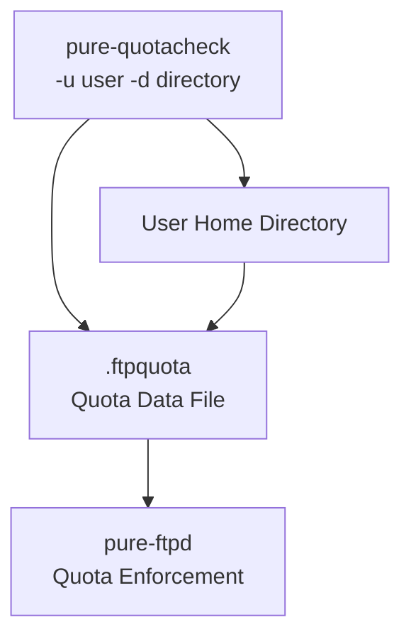
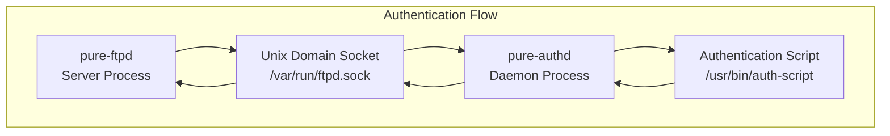
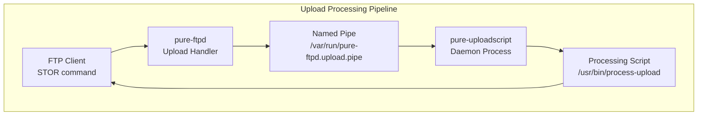
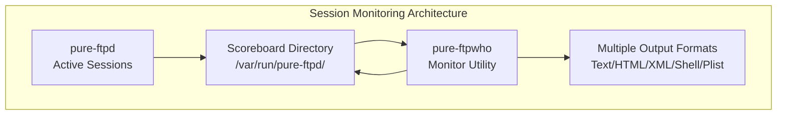
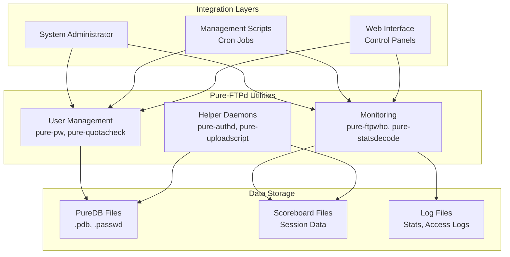

# Administrative Utilities

> **Relevant source files**
> * [man/Makefile.am](https://github.com/jedisct1/pure-ftpd/blob/3818577a/man/Makefile.am)
> * [man/pure-authd.8.in](https://github.com/jedisct1/pure-ftpd/blob/3818577a/man/pure-authd.8.in)
> * [man/pure-ftpwho.8.in](https://github.com/jedisct1/pure-ftpd/blob/3818577a/man/pure-ftpwho.8.in)
> * [man/pure-pw.8.in](https://github.com/jedisct1/pure-ftpd/blob/3818577a/man/pure-pw.8.in)
> * [man/pure-pwconvert.8.in](https://github.com/jedisct1/pure-ftpd/blob/3818577a/man/pure-pwconvert.8.in)
> * [man/pure-quotacheck.8.in](https://github.com/jedisct1/pure-ftpd/blob/3818577a/man/pure-quotacheck.8.in)
> * [man/pure-statsdecode.8.in](https://github.com/jedisct1/pure-ftpd/blob/3818577a/man/pure-statsdecode.8.in)
> * [man/pure-uploadscript.8.in](https://github.com/jedisct1/pure-ftpd/blob/3818577a/man/pure-uploadscript.8.in)
> * [src/ftpwho-read.c](https://github.com/jedisct1/pure-ftpd/blob/3818577a/src/ftpwho-read.c)
> * [src/mysnprintf.c](https://github.com/jedisct1/pure-ftpd/blob/3818577a/src/mysnprintf.c)
> * [src/pure-authd.c](https://github.com/jedisct1/pure-ftpd/blob/3818577a/src/pure-authd.c)
> * [src/pure-certd.c](https://github.com/jedisct1/pure-ftpd/blob/3818577a/src/pure-certd.c)
> * [src/pure-ftpwho.c](https://github.com/jedisct1/pure-ftpd/blob/3818577a/src/pure-ftpwho.c)
> * [src/pure-uploadscript.c](https://github.com/jedisct1/pure-ftpd/blob/3818577a/src/pure-uploadscript.c)

This document covers the administrative utilities provided with Pure-FTPd for system management, user administration, and monitoring. These tools enable administrators to manage virtual users, monitor active sessions, process uploads, and integrate with external authentication systems. For runtime configuration options, see [Runtime Configuration](/jedisct1/pure-ftpd/5.2-runtime-configuration). For user authentication methods, see [Authentication and User Management](/jedisct1/pure-ftpd/4-authentication-and-user-management).

## Overview

Pure-FTPd includes several administrative utilities that operate as standalone programs or background daemons. These utilities can be categorized into three main groups:

* **User Management Tools**: Utilities for managing virtual users and quotas
* **Helper Daemons**: Background services that extend server functionality
* **Monitoring and Analysis Tools**: Utilities for session monitoring and log analysis

## Administrative Utilities Architecture



Sources: [src/pure-authd.c L1-L479](https://github.com/jedisct1/pure-ftpd/blob/3818577a/src/pure-authd.c#L1-L479)

 [src/pure-uploadscript.c L1-L502](https://github.com/jedisct1/pure-ftpd/blob/3818577a/src/pure-uploadscript.c#L1-L502)

 [src/pure-certd.c L1-L446](https://github.com/jedisct1/pure-ftpd/blob/3818577a/src/pure-certd.c#L1-L446)

 [src/pure-ftpwho.c L1-L900](https://github.com/jedisct1/pure-ftpd/blob/3818577a/src/pure-ftpwho.c#L1-L900)

## User Management Utilities

### pure-pw - Virtual User Management

The `pure-pw` utility manages Pure-FTPd's virtual user database, providing commands to create, modify, and delete user accounts stored in PureDB format.

| Command | Purpose | Key Options |
| --- | --- | --- |
| `useradd` | Create new virtual user | `-u uid`, `-g gid`, `-d directory` |
| `usermod` | Modify existing user | `-t bandwidth`, `-q quota`, `-r restrictions` |
| `userdel` | Delete virtual user | `-m` (update database) |
| `passwd` | Change user password | Interactive password prompt |
| `mkdb` | Compile text to binary | Updates `.pdb` from `.passwd` |
| `list` | Display all users | Shows user accounts and settings |



Sources: [man/pure-pw.8.in L1-L87](https://github.com/jedisct1/pure-ftpd/blob/3818577a/man/pure-pw.8.in#L1-L87)

### pure-quotacheck - Quota Management

The `pure-quotacheck` utility scans user directories to calculate current disk usage and file counts, creating `.ftpquota` files that Pure-FTPd uses for quota enforcement.

**Security Features:**

* Switches to target user privileges immediately
* Performs `chroot()` to prevent directory traversal
* Refuses to scan root-owned directories
* Only processes regular files, ignoring special files
* Prevents scanning the same inode twice



Sources: [man/pure-quotacheck.8.in L1-L69](https://github.com/jedisct1/pure-ftpd/blob/3818577a/man/pure-quotacheck.8.in#L1-L69)

### pure-pwconvert - System User Import

The `pure-pwconvert` utility reads system accounts from `/etc/passwd` and generates Pure-FTPd virtual user entries, facilitating migration from system-based to virtual user authentication.

Sources: [man/pure-pwconvert.8.in L1-L40](https://github.com/jedisct1/pure-ftpd/blob/3818577a/man/pure-pwconvert.8.in#L1-L40)

## Helper Daemons

### pure-authd - External Authentication Daemon

The `pure-authd` daemon provides external authentication by executing custom scripts and relaying results to Pure-FTPd via Unix domain sockets.

**Communication Protocol:**

```yaml
Client → pure-authd:
account:username
password:secret  
localhost:192.168.1.1
localport:21
peer:192.168.1.100
end

Script → Client:
auth_ok:1
uid:1000
gid:1000  
dir:/home/user
end
```

**Environment Variables Passed to Script:**

* `AUTHD_ACCOUNT` - Username
* `AUTHD_PASSWORD` - Password
* `AUTHD_LOCAL_IP` - Server IP address
* `AUTHD_LOCAL_PORT` - Server port
* `AUTHD_REMOTE_IP` - Client IP address
* `AUTHD_ENCRYPTED` - TLS connection status



Sources: [src/pure-authd.c L428-L477](https://github.com/jedisct1/pure-ftpd/blob/3818577a/src/pure-authd.c#L428-L477)

 [src/pure-authd.c L236-L277](https://github.com/jedisct1/pure-ftpd/blob/3818577a/src/pure-authd.c#L236-L277)

 [man/pure-authd.8.in L1-L147](https://github.com/jedisct1/pure-ftpd/blob/3818577a/man/pure-authd.8.in#L1-L147)

### pure-uploadscript - Upload Processing Daemon

The `pure-uploadscript` daemon monitors successful file uploads and executes custom scripts for post-processing. It reads from a named pipe that Pure-FTPd writes to after each successful upload.

**Key Functions:**

* `readpipe()` [src/pure-uploadscript.c L75-L121](https://github.com/jedisct1/pure-ftpd/blob/3818577a/src/pure-uploadscript.c#L75-L121)  - Parses upload notifications
* `checkvirtual()` [src/pure-uploadscript.c L128-L145](https://github.com/jedisct1/pure-ftpd/blob/3818577a/src/pure-uploadscript.c#L128-L145)  - Handles virtual host paths
* `run()` [src/pure-uploadscript.c L381-L411](https://github.com/jedisct1/pure-ftpd/blob/3818577a/src/pure-uploadscript.c#L381-L411)  - Executes processing script

**Environment Variables for Scripts:**

* `UPLOAD_SIZE` - File size in bytes
* `UPLOAD_PERMS` - File permissions (octal)
* `UPLOAD_UID`/`UPLOAD_GID` - Owner IDs
* `UPLOAD_USER`/`UPLOAD_GROUP` - Owner names
* `UPLOAD_VUSER` - Virtual username



Sources: [src/pure-uploadscript.c L29-L60](https://github.com/jedisct1/pure-ftpd/blob/3818577a/src/pure-uploadscript.c#L29-L60)

 [src/pure-uploadscript.c L437-L500](https://github.com/jedisct1/pure-ftpd/blob/3818577a/src/pure-uploadscript.c#L437-L500)

 [man/pure-uploadscript.8.in L1-L103](https://github.com/jedisct1/pure-ftpd/blob/3818577a/man/pure-uploadscript.8.in#L1-L103)

### pure-certd - Dynamic Certificate Daemon

The `pure-certd` daemon provides dynamic TLS certificate selection based on SNI (Server Name Indication), allowing different certificates for different hostnames.

**Key Components:**

* `listencnx()` [src/pure-certd.c L322-L382](https://github.com/jedisct1/pure-ftpd/blob/3818577a/src/pure-certd.c#L322-L382)  - Unix socket listener
* `process()` [src/pure-certd.c L247-L320](https://github.com/jedisct1/pure-ftpd/blob/3818577a/src/pure-certd.c#L247-L320)  - Request processor
* Certificate script execution with `ENV_CERTD_SNI_NAME` environment variable

Sources: [src/pure-certd.c L395-L444](https://github.com/jedisct1/pure-ftpd/blob/3818577a/src/pure-certd.c#L395-L444)

 [src/pure-certd.c L236-L245](https://github.com/jedisct1/pure-ftpd/blob/3818577a/src/pure-certd.c#L236-L245)

## Monitoring and Analysis Tools

### pure-ftpwho - Session Monitor

The `pure-ftpwho` utility displays active FTP sessions by reading scoreboard files created by Pure-FTPd. It supports multiple output formats for different use cases.

**Output Formats:**

| Format | Option | Purpose |
| --- | --- | --- |
| Text | Default | Human-readable console output |
| HTML | `-w` | Web-based monitoring |
| XML | `-x` | Machine processing |
| Shell | `-s` | Script parsing |
| Plist | `-p` | macOS/GNUStep integration |

**Key Data Structures:**

* `FTPWhoEntry` - Session information structure
* Scoreboard files in `SCOREBOARD_PATH` directory
* File locking with `ftpwho_lock()` [src/pure-ftpwho.c L46-L54](https://github.com/jedisct1/pure-ftpd/blob/3818577a/src/pure-ftpwho.c#L46-L54)



**Session State Types:**

* `FTPWHO_STATE_IDLE` - Connected but inactive
* `FTPWHO_STATE_DOWNLOAD` - File download in progress
* `FTPWHO_STATE_UPLOAD` - File upload in progress

Sources: [src/pure-ftpwho.c L715-L900](https://github.com/jedisct1/pure-ftpd/blob/3818577a/src/pure-ftpwho.c#L715-L900)

 [src/pure-ftpwho.c L102-L105](https://github.com/jedisct1/pure-ftpd/blob/3818577a/src/pure-ftpwho.c#L102-L105)

 [man/pure-ftpwho.8.in L1-L88](https://github.com/jedisct1/pure-ftpd/blob/3818577a/man/pure-ftpwho.8.in#L1-L88)

### pure-statsdecode - Log Analysis

The `pure-statsdecode` utility converts Pure-FTPd's binary log timestamps into human-readable format, facilitating log analysis and reporting.

**Usage Pattern:**

```
pure-statsdecode /var/log/pureftpd.log > readable.log
cat /var/log/pureftpd.log | pure-statsdecode - | gzip > archive.log.gz
```

Sources: [man/pure-statsdecode.8.in L1-L51](https://github.com/jedisct1/pure-ftpd/blob/3818577a/man/pure-statsdecode.8.in#L1-L51)

## Utility Integration Patterns



Sources: [man/Makefile.am L1-L24](https://github.com/jedisct1/pure-ftpd/blob/3818577a/man/Makefile.am#L1-L24)

 [src/ftpwho-read.c L33-L86](https://github.com/jedisct1/pure-ftpd/blob/3818577a/src/ftpwho-read.c#L33-L86)