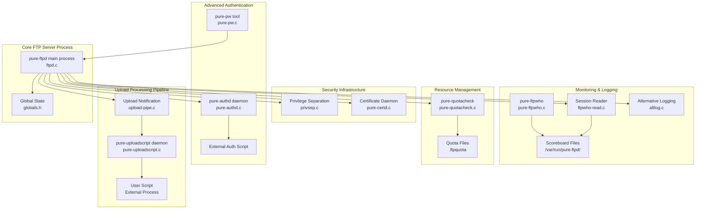
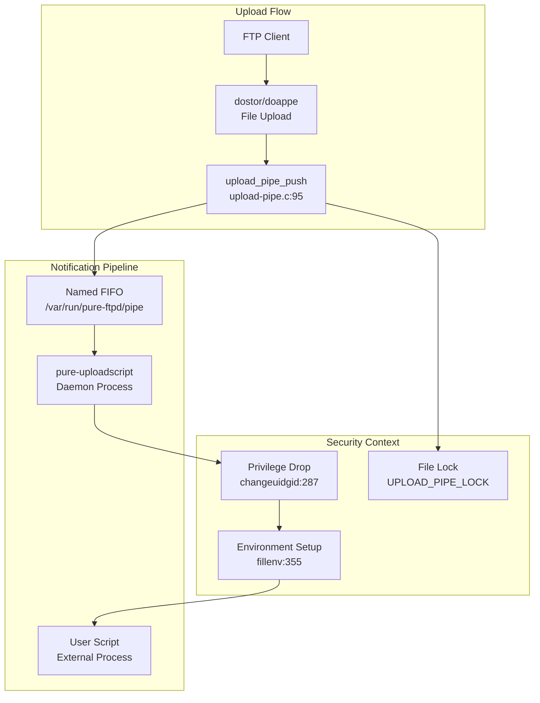
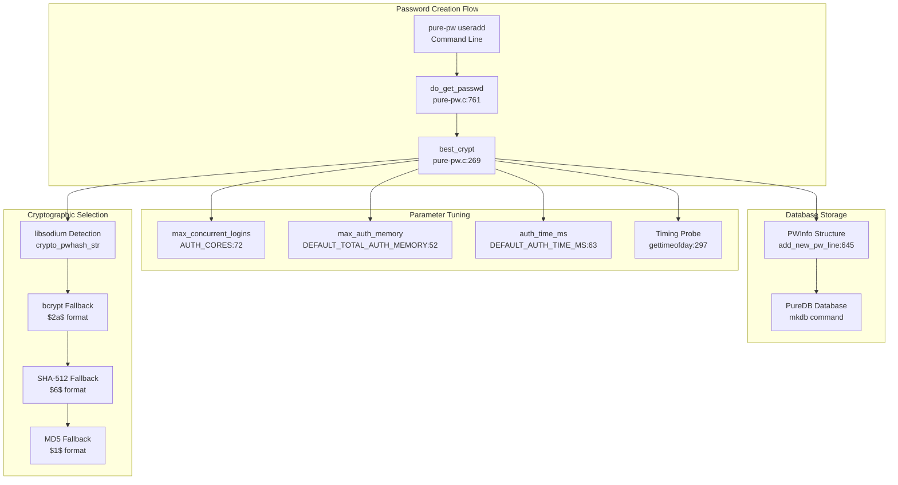
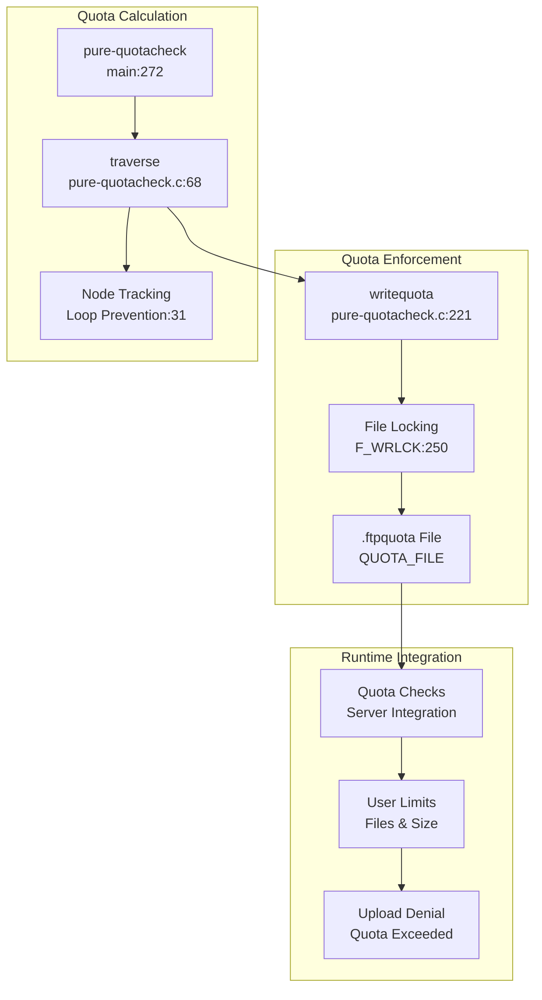
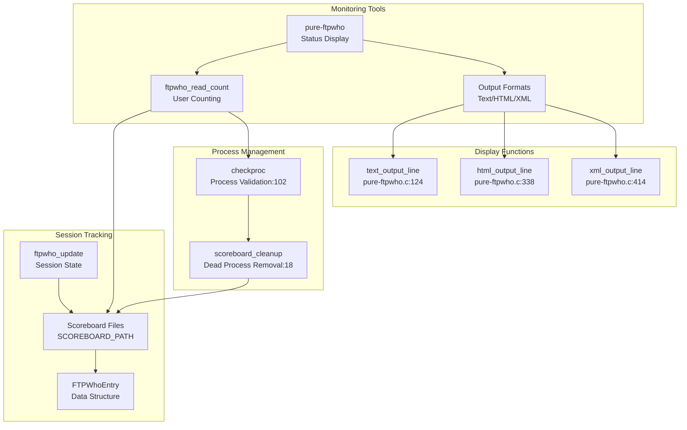
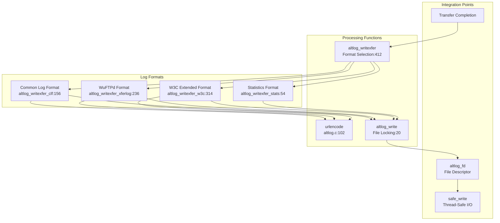
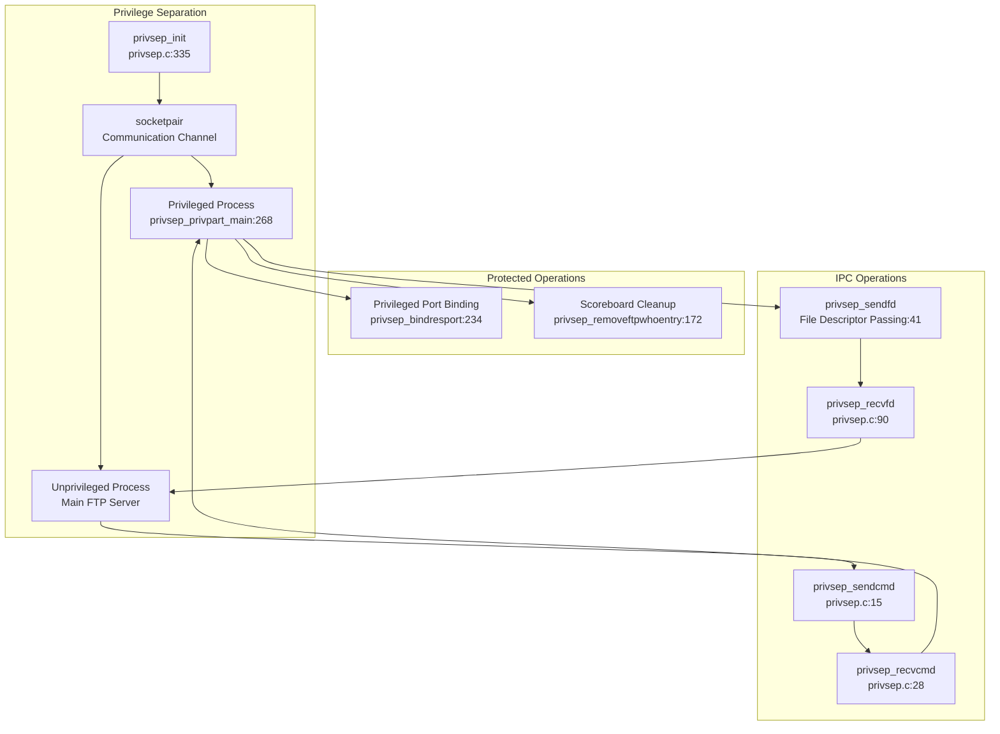

# Advanced Features

> **Relevant source files**
> * [src/altlog.c](https://github.com/jedisct1/pure-ftpd/blob/3818577a/src/altlog.c)
> * [src/ftpwho-read.c](https://github.com/jedisct1/pure-ftpd/blob/3818577a/src/ftpwho-read.c)
> * [src/log_puredb.c](https://github.com/jedisct1/pure-ftpd/blob/3818577a/src/log_puredb.c)
> * [src/mysnprintf.c](https://github.com/jedisct1/pure-ftpd/blob/3818577a/src/mysnprintf.c)
> * [src/privsep.c](https://github.com/jedisct1/pure-ftpd/blob/3818577a/src/privsep.c)
> * [src/privsep_p.h](https://github.com/jedisct1/pure-ftpd/blob/3818577a/src/privsep_p.h)
> * [src/pure-authd.c](https://github.com/jedisct1/pure-ftpd/blob/3818577a/src/pure-authd.c)
> * [src/pure-certd.c](https://github.com/jedisct1/pure-ftpd/blob/3818577a/src/pure-certd.c)
> * [src/pure-ftpwho.c](https://github.com/jedisct1/pure-ftpd/blob/3818577a/src/pure-ftpwho.c)
> * [src/pure-pw.c](https://github.com/jedisct1/pure-ftpd/blob/3818577a/src/pure-pw.c)
> * [src/pure-quotacheck.c](https://github.com/jedisct1/pure-ftpd/blob/3818577a/src/pure-quotacheck.c)
> * [src/pure-uploadscript.c](https://github.com/jedisct1/pure-ftpd/blob/3818577a/src/pure-uploadscript.c)
> * [src/upload-pipe.c](https://github.com/jedisct1/pure-ftpd/blob/3818577a/src/upload-pipe.c)

This section covers Pure-FTPd's sophisticated features that extend beyond basic FTP operations, including automated post-upload processing, advanced user management, resource monitoring, and security enhancements. These features enable enterprise-grade deployments with fine-grained control over user access, resource usage, and operational monitoring.

For basic server configuration, see [Runtime Configuration](/jedisct1/pure-ftpd/5.2-runtime-configuration). For core authentication methods, see [Authentication and User Management](/jedisct1/pure-ftpd/4-authentication-and-user-management). For privilege separation details, see [Privilege Separation and Security](/jedisct1/pure-ftpd/3.2-privilege-separation-and-security).

## Architecture Overview

Pure-FTPd's advanced features are built around a modular architecture that separates concerns while maintaining tight integration with the core server process. The system uses helper daemons, inter-process communication mechanisms, and pluggable processing pipelines to deliver enterprise functionality.

Sources: [src/pure-uploadscript.c L1-L502](https://github.com/jedisct1/pure-ftpd/blob/3818577a/src/pure-uploadscript.c#L1-L502)

 [src/pure-pw.c L1-L50](https://github.com/jedisct1/pure-ftpd/blob/3818577a/src/pure-pw.c#L1-L50)

 [src/pure-quotacheck.c L1-L30](https://github.com/jedisct1/pure-ftpd/blob/3818577a/src/pure-quotacheck.c#L1-L30)

 [src/pure-ftpwho.c L1-L30](https://github.com/jedisct1/pure-ftpd/blob/3818577a/src/pure-ftpwho.c#L1-L30)

 [src/pure-authd.c L1-L50](https://github.com/jedisct1/pure-ftpd/blob/3818577a/src/pure-authd.c#L1-L50)

 [src/privsep.c L1-L50](https://github.com/jedisct1/pure-ftpd/blob/3818577a/src/privsep.c#L1-L50)

 [src/altlog.c L1-L50](https://github.com/jedisct1/pure-ftpd/blob/3818577a/src/altlog.c#L1-L50)

## Upload Processing Pipeline

The upload processing system enables automated post-upload actions through a secure pipeline that notifies external scripts when files are uploaded. This system uses named pipes for communication and maintains security through privilege separation.

The upload notification process begins when a file upload completes. The main server process calls `upload_pipe_push()` which writes a structured message containing the username and file path to a named FIFO. The `pure-uploadscript` daemon reads from this FIFO and executes user-defined scripts with environment variables containing upload metadata.

**Key Implementation Details:**

* **Secure Communication**: Uses named pipes with strict permission checking [src/upload-pipe.c L47-L84](https://github.com/jedisct1/pure-ftpd/blob/3818577a/src/upload-pipe.c#L47-L84)
* **Message Format**: Binary protocol with username and file path [src/upload-pipe.c L95-L139](https://github.com/jedisct1/pure-ftpd/blob/3818577a/src/upload-pipe.c#L95-L139)
* **Process Isolation**: Scripts run in separate processes with dropped privileges [src/pure-uploadscript.c L393-L411](https://github.com/jedisct1/pure-ftpd/blob/3818577a/src/pure-uploadscript.c#L393-L411)
* **Virtual Host Support**: File paths include virtual host prefixes [src/pure-uploadscript.c L128-L145](https://github.com/jedisct1/pure-ftpd/blob/3818577a/src/pure-uploadscript.c#L128-L145)

Sources: [src/upload-pipe.c L14-L155](https://github.com/jedisct1/pure-ftpd/blob/3818577a/src/upload-pipe.c#L14-L155)

 [src/pure-uploadscript.c L75-L500](https://github.com/jedisct1/pure-ftpd/blob/3818577a/src/pure-uploadscript.c#L75-L500)

## Advanced Password Hashing and User Management

Pure-FTPd implements sophisticated password hashing using modern cryptographic functions, with automatic parameter tuning based on system capabilities and security requirements.

The password hashing system automatically selects the strongest available cryptographic function and tunes parameters based on system performance and security requirements. The `best_crypt()` function [src/pure-pw.c L269-L374](https://github.com/jedisct1/pure-ftpd/blob/3818577a/src/pure-pw.c#L269-L374)

 implements a timing-based approach to determine optimal parameters for password hashing operations.

**Adaptive Security Features:**

* **Performance Tuning**: Automatically adjusts operations count based on timing measurements [src/pure-pw.c L297-L318](https://github.com/jedisct1/pure-ftpd/blob/3818577a/src/pure-pw.c#L297-L318)
* **Memory Management**: Divides available memory across concurrent authentication attempts [src/pure-pw.c L284-L296](https://github.com/jedisct1/pure-ftpd/blob/3818577a/src/pure-pw.c#L284-L296)
* **Fallback Chain**: Gracefully degrades from libsodium to traditional crypt() functions [src/pure-pw.c L327-L373](https://github.com/jedisct1/pure-ftpd/blob/3818577a/src/pure-pw.c#L327-L373)
* **Constant-Time Operations**: Uses timing-safe comparison functions for security [src/log_puredb.c L244](https://github.com/jedisct1/pure-ftpd/blob/3818577a/src/log_puredb.c#L244-L244)

Sources: [src/pure-pw.c L269-L374](https://github.com/jedisct1/pure-ftpd/blob/3818577a/src/pure-pw.c#L269-L374)

 [src/pure-pw.c L761-L809](https://github.com/jedisct1/pure-ftpd/blob/3818577a/src/pure-pw.c#L761-L809)

 [src/log_puredb.c L215-L400](https://github.com/jedisct1/pure-ftpd/blob/3818577a/src/log_puredb.c#L215-L400)

## Resource Management and Monitoring

The quota system provides real-time disk usage tracking and enforcement through a combination of background scanning and cached quota files.

The quota system uses a recursive directory traversal with cycle detection to calculate total disk usage. The `traverse()` function [src/pure-quotacheck.c L68-L166](https://github.com/jedisct1/pure-ftpd/blob/3818577a/src/pure-quotacheck.c#L68-L166)

 maintains a list of visited inodes to prevent infinite loops in case of symbolic links or bind mounts.

Sources: [src/pure-quotacheck.c L68-L270](https://github.com/jedisct1/pure-ftpd/blob/3818577a/src/pure-quotacheck.c#L68-L270)

 [src/pure-quotacheck.c L221-L270](https://github.com/jedisct1/pure-ftpd/blob/3818577a/src/pure-quotacheck.c#L221-L270)

## Session Monitoring Infrastructure

Pure-FTPd provides comprehensive session monitoring through a scoreboard system that tracks active connections and enables real-time status reporting.

The monitoring system maintains individual files for each active session in the scoreboard directory. The `pure-ftpwho` utility reads these files to provide real-time status information with multiple output formats suitable for different use cases.

Sources: [src/pure-ftpwho.c L102-L202](https://github.com/jedisct1/pure-ftpd/blob/3818577a/src/pure-ftpwho.c#L102-L202)

 [src/ftpwho-read.c L13-L86](https://github.com/jedisct1/pure-ftpd/blob/3818577a/src/ftpwho-read.c#L13-L86)

 [src/pure-ftpwho.c L338-L393](https://github.com/jedisct1/pure-ftpd/blob/3818577a/src/pure-ftpwho.c#L338-L393)

## Alternative Logging System

Pure-FTPd supports multiple logging formats through a pluggable logging architecture that can generate logs compatible with various analysis tools.

The alternative logging system uses a dispatch mechanism to select the appropriate logging format and applies URL encoding for file names when necessary. Each format has specific timestamp, field ordering, and escaping requirements.

Sources: [src/altlog.c L54-L430](https://github.com/jedisct1/pure-ftpd/blob/3818577a/src/altlog.c#L54-L430)

 [src/altlog.c L156-L232](https://github.com/jedisct1/pure-ftpd/blob/3818577a/src/altlog.c#L156-L232)

 [src/altlog.c L236-L312](https://github.com/jedisct1/pure-ftpd/blob/3818577a/src/altlog.c#L236-L312)

 [src/altlog.c L314-L366](https://github.com/jedisct1/pure-ftpd/blob/3818577a/src/altlog.c#L314-L366)

## Security Infrastructure Integration

The advanced features integrate with Pure-FTPd's security infrastructure through privilege separation and secure inter-process communication mechanisms.

The privilege separation system isolates security-sensitive operations in a separate process that retains root privileges while the main FTP server runs with reduced privileges. Communication occurs through a Unix domain socket with structured message passing.

Sources: [src/privsep.c L335-L364](https://github.com/jedisct1/pure-ftpd/blob/3818577a/src/privsep.c#L335-L364)

 [src/privsep.c L15-L140](https://github.com/jedisct1/pure-ftpd/blob/3818577a/src/privsep.c#L15-L140)

 [src/privsep.c L187-L245](https://github.com/jedisct1/pure-ftpd/blob/3818577a/src/privsep.c#L187-L245)

## Integration and Data Flow

The advanced features work together through well-defined interfaces and shared data structures, enabling complex workflows while maintaining system stability and security.

| Feature | Integration Point | Data Exchange | Security Model |
| --- | --- | --- | --- |
| Upload Scripts | `upload_pipe_push()` | Binary protocol over FIFO | Privilege dropping, chroot |
| Authentication | `pw_puredb_check()` | Database queries | Timing-safe comparisons |
| Quotas | File system traversal | `.ftpquota` files | User isolation |
| Monitoring | Scoreboard files | Structured binary data | Process validation |
| Logging | Transfer completion hooks | Formatted text output | File locking |
| Privilege Separation | Socket IPC | Command/response protocol | Process isolation |

This architecture enables administrators to deploy sophisticated FTP services with automated processing, comprehensive monitoring, and enterprise-grade security while maintaining the simplicity and reliability that Pure-FTPd is known for.

Sources: [src/upload-pipe.c L95-L139](https://github.com/jedisct1/pure-ftpd/blob/3818577a/src/upload-pipe.c#L95-L139)

 [src/log_puredb.c L369-L400](https://github.com/jedisct1/pure-ftpd/blob/3818577a/src/log_puredb.c#L369-L400)

 [src/pure-quotacheck.c L221-L270](https://github.com/jedisct1/pure-ftpd/blob/3818577a/src/pure-quotacheck.c#L221-L270)

 [src/pure-ftpwho.c L33-L86](https://github.com/jedisct1/pure-ftpd/blob/3818577a/src/pure-ftpwho.c#L33-L86)

 [src/altlog.c L412-L430](https://github.com/jedisct1/pure-ftpd/blob/3818577a/src/altlog.c#L412-L430)

 [src/privsep.c L234-L245](https://github.com/jedisct1/pure-ftpd/blob/3818577a/src/privsep.c#L234-L245)