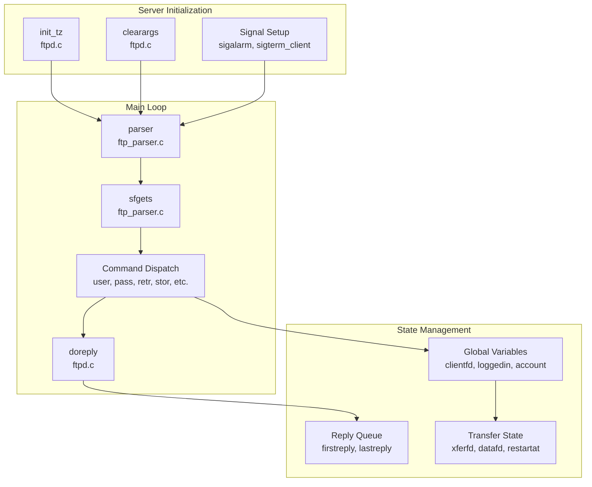

# Architecture Overview

> **Relevant source files**
> * [src/ftp_parser.c](https://github.com/jedisct1/pure-ftpd/blob/3818577a/src/ftp_parser.c)
> * [src/ftpd.c](https://github.com/jedisct1/pure-ftpd/blob/3818577a/src/ftpd.c)
> * [src/ftpd.h](https://github.com/jedisct1/pure-ftpd/blob/3818577a/src/ftpd.h)
> * [src/ftpd_p.h](https://github.com/jedisct1/pure-ftpd/blob/3818577a/src/ftpd_p.h)
> * [src/globals.h](https://github.com/jedisct1/pure-ftpd/blob/3818577a/src/globals.h)
> * [src/main.c](https://github.com/jedisct1/pure-ftpd/blob/3818577a/src/main.c)

This document provides a high-level view of Pure-FTPd's system architecture, focusing on the core server components, their interactions, and the main execution flow. It covers the primary modules, data structures, and control flow that form the foundation of the FTP server.

For detailed information about specific subsystems, see [Core Server Components](/jedisct1/pure-ftpd/2-core-server-components), [Security Features](/jedisct1/pure-ftpd/3-security-features), [Authentication and User Management](/jedisct1/pure-ftpd/4-authentication-and-user-management), and [Configuration and Administration](/jedisct1/pure-ftpd/5-configuration-and-administration).

## System Overview

Pure-FTPd is implemented as a modular FTP server with a clear separation between core protocol handling, authentication, security, and file operations. The architecture is designed around a main server process that handles FTP protocol commands while delegating specific responsibilities to specialized subsystems.

**Sources:** [src/main.c L1-L8](https://github.com/jedisct1/pure-ftpd/blob/3818577a/src/main.c#L1-L8)

 [src/ftpd.c L1-L50](https://github.com/jedisct1/pure-ftpd/blob/3818577a/src/ftpd.c#L1-L50)

 [src/ftp_parser.c L224-L824](https://github.com/jedisct1/pure-ftpd/blob/3818577a/src/ftp_parser.c#L224-L824)

 [src/globals.h L1-L201](https://github.com/jedisct1/pure-ftpd/blob/3818577a/src/globals.h#L1-L201)

## Core Server Process

The main server process is centered around the `pureftpd_start` function in `ftpd.c`, which initializes the server environment and enters the main command processing loop via the `parser()` function in `ftp_parser.c`.

**Sources:** [src/ftpd.c L165-L187](https://github.com/jedisct1/pure-ftpd/blob/3818577a/src/ftpd.c#L165-L187)

 [src/ftpd.c L435-L507](https://github.com/jedisct1/pure-ftpd/blob/3818577a/src/ftpd.c#L435-L507)

 [src/ftp_parser.c L224-L824](https://github.com/jedisct1/pure-ftpd/blob/3818577a/src/ftp_parser.c#L224-L824)

 [src/ftp_parser.c L70-L166](https://github.com/jedisct1/pure-ftpd/blob/3818577a/src/ftp_parser.c#L70-L166)

## Command Processing Architecture

The FTP command processing follows a well-defined pipeline from network input to response generation, with comprehensive command parsing and validation.

| Component | Function | File | Purpose |
| --- | --- | --- | --- |
| Input Reader | `sfgets()` | ftp_parser.c | Reads and buffers FTP commands from client |
| Command Parser | `parser()` | ftp_parser.c | Parses commands and dispatches to handlers |
| Reply System | `addreply()`, `doreply()` | ftpd.c | Manages response queue and output |
| State Manager | Global variables | globals.h | Tracks session state and configuration |

**Sources:** [src/ftp_parser.c L70-L166](https://github.com/jedisct1/pure-ftpd/blob/3818577a/src/ftp_parser.c#L70-L166)

 [src/ftp_parser.c L224-L824](https://github.com/jedisct1/pure-ftpd/blob/3818577a/src/ftp_parser.c#L224-L824)

 [src/ftpd.c L671-L768](https://github.com/jedisct1/pure-ftpd/blob/3818577a/src/ftpd.c#L671-L768)

 [src/globals.h L34-L40](https://github.com/jedisct1/pure-ftpd/blob/3818577a/src/globals.h#L34-L40)

## Authentication System Architecture

Pure-FTPd implements a flexible authentication architecture that supports multiple backends through a common interface defined in `ftpd_p.h`. The system uses an `Authentication` structure to abstract different authentication methods.

**Sources:** [src/ftpd_p.h L250-L287](https://github.com/jedisct1/pure-ftpd/blob/3818577a/src/ftpd_p.h#L250-L287)

 [src/ftpd.h L257-L285](https://github.com/jedisct1/pure-ftpd/blob/3818577a/src/ftpd.h#L257-L285)

 [src/ftpd.c L1269-L1394](https://github.com/jedisct1/pure-ftpd/blob/3818577a/src/ftpd.c#L1269-L1394)

## Data Transfer Architecture

Data transfers in Pure-FTPd use a separate data connection managed through file descriptors `datafd` and `xferfd`, with support for both active and passive modes.

**Sources:** [src/ftpd_p.h L297-L346](https://github.com/jedisct1/pure-ftpd/blob/3818577a/src/ftpd_p.h#L297-L346)

 [src/globals.h L28-L29](https://github.com/jedisct1/pure-ftpd/blob/3818577a/src/globals.h#L28-L29)

 [src/globals.h L97](https://github.com/jedisct1/pure-ftpd/blob/3818577a/src/globals.h#L97-L97)

 [src/globals.h L73](https://github.com/jedisct1/pure-ftpd/blob/3818577a/src/globals.h#L73-L73)

## Global State Management

The server maintains its state through global variables defined in `globals.h`, providing a centralized way to track session information, configuration, and transfer state.

| Category | Key Variables | Purpose |
| --- | --- | --- |
| Session State | `loggedin`, `account`, `guest` | User authentication and session status |
| Connection State | `clientfd`, `datafd`, `xferfd` | File descriptors for different connections |
| Transfer State | `uploaded`, `downloaded`, `restartat` | Data transfer tracking and resume support |
| Configuration | `idletime`, `maxusers`, `userchroot` | Server behavior and limits |
| Security State | `chrooted`, `tls_cnx`, `data_protection_level` | Security and encryption status |

**Sources:** [src/globals.h L12-L201](https://github.com/jedisct1/pure-ftpd/blob/3818577a/src/globals.h#L12-L201)

## Security Architecture Integration

Pure-FTPd integrates security features throughout its architecture, from TLS encryption to privilege separation and access controls.

**Sources:** [src/globals.h L174-L184](https://github.com/jedisct1/pure-ftpd/blob/3818577a/src/globals.h#L174-L184)

 [src/globals.h L42-L48](https://github.com/jedisct1/pure-ftpd/blob/3818577a/src/globals.h#L42-L48)

 [src/globals.h L57-L59](https://github.com/jedisct1/pure-ftpd/blob/3818577a/src/globals.h#L57-L59)

 [src/globals.h L110-L111](https://github.com/jedisct1/pure-ftpd/blob/3818577a/src/globals.h#L110-L111)

## Reply and Communication System

The server uses a sophisticated reply queuing system to manage responses to FTP clients, supporting multi-line replies and proper FTP protocol formatting.

**Sources:** [src/ftpd.c L671-L768](https://github.com/jedisct1/pure-ftpd/blob/3818577a/src/ftpd.c#L671-L768)

 [src/ftpd.c L305-L351](https://github.com/jedisct1/pure-ftpd/blob/3818577a/src/ftpd.c#L305-L351)

 [src/ftpd_p.h L57-L60](https://github.com/jedisct1/pure-ftpd/blob/3818577a/src/ftpd_p.h#L57-L60)

 [src/ftpd_p.h L361-L362](https://github.com/jedisct1/pure-ftpd/blob/3818577a/src/ftpd_p.h#L361-L362)