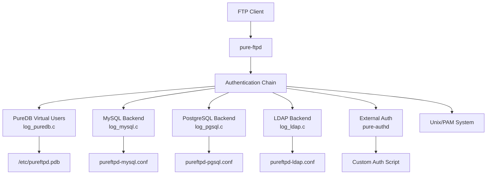
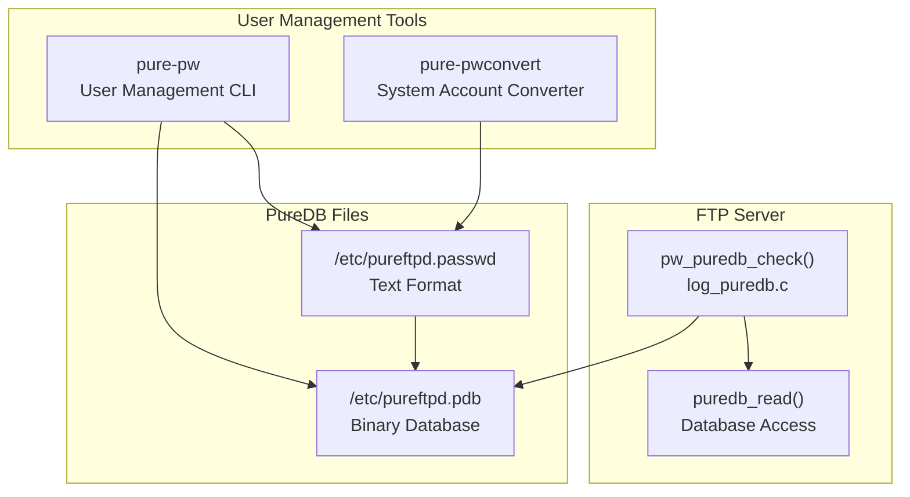
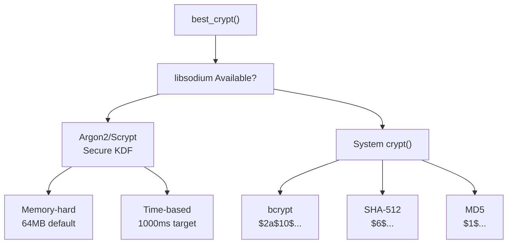
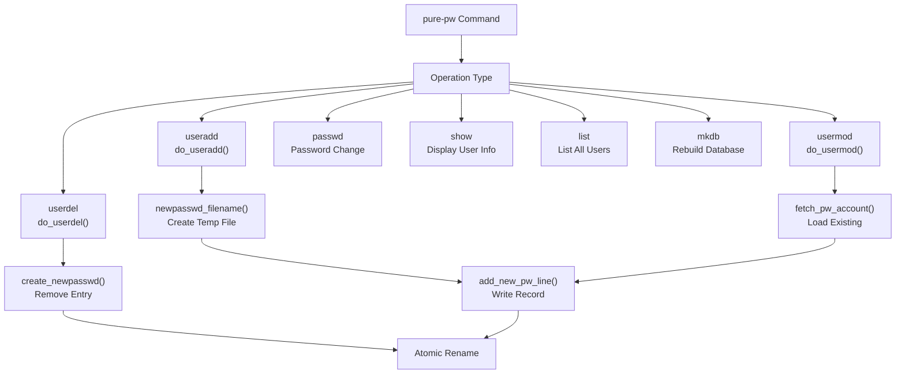
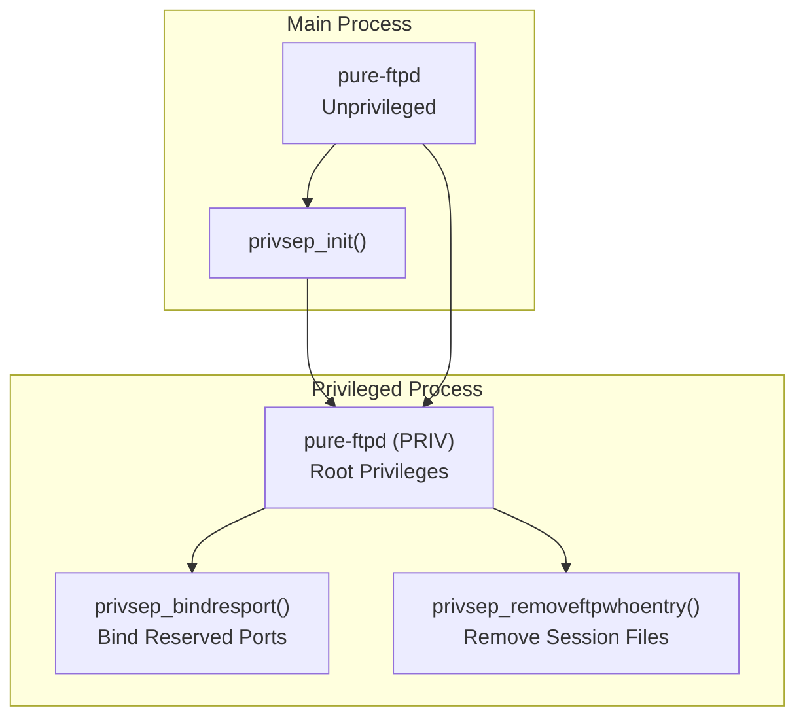
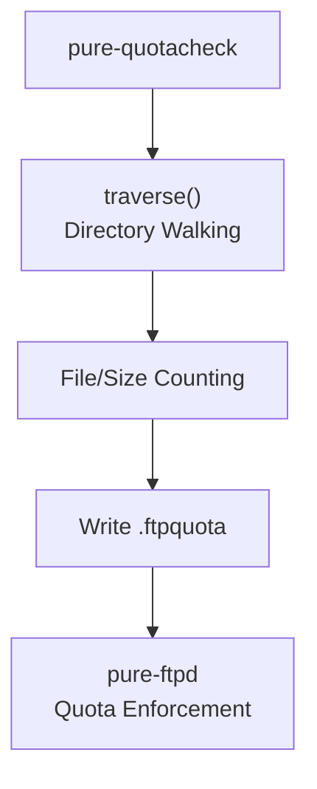

# Authentication and User Management

> **Relevant source files**
> * [FAQ](https://github.com/jedisct1/pure-ftpd/blob/3818577a/FAQ)
> * [README.TLS](https://github.com/jedisct1/pure-ftpd/blob/3818577a/README.TLS)
> * [README.Virtual-Users](https://github.com/jedisct1/pure-ftpd/blob/3818577a/README.Virtual-Users)
> * [src/altlog.c](https://github.com/jedisct1/pure-ftpd/blob/3818577a/src/altlog.c)
> * [src/log_puredb.c](https://github.com/jedisct1/pure-ftpd/blob/3818577a/src/log_puredb.c)
> * [src/privsep.c](https://github.com/jedisct1/pure-ftpd/blob/3818577a/src/privsep.c)
> * [src/privsep_p.h](https://github.com/jedisct1/pure-ftpd/blob/3818577a/src/privsep_p.h)
> * [src/pure-pw.c](https://github.com/jedisct1/pure-ftpd/blob/3818577a/src/pure-pw.c)
> * [src/pure-quotacheck.c](https://github.com/jedisct1/pure-ftpd/blob/3818577a/src/pure-quotacheck.c)
> * [src/upload-pipe.c](https://github.com/jedisct1/pure-ftpd/blob/3818577a/src/upload-pipe.c)

Pure-FTPd provides a comprehensive authentication and user management system supporting multiple authentication methods, virtual users, and granular access controls. This document covers the authentication architecture, virtual user management, and related security features.

For information about TLS/SSL encryption and certificate management, see [TLS/SSL Encryption](/jedisct1/pure-ftpd/3.1-tlsssl-encryption). For details about quota enforcement and disk usage limits, see [Quota Management](/jedisct1/pure-ftpd/6.2-quota-management).

## Authentication Architecture

Pure-FTPd supports multiple authentication backends that can be used individually or in combination. The authentication system is designed with modularity in mind, allowing administrators to choose the most appropriate method for their environment.



The authentication process follows a chain-of-responsibility pattern where each backend is tried in sequence until a match is found. The server processes authentication through the `pw_puredb_check` function and related backend-specific functions.

Sources: [src/log_puredb.c L369-L400](https://github.com/jedisct1/pure-ftpd/blob/3818577a/src/log_puredb.c#L369-L400)

 [README.Virtual-Users L1-L50](https://github.com/jedisct1/pure-ftpd/blob/3818577a/README.Virtual-Users#L1-L50)

 architectural diagrams from context

## Virtual Users with PureDB

The PureDB system is Pure-FTPd's primary virtual user management mechanism, providing a fast, indexed database for user credentials and configuration.

### PureDB Architecture



Sources: [src/pure-pw.c L1-L50](https://github.com/jedisct1/pure-ftpd/blob/3818577a/src/pure-pw.c#L1-L50)

 [src/log_puredb.c L369-L400](https://github.com/jedisct1/pure-ftpd/blob/3818577a/src/log_puredb.c#L369-L400)

 [README.Virtual-Users L220-L265](https://github.com/jedisct1/pure-ftpd/blob/3818577a/README.Virtual-Users#L220-L265)

### Virtual User Record Format

Virtual users are stored with comprehensive metadata including authentication, authorization, and resource limits:

| Field | Description | Example |
| --- | --- | --- |
| Account | Username | `joe` |
| Password | Hashed password | `$7$C6..../....` |
| UID/GID | System user/group IDs | `500:101` |
| Home Directory | Chroot path | `/home/ftpusers/joe/./` |
| Bandwidth Limits | Upload/download throttling | `1000:2000` (KB/s) |
| Quotas | File count and size limits | `1000:10485760` |
| IP Restrictions | Allow/deny patterns | `192.168.1.0/24` |
| Time Restrictions | Access time windows | `0900-1800` |
| Concurrent Sessions | Max simultaneous connections | `5` |

The `parse_pw_line` function in `pure-pw.c` handles parsing these records from the text format.

Sources: [src/pure-pw.c L405-L537](https://github.com/jedisct1/pure-ftpd/blob/3818577a/src/pure-pw.c#L405-L537)

 [README.Virtual-Users L44-L58](https://github.com/jedisct1/pure-ftpd/blob/3818577a/README.Virtual-Users#L44-L58)

### Password Hashing

Pure-FTPd uses the strongest available password hashing algorithm, determined by the `best_crypt` function:



The hashing process includes memory and time-based parameters to resist brute-force attacks. The `DEFAULT_TOTAL_AUTH_MEMORY` and `DEFAULT_AUTH_TIME_MS` constants control resource usage.

Sources: [src/pure-pw.c L269-L374](https://github.com/jedisct1/pure-ftpd/blob/3818577a/src/pure-pw.c#L269-L374)

 [README.Virtual-Users L113-L124](https://github.com/jedisct1/pure-ftpd/blob/3818577a/README.Virtual-Users#L113-L124)

## User Management Operations

### Creating and Modifying Users

The `pure-pw` command provides comprehensive user management functionality:



All operations use atomic file replacement to ensure consistency. The `create_newpasswd` function creates a temporary file that's atomically renamed on success.

Sources: [src/pure-pw.c L845-L927](https://github.com/jedisct1/pure-ftpd/blob/3818577a/src/pure-pw.c#L845-L927)

 [src/pure-pw.c L929-L1087](https://github.com/jedisct1/pure-ftpd/blob/3818577a/src/pure-pw.c#L929-L1087)

 [src/pure-pw.c L1089-L1133](https://github.com/jedisct1/pure-ftpd/blob/3818577a/src/pure-pw.c#L1089-L1133)

### Database Compilation

The PureDB compilation process converts text records to an indexed binary format:

| Step | Function | Purpose |
| --- | --- | --- |
| 1. Parse | `parse_pw_line()` | Validate and parse text records |
| 2. Index | `puredb_write()` | Create binary database with indexes |
| 3. Commit | Atomic rename | Replace active database |

The `-m` flag automatically rebuilds the database after modifications, ensuring changes take effect immediately.

Sources: [README.Virtual-Users L240-L265](https://github.com/jedisct1/pure-ftpd/blob/3818577a/README.Virtual-Users#L240-L265)

 [src/pure-pw.c L240-L260](https://github.com/jedisct1/pure-ftpd/blob/3818577a/src/pure-pw.c#L240-L260)

## Authentication Process

### PureDB Authentication Flow

```mermaid
sequenceDiagram
  participant Client
  participant pure-ftpd
  participant pw_puredb_check()
  participant PureDB File
  participant pw_puredb_parseline()

  Client->>pure-ftpd: LOGIN user/pass
  pure-ftpd->>pw_puredb_check(): Check credentials
  pw_puredb_check()->>PureDB File: puredb_find_s(account)
  PureDB File-->>pw_puredb_check(): Record found
  pw_puredb_check()->>pw_puredb_parseline(): Validate password & restrictions
  pw_puredb_parseline()->>pw_puredb_parseline(): Password verification
  pw_puredb_parseline()->>pw_puredb_parseline(): IP access check
  pw_puredb_parseline()->>pw_puredb_parseline(): Time restrictions
  pw_puredb_parseline()-->>pw_puredb_check(): Authentication result
  pw_puredb_check()-->>pure-ftpd: AuthResult struct
  pure-ftpd-->>Client: Login success/failure
```

The authentication process includes multiple validation steps including password verification, IP restrictions, and time-based access controls implemented in `pw_puredb_parseline`.

Sources: [src/log_puredb.c L215-L367](https://github.com/jedisct1/pure-ftpd/blob/3818577a/src/log_puredb.c#L215-L367)

 [src/log_puredb.c L369-L400](https://github.com/jedisct1/pure-ftpd/blob/3818577a/src/log_puredb.c#L369-L400)

### Access Control Validation

The authentication system enforces several types of access controls:

| Control Type | Function | Description |
| --- | --- | --- |
| IP Access | `access_ip_check()` | Allow/deny IP patterns |
| Time Restrictions | `time_restrictions_check()` | Time window validation |
| Password Verification | `crypto_pwhash_str_verify()` | Secure password checking |
| UID/GID Validation | Root user checks | Prevent root virtual users |

Sources: [src/log_puredb.c L160-L185](https://github.com/jedisct1/pure-ftpd/blob/3818577a/src/log_puredb.c#L160-L185)

 [src/log_puredb.c L187-L213](https://github.com/jedisct1/pure-ftpd/blob/3818577a/src/log_puredb.c#L187-L213)

 [src/log_puredb.c L231-L248](https://github.com/jedisct1/pure-ftpd/blob/3818577a/src/log_puredb.c#L231-L248)

## Security and Privilege Management

### Privilege Separation

Pure-FTPd implements privilege separation to minimize security risks:



The privileged process runs with minimal functionality, handling only operations that require elevated privileges. Communication occurs through Unix domain sockets using the `privsep_sendcmd` and `privsep_recvcmd` functions.

Sources: [src/privsep.c L335-L364](https://github.com/jedisct1/pure-ftpd/blob/3818577a/src/privsep.c#L335-L364)

 [src/privsep.c L234-L245](https://github.com/jedisct1/pure-ftpd/blob/3818577a/src/privsep.c#L234-L245)

 [src/privsep_p.h L18-L76](https://github.com/jedisct1/pure-ftpd/blob/3818577a/src/privsep_p.h#L18-L76)

### User Isolation

Virtual users are isolated from system users through several mechanisms:

* **UID/GID Mapping**: Virtual users map to dedicated system accounts
* **Chroot Jails**: Users are confined to their home directories
* **Resource Limits**: Bandwidth, quota, and connection limits
* **IP Restrictions**: Network-based access controls

The `/./` marker in home directories indicates chroot confinement, processed during user authentication.

Sources: [README.Virtual-Users L218-L219](https://github.com/jedisct1/pure-ftpd/blob/3818577a/README.Virtual-Users#L218-L219)

 [FAQ L40-L84](https://github.com/jedisct1/pure-ftpd/blob/3818577a/FAQ#L40-L84)

 [src/log_puredb.c L266-L271](https://github.com/jedisct1/pure-ftpd/blob/3818577a/src/log_puredb.c#L266-L271)

## Administrative Tools

### Quota Management

The `pure-quotacheck` utility provides disk usage accounting:



Quota checking uses safe directory traversal with loop detection to prevent symbolic link attacks. The `nodes` array tracks visited inodes to prevent infinite loops.

Sources: [src/pure-quotacheck.c L68-L166](https://github.com/jedisct1/pure-ftpd/blob/3818577a/src/pure-quotacheck.c#L68-L166)

 [src/pure-quotacheck.c L221-L270](https://github.com/jedisct1/pure-ftpd/blob/3818577a/src/pure-quotacheck.c#L221-L270)

### Environment Variables

Administrative tools support environment variables for configuration:

| Variable | Purpose | Default |
| --- | --- | --- |
| `PURE_PASSWDFILE` | Text password file path | `/etc/pureftpd.passwd` |
| `PURE_DBFILE` | Binary database path | `/etc/pureftpd.pdb` |

Sources: [README.Virtual-Users L307-L318](https://github.com/jedisct1/pure-ftpd/blob/3818577a/README.Virtual-Users#L307-L318)

This authentication and user management system provides enterprise-grade security and flexibility while maintaining simplicity for administrators. The modular design allows deployment in various environments from small installations to large hosting providers.