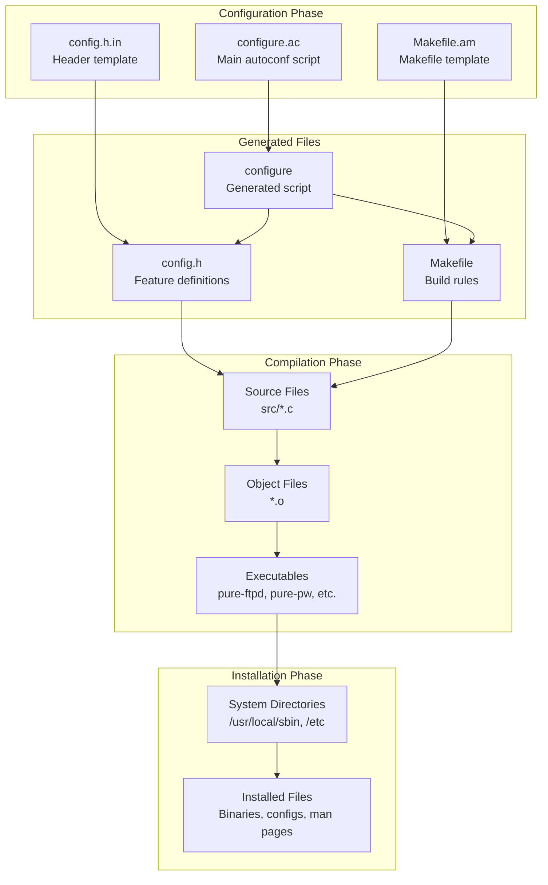
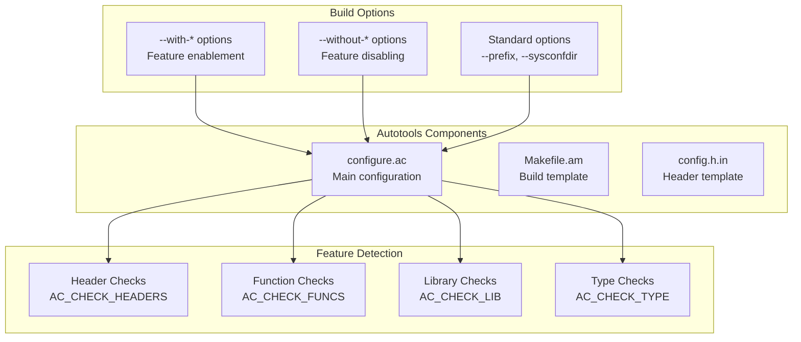
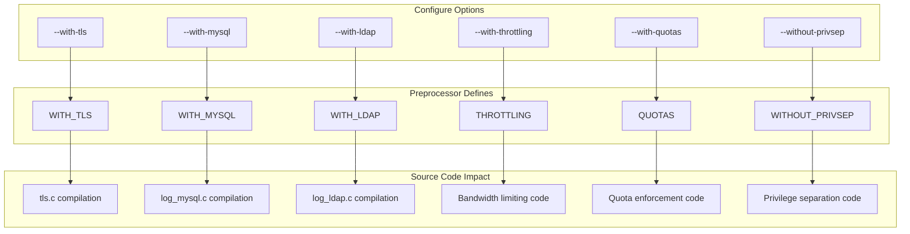
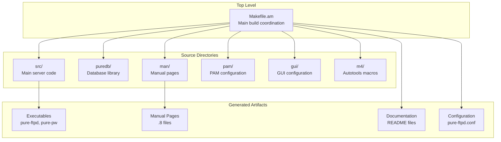

# Build System and Compilation

> **Relevant source files**
> * [Makefile.am](https://github.com/jedisct1/pure-ftpd/blob/3818577a/Makefile.am)
> * [README](https://github.com/jedisct1/pure-ftpd/blob/3818577a/README)
> * [configure.ac](https://github.com/jedisct1/pure-ftpd/blob/3818577a/configure.ac)
> * [src/getloadavg.c](https://github.com/jedisct1/pure-ftpd/blob/3818577a/src/getloadavg.c)

This document covers Pure-FTPd's build system architecture, configuration options, and compilation process. It explains how to configure, compile, and install Pure-FTPd with various feature combinations and platform-specific requirements.

For runtime configuration options and administrative tools, see [Runtime Configuration](/jedisct1/pure-ftpd/5.2-runtime-configuration) and [Administrative Utilities](/jedisct1/pure-ftpd/5.3-administrative-utilities).

## Build System Architecture

Pure-FTPd uses the GNU Autotools build system, consisting of autoconf for configuration detection and automake for makefile generation. The build process follows the standard `configure`, `make`, `install` pattern with extensive customization options.

### Build Process Flow



Sources: [configure.ac L1-L1420](https://github.com/jedisct1/pure-ftpd/blob/3818577a/configure.ac#L1-L1420)

 [Makefile.am L1-L67](https://github.com/jedisct1/pure-ftpd/blob/3818577a/Makefile.am#L1-L67)

 [README L37-L92](https://github.com/jedisct1/pure-ftpd/blob/3818577a/README#L37-L92)

## Configuration Phase

The configuration phase detects system capabilities, validates dependencies, and generates build files based on user-specified options.

### Core Configuration Components



Sources: [configure.ac L118-L148](https://github.com/jedisct1/pure-ftpd/blob/3818577a/configure.ac#L118-L148)

 [configure.ac L283-L947](https://github.com/jedisct1/pure-ftpd/blob/3818577a/configure.ac#L283-L947)

### Essential Configuration Options

The configure script accepts numerous options that control compilation features:

| Category | Option | Purpose |
| --- | --- | --- |
| **Authentication** | `--with-mysql` | MySQL database authentication |
|  | `--with-pgsql` | PostgreSQL database authentication |
|  | `--with-ldap` | LDAP directory authentication |
|  | `--with-pam` | PAM authentication support |
|  | `--with-puredb` | Virtual users with PureDB |
| **Security** | `--with-tls` | TLS/SSL encryption support |
|  | `--without-privsep` | Disable privilege separation |
|  | `--with-capabilities` | Linux capabilities support |
| **Features** | `--with-everything` | Enable most features |
|  | `--with-minimal` | Minimal build for embedded systems |
|  | `--with-throttling` | Bandwidth throttling |
|  | `--with-quotas` | Virtual quota support |

Sources: [configure.ac L305-L890](https://github.com/jedisct1/pure-ftpd/blob/3818577a/configure.ac#L305-L890)

 [README L102-L291](https://github.com/jedisct1/pure-ftpd/blob/3818577a/README#L102-L291)

## Compilation Flags and Security

Pure-FTPd applies extensive security-focused compilation flags automatically detected during configuration:

### Security Compilation Features

```mermaid
flowchart TD

WALL["-Wall<br>Basic warnings"]
WEXTRA["-Wextra<br>Extra warnings"]
WFORMAT["-Wformat=2<br>Format string warnings"]
WSTRICT["-Wstrict-prototypes<br>Prototype warnings"]
RELRO["-Wl,-z,relro<br>Read-only relocations"]
NOW["-Wl,-z,now<br>Immediate binding"]
NOEXEC["-Wl,-z,noexecstack<br>Non-executable stack"]
PIC["-fPIC<br>Position Independent Code"]
PIE["-fPIE<br>Position Independent Executable"]
STACK_PROT["-fstack-protector-all<br>Stack Protection"]
FORTIFY["_FORTIFY_SOURCE=2<br>Buffer Overflow Protection"]

subgraph subGraph2 ["Warning Flags"]
    WALL
    WEXTRA
    WFORMAT
    WSTRICT
    WALL --> WEXTRA
    WEXTRA --> WFORMAT
    WFORMAT --> WSTRICT
end

subgraph subGraph1 ["Linker Security Flags"]
    RELRO
    NOW
    NOEXEC
    RELRO --> NOW
    NOW --> NOEXEC
end

subgraph subGraph0 ["Compiler Security Flags"]
    PIC
    PIE
    STACK_PROT
    FORTIFY
    PIC --> PIE
    PIE --> STACK_PROT
    STACK_PROT --> FORTIFY
end
```



Sources: [configure.ac L27-L98](https://github.com/jedisct1/pure-ftpd/blob/3818577a/configure.ac#L27-L98)

 [configure.ac L66-L95](https://github.com/jedisct1/pure-ftpd/blob/3818577a/configure.ac#L66-L95)

## Feature Configuration System

Pure-FTPd's modular architecture allows selective compilation of features through preprocessor definitions:

### Feature Enable/Disable Mapping



Sources: [configure.ac L456-L460](https://github.com/jedisct1/pure-ftpd/blob/3818577a/configure.ac#L456-L460)

 [configure.ac L1303-L1317](https://github.com/jedisct1/pure-ftpd/blob/3818577a/configure.ac#L1303-L1317)

 [configure.ac L1232-L1268](https://github.com/jedisct1/pure-ftpd/blob/3818577a/configure.ac#L1232-L1268)

## Platform Detection and Adaptation

The build system performs extensive platform detection to adapt compilation for different operating systems:

### Platform-Specific Adaptations

The configure script detects various system characteristics and adjusts compilation accordingly:

* **Operating System Detection**: Uses `uname -s` to identify Linux, FreeBSD, Darwin, etc.
* **Library Path Detection**: Searches common library locations including Homebrew paths on macOS
* **System Call Availability**: Tests for `sendfile`, `statvfs64`, and other OS-specific functions
* **Network Stack Features**: Detects IPv6 support, socket options, and address structures

Sources: [configure.ac L45-L64](https://github.com/jedisct1/pure-ftpd/blob/3818577a/configure.ac#L45-L64)

 [configure.ac L100-L114](https://github.com/jedisct1/pure-ftpd/blob/3818577a/configure.ac#L100-L114)

 [configure.ac L631-L767](https://github.com/jedisct1/pure-ftpd/blob/3818577a/configure.ac#L631-L767)

## Makefile Structure

The project uses a hierarchical makefile structure managed by automake:

### Build Directory Structure



Sources: [Makefile.am L40-L46](https://github.com/jedisct1/pure-ftpd/blob/3818577a/Makefile.am#L40-L46)

 [Makefile.am L2-L16](https://github.com/jedisct1/pure-ftpd/blob/3818577a/Makefile.am#L2-L16)

## Installation Process

The installation process copies built artifacts to their target system locations with proper permissions and configuration handling:

### Installation Targets and Locations

| Component | Source | Default Target | Purpose |
| --- | --- | --- | --- |
| **Main Server** | `src/pure-ftpd` | `/usr/local/sbin/pure-ftpd` | FTP server daemon |
| **User Tools** | `src/pure-pw` | `/usr/local/bin/pure-pw` | Virtual user management |
| **Admin Tools** | `src/pure-ftpwho` | `/usr/local/bin/pure-ftpwho` | Session monitoring |
| **Configuration** | `pure-ftpd.conf` | `/etc/pure-ftpd.conf` | Server configuration |
| **Manual Pages** | `man/*.8` | `/usr/local/man/man8/` | Documentation |

The installation process includes intelligent configuration file handling that preserves existing configurations while updating examples.

Sources: [Makefile.am L48-L66](https://github.com/jedisct1/pure-ftpd/blob/3818577a/Makefile.am#L48-L66)

 [README L68-L92](https://github.com/jedisct1/pure-ftpd/blob/3818577a/README#L68-L92)

## Conditional Compilation Examples

Pure-FTPd uses conditional compilation extensively to include or exclude features based on configuration:

### Conditional Feature Inclusion

The build system uses preprocessor directives to conditionally compile features. For example, the `getloadavg` function has a fallback implementation:

```python
#ifndef HAVE_GETLOADAVG
int getloadavg(double loadavg[], int nelem) {
    // Fallback implementation
}
#endif
```

This pattern is used throughout the codebase for platform-specific code, optional features, and library dependencies.

Sources: [src/getloadavg.c L5-L21](https://github.com/jedisct1/pure-ftpd/blob/3818577a/src/getloadavg.c#L5-L21)

 [configure.ac L963](https://github.com/jedisct1/pure-ftpd/blob/3818577a/configure.ac#L963-L963)

## Build Troubleshooting

Common build issues and their solutions:

* **Missing Dependencies**: Configure fails if required libraries (OpenSSL for TLS, database client libraries) are not found
* **Permission Issues**: Installation requires appropriate privileges for system directories
* **Platform Compatibility**: Some features may not be available on all platforms (capabilities on non-Linux systems)
* **Configuration Conflicts**: Certain options are mutually exclusive (standalone vs inetd-only builds)

The configure script provides detailed error messages and suggests solutions for most common problems.

Sources: [configure.ac L319-L321](https://github.com/jedisct1/pure-ftpd/blob/3818577a/configure.ac#L319-L321)

 [configure.ac L1310-L1317](https://github.com/jedisct1/pure-ftpd/blob/3818577a/configure.ac#L1310-L1317)

 [README L40-L46](https://github.com/jedisct1/pure-ftpd/blob/3818577a/README#L40-L46)