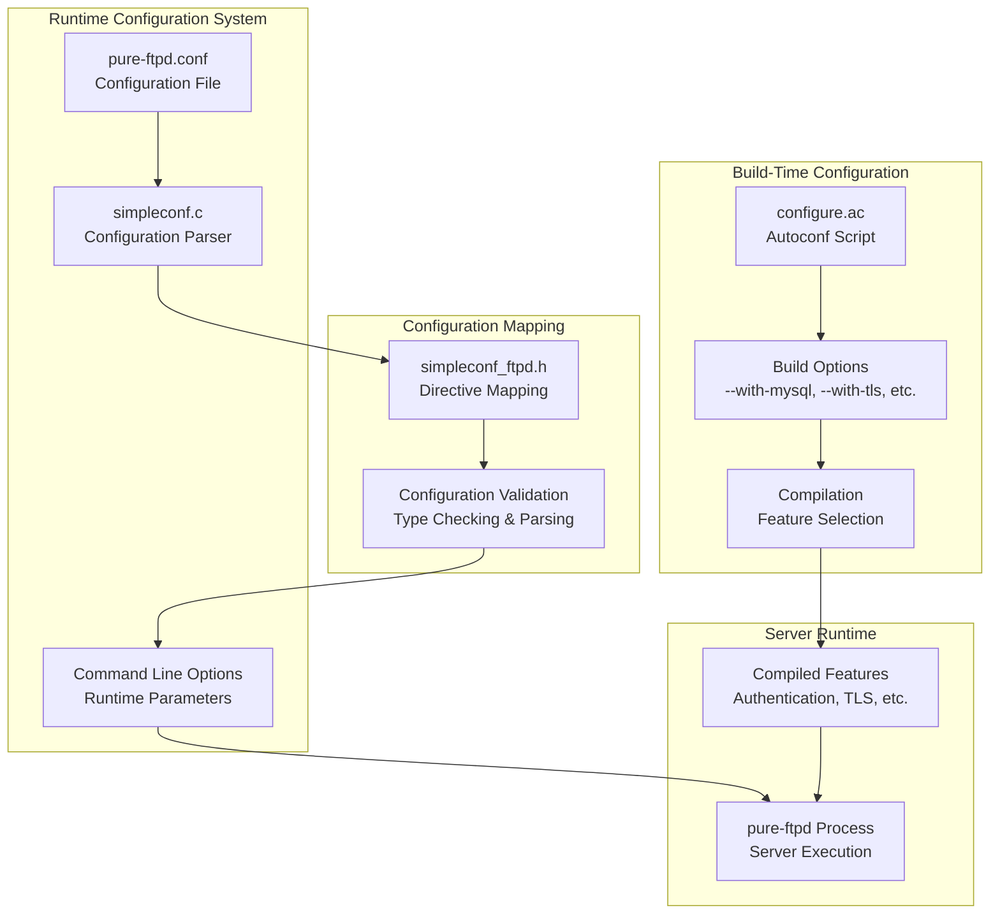
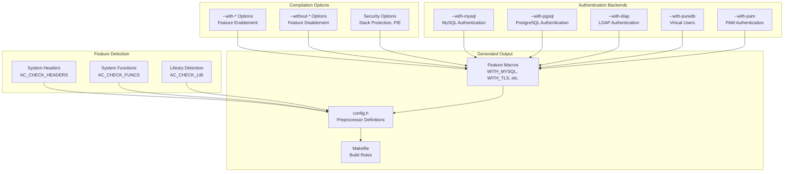
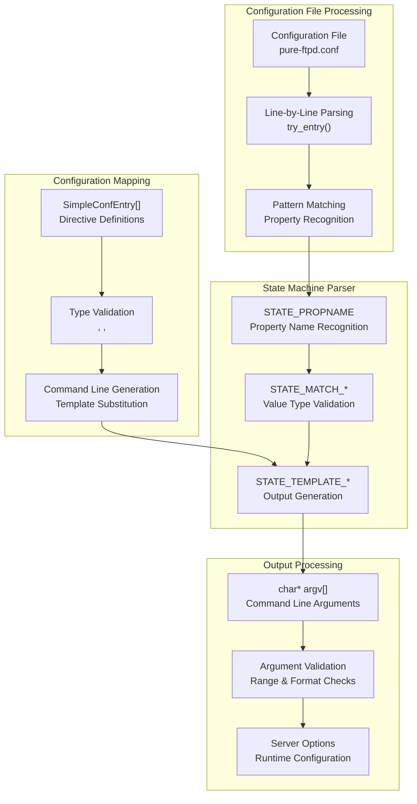
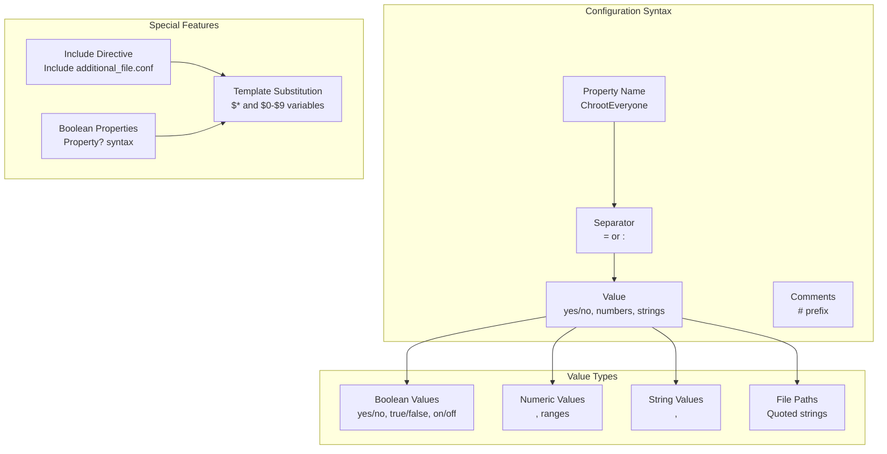
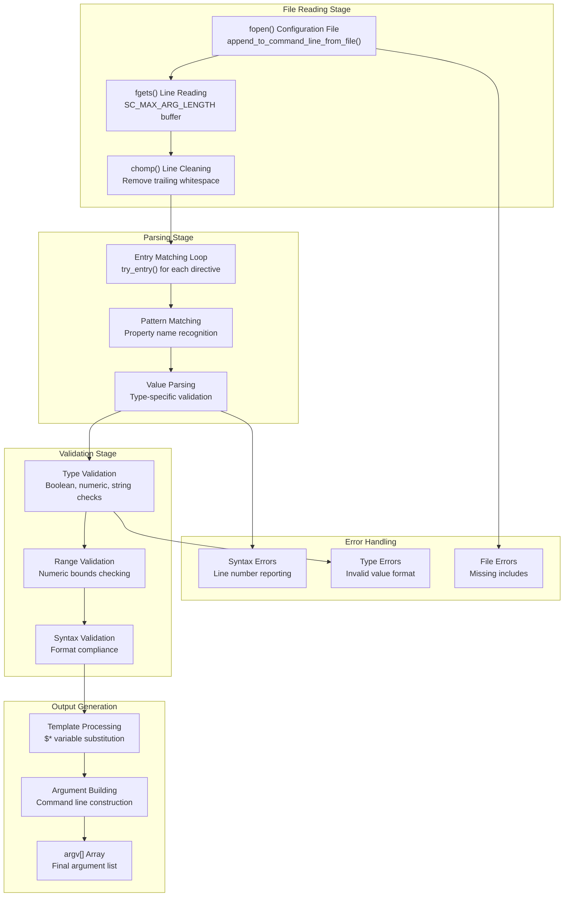
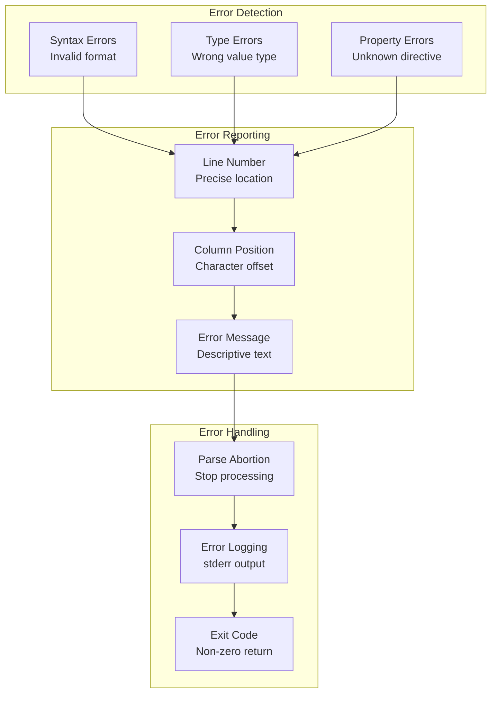

# Configuration and Administration

> **Relevant source files**
> * [README](https://github.com/jedisct1/pure-ftpd/blob/3818577a/README)
> * [configure.ac](https://github.com/jedisct1/pure-ftpd/blob/3818577a/configure.ac)
> * [pure-ftpd.conf.in](https://github.com/jedisct1/pure-ftpd/blob/3818577a/pure-ftpd.conf.in)
> * [src/simpleconf.c](https://github.com/jedisct1/pure-ftpd/blob/3818577a/src/simpleconf.c)
> * [src/simpleconf.h](https://github.com/jedisct1/pure-ftpd/blob/3818577a/src/simpleconf.h)
> * [src/simpleconf_ftpd.h](https://github.com/jedisct1/pure-ftpd/blob/3818577a/src/simpleconf_ftpd.h)

This document covers Pure-FTPd's comprehensive configuration system and administrative tools. Pure-FTPd provides multiple layers of configuration: build-time compilation options, runtime configuration files, and command-line parameters. The system uses a flexible configuration parser that supports various authentication backends, security features, and operational settings.

For information about specific authentication methods, see [Authentication and User Management](/jedisct1/pure-ftpd/4-authentication-and-user-management). For details about helper utilities and monitoring tools, see [Administrative Utilities](/jedisct1/pure-ftpd/5.3-administrative-utilities).

## Configuration Architecture Overview

Pure-FTPd employs a multi-layered configuration architecture that separates build-time feature selection from runtime operational settings:

**Sources:** [configure.ac L1-L1500](https://github.com/jedisct1/pure-ftpd/blob/3818577a/configure.ac#L1-L1500)

 [src/simpleconf.c L1-L743](https://github.com/jedisct1/pure-ftpd/blob/3818577a/src/simpleconf.c#L1-L743)

 [src/simpleconf_ftpd.h L1-L125](https://github.com/jedisct1/pure-ftpd/blob/3818577a/src/simpleconf_ftpd.h#L1-L125)

 [pure-ftpd.conf.in L1-L468](https://github.com/jedisct1/pure-ftpd/blob/3818577a/pure-ftpd.conf.in#L1-L468)

## Build System Configuration

### Autoconf Build System

The primary build configuration is handled through GNU Autoconf via the `configure.ac` script. This system performs feature detection, dependency checking, and compilation option processing:

**Sources:** [configure.ac L1-L100](https://github.com/jedisct1/pure-ftpd/blob/3818577a/configure.ac#L1-L100)

 [configure.ac L283-L436](https://github.com/jedisct1/pure-ftpd/blob/3818577a/configure.ac#L283-L436)

 [configure.ac L1207-L1500](https://github.com/jedisct1/pure-ftpd/blob/3818577a/configure.ac#L1207-L1500)

### Key Build-Time Options

The build system supports extensive customization through configure options:

| Option Category | Key Options | Purpose |
| --- | --- | --- |
| Authentication | `--with-mysql`, `--with-pgsql`, `--with-ldap` | Enable database authentication backends |
| Security | `--with-tls`, `--with-privsep` | SSL/TLS support and privilege separation |
| Virtual Users | `--with-puredb`, `--with-extauth` | Virtual user authentication systems |
| Features | `--with-quotas`, `--with-throttling`, `--with-ratios` | Quota management and bandwidth control |
| Logging | `--with-altlog`, `--with-ftpwho` | Alternative logging formats and monitoring |
| Minimal Build | `--with-minimal`, `--without-*` | Reduced feature set for embedded systems |

**Sources:** [configure.ac L305-L436](https://github.com/jedisct1/pure-ftpd/blob/3818577a/configure.ac#L305-L436)

 [README L102-L360](https://github.com/jedisct1/pure-ftpd/blob/3818577a/README#L102-L360)

## Runtime Configuration System

### SimpleConf Configuration Parser

Pure-FTPd uses a custom configuration parser called SimpleConf that provides flexible configuration file processing with type validation and template substitution:

**Sources:** [src/simpleconf.c L115-L542](https://github.com/jedisct1/pure-ftpd/blob/3818577a/src/simpleconf.c#L115-L542)

 [src/simpleconf.c L577-L742](https://github.com/jedisct1/pure-ftpd/blob/3818577a/src/simpleconf.c#L577-L742)

### Configuration File Format

The configuration file uses a simple key-value format with type validation and boolean support:

**Sources:** [src/simpleconf.c L172-L443](https://github.com/jedisct1/pure-ftpd/blob/3818577a/src/simpleconf.c#L172-L443)

 [src/simpleconf_ftpd.h L6-L122](https://github.com/jedisct1/pure-ftpd/blob/3818577a/src/simpleconf_ftpd.h#L6-L122)

 [pure-ftpd.conf.in L18-L468](https://github.com/jedisct1/pure-ftpd/blob/3818577a/pure-ftpd.conf.in#L18-L468)

## Configuration Directive Mapping

The `simpleconf_ftpd.h` file defines the mapping between configuration file directives and command-line options:

### Authentication Configuration Mapping

| Configuration Directive | Command Line Option | Compilation Requirement |
| --- | --- | --- |
| `MySQLConfigFile <path>` | `--login=mysql:<path>` | `WITH_MYSQL` |
| `PGSQLConfigFile <path>` | `--login=pgsql:<path>` | `WITH_PGSQL` |
| `LDAPConfigFile <path>` | `--login=ldap:<path>` | `WITH_LDAP` |
| `PureDB <path>` | `--login=puredb:<path>` | `WITH_PUREDB` |
| `PAMAuthentication <bool>` | `--login=pam` | `USE_PAM` |
| `ExtAuth <path>` | `--login=extauth:<path>` | `WITH_EXTAUTH` |

### Security and Access Control Mapping

| Configuration Directive | Command Line Option | Purpose |
| --- | --- | --- |
| `ChrootEveryone <bool>` | `--chrooteveryone` | Chroot all users |
| `TLS <digits>` | `--tls=<level>` | TLS security level |
| `TrustedGID <digits>` | `--trustedgid=<gid>` | Trusted group ID |
| `MinUID <digits>` | `--minuid=<uid>` | Minimum user ID |
| `MaxClientsNumber <digits>` | `--maxclientsnumber=<num>` | Connection limits |

**Sources:** [src/simpleconf_ftpd.h L56-L73](https://github.com/jedisct1/pure-ftpd/blob/3818577a/src/simpleconf_ftpd.h#L56-L73)

 [src/simpleconf_ftpd.h L36-L108](https://github.com/jedisct1/pure-ftpd/blob/3818577a/src/simpleconf_ftpd.h#L36-L108)

## Configuration File Processing Flow

The configuration system processes files through multiple stages with error handling and validation:

**Sources:** [src/simpleconf.c L577-L712](https://github.com/jedisct1/pure-ftpd/blob/3818577a/src/simpleconf.c#L577-L712)

 [src/simpleconf.c L606-L637](https://github.com/jedisct1/pure-ftpd/blob/3818577a/src/simpleconf.c#L606-L637)

 [src/simpleconf.c L696-L707](https://github.com/jedisct1/pure-ftpd/blob/3818577a/src/simpleconf.c#L696-L707)

## Administrative Configuration Patterns

### Multi-Level Configuration Hierarchy

Pure-FTPd implements a hierarchical configuration system where settings can be specified at different levels with appropriate precedence:

| Configuration Level | Source | Precedence | Purpose |
| --- | --- | --- | --- |
| Compile-time | `configure` options | Lowest | Feature availability |
| Configuration file | `pure-ftpd.conf` | Medium | Default settings |
| Command line | Runtime arguments | Highest | Override settings |
| Include files | Additional `.conf` files | Variable | Modular configuration |

### Configuration Validation and Error Reporting

The SimpleConf parser provides comprehensive error reporting with line-number precision:

**Sources:** [src/simpleconf.c L624-L638](https://github.com/jedisct1/pure-ftpd/blob/3818577a/src/simpleconf.c#L624-L638)

 [src/simpleconf.c L696-L707](https://github.com/jedisct1/pure-ftpd/blob/3818577a/src/simpleconf.c#L696-L707)

This configuration and administration system provides Pure-FTPd with flexible, type-safe configuration management that supports complex deployment scenarios while maintaining ease of use for basic setups.