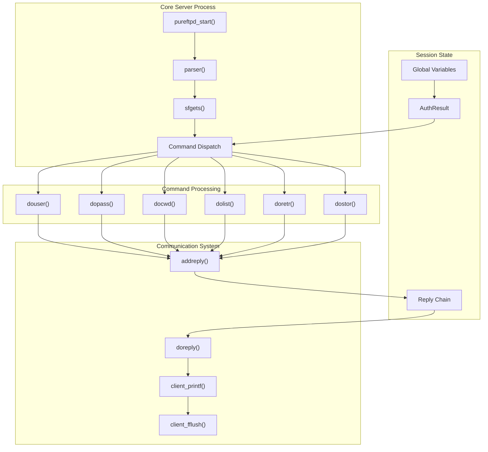
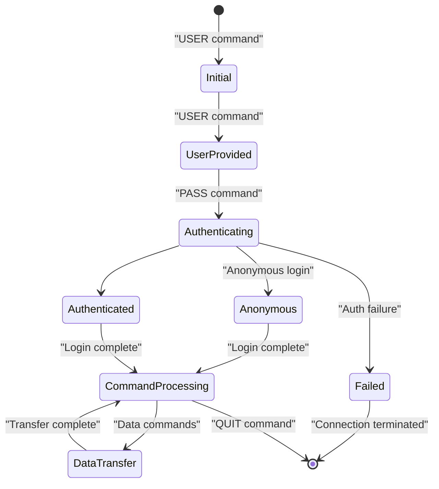
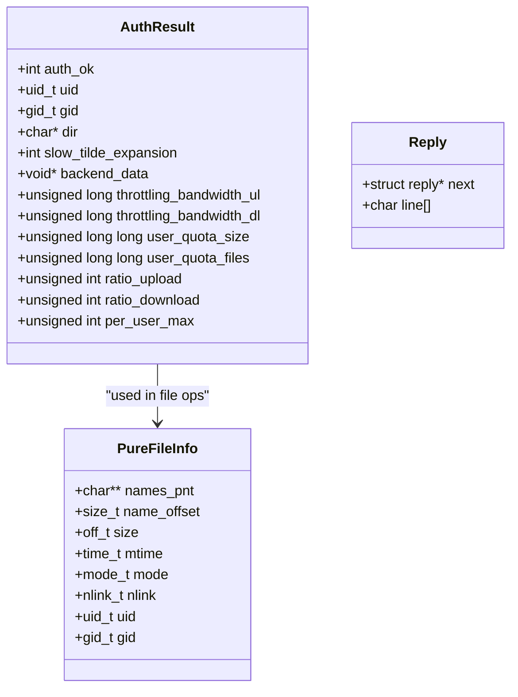
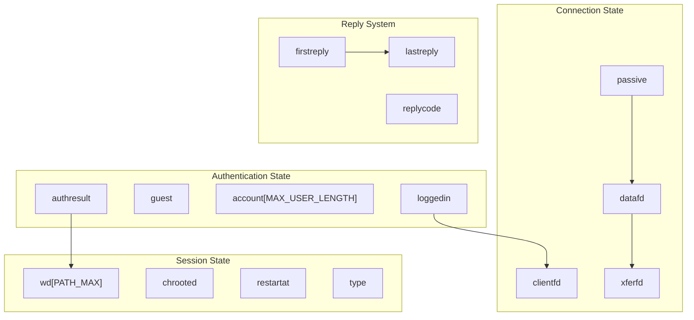
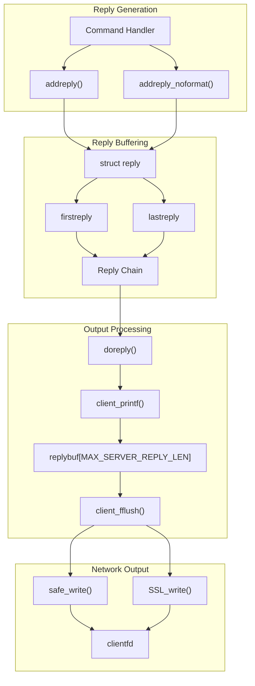

# Core Server Components

> **Relevant source files**
> * [src/ftp_parser.c](https://github.com/jedisct1/pure-ftpd/blob/3818577a/src/ftp_parser.c)
> * [src/ftpd.c](https://github.com/jedisct1/pure-ftpd/blob/3818577a/src/ftpd.c)
> * [src/ftpd.h](https://github.com/jedisct1/pure-ftpd/blob/3818577a/src/ftpd.h)

This document covers the fundamental components that comprise the Pure-FTPd server core, including the main server process structure, command processing system, session management, and core data structures. For detailed information about specific file operations, see [File Operations and Directory Listings](/jedisct1/pure-ftpd/2.3-file-operations-and-directory-listings). For security-specific components, see [Security Features](/jedisct1/pure-ftpd/3-security-features). For configuration management, see [Global Configuration System](/jedisct1/pure-ftpd/2.2-global-configuration-system).

## Main Server Architecture

The Pure-FTPd core is built around a single-threaded, event-driven architecture centered on the main server process in `ftpd.c`. The server handles one client connection per process, with each connection managed through a dedicated process fork.



Sources: [src/ftpd.c L313-L400](https://github.com/jedisct1/pure-ftpd/blob/3818577a/src/ftpd.c#L313-L400)

 [src/ftp_parser.c L224-L824](https://github.com/jedisct1/pure-ftpd/blob/3818577a/src/ftp_parser.c#L224-L824)

 [src/ftpd.h L313-L401](https://github.com/jedisct1/pure-ftpd/blob/3818577a/src/ftpd.h#L313-L401)

## Command Processing System

The command processing system forms the heart of the FTP server, implementing a parser that reads client commands and dispatches them to appropriate handlers. The system maintains strict protocol compliance while providing extensibility.

```

```

The command parser implements several key features:

* **Command normalization**: Converts commands to lowercase for case-insensitive processing [src/ftp_parser.c L274-L277](https://github.com/jedisct1/pure-ftpd/blob/3818577a/src/ftp_parser.c#L274-L277)
* **Argument extraction**: Separates command arguments while handling whitespace [src/ftp_parser.c L299-L307](https://github.com/jedisct1/pure-ftpd/blob/3818577a/src/ftp_parser.c#L299-L307)
* **Pipelining support**: Maintains command buffer state to handle multiple commands in a single read [src/ftp_parser.c L77-L81](https://github.com/jedisct1/pure-ftpd/blob/3818577a/src/ftp_parser.c#L77-L81)
* **Control character filtering**: Replaces control characters with underscores for security [src/ftp_parser.c L148-L160](https://github.com/jedisct1/pure-ftpd/blob/3818577a/src/ftp_parser.c#L148-L160)

Sources: [src/ftp_parser.c L70-L166](https://github.com/jedisct1/pure-ftpd/blob/3818577a/src/ftp_parser.c#L70-L166)

 [src/ftp_parser.c L224-L824](https://github.com/jedisct1/pure-ftpd/blob/3818577a/src/ftp_parser.c#L224-L824)

 [src/ftpd.c L689-L730](https://github.com/jedisct1/pure-ftpd/blob/3818577a/src/ftpd.c#L689-L730)

## Session Management and Authentication

The server manages client sessions through a well-defined state machine that tracks authentication status, connection parameters, and session-specific configuration.



The session state is managed through several global variables and the `AuthResult` structure:

| Variable | Type | Purpose |
| --- | --- | --- |
| `loggedin` | int | Authentication status flag |
| `guest` | int | Anonymous user flag |
| `account` | char[] | Username storage |
| `authresult` | AuthResult | Authentication result with uid/gid/dir |
| `chrooted` | int | Chroot jail status |
| `wd` | char[] | Current working directory |

Sources: [src/ftpd.c L1269-L1480](https://github.com/jedisct1/pure-ftpd/blob/3818577a/src/ftpd.c#L1269-L1480)

 [src/ftpd.c L1673-L1959](https://github.com/jedisct1/pure-ftpd/blob/3818577a/src/ftpd.c#L1673-L1959)

 [src/ftpd.h L257-L285](https://github.com/jedisct1/pure-ftpd/blob/3818577a/src/ftpd.h#L257-L285)

## Core Data Structures

The server uses several key data structures to manage session state, file information, and configuration. These structures provide the foundation for all server operations.

### AuthResult Structure

The `AuthResult` structure encapsulates authentication outcomes and user permissions:



### Global State Management

The server maintains global state through variables defined in `globals.h` and managed throughout the session lifecycle:



Sources: [src/ftpd.h L257-L296](https://github.com/jedisct1/pure-ftpd/blob/3818577a/src/ftpd.h#L257-L296)

 [src/ftpd.c L305-L313](https://github.com/jedisct1/pure-ftpd/blob/3818577a/src/ftpd.c#L305-L313)

 [src/ftpd.c L672-L768](https://github.com/jedisct1/pure-ftpd/blob/3818577a/src/ftpd.c#L672-L768)

## Reply and Communication System

The server implements a sophisticated reply system that buffers responses and ensures reliable delivery to clients. The system supports both immediate replies and deferred reply chains.



The reply system provides several key features:

* **Buffered output**: Responses are buffered in `replybuf` to optimize network writes [src/ftpd.c L305-L322](https://github.com/jedisct1/pure-ftpd/blob/3818577a/src/ftpd.c#L305-L322)
* **Reply chaining**: Multiple reply lines can be queued before transmission [src/ftpd.c L672-L687](https://github.com/jedisct1/pure-ftpd/blob/3818577a/src/ftpd.c#L672-L687)
* **Format support**: Both formatted (`addreply`) and pre-formatted (`addreply_noformat`) replies [src/ftpd.c L689-L730](https://github.com/jedisct1/pure-ftpd/blob/3818577a/src/ftpd.c#L689-L730)
* **TLS integration**: Automatic SSL/TLS support for encrypted connections [src/ftpd.c L742-L750](https://github.com/jedisct1/pure-ftpd/blob/3818577a/src/ftpd.c#L742-L750)

### Reply Code Management

The server maintains FTP protocol compliance through proper reply code management:

| Function | Purpose | Usage Pattern |
| --- | --- | --- |
| `addreply(code, format, ...)` | Formatted reply with code | Standard responses |
| `addreply_noformat(code, message)` | Pre-formatted reply | Static messages |
| `doreply()` | Transmit queued replies | End of command processing |
| `client_printf(format, ...)` | Direct output | Real-time responses |

Sources: [src/ftpd.c L309-L351](https://github.com/jedisct1/pure-ftpd/blob/3818577a/src/ftpd.c#L309-L351)

 [src/ftpd.c L689-L768](https://github.com/jedisct1/pure-ftpd/blob/3818577a/src/ftpd.c#L689-L768)

 [src/ftpd.c L732-L768](https://github.com/jedisct1/pure-ftpd/blob/3818577a/src/ftpd.c#L732-L768)