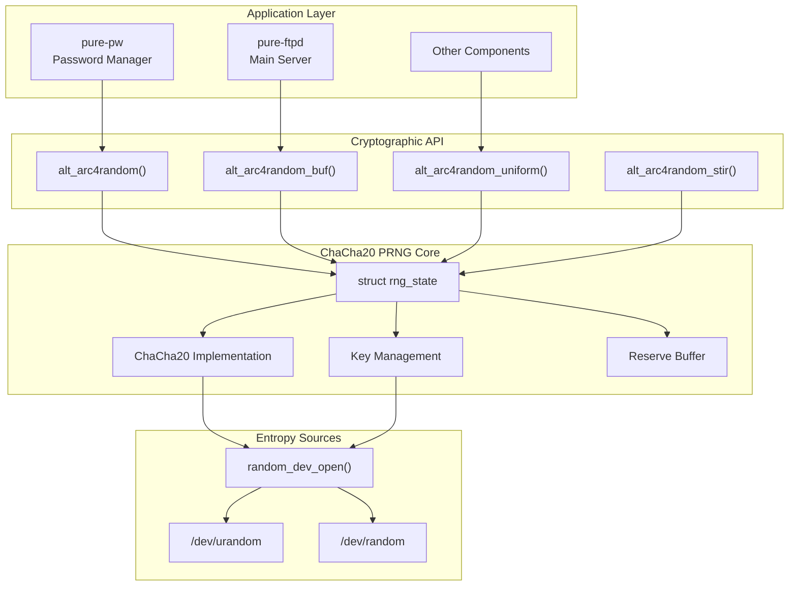
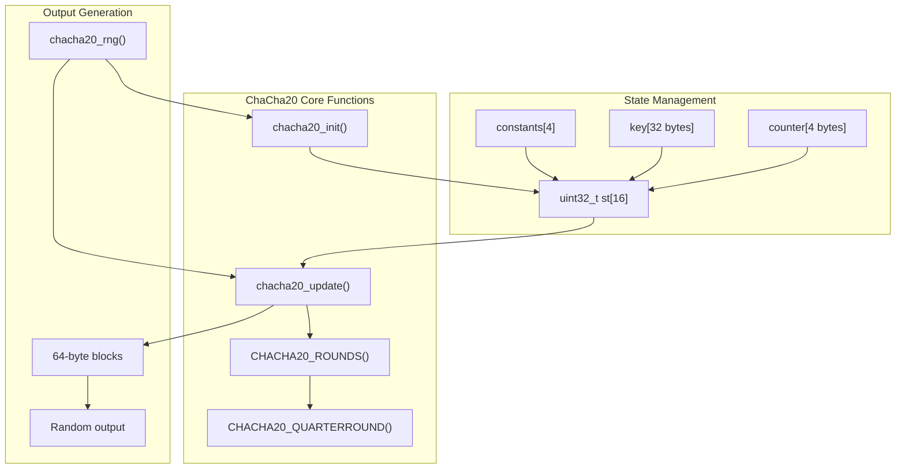
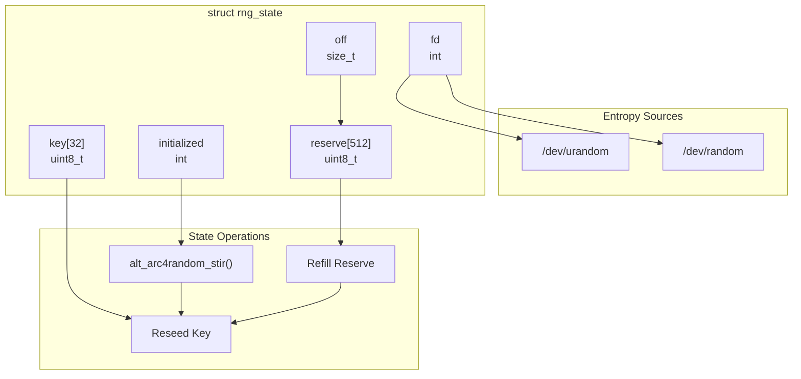
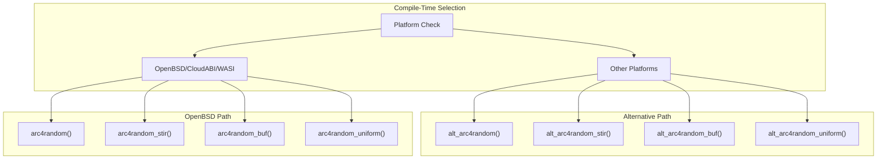
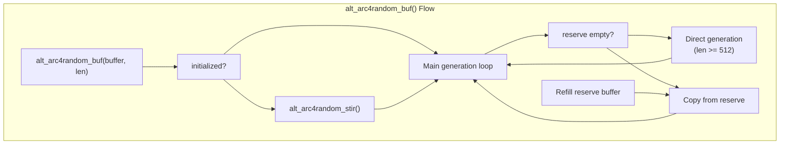
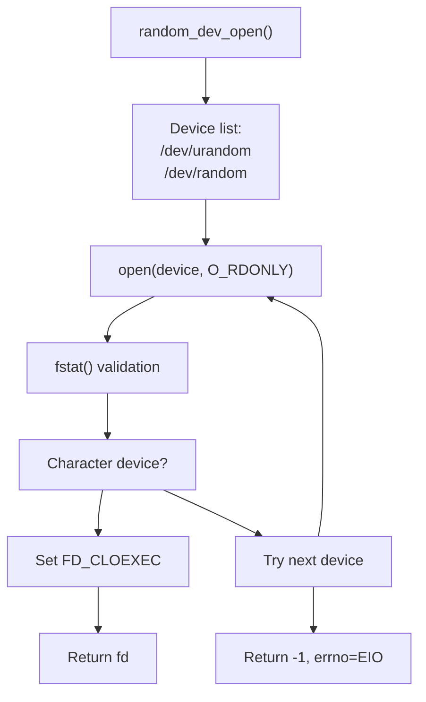

# Cryptographic Services

> **Relevant source files**
> * [src/Makefile.am](https://github.com/jedisct1/pure-ftpd/blob/3818577a/src/Makefile.am)
> * [src/alt_arc4random.c](https://github.com/jedisct1/pure-ftpd/blob/3818577a/src/alt_arc4random.c)
> * [src/alt_arc4random.h](https://github.com/jedisct1/pure-ftpd/blob/3818577a/src/alt_arc4random.h)

This document covers Pure-FTPd's cryptographic random number generation system, which provides secure pseudorandom number generation across different platforms. The system implements a ChaCha20-based PRNG (Pseudorandom Number Generator) as an alternative to system-provided random number generators on platforms that lack robust implementations.

For information about TLS/SSL encryption services, see [TLS/SSL Encryption](/jedisct1/pure-ftpd/3.1-tlsssl-encryption). For authentication-related cryptographic functions, see [Authentication and User Management](/jedisct1/pure-ftpd/4-authentication-and-user-management).

## Overview

Pure-FTPd's cryptographic services are primarily focused on providing high-quality random number generation through the `alt_arc4random` implementation. This system serves as a cross-platform replacement for OpenBSD's `arc4random()` family of functions, using the ChaCha20 stream cipher to generate cryptographically secure random numbers.

The implementation is used throughout Pure-FTPd for security-sensitive operations such as:

* Password salt generation in the virtual user system
* Session token generation
* Cryptographic nonce generation
* General-purpose secure random number generation

## System Architecture



Sources: [src/alt_arc4random.c L1-L240](https://github.com/jedisct1/pure-ftpd/blob/3818577a/src/alt_arc4random.c#L1-L240)

 [src/alt_arc4random.h L1-L31](https://github.com/jedisct1/pure-ftpd/blob/3818577a/src/alt_arc4random.h#L1-L31)

 [src/Makefile.am L25-L29](https://github.com/jedisct1/pure-ftpd/blob/3818577a/src/Makefile.am#L25-L29)

 [src/Makefile.am L213-L228](https://github.com/jedisct1/pure-ftpd/blob/3818577a/src/Makefile.am#L213-L228)

## ChaCha20 Implementation

The core of the cryptographic system is a ChaCha20 stream cipher implementation that provides the pseudorandom number generation. ChaCha20 is a modern, high-security cipher designed by Daniel J. Bernstein.



Sources: [src/alt_arc4random.c L28-L88](https://github.com/jedisct1/pure-ftpd/blob/3818577a/src/alt_arc4random.c#L28-L88)

 [src/alt_arc4random.c L13-L26](https://github.com/jedisct1/pure-ftpd/blob/3818577a/src/alt_arc4random.c#L13-L26)

### ChaCha20 Constants and Parameters

The implementation uses standard ChaCha20 parameters:

| Parameter | Value | Purpose |
| --- | --- | --- |
| Key Size | 32 bytes | ChaCha20 key length |
| Block Size | 64 bytes | Output block size |
| Rounds | 20 | Security rounds |
| Constants | "expand 32-byte k" | ChaCha20 magic constants |

The magic constants are implemented as [src/alt_arc4random.c L60-L62](https://github.com/jedisct1/pure-ftpd/blob/3818577a/src/alt_arc4random.c#L60-L62)

:

```javascript
static const uint32_t constants[4] = {
    0x61707865, 0x3320646e, 0x79622d32, 0x6b206574
};
```

## Random Number Generator State

The system maintains global state through the `rng_state` structure, which manages the PRNG's internal state and entropy source connections.



Sources: [src/alt_arc4random.c L90-L98](https://github.com/jedisct1/pure-ftpd/blob/3818577a/src/alt_arc4random.c#L90-L98)

 [src/alt_arc4random.c L138-L153](https://github.com/jedisct1/pure-ftpd/blob/3818577a/src/alt_arc4random.c#L138-L153)

### Reserve Buffer System

The implementation uses a 512-byte reserve buffer (`RNG_RESERVE_LEN`) to optimize performance by reducing the frequency of ChaCha20 operations and system calls to entropy sources.

## Platform Compatibility Layer

The system provides a compatibility layer that automatically selects between the native system implementation and the custom ChaCha20 implementation based on the target platform.



Sources: [src/alt_arc4random.h L8-L26](https://github.com/jedisct1/pure-ftpd/blob/3818577a/src/alt_arc4random.h#L8-L26)

 [src/alt_arc4random.c L3-L4](https://github.com/jedisct1/pure-ftpd/blob/3818577a/src/alt_arc4random.c#L3-L4)

## API Functions

The cryptographic services provide a complete API compatible with OpenBSD's `arc4random()` family:

### Core Functions

| Function | Purpose | Return Type |
| --- | --- | --- |
| `alt_arc4random()` | Generate 32-bit random number | `uint32_t` |
| `alt_arc4random_buf()` | Fill buffer with random data | `void` |
| `alt_arc4random_uniform()` | Generate uniform random in range | `uint32_t` |
| `alt_arc4random_stir()` | Force reseeding from entropy source | `void` |
| `alt_arc4random_close()` | Cleanup and close resources | `int` |

### Function Implementation Details



Sources: [src/alt_arc4random.c L155-L190](https://github.com/jedisct1/pure-ftpd/blob/3818577a/src/alt_arc4random.c#L155-L190)

 [src/alt_arc4random.c L192-L199](https://github.com/jedisct1/pure-ftpd/blob/3818577a/src/alt_arc4random.c#L192-L199)

 [src/alt_arc4random.c L201-L217](https://github.com/jedisct1/pure-ftpd/blob/3818577a/src/alt_arc4random.c#L201-L217)

## Entropy Source Management

The system manages entropy sources through a robust device selection and management system that prioritizes `/dev/urandom` over `/dev/random` for better performance while maintaining security.

### Device Selection Logic



Sources: [src/alt_arc4random.c L100-L136](https://github.com/jedisct1/pure-ftpd/blob/3818577a/src/alt_arc4random.c#L100-L136)

### Error Handling

The system implements robust error handling with fallback mechanisms:

* If entropy source access fails, the process aborts to prevent weak randomness
* File descriptor management includes proper cleanup and close-on-exec flags
* Safe read operations ensure complete entropy collection

## Integration Points

The cryptographic services integrate with several Pure-FTPd components:

### Build System Integration

The `alt_arc4random` module is included in multiple build targets:

* `libpureftpd.a` - Main server library
* `pure-pw` - Virtual user password management tool

### Usage in Components

| Component | Usage Pattern |
| --- | --- |
| `pure-pw` | Password salt generation |
| Main server | Session tokens, nonces |
| Authentication | Random challenge generation |

Sources: [src/Makefile.am L28](https://github.com/jedisct1/pure-ftpd/blob/3818577a/src/Makefile.am#L28-L28)

 [src/Makefile.am L214](https://github.com/jedisct1/pure-ftpd/blob/3818577a/src/Makefile.am#L214-L214)

## Security Considerations

The implementation includes several security features:

1. **Forward Secrecy**: Key rotation after each use prevents state recovery attacks
2. **Secure Cleanup**: `pure_memzero()` ensures sensitive data is cleared [src/alt_arc4random.c L222](https://github.com/jedisct1/pure-ftpd/blob/3818577a/src/alt_arc4random.c#L222-L222)
3. **Entropy Validation**: Device validation ensures only proper entropy sources are used
4. **Fail-Safe Design**: System aborts if entropy sources are unavailable rather than falling back to weak randomness

The ChaCha20-based design provides security advantages over traditional linear congruential generators and provides consistent security properties across all supported platforms.

Sources: [src/alt_arc4random.c L219-L227](https://github.com/jedisct1/pure-ftpd/blob/3818577a/src/alt_arc4random.c#L219-L227)

 [src/alt_arc4random.c L144-L150](https://github.com/jedisct1/pure-ftpd/blob/3818577a/src/alt_arc4random.c#L144-L150)